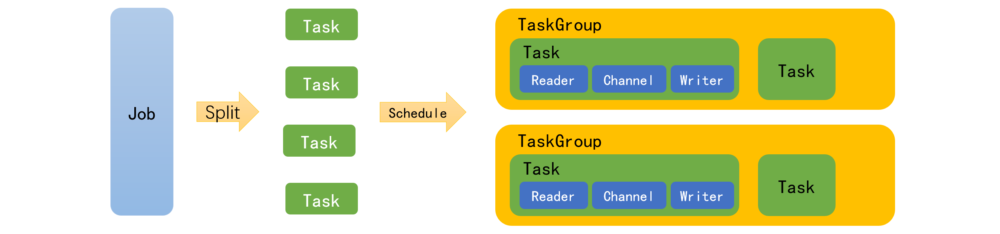

# 一、简介

> DataX 是阿里巴巴开源的一个异构数据源离线同步工具，致力于实现包括关系型数据库(MySQL、Oracle等)、HDFS、Hive、ODPS、HBase、FTP等各种异构数据源之间稳定高效的数据同步功能

[网址](https://github.com/alibaba/DataX)

## 支持的数据源

| 类型               | 数据源                          | Reader(读) | Writer(写) | 文档                                                         |
| ------------------ | ------------------------------- | ---------- | ---------- | ------------------------------------------------------------ |
| RDBMS 关系型数据库 | MySQL                           | √          | √          | [读](https://github.com/alibaba/DataX/blob/master/mysqlreader/doc/mysqlreader.md) 、[写](https://github.com/alibaba/DataX/blob/master/mysqlwriter/doc/mysqlwriter.md) |
|                    | Oracle                          | √          | √          | [读](https://github.com/alibaba/DataX/blob/master/oraclereader/doc/oraclereader.md) 、[写](https://github.com/alibaba/DataX/blob/master/oraclewriter/doc/oraclewriter.md) |
|                    | OceanBase                       | √          | √          | [读](https://open.oceanbase.com/docs/community/oceanbase-database/V3.1.0/use-datax-to-full-migration-data-to-oceanbase) 、[写](https://open.oceanbase.com/docs/community/oceanbase-database/V3.1.0/use-datax-to-full-migration-data-to-oceanbase) |
|                    | SQLServer                       | √          | √          | [读](https://github.com/alibaba/DataX/blob/master/sqlserverreader/doc/sqlserverreader.md) 、[写](https://github.com/alibaba/DataX/blob/master/sqlserverwriter/doc/sqlserverwriter.md) |
|                    | PostgreSQL                      | √          | √          | [读](https://github.com/alibaba/DataX/blob/master/postgresqlreader/doc/postgresqlreader.md) 、[写](https://github.com/alibaba/DataX/blob/master/postgresqlwriter/doc/postgresqlwriter.md) |
|                    | DRDS                            | √          | √          | [读](https://github.com/alibaba/DataX/blob/master/drdsreader/doc/drdsreader.md) 、[写](https://github.com/alibaba/DataX/blob/master/drdswriter/doc/drdswriter.md) |
|                    | 通用RDBMS(支持所有关系型数据库) | √          | √          | [读](https://github.com/alibaba/DataX/blob/master/rdbmsreader/doc/rdbmsreader.md) 、[写](https://github.com/alibaba/DataX/blob/master/rdbmswriter/doc/rdbmswriter.md) |
| 阿里云数仓数据存储 | ODPS                            | √          | √          | [读](https://github.com/alibaba/DataX/blob/master/odpsreader/doc/odpsreader.md) 、[写](https://github.com/alibaba/DataX/blob/master/odpswriter/doc/odpswriter.md) |
|                    | ADS                             |            | √          | [写](https://github.com/alibaba/DataX/blob/master/adswriter/doc/adswriter.md) |
|                    | OSS                             | √          | √          | [读](https://github.com/alibaba/DataX/blob/master/ossreader/doc/ossreader.md) 、[写](https://github.com/alibaba/DataX/blob/master/osswriter/doc/osswriter.md) |
|                    | OCS                             |            | √          | [写](https://github.com/alibaba/DataX/blob/master/ocswriter/doc/ocswriter.md) |
| NoSQL数据存储      | OTS                             | √          | √          | [读](https://github.com/alibaba/DataX/blob/master/otsreader/doc/otsreader.md) 、[写](https://github.com/alibaba/DataX/blob/master/otswriter/doc/otswriter.md) |
|                    | Hbase0.94                       | √          | √          | [读](https://github.com/alibaba/DataX/blob/master/hbase094xreader/doc/hbase094xreader.md) 、[写](https://github.com/alibaba/DataX/blob/master/hbase094xwriter/doc/hbase094xwriter.md) |
|                    | Hbase1.1                        | √          | √          | [读](https://github.com/alibaba/DataX/blob/master/hbase11xreader/doc/hbase11xreader.md) 、[写](https://github.com/alibaba/DataX/blob/master/hbase11xwriter/doc/hbase11xwriter.md) |
|                    | Phoenix4.x                      | √          | √          | [读](https://github.com/alibaba/DataX/blob/master/hbase11xsqlreader/doc/hbase11xsqlreader.md) 、[写](https://github.com/alibaba/DataX/blob/master/hbase11xsqlwriter/doc/hbase11xsqlwriter.md) |
|                    | Phoenix5.x                      | √          | √          | [读](https://github.com/alibaba/DataX/blob/master/hbase20xsqlreader/doc/hbase20xsqlreader.md) 、[写](https://github.com/alibaba/DataX/blob/master/hbase20xsqlwriter/doc/hbase20xsqlwriter.md) |
|                    | MongoDB                         | √          | √          | [读](https://github.com/alibaba/DataX/blob/master/mongodbreader/doc/mongodbreader.md) 、[写](https://github.com/alibaba/DataX/blob/master/mongodbwriter/doc/mongodbwriter.md) |
|                    | Hive                            | √          | √          | [读](https://github.com/alibaba/DataX/blob/master/hdfsreader/doc/hdfsreader.md) 、[写](https://github.com/alibaba/DataX/blob/master/hdfswriter/doc/hdfswriter.md) |
|                    | Cassandra                       | √          | √          | [读](https://github.com/alibaba/DataX/blob/master/cassandrareader/doc/cassandrareader.md) 、[写](https://github.com/alibaba/DataX/blob/master/cassandrawriter/doc/cassandrawriter.md) |
| 无结构化数据存储   | TxtFile                         | √          | √          | [读](https://github.com/alibaba/DataX/blob/master/txtfilereader/doc/txtfilereader.md) 、[写](https://github.com/alibaba/DataX/blob/master/txtfilewriter/doc/txtfilewriter.md) |
|                    | FTP                             | √          | √          | [读](https://github.com/alibaba/DataX/blob/master/ftpreader/doc/ftpreader.md) 、[写](https://github.com/alibaba/DataX/blob/master/ftpwriter/doc/ftpwriter.md) |
|                    | HDFS                            | √          | √          | [读](https://github.com/alibaba/DataX/blob/master/hdfsreader/doc/hdfsreader.md) 、[写](https://github.com/alibaba/DataX/blob/master/hdfswriter/doc/hdfswriter.md) |
|                    | Elasticsearch                   |            | √          | [写](https://github.com/alibaba/DataX/blob/master/elasticsearchwriter/doc/elasticsearchwriter.md) |
| 时间序列数据库     | OpenTSDB                        | √          |            | [读](https://github.com/alibaba/DataX/blob/master/opentsdbreader/doc/opentsdbreader.md) |
|                    | TSDB                            | √          | √          | [读](https://github.com/alibaba/DataX/blob/master/tsdbreader/doc/tsdbreader.md) 、[写](https://github.com/alibaba/DataX/blob/master/tsdbwriter/doc/tsdbhttpwriter.md) |
|                    | TDengine                        | √          | √          | [读](https://github.com/alibaba/DataX/blob/master/tdenginereader/doc/tdenginereader-CN.md) 、[写](https://github.com/alibaba/DataX/blob/master/tdenginewriter/doc/tdenginewriter-CN.md) |


## 架构原理

### 设计理念

> DataX将复杂的网状的同步链路变成了星型数据链路


### 框架内部结构

> DataX本身作为离线数据同步框架，采用Framework + plugin架构构建。将数据源读取和写入抽象成为Reader/Writer插件


- Reader：数据采集模块，负责采集数据源的数据，将数据发送给Framework。
- Writer：数据写入模块，负责不断向Framework取数据，并将数据写入到目的端。
- Framework：用于连接reader和writer，作为两者的数据传输通道，并处理缓冲，流控，并发，数据转换等核心技术问题。


### 运行流程

> 类比 kafka消费者组 




- **Job**：单个数据同步的作业，称为一个Job，一个Job启动一个进程。
- **Task**：根据不同数据源的切分策略
  - 一个Job会切分为多个Task
  - Task是DataX作业的最小单元，每个Task负责一部分数据的同步工作。
- **TaskGroup**：**调度模块**会对Task进行分组
  - 每个Task组称为一个Task Group
  - 每个Task Group负责以一定的并发度运行其所分得的Task，单个Task Group的并发度为5。
- **Reader👉Channel👉Writer**：每个Task启动后，都会固定启动Reader👉Channel👉Writer的线程来完成同步工作。


### 调度决策流程

------

> 背景：用户提交了一个DataX作业，并且配置了总的并发度为20，目的是对一个有100张分表的mysql数据源进行同步

- **确定Task**
  - 100张表   👉   100个Task
- **确定TaskGroup个数**
  - 总的并发度20，每个Task Group的并发度5
  - 20/5=4=TaskGroup个数
- **确定每个TaskGroup的Task数量**
  - 4个TaskGroup平分100个Task
  - 100/4=25 =每个TaskGroup的Task数量


### 对比Sqoop

------


| **功能** |          **DataX**           |          **Sqoop**           |
| :------: | :--------------------------: | :--------------------------: |
| 运行模式 |         单进程多线程         |              MR              |
|  分布式  | 不支持，可以通过调度系统规避 |             支持             |
|   流控   |          有流控功能          |           需要定制           |
| 统计信息 |   已有一些统计，上报需定制   | 没有，分布式的数据收集不方便 |
| 数据校验 |     在core部分有校验功能     | 没有，分布式的数据收集不方便 |
|   监控   |           需要定制           |           需要定制           |


# 二、DataX使用

## 安装部署

- [下载](http://datax-opensource.oss-cn-hangzhou.aliyuncs.com/datax.tar.gz)并上传至102的/opt/software

- 解压datax.tar.gz到/opt/module

- 自检

  - ```sh
    $ python /opt/module/datax/bin/datax.py /opt/module/datax/job/job.json
    ```

  - 出现如下内容，则表明安装成功

    ```sh
    ……
    2021-10-12 21:51:12.335 [job-0] INFO  JobContainer - 
    任务启动时刻                    : 2021-10-12 21:51:02
    任务结束时刻                    : 2021-10-12 21:51:12
    任务总计耗时                    :                 10s
    任务平均流量                    :          253.91KB/s
    记录写入速度                    :          10000rec/s
    读出记录总数                    :              100000
    读写失败总数                    :                   0
    
    ```

    

## 使用

### 任务提交命令

------


- 根据自己同步数据的数据源和目的地选择相应的Reader和Writer

- 将Reader和Writer的信息配置在一个json文件中

- 执行如下命令提交数据同步任务

  - ```sh
    $ python bin/datax.py path/to/your/job.json
    #							👆自己配置的json文件路径
    ```


### 配置文件

------

#### 查看配置文件模板

```sh
$ python bin/datax.py -r mysqlreader -w hdfswriter
```

```json
{
    "job": {
        "content": [
            {
                "reader": {
                    "name": "mysqlreader",
                    "parameter": {
                        "column": [],
                        "connection": [
                            {
                                "jdbcUrl": [],
                                "table": []
                            }
                        ],
                        "password": "",
                        "username": "",
                        "where": ""
                    }
                },
                "writer": {
                    "name": "hdfswriter",
                    "parameter": {
                        "column": [],
                        "compress": "",
                        "defaultFS": "",
                        "fieldDelimiter": "",
                        "fileName": "",
                        "fileType": "",
                        "path": "",
                        "writeMode": ""
                    }
                }
            }
        ],
        "setting": {
            "speed": {
                "channel": ""
            }
        }
    }
}

```


#### 配置文件格式

------

- **job**

  - [^content]:数据源和目的地相关配置

    

    - [^reader]:Reader相关配置

      - [^name]:Reader名称  不可随意命名

      - [^parameter]:Reader配置参数

    - [^writer]:Writer相关配置

      - [^name]:Writer名称 不可随意命名

      - [^parameter]:Writer配置参数

  

  - [^settings]: Job配置参数  包括限速配置

    

[具体配置见文档](##支持的数据源)


## Mysql  ⏩   HDFS

> 背景：同步gmall数据库中base_province表数据到HDFS的/base_province目录

**分析步骤**

- **插件选择**
  - MySQLReader  和  HDFSWriter
- **Reader两种模式选择**
  - TableMode   和   QuerySQLMode

[^TableMode]:用table，column，where等属性声明需要同步的数据
[^QuerySQLMode]: 使用一条SQL查询语句声明需要同步的数据


### Mysql ——TableMode

------

#### 详细配置

```json
{
    "job": {
        "content": [
            {
                "reader": {
                    "name": "mysqlreader",
                    "parameter": {
                        "connection": [
                            {
                                "jdbcUrl": [
                                    "jdbc:mysql://E-com102:3306/gmall"
                                ],
                                "querySql": [
                                    "select id,name,region_id,area_code,iso_code,iso_3166_2 from base_province where id>=3"
                                ]
                            }
                        ],
                        "password": "123456",
                        "username": "root"
                    }
                },
                "writer": {
                    "name": "hdfswriter",
                    "parameter": {
                        "column": [
                            {
                                "name": "id",
                                "type": "bigint"
                            },
                            {
                                "name": "name",
                                "type": "string"
                            },
                            {
                                "name": "region_id",
                                "type": "string"
                            },
                            {
                                "name": "area_code",
                                "type": "string"
                            },
                            {
                                "name": "iso_code",
                                "type": "string"
                            },
                            {
                                "name": "iso_3166_2",
                                "type": "string"
                            }
                        ],
                        "compress": "gzip",
                        "defaultFS": "hdfs://E-com:8020",
                        "fieldDelimiter": "\t",
                        "fileName": "base_province",
                        "fileType": "text",
                        "path": "/base_province",
                        "writeMode": "append"
                    }
                }
            }
        ],
        "setting": {
            "speed": {
                "channel": 1
            }
        }
    }
}

```


#### 参数说明👇

**Reader**


```json
{
    "name": "mysqlreader",    //Reader名称，固定写法
    "parameter": {
        "username": "root",		//数据库用户名
        "password": “123456",	//数据库密码
        "connection": [
            {
                "jdbcUrl": ["jdbc:mysql://hadoop102:3306/gmall"],   //数据库JDBC URL可配置一个连接多个库
                "table": ["base_province"]					//需要同步的表名
            }
        ],
		//需要同步的列，["*"]代表所有列
        "column": ["id", "name", "region_id", "area_code", "iso_code", "iso_3166_2"],    
		//where 过滤条件
        "where": "id>=3",
        "splitPk": ""  
    }
}

```

[^splitPk]:分片字段，如果指定该字段，则DataX会启动多个Task同步数据；若未指定(不提供splitPk或者splitPk值为空)，则只会有有单个Task。该参数只在TableMode下有效，意味着在QuerySQLMode下，只会有单个Task。Mysql一般切为5倍的并发数。


**Writer**

```json
{
    "name": "hdfswriter",    //Writer名称，固定写法
    "parameter": {
        "column": [
            {
                "name": "id",
                "type": "bigint"
            }, {
                "name": "name",
                "type": "string"
            },
            ......
        ],
        "defaultFS": "hdfs://hadoop102:8020",	//HDFS文件系统namenode节点地址
        "path": "/base_province",			//HDFS文件系统目标路径
        "fileName": "base_province",		//HDFS文件名前缀
        "fileType": "text",					//HDFS文件类型，目前支持"text"或"orc"
        "compress": "gzip",   				//HDFS压缩类型，text文件支持gzip、bzip2；orc文件支持有SNAPPY
        "fieldDelimiter": "\t",				//HDFS文件字段分隔符
        "writeMode": "append"    			//数据写入模式，append：追加；nonConflict：若写入目录有同名(前缀相同)文件，报错
    }   
}

```

[^column]:列信息，包括列名和类型。类型为Hive表字段类型，目前不支持decimal、binary、arrays、maps、structs等类型。若MySQL数据源中包含decimal类型字段，此处可将该字段类型设置为string，hive表中仍设置为decimal类型


| writeMode  |                                                         |
| :--------: | :-----------------------------------------------------: |
|   append   |                          追加                           |
| noConflict | 既不追加也不覆盖   但写入目录有同名(前缀相同)文件，报错 |


[^注意事项]: HFDS Writer并未提供nullFormat参数：也就是用户并不能自定义null值写到HFDS文件中的存储格式。默认情况下，HFDS Writer会将null值存储为空字符串（''），而Hive默认的null值存储格式为\N。所以后期将DataX同步的文件导入Hive表就会出现问题

**解决方案**

- 一、[修改源码](https://blog.csdn.net/u010834071/article/details/105506580)

- 二、在Hive中建表时指定null值存储格式为空字符串（''）

  - ```sql
    DROP TABLE IF EXISTS base_province;
    CREATE EXTERNAL TABLE base_province
    (
        `id`         STRING COMMENT '编号',
        `name`       STRING COMMENT '省份名称',
        `region_id`  STRING COMMENT '地区ID',
        `area_code`  STRING COMMENT '地区编码',
        `iso_code`   STRING COMMENT '旧版ISO-3166-2编码，供可视化使用',
        `iso_3166_2` STRING COMMENT '新版IOS-3166-2编码，供可视化使用'
    ) COMMENT '省份表'
        ROW FORMAT DELIMITED FIELDS TERMINATED BY '\t'
        NULL DEFINED AS ''
        LOCATION '/base_province/';
    
    ```


**Setting**

```json
{
    "setting": {
        "speed": {					//传输速度配置
            "channel": 1			//并发数，最终的并发数并不一定是该值，后边章节会进行解释说明
        },
        "errorLimit": {				//容错比例配置
            "record": 1,			//错误条数上限，超出则任务失败
            "percentage": 0.02		//错误比例上限，超出则任务失败
        }
    }
}

```


### Mysql ——QuerySQLMode

------

#### 详细配置

```json
{
    "job": {
        "content": [
            {
                "reader": {
                    "name": "mysqlreader",
                    "parameter": {
                        "connection": [
                            {
                                "jdbcUrl": [
                                    "jdbc:mysql://E-com102:3306/gmall"
                                ],
                                "querySql": [
                                    "select id,name,region_id,area_code,iso_code,iso_3166_2 from base_province where id>=3"
                                ]
                            }
                        ],
                        "password": "123456",
                        "username": "root"
                    }
                },
                "writer": {
                    "name": "hdfswriter",
                    "parameter": {
                        "column": [
                            {
                                "name": "id",
                                "type": "bigint"
                            },
                            {
                                "name": "name",
                                "type": "string"
                            },
                            {
                                "name": "region_id",
                                "type": "string"
                            },
                            {
                                "name": "area_code",
                                "type": "string"
                            },
                            {
                                "name": "iso_code",
                                "type": "string"
                            },
                            {
                                "name": "iso_3166_2",
                                "type": "string"
                            }
                        ],
                        "compress": "gzip",
                        "defaultFS": "hdfs://E-com102:8020",
                        "fieldDelimiter": "\t",
                        "fileName": "base_province",
                        "fileType": "text",
                        "path": "/base_province",
                        "writeMode": "append"
                    }
                }
            }
        ],
        "setting": {
            "speed": {
                "channel": 1
            }
        }
    }
}

```


#### 参数说明👇

**Reader**


```json
{
    "name": "mysqlreader",    //Reader名称，固定写法
    "parameter": {
        "username": "root",		//数据库用户名
        "password": “123456",	//数据库密码
        "connection": [
            {
                "jdbcUrl": ["jdbc:mysql://E-com102:3306/gmall"],   //数据库JDBC URL可配置一个连接多个库
                "querySql": [
                    "select id,name,region_id,area_code,iso_code,iso_3166_2       //查询语句    
                     from base_province where id>=3"
					]
            }
        ]
    }
}

```


