# 一、指标与指标体系

## 简介

### 指标

#### 指标的构成

> 由三个方面构成一个指标

- 维度
- 汇总方式
- 量度

**举个栗子🌰**

------

| 分析公司规模 |                                           |
| ------------ | ----------------------------------------- |
| 维度         | 总人口，   占地面积，生产总值，月均生产量 |
| 汇总方式     | 求和，       平均值， 其他                |
| 量度         | 人，           平方米，￥，件             |
| **样例指标** | 总人口求和得到多少人  是一个指标          |

==归一	标准化==

### 指标类型

- 基础指标
- 复合指标
- 派生指标

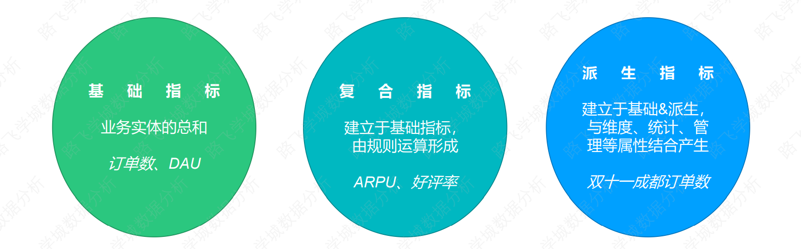

### 指标体系

> 将数据指标系统化的组织起来  关键是对指标的不同属性进行 ==分类和分层==

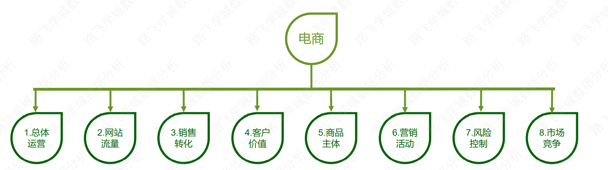

[^PV]: 页面浏览量
[^UV]: 用户浏览量
[^DAU]: 日活
[^SPU]: 标准化产品单元

#### 指标体系的作用

> 从四大方面帮助公司更好的成长

- **全面支持决策**
- **指导业务运营**
- **驱动用户增长**
- **统一统计口径**

##指标体系的搭建

> 使用OSM模型
>

[^O]: object   目标
[^S]: Strategy   策略
[^M]: Measure   度量

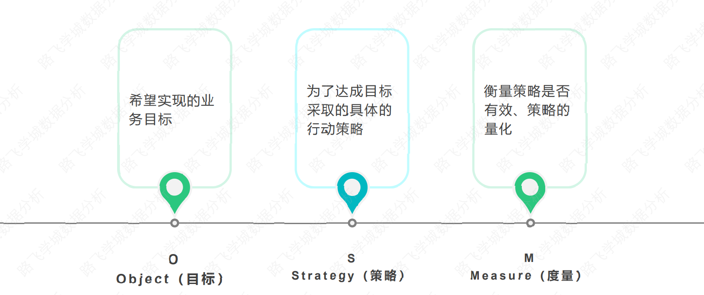

### O

> 确定核心指标

**核心指标别名**

- North Star Metric 北极星指标
- One metric that matters 唯一重要指标
- 全公司的核心主动目标

**确定核心指标的作用**

- 指引公司方向

### S

> 主要使用UJM模型	

[^UJM]: User Journey Map  用户旅程地图

**梳理用户（使用者）的生命旅程**

- **举个栗子🌰**

  ​																				腾讯视频用户地图

  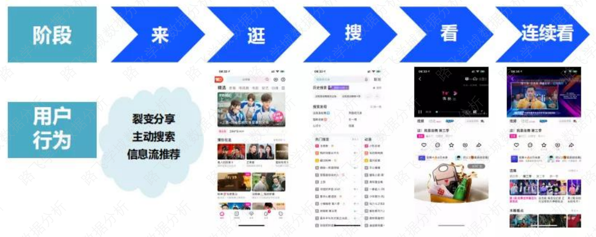

[^一句话]:将用户所处的每一个阶段，做行为拆解。明确每个阶段的目标，找到产品和用户的接触点  从中找痛点和机会点

### M

> 确认每个行为下的实际度量（指标）

#### 互联网核心指标

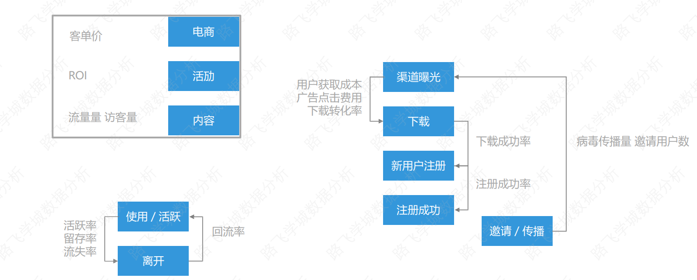

### 小结

> OSM ：从指标体系到行动策略

​																					**视频网站的OSM👇**

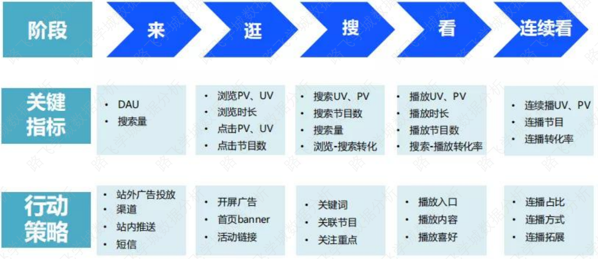

1. 从0到1搭建指标体系对于初级数据分析师来说是非常艰难的
2. 一般情况下一级、二级指标（基础、复合）是由业务leader带领团队一起建立
3. 但是三级指标（派生指标）的细化与拆解，是我们作为分析师找到关键问题细化业务的必备技能

**熟悉公司业务老师建议**

- 看架构图  确认部门细分
- 熟悉业务数据表 每张表记录什么  
- 找运营 多个  了解工作流程  与核心指标

## 用户路径解析

> 能达到目的路径越短，过程中的流失就会越少

**流程解析**

- 确立路线图
- 确立指标
- 拆解指标

### 确立路线图

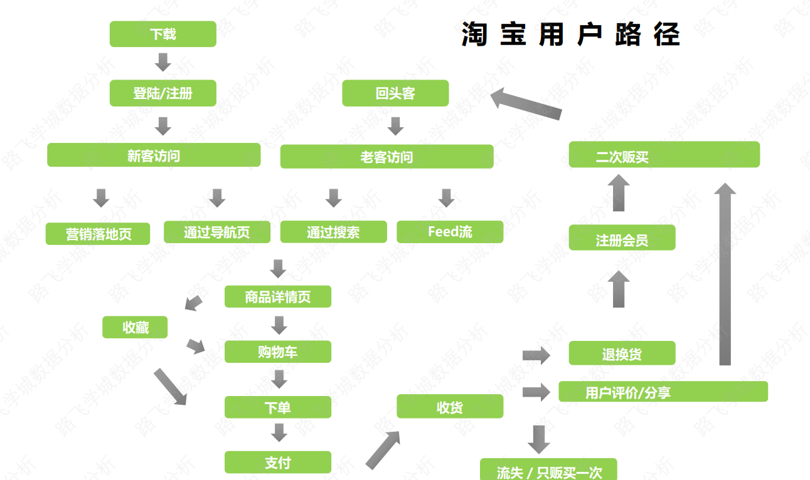

### 内容平台

[^UGC]: User-generated Content		用户生成内容
[^OGC]: Occupationally-generated Content		品牌生产内容
[^PGC]: Professionally-generated Content		专业生产内容

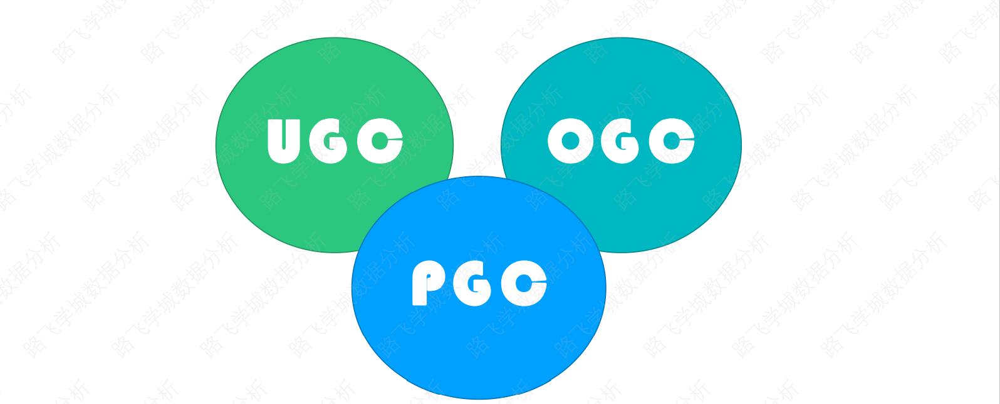

**用户激励模型**

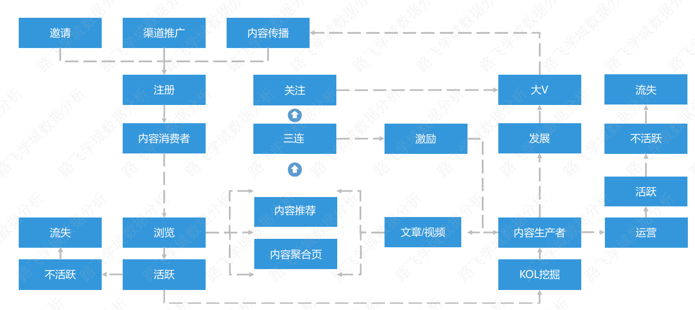

### 确立指标

> 主要是建立用户画像  从四个方面入手

==用户静态属性、用户动态属性、用户消费属性、用户心理属性。==

**静态属性**

- 是用户画像建立的基础。比如：性别、年龄、学历、角色、收入、地域、婚姻等。

**动态属性**

- 指用户在再互联网环境下的上网行为，娱乐偏好、社交习惯、出行方式、学习手段等，这些一定程度上能反映出一个用户是否会对你的产品感兴趣

**消费属性**

- 主要包括消费水平、消费心理、消费嗜好等，反映用户对于花钱的看法，是喜欢质量好的还是性价比高的

**心理属性**

- 用户的生活、工作、感情、社交入手，分析这个人的价值观，并针对性地改良产品

[^一句话]: 给用户打标签

### 指标拆解

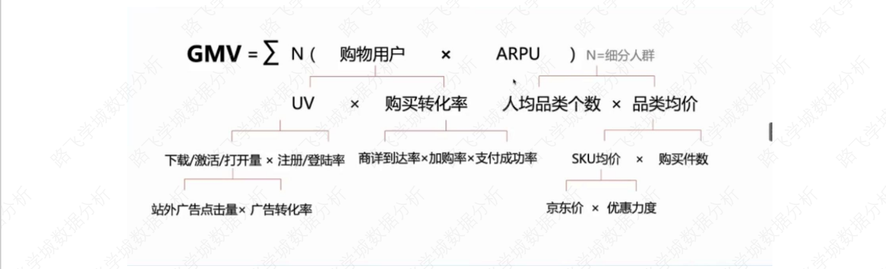

[^GMV（全称Gross Merchandise Volume）]: 商品交易总额
[^SKU全称为Stock Keeping Unit]: 库存量单位   即库存进出计量的基本单元
[^CTR（Click-Through-Rate）]:即点击通过率

# 二、数据分析方法和模型

## 数据分析方法

> 案例：抖音教育直播

### 步骤一：寻找核心指标

- 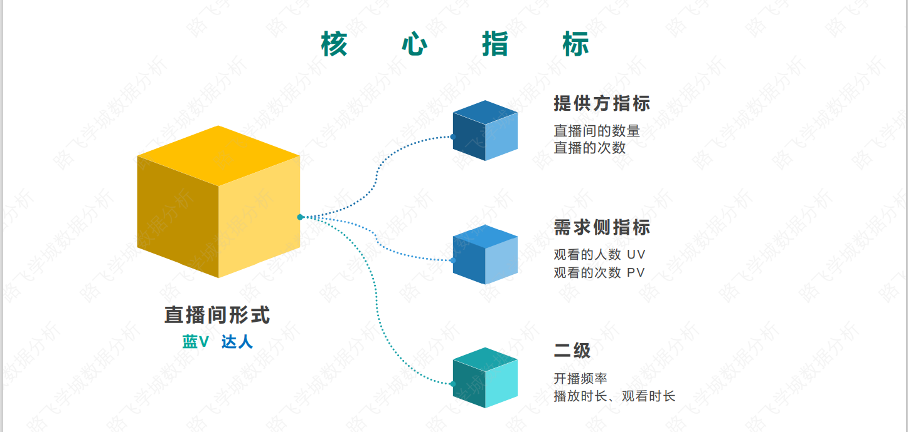

### 步骤二：分析指标

#### 五大方法

> 占比	趋势	对比	象限	排名

- **方法一：占比分析**

  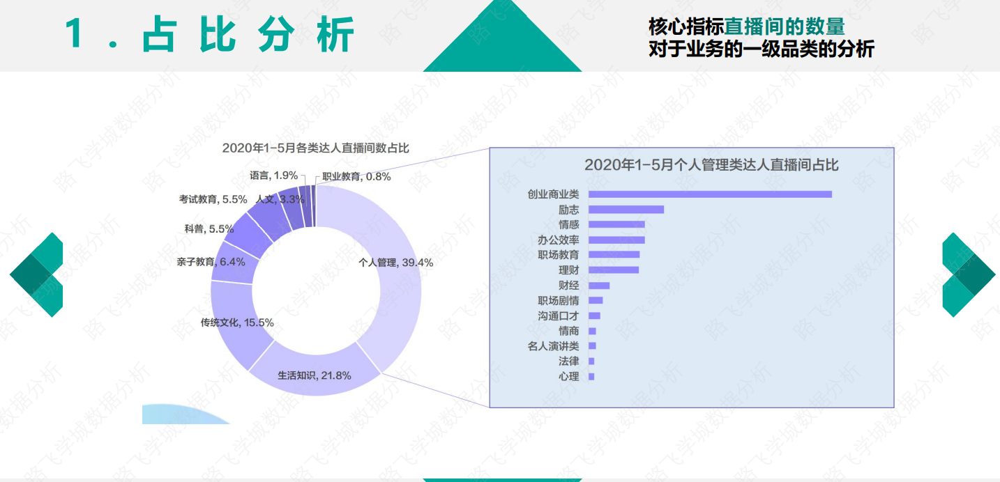

- **方法二：趋势分析**

  ​                                                                                    粗粒度👇

  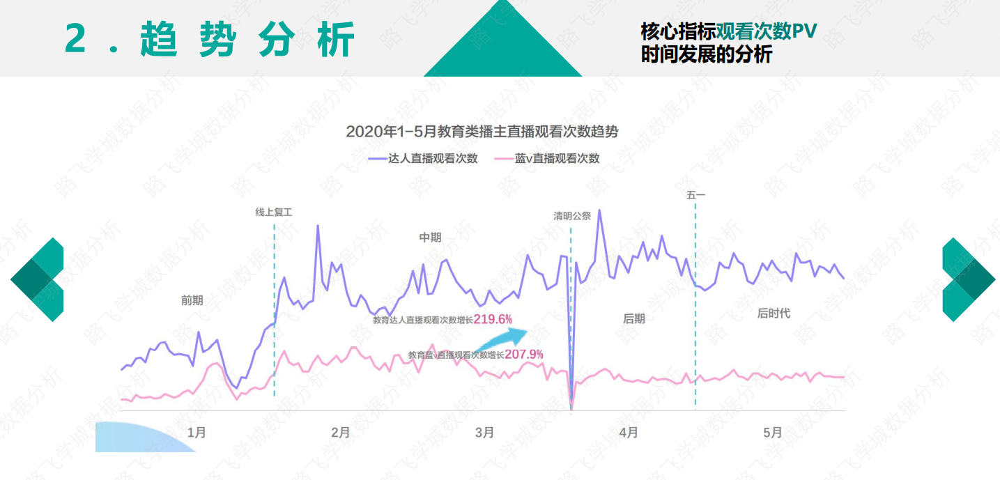

  ​                                                                                   细粒度👇

  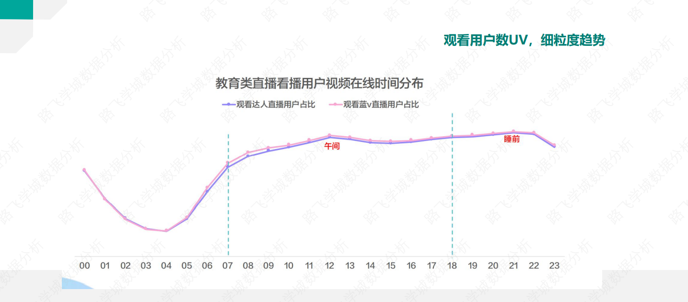

- **方法三：对比分析**

  

  [^环比]: 举个栗子  二月减去一月除以一月 就可以看出来是增长还是下降
  [^同比]: 今年二月份和去年二月份比

- **方法四：象限分析**

  ==分群策略：两个以上核心指标业务对象按照象限划分==

  ​                                                                                    粗粒度👇

  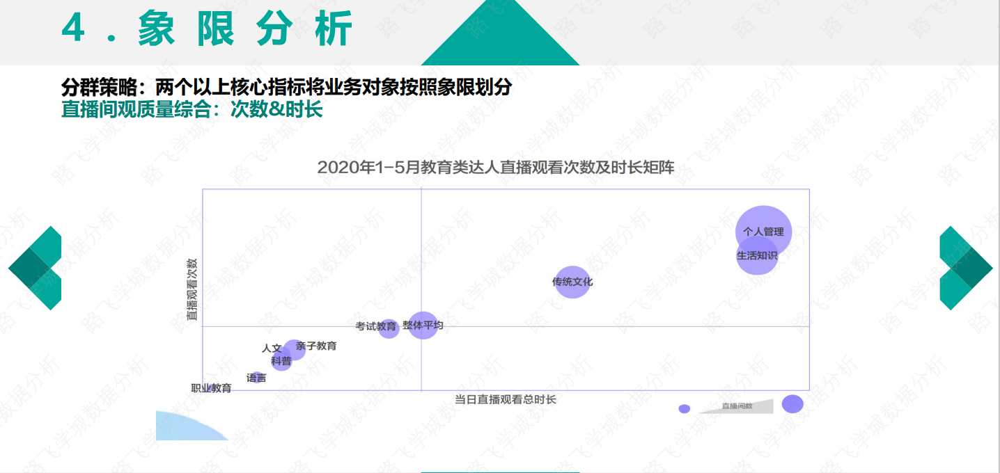

  ​                                                                                    细粒度👇

  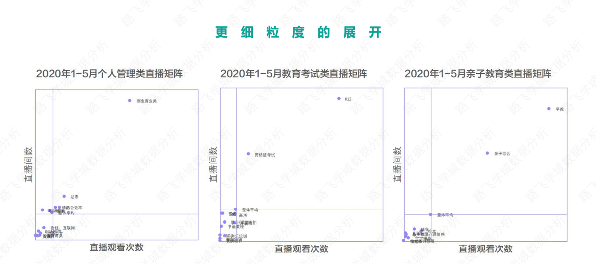

- **方法五：排名分析**

  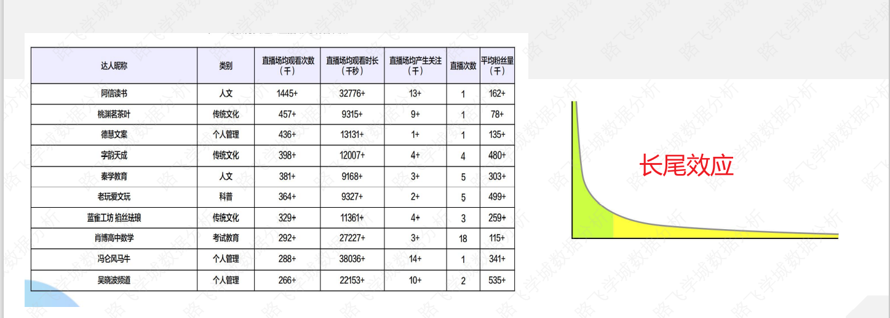

  [^长尾效应]: 大部分集中在核心处

  ​	尽量避开长尾效应

#### 关键因子——维度拆解

> 维度作为趋势、对比、占比等分析的关键因子

**三大方面**

- 地域
- 用户
- 业务

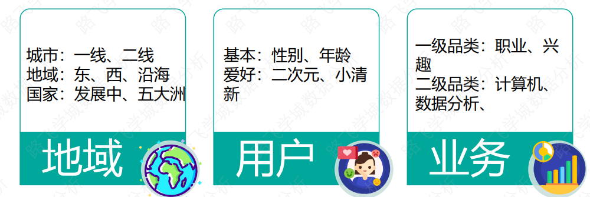

##### 地域维度

[^TGI指数（Target Group Index）]:目标群体中具有某一特征的群体所占比例➗总体中具有相同特征的群体所占比例

例如：

- 超一线城市作为目标群体目标群体中观看达人的占比 55% 
- 用户总体观看达人的占比 50% 
- TGI = （55%/50%） *100 =110

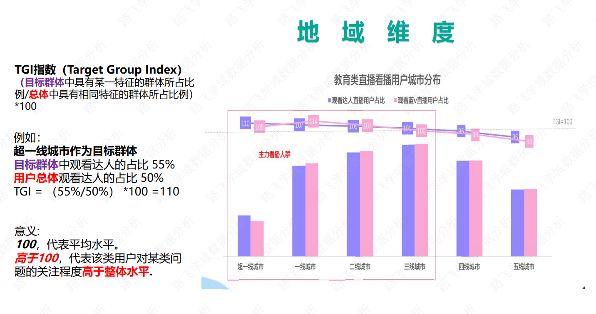

[^TGI=100]: 平均值

##### 用户维度

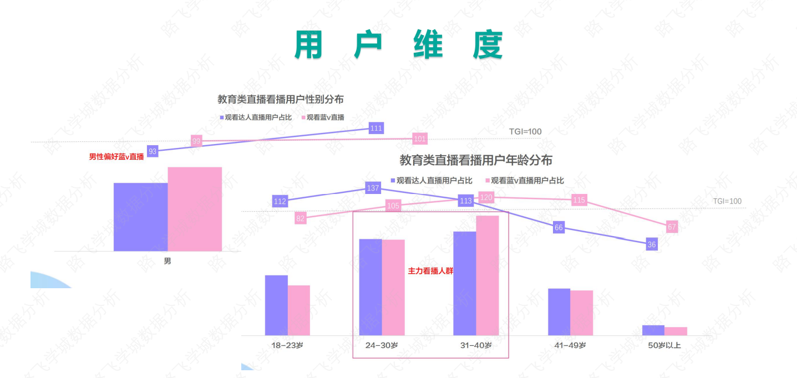

##### 业务维度

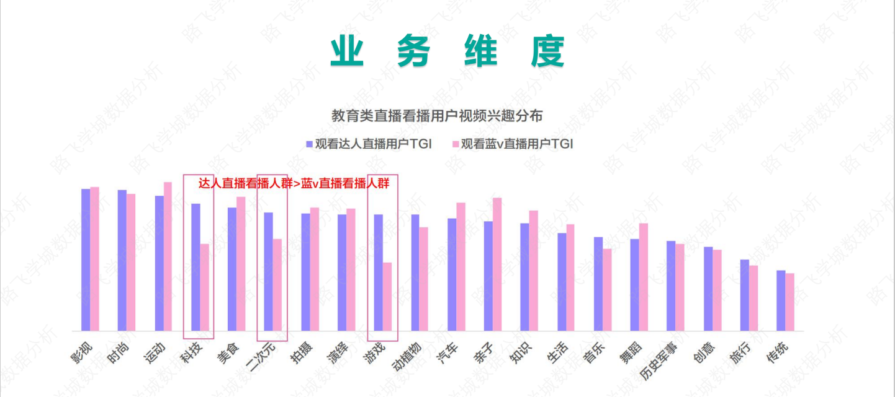

## 数据分析模型

### 模型一🚩：费米问题大致估算

> 从供需关系[^解决80%的费米问题]   空间关系	收入关系	时间关系

#### 供需关系

**🤔北京有多少加油站？**

1. 基本数据常识  如  人口数  占地面积	物品价格

2. 从假设出发

   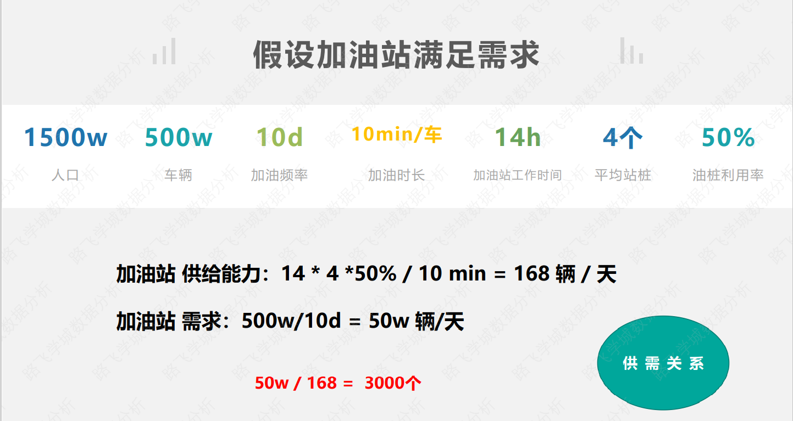

#### 空间关系

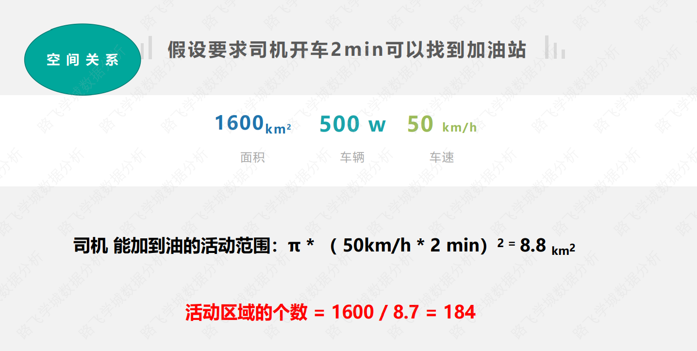

#### 收入关系

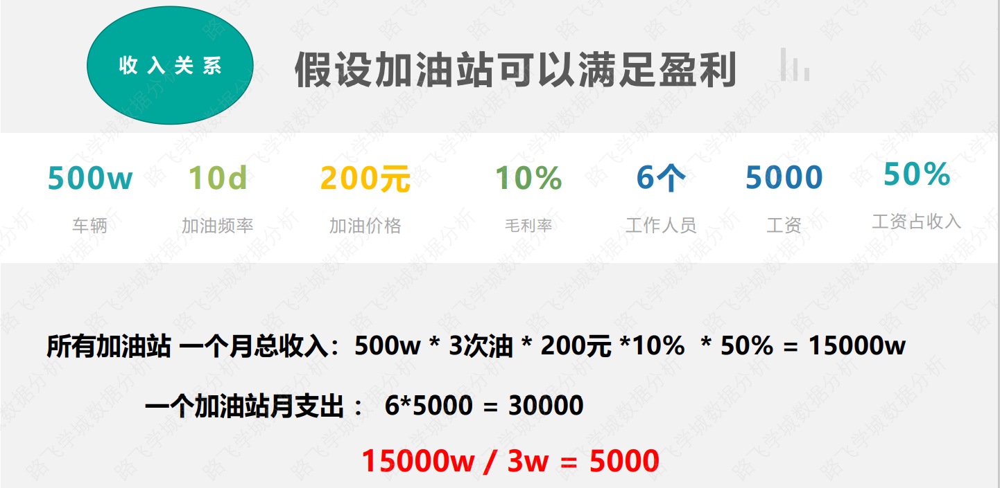

### 模型二：7问分析法-思考角度的拓展

> 要如何做
>
> - 提问  或  寻找背景信息
> - 利用5W2H思考  向里面填入指标

5W2H

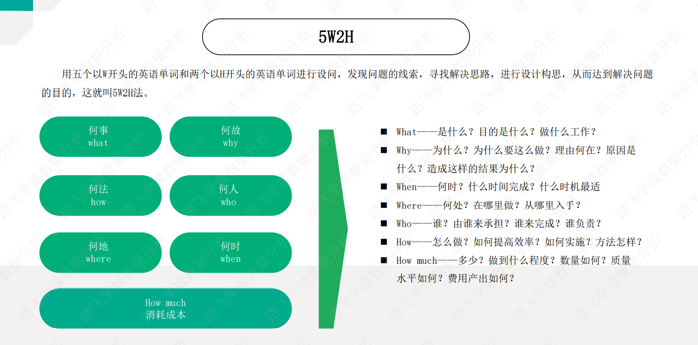

**问题一**

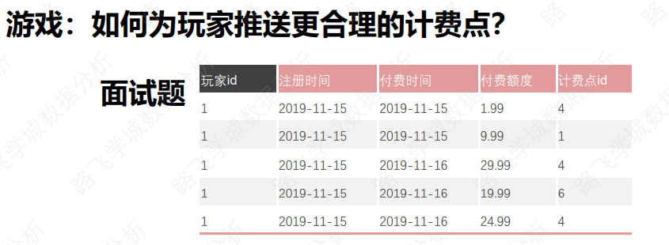

- 寻找背景信息

  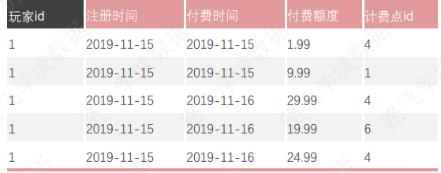

- 利用5W2H思考

  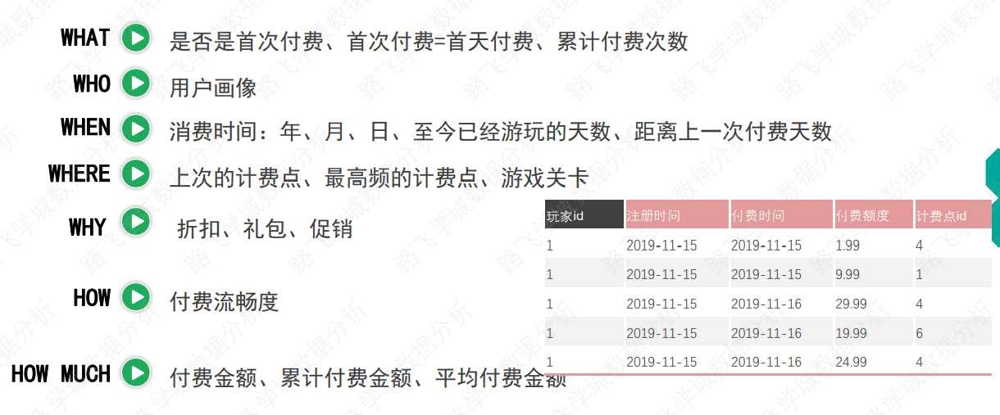

  | What       | Who    | When         | Where    | Why        | How                   | How much |
  | ---------- | ------ | ------------ | -------- | ---------- | --------------------- | -------- |
  | 付费这件事 | 谁付费 | 什么时间付费 | 付费地点 | 为什么付费 | 付的怎么样   怎么付费 | 付了多少 |
  
  

**实例网易严选分析**

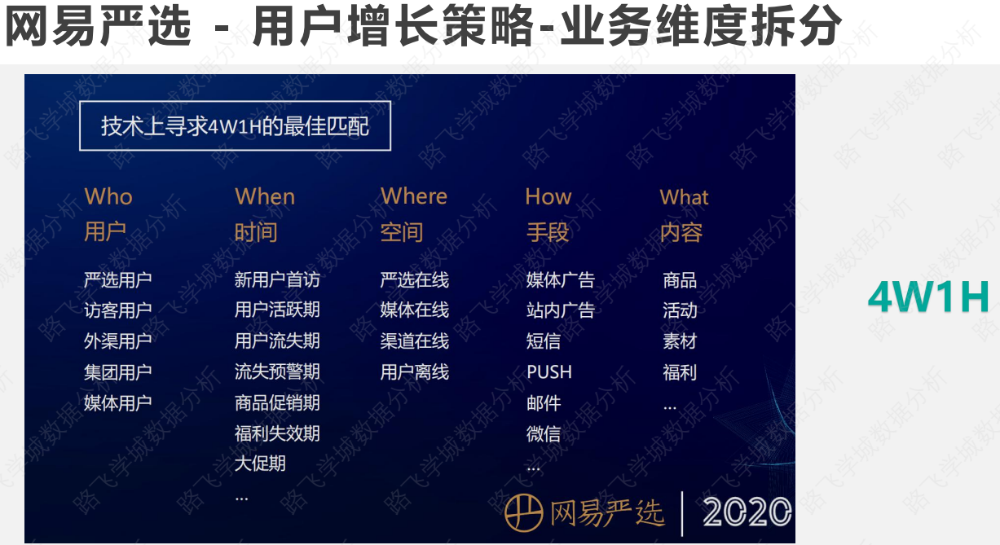

### 模型三：互联网通用AARRR

> 从上往下用户数量逐渐减少
>

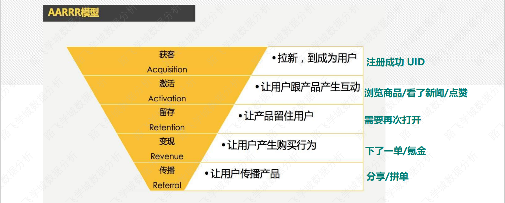

> 拼多多骚操作 打乱顺序分等级
>

**留存	>	激活	>	传播	>	变现	>	获客**

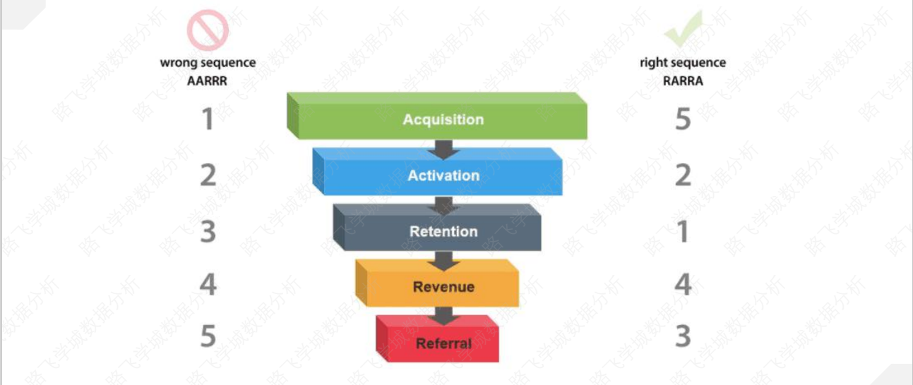

### 模型四：用户增长[^游戏]——八角分析法

------

> **使命	成就	创造	所有权	社交	未知	亏损	稀缺	**

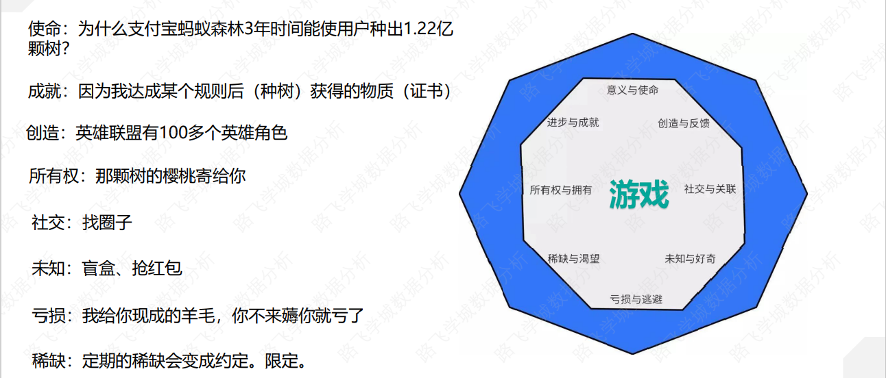

# 三、统计

> **收集	分类	处理	分析     事实和数据的科学**——统计学

==核心：应用和数据==

## 描述统计学

> 衡量数据的分布程度

### 集中趋势

**表示集中趋势的三个值**

- 平均值
- 中位数
- 众数

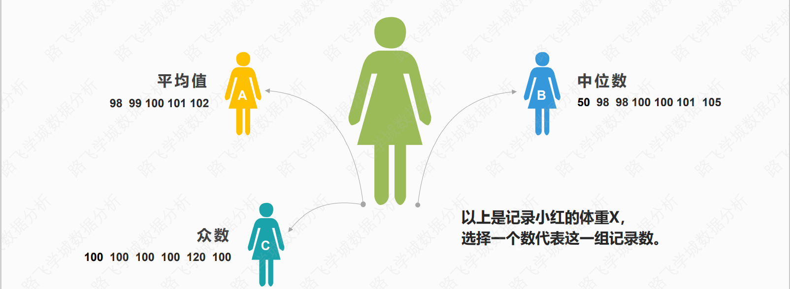

|        | 优点                                                   | 缺点                                              |
| ------ | ------------------------------------------------------ | ------------------------------------------------- |
| 平均值 | 充分利用所有数据，适用性强                             | 容易受到极端值的影响                              |
| 中位数 | 不受极端值的影响                                       | 缺乏敏感性                                        |
| 众数   | 当数据具有明显的集中趋势时，代表性好  不受极端值的影响 | 缺乏唯一性  可能有一个，可能有两个 可能一个都没有 |

### 离散趋势

**表示一组数离数据中心的紧密程度**

- 方差
- 标准差
- 极差——最大值减去最小值

|                     |                      作用                      |
| :-----------------: | :--------------------------------------------: |
|        极差         |           简单描述数据范围的范围大小           |
|        方差         |    描述数据的离散程度——数据离中心越远越离散    |
| 标准差[^实际中常用] | 方差把单位平方了 标准差为了统一单位 ——量纲问题 |

[^方差为0]: 表示数据一样    实际应用时一般将该组数据删除

**案例引入**

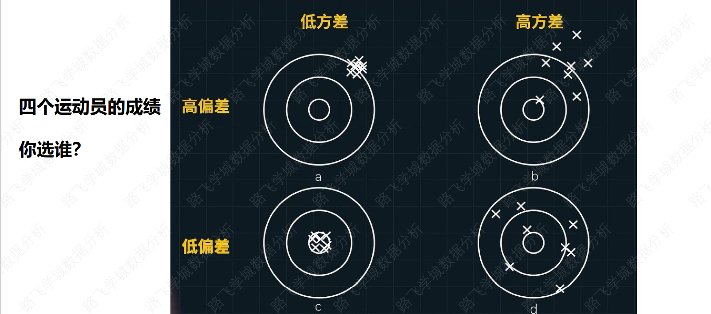

**换个表现形势**

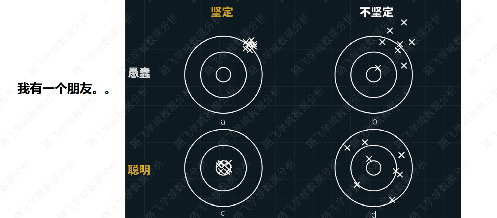

==实际选择按需求而定==

### 数据的分布图

------

#### 直方图

------

**作图步骤**

- 划分范围
- 确定频数
- 写入表格
- 作图

**举个栗子🌰**

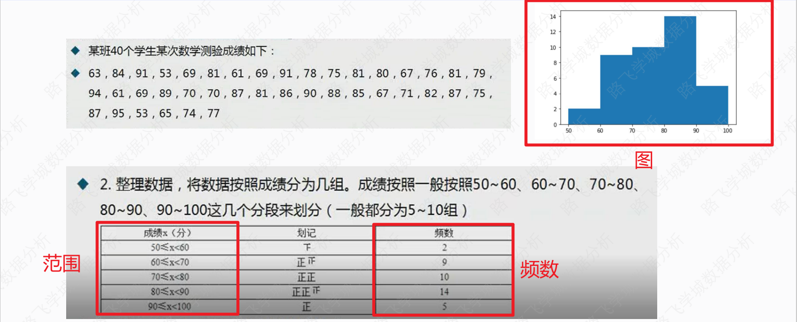

#### 箱线图

> 改图适用与所有数据

**作图步骤**

- 确定数的数量  

- 找到 第25%个数 [^用Q1表示]          第50%个数       第75%个数[^用Q3表示]

- 计算四分位距   上极限   下极限

  - [^四分位距IQR]: Q3   -   Q1

  - [^上极限]: Q3   +  1.5  IQR

  - [^下级限]: Q1   -   1.5   IQR
  
- 作图

**举个栗子🌰**

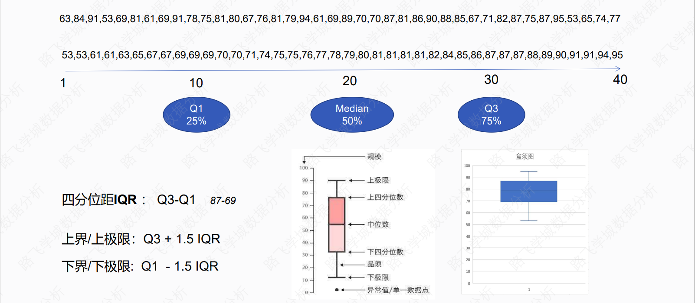

> **异常值的判定方法**：寻找数据的范围

**情况一：满足正态分布**

==使用3法则σ==

[^σ]:标准差

​																			   		  **正常值的范围👇**
$$
(\overline{X}-3\sigma,\overline{X}+3\sigma)
$$

**情况二：不服从正态分布和其他分布**

​                                                                                        **正常值的范围👇**
$$
(Q1-1.5\ast IQR,Q1+1.5\ast IQR)
$$

## 推断统计学

> 概率、相关性分析、假设检验

