# 一、指标与指标体系

## 简介

### 指标

#### 指标的构成

> 由三个方面构成一个指标

- 维度
- 汇总方式
- 量度


**举个栗子🌰**

------

| 分析公司规模 |                                           |
| ------------ | ----------------------------------------- |
| 维度         | 总人口，   占地面积，生产总值，月均生产量 |
| 汇总方式     | 求和，       平均值， 其他                |
| 量度         | 人，           平方米，￥，件             |
| **样例指标** | 总人口求和得到多少人  是一个指标          |


==归一	标准化==


### 指标类型

- 基础指标
- 复合指标
- 派生指标


### 指标体系

> 将数据指标系统化的组织起来  关键是对指标的不同属性进行 ==分类和分层==


[^PV]: 页面浏览量
[^UV]: 用户浏览量
[^DAU]: 日活
[^SPU]: 标准化产品单元


#### 指标体系的作用

> 从四大方面帮助公司更好的成长


- **全面支持决策**
- **指导业务运营**
- **驱动用户增长**
- **统一统计口径**


##指标体系的搭建

> 使用OSM模型
>

[^O]: object   目标
[^S]: Strategy   策略
[^M]: Measure   度量


### O

> 确定核心指标

**核心指标别名**

- North Star Metric 北极星指标
- One metric that matters 唯一重要指标
- 全公司的核心主动目标


**确定核心指标的作用**

- 指引公司方向


### S

> 主要使用UJM模型	

[^UJM]: User Journey Map  用户旅程地图


**梳理用户（使用者）的生命旅程**

- **举个栗子🌰**

  ​																				腾讯视频用户地图

  

[^一句话]:将用户所处的每一个阶段，做行为拆解。明确每个阶段的目标，找到产品和用户的接触点  从中找痛点和机会点


### M

> 确认每个行为下的实际度量（指标）


#### 互联网核心指标


### 小结

> OSM ：从指标体系到行动策略


​																					**视频网站的OSM👇**


1. 从0到1搭建指标体系对于初级数据分析师来说是非常艰难的
2. 一般情况下一级、二级指标（基础、复合）是由业务leader带领团队一起建立
3. 但是三级指标（派生指标）的细化与拆解，是我们作为分析师找到关键问题细化业务的必备技能


**熟悉公司业务老师建议**

- 看架构图  确认部门细分
- 熟悉业务数据表 每张表记录什么  
- 找运营 多个  了解工作流程  与核心指标


## 用户路径解析

> 能达到目的路径越短，过程中的流失就会越少

**流程解析**

- 确立路线图
- 确立指标
- 拆解指标

### 确立路线图


### 内容平台

[^UGC]: User-generated Content		用户生成内容
[^OGC]: Occupationally-generated Content		品牌生产内容
[^PGC]: Professionally-generated Content		专业生产内容


**用户激励模型**


### 确立指标

> 主要是建立用户画像  从四个方面入手

==用户静态属性、用户动态属性、用户消费属性、用户心理属性。==

**静态属性**

- 是用户画像建立的基础。比如：性别、年龄、学历、角色、收入、地域、婚姻等。

**动态属性**

- 指用户在再互联网环境下的上网行为，娱乐偏好、社交习惯、出行方式、学习手段等，这些一定程度上能反映出一个用户是否会对你的产品感兴趣

**消费属性**

- 主要包括消费水平、消费心理、消费嗜好等，反映用户对于花钱的看法，是喜欢质量好的还是性价比高的

**心理属性**

- 用户的生活、工作、感情、社交入手，分析这个人的价值观，并针对性地改良产品


[^一句话]: 给用户打标签


### 指标拆解


[^GMV（全称Gross Merchandise Volume）]: 商品交易总额
[^SKU全称为Stock Keeping Unit]: 库存量单位   即库存进出计量的基本单元
[^CTR（Click-Through-Rate）]:即点击通过率


# 二、数据分析方法和模型


## 数据分析方法

> 案例：抖音教育直播


### 步骤一：寻找核心指标

- 


### 步骤二：分析指标

#### 五大方法

> 占比	趋势	对比	象限	排名

- **方法一：占比分析**

  

- **方法二：趋势分析**

  ​                                                                                    粗粒度👇

  

  ​                                                                                   细粒度👇

  

- **方法三：对比分析**

  

  [^环比]: 举个栗子  二月减去一月除以一月 就可以看出来是增长还是下降
  [^同比]: 今年二月份和去年二月份比


- **方法四：象限分析**

  ==分群策略：两个以上核心指标业务对象按照象限划分==

  ​                                                                                    粗粒度👇

  

  ​                                                                                    细粒度👇

  


- **方法五：排名分析**

  

  [^长尾效应]: 大部分集中在核心处

  ​	尽量避开长尾效应


#### 关键因子——维度拆解

> 维度作为趋势、对比、占比等分析的关键因子

**三大方面**

- 地域
- 用户
- 业务


##### 地域维度

[^TGI指数（Target Group Index）]:目标群体中具有某一特征的群体所占比例➗总体中具有相同特征的群体所占比例

例如：

- 超一线城市作为目标群体目标群体中观看达人的占比 55% 
- 用户总体观看达人的占比 50% 
- TGI = （55%/50%） *100 =110


[^TGI=100]: 平均值


##### 用户维度


##### 业务维度


## 数据分析模型

### 模型一🚩：费米问题大致估算

> 从供需关系[^解决80%的费米问题]   空间关系	收入关系	时间关系


#### 供需关系

**🤔北京有多少加油站？**

1. 基本数据常识  如  人口数  占地面积	物品价格

2. 从假设出发

   


#### 空间关系


#### 收入关系


### 模型二：7问分析法-思考角度的拓展

> 要如何做
>
> - 提问  或  寻找背景信息
> - 利用5W2H思考  向里面填入指标

5W2H


**问题一**


- 寻找背景信息

  

- 利用5W2H思考

  

  | What       | Who    | When         | Where    | Why        | How                   | How much |
  | ---------- | ------ | ------------ | -------- | ---------- | --------------------- | -------- |
  | 付费这件事 | 谁付费 | 什么时间付费 | 付费地点 | 为什么付费 | 付的怎么样   怎么付费 | 付了多少 |
  
  

**实例网易严选分析**


### 模型三：互联网通用AARRR

> 从上往下用户数量逐渐减少
>


> 拼多多骚操作 打乱顺序分等级
>

**留存	>	激活	>	传播	>	变现	>	获客**


### 模型四：用户增长[^游戏]——八角分析法

------

> **使命	成就	创造	所有权	社交	未知	亏损	稀缺	**


# 三、统计

> **收集	分类	处理	分析     事实和数据的科学**——统计学

==核心：应用和数据==


## 描述统计学

> 衡量数据的分布程度

### 集中趋势

**表示集中趋势的三个值**

- 平均值
- 中位数
- 众数


|        | 优点                                                   | 缺点                                              |
| ------ | ------------------------------------------------------ | ------------------------------------------------- |
| 平均值 | 充分利用所有数据，适用性强                             | 容易受到极端值的影响                              |
| 中位数 | 不受极端值的影响                                       | 缺乏敏感性                                        |
| 众数   | 当数据具有明显的集中趋势时，代表性好  不受极端值的影响 | 缺乏唯一性  可能有一个，可能有两个 可能一个都没有 |


### 离散趋势

**表示一组数离数据中心的紧密程度**

- 方差
- 标准差
- 极差——最大值减去最小值

|                     |                      作用                      |
| :-----------------: | :--------------------------------------------: |
|        极差         |           简单描述数据范围的范围大小           |
|        方差         |    描述数据的离散程度——数据离中心越远越离散    |
| 标准差[^实际中常用] | 方差把单位平方了 标准差为了统一单位 ——量纲问题 |

[^方差为0]: 表示数据一样    实际应用时一般将该组数据删除

**案例引入**


**换个表现形势**


==实际选择按需求而定==


### 数据的分布图

------

#### 直方图

------

**作图步骤**

- 划分范围
- 确定频数
- 写入表格
- 作图

**举个栗子🌰**


#### 箱线图

> 改图适用与所有数据

**作图步骤**

- 确定数的数量  

- 找到 第25%个数 [^用Q1表示]          第50%个数       第75%个数[^用Q3表示]

- 计算四分位距   上极限   下极限

  - [^四分位距IQR]: Q3   -   Q1

  - [^上极限]: Q3   +  1.5  IQR

  - [^下级限]: Q1   -   1.5   IQR
  
- 作图

**举个栗子🌰**


> **异常值的判定方法**：寻找数据的范围

**情况一：满足正态分布**

==使用3法则σ==

[^σ]:标准差

​																			   		  **正常值的范围👇**
$$
(\overline{X}-3\sigma,\overline{X}+3\sigma)
$$


**情况二：不服从正态分布和其他分布**

​                                                                                        **正常值的范围👇**
$$
(Q1-1.5\ast IQR,Q1+1.5\ast IQR)
$$


## 推断统计学

> 实际应用中最常用——对数据的分析推断

### 概率

#### 数据分布

------

> 根据X的发生规律分为一下三种


- **离散**

  [^背景]:投球概率为0.8

  - 二项分布

     👆在解决投十次进几次

  - 几何分布

     👆在解决投几次进一次

  - 泊松分布

  

==因为需要提前知道概率  所以实际应用中不常用——遇到直接带公式==


- **连续**
  - 均匀分布
  - 正态分布
  - 指数分布


- **已知规则下的概率计算**


#### 大数定律

> 通过大量试验[^样本]      利用实验结果去估计总体概率函数


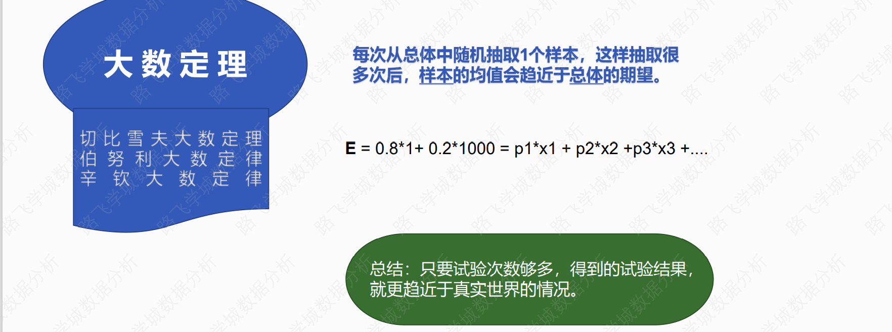


### 贝叶斯方程

------

> 贝叶斯学派：概率会在不同的条件下发生改变——核心：寻找不同条件的概率  也叫先验概率

**贝叶斯主要把概率分为三种**

- **先验概率**
- **条件概率**
- **联合概率**


> 实际应用——垃圾邮件过滤

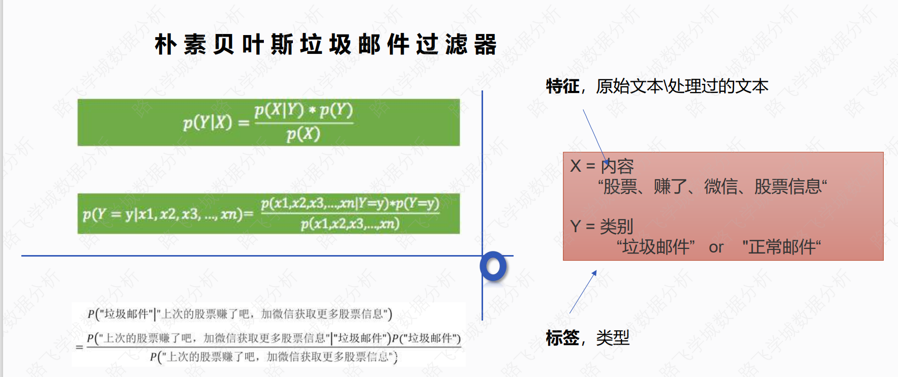


==应用公式将垃圾邮件的概率 计算出来 在新的邮件进来时可快速判断是否为垃圾邮件==


### 卡方检验

> 检验两个离散型变量是否相关——针对分类变量

**看病和康复是否相关**

|        | 治疗 | 弃疗 | 总数 |
| ------ | ---- | ---- | ---- |
| 康复   | 300  | 100  | 400  |
| 未康复 | 200  | 400  | 600  |
| 总数   | 500  | 500  | 1000 |

**实验python计算**

```python
from scipy import stats

ob_matatrix=[[300,100],[200,400]]

chi_x=stats.chi2_contingency(ob_matatrix)

print(chi_x)
```

- **输出**

  ​																👇P值												👇理论矩阵

  ```
  (165.00416666666666, 9.128507616296589e-38, 1, array([[200., 200.],[300., 300.]]))
  ```

  ​				👆卡方值															   👆自由度		


- **==卡方值大，相关性大==**
- ==**p值大小——不相关的概率**==


### 线性相关性

------

> 检验数据是正线性相关还是负线性相关

**前提——确定数据的类型**

- **正态分布检验**

  ```python
  from scipy import stats
  import pandas as pd
  df = pd.read_excel(r'城市污染数据.xlsx')
  stats.kstest(df['PM2.5'], 'norm',     (df['PM2.5'].mean(), df['PM2.5'].std()))
  ```

  ​									👆						👆								👆										👆

  ​								检验数据		正态分布缩写					 均值									标准差

- **有序分类变量**

  [^例子]: 小学  初中   高中   大学

  


####  皮尔森相关性系数

> 要求：两个数据都是正态分布
>

 

```python
import matplotlib.pyplot as plt
import seaborn as sns
import pandas as pd

df = pd.read_excel(r'城市污染数据.xlsx')
sns.heatmap(df.corr(method='pearson'), cmap='ocean', center=0)
plt.show()
```

[^cmap]: 颜色遮罩  上网搜
[^center]: 指定数据中心   0表示以0为中心


#### 斯皮尔曼相关性系数

> 对数据无要求


```python
import matplotlib.pyplot as plt
import seaborn as sns
import pandas as pd

df = pd.read_excel(r'城市污染数据.xlsx')
sns.heatmap(df.corr(method='spearman'), cmap='ocean', center=0)
plt.show()
```

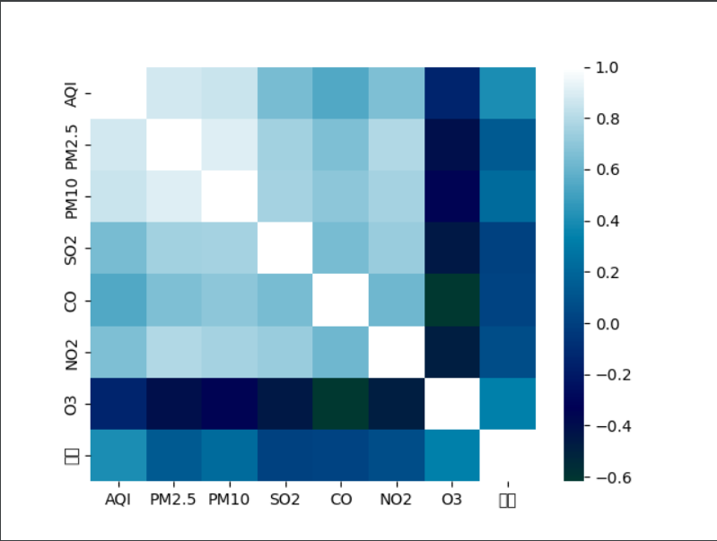


#### 肯德尔相关性系数

> 有序分类变量


```python
import matplotlib.pyplot as plt
import seaborn as sns
import pandas as pd

df = pd.read_excel(r'城市污染数据.xlsx')
sns.heatmap(df.corr(method='kendall'), cmap='ocean', center=0)
plt.show()
```


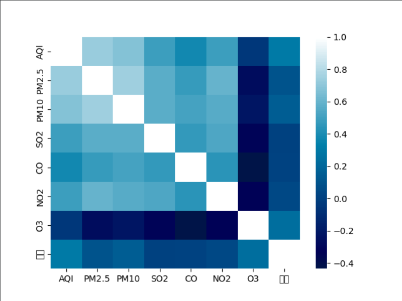

 


# 四、Excel

## 常用操作

### 快捷键

| Ctrl +  Shift  +  上下左右： |             覆盖表的最上下左右端              |
| :--------------------------: | :-------------------------------------------: |
|  **Ctrl + 向上下左右箭头**   | **转到当前列中最  左  右 上  下  部的单元格** |
|            **F2**            |                 **编辑状态**                  |
|         **Ctrl + 1**         |              **设置单元格格式**               |
|        **Alt + 加号**        |                   **求和**                    |


**1. Ctrl + N**: 创建一个新的 工作簿 .

**2. Ctrl + O**：打开已保存的 工作簿 .

**3. Ctrl + S**: 保存一个 工作簿 .

**4. Ctrl + A**：选择一个中的所有内容 工作簿 .

**5. Ctrl + B**：将突出显示的单元格变为粗体。

**6. Ctrl + C**：复制突出显示的单元格。

**7. Ctrl + D**：用上面单元格的内容填充选定的单元格。

**8. Ctrl + F**: 搜索任何东西 工作簿 .

**9. Ctrl + G**：用一个命令跳转到某个区域。

**10. Ctrl + H**：查找和替换单元格内容。

**11. Ctrl + I**：斜体单元格内容。

**12. Ctrl + K**：插入一个 超链接 在一个单元格中。

**13. Ctrl + L**: 打开创建表 对话 盒子。

**14. Ctrl + P**：打印一个 工作簿 .

**15. Ctrl + R**：用左侧单元格的内容填充选定的单元格。

**16. Ctrl + U**： 至 强调 突出显示的单元格。

**17. Ctrl + V**：粘贴复制的任何内容。

**18. Ctrl + W**: 关闭当前 工作簿 .

**19. Ctrl + Z**：撤消上一个操作。

**20. Ctrl + 1** : 格式化单元格内容。

**21. Ctrl + 5**：在单元格中添加删除线。

**22. Ctrl + 8**：显示轮廓符号。

**23. Ctrl + 9**：隐藏一行。

**24. Ctrl + 0**：隐藏一列。

**25. Ctrl + Shift + ::**在单元格中输入当前时间。

**26. Ctrl + ;** ：在单元格中输入当前日期。

**27. Ctrl + `**：将视图从显示单元格值更改为公式。

**28. Ctrl + '**：从上面的单元格中复制公式。

**29. Ctrl + -**： 至 删除 列或行。

**30. Ctrl + Shift + =**：插入列和行。

**31. Ctrl + Shift + ~**：在显示 Excel 公式或它们在单元格中的值之间切换。

**32. Ctrl + Shift + @**：应用时间格式。

**33. Ctrl+Shift+！**： 申请 逗号 格式化。

**34. Ctrl + Shift + $**：应用货币格式。

**35. Ctrl + Shift + #**：应用日期格式。

**36. Ctrl + Shift + %**：应用百分比格式。

**37. Ctrl + Shift + &**：在所选单元格周围放置边框。

**38. Ctrl + Shift + _**：删除边框。

**39. Ctrl + -**： 至 删除 选定的行或列。

**40. Ctrl + 空格键**：选择一整列。

**41. Ctrl + Shift + 空格键**：选择整个 工作簿 .

**42. Ctrl + 主页**： 至 重定向 到单元格 A1。

**43. Ctrl + Shift + Tab**：切换到上一个 工作簿 .

**44. Ctrl+Shift+F**: 打开 字体 格式单元格下的菜单。

**45. Ctrl + Shift + O**：选择包含注释的单元格。

**46. Ctrl + 拖动**：拖动和复制单元格或复制到 复制 工作表 .

**47. Ctrl + Shift + Drag**：拖动和插入副本。

**48. Ctrl + 向上箭头**：转到当前列中最顶部的单元格。

**49. Ctrl + 向下箭头**：跳到当前列的最后一个单元格。

**50. Ctrl + 右箭头**：转到选定行中的最后一个单元格。

**51. Ctrl + 左箭头**：跳回到所选行中的第一个单元格。

**52. Ctrl + 结束**: 转到最后一个单元格 工作簿 .

**53. Alt + Page down** : 向右移动屏幕。

**54. Alt + Page Up**：向左移动屏幕。

**55. Ctrl + F2**：打开打印 预习 窗户。

**56. Ctrl + F1**：展开或折叠功能区。

**57. Alt**：打开访问键。

**58. Tab**：移动到下一个单元格。

**59. Alt + F + T**：打开选项。

**60. Alt + 向下箭头**：激活单元格过滤器。

**61. F2**：编辑单元格。

**62. F3**：如果单元格已命名，则粘贴单元格名称。

**63. Shift + F2**：添加或编辑单元格注释。

**64. Alt + H + H**：选择填充颜色。

**65. Alt + H + B**：添加边框。

**66. Ctrl + 9**：隐藏选定的行。

**67. Ctrl + 0**：隐藏选定的列。

**68. Esc**：取消条目。

**69. 输入**：完成一个单元格中的输入并移动到下一个单元格。

**70. Shift + 右箭头**：向右扩展单元格选择。

**71. Shift + 向左箭头**：将单元格选择扩展到左侧。

**72. Shift + Space**：选择整行。

**73. 向上/向下翻页**：向上或向下移动屏幕。

**74. Alt + H**：转到功能区中的“主页”选项卡。

**75. Alt + N**：转到功能区中的“插入”选项卡。

**76. Alt + P**：转到功能区中的页面布局选项卡。

**77. Alt + M**：转到功能区中的“公式”选项卡。

**78. Alt + A**：转到功能区中的数据选项卡。

**79. Alt + R**：转到功能区中的“审阅”选项卡。

**80. Alt + W**：转到功能区中的“查看”选项卡。

**81. Alt + Y**：在功能区中打开“帮助”选项卡。

**82. Alt+Q**：快速跳转搜索。

**83. Alt + Enter**：在当前单元格中开始新行。

**84. Shift + F3**: 打开插入功能 对话 盒子。

**85. F9**： 计算 工作簿 .

**86. Shift + F9**: 计算一个活跃的 工作簿 .

**87. Ctrl + Alt + F9**：强制计算所有 工作簿 .

**88. Ctrl + F3**：打开名称管理器。

**89. Ctrl + Shift + F3**：从行和列中的值创建名称。

**90. Ctrl + Alt +**： 至 飞涨 在里面一个 工作簿 .

**91. Ctrl + Alt +**： 至 飞涨 在里面 工作簿 .

**92. Alt + 1** : 打开自动保存。

**93. 一切 + 2**: 保存一个 工作簿 .

**94. Alt + F + E**: 导出你的 工作簿 .

**95. Alt + F + Z**: 分享你的 工作簿 .

**96. Alt + F + C**：关闭并保存您的 工作簿 .

**97. Alt 或 F11**：打开或关闭按键提示。

**98. Alt + Y + W**：了解 Microsoft Excel 中的新功能。

**99. F1**：打开 Microsoft Excel 帮助。

**100. Ctrl + F4**：关闭 Microsoft Excel。


### 自定义单元格格式

------


#### 自定义结构

------

**方式一**

- **用“；”号分隔组成部分**

  **例：字母表示：正数格式; 负数格式; 零格式; 文本格式**

  - 格式化代码

    ```
    "a";"b";"c";"d"
    ```

    - 正数显示：a
    - 负数显示：b
    - 0显示：c
    - 文本显示：d

**方式二**

- **特定条件：大于条件值；小于条件值；等于条件值；文本**

  **例：通过判断条件设置**

  - 🚩需求：大于5用红色，小于5用蓝色，等于5用绿色

    ```
     [>5][红色];[<5][蓝色];[绿色]
    ```


#### 使用方法

------

- **一、设置单元格格式[^Ctrl + 1]  👉  自定义单元格格式**

- **二、 使用TEXT(value, format_text)**

  ```
  例：=TEXT(1234.456,"00.00") 显示结果为 1234.46
  ```

  

#### 各参数的涵义

------

> 类似正则表达式

- **“G/通用格式”：以常规的数字显示，默认值**

  ```
  例：代码：“G/通用格式”。10显示为10；10.1显示为10.1。
  ```

- **0：显示数字，如果数字位数少于格式中的零的个数，则显示无意义的零**

  ```
  例：代码：“00000”。1234567显示为1234567；123显示为00123
  例：代码：“00.000”。100.14显示为100.140；1.1显示为01.100
  ```

- **#：只显示有效数字而不显示无意义的零**

  ```
  例：代码：“###.##”,12.100显示为12.1; 12.1263显示为：12.13
  ```

- **？：为无意义的零在小数点两边添加空格，以便使小数点对齐。**

  ```
  例：123.1分别设置单元格格式为“??.??“和“???.???”, 查看结果
  ```

- **，：显示千位分隔符或者将数字以千倍显示。**

  ```
  例：代码：“#，#”。“10000”显示为“10，000” “10000000”显示为“10,00 ”
  例：代码：“#，”。10000显示为10。
  例：代码：“#,,”。“1000000”显示为“1”。
  ```

- **"." ：小数点。如果外加双引号则为字符。**

  ```
  例：代码“0.#”。“11.23”显示为“11.2”
  ```

- **“%”：百分比。**

  ```
  例：代码“#%”。“0.23”显示为“23%”
  ```

- **“/”：显示下一个字符。**

  ```
  例：代码“/ABC”或“”ABC””均显示为“ABC”
  ```

- **“*”：重复下一次字符，直到充满列宽。**

  ```
  文本的重复显示要使用@
  例：代码：“@*-”。“ABC”显示为“ABC-----------------”
  
  数字的显示可以使用#或者0或者?
  例：代码：“#*-”。“123”显示为“123-----------------”
  ```

- **“_”（下划线）：留下一个和下一个字符同等宽度的空格**

  ```
  例：正数后面留一个与）等宽的空格，负数不留空格，这样能保证整数和复数对齐
  $#,##0.00_) 表示 1234.567 为 $1234.56
  ($#,##0.00) 表示 -1234.678 为 ($1234.67)
  ```

- **“文本”：显示双引号中的文本。**

  ```
  例：代码："中国@" 显示为 “中国xxx”
  ```

- **[颜色]：用指定的颜色显示字符**

  ```
  例：代码：“[绿色];[红色];[黑色];[蓝色]”。显示结果为正数为率色，负数显示红色，零显示黑色，文本则显示为蓝色
  ```

- **[条件]：可以单元格内容判断后再设置格式。**

  ```
  条件格式化只限于使用三个条件，其中两个条件是明确的，另一个是“所有的其他”。条件要放到方括号中。必须进行简单的比较
  
  显示结果是单元格数值大于零显示正数，小于零显示“负数”，其他情况显示"零"，非数字类型显示"文本"。
  例：代码：[>0]正数;[<0]负数;零;文本
  或：代码：整数[>0];负数[<0];零;文本
  ```

- **“！”：显示“"”。**

  ```
  由于引号是代码常用的符号。在单元格中是无法用"""来显示出来“"”。要想显示出来，须在前加入“！”
  
  例：代码：“#!"”。“10”显示“10"”
  例：代码：“#!"!"”。“10”显示“10""”
  ```

- **日期和时间**

  - **日期**

    | 符号  |                    含义                     |
    | :---: | :-----------------------------------------: |
    |   m   |        将月显示为不带前导零的数字。         |
    |  mm   |     根据需要将月显示为带前导零的数字。      |
    |  mmm  |     将月显示为缩写形式（Jan 到 Dec）。      |
    | mmmm  | 将月显示为完整名称（January 到 December）。 |
    | mmmmm |       将月显示为单个字母（J 到 D）。        |
    |   d   |        将日显示为不带前导零的数字。         |
    |  dd   |     根据需要将日显示为带前导零的数字。      |
    |  ddd  |     将日显示为缩写形式（Sun 到 Sat）。      |
    | dddd  | 将日显示为完整名称（Sunday 到 Saturday）。  |
    |  yy   |            将年显示为两位数字。             |
    | yyyy  |            将年显示为四位数字。             |

    [^例：]: 代码：“YYYY-MM-DD”。2005年1月10日显示为：“2005-01-10”
    [^例：]: 代码：“YY-M-D”。2005年10月10日显示为：“05-1-10”

  - **星期**

    | AAAA | 日期显示为星期 |
    | :--: | :------------: |

  - **时间**

    |      符号      |                   含义                   |
    | :------------: | :--------------------------------------: |
    |   “H”或“HH”    |  以一位（0 -23）或两位（01-23）显示小时  |
    |   “M”或“MM”    |  以一位（0-59）或两位（01-59）显示分钟   |
    |   “S”或“SS”    |   以一位（0-59）或两位（01-59）显示秒    |
    | [H]或[M]或[SS] | 显示大于24小时的小时或显示大于60的分或秒 |

    [^例：]: 代码：“HH:MM:SS”。“23:1:15”显示为“23:01:15”

    

#### 特殊数字

------


- 代码： “13”
  - 显示为“壹拾叁”
- 代码：“[DBNum1]”
  - “1232”显示为“一千二百三十二”
- 代码：“123”
  - 显示为“1百2十3"

### 查找并替换

------

- **Ctrl + A 选中全表**
- **Ctrl + F搜索要替换的值**
- **点击查找全部 👉  Ctrl + A 选中所有**
-  **此时第一个单元格是可修改的 👉  F2 编辑**
- **编辑完成  👉  Ctrl + Enter**
- **修改完毕**


### 填充柄

> 在某一列输入某两行输入数值

**光标移动到单元格出现白色十字向下 选中两格**

- **光标移到右下角出现黑色小十字**
  - **按住左键向下托**
    - 按照默认排序填充
  - **按住右键往下拖**
    - 选择填充规则


### 数据验证

------

- **选中需要验证的数据**

- **依次点击**

  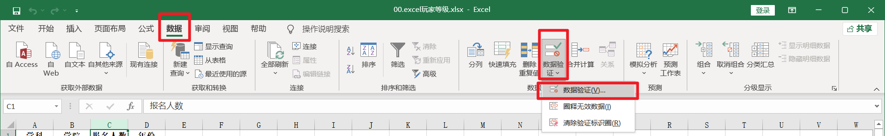

- **设置好要验证的规则**

- **框选出不符合条件的单元格**

  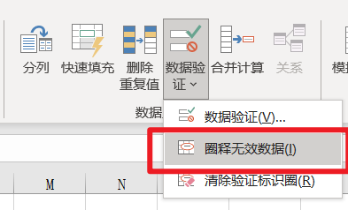

- **查看结果**

  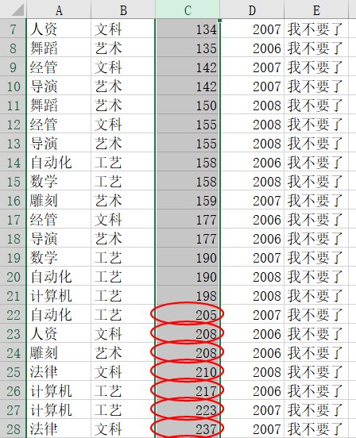


### 保护工作表

> 设置那个单元格可以修改

- **选择需要保护的区域**

  

  

- **依次点击**

  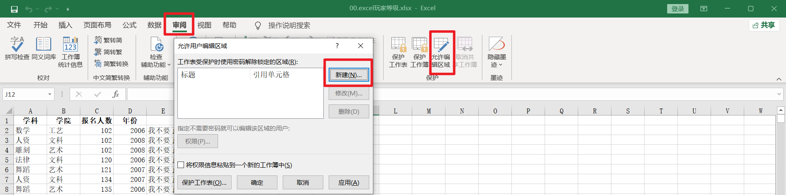

  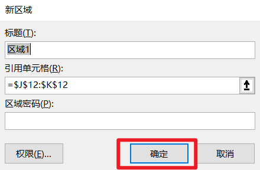
  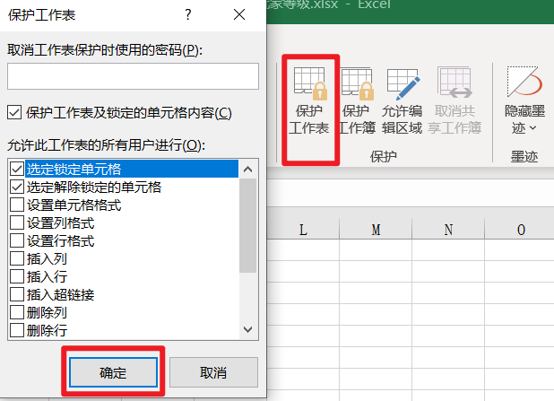


### 自定义序列

------

> 需求：输入今天 下拉   填充   今天 明天 大后天

**设计自定义序列**

- **文件 👉 选项 👉 高级 👉 常规 👉 编辑自定义列表 **

  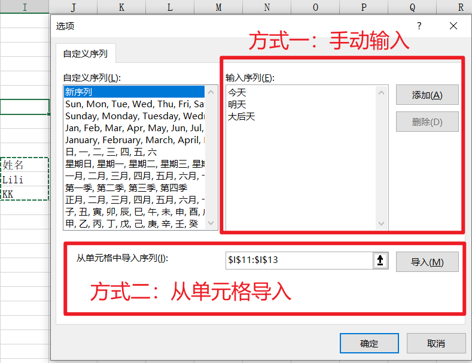


### 单元格下拉框

------

**设置下拉框**

- **依次点击**

  

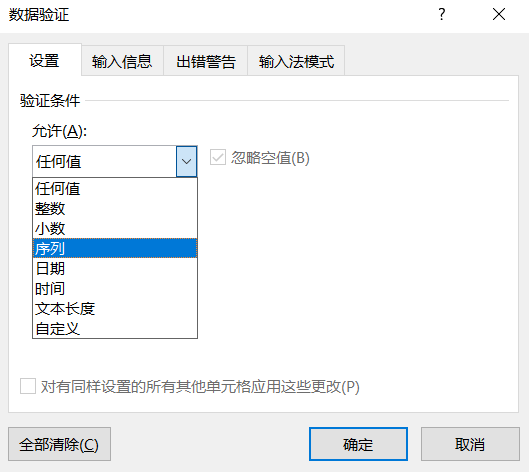

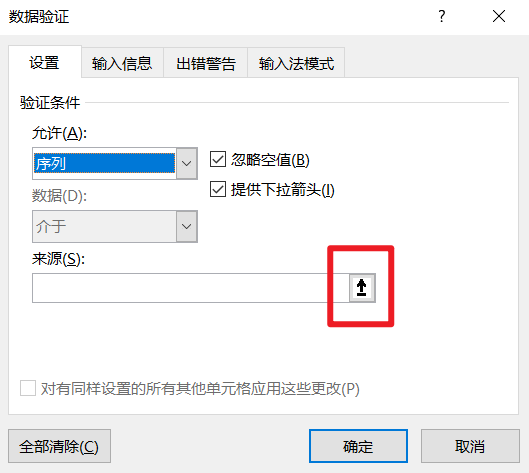

- **点击上图箭头在单元格选择下拉内容**
- **最后确定即可**


工具设置及快捷键使用
数据分列
数据筛选
统计分析函数/文本处理函数
数值运算函数/逻辑判断函数
日期计算函数/匹配查找函数
使用函数实现报表开发
数据透视基础表制作


