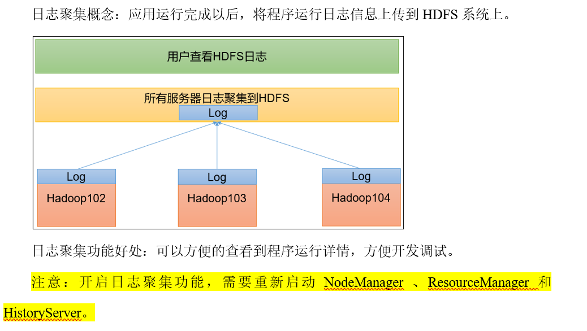
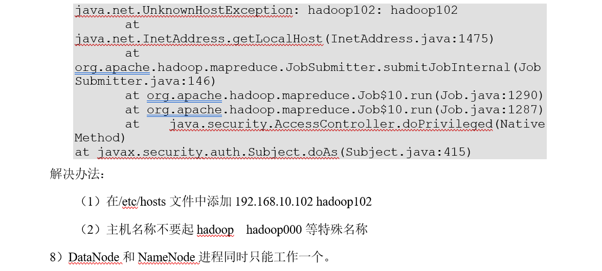

# Hadoop运行模式

[Hadoop官方网站](http://hadoop.apache.org/)

Hadoop运行模式包括：**本地模式**、**伪分布式模式**以及**完全分布式模式**。

+ **本地模式**：单机运行，只是用来演示一下官方案例。生产环境不用。
+ **伪分布式模式：**也是单机运行，但是具备Hadoop集群的所有功能，一台服务器模拟一个分布式的环境。个别缺钱的公司用来测试，生产环境不用。
+ **完全分布式模式：**多台服务器组成分布式环境。生产环境使用。

## 本地运行模式[^生成环境不用]

- **在hadoop-3.1.3文件下面创建一个wcinput文件夹**

  ```sh
  $ mkdir wcinput
  ```

- **在wcinput文件下创建一个word.txt文件**

  ```sh
  $ cd wcinput
  ```

- **编辑word.txt文件**

  ```sh
  $ vim word.txt
  
  hadoop yarn
  hadoop mapreduce
  atguigu
  atguigu
  
  保存退出
  :wq
  ```

- **回到Hadoop目录/opt/module/hadoop-3.1.3执行程序**

  ```sh
  $ hadoop jar share/hadoop/mapreduce/hadoop-mapreduce-examples-3.1.3.jar wordcount wcinput wcoutput
  ```

- **查看结果**

  ```sh
  $ cat wcoutput/part-r-00000
  
  atguigu 2
  hadoop  2
  mapreduce       1
  yarn    1
  ```

  


## 完全分布式运行模式

### 分发同步文件

##### scp（secure copy）

- scp定义

  - scp可以实现服务器与服务器之间的数据拷贝。（from server1 to server2）

- 基本语法

  ```sh
  scp   -r    $pdir/$fname       $user@$host:$pdir/$fname
  ```

  - 命令     递归   要拷贝的文件路径/名称  目的地用户@主机:目的地路径/名称


案例实操

```shell
#在hadoop102上，将hadoop102中/opt/module/jdk1.8.0_212目录拷贝到hadoop103上

 ~]$ scp -r /opt/module/jdk1.8.0_212  atguigu@hadoop103:/opt/module
 
#在hadoop103上，将hadoop102中/opt/module/hadoop-3.1.3目录拷贝到hadoop103上

~]$ scp -r atguigu@hadoop102:/opt/module/hadoop-3.1.3 /opt/module/

#在hadoop103上操作，将hadoop102中/opt/module目录下所有目录拷贝到hadoop104上

opt]$ scp -r atguigu@hadoop102:/opt/module/* atguigu@hadoop104:/opt/module
```


#### rsync远程同步工具

> rsync主要用于备份和镜像。具有速度快、避免复制相同内容和支持符号链接的优点。
>
> rsync和scp区别：用rsync做文件的复制要比scp的速度快，rsync只对差异文件做更新。scp是把所有文件都复制过去。

**基本语法**

```sh
rsync   -av    $pdir/$fname       $user@$host:$pdir/$fname
```

- 命令  选项参数  要拷贝的文件路径/名称  目的地用户@主机:目的地路径/名称


| 选项 | 功能         |
| ---- | ------------ |
| -a   | 归档拷贝     |
| -v   | 显示复制过程 |


案例实操

```shell
#删除hadoop103中/opt/module/hadoop-3.1.3/wcinput

 hadoop-3.1.3]$ rm -rf wcinput/
 
#同步hadoop102中的/opt/module/hadoop-3.1.3到hadoop103

module]$ rsync -av hadoop-3.1.3/ atguigu@hadoop103:/opt/module/hadoop-3.1.3/
```


#### xsync集群分发脚本

> **脚本实现**

```shell
#（a）在/home/atguigu/bin目录下创建xsync文件

opt]$ cd /home/atguigu
 ~]$ mkdir bin
 ~]$ cd bin
bin]$ vim xsync

```

```shell
#在该文件中编写如下代码

#!/bin/bash

#1. 判断参数个数
if [ $# -lt 1 ]
then
    echo Not Enough Arguement!
    exit;
fi

#2. 遍历集群所有机器
for host in hadoop102 hadoop103 hadoop104
do
    echo ====================  $host  ====================
    #3. 遍历所有目录，挨个发送

    for file in $@
    do
        #4. 判断文件是否存在
        if [ -e $file ]
            then
                #5. 获取父目录
                pdir=$(cd -P $(dirname $file); pwd)

                #6. 获取当前文件的名称
                fname=$(basename $file)
                ssh $host "mkdir -p $pdir"
                rsync -av $pdir/$fname $host:$pdir
            else
                echo $file does not exists!
        fi
    done
done


# b）修改脚本 xsync 具有执行权限
[atguigu@hadoop102 bin]$ chmod +x xsync
#（c）测试脚本
[atguigu@hadoop102 ~]$ xsync /home/atguigu/bin
#（d）将脚本复制到/bin中，以便全局调用
[atguigu@hadoop102 bin]$ sudo cp xsync /bin/
#（e）同步环境变量配置（root所有者）
[atguigu@hadoop102 ~]$ sudo ./bin/xsync /etc/profile.d/my_env.sh
#注意：如果用了sudo，那么xsync一定要给它的路径补全。
#让环境变量生效
[atguigu@hadoop103 bin]$ source /etc/profile
[atguigu@hadoop104 opt]$ source /etc/profile

```


### SSH免密登录


[^原理]:一把钥匙开一把锁

> 注意：需要事先连接 2 号和3号机    由系统生成  .ssh文件

```shell
#连接hadoop103
ssh hadoop103
```

```shell
#生成公钥和私钥

.ssh]$ pwd /home/atguigu/.ssh

[.ssh]$ ssh-keygen -t rsa

#然后敲（三个回车），就会生成两个文件id_rsa（私钥）、id_rsa.pub（公钥）

#将公钥拷贝到要免密登录的目标机器上

 .ssh]$ ssh-copy-id hadoop102
 .ssh]$ ssh-copy-id hadoop103
 .ssh]$ ssh-copy-id hadoop104


```

`注意`

- 还需要在hadoop103上采用atguigu账号配置一下无密登录到hadoop102、hadoop103、hadoop104服务器上。

- 还需要在hadoop104上采用atguigu账号配置一下无密登录到hadoop102、hadoop103、hadoop104服务器上。

- 还需要在hadoop102上采用atguigu账号，  配置一下无密登录到hadoop102、hadoop103、hadoop104；

ssh文件夹下（~/.ssh）的文件功能解释

| known_hosts     | 记录ssh访问过计算机的公钥（public  key） |
| --------------- | ---------------------------------------- |
| id_rsa          | 生成的私钥                               |
| id_rsa.pub      | 生成的公钥                               |
| authorized_keys | 存放授权过的无密登录服务器公钥           |


### 集群配置

##### 集群部署规划

`注意`

+  NameNode和SecondaryNameNode不要安装在同一台服务器
+ ResourceManager也很消耗内存，不要和NameNode、SecondaryNameNode配置在同一台机器上


|      | hadoop102          | hadoop103                    | hadoop104                   |
| ---- | ------------------ | ---------------------------- | --------------------------- |
| HDFS | NameNode  DataNode | DataNode                     | SecondaryNameNode  DataNode |
| YARN | NodeManager        | ResourceManager  NodeManager | NodeManager                 |


##### 配置文件说明

> Hadoop配置文件分两类：默认配置文件和自定义配置文件，只有用户想修改某一默认配置值时，才需要修改自定义配置文件，更改相应属性值。


==默认配置文件:==

| 要获取的默认文件     | 文件存放在Hadoop的jar包中的位置                           |
| -------------------- | --------------------------------------------------------- |
| [core-default.xml]   | hadoop-common-3.1.3.jar/core-default.xml                  |
| [hdfs-default.xml]   | hadoop-hdfs-3.1.3.jar/hdfs-default.xml                    |
| [yarn-default.xml]   | hadoop-yarn-common-3.1.3.jar/yarn-default.xml             |
| [mapred-default.xml] | hadoop-mapreduce-client-core-3.1.3.jar/mapred-default.xml |

[^Tips]: **core-site.xml、hdfs-site.xml、yarn-site.xml、mapred-site.xml**四个配置文件存放在$HADOOP_HOME/etc/hadoop这个路径上，用户可以根据项目需求重新进行修改配置


**配置群群**

- **核心配置文件**

  配置core-site.xml

- ```shell
  [atguigu@hadoop102 ~]$ cd $HADOOP_HOME/etc/hadoop
  [atguigu@hadoop102 hadoop]$ vim core-site.xml
  文件内容如下：
  <?xml version="1.0" encoding="UTF-8"?>
  <?xml-stylesheet type="text/xsl" href="configuration.xsl"?>
  
  <configuration>
      <!-- 指定NameNode的地址 -->
      <property>
          <name>fs.defaultFS</name>
          <value>hdfs://hadoop102:8020</value>
      </property>
  
      <!-- 指定hadoop数据的存储目录 -->
      <property>
          <name>hadoop.tmp.dir</name>
          <value>/opt/module/hadoop-3.1.3/data</value>
      </property>
  
      <!-- 配置HDFS网页登录使用的静态用户为atguigu -->
      <property>
          <name>hadoop.http.staticuser.user</name>
          <value>atguigu</value>
      </property>
  </configuration>
  
  ```

- **HDFS配置文件**

  配置hdfs-site.xml

- ```shell
  [atguigu@hadoop102 hadoop]$ vim hdfs-site.xml  
  
  
  <?xml version="1.0" encoding="UTF-8"?>
  <?xml-stylesheet type="text/xsl" href="configuration.xsl"?>
  
  <configuration>
  	<!-- nn web端访问地址-->
  	<property>
          <name>dfs.namenode.http-address</name>
          <value>hadoop102:9870</value>
      </property>
  	<!-- 2nn web端访问地址-->
      <property>
          <name>dfs.namenode.secondary.http-address</name>
          <value>hadoop104:9868</value>
      </property>
  </configuration>
  
  ```
  
  
  
- **YARN配置文件**

  配置yarn-site.xml

- ```shell
  [atguigu@hadoop102 hadoop]$ vim yarn-site.xml
  
  
  
  
  #文件内容如下：
  <?xml version="1.0" encoding="UTF-8"?>
  <?xml-stylesheet type="text/xsl" href="configuration.xsl"?>
  
  <configuration>
      <!-- 指定MR走shuffle -->
      <property>
          <name>yarn.nodemanager.aux-services</name>
          <value>mapreduce_shuffle</value>
      </property>
  
      <!-- 指定ResourceManager的地址-->
      <property>
          <name>yarn.resourcemanager.hostname</name>
          <value>hadoop103</value>
      </property>
  
      <!-- 环境变量的继承 -->
      <property>
          <name>yarn.nodemanager.env-whitelist</name>
          <value>JAVA_HOME,HADOOP_COMMON_HOME,HADOOP_HDFS_HOME,HADOOP_CONF_DIR,CLASSPATH_PREPEND_DISTCACHE,HADOOP_YARN_HOME,HADOOP_MAPRED_HOME</value>
      </property>
  </configuration>
  
  ```

  
  
- **MapReduce配置文件**

  配置mapred-site.xml

- ```shell
  [atguigu@hadoop102 hadoop]$ vim mapred-site.xml
  
  
  	
   #文件内容如下：
  <?xml version="1.0" encoding="UTF-8"?>
  <?xml-stylesheet type="text/xsl" href="configuration.xsl"?>
  
  <configuration>
  	<!-- 指定MapReduce程序运行在Yarn上 -->
      <property>
          <name>mapreduce.framework.name</name>
          <value>yarn</value>
      </property>
  </configuration>
  
  ```


### 群起集群

#### 配置workers

```sh
[atguigu@hadoop102 hadoop]$ vim /opt/module/hadoop-3.1.3/etc/hadoop/workers


#在该文件中增加如下内容：
hadoop102
hadoop103
hadoop104

```

#### 启动集群

- **第一次启动记得格式化NN**

  [^格式化NN]: 产生新的集群id，导致NameNode和DataNode的集群id不一致，集群找不到已往数据。如果集群在运行过程中报错，需要重新格式化NameNode的话，一定要先停止namenode和datanode进程，并且要删除所有机器的data和logs目录，然后再进行格式化

  ```sh
  $ hdfs namenode -format
  ```

- **启动HDFS**

  ```sh
  $ sbin/start-dfs.sh
  ```

- **在103Yarn节点启动Yarn**

  ```sh
  [atguigu@hadoop103 hadoop-3.1.3]$ sbin/start-yarn.sh
  ```

- **Web端查看Hdfs和Yarn**

  | Web端 | 地址                  |
  | ----- | --------------------- |
  | HDFS  | http://hadoop102:9870 |
  | Yarn  | http://hadoop103:8088 |

  

#### 集群基本测试

------


- 上传文件到集群

  - 上传小文件

    ```sh
    $ hadoop fs -mkdir /input
    $ hadoop fs -put $HADOOP_HOME/wcinput/word.txt /input
    ```

  - 上传大文件

    ```sh
    $ hadoop fs -put  /opt/software/jdk-8u212-linux-x64.tar.gz  /
    ```

- 查看文件存放在位置

  - 查看HDFS文件存储路径

    ```sh
    [atguigu@hadoop102 subdir0]$ pwd
    /opt/module/hadoop-3.1.3/data/dfs/data/current/BP-1436128598-192.168.10.102-1610603650062/current/finalized/subdir0/subdir0
    ```

  - 查看HDFS在磁盘存储文件内容

    ```sh
    [atguigu@hadoop102 subdir0]$ cat blk_1073741825
    hadoop yarn
    hadoop mapreduce 
    atguigu
    atguigu
    ```

- 拼接

  ```sh
  -rw-rw-r--. 1 atguigu atguigu 134217728 5月  23 16:01 blk_1073741836
  -rw-rw-r--. 1 atguigu atguigu   1048583 5月  23 16:01 blk_1073741836_1012.meta
  -rw-rw-r--. 1 atguigu atguigu  63439959 5月  23 16:01 blk_1073741837
  -rw-rw-r--. 1 atguigu atguigu    495635 5月  23 16:01 blk_1073741837_1013.meta
  [atguigu@hadoop102 subdir0]$ cat blk_1073741836>>tmp.tar.gz
  [atguigu@hadoop102 subdir0]$ cat blk_1073741837>>tmp.tar.gz
  [atguigu@hadoop102 subdir0]$ tar -zxvf tmp.tar.gz
  ```

- 下载

  ```sh
  $ hadoop fs -get /jdk-8u212-linux-x64.tar.gz ./
  ```

- 执行wordcount程序

  ```sh
  $ hadoop jar share/hadoop/mapreduce/hadoop-mapreduce-examples-3.1.3.jar wordcount /input /output
  ```

  

  


### 配置历史服务器

> 为了查看程序的历史运行情况，需要配置一下历史服务器。具体配置步骤如下：
>


- **配置mapred-site.xml**

  ```sh
  hadoop]$ vim mapred-site.xml
  ```

  添加如下配置

  ```xml
  <!-- 历史服务器端地址 -->
  <property>
      <name>mapreduce.jobhistory.address</name>
      <value>hadoop102:10020</value>
  </property>
  
  <!-- 历史服务器web端地址 -->
  <property>
      <name>mapreduce.jobhistory.webapp.address</name>
      <value>hadoop102:19888</value>
  </property>
  
  ```

- **分发配置并启动**

  ```sh
  $ xsync $HADOOP_HOME/etc/hadoop/mapred-site.xml
  
  $ mapred --daemon start historyserver
  ```

- **查看是否启动**

  ```sh
  $ jps
  ```

- **查看Web端页面**

  | JobHistory | http://hadoop102:19888/jobhistory |
  | ---------- | --------------------------------- |

  


###  配置日志的聚集

> 日志聚集概念：应用运行完成以后，将程序运行日志信息上传到HDFS系统上。





- **配置yarn-site.xml**

  ```sh
  [atguigu@hadoop102 hadoop]$ vim yarn-site.xml
  
  
  #在该文件里面增加如下配置。
  #<!-- 开启日志聚集功能 -->
  <property>
      <name>yarn.log-aggregation-enable</name>
      <value>true</value>
  </property>
  #<!-- 设置日志聚集服务器地址 -->
  <property>  
      <name>yarn.log.server.url</name>  
      <value>http://hadoop102:19888/jobhistory/logs</value>
  </property>
  <!-- 设置日志保留时间为7天 -->
  <property>
      <name>yarn.log-aggregation.retain-seconds</name>
      <value>604800</value>
  </property>
  
  ```

- **分发配置**

  ```sh
  $ xsync $HADOOP_HOME/etc/hadoop/yarn-site.xml
  ```

- **重启**

  ```sh
  [atguigu@hadoop103 hadoop-3.1.3]$ sbin/stop-yarn.sh
  [atguigu@hadoop103 hadoop-3.1.3]$ mapred --daemon stop historyserver
  
  ~]$ start-yarn.sh
  ~]$ mapred --daemon start historyserver
  ```

- **删除HDFS上已经存在的输出文件**

  ```sh
  ~]$ hadoop fs -rm -r /output
  ```

- **执行wordcount**

  ```sh
  $ hadoop jar share/hadoop/mapreduce/hadoop-mapreduce-examples-3.1.3.jar wordcount /input /output
  ```

- **查看日志**

| 历史服务器地址 | http://hadoop102:19888/jobhistory |
| -------------- | --------------------------------- |


### 集群启动/停止方式总结

> 前提配置SSH免密

**各个模块分开启动/停止**

- 整体启动/停止HDFS

  ```sh
  start-dfs.sh/stop-dfs.sh
  ```

- 整体启动/停止YARN

  ```sh
  start-yarn.sh/stop-yarn.sh
  ```


**各个服务组件逐一启动/停止**

- 分别启动/停止HDFS组件

  ```sh
  hdfs --daemon start/stop namenode/datanode/secondarynamenode
  ```

- 启动/停止YARN

  ```sh
  yarn --daemon start/stop  resourcemanager/nodemanager
  ```

  


### 集群常用脚本

#### Hadoop启停

> （包含HDFS，Yarn，Historyserver）：myhadoop.sh
>

```shell
[atguigu@hadoop102 ~]$ cd /home/atguigu/bin
[atguigu@hadoop102 bin]$ vim myhadoop.sh
```

**输入如下内容**

```shell
#!/bin/bash

if [ $# -lt 1 ]
then
    echo "No Args Input..."
    exit ;
fi

case $1 in
"start")
        echo " =================== 启动 hadoop集群 ==================="

        echo " --------------- 启动 hdfs ---------------"
        ssh hadoop102 "/opt/module/hadoop-3.1.3/sbin/start-dfs.sh"
        echo " --------------- 启动 yarn ---------------"
        ssh hadoop103 "/opt/module/hadoop-3.1.3/sbin/start-yarn.sh"
        echo " --------------- 启动 historyserver ---------------"
        ssh hadoop102 "/opt/module/hadoop-3.1.3/bin/mapred --daemon start historyserver"
;;
"stop")
        echo " =================== 关闭 hadoop集群 ==================="

        echo " --------------- 关闭 historyserver ---------------"
        ssh hadoop102 "/opt/module/hadoop-3.1.3/bin/mapred --daemon stop historyserver"
        echo " --------------- 关闭 yarn ---------------"
        ssh hadoop103 "/opt/module/hadoop-3.1.3/sbin/stop-yarn.sh"
        echo " --------------- 关闭 hdfs ---------------"
        ssh hadoop102 "/opt/module/hadoop-3.1.3/sbin/stop-dfs.sh"
;;
*)
    echo "Input Args Error..."
;;
esac

```


**保存后退出，然后赋予脚本执行权限**

```sh
[atguigu@hadoop102 bin]$ chmod +x myhadoop.sh	
```


#### Jpsall

> 查看三台服务进程
>

```sh
[atguigu@hadoop102 ~]$ cd /home/atguigu/bin
[atguigu@hadoop102 bin]$ vim jpsall
```

```sh

#	输入如下内容
#!/bin/bash

for host in hadoop102 hadoop103 hadoop104
do
        echo =============== $host ===============
        ssh $host jps 
done

```

**保存退出赋权分发**

```sh
$ chmod +x jpsall

$ xsync /home/atguigu/bin/
```


### 常用端口号说明

------


|         端口名称          | Hadoop2.x   | Hadoop3.x         |
| :-----------------------: | ----------- | ----------------- |
|   NameNode内部通信端口    | 8020 / 9000 | 8020 /  9000/9820 |
|     NameNode HTTP UI      | 50070       | 9870              |
| MapReduce查看执行任务端口 | 8088        | 8088              |
|    历史服务器通信端口     | 19888       | 19888             |


## 常见错误及解决方案





