# 一、概述

### 	HDFS产出背景及定义

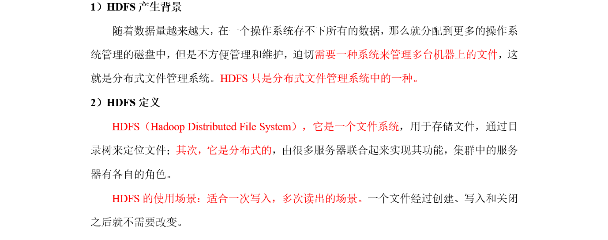

 

### 	HDFS优缺点


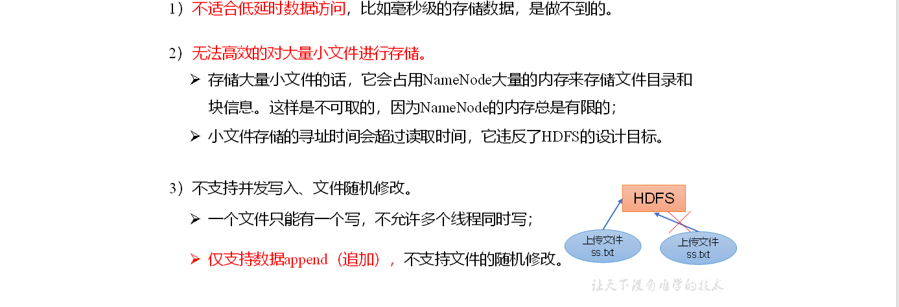

### 	HDFS组成架构

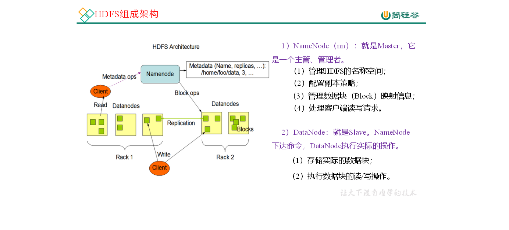

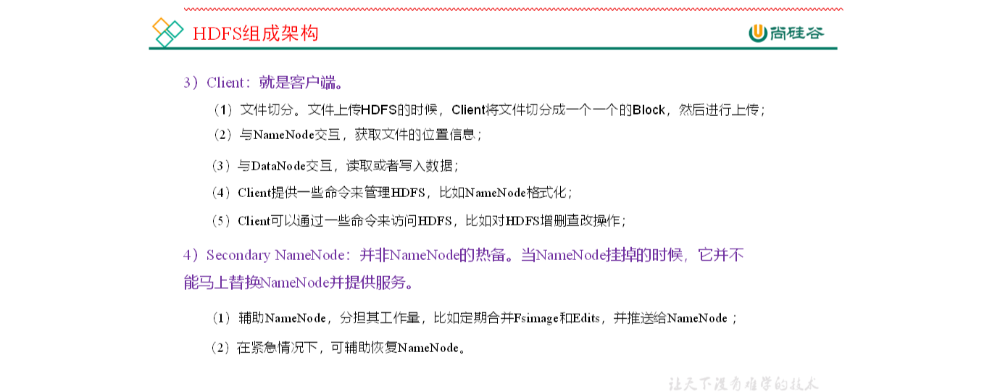

### 	🚩HDFS文件块大小（面试重点）

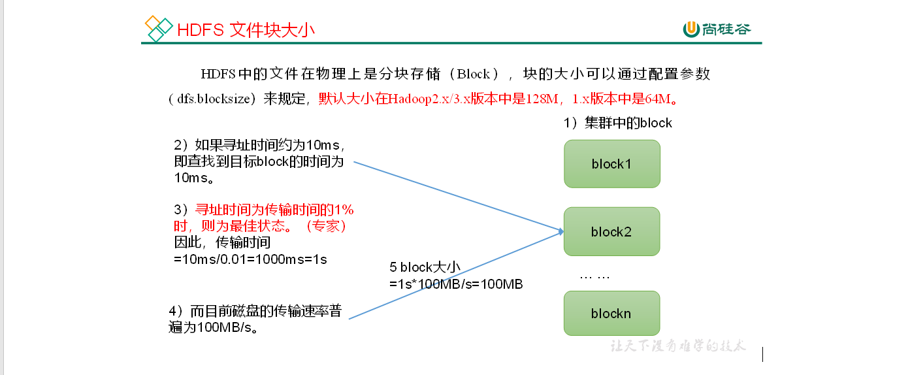	

# 二、🚩HDFS的Shell相关操作

### 	基本语法

hadoop fs 具体命令        OR       hdfs dfs 具体命令

两个是完全相同的。

**1. 显示当前目录结构**

```shell
# 显示当前目录结构
hadoop fs -ls  <path>
# 递归显示当前目录结构
hadoop fs -ls  -R  <path>
# 显示根目录下内容
hadoop fs -ls  /
```

**2. 创建目录**

```shell
# 创建目录
hadoop fs -mkdir  <path> 
# 递归创建目录
hadoop fs -mkdir -p  <path>  
```

**3. 删除操作**

```shell
# 删除文件
hadoop fs -rm  <path>
# 递归删除目录和文件
hadoop fs -rm -R  <path> 
```

**4. 从本地加载文件到 HDFS**

```shell
# 二选一执行即可
hadoop fs -put  [localsrc] [dst] 
hadoop fs -copyFromLocal [localsrc] [dst] 
```

**5. 从 HDFS 导出文件到本地**

```shell
# 二选一执行即可
hadoop fs -get  [dst] [localsrc] 
hadoop fs -copyToLocal [dst] [localsrc] 
```

**6. 查看文件内容**

```shell
# 二选一执行即可
hadoop fs -text  <path> 
hadoop fs -cat  <path>  
```

**7. 显示文件的最后一千字节**

```shell
hadoop fs -tail  <path> 
# 和Linux下一样，会持续监听文件内容变化 并显示文件的最后一千字节
hadoop fs -tail -f  <path> 
```

**8. 拷贝文件**

```shell
hadoop fs -cp [src] [dst]
```

**9. 移动文件**

```shell
hadoop fs -mv [src] [dst] 
```


**10. 统计当前目录下各文件大小**  
+ 默认单位字节  
+ -s : 显示所有文件大小总和，
+ -h : 将以更友好的方式显示文件大小（例如 64.0m 而不是 67108864）
```shell
hadoop fs -du  <path>  
```

**11. 合并下载多个文件**
+ -nl  在每个文件的末尾添加换行符（LF）
+ -skip-empty-file 跳过空文件

```shell
hadoop fs -getmerge
# 示例 将HDFS上的hbase-policy.xml和hbase-site.xml文件合并后下载到本地的/usr/test.xml
hadoop fs -getmerge -nl  /test/hbase-policy.xml /test/hbase-site.xml /usr/test.xml
```

**12. 统计文件系统的可用空间信息**

```shell
hadoop fs -df -h /
```

**13. 更改文件复制因子**
```shell
hadoop fs -setrep [-R] [-w] <numReplicas> <path>
```
+ 更改文件的复制因子（副本）。如果 path 是目录，则更改其下所有文件的复制因子
+ -w : 请求命令是否等待复制完成

```shell
# 示例
hadoop fs -setrep -w 3 /user/hadoop/dir1
```

**14. 权限控制**  
```shell
# 权限控制和Linux上使用方式一致
# 变更文件或目录的所属群组。 用户必须是文件的所有者或超级用户。
hadoop fs -chgrp [-R] GROUP URI [URI ...]
# 修改文件或目录的访问权限  用户必须是文件的所有者或超级用户。
hadoop fs -chmod [-R] <MODE[,MODE]... | OCTALMODE> URI [URI ...]
# 修改文件的拥有者  用户必须是超级用户。
hadoop fs -chown [-R] [OWNER][:[GROUP]] URI [URI ]
```

**15. 文件检测**

```shell
hadoop fs -test - [defsz]  URI
```
可选选项：
+ -d：如果路径是目录，返回 0。
+ -e：如果路径存在，则返回 0。
+ -f：如果路径是文件，则返回 0。
+ -s：如果路径不为空，则返回 0。
+ -r：如果路径存在且授予读权限，则返回 0。
+ -w：如果路径存在且授予写入权限，则返回 0。
+ -z：如果文件长度为零，则返回 0。

```shell
# 示例
hadoop fs -test -e filename
```


> **设置的副本数只是记录在NameNode的元数据中，是否真的会有这么多副本，还得看DataNode的数量。因为目前只有3台设备，最多也就3个副本，只有节点数的增加到10台时，副本数才能达到10。**


# 三、HDFS的客户端API


### 	客户端环境准备


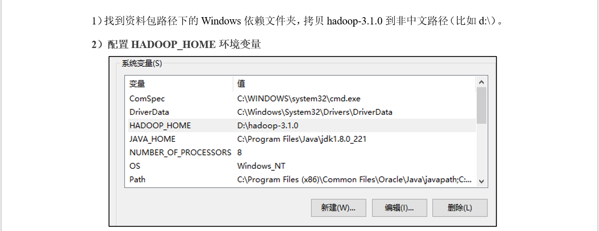


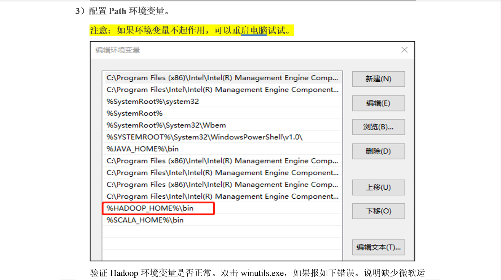


**在IDEA中创建一个Maven工程HdfsClientDemo，并导入相应的依赖坐标+日志添加**

```xml
<dependencies>
    <dependency>
        <groupId>org.apache.hadoop</groupId>
        <artifactId>hadoop-client</artifactId>
        <version>3.1.3</version>
    </dependency>
    <dependency>
        <groupId>junit</groupId>
        <artifactId>junit</artifactId>
        <version>4.12</version>
    </dependency>
    <dependency>
        <groupId>org.slf4j</groupId>
        <artifactId>slf4j-log4j12</artifactId>
        <version>1.7.30</version>
    </dependency>
</dependencies>

```

> 在项目的src/main/resources目录下，新建一个文件，命名为“log4j.properties”，在文件中填入

```properties
log4j.rootLogger=INFO, stdout  
log4j.appender.stdout=org.apache.log4j.ConsoleAppender  
log4j.appender.stdout.layout=org.apache.log4j.PatternLayout  
log4j.appender.stdout.layout.ConversionPattern=%d %p [%c] - %m%n  
log4j.appender.logfile=org.apache.log4j.FileAppender  
log4j.appender.logfile.File=target/spring.log  
log4j.appender.logfile.layout=org.apache.log4j.PatternLayout  
log4j.appender.logfile.layout.ConversionPattern=%d %p [%c] - %m%n
```

**创建包名：com.atguigu.hdfs**

**创建HdfsClient类**

```java
public class HdfsClient {

    @Test
    public void testMkdirs() throws IOException, URISyntaxException, InterruptedException {

        // 1 获取文件系统
        Configuration configuration = new Configuration();

        // FileSystem fs = FileSystem.get(new URI("hdfs://hadoop102:8020"), configuration);
        FileSystem fs = FileSystem.get(new URI("hdfs://hadoop102:8020"), configuration,"atguigu");

        // 2 创建目录
        fs.mkdirs(new Path("/xiyou/huaguoshan/"));

        // 3 关闭资源
        fs.close();
    }
}

```

**执行程序**

`客户端去操作HDFS时，是有一个用户身份的。默认情况下，HDFS客户端API会从采用Windows默认用户访问HDFS，会报权限异常错误。所以在访问HDFS时，一定要配置用户。`

### 	HDFS的API使用

### FileSystem

FileSystem 是所有 HDFS 操作的主入口。由于之后的每个单元测试都需要用到它，这里使用 `@Before` 注解进行标注。

```java
import org.apache.hadoop.conf.Configuration;
import org.apache.hadoop.fs.*;
import org.junit.After;
import org.junit.Before;
import org.junit.Test;

import java.io.IOException;
import java.net.URI;
import java.net.URISyntaxException;
import java.util.Arrays;

public class HdfsClient {

    private FileSystem fs;

    @Before
    public void initO() throws URISyntaxException, IOException, InterruptedException {
        // 1 获取文件系统

        Configuration configuration = new Configuration();
        // FileSystem fs = FileSystem.get(new URI("hdfs://hadoop102:8020"), configuration);
        fs = FileSystem.get(new URI("hdfs://hadoop102:8020"), configuration, "atguigu");
    }

    @After
    public void close() throws IOException {

        // 3 关闭资源
        fs.close();
    }
```


### 		HDFS文件上传（测试参数优先级）

```java
    @Test
    public void testMkdirs() throws IOException, URISyntaxException, InterruptedException {

        // 2 创建目录
        fs.mkdirs(new Path("/xiyou/huaguoshan1"));
    }
    @Test
    public void testput() throws IOException {
        /*
        * 参数解读
        * 参数1： 是否删除源文件
        * 参数2： 存在是否覆写
        * 参数3： 源路径
        * 参数4： 目标路径（new Patch（ 协议://主机名/路径） ）*/
        fs.copyFromLocalFile(true,true,new Path("D:\\sunwukong.txt"),
                new Path("hdfs://hadoop102/xiyou/huaguoshan"));
    }
```

`参数优先级排序`：（1）客户端代码中设置的值 >（2）ClassPath下的用户自定义配置文件 >（3）然后是服务器的自定义配置（xxx-site.xml） >（4）服务器的默认配置（xxx-default.xml）

### 		HDFS文件下载

```java
 @Test
    public void testget() throws IOException {

        /*
        * 参数解读
        * 参数1：是否删除源文件
        * 参数2： 源路径
        * 参数3： 目标路径
        * 参数4： 是否开启文件校验*/
        fs.copyToLocalFile(false,
                new Path("hdfs://hadoop102/xiyou/huaguoshan"),
                new Path("D:\\sunwukong"),true);

    }
```


### 		HDFS文件更名和移动

```java
@Test
public void testMv() throws IOException {
    //参数解读 参数1： 源文件路径  参数2： 目标文件路径
    fs.rename(new Path("/input/word.txt")
            ,new Path("/input/ss.txt"));
     //文件的移动和更名
    fs.rename(new Path("/input/word.txt")
            ,new Path("/cls.txt"));
    //目录改名
    fs.rename(new Path("/input")
            ,new Path("/output"));
}
```

### 		HDFS删除文件和目录

```java
@Test
public void testRm() throws IOException {
    //  参数解读 参数1：要删除的路径点 参数2: 是否递归
    fs.delete(new Path("/jdk-8u212-linux-x64.tar.gz"),false);
    //删除空目录
    fs.delete(new Path("/xiyou"),false);
    //删除非空目录  递归删除
    fs.delete(new Path("/emptyDir"));

}
```

### 		HDFS文件详情查看

```java
  @Test
    public void fileDetail() throws IOException {
        // 2 获取文件详情
        RemoteIterator<LocatedFileStatus> listFiles = fs.listFiles(new Path("/"), true);

        while (listFiles.hasNext()) {
            LocatedFileStatus fileStatus = listFiles.next();

            System.out.println("========" + fileStatus.getPath() + "=========");
            System.out.println(fileStatus.getPermission());
            System.out.println(fileStatus.getOwner());
            System.out.println(fileStatus.getGroup());
            System.out.println(fileStatus.getLen());
            System.out.println(fileStatus.getModificationTime());
            System.out.println(fileStatus.getReplication());
            System.out.println(fileStatus.getBlockSize());
            System.out.println(fileStatus.getPath().getName());

            // 获取块信息
            BlockLocation[] blockLocations = fileStatus.getBlockLocations();
            System.out.println(Arrays.toString(blockLocations));

        }
    }
}

```


### 		HDFS文件和文件夹判断

```java
@Test
public void testListStatus() throws IOException, InterruptedException, URISyntaxException{

    // 1 获取文件配置信息
    Configuration configuration = new Configuration();
    FileSystem fs = FileSystem.get(new URI("hdfs://hadoop102:8020"), configuration, "atguigu");

    // 2 判断是文件还是文件夹
    FileStatus[] listStatus = fs.listStatus(new Path("/"));

    for (FileStatus fileStatus : listStatus) {

        // 如果是文件
        if (fileStatus.isFile()) {
            System.out.println("f:"+fileStatus.getPath().getName());
        }else {
            System.out.println("d:"+fileStatus.getPath().getName());
        }
    }

```

### 判断文件是否存在

```java
@Test
public void exist() throws Exception {
    boolean exists = fileSystem.exists(new Path("/hdfs-api/test/a.txt"));
    System.out.println(exists);
}
```


# 四、🔥HDFS的读写流程（面试重点）

## 	HDFS写数据流程

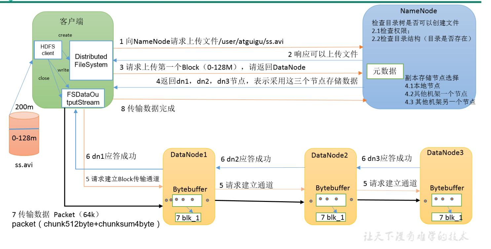

## 		剖析文件写入

（1）客户端通过Distributed FileSystem模块向NameNode请求上传文件，NameNode检查目标文件是否已存在，父目录是否存在。

（2）NameNode返回是否可以上传。

（3）客户端请求第一个 Block上传到哪几个DataNode服务器上。

（4）NameNode返回3个DataNode节点，分别为dn1、dn2、dn3。

（5）客户端通过FSDataOutputStream模块请求dn1上传数据，dn1收到请求会继续调用dn2，然后dn2调用dn3，将这个通信管道建立完成。

（6）dn1、dn2、dn3逐级应答客户端。

（7）客户端开始往dn1上传第一个Block（先从磁盘读取数据放到一个本地内存缓存），以Packet为单位，dn1收到一个Packet就会传给dn2，dn2传给dn3；dn1每传一个`packet`会放入一个应答队列等待应答。

（8）当一个Block传输完成之后，客户端再次请求NameNode上传第二个Block的服务器。（重复执行3-7步）。

## 		网络拓扑-节点距离计算

 `两个机器（节点）的直接的距离`

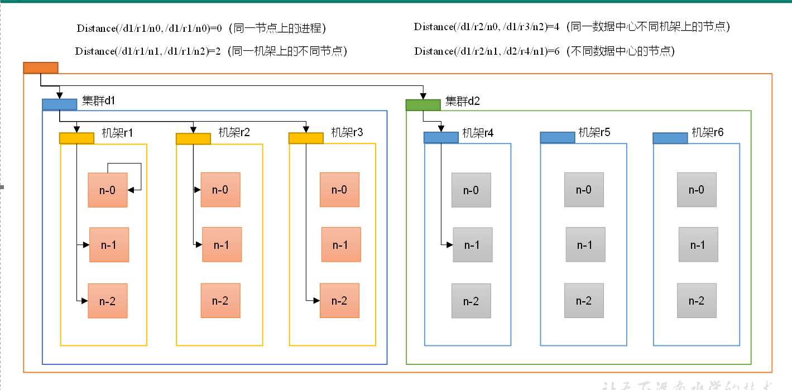

`n-1   ————   n-2`    为`2`

## 		机架感知（副本存储节点选择）

==第一个副本在Clinent所处的节点上，如果客户端在集群外，随机选一个==

==第二个副本在·另一个机架的随机一个节点==

==第三个副本在第二个副本所在机架的随机节点==

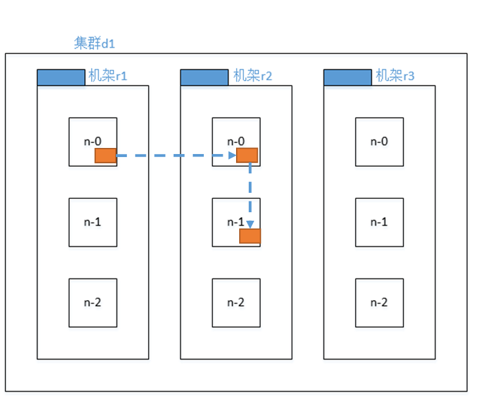

## 	HDFS读数据流程

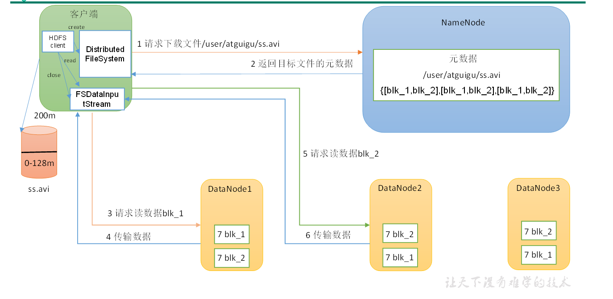

> （1）客户端通过DistributedFileSystem向NameNode请求下载文件，NameNode通过查询元数据，找到文件块所在的DataNode地址。
>
> （2）挑选一台DataNode（就近原则，然后随机）服务器，请求读取数据。
>
> （3）DataNode开始传输数据给客户端（从磁盘里面读取数据输入流，以Packet为单位来做校验）。
>
> （4）客户端以Packet为单位接收，先在本地缓存，然后写入目标文件。

# 五、NN和2NN

## 	NN和2NN工作机制

`fsimage`存储的是文件系统的树形结构信息

`edit`存储的是对源文件的增删改操作

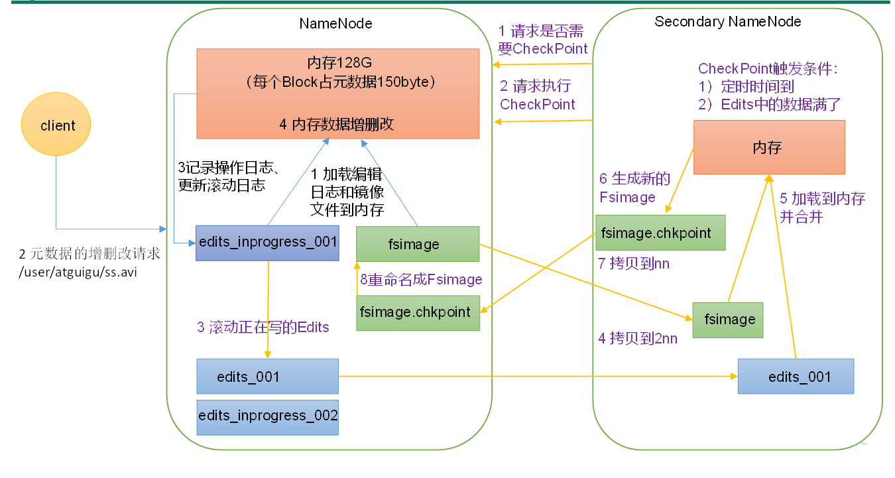

**1）第一阶段：NameNode启动**

（1）第一次启动NameNode格式化后，创建Fsimage和Edits文件。如果不是第一次启动，直接加载编辑日志和镜像文件到内存。

（2）客户端对元数据进行增删改的请求。

（3）NameNode记录操作日志，更新滚动日志。

（4）NameNode在内存中对元数据进行增删改。

**2）第二阶段：Secondary NameNode工作**

（1）Secondary NameNode询问NameNode是否需要CheckPoint。直接带回NameNode是否检查结果。

（2）Secondary NameNode请求执行CheckPoint。

（3）NameNode滚动正在写的Edits日志。

（4）将滚动前的编辑日志和镜像文件拷贝到Secondary NameNode。

（5）Secondary NameNode加载编辑日志和镜像文件到内存，并合并。

（6）生成新的镜像文件fsimage.chkpoint。

（7）拷贝fsimage.chkpoint到NameNode。

（8）NameNode将fsimage.chkpoint重新命名成fsimage。

## 	Fsimage和Edits解析

`Fsimage文件`：ＨＤＦＳ文件系统元数据的一个永久性检查点，其中包含HDFS文件系统的所有目录和文件的序列化信息

`Edit文件`：存放HDFS文件系统的所有更新操作的路径,文件系统客户端执行的所有写操作

`seen_txid文件`保存的是一个数字,就是最后一个edits_的数字

每次NN启动时都会将Fsimage文件读入内存,加载Edits里面的更新操作,保证内存中的元数据最新的,同步的,可以看成NN启动的时候就将Fsimage和Edits文件进行了合并

##### 1）oiv查看Fsimage文件

> 基本语法     **hdfs oiv -p 文件类型 -i镜像文件 -o 转换后文件输出路径**

```sh
[atguigu@hadoop102 current]$ pwd
/opt/module/hadoop-3.1.3/data/dfs/name/current

[atguigu@hadoop102 current]$ hdfs oiv -p XML -i fsimage_0000000000000000025 -o /opt/module/hadoop-3.1.3/fsimage.xml

[atguigu@hadoop102 current]$ cat /opt/module/hadoop-3.1.3/fsimage.xml


```

##### **2**）oev查看Edits文件

> 基本语法        **hdfs oev -p 文件类型 -i  编辑日志 -o 转换后文件输出路径**

```sh
[atguigu@hadoop102 current]$ hdfs oev -p XML -i edits_0000000000000000012-0000000000000000013 -o /opt/module/hadoop-3.1.3/edits.xml

[atguigu@hadoop102 current]$ cat /opt/module/hadoop-3.1.3/edits.xml

```


## 	CheckPoint时间设置

==1）通常情况下，SecondaryNameNode每隔一小时执行一次==

```xml
	[hdfs-default.xml]
<property>
  <name>dfs.namenode.checkpoint.period</name>
  <value>3600s</value>
</property>

```

==2）一分钟检查一次操作次数，当操作次数达到1百万时，SecondaryNameNode执行一次。==

```xml
<property>
  <name>dfs.namenode.checkpoint.txns</name>
  <value>1000000</value>
<description>操作动作次数</description>
</property>

<property>
  <name>dfs.namenode.checkpoint.check.period</name>
  <value>60s</value>
<description> 1分钟检查一次操作次数</description>
</property>

```


# 六、DataNode

## DataNode工作机制

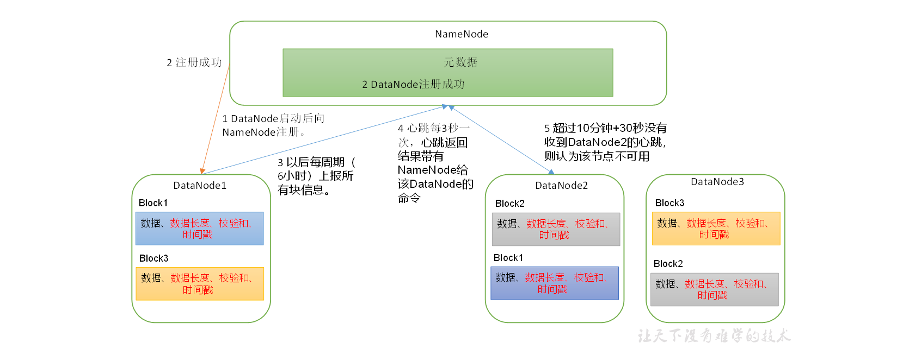

（1）一个数据块在DataNode上以文件形式存储在磁盘上，包括两个文件，一**个是数据本身，一个是元数据包括数据块的长度，块数据的校验和以及时间戳。**

（2）DataNode启动后向NameNode注册，通过后，**周期性（6小时）**的向NameNode上报所有的块信息。

DN向NN汇报当前解读信息的时间间隔，默认6小时；

```xml
<property>
	<name>dfs.blockreport.intervalMsec</name>
	<value>21600000</value>
	<description>Determines block reporting interval in milliseconds.</description>
</property>

```

DN扫描自己节点块信息列表的时间，默认6小时

```xml
<property>
	<name>dfs.datanode.directoryscan.interval</name>
	<value>21600s</value>
	<description>Interval in seconds for Datanode to scan data directories and reconcile the difference between blocks in memory and on the disk.
	Support multiple time unit suffix(case insensitive), as described
	in dfs.heartbeat.interval.
	</description>
</property>

```

（3）心跳是每3秒一次，**心跳返回结果带有NameNode给该DataNode的命令如复制块数据到另一台机器**，或删除某个数据块。如果超过10分钟没有收到某个DataNode的心跳，则认为该节点不可用。

（4）**集群运行中可以安全加入和退出一些机器。**


## 数据完整性

🧐思考：

如果电脑磁盘里面存储的数据是控制高铁信号灯的红灯信号（1）和绿灯信号（0），但是存储该数据的磁盘坏了，一直显示是绿灯，是否很危险？同理DataNode节点上的数据损坏了，却没有发现，是否也很危险，那么如何解决呢？

如下是DataNode节点保证数据完整性的方法。

（1）当DataNode读取Block的时候，它会计算`CheckSum`。

（2）如果计算后的CheckSum，与Block创建时值`不一样`，说明Block已经损坏。

（3）Client读取`其他DataNode上的Block`。

（4）常见的校验算法`crc（32）`，`md5（128`），`sha1（160）`

（5）DataNode在其文件创建后周期验证CheckSum。


## 掉线时限参数设置

   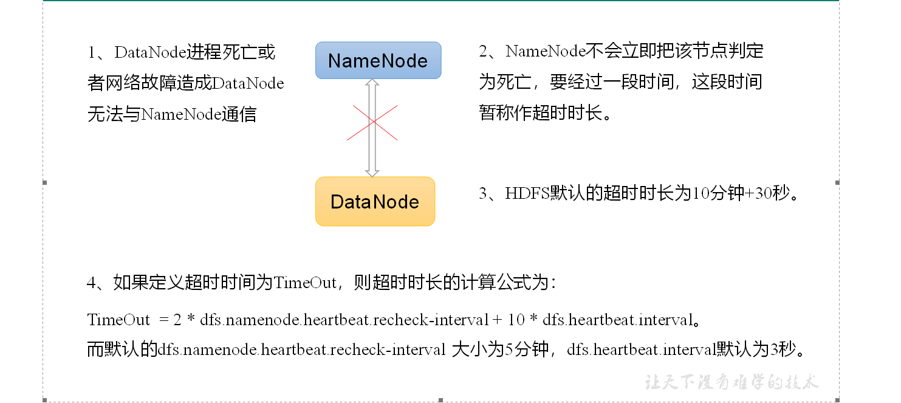

==注意==:   hdfs-site.xml 配置文件中的`heartbeat.recheck.interval`的单位为毫秒，`dfs.heartbeat.interval`的单位为秒。

```xml
<property>
    <name>dfs.namenode.heartbeat.recheck-interval</name>
    <value>300000</value>
</property>

<property>
    <name>dfs.heartbeat.interval</name>
    <value>3</value>
</property>

```


# 七、🚩总结


### 1、常用端口号


==Hadoop3.x==

|     HDFS NameNode 内部通常端口：     | 8020/9000/9820 |
| :----------------------------------: | -------------- |
| **HDFS NameNode 对用户的查询端口：** | **9870**       |
|     **Yarn查看任务运行情况的：**     | **8088**       |
|           **历史服务器：**           | **19888**      |


Hadoop2.x 

|   HDFS NameNode 内部通常端口：   | 8020/9000 |
| :------------------------------: | --------- |
| HDFS NameNode 对用户的查询端口： | 50070     |
|     Yarn查看任务运行情况的：     | 8088      |
|           历史服务器：           | 19888     |


### 	2、常用的配置文件

|             3.x             | 2.x                        |
| :-------------------------: | -------------------------- |
|      **core-site.xml**      | **core-site.xml**          |
|      **hdfs-site.xml**      | **hdfs-site.xml**          |
|      **yarn-site.xml**      | **yarn-site.xml**          |
| **mapred-site.xml workers** | **mapred-site.xml slaves** |


​	 


### 3、面试重点

1、HDFS文件块大小（面试重点）
	硬盘读写速度
	在企业中  一般128m（中小公司）   256m （大公司）

2、HDFS的Shell操作（开发重点）

3、HDFS的读写流程（面试重点）
