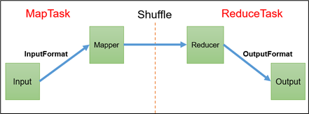

# MapReduce


## 一、MapReduce概述

### 定义

MapReduce是一个==分布式运算程序==的编程框架，是用户开发“基于Hadoop的数据分析应用”的核心框架。

MapReduce核心功能是将==用户编写的业务逻辑代码==和==自带默认组件==整合成一个完整的==分布式运算程序==，并发运行在一个Hadoop集群上。

### 优缺点

#### 优点

+ 易于编程。用户只关心业务逻辑   ，实现框架的接口
+ **良好的扩展性**：动态增加·服务器，解决计算资源不够的问题
+ **高容错性**  其中一台机器挂了，它可以把上面的计算任务转移到另外一个节点上运行，不至于这个任务运行失败
+ **适合PB级以上海量数据的离线处理**

#### 缺点

- **不擅长实时计算**：MapReduce无法像MySQL一样，在毫秒或者秒级内返回结果

- **不擅长流式计算**。  （Sparksteaming Flink 擅长）

- 不擅长**DAG**有向无环图计算。[^DAG]:机器①的结果作为机器②的输入值，机器②的结果作为机器③的输入【往下循环】在这种情况下，MapReduce并不是不能做，而是使用后，==每个MapReduce作业的输出结果都会写入到磁盘，会造成大量的磁盘IO，导致性能非常的低下。==

  

### 核心思想

  MapReduce 作业通过将输入的数据集拆分为独立的块，这些块由 `map` 以并行的方式处理，框架对 `map` 的输出进行排序，然后输入到 `reduce` 中。MapReduce 框架专门用于 `<key，value>` 键值对处理，它将作业的输入视为一组 `<key，value>` 对，并生成一组 `<key，value>` 对作为输出。输入和输出的 `key` 和 `value` 都必须实现[Writable](http://hadoop.apache.org/docs/stable/api/org/apache/hadoop/io/Writable.html) 接口。

这里以词频统计为例进行说明，MapReduce 处理的流程如下：

1. **input** : 读取文本文件；
2. **splitting** : 将文件按照行进行拆分，此时得到的 `K1` 行数，`V1` 表示对应行的文本内容；
3. **mapping** : 并行将每一行按照空格进行拆分，拆分得到的 `List(K2,V2)`，其中 `K2` 代表每一个单词，由于是做词频统计，所以 `V2` 的值为 1，代表出现 1 次；
4. **shuffling**：由于 `Mapping` 操作可能是在不同的机器上并行处理的，所以需要通过 `shuffling` 将相同 `key` 值的数据分发到同一个节点上去合并，这样才能统计出最终的结果，此时得到 `K2` 为每一个单词，`List(V2)` 为可迭代集合，`V2` 就是 Mapping 中的 V2；
5. **Reducing** : 这里的案例是统计单词出现的总次数，所以 `Reducing` 对 `List(V2)` 进行归约求和操作，最终输出。

MapReduce 编程模型中 `splitting` 和 `shuffing` 操作都是由框架实现的，需要我们自己编程实现的只有 `mapping` 和 `reducing`，==这也就是 MapReduce 这个称呼的来源。==

一个完整的MapReduce程序在分布式运行时有==三类实例进程==：

（1）**MrAppMaster**：负责整个程序的过程调度及状态协调。

（2）**MapTask**：负责Map阶段的整个数据处理流程。

（3）**ReduceTask**：负责Reduce阶段的整个数据处理流程。


> **常用数据序列化类型**

| **Java**类型 | Hadoop Writable类型 |
| ------------ | ------------------- |
| Boolean      | BooleanWritable     |
| Byte         | ByteWritable        |
| Int          | IntWritable         |
| Float        | FloatWritable       |
| Long         | LongWritable        |
| Double       | DoubleWritable      |
| ==String==   | ==Text==            |
| Map          | MapWritable         |
| Array        | ArrayWritable       |
| Null         | NullWritable        |


### MapReduce编程规范

**Mapper阶段**

+ 用户自定义的Mapper要继承自己的父类
+ Mapper的出入数据是KV对形式（KV的类型可自定义）
+ Mapper中的业务逻辑写在map（）方法中
+ MApper的处处数据是KV对形式（KV的类型可自定义）
+ ==map（）方法（MapTask进程）对每一个<K,V>调用一次==


**Reduce阶段**

+ 用户自定义的Reduce要继承自己的父类
+ Reduce的输入数据类型对应Mapper的输入数据类型也是KV
+ Reduce的业务逻辑写在reduce（）方法中
+ ==ReduceTask进程对每一组相同k的<k,v> 组调用一次reduce（）方法==


**Driver阶段**

相当于YARN集群的客户端，用于提交我们整个程序到YARN集群，提交的是封装了MapReduce程序相关裕兴参数的job对象

~~~java
				Driver的7个步骤

		// 1 获取配置信息以及获取job对象
		Configuration conf = new Configuration();
		Job job = Job.getInstance(conf);

		// 2 关联本Driver程序的jar
		job.setJarByClass(本Driver程序主类名.class);

		// 3 关联Mapper和Reducer的jar
		job.setMapperClass(Mapper程序主类名.class);
		job.setReducerClass(Reducer程序主类名.class);

		// 4 设置Mapper输出的kv类型
		job.setMapOutputKeyClass(Mapper输出的K类型.class);
		job.setMapOutputValueClass(Mapper输出的V类型.class);

		// 5 设置最终输出kv类型
		job.setOutputKeyClass(最终输出k类型.class);
		job.setOutputValueClass(最终输出kv类型.class);
		
		// 6 设置输入和输出路径
		（Linux集群下）
		FileInputFormat.setInputPaths(job, new Path(args[0]));
		FileOutputFormat.setOutputPath(job, new Path(args[1]));
		（Windows下）
		FileInputFormat.setInputPaths(job, new Path("源文件地址"));
		FileOutputFormat.setOutputPath(job, new Path("输出路径"));
		// 7 提交job
		boolean result = job.waitForCompletion(true);
		System.exit(result ? 0 : 1);

~~~


### WordCount案例

> 需求：统计一文件中单词出现的个数

#### **环境准备**

+ 创建maven工程

+ 添加pom依赖

  ~~~xml
  <dependencies>
      <dependency>
          <groupId>org.apache.hadoop</groupId>
          <artifactId>hadoop-client</artifactId>
          <version>3.1.3</version>
      </dependency>
      <dependency>
          <groupId>junit</groupId>
          <artifactId>junit</artifactId>
          <version>4.12</version>
      </dependency>
      <dependency>
          <groupId>org.slf4j</groupId>
          <artifactId>slf4j-log4j12</artifactId>
          <version>1.7.30</version>
      </dependency>
  </dependencies>
  
  ~~~

  

+ 在项目的src/main/resources目录下，新建一个文件，命名为“log4j.properties”添加如下

  ~~~properties
  log4j.rootLogger=INFO, stdout  
  log4j.appender.stdout=org.apache.log4j.ConsoleAppender  
  log4j.appender.stdout.layout=org.apache.log4j.PatternLayout  
  log4j.appender.stdout.layout.ConversionPattern=%d %p [%c] - %m%n  
  log4j.appender.logfile=org.apache.log4j.FileAppender  
  log4j.appender.logfile.File=target/spring.log  
  log4j.appender.logfile.layout=org.apache.log4j.PatternLayout  
  log4j.appender.logfile.layout.ConversionPattern=%d %p [%c] - %m%n
  
  ~~~

+ 创建包名

  

#### 编写程序

> 注意：导包别导错

+ 编写Mapper类

  ~~~java
  package com.atguigu.mapreduce.wordcount;
  import java.io.IOException;
  import org.apache.hadoop.io.IntWritable;
  import org.apache.hadoop.io.LongWritable;
  import org.apache.hadoop.io.Text;
  import org.apache.hadoop.mapreduce.Mapper;
  
  public class WordCountMapper extends Mapper<LongWritable, Text, Text, IntWritable>{
  	
  	Text k = new Text();
  	IntWritable v = new IntWritable(1);
  	
  	@Override
  	protected void map(LongWritable key, Text value, Context context)	throws IOException, InterruptedException {
  		
  		// 1 获取一行
  		String line = value.toString();
  		
  		// 2 切割
  		String[] words = line.split(" ");
  		
  		// 3 输出
  		for (String word : words) {
  			
  			k.set(word);
  			context.write(k, v);
  		}
  	}
  }
  
  ~~~

+  编写Reducer类

  ~~~java
  package com.atguigu.mapreduce.wordcount;
  import java.io.IOException;
  import org.apache.hadoop.io.IntWritable;
  import org.apache.hadoop.io.Text;
  import org.apache.hadoop.mapreduce.Reducer;
  
  public class WordCountReducer extends Reducer<Text, IntWritable, Text, IntWritable>{
  
  int sum;
  IntWritable v = new IntWritable();
  
  	@Override
  	protected void reduce(Text key, Iterable<IntWritable> values,Context context) throws IOException, InterruptedException {
  		
  		// 1 累加求和
  		sum = 0;
  		for (IntWritable count : values) {
  			sum += count.get();
  		}
  		
  		// 2 输出
           v.set(sum);
  		context.write(key,v);
  	}
  }
  
  ~~~

+ 编写Driver驱动类

  ​							**牢记七个步骤**

#### 本地测试

+ 需要首先配置好HADOOP_HOME变量以及Windows运行依赖

+ 在IDEA/Eclipse上运行程序

### 集群测试

+ 用maven打jar包，需要添加的打包插件依赖

  ~~~xml
  <build>
      <plugins>
          <plugin>
              <artifactId>maven-compiler-plugin</artifactId>
              <version>3.6.1</version>
              <configuration>
                  <source>1.8</source>
                  <target>1.8</target>
              </configuration>
          </plugin>
          <plugin>
              <artifactId>maven-assembly-plugin</artifactId>
              <configuration>
                  <descriptorRefs>
                      <descriptorRef>jar-with-dependencies</descriptorRef>
                  </descriptorRefs>
              </configuration>
              <executions>
                  <execution>
                      <id>make-assembly</id>
                      <phase>package</phase>
                      <goals>
                          <goal>single</goal>
                      </goals>
                  </execution>
              </executions>
          </plugin>
      </plugins>
  </build>
  
  ~~~

+ 将程序打成jar包

+ 修改不带依赖的jar包名称==简化后的名称==.jar，并拷贝该jar包到Hadoop集群的/opt/module/hadoop-3.1.3路径。

+ 启动Hadoop集群

  ~~~sh
  [atguigu@hadoop102 hadoop-3.1.3]$ sbin/start-dfs.sh
  [atguigu@hadoop103 hadoop-3.1.3]$ sbin/start-yarn.sh
  ~~~

+ 执行WordCount程序

  ~~~shell
  [atguigu@hadoop102 hadoop-3.1.3]$ hadoop jar  简化后的名称.jar
   com.atguigu.mapreduce.wordcount.WordCountDriver /user/atguigu/input     /user/atguigu/output
  ~~~
  


## 二、Hadoop序列化


### 序列化概述

1）**什么是序列化**

**序列化**就是==把内存中的对象，转换成字节序列==（或其他数据传输协议）以便于存储到磁盘（持久化）和网络传输。 

**反序列化**就是将收到字节序列（或其他数据传输协议）或者是==磁盘的持久化数据，转换成内存中的对象。==

2）**为什么要序列化**

一般来说，“活的”对象只生存在内存里，关机断电就没有了。而且“活的”对象只能由本地的进程使用，不能被发送到网络上的另外一台计算机。 然而==序列化可以存储“活的”对象，可以将“活的”对象发送到远程计算机。==

3）为什么不用Java的序列化

Java的序列化是一个重量级序列化框架（Serializable），一个对象被序列化后，会附带很多额外的信息（各种校验信息，Header，继承体系等），==不便于在网络中高效传输==。所以，Hadoop自己开发了一套序列化机制==（Writable）==。

4）Hadoop序列化特点：

**（1**）紧凑 **：**高效使用存储空间。

**（2**）快速：读写数据的额外开销小。

**（3**）互操作：支持多语言的交互


### 自定义bean对象实现序列化接口

> **具体实现bean对象序列化步骤如下7步。**

+ 必须实现Writable接口

+ 反序列化时，需要反射调用空参构造函数，所以==必须有空参构造==

  ~~~java
  public FlowBean() {
  	super();
  }
  ~~~

+ 重写序列化方法

  ~~~java
  @Override
  public void write(DataOutput out) throws IOException {
  	out.writeLong(upFlow);
  	out.writeLong(downFlow);
  	out.writeLong(sumFlow);
  }
  ~~~

+ 重写反序列化方法 

  ~~~java
  @Override
  public void readFields(DataInput in) throws IOException {
  	upFlow = in.readLong();
  	downFlow = in.readLong();
  	sumFlow = in.readLong();
  }
  ~~~

+ ==注意==: 反序列化的顺序和序列化的顺序完全一致

+ 要想把结果显示在文件中，需要**重写toString()**，可用"\t"分开，方便后续用

+ 如果需要将自定义的bean放在key中传输，则还需要==实现Comparable接口==，因为MapReduce框中的Shuffle过程要求对key必须能排序。

  ~~~java
  @Override
  public int compareTo(FlowBean o) {
  	// 倒序排列，从大到小
  	return this.sumFlow > o.getSumFlow() ? -1 : 1;
  }
  ~~~

  

  

  

  

### 序列化案例实操

> **需求**
>
> 统计每一个手机号耗费的总上行流量、总下行流量、总流量


**编写MapReduce程序**

+ 编写流量统计的Bean对象

  ~~~java
  package com.atguigu.mapreduce.writable;
  
  import org.apache.hadoop.io.Writable;
  import java.io.DataInput;
  import java.io.DataOutput;
  import java.io.IOException;
  
  //1 继承Writable接口
  public class FlowBean implements Writable {
  
      private long upFlow; //上行流量
      private long downFlow; //下行流量
      private long sumFlow; //总流量
  
      //2 提供无参构造
      
  		/*没啥看的删了*/
      
      //3 提供三个参数的getter和setter方法
              
     		/*占地方删了*/
              
      //4 实现序列化和反序列化方法,注意顺序一定要保持一致
      @Override
      public void write(DataOutput dataOutput) throws IOException {
          dataOutput.writeLong(upFlow);
          dataOutput.writeLong(downFlow);
          dataOutput.writeLong(sumFlow);
      }
  
      @Override
      public void readFields(DataInput dataInput) throws IOException {
          this.upFlow = dataInput.readLong();
          this.downFlow = dataInput.readLong();
          this.sumFlow = dataInput.readLong();
      }
  
      //5 重写ToString
      @Override
      public String toString() {
          return upFlow + "\t" + downFlow + "\t" + sumFlow;
      }
  }
  
  ~~~

+ 编写Mapper类

  ~~~java
  package com.atguigu.mapreduce.writable;
  
  import org.apache.hadoop.io.LongWritable;
  import org.apache.hadoop.io.Text;
  import org.apache.hadoop.mapreduce.Mapper;
  import java.io.IOException;
  
  public class FlowMapper extends Mapper<LongWritable, Text, Text, FlowBean> {
      private Text outK = new Text();
      private FlowBean outV = new FlowBean();
  
      @Override
      protected void map(LongWritable key, Text value, Context context) throws IOException, InterruptedException {
  
          //1 获取一行数据,转成字符串
          String line = value.toString();
  
          //2 切割数据
          String[] split = line.split("\t");
  
          //3 抓取我们需要的数据:手机号,上行流量,下行流量
          String phone = split[1];
          String up = split[split.length - 3];
          String down = split[split.length - 2];
  
          //4 封装outK outV
          outK.set(phone);
          outV.setUpFlow(Long.parseLong(up));
          outV.setDownFlow(Long.parseLong(down));
          outV.setSumFlow();
  
          //5 写出outK outV
          context.write(outK, outV);
      }
  }
  
  
  ~~~

+ 编写Reducer类

  ~~~java
  package com.atguigu.mapreduce.writable;
  
  import org.apache.hadoop.io.Text;
  import org.apache.hadoop.mapreduce.Reducer;
  import java.io.IOException;
  
  public class FlowReducer extends Reducer<Text, FlowBean, Text, FlowBean> {
      private FlowBean outV = new FlowBean();
      @Override
      protected void reduce(Text key, Iterable<FlowBean> values, Context context) throws IOException, InterruptedException {
  
          long totalUp = 0;
          long totalDown = 0;
  
          //1 遍历values,将其中的上行流量,下行流量分别累加
          for (FlowBean flowBean : values) {
              totalUp += flowBean.getUpFlow();
              totalDown += flowBean.getDownFlow();
          }
  
          //2 封装outKV
          outV.setUpFlow(totalUp);
          outV.setDownFlow(totalDown);
          outV.setSumFlow();
  
          //3 写出outK outV
          context.write(key,outV);
      }
  }
  
  ~~~

+ 编写Driver驱动类

  #略


## 三、MapReduce框架原理




### 1）InputFormat数据输入

------

==MapTask的并行度决定Map阶段的任务处理并发度，进而影响到整个Job的处理速度。==

+ **MapTask**并行度决定机制：

**数据块：**Block是HDFS物理上把数据分成一块一块。数据块是HDFS存储数据单位。

**数据切片：**数据切片只是在逻辑上对输入进行分片，并不会在磁盘上将其切分成片进行存储。数据切片是MapReduce程序计算输入数据的单位，一个切片会对应启动一个MapTask。


------

😪*FileInputFormat常见的接口实现类包括：TextInputFormat(默认)、KeyValueTextInputFormat、NLineInputFormat、CombineTextInputFormat和自定义InputFormat等。*

#### **Job提交流程源码**

------

> 重点：JOB会上传到集群三个文件 **jar包  切片规划文件  XML配置文件**

~~~java
waitForCompletion()

submit();

// 1建立连接
	connect();	
		// 1）创建提交Job的代理
		new Cluster(getConfiguration());
			// （1）判断是本地运行环境还是yarn集群运行环境
			initialize(jobTrackAddr, conf); 

// 2 提交job
submitter.submitJobInternal(Job.this, cluster)

	// 1）创建给集群提交数据的Stag路径
	Path jobStagingArea = JobSubmissionFiles.getStagingDir(cluster, conf);

	// 2）获取jobid ，并创建Job路径
	JobID jobId = submitClient.getNewJobID();

	// 3）拷贝jar包到集群
copyAndConfigureFiles(job, submitJobDir);	
	rUploader.uploadFiles(job, jobSubmitDir);

	// 4）计算切片，生成切片规划文件
writeSplits(job, submitJobDir);
		maps = writeNewSplits(job, jobSubmitDir);
		input.getSplits(job);

	// 5）向Stag路径写XML配置文件
writeConf(conf, submitJobFile);
	conf.writeXml(out);

	// 6）提交Job,返回提交状态
status = submitClient.submitJob(jobId, submitJobDir.toString(), job.getCredentials());

~~~

+ job流程解析


#### **FileInputFormat切片源码**

------

`重点`：

   + 切片时不考虑数据集整体。而是==针对每一个文件单独切片==

   + 源码中计算切片大小的公式

     ~~~java
     Math.max(minSize, Math.min(maxSize, blockSize))
         /*改变切片大小，让切片变大增大minSize
         			  让切片变小减小maxSize
                       blockSize为物理切片大小无法改变*/
     mapreduce.input.fileinputformat.split.minsize=1
     mapreduce.input.fileinputformat.split.maxsize=Long.MAXValue  默认值
     ~~~

     [^PS]:==通过改变minSize  maxSize的大小间接的改变切片块大小==
     
   + 每次切片时都要判断切完剩下的部分是否大于块的1.1倍，不大于1.1倍的就划分一块切片


------


  

   

​    

#### TextInputFormat

------

> TextInputFormat是默认的FileInputFormat实现类。按行读取每条记录。**键是存储该行在整个文件中的起始字节偏移量， LongWritable类型。值是这行的内容，不包括任何行终止符（换行符和回车符），Text类型。**
>


`示例`

+ 输入

  ~~~txt
  Rich learning form
  Intelligent learning engine
  Learning more convenient
  From the real demand for more close to the enterprise
  
  ~~~

+ 输出

  ~~~txt
   K，  V
  (0,  Rich learning form)
  (20,  Intelligent learning engine)
  (49,  Learning more convenient)
  (74,  From the real demand for more close to the enterprise)
  
  ~~~

  


#### CombineTextInputFormat切片机制

------

​	**背景：**

框架默认的TextInputFormat切片机制是对任务按文件规划切片，**不管文件多小，都会是一个单独的切片**，都会交给一个MapTask，这样如果有大量小文件，就会产生大量的MapTask，处理效率极其低下。

​	

​	**解决方案**

CombineTextInputFormat用于小文件过多的场景，它可以将多个小文件从逻辑上规划到一个切片中，这样，多个小文件就可以交给一个MapTask处理


​	**业务代码**

~~~java
//JOB  5~6之间添加
		
		//驱动类中添加代码如下：
		// 如果不设置InputFormat，它默认用的是TextInputFormat.class
job.setInputFormatClass(CombineTextInputFormat.class);

			//虚拟存储切片最大值设置4m
CombineTextInputFormat.setMaxInputSplitSize(job, 4194304);

~~~

​	注意：虚拟存储切片最大值设置最好根据实际的小文件大小情况来设置具体的值。


### 2）🚩MapReduce详细工作流程

------


> ​				Shuffle过程从第7步开始到第16步结束     具体步骤如下

**（1）MapTask收集我们的map()方法输出的kv对，放到内存缓冲区中**

**（2）从内存缓冲区不断溢出本地磁盘文件，可能会溢出多个文件**

**（3）多个溢出文件会被合并成大的溢出文件**

**（4）在溢出过程及合并的过程中，都要调用Partitioner进行分区和针对key进行排序**

**（5）ReduceTask根据自己的分区号，去各个MapTask机器上取相应的结果分区数据**

**（6）ReduceTask会抓取到同一个分区的来自不同MapTask的结果文件，ReduceTask会将这些文件再进行合并（归并排序）**

**（7）合并成大文件后，Shuffle的过程也就结束了，后面进入ReduceTask的逻辑运算过程（从文件中取出一个一个的键值对Group，调用用户自定义的reduce()方法）**

**==注意==：**

（1）Shuffle中的缓冲区大小会影响到MapReduce程序的执行效率，原则上说，缓冲区越大，磁盘io的次数越少，执行速度就越快。

（2）缓冲区的大小可以通过参数调整，参数：**mapreduce.task.io.sort.mb**默认**100M**。


### 3) Shuffle机制

------

#### 概念

Map方法之后，Reduce方法之前的数据处理过程称之为Shuffle。

+ 详细流程

  

+ 

#### Partition分区

------

+ 主要功能

  **将结果按照不同的需求输出到不同的文件中**


+ 默认分区

  ~~~java
  public class HashPartitioner<K2, V2> implements Partitioner<K2, V2> {
  
  
      public int getPartition(K2 key, V2 value, int numReduceTasks) {
          return (key.hashCode() &Integer.MAX_VALUE ) % numReduceTasks;
      }								2147483647
  }
  ~~~

  默认分区是根据**key的hashCode对ReduceTask个数取模**得到的。用户没法控制哪个key存储到那个分区


+ **自定义Partitioner步骤**

  + 自定义类继承Partitioner，重写getPartition（）方法

  ~~~java
  public class MyPartition extends Partitioner<Text, FlowBean> {
      
      @Override
      public int getPartition(Text text, FlowBean flowBean, int i) {
          //实现分区的业务代码
          return 0;
      }
  }
  ~~~

  + 在Job驱动中，设置自定义Partitioner

    ~~~java
            job.setPartitionerClass(MyPartition.class);
    ~~~

  + 自定义Partition之后根据自定义Partitioner的逻辑设置相应数量的ReduceTask

    ~~~java
         job.setNumReduceTasks(5);   //Partition=RedeceTask
    ~~~


`总结`

+ ReduceTasks数量>getPartition的结果     则会产生几个空的输出文件part-r-000xx
+ 1<ReduceTasks数量>getPartition的结果     报错抛异常
+ ReduceTasks数量=1            只产生一个结果文件
+ ==分区号从0开始逐一累加==


> ​																Partition分区案例实操


**需求**

​		手机号136、137、138、139开头都分别放到一个独立的4个文件中，其他开头的放到一个文件中。


**分析**

​		


**业务代码**

+ **增加分区类**

  ~~~java
  import org.apache.hadoop.io.Text;
  import org.apache.hadoop.mapreduce.Partitioner;
  
  public class ProvincePartitioner extends Partitioner<Text, FlowBean> {
  
      @Override
      public int getPartition(Text text, FlowBean flowBean, int numPartitions) {
          //获取手机号前三位prePhone
          String phone = text.toString();
          String prePhone = phone.substring(0, 3);
  
          //定义一个分区号变量partition,根据prePhone设置分区号
          int partition;
  
          if("136".equals(prePhone)){
              partition = 0;
          }else if("137".equals(prePhone)){
              partition = 1;
          }else if("138".equals(prePhone)){
              partition = 2;
          }else if("139".equals(prePhone)){
              partition = 3;
          }else {
              partition = 4;
          }
  
          //最后返回分区号partition
          return partition;
      }
  }
  
  ~~~

+ **在驱动函数中增加自定义数据分区设置和ReduceTask设置**

  ~~~java
  import org.apache.hadoop.conf.Configuration;
  import org.apache.hadoop.fs.Path;
  import org.apache.hadoop.io.Text;
  import org.apache.hadoop.mapreduce.Job;
  import org.apache.hadoop.mapreduce.lib.input.FileInputFormat;
  import org.apache.hadoop.mapreduce.lib.output.FileOutputFormat;
  import java.io.IOException;
  
  public class FlowDriver {
  
      public static void main(String[] args) throws IOException, ClassNotFoundException, InterruptedException {
  
          //1 获取job对象
          Configuration conf = new Configuration();
          Job job = Job.getInstance(conf);
  
          //2 关联本Driver类
          job.setJarByClass(FlowDriver.class);
  
          //3 关联Mapper和Reducer
          job.setMapperClass(FlowMapper.class);
          job.setReducerClass(FlowReducer.class);
  
          //4 设置Map端输出数据的KV类型
          job.setMapOutputKeyClass(Text.class);
          job.setMapOutputValueClass(FlowBean.class);
  
          //5 设置程序最终输出的KV类型
          job.setOutputKeyClass(Text.class);
          job.setOutputValueClass(FlowBean.class);
  
          ==//8 指定自定义分区器
          job.setPartitionerClass(ProvincePartitioner.class);
  
          //9 同时指定相应数量的ReduceTask
          job.setNumReduceTasks(5);
  
          //6 设置输入输出路径
          FileInputFormat.setInputPaths(job, new Path("D:\\inputflow"));
          FileOutputFormat.setOutputPath(job, new Path("D\\partitionout"));
  
          //7 提交Job
          boolean b = job.waitForCompletion(true);
          System.exit(b ? 0 : 1);
      }
  }
  
  ~~~

  

#### WritableComparable排序

------

​		shuffer阶段的三次排序

						+ 环形缓冲区              内存中快排 
						+ 磁盘中                     归并排序
						+ ReduceTask            归并排序

> 概述


> 排序分类


**自定义排序WritableComparable**

+ 实现WritableComparable接口重写compareTo方法

  ~~~java
  @Override
  public int compareTo(FlowBean bean) {
  
  	int result;
  		
  	// 按照总流量大小，倒序排列
  	if (this.sumFlow > bean.getSumFlow()) {
  		result = -1;
  	}else if (this.sumFlow < bean.getSumFlow()) {
  		result = 1;
  	}else {
  		result = 0;
  	}
  
  	return result;
  }
  ~~~

  

> ​								WritableComparable排序案例实操（全排序）


​	**需求**

​		序列化案例产生的结果再次对总流量进行倒序排序

​	**需求分析**


**业务代码**

~~~java
import org.apache.hadoop.io.WritableComparable;
import java.io.DataInput;
import java.io.DataOutput;
import java.io.IOException;

public class FlowBean implements WritableComparable<FlowBean> {

    private long upFlow; //上行流量
    private long downFlow; //下行流量
    private long sumFlow; //总流量

    //提供无参构造

    //生成三个属性的getter和setter方法
  		
    //实现序列化和反序列化方法,注意顺序一定要一致

    //重写ToString,最后要输出FlowBean

    @Override
    public int compareTo(FlowBean o) {

       //按照总流量比较,倒序排列
        if(this.sumFlow > o.sumFlow){
            return -1;
        }else if(this.sumFlow < o.sumFlow){
            return 1;
        }else {
            return 0;
        }
    }
}


	//总流量相同按照上行流量由小到大
        if (this.sumFlow>o.sumFlow){
            return -1;
        }else if (this.sumFlow<o.sumFlow){
            return 1;
        }else {
            if (this.upFlow>o.upFlow){
                return 1;

            }else if (this.upFlow<o.upFlow){
                return -1;
            }
            else {
                return 0;}

        }
~~~

​	

注意输出K，V位置

+ 编写Mapper类

  ~~~java
  import org.apache.hadoop.io.LongWritable;
  import org.apache.hadoop.io.Text;
  import org.apache.hadoop.mapreduce.Mapper;
  import java.io.IOException;
  
  public class FlowMapper extends Mapper<LongWritable, Text, FlowBean, Text> {
      private FlowBean outK = new FlowBean();
      private Text outV = new Text();
  
      @Override
      protected void map(LongWritable key, Text value, Context context) throws IOException, InterruptedException {
  
          //1 获取一行数据
          String line = value.toString();
  
          //2 按照"\t",切割数据
          String[] split = line.split("\t");
  
          //3 封装outK outV
          outK.setUpFlow(Long.parseLong(split[1]));
          outK.setDownFlow(Long.parseLong(split[2]));
          outK.setSumFlow();
          outV.set(split[0]);
  
          //4 写出outK outV
          context.write(outK,outV);
      }
  }
  
  ~~~


**调换KV位置,反向写出**


+ 编写Reducer类

~~~java
public class FlowReducer extends Reducer<FlowBean, Text, Text, FlowBean> {
    @Override
    protected void reduce(FlowBean key, Iterable<Text> values, Context context) throws IOException, InterruptedException {

        //遍历values集合,循环写出,避免总流量相同的情况
        for (Text value : values) {
            //调换KV位置,反向写出
            context.write(value,key);
        }
    }
}
~~~


+ 编写Driver类  ==注意第四步Map的输出KV==

  ~~~java
   //1 获取job对象
          Configuration conf = new Configuration();
          Job job = Job.getInstance(conf);
  
          //2 关联本Driver类
          job.setJarByClass(FlowDriver.class);
  
          //3 关联Mapper和Reducer
          job.setMapperClass(FlowMapper.class);
          job.setReducerClass(FlowReducer.class);
  
          //4 设置Map端输出数据的KV类型  
          job.setMapOutputKeyClass(FlowBean.class);
          job.setMapOutputValueClass(Text.class);
  
          //5 设置程序最终输出的KV类型
          job.setOutputKeyClass(Text.class);
          job.setOutputValueClass(FlowBean.class);
  
          //6 设置输入输出路径
          FileInputFormat.setInputPaths(job, new Path("D:\\inputflow2"));
          FileOutputFormat.setOutputPath(job, new Path("D:\\comparout"));
  
          //7 提交Job
          boolean b = job.waitForCompletion(true);
          System.exit(b ? 0 : 1);
      }
  }
  ~~~


#### 排序＋分区

------

> ​		😶			WritableComparable排序  + Partition分区                            案例实操
>


**1**）需求

​		要求每个省份手机号输出的文件中按照总流量内部排序。


**2**）需求分析

​    	基于前一个需求，增加自定义分区类，分区按照省份手机号设置。


**3**)业务代码

  + 增加自定义分区类

    + ~~~java
      import org.apache.hadoop.io.Text;
      import org.apache.hadoop.mapreduce.Partitioner;
      
      public class ProvincePartitioner2 extends Partitioner<FlowBean, Text> {
      
          @Override
          public int getPartition(FlowBean flowBean, Text text, int numPartitions) {
              //获取手机号前三位
              String phone = text.toString();
              String prePhone = phone.substring(0, 3);
      
              //定义一个分区号变量partition,根据prePhone设置分区号
              int partition;
              if("136".equals(prePhone)){
                  partition = 0;
              }else if("137".equals(prePhone)){
                  partition = 1;
              }else if("138".equals(prePhone)){
                  partition = 2;
              }else if("139".equals(prePhone)){
                  partition = 3;
              }else {
                  partition = 4;
              }
      
              //最后返回分区号partition
              return partition;
          }
      }
      ~~~


**修改4  添加8   9**

  + 在驱动类中添加分区类

    + ~~~java
              //1 获取job对象
              Configuration conf = new Configuration();
              Job job = Job.getInstance(conf);
            
              //2 关联本Driver类
              job.setJarByClass(FlowDriver.class);
            
              //3 关联Mapper和Reducer
              job.setMapperClass(FlowMapper.class);
              job.setReducerClass(FlowReducer.class);
            
              //4 设置Map端输出数据的KV类型
              job.setMapOutputKeyClass(FlowBean.class);
              job.setMapOutputValueClass(Text.class);
            
              //5 设置程序最终输出的KV类型
              job.setOutputKeyClass(Text.class);
              job.setOutputValueClass(FlowBean.class);
            
              //8 指定自定义分区器
              job.setPartitionerClass(ProvincePartitioner.class);
            
              //9 同时指定相应数量的ReduceTask
              job.setNumReduceTasks(5);
            
              //6 设置输入输出路径
              FileInputFormat.setInputPaths(job, new Path("D:\\inputflow"));
              FileOutputFormat.setOutputPath(job, new Path("D\\partitionout"));
            
              //7 提交Job
              boolean b = job.waitForCompletion(true);
              System.exit(b ? 0 : 1);
          }
      ~~~


#### Combiner合并

​				**Combiner是用来分担ReduceTask的任务量的,其在MapTask端执行部分业务**


自定义Combiner实现步骤


 + 自定义一个Combiner继承Reducer，重写Reduce方法

   + ~~~java
     public class WordCountCombiner extends Reducer<Text, IntWritable, Text, IntWritable> {
     
         private IntWritable outV = new IntWritable();
     
         @Override
         protected void reduce(Text key, Iterable<IntWritable> values, Context context) throws IOException, InterruptedException {
     
             int sum = 0;
             for (IntWritable value : values) {
                 sum += value.get();
             }
          
             outV.set(sum);
          
             context.write(key,outV);
         }
     }
     
     ~~~


 + 在Job驱动类中设置

   + ~~~java
     job.setCombinerClass(WordCountCombiner.class);
     ~~~

   

> ​																Combiner合并案例实操


**1**）需求

统计过程中对每一个MapTask的输出进行局部汇总，以减小网络传输量即采用Combiner功能。  


2)需求分析


**方案一**

~~~java
                 // 1）增加一个WordCountCombiner类继承Reducer
package com.atguigu.mapreduce.combiner;

import org.apache.hadoop.io.IntWritable;
import org.apache.hadoop.io.Text;
import org.apache.hadoop.mapreduce.Reducer;
import java.io.IOException;

public class WordCountCombiner extends Reducer<Text, IntWritable, Text, IntWritable> {

private IntWritable outV = new IntWritable();

    @Override
    protected void reduce(Text key, Iterable<IntWritable> values, Context context) throws IOException, InterruptedException {

        int sum = 0;
        for (IntWritable value : values) {
            sum += value.get();
        }

        //封装outKV
        outV.set(sum);

        //写出outKV
        context.write(key,outV);
    }
}

		//（2）在WordcountDriver驱动类中指定Combiner

			// 指定需要使用combiner，以及用哪个类作为combiner的逻辑
	job.setCombinerClass(WordCountCombiner.class);

~~~


**方案二**

​			将WordcountReducer作为Combiner在WordcountDriver驱动类中指定

```java
// 指定需要使用Combiner，以及用哪个类作为Combiner的逻辑
job.setCombinerClass(WordCountReducer.class);
```


### 4)OutputFormat数据输出

------


+ 介绍


> 自定义OutputFormat案例实操


+ 需求

  含atguigu的网站输出到atguigu.log，不包含atguigu的网站输出到other.log。

  

 + 分析

   

   


业务代码

+ 编写LogMapper类

  + ~~~java
    public class LogMapper extends Mapper<LongWritable, Text,Text, NullWritable> {
        @Override
        protected void map(LongWritable key, Text value, Context context) throws IOException, InterruptedException {
            //不做任何处理,直接写出一行log数据
            context.write(value,NullWritable.get());
        }
    }
    
    ~~~

+ 编写LogReducer类

  + ~~~java
    public class LogReducer extends Reducer<Text, NullWritable,Text, NullWritable> {
        @Override
        protected void reduce(Text key, Iterable<NullWritable> values, Context context) throws IOException, InterruptedException {
            // 防止有相同的数据,迭代写出
            for (NullWritable value : values) {
                context.write(key,NullWritable.get());
            }
        }
    }
    
    ~~~

+ 自定义一个LogOutputFormat类

  + ~~~java
    import org.apache.hadoop.io.NullWritable;
    import org.apache.hadoop.io.Text;
    import org.apache.hadoop.mapreduce.RecordWriter;
    import org.apache.hadoop.mapreduce.TaskAttemptContext;
    import org.apache.hadoop.mapreduce.lib.output.FileOutputFormat;
    
    import java.io.IOException;
    
    public class LogOutputFormat extends FileOutputFormat<Text, NullWritable> {
        @Override
        public RecordWriter<Text, NullWritable> getRecordWriter(TaskAttemptContext job) throws IOException, InterruptedException {
            //创建一个自定义的RecordWriter返回
            LogRecordWriter logRecordWriter = new LogRecordWriter(job);
            return logRecordWriter;
        }
    }
    ~~~

+ 编写LogRecordWriter类

  + ~~~java
    public class LogRecordWriter extends RecordWriter<Text, NullWritable> {
    
        private FSDataOutputStream atguiguOut;
        private FSDataOutputStream otherOut;
    
        public LogRecordWriter(TaskAttemptContext job) {
            try {
                //获取文件系统对象
                FileSystem fs = FileSystem.get(job.getConfiguration());
                //用文件系统对象创建两个输出流对应不同的目录
                atguiguOut = fs.create(new Path("d:/hadoop/atguigu.log"));
                otherOut = fs.create(new Path("d:/hadoop/other.log"));
            } catch (IOException e) {
                e.printStackTrace();
            }
        }
    
        @Override
        public void write(Text key, NullWritable value) throws IOException, InterruptedException {
            String log = key.toString();
            //根据一行的log数据是否包含atguigu,判断两条输出流输出的内容
            if (log.contains("atguigu")) {
                atguiguOut.writeBytes(log + "\n");
            } else {
                otherOut.writeBytes(log + "\n");
            }
        }
    
        @Override
        public void close(TaskAttemptContext context) throws IOException, InterruptedException {
            //关流
            IOUtils.closeStream(atguiguOut);
            IOUtils.closeStream(otherOut);
        }
    }
    
    ~~~

+ 编写LogDriver类

  + ~~~java
    
    import org.apache.hadoop.conf.Configuration;
    import org.apache.hadoop.fs.Path;
    import org.apache.hadoop.io.NullWritable;
    import org.apache.hadoop.io.Text;
    import org.apache.hadoop.mapreduce.Job;
    import org.apache.hadoop.mapreduce.lib.input.FileInputFormat;
    import org.apache.hadoop.mapreduce.lib.output.FileOutputFormat;
    
    import java.io.IOException;
    
    public class LogDriver {
        public static void main(String[] args) throws IOException, ClassNotFoundException, InterruptedException {
    
            Configuration conf = new Configuration();
            Job job = Job.getInstance(conf);
    
            job.setJarByClass(LogDriver.class);
            job.setMapperClass(LogMapper.class);
            job.setReducerClass(LogReducer.class);
    
            job.setMapOutputKeyClass(Text.class);
            job.setMapOutputValueClass(NullWritable.class);
    
            job.setOutputKeyClass(Text.class);
            job.setOutputValueClass(NullWritable.class);
    
            //设置自定义的outputformat
            job.setOutputFormatClass(LogOutputFormat.class);
    
            FileInputFormat.setInputPaths(job, new Path("D:\\input"));
            //虽然我们自定义了outputformat，但是因为我们的outputformat继承自						fileoutputformat
            //而fileoutputformat要输出一个_SUCCESS文件，所以在这还得指定一个输出目录
            FileOutputFormat.setOutputPath(job, new Path("D:\\logoutput"));
    
            boolean b = job.waitForCompletion(true);
            System.exit(b ? 0 : 1);
        }
    }
    ~~~

  + 


### 5）MapReduce内核源码解析

------


#### MapTask

------


​	（1）`Read阶段`：MapTask通过InputFormat获得的RecordReader，从输入InputSplit中**解析出一个个key/value。**

​    （2）`Map阶段`：该节点主要是将解析出的key/value**交给用户编写map()函数处理**，并产生一系列新的key/value。

​    （3）`Collect收集阶段`：在用户编写map()函数中，当数据处理完成后，一般会调用OutputCollector.collect()输出结果。在该函数内部，它会将生成的key/value分区（调用Partitioner），并**写入一个环形内存缓冲区**中。

​    （4）`Spill阶段`：即“溢写”，当环形缓冲区满后，**MapReduce会将数据写到本地磁盘上**，生成一个临时文件。需要注意的是，将数据写入本地磁盘之前，**先要对数据进行一次本地排序**，并在必要时对数据进行合并、压缩等操作。

​    溢写阶段详情：

​    步骤1：利用快速排序算法对缓存区内的数据进行排序，排序方式是，先按照分区编号Partition进行排序，然后按照key进行排序。这样，经过排序后，数据以分区为单位聚集在一起，且同一分区内所有数据按照key有序。

​    步骤2：按照分区编号由小到大依次将每个分区中的数据写入任务工作目录下的临时文件output/spillN.out（N表示当前溢写次数）中。如果用户设置了Combiner，则写入文件之前，对每个分区中的数据进行一次聚集操作。

​    步骤3：将分区数据的元信息写到内存索引数据结构SpillRecord中，其中每个分区的元信息包括在临时文件中的偏移量、压缩前数据大小和压缩后数据大小。如果当前内存索引大小超过1MB，则将内存索引写到文件output/spillN.out.index中。

​    （5）`Merge阶段`：当所有数据处理完成后，MapTask对**所有临时文件进行一次合并**，以确保最终只会生成一个数据文件。

​    当所有数据处理完后，MapTask会将所有临时文件合并成一个大文件，并保存到文件output/file.out中，**同时生成相应的索引文件**output/file.out.index。

​    在进行文件合并过程中，MapTask以分区为单位进行合并。对于某个分区，它将采用多轮递归合并的方式。每轮合并mapreduce.task.io.sort.factor（默认10）个文件，并将产生的文件重新加入待合并列表中，对文件排序后，重复以上过程，直到最终得到一个大文件。

​    **让每个MapTask最终只生成一个数据文件，可避免同时打开大量文件和同时读取大量小文件产生的随机读取带来的开销。**


> 源码解析
>

~~~java
=================== MapTask ===================
context.write(k, NullWritable.get());   //自定义的map方法的写出，进入
output.write(key, value);  

	//MapTask727行，收集方法，进入两次 
collector.collect(key, value,partitioner.getPartition(key, value, partitions));
	HashPartitioner(); //默认分区器
collect()  //MapTask1082行 map端所有的kv全部写出后会走下面的close方法
	close() //MapTask732行
	collector.flush() // 溢出刷写方法，MapTask735行，提前打个断点，进入
sortAndSpill() //溢写排序，MapTask1505行，进入
	sorter.sort()   QuickSort //溢写排序方法，MapTask1625行，进入
mergeParts(); //合并文件，MapTask1527行，进入
	 
collector.close(); //MapTask739行,收集器关闭,即将进入ReduceTask
~~~


#### ReduceTask

------


​	（1）`Copy阶段`：ReduceTask**从各个MapTask上远程拷贝一片数据**，并针对某一片数据，**如果其大小超过一定阈值，则写到磁盘上，否则直接放到内存中。**

​    （2）`Sort阶段`：在远程拷贝数据的同时，ReduceTask启动了两个后台线程**对内存和磁盘上的文件进行合并**，以防止内存使用过多或磁盘上文件过多。按照MapReduce语义，用户编写reduce()函数输入数据是按key进行聚集的一组数据。为了将key相同的数据聚在一起，Hadoop采用了基于排序的策略。由于各个MapTask已经实现对自己的处理结果进行了局部排序，因此，**ReduceTask只需对所有数据进行一次归并排序即可**。

​    （3）`Reduce阶段`：reduce()函数将计算结果写到HDFS上。


> 源码解析
>


~~~java
=================== ReduceTask ===================
if (isMapOrReduce())  //reduceTask324行，提前打断点
initialize()   // reduceTask333行,进入
init(shuffleContext);  // reduceTask375行,走到这需要先给下面的打断点
        totalMaps = job.getNumMapTasks(); // ShuffleSchedulerImpl第120行，提前打断点
         merger = createMergeManager(context); //合并方法，Shuffle第80行
			// MergeManagerImpl第232 235行，提前打断点
			this.inMemoryMerger = createInMemoryMerger(); //内存合并
			this.onDiskMerger = new OnDiskMerger(this); //磁盘合并
rIter = shuffleConsumerPlugin.run();
		eventFetcher.start();  //开始抓取数据，Shuffle第107行，提前打断点
		eventFetcher.shutDown();  //抓取结束，Shuffle第141行，提前打断点
		copyPhase.complete();   //copy阶段完成，Shuffle第151行
		taskStatus.setPhase(TaskStatus.Phase.SORT);  //开始排序阶段，Shuffle第152行
	sortPhase.complete();   //排序阶段完成，即将进入reduce阶段 reduceTask382行
reduce();  //reduce阶段调用的就是我们自定义的reduce方法，会被调用多次
	cleanup(context); //reduce完成之前，会最后调用一次Reducer里面的cleanup方法

~~~


#### **ReduceTask并行度（个数）**

------

🏳‍🌈 MapTask并行度由切片个数决定，切片个数由输入文件和切片规则决定。


🤔	ReduceTask并行度由谁决定？

+ **设置ReduceTask并行度（个数）**

  + ~~~java
    // 默认值是1，手动设置为4
    job.setNumReduceTasks(4);
    ~~~


👉**测试ReduceTask多少合适**

​																								👇


​																								

`ReduceTask的开启数量`由         服务器数量，网络环境，任务数据量大小   而定。


==注意事项==


Hadoop迭代器中使用了对象重用即迭代时value始终指向一个内存地址（引用值始终不变）改变的是引用指向的内存地址中的数据


### 6）Join应用

------


​		`Map端的主要工作`：为来自不同表或文件的key/value对，**打标签以区别不同来源的记录。然后用连接字段作为key**，其余部分和新加的标志作为value，最后进行输出。


  	`Reduce端的主要工作`：在Reduce端以连接字段作为key的分组已经完成，我们只需要在每一个分组当中将那些来源于不同文件的记录（在Map阶段已经打标志）**分开**，最后进行**合并**就ok了。


#### Reduce Join


> Reduce Join案例实操


需求：

​			将商品信息表中数据根据**商品pid**合并到订单数据表中。

最终数据形式👇

| id   | pname | amount |
| ---- | ----- | ------ |
| 1001 | 小米  | 1      |
| 1004 | 小米  | 4      |
| 1002 | 华为  | 2      |
| 1005 | 华为  | 5      |
| 1003 | 格力  | 3      |
| 1006 | 格力  | 6      |

订单数据表

👇

| id   | pid  | amount |
| ---- | ---- | ------ |
| 1001 | 01   | 1      |
| 1002 | 02   | 2      |
| 1003 | 03   | 3      |
| 1004 | 01   | 4      |
| 1005 | 02   | 5      |
| 1006 | 03   | 6      |


商品信息表

👇

| pid  | pname |
| ---- | ----- |
| 01   | 小米  |
| 02   | 华为  |
| 03   | 格力  |


**需求分析**


代码实现

  + 创建商品和订单合并后的TableBean类

    + ~~~java
      public class TableBean implements Writable {
      
          private String id; //订单id
          private String pid; //产品id
          private int amount; //产品数量
          private String pname; //产品名称
          private String flag; //判断是order表还是pd表的标志字段
      
          public TableBean() {
          }
      		//get（）  set（）
      
          @Override
          public String toString() {
              return id + "\t" + pname + "\t" + amount;
          }
      
          @Override
          public void write(DataOutput out) throws IOException {
              out.writeUTF(id);
              out.writeUTF(pid);
              out.writeInt(amount);
              out.writeUTF(pname);
              out.writeUTF(flag);
          }
      
          @Override
          public void readFields(DataInput in) throws IOException {
              this.id = in.readUTF();
              this.pid = in.readUTF();
              this.amount = in.readInt();
              this.pname = in.readUTF();
              this.flag = in.readUTF();
          }
      }
      
      ~~~

  + 编写TableMapper类

    + ~~~java
      public class TableMapper extends Mapper<LongWritable,Text,Text,TableBean> {
      
          private String filename;
          private Text outK = new Text();
          private TableBean outV = new TableBean();
      
          @Override
          protected void setup(Context context) throws IOException, InterruptedException {
              //获取对应文件名称
              InputSplit split = context.getInputSplit();
              FileSplit fileSplit = (FileSplit) split;
              filename = fileSplit.getPath().getName();
          }
      
          @Override
          protected void map(LongWritable key, Text value, Context context) throws IOException, InterruptedException {
      
              //获取一行
              String line = value.toString();
      
              //判断是哪个文件,然后针对文件进行不同的操作
              if(filename.contains("order")){  //订单表的处理
                  String[] split = line.split("\t");
                  //封装outK
                  outK.set(split[1]);
                  //封装outV
                  outV.setId(split[0]);
                  outV.setPid(split[1]);
                  outV.setAmount(Integer.parseInt(split[2]));
                  outV.setPname("");
                  outV.setFlag("order");
              }else {                             //商品表的处理
                  String[] split = line.split("\t");
                  //封装outK
                  outK.set(split[0]);
                  //封装outV
                  outV.setId("");
                  outV.setPid(split[0]);
                  outV.setAmount(0);
                  outV.setPname(split[1]);
                  outV.setFlag("pd");
              }
      
              //写出KV
              context.write(outK,outV);
          }
      }
      ~~~

  + 编写TableReducer类

  + > 🚩Hadoop迭代器中使用了对象重用即**迭代时value始终指向一个内存地址（引用值始终不变）**改变的是引用指向的内存地址中的数据
    >

    + ~~~java
      public class TableReducer extends Reducer<Text,TableBean,TableBean, NullWritable> {
      
          @Override
          protected void reduce(Text key, Iterable<TableBean> values, Context context) throws IOException, InterruptedException {
      
              ArrayList<TableBean> orderBeans = new ArrayList<>();
              TableBean pdBean = new TableBean();
      
              for (TableBean value : values) {
      
                  //判断数据来自哪个表
                  if("order".equals(value.getFlag())){   //订单表
      
      			  //🚩创建一个临时TableBean对象接收value
                      TableBean tmpOrderBean = new TableBean();
      
                      try {
                          BeanUtils.copyProperties(tmpOrderBean,value);
                      } catch (IllegalAccessException e) {
                          e.printStackTrace();
                      } catch (InvocationTargetException e) {
                          e.printStackTrace();
                      }
      
      			  //将临时TableBean对象添加到集合orderBeans
                      orderBeans.add(tmpOrderBean);
                  }else {                                    //商品表
                      try {
                          BeanUtils.copyProperties(pdBean,value);
                      } catch (IllegalAccessException e) {
                          e.printStackTrace();
                      } catch (InvocationTargetException e) {
                          e.printStackTrace();
                      }
                  }
              }
      
              //遍历集合orderBeans,替换掉每个orderBean的pid为pname,然后写出
              for (TableBean orderBean : orderBeans) {
      
                  orderBean.setPname(pdBean.getPname());
      
      		   //写出修改后的orderBean对象
                  context.write(orderBean,NullWritable.get());
              }
          }
      }
      
      ~~~

  + 编写TableDriver类

    + ~~~java
      public class TableDriver {
          public static void main(String[] args) throws IOException, ClassNotFoundException, InterruptedException {
              Job job = Job.getInstance(new Configuration());
      
              job.setJarByClass(TableDriver.class);
              job.setMapperClass(TableMapper.class);
              job.setReducerClass(TableReducer.class);
      
              job.setMapOutputKeyClass(Text.class);
              job.setMapOutputValueClass(TableBean.class);
      
              job.setOutputKeyClass(TableBean.class);
              job.setOutputValueClass(NullWritable.class);
      
              FileInputFormat.setInputPaths(job, new Path("D:\\input"));
              FileOutputFormat.setOutputPath(job, new Path("D:\\output"));
      
              boolean b = job.waitForCompletion(true);
              System.exit(b ? 0 : 1);
          }
      }
      
      ~~~

    + 


#### Reduce Join总结


​				缺点：这种方式中，合并的操作是在Reduce阶段完成，Reduce端的处理压力太大，Map节点的运算负载则很低，资源利用率不高，且在Reduce阶段**极易产生数据倾斜**。

​				==解决方案：Map端实现数据合并。==


#### Map Join

------


`实现逻辑`：在Map端缓存多张表，提前处理业务逻辑


1. **使用场景**

   Map Join适用于**一张表十分小、一张表很大的场景。**

2. 优点

   增加Map端业务，减少Reduce端数据的压力
   
3. 实现步骤

   + 在Mapper的setup阶段，将文件读取到缓存集合中。

   + 在Driver驱动类中加载缓存

     + ~~~java
       //缓存普通文件到Task运行节点。
       job.addCacheFile(new URI("file:///e:/cache/pd.txt"));
       //如果是集群运行,需要设置HDFS路径
       job.addCacheFile(new URI("hdfs://hadoop102:8020/cache/pd.txt"));
       
       ~~~


>  Map Join案例实操


**需求分析**


**实现代码**

+ 先在驱动类中添加缓存文件

  + ~~~java
         // 加载缓存数据
            job.addCacheFile(new URI("file:///D:/input/tablecache/pd.txt"));
            // Map端Join的逻辑不需要Reduce阶段，设置reduceTask数量为0
            job.setNumReduceTasks(0);
    ~~~

+ 在MapJoinMapper类中的setup方法中读取缓存文件

  + ~~~java
    public class MapJoinMapper extends Mapper<LongWritable, Text, Text, NullWritable> {
    
        private Map<String, String> pdMap = new HashMap<>();
        private Text text = new Text();
    
        //任务开始前将pd数据缓存进pdMap
        @Override
        protected void setup(Context context) throws IOException, InterruptedException {
    		🚩
            //通过缓存文件得到小表数据pd.txt
            URI[] cacheFiles = context.getCacheFiles();
            Path path = new Path(cacheFiles[0]);
    
            //获取文件系统对象,并开流
            FileSystem fs = FileSystem.get(context.getConfiguration());
            FSDataInputStream fis = fs.open(path);
    
            //通过包装流转换为reader,方便按行读取
            BufferedReader reader = new BufferedReader(new InputStreamReader(fis, "UTF-8"));
    
            //逐行读取，按行处理
            String line;
            while (StringUtils.isNotEmpty(line = reader.readLine())) {
                //切割一行    
    //01	小米
                String[] split = line.split("\t");
                pdMap.put(split[0], split[1]);
            }
    
            //关流
            IOUtils.closeStream(reader);
        }
    
        @Override
        protected void map(LongWritable key, Text value, Context context) throws IOException, InterruptedException {
    
            //读取大表数据    
    //1001	01	1
            String[] fields = value.toString().split("\t");
    
           🚩 //通过大表每行数据的pid,去pdMap里面取出pname
            String pname = pdMap.get(fields[1]);
    
            //将大表每行数据的pid替换为pname
            text.set(fields[0] + "\t" + pname + "\t" + fields[2]);
    
            //写出
            context.write(text,NullWritable.get());
        }
    }
    
    ~~~

  + 


### 7)数据清洗（ETL）

​			“ETL，是英文Extract-Transform-Load的缩写，用来描述将数据从来源端经过抽取（Extract）、转换（Transform）、加载（Load）至目的端的过程。ETL一词较常用在数据仓库，但其对象并不限于数据仓库

​			在运行核心业务MapReduce程序之前，往往要先对数据进行清洗，清理掉不符合用户要求的数据。清理的过程往往只需要运行Mapper程序，不需要运行Reduce程序。


> 案例实操

**1**）需求

去除日志中字段个数小于等于11的日志。


**2**）需求分析

需要在Map阶段对输入的数据根据规则进行过滤清洗。

**3**）实现代码

（1）编写WebLogMapper类

~~~java
public class WebLogMapper extends Mapper<LongWritable, Text, Text, NullWritable>{
	
	@Override
	protected void map(LongWritable key, Text value, Context context) throws IOException, InterruptedException {
		
		// 1 获取1行数据
		String line = value.toString();
		
		// 2 解析日志
		boolean result = parseLog(line,context);
		
		// 3 日志不合法退出
		if (!result) {
			return;
		}
		
		// 4 日志合法就直接写出
		context.write(value, NullWritable.get());
	}

	// 🔥2 封装解析日志的方法
	private boolean parseLog(String line, Context context) {

		// 1 截取
		String[] fields = line.split(" ");
		
		// 2 日志长度大于11的为合法
		if (fields.length > 11) {
			return true;
		}else {
			return false;
		}
	}
}
~~~


（2）编写WebLogDriver类

~~~java
public class WebLogDriver {
	public static void main(String[] args) throws Exception {

// 输入输出路径需要根据自己电脑上实际的输入输出路径设置
        args = new String[] { "D:/input/inputlog", "D:/output1" };

		// 1 获取job信息
		Configuration conf = new Configuration();
		Job job = Job.getInstance(conf);

		// 2 加载jar包
		job.setJarByClass(LogDriver.class);

		// 3 关联map
		job.setMapperClass(WebLogMapper.class);

		//🔥4 设置最终输出类型
		job.setOutputKeyClass(Text.class);
		job.setOutputValueClass(NullWritable.class);

		//🔥设置reducetask个数为0
		job.setNumReduceTasks(0);

		// 5 设置输入和输出路径
		FileInputFormat.setInputPaths(job, new Path(args[0]));
		FileOutputFormat.setOutputPath(job, new Path(args[1]));

		// 6 提交
         boolean b = job.waitForCompletion(true);
         System.exit(b ? 0 : 1);
	}
}

~~~


### MapReduce开发总结

**1**）`输入数据接口：InputFormat`

​	（1）默认使用的实现类是：TextInputFormat

​	（2）TextInputFormat的功能逻辑是：一次读一行文本，然后将该行的起始偏移量作为key，行内容作为value返回。

​	（3）CombineTextInputFormat可以把多个小文件合并成一个切片处理，提高处理效率。

**2**）`逻辑处理接口：Mapper`

​		用户根据业务需求实现其中三个方法：map()  setup()  cleanup () 

**3**）`Partitioner分区`

​	（1）有默认实现 HashPartitioner，逻辑是根据key的哈希值和numReduces来返回一个分区号；key.hashCode()&Integer.MAXVALUE % numReduces

​	（2）如果业务上有特别的需求，可以自定义分区。

**4**）`Comparable排序`

​	（1）当我们用自定义的对象作为key来输出时，就必须要实现WritableComparable接口，重写其中的compareTo()方法。

​	（2）部分排序：对最终输出的每一个文件进行内部排序。

​	（3）全排序：对所有数据进行排序，通常只有一个Reduce。

​	（4）二次排序：排序的条件有两个。

**5**）`Combiner合并`

​		Combiner合并可以提高程序执行效率，减少IO传输

​		使用时必须不能影响原有的业务处理结果。（求和✅     求平均值❎）

​		提前聚合map👉解决数据倾斜的一个方法

**6**）`逻辑处理接口：Reducer`

​		用户根据业务需求实现其中三个方法：reduce()  setup()  cleanup () 

**7**）`输出数据接口：OutputFormat`

​	（1）默认实现类是TextOutputFormat，功能逻辑是：将每一个KV对，向目标文本文件输出一行。

​	（2）用户还可以自定义OutputFormat。


## 四、Hadoop数据压缩


| 压缩的优点 | 以减少磁盘IO、减少磁盘存储空间。 |
| ---------- | -------------------------------- |
| 压缩的缺点 | 增加CPU开销。                    |


| **压缩原则**                   |
| :----------------------------- |
| （1）运算密集型的Job，少用压缩 |
| （2）IO密集型的Job，多用压缩   |


### MR支持的压缩编码

------

| 压缩格式 | Hadoop自带？    | 算法    | 文件扩展名 | 是否可切片 | 换成压缩格式后，原来的程序是否需要修改 |
| -------- | --------------- | ------- | ---------- | ---------- | -------------------------------------- |
| DEFLATE  | 是，直接使用    | DEFLATE | .deflate   | 否         | 和文本处理一样，不需要修改             |
| Gzip     | 是，直接使用    | DEFLATE | .gz        | 否         | 和文本处理一样，不需要修改             |
| bzip2    | 是，直接使用    | bzip2   | .bz2       | ==是==     | 和文本处理一样，不需要修改             |
| LZO      | ==否,需要安装== | LZO     | .lzo       | ==是==     | ==需要建索引，还需要指定输入格式==     |
| Snappy   | 是，直接使用    | Snappy  | .snappy    | 否         | 和文本处理一样，不需要修改             |


[Snapp网站](http://google.github.io/snappy/)

> Snappy是一个压缩/解压缩库。它不瞄准最大压缩，或与任何其他压缩库的兼容性;相反，它旨在非常高速和合理的压缩。例如，与Zlib的最快模式相比，SNAPPY是大多数输入的速度更快的峰值，但是由此产生的压缩文件位于20％至100％更大的位置。在64位模式下的核心I7处理器的单个核心，==SNAPPY压缩约250 MB /秒或更高，并在约500 MB /秒或更长时间减压。==


**压缩性能的比较**

| 压缩算法 | 原始文件大小 | 压缩文件大小 | 压缩速度 | 解压速度 |
| -------- | ------------ | ------------ | -------- | -------- |
| gzip     | 8.3GB        | 1.8GB        | 17.5MB/s | 58MB/s   |
| bzip2    | 8.3GB        | 1.1GB        | 2.4MB/s  | 9.5MB/s  |
| LZO      | 8.3GB        | 2.9GB        | 49.3MB/s | 74.6MB/s |


### 常用压缩格式

------

|            | 优点                             | 缺点                                     |
| ---------- | -------------------------------- | ---------------------------------------- |
| Gzip压缩   | 压缩率比较高                     | 不支持Split；压缩/解压速度一般；         |
| Bzip2压缩  | 压缩率高；支持Split；            | 压缩/解压速度慢。                        |
| Lzo压缩    | 压缩/解压速度比较快；支持Split； | 压缩率一般；想支持切片需要额外创建索引。 |
| Snappy压缩 | 压缩和解压缩速度快               | 不支持Split；压缩率一般；                |


### 压缩位置选择

------


### 压缩参数配置

------

为了支持多种压缩/解压缩算法，Hadoop引入了编码/解码器

| 压缩格式 | 对应的编码/解码器                          |
| :------- | ------------------------------------------ |
| DEFLATE  | org.apache.hadoop.io.compress.DefaultCodec |
| gzip     | org.apache.hadoop.io.compress.GzipCodec    |
| bzip2    | org.apache.hadoop.io.compress.BZip2Codec   |
| LZO      | com.hadoop.compression.lzo.LzopCodec       |
| Snappy   | org.apache.hadoop.io.compress.SnappyCodec  |

要在Hadoop中启用压缩，可以配置如下参数

|                             参数                             | 默认值                                         | 阶段        | 建议                                          |
| :----------------------------------------------------------: | ---------------------------------------------- | ----------- | --------------------------------------------- |
|      io.compression.codecs    （在core-site.xml中配置）      | 无，这个需要在命令行输入hadoop checknative查看 | 输入压缩    | Hadoop使用文件扩展名判断是否支持某种编解码器  |
|   mapreduce.map.output.compress（在mapred-site.xml中配置）   | false                                          | mapper输出  | 这个参数设为true启用压缩                      |
| mapreduce.map.output.compress.codec（在mapred-site.xml中配置） | org.apache.hadoop.io.compress.DefaultCodec     | mapper输出  | 企业多使用LZO或Snappy编解码器在此阶段压缩数据 |
| mapreduce.output.fileoutputformat.compress（在mapred-site.xml中配置） | false                                          | reducer输出 | 这个参数设为true启用压缩                      |
| mapreduce.output.fileoutputformat.compress.codec（在mapred-site.xml中配置） | org.apache.hadoop.io.compress.DefaultCodec     | reducer输出 | 使用标准工具或者编解码器，如gzip和bzip2       |


### 压缩实操案例

------


**查看集群支持的压缩格式**

~~~shell
$hadoop checknative
~~~


​															**基于WordCount案例处理**

> Map输出端采用压缩


+ Hadoop源码支持的压缩格式有：==BZip2Codec、DefaultCodec==

~~~java
public class WordCountDriver {

	public static void main(String[] args) throws IOException, ClassNotFoundException, InterruptedException {

		Configuration conf = new Configuration();

		🙈// 开启map端输出压缩
		conf.setBoolean("mapreduce.map.output.compress", true);

		// 设置map端输出压缩方式
		conf.setClass("mapreduce.map.output.compress.codec", BZip2Codec.class,CompressionCodec.class);

		Job job = Job.getInstance(conf);

		job.setJarByClass(WordCountDriver.class);

		job.setMapperClass(WordCountMapper.class);
		job.setReducerClass(WordCountReducer.class);

		job.setMapOutputKeyClass(Text.class);
		job.setMapOutputValueClass(IntWritable.class);

		job.setOutputKeyClass(Text.class);
		job.setOutputValueClass(IntWritable.class);

		FileInputFormat.setInputPaths(job, new Path(args[0]));
		FileOutputFormat.setOutputPath(job, new Path(args[1]));

		boolean result = job.waitForCompletion(true);

		System.exit(result ? 0 : 1);
	}
}

~~~

+ Mapper保持不变
+ Reducer保持不变


>  Reduce输出端采用压缩


~~~java
public class WordCountDriver {

	public static void main(String[] args) throws IOException, ClassNotFoundException, InterruptedException {
		
		Configuration conf = new Configuration();
		
		Job job = Job.getInstance(conf);
		
		job.setJarByClass(WordCountDriver.class);
		
		job.setMapperClass(WordCountMapper.class);
		job.setReducerClass(WordCountReducer.class);
		
		job.setMapOutputKeyClass(Text.class);
		job.setMapOutputValueClass(IntWritable.class);
		
		job.setOutputKeyClass(Text.class);
		job.setOutputValueClass(IntWritable.class);
		
		FileInputFormat.setInputPaths(job, new Path(args[0]));
		FileOutputFormat.setOutputPath(job, new Path(args[1]));
		
		🌹// 设置reduce端输出压缩开启
		FileOutputFormat.setCompressOutput(job, true);

		👀// 设置压缩的方式
	    FileOutputFormat.setOutputCompressorClass(job, BZip2Codec.class); 
//	    FileOutputFormat.setOutputCompressorClass(job, GzipCodec.class); 
//	    FileOutputFormat.setOutputCompressorClass(job, DefaultCodec.class); 
	    
		boolean result = job.waitForCompletion(true);
		
		System.exit(result?0:1);
	}
}

~~~


## 五、总结


==1、InputFormat==

+ 默认的是TextInputformat  kv  key偏移量，v :一行内容
+ 处理小文件CombineTextInputFormat 把多个文件合并到一起统一切片


==2、Mapper==


  		setup()初始化；  map()用户的业务逻辑； clearup() 关闭资源；


==3、分区==
  		默认分区HashPartitioner ，默认按照key的hash值%numreducetask个数
  		自定义分区


==4、排序==
  		1）部分排序  每个输出的文件内部有序。
  		2）全排序：  一个reduce ,对所有数据大排序。
  		3）二次排序：  自定义排序范畴， 实现 writableCompare接口， 重写compareTo方法
  			总流量倒序  按照上行流量 正序


==5、Combiner==
  		前提：不影响最终的业务逻辑（求和 没问题   求平均值）
  		提前聚合map  => 解决数据倾斜的一个方法


==6、Reducer==

  		用户的业务逻辑；
  		setup()初始化；reduce()用户的业务逻辑； clearup() 关闭资源；


==7、OutputFormat==


+ 默认TextOutputFormat  按行输出到文件
+ 自定义


