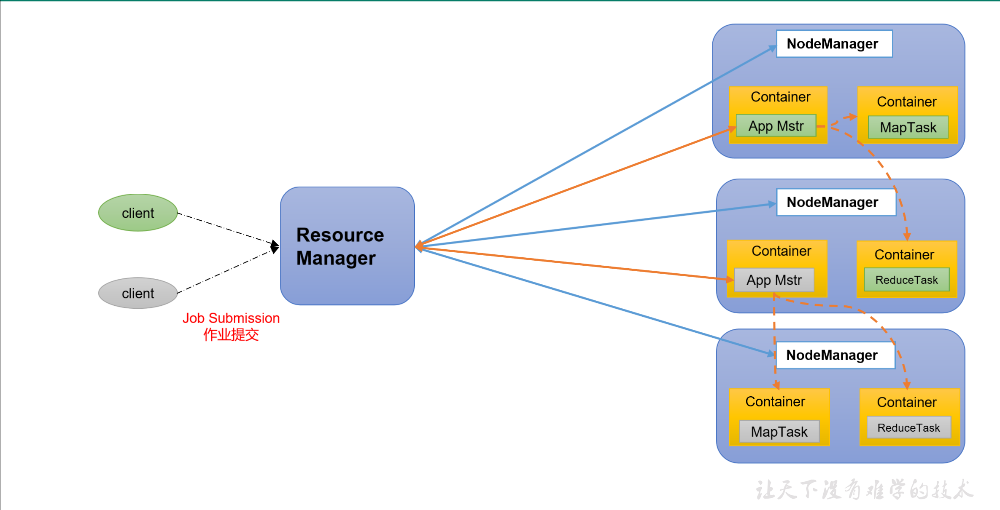
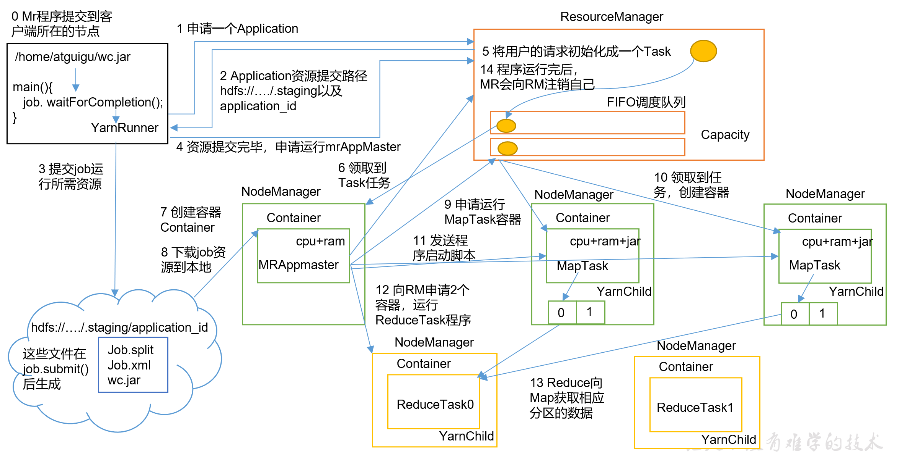
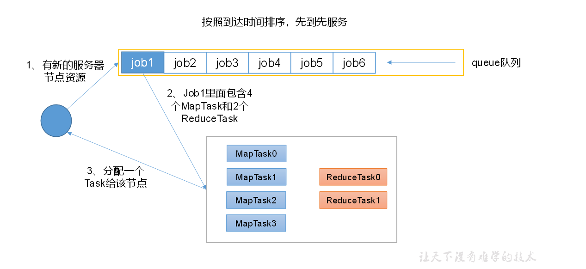
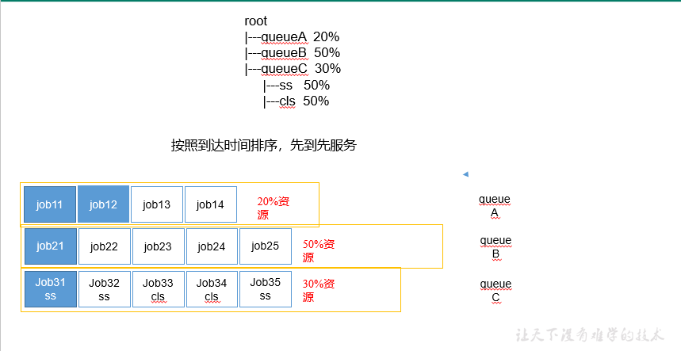
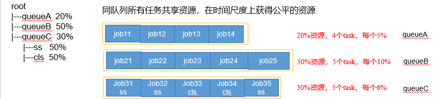
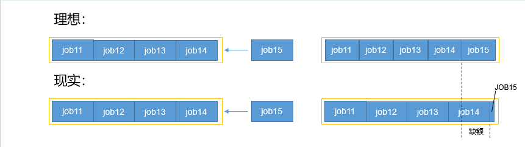
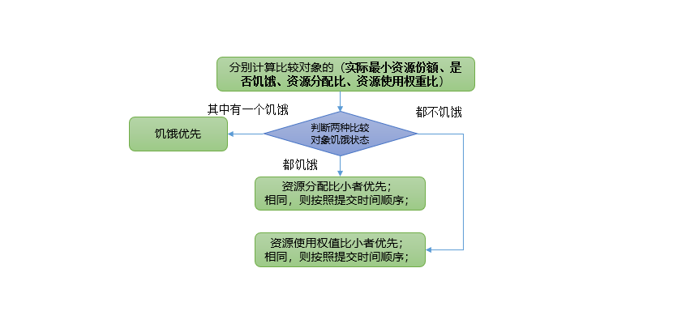

# Yarn

## 一、Yarn资源调度器

​       

### 定义

  Yarn是一个**资源调度平台，负责为运算程序提供服务器运算资源**，相当于一个分布式的操作系统平台，而**MapReduce等运算程序则相当于运行于操作系统之上的应用程序。**

### 基础架构

YARN主要由==ResourceManager、NodeManager、ApplicationMaster和Container==等组件构成。

🚩**ResourceManager（RM）主要作用如下**									

+ 处理客户端请求
+ 监控NodeManager
+ 启动或监控ApplicationMaster
+ 资源的分配与调度

**NodeManager（NM）主要作用如下**

+ 管理单个节点上的资源

+ 处理来自ResourceManager的命令

+ 处理来自ApplicationMaster的命令

**ApplicationMaster（AM）作用如下**

+ 为应用程序申请资源并分配给内部的任务

+ 任务的监控与容错

**Container**

+ Container是YARN中的资源抽象，**它封装了某个节点上的多维度资源，如内存、CPU、磁盘、网络等。**

### 🚩Yarn工作机制

------

​	（1）MR程序**提交**到客户端所在的节点。

​    （2）YarnRunner向ResourceManager**申请一个Application**。

​    （3）RM将该应用程序的资源**路径返回**给YarnRunner。

​    （4）该程序将运行所需资源**提交到HDFS上。**

​    （5）程序资源提交完毕后，**申请运行mrAppMaster**。

​    （6）RM将用户的请求**初始化成一个Task**。

​    （7）其中一个NodeManager**领取**到Task任务。

​    （8）该NodeManager**创建容器**Container，并产生MRAppmaster。

​    （9）Container从HDFS上**拷贝资源**到本地。

​    （10）MRAppmaster向RM **申请运行MapTask资源**。

​    （11）RM将运行MapTask**任务分配**给另外两个NodeManager，另两个NodeManager分别**领取任务并创建容器**。

​    （12）**MR**向两个接收到任务的NodeManager**发送程序启动脚本**，这两个NodeManager分别启动MapTask，MapTask对数据分区排序。

​	（13）MrAppMaster等待所有**MapTask运行完毕后**，向RM**申请容器，运行ReduceTask。**

​    （14）ReduceTask向MapTask**获取**相应分区的**数据**。

​    （15）程序运行完毕后，MR会向RM**申请注销自己。**

### 作业提交全过程

------

### 🚩Yarn调度器和调度算法

------

​				目前，Hadoop作业调度器主要有三种：==FIFO、容量（Capacity Scheduler）和公平（Fair Scheduler）==。**Apache Hadoop3.1.3默认的资源调度器是Capacity Scheduler（容量）。**

​									**CDH框架默认调度器是Fair Scheduler（公平）。**

**调度算法配置文件**：🧐 `yarn-default.xml文件`

~~~java
<property>
    <description>The class to use as the resource scheduler.</description>
            <name>yarn.resourcemanager.scheduler.class</name>					👇
<value>org.apache.hadoop.yarn.server.resourcemanager.scheduler.capacity.CapacityScheduler</value>
</property>

~~~

#### 先进先出调度器（FIFO）

🐇	简单易懂

🐢	不支持多队列，生产环境很少使用；

#### 容量调度器（Capacity Scheduler）

------

> Capacity Scheduler是**Yahoo**开发的多用户调度器。
>

​	1、多队列：每个队列可配置一定的资源量，每个队列采用FIFO调度策略。

​	2、容量保证：管理员可为每个队列**设置资源最低保证和资源使用上限**

​	3、灵活性：如果一个队列中的资源有剩余，可以暂时共享给那些需要资源的队列，而一旦该队列有新的应用程序提				交，则其他队列借调的资源会归还给该队列。

​	4、多租户：

   + 支持多用户共享集群和多应用程序同时运行。
   + 为了防止同一个用户的作业独占队列中的资源，该调度器会对**同一用户提交的作业所占资源量进行限定**。

   

> 容量调度器资源分配算法
>

**1**）**队列资源分配**

从root开始，使用深度优先算法，==优先选择资源占用率最低的队列分配资源。==

**2**）**作业资源分配**

默认按照提交作业的==优先级和提交时间顺序分配资源。==

**3**）**容器资源分配**

+ 按照容器的==优先级==分配资源；

+ 如果优先级相同，按照==数据本地性原则：==

  + 任务和数据在同一节点

  + 任务和数据在同一机架

  + 任务和数据不在同一节点也不在同一机架

    

#### 公平调度器（Fair Scheduler）

------

Fair Schedulere是==Facebook==开发的多用户调度器。

**特点👊**

**1**）**与容量调度器相同点**

  + 多队列：支持多队列多作业
  + 容量保证：管理员可为每个队列设置**资源最低保证和资源使用上线**
  + 灵活性：如果一个队列中的资源有剩余，可以暂时共享给那些需要资源的队列，而一旦该队列有新的应用程序提交，则其他队列**借调**的资源会归还给该队列。
  + 多租户：
    + 支持多用户共享集群和多应用程序同时运行；
    + 为了防止同一个用户的作业独占队列中的资源，该调度器会对同一用户提交的作业所占资源量进行限定。

**2**）**与容量调度器不同点**

| （1）核心调度策略不同                        | （2）每个队列可以单独设置资源分配方式 |
| -------------------------------------------- | ------------------------------------- |
| 容量调度器：优先选择==资源利用率低==的队列   | 容量调度器：FIFO、 DRF                |
| 公平调度器：优先选择对资源的==缺额==比例大的 | 公平调度器：FIFO、==FAIR、DRF==       |

> 缺额
>

+ 公平调度器设计目标是：在时间尺度上，所有作业获得公平的资源。**某一时刻一个作业应获资源和实际获取资源的差距叫“缺额”**

+ 调度器会优先为==缺额大的作业分配资源==

> ***\*公平调度器队列资源分配方式\****

##### 三大策略

###### **1**）**FIFO策略**

------

 公平调度器每个队列资源分配策略**如果选择FIFO**的话，此时公平调度器**相当于**上面讲过的**容量调度器。**

###### **2**）**Fair策略**

------

Fair 策略（默认）是一种基于**最大最小公平算法**实现的资源多路复用方式，默认情况下，每个队列内部采用该方式分配资源。这意味着，如果一个队列中有两个应用程序同时运行，则每个应用程序可得到1/2的资源；如果三个应用程序同时运行，则每个应用程序可得到1/3的资源。

**具体资源分配流程和容量调度器一致；**

**（1）选择队列**

**（2）选择作业**

**（3）选择容器**

**以上三步，每一步都是按照公平策略分配资源**

​																			==4==                     ==2==

Ø**实际最小资源份额**：mindshare = Min（资源需求量，配置的最小资源）

​											==1==						==2==

Ø**是否饥饿**：isNeedy = 资源使用量 < mindshare（实际最小资源份额）

​															==1==					==2==

Ø**资源分配比**：minShareRatio = 资源使用量 / Max（mindshare, 1）

​																			

Ø**资源使用权重比**：useToWeightRatio = 资源使用量 / 权重[^可自己配置]

###### **3）DRF策略**

-------

 DRF（Dominant Resource Fairness），我们**之前说的资源，都是单一标准**，例如只考虑内存（也是Yarn默认的情况）。但是很多时候我们资源有很多种，例如内存，CPU，网络带宽等，这样我们很难衡量两个应用应该分配的资源比例。

那么在YARN中，我们用DRF来决定如何调度：

假设集群一共有100 CPU和10T 内存，而应用A需要（2 CPU, 300GB），应用B需要（6 CPU，100GB）。则两个应用分别需要A（2%CPU, 3%内存）和B（6%CPU, 1%内存）的资源，这就意味着A是内存主导的, B是CPU主导的，针对这种情况，我们可以选择DRF策略**对不同应用进行不同资源（CPU和内存）的一个不同比例的限制。** 

##### 队列资源分配

------

`基于Fair`

需求：集群总资源100，有三个队列，对资源的需求分别是：

​					queueA -> 20， queueB ->50， queueC -> 30

| 第一次算：100 / 3 = 33.33 | 第二次算： （13.33 + 3.33）/ 1 = 16.66 |
| ------------------------- | -------------------------------------- |
| queueA：分33.33 à 多13.33 | queueA：分20                           |
| queueB：分33.33 à 少16.67 | queueB：分33.33 + 16.66 = 50           |
| queueC：分33.33 à 多3.33  | queueC：分30                           |

##### **作业资源分配**

> 不加权

🍀（关注点是Job的个数）

需求：有一条队列总资源12个, 有4个job，对资源的需求分别是:

👲		`job1➡1`, 			`job2➡2 ,` 			`job3➡6,` 			`job4➡5`

| 第一次算: 12 / 4 = 3 | 第二次算: 3 / 2 = 1.5                       | 第n次算: 一直算到没有空闲资源 |
| :------------------: | ------------------------------------------- | ----------------------------- |
| job1: 分3 --> 多2个  | job1: 分1                                   | job1                          |
| job2: 分3 --> 多1个  | job2: 分2                                   | job2                          |
| job3: 分3 --> 差3个  | job3: 分3 --> 差3个 --> 分1.5 --> 最终: 4.5 | job3                          |
| job4: 分3 --> 差2个  | job4: 分3 --> 差2个 --> 分1.5 --> 最终: 4.5 | job4                          |

> 加权
>

🍀（关注点是Job的权重）

需求：有一条队列总资源16，有4个job

对资源的需求分别是

​			job1➡4			  job2➡2		 job3➡0			 job4➡4 

每个job的权重为

​			job1➡5 		 job2➡8 			job3➡1  			job4➡2

| 第一次算: 16 / (5+8+1+2) = 1 | 第二次算: 7 / (1+2) = 7/3             | 第三次算:2.66/1=2.66              |
| ---------------------------- | ------------------------------------- | --------------------------------- |
| job1: 分5 --> 多1            | job1: 分4                             | job1: 分4                         |
| job2: 分8 --> 多6            | job2: 分2                             | job2: 分2                         |
| job3: 分1 --> 少9            | job3: 分1 --> 分7/3（2.33） -->少6.67 | job3: 分1 --> 分2.66/1 --> 分2.66 |
| job4: 分2 --> 少2            | job4: 分2 --> 分14/3(4.66) -->多2.66  | job4: 分4                         |

### Yarn常用命令

------

**Yarn application查看任务**

   + 列出所有Application：
     + `yarn application -list`

   + 根据Application状态过滤
     + `yarn application -list -appStates ` 
     + （所有状态：ALL、NEW、NEW_SAVING、SUBMITTED、ACCEPTED、RUNNING、FINISHED、FAILED、KILLED）
     + 例子：`yarn application -list -appStates FINISHED`

   + Kill掉Application
     +  `yarn application -kill application_1612577921195_0001`

==与web端相对应==

 **Yarn logs查看日志**

   + 查询Application日志
     + `yarn logs -applicationId <ApplicationId>`[^ApplicationId]:通过查询状态可得

   + 查询Container日志

     + `yarn logs -applicationId <ApplicationId> -containerId <ContainerId> `[^ContainerId]:通过**applicationattemp**t可得

     

**Yarn applicationattempt查看尝试运行的任务**

+ 列出所有Application尝试的列表
  + `yarn applicationattempt -list <ApplicationId>`

+ 打印ApplicationAttemp状态

  + `yarn applicationattempt -status <ApplicationAttemptId>`

  + [^status]:所有状态：ALL、NEW、NEW_SAVING、SUBMITTED、ACCEPTED、RUNNING、FINISHED、FAILED、KILLED）

**Yarn container查看容器**

[^PS]:容器必须在运行时才能查询到

+ 列出所有Container
  + `yarn container -list <ApplicationAttemptId>`

+ 打印Container状态

  + `    yarn container -status <ContainerId>`

  + [^status]:所有状态：ALL、NEW、NEW_SAVING、SUBMITTED、ACCEPTED、RUNNING、FINISHED、FAILED、KILLED）

**Yarn node查看节点状态**

+ 列出所有节点
  + `yarn node -list -all`

**Yarn rmadmin更新配置**

+ 加载队列配置
  + `yarn rmadmin -refreshQueues`

**Yarn queue查看队列**

+ 打印队列信息
  + `yarn queue -status <QueueName>`

==web：8088也可以查看==（更详细）

Scheduler👉Application Queues👉Queue ：default

### Yarn生产环境核心参数

------

> ​	Apache：默认容量调度器（小公司）  CDH：默认公平调度器（大公司，解决高并发）

**1）ResourceManager相关**

|             yarn.resourcemanager.scheduler.class             | ==配置调度器，默认容量调度器==                               |
| :----------------------------------------------------------: | ------------------------------------------------------------ |
| yarn.resourcemanager.scheduler.client.thread-count   ResourceManager | 处理调度器请求的线程数量，**默认**50：==RM一次处理的任务数量== |

**2)NodeManager相关**

🚩

| yarn.nodemanager.resource.detect-hardware-capabilities      |          是否让yarn自己检测硬件进行配置，默认false           |
| ----------------------------------------------------------- | :----------------------------------------------------------: |
| yarn.nodemanager.resource.count-logical-processors-as-cores |             是否将虚拟核数当作CPU核数，默认false             |
| yarn.nodemanager.resource.pcores-vcores-multiplier          | 虚拟核数和物理核数乘数，例如：4核8线程，该参数就应设为2，默认1.0 |
| yarn.nodemanager.resource.cpu-vcores     NodeManager        |                   ==使用CPU核数，默认8个==                   |
| yarn.nodemanager.pmem-check-enabled                         |       是否==开启物理内存检查限制==container，默认打开        |
| yarn.nodemanager.vmem-check-enabled                         |         是否开启虚拟内存检查限制container，默认打开          |
| yarn.nodemanager.vmem-pmem-ratio                            |            ==虚拟内存物理内存比例，**默认**2.1==             |

**虚拟核作用： 将主机一个当X个来用**

**集群配置相同则不开虚拟核**

**虚拟核数和物理核数乘数： 该参数用来设置一个NodeManager当几个来用**

==该配置是对单节点的配置==

**3）Container相关**

| yarn.scheduler.minimum-allocation-mb     | 容器最最小内存，==默认1G==   |
| ---------------------------------------- | ---------------------------- |
| yarn.scheduler.maximum-allocation-mb     | 容器最最大内存，==默认8G==   |
| yarn.scheduler.minimum-allocation-vcores | 容器最小CPU核数，==默认1个== |
| yarn.scheduler.maximum-allocation-vcores | 容器最大CPU核数，==默认4个== |

## 二、Yarn案例实操

==VM提前保存快照，便于后续恢复==

### Yarn生产环境核心参数配置案例

#### 配置前

**1）需求：从1G数据中，统计每个单词出现次数。服务器3台，每台配置4G内存，4核CPU，4线程。**

**2）需求分析：**

> 1G ➗128m =8个MapTask；1个ReduceTask；1个mrAppMaster   8+1+1=10  **10个容器**
>
> ​				平均每个节点运行10个 / 3台 ≈ 3个任务（4   3   3）多一点无所谓

**3）修改yarn-site.xml配置参数如下：**

~~~xml
		🥕<!-- 选择调度器，默认容量 -->
<property>
	<description>The class to use as the resource scheduler.</description>
	<name>yarn.resourcemanager.scheduler.class</name>
	<value>org.apache.hadoop.yarn.server.resourcemanager.scheduler.capacity.CapacityScheduler</value>
</property>

🥕<!-- ResourceManager处理调度器请求的线程数量,默认50；如果提交的任务数大于50，可以增加该值，但是不能超过3台 * 4线程 = 12线程（去除其他应用程序实际不能超过8） -->
<property>
	<description>Number of threads to handle scheduler interface.</description>
	<name>yarn.resourcemanager.scheduler.client.thread-count</name>
	<value>8</value>
</property>

🥕<!-- 是否让yarn自动检测硬件进行配置，默认是false，如果该节点有很多其他应用程序，建议手动配置。如果该节点没有其他应用程序，可以采用自动 -->
<property>
	<description>Enable auto-detection of node capabilities such as
	memory and CPU.
	</description>
	<name>yarn.nodemanager.resource.detect-hardware-capabilities</name>
	<value>false</value>
</property>

🥕<!-- 是否将虚拟核数当作CPU核数，默认是false，采用物理CPU核数 -->
<property>
	<description>Flag to determine if logical processors(such as
	hyperthreads) should be counted as cores. Only applicable on Linux
	when yarn.nodemanager.resource.cpu-vcores is set to -1 and
	yarn.nodemanager.resource.detect-hardware-capabilities is true.
	</description>
	<name>yarn.nodemanager.resource.count-logical-processors-as-cores</name>
	<value>false</value>
</property>

🥕<!-- 虚拟核数和物理核数乘数，默认是1.0 -->
<property>
	<description>Multiplier to determine how to convert phyiscal cores to
	vcores. This value is used if yarn.nodemanager.resource.cpu-vcores
	is set to -1(which implies auto-calculate vcores) and
	yarn.nodemanager.resource.detect-hardware-capabilities is set to true. The	number of vcores will be calculated as	number of CPUs * multiplier.
	</description>
	<name>yarn.nodemanager.resource.pcores-vcores-multiplier</name>
	<value>1.0</value>
</property>

🥕<!-- NodeManager使用内存数，默认8G，修改为4G内存 -->
<property>
	<description>Amount of physical memory, in MB, that can be allocated 
	for containers. If set to -1 and
	yarn.nodemanager.resource.detect-hardware-capabilities is true, it is
	automatically calculated(in case of Windows and Linux).
	In other cases, the default is 8192MB.
	</description>
	<name>yarn.nodemanager.resource.memory-mb</name>
	<value>4096</value>
</property>

🥕<!-- nodemanager的CPU核数，不按照硬件环境自动设定时默认是8个，修改为4个 -->
<property>
	<description>Number of vcores that can be allocated
	for containers. This is used by the RM scheduler when allocating
	resources for containers. This is not used to limit the number of
	CPUs used by YARN containers. If it is set to -1 and
	yarn.nodemanager.resource.detect-hardware-capabilities is true, it is
	automatically determined from the hardware in case of Windows and Linux.
	In other cases, number of vcores is 8 by default.</description>
	<name>yarn.nodemanager.resource.cpu-vcores</name>
	<value>4</value>
</property>

🥕<!-- 容器最小内存，默认1G -->
<property>
	<description>The minimum allocation for every container request at the RM	in MBs. Memory requests lower than this will be set to the value of this	property. Additionally, a node manager that is configured to have less memory	than this value will be shut down by the resource manager.
	</description>
	<name>yarn.scheduler.minimum-allocation-mb</name>
	<value>1024</value>
</property>

🥕<!-- 容器最大内存，默认8G，修改为2G -->
<property>
	<description>The maximum allocation for every container request at the RM	in MBs. Memory requests higher than this will throw an	InvalidResourceRequestException.
	</description>
	<name>yarn.scheduler.maximum-allocation-mb</name>
	<value>2048</value>
</property>

🥕<!-- 容器最小CPU核数，默认1个 -->
<property>
	<description>The minimum allocation for every container request at the RM	in terms of virtual CPU cores. Requests lower than this will be set to the	value of this property. Additionally, a node manager that is configured to	have fewer virtual cores than this value will be shut down by the resource	manager.
	</description>
	<name>yarn.scheduler.minimum-allocation-vcores</name>
	<value>1</value>
</property>

🥕<!-- 容器最大CPU核数，默认4个，修改为2个 -->
<property>
	<description>The maximum allocation for every container request at the RM	in terms of virtual CPU cores. Requests higher than this will throw an
	InvalidResourceRequestException.</description>
	<name>yarn.scheduler.maximum-allocation-vcores</name>
	<value>2</value>
</property>

🥕<!-- 虚拟内存检查，默认打开，修改为关闭 -->
<property>
	<description>Whether virtual memory limits will be enforced for
	containers.</description>
	<name>yarn.nodemanager.vmem-check-enabled</name>
	<value>false</value>
</property>

🥕<!-- 虚拟内存和物理内存设置比例,默认2.1 -->
<property>
	<description>Ratio between virtual memory to physical memory when	setting memory limits for containers. Container allocations are	expressed in terms of physical memory, and virtual memory usage	is allowed to exceed this allocation by this ratio.
	</description>
	<name>yarn.nodemanager.vmem-pmem-ratio</name>
	<value>2.1</value>
</property>

~~~

#### 配置后

**4）分发配置**

==注意：如果集群的硬件资源不一致，要每个NodeManager单独配置==

**5）重启集群**

`sbin/stop-yarn.sh`

`sbin/stop-yarn.sh`

**6）执行WordCount程序**

~~~sh
[atguigu@hadoop102 hadoop-3.1.3]$ hadoop jar share/hadoop/mapreduce/hadoop-mapreduce-examples-3.1.3.jar wordcount /input /output
~~~

**7）观察Yarn任务执行页面**

http://hadoop103:8088/cluster/apps

### 🚩容量调度器多队列提交案例

------

#### 🍀

**1）在生产环境怎么创建队列？**

​		==（1）调度器默认就1个default队列，不能满足生产要求。==

   	 （2）**按照框架**：hive /spark/ flink 每个框架的任务放入指定的队列（企业用的不是特别多）

​		（3）**按照业务模块**：登录注册、购物车、下单、业务部门1、业务部门2

**2）创建多队列的好处？**

​		（1）因为担心员工不小心，写递归死循环代码，把所有资源全部耗尽。

​		（2）实现任务的**降级**使用，特殊时期保证重要的任务队列资源充足。11.11       6.18

业务部门1（重要）=》业务部门2（比较重要）=》下单（一般）=》购物车（一般）=》登录注册（次要）

#### 需求

    + default队列占总内存的40%，最大资源容量占总资源60%，hive队列占总内存的60%，最大资源容量占总资源80%。

+ 配置队列优先级

#### 配置多队列的容量调度器

+ 在capacity-scheduler.xml中配置如下：

  + 修改如下配置

    ~~~xml
    🍂<!-- 指定多队列，增加hive队列 -->
    <property>
        <name>yarn.scheduler.capacity.root.queues</name>
        <value>default,hive</value>
        <description>
          The queues at the this level (root is the root queue).
        </description>
    </property>
    
    🍂<!-- 降低default队列资源额定容量为40%，默认100% -->
    <property>
        <name>yarn.scheduler.capacity.root.default.capacity</name>
        <value>40</value>
    </property>
    
    🍂<!-- 降低default队列资源最大容量为60%，默认100% -->
    <property>
        <name>yarn.scheduler.capacity.root.default.maximum-capacity</name>
        <value>60</value>
    </property>
    
    ~~~

    

  + 为新加队列添加必要属性：

    ~~~xml
    👉<!-- 指定hive队列的资源额定容量 -->
    <property>
        <name>yarn.scheduler.capacity.root.hive.capacity</name>
        <value>60</value>
    </property>
    
    👉<!-- 用户最多可以使用队列多少资源，1表示 -->
    <property>
        <name>yarn.scheduler.capacity.root.hive.user-limit-factor</name>
        <value>1</value>
    </property>
    
    👉<!-- 指定hive队列的资源最大容量 -->
    <property>
        <name>yarn.scheduler.capacity.root.hive.maximum-capacity</name>
        <value>80</value>
    </property>
    
    👉<!-- 启动hive队列 -->
    <property>
        <name>yarn.scheduler.capacity.root.hive.state</name>
        <value>RUNNING</value>
    </property>
    
    👉<!-- 哪些用户有权向队列提交作业 -->
    <property>
        <name>yarn.scheduler.capacity.root.hive.acl_submit_applications</name>
        <value>*</value>
    </property>
    
    👉<!-- 哪些用户有权操作队列，管理员权限（查看/杀死） -->
    <property>
        <name>yarn.scheduler.capacity.root.hive.acl_administer_queue</name>
        <value>*</value>
    </property>
    
    👉<!-- 哪些用户有权配置提交任务优先级 -->
    <property>
        <name>yarn.scheduler.capacity.root.hive.acl_application_max_priority</name>
        <value>*</value>
    </property>
    
    👉<!-- 任务的超时时间设置：yarn application -appId appId -updateLifetime Timeout
    参考资料：https://blog.cloudera.com/enforcing-application-lifetime-slas-yarn/ -->
    
    👉<!-- 如果application指定了超时时间，则提交到该队列的application能够指定的最大超时时间不能超过该值。 
    -->
    <property>
        <name>yarn.scheduler.capacity.root.hive.maximum-application-lifetime</name>
        <value>-1</value>
    </property>
    
    👉<!-- 如果application没指定超时时间，则用default-application-lifetime作为默认值 -->
    <property>
        <name>yarn.scheduler.capacity.root.hive.default-application-lifetime</name>
        <value>-1</value>
    </property>
    
    ~~~

+ 分发配置文件

+ 重启Yarn或者执行yarn rmadmin -refreshQueues刷新队列，就可以看到两条队列：

  `yarn rmadmin -refreshQueues`

#### 向Hive队列提交任务

**1）**hadoop jar的方式

~~~xml
$hadoop jar share/hadoop/mapreduce/hadoop-mapreduce-examples-3.1.3.jar wordcount -D mapreduce.job.queuename=hive /input /output
~~~

==-D表示运行时改变参数值==

**2）**打jar包的方式

**默认的任务提交都是提交到default队列的**。如果希望向其他队列提交任务，需要在Driver中声明：

~~~java
public class WcDrvier {

    public static void main(String[] args) throws IOException, ClassNotFoundException, InterruptedException {

        Configuration conf = new Configuration();
		📌
        conf.set("mapreduce.job.queuename","hive");

        //1. 获取一个Job实例
        Job job = Job.getInstance(conf);

        。。。 。。。

        //6. 提交Job
        boolean b = job.waitForCompletion(true);
        System.exit(b ? 0 : 1);
    }
}
~~~

#### 任务优先级

> 容量调度器，支持任务优先级的配置，在资源紧张时，优先级高的任务将优先获取资源。**默认情况，Yarn将所有任务的优先级限制为0，**若想使用任务的优先级功能，须开放该限制。
>

🌴	修改yarn-site.xml文件，增加以下参数

~~~xml
<property>
    <name>yarn.cluster.max-application-priority</name>
    <value>5</value>
</property>
~~~

🌴	分发配置，并重启Yarn	

`xsync yarn-site.xml`

`sbin/stop-yarn.sh`

`sbin/start-yarn.sh`

🌴	提交优先级高的任务

~~~sh
[atguigu@hadoop102 hadoop-3.1.3]$ hadoop jar /opt/module/hadoop-3.1.3/share/hadoop/mapreduce/hadoop-mapreduce-examples-3.1.3.jar pi  -D mapreduce.job.priority=5 5 2000000
~~~

🌴  也可以通过以下命令**修改正在执行的任务的优先级。**

`yarn application -appID <ApplicationID> -updatePriority 优先级`

例：

~~~shell
[atguigu@hadoop102 hadoop-3.1.3]$ yarn application -appID application_1611133087930_0009 -updatePriority 5
~~~

### 公平调度器案例

##### 需求

创建两个队列，分别是test和atguigu（以用户所属组命名）。期望实现以下效果：==若用户提交任务时指定队列，则任务提交到指定队列运行；若未指定队列，==test用户提交的任务到==root.group.test==队列运行，atguigu提交的任务到==root.group.atguigu==队列运行（注：group为用户所属组）。

公平调度器的配置涉及到两个文件，一个是==**yarn-site.xml**==，另一个是公平调度器队列分配文件==fair-scheduler.xml==（文件名可自定义）。

（1）配置文件参考资料：

https://hadoop.apache.org/docs/r3.1.3/hadoop-yarn/hadoop-yarn-site/FairScheduler.html

（2）任务队列放置规则参考资料：

https://blog.cloudera.com/untangling-apache-hadoop-yarn-part-4-fair-scheduler-queue-basics/

#### 配置多队列的公平调度器

**1）**修改yarn-site.xml文件，**加入以下参数**

~~~xml
<property>
    <name>yarn.resourcemanager.scheduler.class</name>
   											👇 <value>org.apache.hadoop.yarn.server.resourcemanager.scheduler.fair.FairScheduler</value>
    <description>配置使用公平调度器</description>
</property>

<property>
    <name>yarn.scheduler.fair.allocation.file</name>	👇 
    <value>/opt/module/hadoop-3.1.3/etc/hadoop/fair-scheduler.xml</value>
    <description>指明公平调度器队列分配配置文件</description>
</property>

<property>
    <name>yarn.scheduler.fair.preemption</name>
  👉<value>false</value>
    <description>禁止队列间资源抢占</description>
</property>

~~~

**2）**配置fair-scheduler.xml

~~~xml
<?xml version="1.0"?>
<allocations>
  <!-- 单个队列中Application Master占用资源的最大比例,取值0-1 ，企业一般配置0.1 -->
  <queueMaxAMShareDefault>0.5</queueMaxAMShareDefault>
  <!-- 单个队列最大资源的默认值 test atguigu default -->
  <queueMaxResourcesDefault>4096mb,4vcores</queueMaxResourcesDefault>

  <!-- 增加一个队列test -->
  <queue name="test">
    <!-- 队列最小资源 -->
    <minResources>2048mb,2vcores</minResources>
    <!-- 队列最大资源 -->
    <maxResources>4096mb,4vcores</maxResources>
    <!-- 队列中最多同时运行的应用数，默认50，根据线程数配置 -->
    <maxRunningApps>4</maxRunningApps>
    <!-- 队列中Application Master占用资源的最大比例 -->
    <maxAMShare>0.5</maxAMShare>
    <!-- 该队列资源权重,默认值为1.0 -->
    <weight>1.0</weight>
    <!-- 队列内部的资源分配策略 -->
    <schedulingPolicy>fair</schedulingPolicy>
  </queue>
  <!-- 增加一个队列atguigu -->
  <queue name="atguigu" type="parent">
    <!-- 队列最小资源 -->
    <minResources>2048mb,2vcores</minResources>
    <!-- 队列最大资源 -->
    <maxResources>4096mb,4vcores</maxResources>
    <!-- 队列中最多同时运行的应用数，默认50，根据线程数配置 -->
    <maxRunningApps>4</maxRunningApps>
    <!-- 队列中Application Master占用资源的最大比例 -->
    <maxAMShare>0.5</maxAMShare>
    <!-- 该队列资源权重,默认值为1.0 -->
    <weight>1.0</weight>
    <!-- 队列内部的资源分配策略 -->
    <schedulingPolicy>fair</schedulingPolicy>
  </queue>

  <!-- 任务队列分配策略,可配置多层规则,从第一个规则开始匹配,直到匹配成功 -->
  <queuePlacementPolicy>
    <!-- 提交任务时指定队列,如未指定提交队列,则继续匹配下一个规则; false表示：如果指定队列不存在,不允许自动创建-->
    <rule name="specified" create="false"/>
    <!-- 提交到root.group.username队列,若root.group不存在,不允许自动创建；若root.group.user不存在,允许自动创建 -->
    <rule name="nestedUserQueue" create="true">
        <rule name="primaryGroup" create="false"/>
    </rule>
    🚩<!-- 最后一个规则必须为reject或者default。Reject表示拒绝创建提交失败，default表示把任务提交到default队列 -->
    <rule name="reject" />
  </queuePlacementPolicy>
</allocations>

~~~

**3）**分发配置并重启Yarn

### Yarn的Tool接口案例

------

**背景**

~~~shell
[atguigu@hadoop102 hadoop-3.1.3]$ hadoop jar wc.jar com.atguigu.mapreduce.wordcount2.WordCountDriver -Dmapreduce.job.queuename=root.test /input /output1
#期望可以动态传参，结果报错，误认为是第一个输入参数。
~~~

==wordcount程序中指定args[0]为输入路径  ，args[1]输出路径，无法动态传参==

**解决方案**

自己写的程序为可以动态修改参数。编写Yarn的Tool接口。

**业务实现**

（1）新建Maven项目YarnDemo，pom如下：

~~~xml
<?xml version="1.0" encoding="UTF-8"?>
<project xmlns="http://maven.apache.org/POM/4.0.0"
         xmlns:xsi="http://www.w3.org/2001/XMLSchema-instance"
         xsi:schemaLocation="http://maven.apache.org/POM/4.0.0 http://maven.apache.org/xsd/maven-4.0.0.xsd">
    <modelVersion>4.0.0</modelVersion>

    <groupId>com.atguigu.hadoop</groupId>
    <artifactId>yarn_tool_test</artifactId>
    <version>1.0-SNAPSHOT</version>

    <dependencies>
        <dependency>
            <groupId>org.apache.hadoop</groupId>
            <artifactId>hadoop-client</artifactId>
            <version>3.1.3</version>
        </dependency>
    </dependencies>
</project>

~~~

（2）新建com.atguigu.yarn报名

（3）创建类WordCount并实现Tool接口：

~~~java
public class WordCount implements Tool {

    private Configuration conf;

   🚩@Override
    public int run(String[] args) throws Exception {

        Job job = Job.getInstance(conf);

        job.setJarByClass(WordCountDriver.class);

        job.setMapperClass(WordCountMapper.class);
        job.setReducerClass(WordCountReducer.class);

        job.setMapOutputKeyClass(Text.class);
        job.setMapOutputValueClass(IntWritable.class);
        job.setOutputKeyClass(Text.class);
        job.setOutputValueClass(IntWritable.class);

        FileInputFormat.setInputPaths(job, new Path(args[0]));
        FileOutputFormat.setOutputPath(job, new Path(args[1]));

        return job.waitForCompletion(true) ? 0 : 1;
    }

   🚩 @Override
    public void setConf(Configuration conf) {
        this.conf = conf;
    }

    🚩@Override
    public Configuration getConf() {
        return conf;
    }
		
    //下面为  mapreduce方法👇
    public static class WordCountMapper extends Mapper<LongWritable, Text, Text, IntWritable> {

        private Text outK = new Text();
        private IntWritable outV = new IntWritable(1);

        @Override
        protected void map(LongWritable key, Text value, Context context) throws IOException, InterruptedException {

            String line = value.toString();
            String[] words = line.split(" ");

            for (String word : words) {
                outK.set(word);

                context.write(outK, outV);
            }
        }
    }

    public static class WordCountReducer extends Reducer<Text, IntWritable, Text, IntWritable> {
        private IntWritable outV = new IntWritable();

        @Override
        protected void reduce(Text key, Iterable<IntWritable> values, Context context) throws IOException, InterruptedException {

            int sum = 0;

            for (IntWritable value : values) {
                sum += value.get();
            }
            outV.set(sum);

            context.write(key, outV);
        }
    }
}
~~~

（4）新建WordCountDriver

~~~java
public class WordCountDriver {

    private static Tool tool;

    public static void main(String[] args) throws Exception {
        // 1. 创建配置文件
        Configuration conf = new Configuration();

        // 2. 判断是否有tool接口
        switch (args[0]){
            case "wordcount":
                tool = new WordCount();
                break;
            default:
                throw new RuntimeException(" No such tool: "+ args[0] );
        }
        // 3. 用Tool执行程序
        // Arrays.copyOfRange 将老数组的元素放到新数组里面
        int run = ToolRunner.run(conf, tool, Arrays.copyOfRange(args, 1, args.length));

        System.exit(run);
    }
}

~~~

==注意：第一个args为接口的，       Tool对象的args才是对动态参数的过滤==

**3）**在HDFS上准备输入文件，假设为/input目录，向集群提交该Jar包

~~~shell
[atguigu@hadoop102 hadoop-3.1.3]$ yarn jar YarnDemo.jar com.atguigu.yarn.WordCountDriver wordcount /input /output
~~~

==注意==：此时提交的3个参数，**第一个用于生成特定的Tool，第二个和第三个为输入输出目录。**此时如果我们希望加入设置参数，可以在wordcount后面添加参数，

~~~sh
[atguigu@hadoop102 hadoop-3.1.3]$ yarn jar YarnDemo.jar com.atguigu.yarn.WordCountDriver wordcount -Dmapreduce.job.queuename=root.test /input /output1
~~~

## 三、总结

#### 1、Yarn的工作机制（面试题）

#### 	2、Yarn的调度器

  + **FIFO/容量/公平**

  + **apache 默认调度器  容量； CDH默认调度器 公平**

  + **公平/容量默认一个default ，需要创建多队列**

  + **中小企业：hive  spark flink  mr**  

  + **中大企业：业务模块：登录/注册/购物车/营销**

  + **好处：解耦  降低风险  11.11  6.18  降级使用**

  + **每个调度器特点：**

    + **相同点：支持多队列，可以借资源，支持多用户**

    + **不同点：容量调度器：优先满足先进来的任务执行**
      				**公平调度器，在队列里面的任务公平享有队列资源**

+ **生产环境怎么选：**
        		**中小企业，对并发度要求不高，选择容量**
                		**中大企业，对并发度要求比较高，选择公平。**

#### 3、开发需要重点掌握：

 + **队列运行原理**	
 + **Yarn常用命令**
 + **核心参数配置**
 + **配置容量调度器和公平调度器。**
 + **tool接口使用。**

