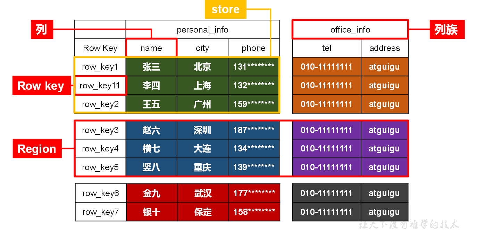
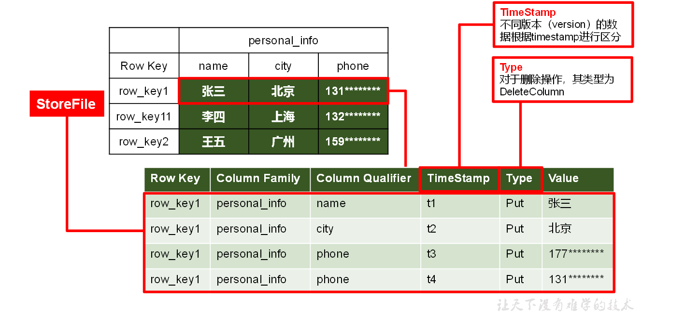
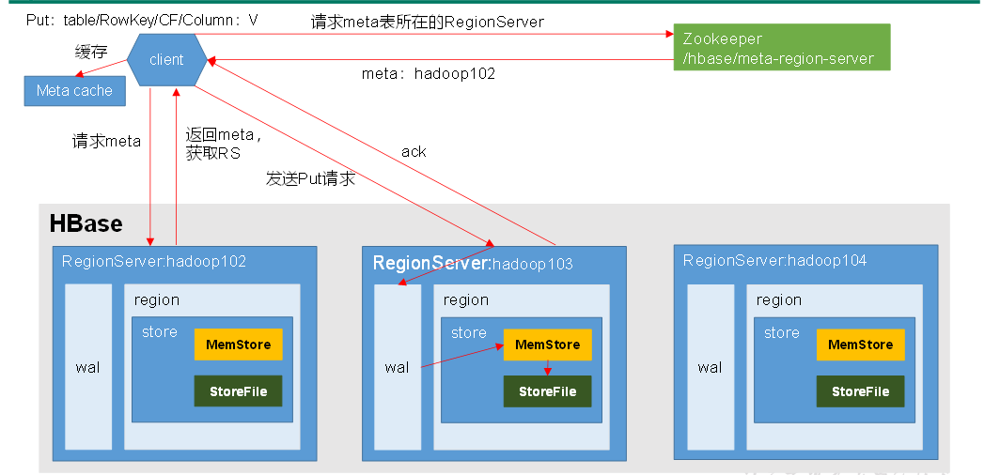
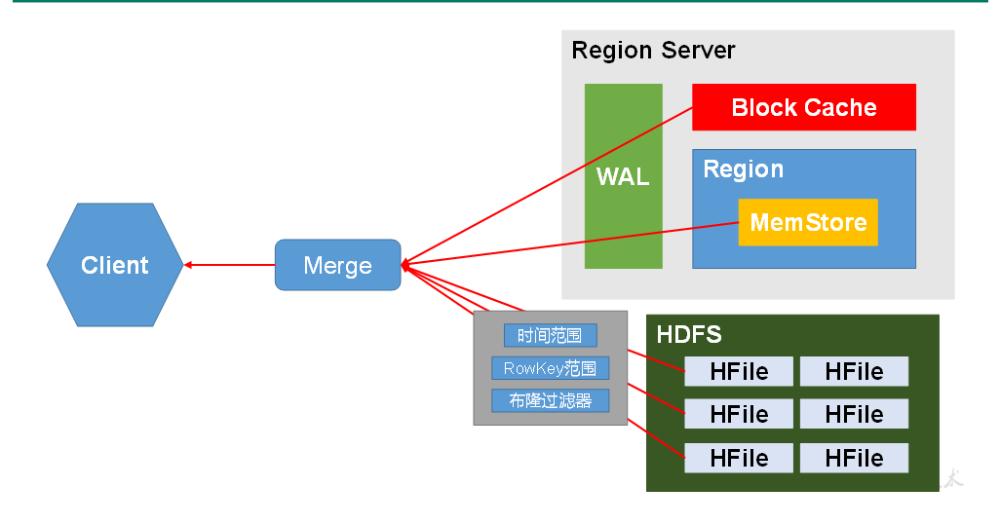
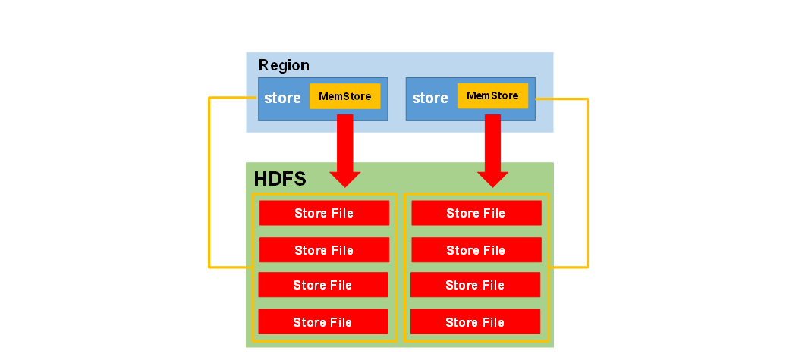
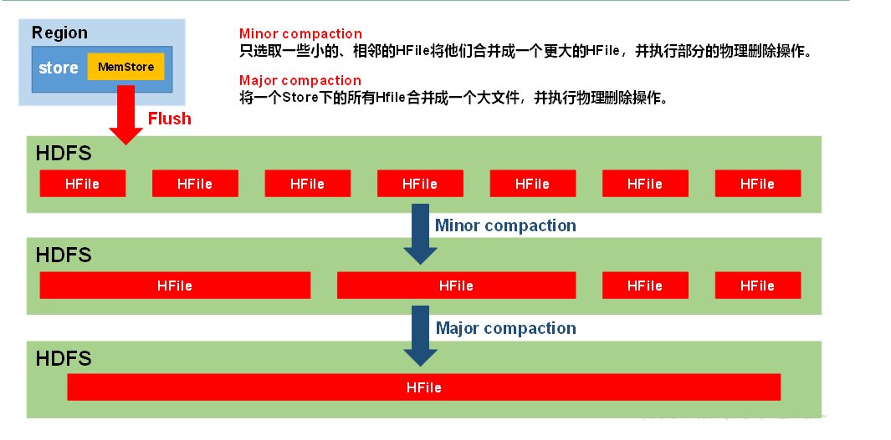
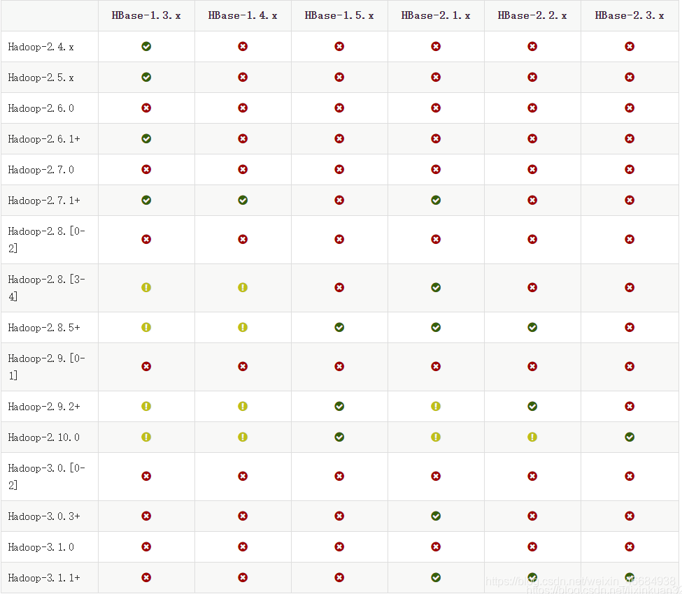
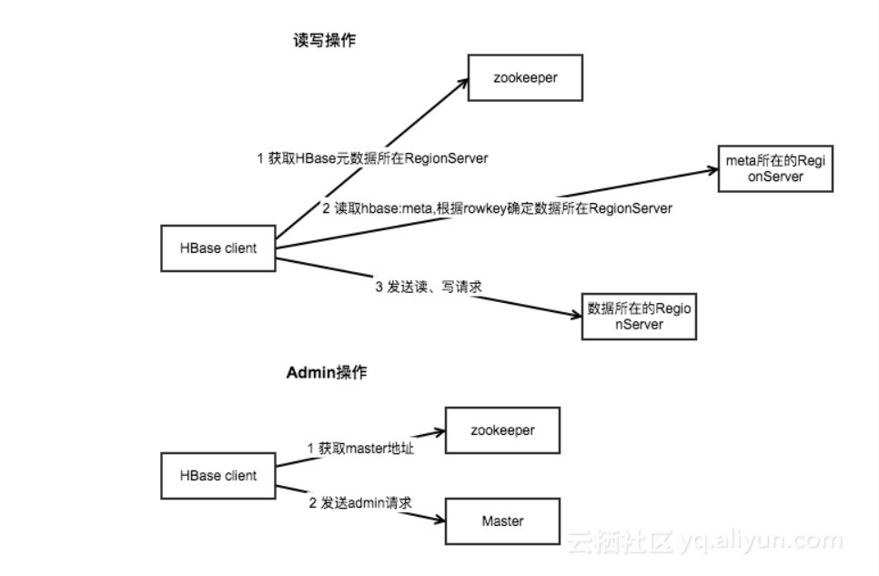
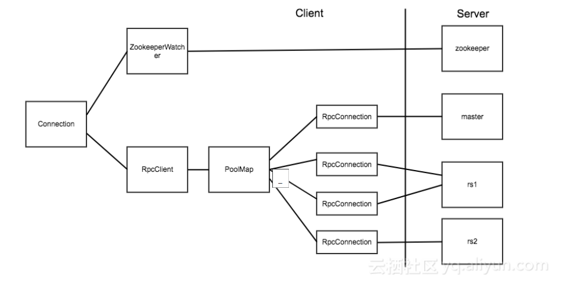
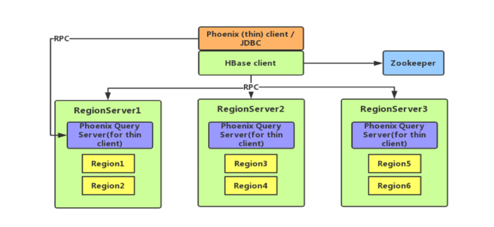

# 一、简介


>  定义

HBase是一种分布式、可扩展、支持海量数据存储的NoSQL[^Not Only Sql]数据库。


> 逻辑结构



##Regions

HBase Table 中的所有行按照 `Row Key` 的字典序排列。HBase Tables 通过行键的范围 (row key range) 被水平切分成多个 `Region`, 一个 `Region` 包含了在 start key 和 end key 之间的所有行。

每个表一开始只有一个 `Region`，随着数据不断增加，`Region` 会不断增大，当增大到一个阀值的时候，`Region` 就会等分为两个新的 `Region`。当 Table 中的行不断增多，就会有越来越多的 `Region`。

`Region` 是 HBase 中**分布式存储和负载均衡的最小单元**。这意味着不同的 `Region` 可以分布在不同的 `Region Server` 上。但一个 `Region` 是不会拆分到多个 Server 上的。

> 物理结构




## 名词解释

| 概念           |                             解释                             |
| -------------- | :----------------------------------------------------------: |
| **Name Space** | 命名空间，类似于关系型数据库的database概念，每个命名空间下有多个表。HBase有两个自带的命名空间，分别是hbase和default，hbase中存放的是HBase内置的表，default表是用户默认使用的命名空间。 |
| **Table**      | 类似于关系型数据库的表概念。不同的是，HBase定义表时只需要声明列族即可，不需要声明具体的列。这意味着，往HBase写入数据时，字段可以动态、按需指定。因此，和关系型数据库相比，HBase能够轻松应对字段变更的场景。 |
| **Row**        | HBase表中的每行数据都由一个**RowKey**和多个**Column**（列）组成，数据是按照RowKey的字典顺序存储的，并且查询数据时只能根据RowKey进行检索，所以RowKey的设计十分重要。 |
| **Column**     | HBase中的每个列都由Column Family(列族)和Column Qualifier（列限定符）进行限定，例如info：name，info：age。建表时，只需指明列族，而列限定符无需预先定义。 |
| **Time Stamp** | 用于标识数据的不同版本（version），每条数据写入时，系统会自动为其加上该字段，其值为写入HBase的时间。 |
| **Cell**       | 由{rowkey, column Family：column Qualifier, time Stamp} 唯一确定的单元。cell中的数据全部是字节码形式存贮。 |


# 二、系统架构

## 基础


### Zookeeper

1. 保证任何时候，集群中只有一个 Master[^有备份]；
2. 存贮所有 Region 的寻址入口；
3. 实时监控 Region Server 的状态，将 Region Server 的上线和下线信息实时通知给 Master；
4. 存储 HBase 的 Schema，包括有哪些 Table，每个 Table 有哪些 Column Family 等信息。

### Master

1. 为 Region Server 分配 Region ；
2. 负责 Region Server 的负载均衡 ；
3. 发现失效的 Region Server 并重新分配其上的 Region；
4. GFS 上的垃圾文件回收；
5. 处理 Schema 的更新请求。


### Region Server

1. Region Server 负责维护 Master 分配给它的 Region ，并处理发送到 Region 上的 IO 请求；
2. Region Server 负责切分在运行过程中变得过大的 Region。

`Region Server` 运行在 HDFS 的 DataNode 上。它具有以下组件：

- **WAL(Write Ahead Log，预写日志)**：用于存储尚未进持久化存储的数据记录，以便在发生故障时进行恢复。
- **BlockCache**：读缓存。它将频繁读取的数据存储在内存中，如果存储不足，它将按照 **最近最少使用原则** 清除多余的数据。
- **MemStore**：写缓存。它存储尚未写入磁盘的新数据，并会在数据写入磁盘之前对其进行排序。每个 Region 上的每个列族都有一个 MemStore。
- **HFile** ：将行数据按照 Key\Values 的形式存储在文件系统上

Region Server 存取一个子表时，会创建一个 Region 对象，然后对表的每个列族创建一个 `Store` 实例，每个 `Store` 会有 0 个或多个 `StoreFile` 与之对应，每个 `StoreFile` 则对应一个 `HFile`，HFile 就是实际存储在 HDFS 上的文件


### 组件间的协作

------

HBase 使用 ZooKeeper 作为分布式协调服务来维护集群中的服务器状态。 Zookeeper 负责维护可用服务列表，并提供服务故障通知等服务：


- 每个 Region Server 都会在 ZooKeeper 上创建一个临时节点，Master 通过 Zookeeper 的 Watcher 机制对节点进行监控，从而可以发现新加入的 Region Server 或故障退出的 Region Server；
- 所有 Masters 会竞争性地在 Zookeeper 上创建同一个临时节点，由于 Zookeeper 只能有一个同名节点，所以必然只有一个 Master 能够创建成功，此时该 Master 就是主 Master，主 Master 会定期向 Zookeeper 发送心跳。备用 Masters 则通过 Watcher 机制对主 HMaster 所在节点进行监听；
- 如果主 Master 未能定时发送心跳，则其持有的 Zookeeper 会话会过期，相应的临时节点也会被删除，这会触发定义在该节点上的 Watcher 事件，使得备用的 Master Servers 得到通知。所有备用的 Master Servers 在接到通知后，会再次去竞争性地创建临时节点，完成主 Master 的选举。

[](https://camo.githubusercontent.com/34e8be433817f41ae3965c5841f115b4cf0c4a6b840da1cc5d55066da094cdfe/68747470733a2f2f67697465652e636f6d2f68656962616979696e672f426967446174612d4e6f7465732f7261772f6d61737465722f70696374757265732f48426173654172636869746563747572652d426c6f672d466967352e706e67)


## 进阶


==注==：`META` 表是 HBase 中一张特殊的表，它保存了所有 Region 的位置信息，META 表自己的位置信息则存储在 ZooKeeper 上。

### 写流程




1）Client先访问zookeeper，获取hbase:meta表位于哪个Region Server。

2）访问对应的Region Server，获取hbase:meta表，根据读请求的namespace:table/rowkey，查询出目标数据位于哪个Region Server中的哪个Region中。并将该table的**region信息以及meta表的位置信息缓存**在客户端的meta cache，方便下次访问。

3）与目标Region Server进行通讯；

4）将数据顺序写入（追加）到WAL；

5）将数据写入对应的MemStore，数据会在MemStore进行排序；

6）向客户端发送ack；

7）等达到MemStore的刷写时机后，将数据刷写到HFile。


> 如果再次读写，客户端将从缓存中获取行键所在的 Region Server。这样客户端就不需要再次查询 META`表，除非 Region 移动导致缓存失效，这样的话，则将会重新查询并更新缓存。


### 读流程


==读数据过程会有一个Merge操作==



1）Client先访问zookeeper，获取hbase:meta表位于哪个Region Server。

2）访问对应的Region Server，获取hbase:meta表，根据读请求的namespace:table/rowkey，查询出目标数据位于哪个Region Server中的哪个Region中。并将该table的region信息以及meta表的位置信息缓存在客户端的meta cache，方便下次访问。

3）与目标Region Server进行通讯；

4）分别在MemStore和Store File（HFile）中查询目标数据，并将查到的所有数据进行合并。[^此处所有数据是指同一条数据的不同版本（time stamp）或者不同的类型（Put/Delete）。]

5）将查询到的新的数据块（Block，HFile数据存储单元，默认大小为64KB）缓存到Block Cache。

6）将合并后的最终结果返回给客户端。


### MemStore Flush

------




 **MemStore刷写时机**

------


- **memstore层面**

  - 当某个memstore的大小达到了

    `hbase.hregion.memstore.flush.size`（默认值128M），
    
    其所在region的所有memstore都会刷写。

  

  - 当memstore的大小达到了

    **hbase.hregion.memstore.flush.size**（默认值128M）**✖  hbase.hregion.memstore.block.multiplier**（默认值4）时，
    
    会阻止继续往该memstore写数据。

  

- **region server层面**

  - 当region server中memstore的总大小达到

    ```properties
    java_heapsize(hbase堆内存) ✖  hbase.regionserver.global.memstore.size（默认值0.4）✖ hbase.regionserver.global.memstore.size.lower.limit（默认值0.95），
    ```
    
    region会按照其所有memstore的大小顺序（由大到小）依次进行刷写。
    
    直到region server中所有memstore的总大小减小到上述值以下。
  
  
  
  
  
  - 当region server中memstore的总大小达到
  
    java_heapsize(hbase堆内存) ✖   hbase.regionserver.global.memstore.size（默认值0.4）时，
  
    会阻止继续往所有的memstore写数据。

  

- **时间层面**

  - 到达自动刷写的时间也会触发memstore flush。

    自动刷新的时间间隔由该属性进行配置

    `hbase.regionserver.optionalcacheflushinterval`（默认1小时）。

  

- ~~当WAL文件的数量超过~~

  ~~**hbase.regionserver.max.logs**，region会按照时间顺序依次进行刷写，直到WAL文件数量减小到**hbase.regionserver.max.logs**以下~~

  ==（该属性名已经废弃，现无需手动设置，最大值为32）。==


### StoreFile Compaction

------

由于memstore每次刷写都会生成一个新的HFile，且同一个字段的不同版本（timestamp）和不同类型（Put/Delete）有可能会分布在不同的HFile中，因此查询时需要遍历所有的HFile。为了减少HFile的个数，以及清理掉过期和删除的数据，会进行StoreFile Compaction。




Compaction分为两种，

分别是Minor Compaction和Major Compaction。

| Minor Compaction                                             | Major Compaction                                             |
| ------------------------------------------------------------ | ------------------------------------------------------------ |
| Minor Compaction会将临近的若干个较小的HFile合并成一个较大的HFile，并清理掉部分过期和删除的数据。 | Major Compaction会将一个Store下的所有的HFile合并成一个大HFile，并且会清理掉所有过期和删除的数据。 |


### Region Split

------

> 默认情况下，每个Table起初只有一个Region，随着数据的不断写入，Region会自动进行拆分。刚拆分时，两个子Region都位于当前的Region Server，但处于负载均衡的考虑，HMaster有可能会将某个Region转移给其他的Region Server。


**Region Split时机**

+ 当1个region中的某个Store下所有StoreFile的总大小超过

  `hbase.hregion.max.filesize`

  该Region就会进行拆分（0.94版本之前）。


+ 当1个region中的某个Store下所有StoreFile的总大小超过

  `Min(initialSize*R^3 ,hbase.hregion.max.filesize")`

  该Region就会进行拆分。

  其中initialSize的默认值为2*hbase.hregion.memstore.flush.size，

  R为当前Region Server中属于该Table的Region个数（0.94版本之后）。

  具体的切分策略为：

  第一次split：1^3 * 256 = 256MB 

  第二次split：2^3 * 256 = 2048MB 

  第三次split：3^3 * 256 = 6912MB 

  第四次split：4^3 * 256 = 16384MB > 10GB，因此取较小的值10GB 

  后面每次split的size都是10GB了。


+ Hbase 2.0引入了新的split策略：

如果当前RegionServer上该表只有一个Region，

按照2 * hbase.hregion.memstore.flush.size分裂，

否则按照hbase.hregion.max.filesize分裂。


# 三、安装部署


## Hbase安装


**🔨解压**

~~~sh

#解压Hbase到指定目录：
[atguigu@hadoop102 software]$ tar -zxvf hbase-2.0.5-bin.tar.gz -C /opt/module
[atguigu@hadoop102 software]$ mv /opt/module/hbase-2.0.5 /opt/module/hbase


#配置环境变量
[atguigu@hadoop102 ~]$ sudo vim /etc/profile.d/my_env.sh
添加
#HBASE_HOME
export HBASE_HOME=/opt/module/hbase
export PATH=$PATH:$HBASE_HOME/bin

~~~


**🔨配置文件**

~~~sh
🌴#修改HBase对应的配置文件。
1.hbase-env.sh修改内容：
export HBASE_MANAGES_ZK=false
export HBASE_PID_DIR=/opt/module/hbase/pid
🌴#2.hbase-site.xml修改内容：
<configuration>
    <property>
        <name>hbase.rootdir</name>
        <value>hdfs://hadoop102:8020/hbase</value>
    </property>

    <property>
        <name>hbase.cluster.distributed</name>
        <value>true</value>
    </property>

    <property>
        <name>hbase.zookeeper.quorum</name>
        <value>hadoop102,hadoop103,hadoop104</value>
    </property>
</configuration>

🌴#3.regionservers文件添加：
hadoop102
hadoop103
hadoop104
~~~


**🔨远程发送到其他集群**

~~~ssh
[atguigu@hadoop102 module]$ xsync hbase/
~~~


**📢web端打不开解决方法**

+ 1、查看HDFS端口是否一致
+ 2、查看版本是否对应[^可能性较小]
  + 


+ 3、删除zookeeper节点信息与hdfs 目录            👈终极方法

  + 更换hbase版本 [^我换的是2.2.2]

  + 在hbase-site.xml增加配置

    + ~~~xml
      <property>
      <name>hbase.unsafe.stream.capability.enforce</name>
      <value>false</value>
      </property>
      
      📢分发配置
      ~~~
      
      

### 🚩集群启动顺序


**Zookeeper   👉    Hadoop   👉   Hbase**


## 🏹Hbase启动

**Hbase单点启动**

~~~sh
[atguigu@hadoop102 hbase]$ bin/hbase-daemon.sh start master
[atguigu@hadoop102 hbase]$ bin/hbase-daemon.sh start regionserver
~~~


==提示：如果集群之间的节点时间不同步，会导致regionserver无法启动，抛出ClockOutOfSyncException异常。==

~~~xml
修复提示：
a、同步时间服务
请参看帮助文档：《尚硅谷大数据技术之Hadoop入门》
b、属性：hbase.master.maxclockskew设置更大的值
<property>
        <name>hbase.master.maxclockskew</name>
        <value>180000</value>
        <description>Time difference of regionserver from master</description>
</property>
~~~


**Hbase群启**

~~~sh
[atguigu@hadoop102 hbase]$ bin/start-hbase.sh
#对应的停止服务：
[atguigu@hadoop102 hbase]$ bin/stop-hbase.sh
~~~


## 查看Hbase页面

[http://hadoop102:16010](http://linux01:16010) 


## 高可用

==Master的备份==

在HBase中HMaster负责监控HRegionServer的生命周期，均衡RegionServer的负载，如果HMaster挂掉了，那么整个HBase集群将陷入不健康的状态，并且此时的工作状态并不会维持太久。所以HBase支持对HMaster的高可用配置。

~~~sh
1.关闭HBase集群（如果没有开启则跳过此步）
[atguigu@hadoop102 hbase]$ bin/stop-hbase.sh

2.在conf目录下创建backup-masters文件
[atguigu@hadoop102 hbase]$ vim conf/backup-masters
hadoop103			👈备份的master存储机器

:wq

3.将整个conf目录scp到其他节点
[atguigu@hadoop102 hbase]$ scp -r conf/ hadoop103:/opt/module/hbase/
[atguigu@hadoop102 hbase]$ scp -r conf/ hadoop104:/opt/module/hbase/

4.打开页面测试查看		http://hadooo102:16010 
~~~


# 四 、操作Hbase


## 基本命令

打开 Hbase Shell：

```shell
# hbase shell
```

####  获取帮助

```shell
# 获取帮助
help
# 获取命令的详细信息
help 'status'
```

####  查看服务器状态

```shell
status
```

####  查看版本信息

```shell
version
```


## NameSpace的操作


### 查看namespace

```sh
hbase(main):002:0> list_namespace

NAMESPACE                                                                                                                                                                                        
default(创建表时未指定命名空间的话默认在default下)                                                                                                
hbase(系统使用的，用来存放系统相关的元数据信息等，勿随便操作)  

```


### 创建namespace

~~~sh
hbase(main):010:0>  create_namespace "test"

hbase(main):010:0> create_namespace "test01", {"author"=>"wyh", "create_time"=>"2020-03-10 08:08:08"}
														👆参数信息
~~~


### 查看namespace

~~~sh
hbase(main):010:0>  describe_namespace "test01"
~~~


### 修改namespace的信息（添加或者修改属性）

```sh
hbase(main):010:0> alter_namespace "test01", {METHOD => 'set', 'author' => 'weiyunhui'}

#添加或者修改属性:
alter_namespace 'ns1', {METHOD => 'set', 'PROPERTY_NAME' => 'PROPERTY_VALUE'} 
#删除属性:          
alter_namespace 'ns1', {METHOD => 'unset', NAME => ' PROPERTY_NAME '} 

```


### 删除namespace

```sh
hbase(main):010:0> drop_namespace "test01"

#注意: 要删除的namespace必须是空的，其下没有表。
```


## 表的操作


####  查看所有表

```sh
list
```

#### 创建表

**命令格式**： create '表名称', '列族名称 1','列族名称 2','列名称 N'

```sh
# 创建一张名为Student的表,包含基本信息（baseInfo）、学校信息（schoolInfo）两个列族
create 'Student','baseInfo','schoolInfo'
```

####  查看表的基本信息

**命令格式**：desc '表名'

```sh
describe 'Student'
```

####  表的启用/禁用

enable 和 disable 可以启用/禁用这个表,is_enabled 和 is_disabled 来检查表是否被禁用

```sh
# 禁用表
disable 'Student'
# 检查表是否被禁用
is_disabled 'Student'
# 启用表
enable 'Student'
# 检查表是否被启用
is_enabled 'Student'
```

#### 检查表是否存在

```sh
exists 'Student'
```

####  删除表

```sh
# 删除表前需要先禁用表
disable 'Student'
# 删除表
drop 'Student'
```

## 增删改

#### 3.1 添加列族

**命令格式**： alter '表名', '列族名'

```sh
alter 'Student', 'teacherInfo'
```

#### 3.2 删除列族

**命令格式**：alter '表名', {NAME => '列族名', METHOD => 'delete'}

```sh
alter 'Student', {NAME => 'teacherInfo', METHOD => 'delete'}
```

#### 3.3 更改列族存储版本的限制

默认情况下，列族只存储一个版本的数据，如果需要存储多个版本的数据，则需要修改列族的属性。修改后可通过 `desc` 命令查看。

```sh
alter 'Student',{NAME=>'baseInfo',VERSIONS=>3}
```

#### 3.4 插入数据

**命令格式**：put '表名', '行键','列族:列','值'

**注意：如果新增数据的行键值、列族名、列名与原有数据完全相同，则相当于更新操作**

```sh
put 'Student', 'rowkey1','baseInfo:name','tom'
put 'Student', 'rowkey1','baseInfo:birthday','1990-01-09'
put 'Student', 'rowkey1','baseInfo:age','29'
put 'Student', 'rowkey1','schoolInfo:name','Havard'
put 'Student', 'rowkey1','schoolInfo:localtion','Boston'

put 'Student', 'rowkey2','baseInfo:name','jack'
put 'Student', 'rowkey2','baseInfo:birthday','1998-08-22'
put 'Student', 'rowkey2','baseInfo:age','21'
put 'Student', 'rowkey2','schoolInfo:name','yale'
put 'Student', 'rowkey2','schoolInfo:localtion','New Haven'

put 'Student', 'rowkey3','baseInfo:name','maike'
put 'Student', 'rowkey3','baseInfo:birthday','1995-01-22'
put 'Student', 'rowkey3','baseInfo:age','24'
put 'Student', 'rowkey3','schoolInfo:name','yale'
put 'Student', 'rowkey3','schoolInfo:localtion','New Haven'

put 'Student', 'wrowkey4','baseInfo:name','maike-jack'
```

#### 3.5 获取指定行、指定行中的列族、列的信息

```sh
# 获取指定行中所有列的数据信息
get 'Student','rowkey3'
# 获取指定行中指定列族下所有列的数据信息
get 'Student','rowkey3','baseInfo'
# 获取指定行中指定列的数据信息
get 'Student','rowkey3','baseInfo:name'
```

#### 3.6 删除指定行、指定行中的列

```sh
# 删除指定行
delete 'Student','rowkey3'
# 删除指定行中指定列的数据
delete 'Student','rowkey3','baseInfo:name'
```

## 查询

hbase 中访问数据有两种基本的方式：

- 按指定 rowkey 获取数据：get 方法；
- 按指定条件获取数据：scan 方法。

`scan` 可以设置 begin 和 end 参数来访问一个范围内所有的数据。get 本质上就是 begin 和 end 相等的一种特殊的 scan。

#### 4.1Get查询

```sh
# 获取指定行中所有列的数据信息
get 'Student','rowkey3'
# 获取指定行中指定列族下所有列的数据信息
get 'Student','rowkey3','baseInfo'
# 获取指定行中指定列的数据信息
get 'Student','rowkey3','baseInfo:name'
```

#### 4.2 查询整表数据

```
scan 'Student'
```

#### 4.3 查询指定列簇的数据

```sh
scan 'Student', {COLUMN=>'baseInfo'}
```

#### 4.4 条件查询

```sh
# 查询指定列的数据
scan 'Student', {COLUMNS=> 'baseInfo:birthday'}
```

除了列 `（COLUMNS）` 修饰词外，HBase 还支持 `Limit`（限制查询结果行数），`STARTROW`（`ROWKEY` 起始行，会先根据这个 `key` 定位到 `region`，再向后扫描）、`STOPROW`(结束行)、`TIMERANGE`（限定时间戳范围）、`VERSIONS`（版本数）、和 `FILTER`（按条件过滤行）等。

如下代表从 `rowkey2` 这个 `rowkey` 开始，查找下两个行的最新 3 个版本的 name 列的数据：

```sh
scan 'Student', {COLUMNS=> 'baseInfo:name',STARTROW => 'rowkey2',STOPROW => 'wrowkey4',LIMIT=>2, VERSIONS=>3}
```

#### 4.5 条件过滤

Filter 可以设定一系列条件来进行过滤。如我们要查询值等于 24 的所有数据：

```sh
scan 'Student', FILTER=>"ValueFilter(=,'binary:24')"
```

值包含 yale 的所有数据：

```sh
scan 'Student', FILTER=>"ValueFilter(=,'substring:yale')"
```

列名中的前缀为 birth 的：

```sh
scan 'Student', FILTER=>"ColumnPrefixFilter('birth')"
```

FILTER 中支持多个过滤条件通过括号、AND 和 OR 进行组合：

```sh
# 列名中的前缀为birth且列值中包含1998的数据
scan 'Student', FILTER=>"ColumnPrefixFilter('birth') AND ValueFilter ValueFilter(=,'substring:1998')"
```

`PrefixFilter` 用于对 Rowkey 的前缀进行判断：

```sh
scan 'Student', FILTER=>"PrefixFilter('wr')"
```


# 五、HBase API

> 你使用的客户端的版本必须与服务端版本保持一致，如果用 2.x 版本的客户端代码去连接 1.x 版本的服务端，会抛出 NoSuchColumnFamilyException 等异常。
>


## Java API 2.x 基本使用


### 环境准备

~~~xml
<dependency>
    <groupId>org.apache.hbase</groupId>
    <artifactId>hbase-server</artifactId>
    <version>2.0.5</version>
</dependency>

<dependency>
    <groupId>org.apache.hbase</groupId>
    <artifactId>hbase-client</artifactId>
    <version>2.0.5</version>
</dependency>
~~~


### 创建HBaseDome类

~~~java
package com.atguigu.hbase;

import org.apache.hadoop.conf.Configuration;
import org.apache.hadoop.hbase.*;
import org.apache.hadoop.hbase.client.*;
import org.apache.hadoop.hbase.util.Bytes;

import java.io.IOException;

/**
 * Connection : 通过ConnectionFactory获取. 是重量级实现.
 * Table : 主要负责DML操作
 * Admin : 主要负责DDL操作
 */
public class HBaseDemo {

    private static Connection connection ;
		//1.创建配置信息并配置
    static{
        Configuration conf = HBaseConfiguration.create();
        conf.set("hbase.zookeeper.quorum","hadoop102,hadoop103,hadoop104");
        try {
            
        //2.获取与HBase的连接
            connection = ConnectionFactory.createConnection(conf);
        } catch (IOException e) {
            e.printStackTrace();
        }
    }
		 //3.获取DDL操作对象
    	//Admin admin =  connection.getAdmin();
    
    public static void main(String[] args) throws IOException {
        //createNameSpace("mydb2");

        //createTable("","t1","info1","info2");

        //dropTable("","t1");

        //putData("","stu","1003","info","name","wangwu");

        //deleteData("","stu","1003","info","name");

        //getData("","stu","1001","info","name");

        //scanData("","stu","1001","1003");

        createTableWithRegions("","staff4","info");
    }

    
    /**
🚩   * 创建表指定Region Range
     */
    public static void createTableWithRegions(String nameSpaceName, String tableName,String ... cfs ) throws IOException {

        if(existsTable(nameSpaceName, tableName)){
            System.err.println((nameSpaceName == null || nameSpaceName.equals("")? "default" : nameSpaceName)  + ":" + tableName  + "表已经存在");
            return ;
        }

        Admin admin = connection.getAdmin() ;

        TableDescriptorBuilder tableDescriptorBuilder =
                TableDescriptorBuilder.newBuilder(TableName.valueOf(nameSpaceName,tableName));

        if(cfs == null || cfs.length < 1){
            System.err.println("至少指定一个列族");
            return ;
        }

        for (String cf : cfs) {

            ColumnFamilyDescriptorBuilder columnFamilyDescriptorBuilder =
                    ColumnFamilyDescriptorBuilder.newBuilder(Bytes.toBytes(cf));
            ColumnFamilyDescriptor columnFamilyDescriptor =
                    columnFamilyDescriptorBuilder.build();

            tableDescriptorBuilder.setColumnFamily(columnFamilyDescriptor);
        }

        TableDescriptor tableDescriptor = tableDescriptorBuilder.build();

        byte [][] splitkeys = new byte[4][];

        //['1000','2000','3000','4000']
        splitkeys[0] = Bytes.toBytes("1000");
        splitkeys[1] = Bytes.toBytes("2000");
        splitkeys[2] = Bytes.toBytes("3000");
        splitkeys[3] = Bytes.toBytes("4000");

        admin.createTable(tableDescriptor,splitkeys);

        admin.close();
    }


~~~


#### DDL

##### 判断表是否存在

```java
    /**
🚩     * 判断表是否存在
     */
    public static boolean   existsTable(String nameSpaceName,String tableName) throws IOException {
        Admin admin =  connection.getAdmin();
        return admin.tableExists(TableName.valueOf(nameSpaceName, tableName)) ;
    }


```


##### 创建表

```java
    /**
🚩     * 创建table
     */
    public static void createTable(String nameSpaceName, String tableName,String ... cfs ) throws IOException {

        if(existsTable(nameSpaceName, tableName)){
            System.err.println((nameSpaceName == null || nameSpaceName.equals("")? "default" : nameSpaceName)  + ":" + tableName  + "表已经存在");
            return ;
        }

        Admin admin = connection.getAdmin() ;

        TableDescriptorBuilder tableDescriptorBuilder =
                TableDescriptorBuilder.newBuilder(TableName.valueOf(nameSpaceName,tableName));

        if(cfs == null || cfs.length < 1){
            System.err.println("至少指定一个列族");
            return ;
        }

        for (String cf : cfs) {

            ColumnFamilyDescriptorBuilder columnFamilyDescriptorBuilder =
                    ColumnFamilyDescriptorBuilder.newBuilder(Bytes.toBytes(cf));
            ColumnFamilyDescriptor columnFamilyDescriptor =
                    columnFamilyDescriptorBuilder.build();

            tableDescriptorBuilder.setColumnFamily(columnFamilyDescriptor);
        }

        TableDescriptor tableDescriptor = tableDescriptorBuilder.build();


        admin.createTable(tableDescriptor);

        admin.close();
    }


```


##### 删除表

```java
    /**
🚩     * 删除表
     */
    public static void dropTable(String nameSpaceName,String tableName) throws IOException {
        if(!existsTable(nameSpaceName, tableName)){
            System.err.println("表不存在");
            return ;
        }

        Admin admin = connection .getAdmin();
        TableName tn = TableName.valueOf(nameSpaceName, tableName);
        admin.disableTable(tn);
        admin.deleteTable(tn);
        admin.close();
    }


```


##### 创建命名空间

```java
    /**
🚩     * 创建NameSpace
     */
    public static void createNameSpace(String nameSpace) throws IOException {
        // 基本的判空操作
        if(nameSpace == null || nameSpace.equals("")){
            System.err.println("nameSpace名字不能为空");
            return ;
        }
        // 获取Admin对象
        Admin admin = connection.getAdmin();
        NamespaceDescriptor.Builder builder = NamespaceDescriptor.create(nameSpace);
        NamespaceDescriptor namespaceDescriptor = builder.build();
        try {
            // 调用方法
            admin.createNamespace(namespaceDescriptor);
            System.out.println(nameSpace + " 创建成功");
        }catch (NamespaceExistException e){
            System.err.println(nameSpace + " 已经存在") ;
        }finally{
            admin.close();
        }
    }

}
```


#### DML

##### 插入数据

```java

    /**
🚩     * put
     */
    public static void putData(String nameSpaceName,String tableName,String rowkey,String cf, String cl, String value ) throws IOException {
        Table table  = connection.getTable(TableName.valueOf(nameSpaceName,tableName));

        Put put = new Put(Bytes.toBytes(rowkey));

        put.addColumn(Bytes.toBytes(cf),Bytes.toBytes(cl),Bytes.toBytes(value));

        table.put(put);

        table.close();
    }


```


##### 单条数据查询

```java

    /**
🚩       * get
     */
    
    public static void getData(String nameSpaceName,String tableName,String rowkey,String cf, String cl) throws IOException {
        Table table  = connection.getTable(TableName.valueOf(nameSpaceName,tableName));
        Get get = new Get(Bytes.toBytes(rowkey));

        //get.addFamily(Bytes.toBytes(cf));

        get.addColumn(Bytes.toBytes(cf),Bytes.toBytes(cl));

        Result result = table.get(get);
        Cell[] cells = result.rawCells();
        for (Cell cell : cells) {
           String cellString = Bytes.toString(CellUtil.cloneRow(cell))  + " : " +
                   Bytes.toString(CellUtil.cloneFamily(cell)) + " : " +
                   Bytes.toString(CellUtil.cloneQualifier(cell))+ " : " +
                   Bytes.toString(CellUtil.cloneValue(cell));

            System.out.println(cellString);
        }

        table.close();
    }

```


##### 扫描数据

```java
    /**
🚩     * scan
     */
    public static void scanData(String nameSpaceName,String tableName,String startRow, String stopRow) throws IOException {
        Table table  = connection.getTable(TableName.valueOf(nameSpaceName,tableName));
        Scan scan = new Scan();
        //scan.withStartRow(Bytes.toBytes(startRow));
        //scan.withStopRow(Bytes.toBytes(stopRow));
        scan.withStartRow(Bytes.toBytes(startRow)).withStopRow(Bytes.toBytes(stopRow));

        ResultScanner scanner = table.getScanner(scan);
        for (Result result : scanner) {
            Cell[] cells = result.rawCells();
            for (Cell cell : cells) {
                String cellString = Bytes.toString(CellUtil.cloneRow(cell))  + " : " +
                        Bytes.toString(CellUtil.cloneFamily(cell)) + " : " +
                        Bytes.toString(CellUtil.cloneQualifier(cell))+ " : " +
                        Bytes.toString(CellUtil.cloneValue(cell));

                System.out.println(cellString);
            }
            System.out.println("-----------------------------------------------");
        }

        table.close();
    }

```


##### 删除数据

```java

    /**
🚩     * delete
     */
    public static void deleteData(String nameSpaceName,String tableName,String rowkey,String cf, String cl) throws IOException {
        Table table  = connection.getTable(TableName.valueOf(nameSpaceName,tableName));

        Delete delete = new Delete(Bytes.toBytes(rowkey));  //如果只指定rowkey,就是删除整条数据

        //delete.addFamily(Bytes.toBytes(cf)); 指定删除某个列族的数据  DeleteFamily

        delete.addColumns(Bytes.toBytes(cf),Bytes.toBytes(cl));  // DeleteColumn

        //delete.addColumn(Bytes.toBytes(cf),Bytes.toBytes(cl)); // Delete

        table.delete(delete);

        table.close();
    }


```


## 正确连接Hbase

在上面的代码中，在类加载时就初始化了 Connection 连接，并且之后的方法都是复用这个 Connection，这时我们可能会考虑是否可以使用自定义连接池来获取更好的性能表现？实际上这是没有必要的。

首先官方对于 `Connection` 的使用说明如下：

```java
Connection Pooling For applications which require high-end multithreaded   
access (e.g., web-servers or  application servers  that may serve many   
application threads in a single JVM), you can pre-create a Connection,   
as shown in the following example:

对于高并发多线程访问的应用程序（例如，在单个 JVM 中存在的为多个线程服务的 Web 服务器或应用程序服务器），  
您只需要预先创建一个 Connection。例子如下：

// Create a connection to the cluster.
Configuration conf = HBaseConfiguration.create();
try (Connection connection = ConnectionFactory.createConnection(conf);
     Table table = connection.getTable(TableName.valueOf(tablename))) {
  // use table as needed, the table returned is lightweight
}
```

之所以能这样使用，这是因为 Connection 并不是一个简单的 socket 连接，[接口文档](https://hbase.apache.org/apidocs/org/apache/hadoop/hbase/client/Connection.html) 中对 Connection 的表述是：

```
A cluster connection encapsulating lower level individual connections to actual servers and a  
connection to zookeeper.  Connections are instantiated through the ConnectionFactory class.  
The lifecycle of the connection is managed by the caller,  who has to close() the connection   
to release the resources. 

Connection 是一个集群连接，封装了与多台服务器（Matser/Region Server）的底层连接以及与 zookeeper 的连接。  
连接通过 ConnectionFactory  类实例化。连接的生命周期由调用者管理，调用者必须使用 close() 关闭连接以释放资源。
```

之所以封装这些连接，是因为 HBase 客户端需要连接三个不同的服务角色：

- **Zookeeper** ：主要用于获取 `meta` 表的位置信息，Master 的信息；
- **HBase Master** ：主要用于执行 HBaseAdmin 接口的一些操作，例如建表等；
- **HBase RegionServer** ：用于读、写数据。



Connection 对象和实际的 socket 连接之间的对应关系如下图：



> 上面两张图片引用自博客：[连接 HBase 的正确姿势](https://yq.aliyun.com/articles/581702?spm=a2c4e.11157919.spm-cont-list.1.146c27aeFxoMsN 连接HBase的正确姿势)

在 HBase 客户端代码中，真正对应 socket 连接的是 `RpcConnection` 对象。HBase 使用 `PoolMap` 这种数据结构来存储客户端到 HBase 服务器之间的连接。`PoolMap` 的内部有一个 `ConcurrentHashMap` 实例，其 key 是 `ConnectionId`(封装了服务器地址和用户 ticket)，value 是一个 `RpcConnection` 对象的资源池。当 HBase 需要连接一个服务器时，首先会根据 `ConnectionId` 找到对应的连接池，然后从连接池中取出一个连接对象。

```java
@InterfaceAudience.Private
public class PoolMap<K, V> implements Map<K, V> {
  private PoolType poolType;

  private int poolMaxSize;

  private Map<K, Pool<V>> pools = new ConcurrentHashMap<>();

  public PoolMap(PoolType poolType) {
    this.poolType = poolType;
  }
  .....
```

HBase 中提供了三种资源池的实现，分别是 `Reusable`，`RoundRobin` 和 `ThreadLocal`。具体实现可以通 `hbase.client.ipc.pool.type` 配置项指定，默认为 `Reusable`。连接池的大小也可以通过 `hbase.client.ipc.pool.size` 配置项指定，默认为 1，即每个 Server 1 个连接。也可以通过修改配置实现：

```
config.set("hbase.client.ipc.pool.type",...);
config.set("hbase.client.ipc.pool.size",...);
connection = ConnectionFactory.createConnection(config);
```

由此可以看出 HBase 中 Connection 类已经实现了对连接的管理功能，所以我们不必在 Connection 上在做额外的管理。

另外，Connection 是线程安全的，但 Table 和 Admin 却不是线程安全的，因此正确的做法是一个进程共用一个 Connection 对象，而在不同的线程中使用单独的 Table 和 Admin 对象。Table 和 Admin 的获取操作 `getTable()` 和 `getAdmin()` 都是轻量级，所以不必担心性能的消耗，同时建议在使用完成后显示的调用 `close()` 方法来关闭它们。


# 六、HBase优化


## 预分区

每一个region维护着startRow与endRowKey，如果加入的数据符合某个region维护的rowKey范围，则该数据交给这个region维护。那么依照这个原则，我们可以将数据所要投放的分区提前大致的规划好，以提高HBase性能。

~~~java
1.手动设定预分区
hbase> create 'staff1','info',SPLITS => ['1000','2000','3000','4000']
2.生成16进制序列预分区
create 'staff2','info',{NUMREGIONS => 15, SPLITALGO => 'HexStringSplit'}
3.按照文件中设置的规则预分区
创建splits.txt文件内容如下：
aaaa
bbbb
cccc
dddd
然后执行：
create 'staff3','info',SPLITS_FILE => 'splits.txt'
4.使用JavaAPI创建预分区
//自定义算法，产生一系列Hash散列值存储在二维数组中
byte[][] splitKeys = 某个散列值函数
//创建HbaseAdmin实例
HBaseAdmin hAdmin = new HBaseAdmin(HbaseConfiguration.create());
//创建HTableDescriptor实例
HTableDescriptor tableDesc = new HTableDescriptor(tableName);
//通过HTableDescriptor实例和散列值二维数组创建带有预分区的Hbase表
hAdmin.createTable(tableDesc, splitKeys);
~~~


## RowKey设计


**原则**:  唯一性    散列性    长度


> 案例


~~~sql
场景: 大量的运营商的通话数据
      
      1388888888(主叫) 13999999999(被叫) 2021-05-14 12:12:12  360 ......
业务: 查询某个用户 某天  某月  某年 的通话记录 

预分区: 预计规划50个分区 .

-∞  ~  00|
00| ~  01|
01| ~  02|
.......

分析:  假如将某个用户某天的数据存到一个分区中. 查某天的数据只需要扫描一个分区
       加入将某个用户某月的数据存到一个分区中. 查某天 某月的数据只需要扫描一个分区.


rowkey: 01_1388888888_2021-05-14 12:12:12  ->  1388888888_2021-05 % 分区数  = 01
		01_1388888888_2021-05-15 12:12:12  ->  1388888888_2021-05 % 分区数  = 01 
		01_1388888888_2021-05-16 12:12:12
		01_1388888888_2021-05-17 12:12:12
		
	
        03_1377777777_2021-05-16 12:12:12  ->  1377777777_2021-05 % 分区数  = 03

  
验证:
查询  1388888888 用户 2020年08月的通话记录
  1) 先计算分区号
     1388888888_2020-08  % 50  = 04 
  2) rowkey  
     04_1388888888_2020-08-........
  3) scan 
     scan "teldata" ,{STARTROW=> '04_1388888888_2020-08' STOPROW=> '04_1388888888_2020-08|'}

查询  1388888888 用户 2020年08月08日的通话记录     
  1) 先计算分区号
     1388888888_2020-08  % 50  = 04 
  2) rowkey  
     04_1388888888_2020-08-08........
  3) scan 
     scan "teldata" ,{STARTROW=> '04_1388888888_2020-08-08' STOPROW=> '04_1388888888_2020-08-08|'}

查询  1388888888 用户 2020年08月 和 09月的通话记录 

  1) 先计算分区号
     1388888888_2020-08  % 50  = 04 
     1388888888_2020-09  % 50  = 06 
  2) rowkey  
     04_1388888888_2020-08-........
     06_1388888888_2020-09-........
  3) scan 
     scan "teldata" ,{STARTROW=> '04_1388888888_2020-08' STOPROW=> '04_1388888888_2020-08|'}
     scan "teldata" ,{STARTROW=> '06_1388888888_2020-09' STOPROW=> '06_1388888888_2020-09|'}

查询  1388888888 用户 2020年08月09日 和 10日的通话记录      

  1) 先计算分区号
     1388888888_2020-08  % 50  = 04 
  2) rowkey  
     04_1388888888_2020-08-09........
     04_1388888888_2020-08-09........
     04_1388888888_2020-08-10........
  3) scan 
     scan "teldata" ,{STARTROW=> '04_1388888888_2020-08-09' STOPROW=> '04_1388888888_2020-08-10|'}
~~~


## 内存优化


HBase操作过程中需要大量的内存开销，毕竟Table是可以缓存在内存中的，但是不建议分配非常大的堆内存，因为GC过程持续太久会导致RegionServer处于长期不可用状态，**一般16~36G内存就可以了**，如果因为框架占用内存过高导致系统内存不足，框架一样会被系统服务拖死。


## 基础优化

~~~xml
1.Zookeeper会话超时时间
hbase-site.xml
属性：zookeeper.session.timeout
解释：默认值为90000毫秒（90s）。当某个RegionServer挂掉，90s之后Master才能察觉到。可适当减小此值，以加快Master响应，可调整至60000毫秒。

2.设置RPC监听数量
hbase-site.xml
属性：hbase.regionserver.handler.count
解释：默认值为30，用于指定RPC监听的数量，可以根据客户端的请求数进行调整，读写请求较多时，增加此值。

3.手动控制Major Compaction   	👈一般手动触发
hbase-site.xml
属性：hbase.hregion.majorcompaction
解释：默认值：604800000秒（7天）， Major Compaction的周期，若关闭自动Major Compaction，可将其设为0

4.优化HStore文件大小
hbase-site.xml
属性：hbase.hregion.max.filesize
解释：默认值10737418240（10GB），如果需要运行HBase的MR任务，可以减小此值，因为一个region对应一个map任务，如果单个region过大，会导致map任务执行时间过长。该值的意思就是，如果HFile的大小达到这个数值，则这个region会被切分为两个Hfile。

5.优化HBase客户端缓存
hbase-site.xml
属性：hbase.client.write.buffer
解释：默认值2097152bytes（2M）用于指定HBase客户端缓存，增大该值可以减少RPC调用次数，但是会消耗更多内存，反之则反之。一般我们需要设定一定的缓存大小，以达到减少RPC次数的目的。

6.指定scan.next扫描HBase所获取的行数
hbase-site.xml
属性：hbase.client.scanner.caching
解释：用于指定scan.next方法获取的默认行数，值越大，消耗内存越大。

7.BlockCache占用RegionServer堆内存的比例
hbase-site.xml
属性：hfile.block.cache.size
解释：默认0.4，读请求比较多的情况下，可适当调大

8.MemStore占用RegionServer堆内存的比例
hbase-site.xml
属性：hbase.regionserver.global.memstore.size
解释：默认0.4，写请求较多的情况下，可适当调大

~~~


# 七、Phoenix


## 简介

`phoenix` 是 HBase 的开源 SQL 中间层，它允许你使用标准 JDBC 的方式来操作 HBase 上的数据。在 `phoenix` 之前，如果你要访问 HBase，只能调用它的 Java API，但相比于使用一行 SQL 就能实现数据查询，HBase 的 API 还是过于复杂。`phoenix` 的理念是 `we put sql SQL back in NOSQL`，即你可以使用标准的 SQL 就能完成对 HBase 上数据的操作。同时这也意味着你可以通过集成 `Spring Data JPA` 或 `Mybatis` 等常用的持久层框架来操作 HBase。

其次 `phoenix` 的性能表现也非常优异，`phoenix` 查询引擎会将 SQL 查询转换为一个或多个 HBase Scan，通过并行执行来生成标准的 JDBC 结果集。它通过直接使用 HBase API 以及协处理器和自定义过滤器，可以为小型数据查询提供毫秒级的性能，为千万行数据的查询提供秒级的性能。同时 phoenix 还拥有二级索引等 HBase 不具备的特性，因为以上的优点，所以 `phoenix` 成为了 HBase 最优秀的 SQL 中间层。




## 安装

官方下载地址  http://phoenix.apache.org/

==📢注意：==安装的Phoenix要与HBase版本对应

~~~sh
1）上传并解压tar包
[atguigu@hadoop102 module]$ tar -zxvf apache-phoenix-5.0.0-HBase-2.0-bin.tar.gz -C /opt/module/

[atguigu@hadoop102 module]$ mv apache-phoenix-5.0.0-HBase-2.0-bin phoenix

2）复制server包并拷贝到各个节点的hbase/lib
[atguigu@hadoop102 module]$ cd /opt/module/phoenix/

[atguigu@hadoop102 phoenix]$ cp /opt/module/phoenix/phoenix-5.0.0-HBase-2.0-server.jar /opt/module/hbase/lib/

[atguigu@hadoop102 phoenix]$ xsync /opt/module/hbase/lib/phoenix-5.0.0-HBase-2.0-server.jar

4）配置环境变量
#phoenix
export PHOENIX_HOME=/opt/module/phoenix
export PHOENIX_CLASSPATH=$PHOENIX_HOME
export PATH=$PATH:$PHOENIX_HOME/bin

5）重启HBase
[atguigu@hadoop102 ~]$ stop-hbase.sh
[atguigu@hadoop102 ~]$ start-hbase.sh

6）将hbase/conf/hbase-site.xml拷贝至 phoenix/bin/hbase-site.xml

$cp /opt/module/hbase/conf/hbase-site.xml /opt/module/phoenix/bin/

6) 连接Phoenix
[atguigu@hadoop101 phoenix]$ /opt/module/phoenix/bin/sqlline.py hadoop102,hadoop103,hadoop104:2181 				 👈可有可无  启动文件会自动寻找
~~~


## Shell操作

>  默认情况下，在phoenix中不能直接创建schema。需要将如下的参数添加到Hbase中conf目录下的hbase-site.xml  和  phoenix中bin目录下的 hbase-site.xml中
>

~~~sql
  	<property>
        <name>phoenix.schema.isNamespaceMappingEnabled</name>
        <value>true</value>
    </property>

# 分发配置 
[atguigu@hadoop102 ~]$xsync  /opt/module/hbase/conf/hbase-site.xml

#重新启动Hbase和连接phoenix客户端.
[atguigu@hadoop102 ~]$ stop-hbase.sh
[atguigu@hadoop102 ~]$ start-hbase.sh
[atguigu@hadoop102 ~]$ /opt/module/phoenix/bin/sqlline.py hadoop102,hadoop103,hadoop104:2181


#输入感叹号按Tab查看帮助
0: jdbc:phoenix:> !t


#创建schema
create schema bigdata;
~~~


**📢**==注意:在phoenix中，schema名，表名，字段名等会自动转换为大写，若要小写，使用双引号，如"student"。==


~~~sql
1. 创建schema(库)
   create schema if not exists mydb ;

   create schema if not exists "mydb3";

2. 删除schema
   drop schema if exists "mydb3";   

3. 创建表
  CREATE TABLE IF NOT EXISTS student(
  id VARCHAR primary key,
  name VARCHAR,
  addr VARCHAR);

4. 插入(修改)数据
  upsert into student (id, name, addr) values('1001','zhangsan','beijing');
  upsert into student (id, name, addr) values('1002','lisi','shanghai');
  upsert into student (id, name, addr) values('1002','lixiaosi','shanghai');
  upsert into student (id, name, addr) values('1003','wangwu','shanghai');
  upsert into student (id, name, addr) values('1004',null,null);

5. 查询数据
  select id ,name , addr from student; 
  select id ,name , addr from student where name  = 'lixiaosi'  ;

6. 删除数据
  delete from student where id = '1001' ;  

7. 联合主键
CREATE TABLE IF NOT EXISTS us_population (
State CHAR(2) NOT NULL,
City VARCHAR NOT NULL,
Population BIGINT
CONSTRAINT my_pk PRIMARY KEY (state, city));

  upsert into us_population values('NY','New York',8143197) ;
  upsert into us_population values('CA','Los Angeles',3844829) ;


8. 表的映射

1) Hbase中没有表,phoenix中创建表会同时在hbase中也创建表

2) Hbase中有表, 可以在phoenix中创建视图(只读)进行映射
   create 'emp','info'
   put 'emp','1001','info:name','zhangsan'
   put 'emp','1001','info:addr','beijing'

   create view "emp"(
     id varchar primary key , 
     "info"."name" varchar ,
     "info"."addr" varchar
   )

   select * from "emp" ; 
   select id , "name","addr" from "emp" ;

   upsert into "emp" values('1002','lisi','shanghai');

   drop view "emp";


3) Hbase中有表, 可以在phoenix中创建表进行映射

   create table "emp"(
     id varchar primary key , 
     "info"."name" varchar ,
     "info"."addr" varchar
   )
   COLUMN_ENCODED_BYTES = NONE;	👈编码方式引出数值问题


   select * from "emp" ; 
   select id , "name","addr" from "emp" ; 

   drop table "emp";  


 9. 数值问题
    
    phoenix存,phoenix查.没有问题
    phoenix存,hbase查.有问题
    hbase存,hbase查,没有问题
    hbase存,phoenix查,有问题


 create table test (
   id varchar primary key , 
   name varchar ,
   salary integer 
 )
 COLUMN_ENCODED_BYTES = NONE;  

 upsert into test values('1001','zs',123456); 

 put 'TEST','1002','0:NAME','ls'
 put 'TEST','1002','0:SALARY',Bytes.toBytes(456789)   // Long 


  create table test1 (
   id varchar primary key , 
   name varchar ,
   salary UNSIGNED_INT 
 )
 COLUMN_ENCODED_BYTES = NONE;  

  upsert into test1 values('1001','zs',123456); 

  put 'TEST1','1002','0:NAME','ls'
  put 'TEST1','1002','0:SALARY',Bytes.toBytes(456789)   // Long 

~~~


表映射后产生的数值问题[官方解释](https://phoenix.apache.org/faq.html#How_I_map_Phoenix_table_to_an_existing_HBase_table)


## JDBC操作


### 添加依赖

~~~xml
<?xml version="1.0" encoding="UTF-8"?>
<project xmlns="http://maven.apache.org/POM/4.0.0"
         xmlns:xsi="http://www.w3.org/2001/XMLSchema-instance"
         xsi:schemaLocation="http://maven.apache.org/POM/4.0.0 http://maven.apache.org/xsd/maven-4.0.0.xsd">
    <modelVersion>4.0.0</modelVersion>

    <groupId>com.atguigu.phoenix</groupId>
    <artifactId>Phoenix0224</artifactId>
    <version>1.0-SNAPSHOT</version>

    <dependencies>
        <dependency>
            <groupId>org.apache.phoenix</groupId>
            <artifactId>phoenix-queryserver-client</artifactId>
            <version>5.0.0-HBase-2.0</version>
        </dependency>

        <dependency>
            <groupId>org.apache.phoenix</groupId>
            <artifactId>phoenix-core</artifactId>
            <version>5.0.0-HBase-2.0</version>
            <exclusions>
                <exclusion>
                    <groupId>org.glassfish</groupId> 👈此处为该依赖的依赖已对旧版本移除
                    <artifactId>javax.el</artifactId>👈需手动导入新版本 见👇
                </exclusion>
            </exclusions>
        </dependency>

        <dependency>
            <groupId>org.glassfish</groupId>
            <artifactId>javax.el</artifactId>
            <version>3.0.0</version>
        </dependency>


    </dependencies>

</project>
~~~


### Thin Client

启动  query server

~~~sh
[atguigu@hadoop102 ~]$ queryserver.py start
~~~

~~~java
package com.atguigu.phoenix.thin;

import java.sql.*;

/**
 * JDBC编码步骤: 注册驱动  获取连接  编写SQL  预编译  设置参数  执行SQL  封装结果  关闭连接
 */
public class ThinClientDemo {

    public static void main(String[] args) throws SQLException {

        //1. 获取连接
        String url = "jdbc:phoenix:thin:url=http://hadoop102:8765;serialization=PROTOBUF";
        Connection connection = DriverManager.getConnection(url);

        //2. 编写SQL
        String sql = "select id,name,addr from student" ;

        //3. 预编译
        PreparedStatement preparedStatement = connection.prepareStatement(sql);

        //4. 执行sql
        ResultSet resultSet = preparedStatement.executeQuery();

        //5. 封装结果
        while(resultSet.next()){
            String line = resultSet.getString("id") + " : " +
                    resultSet.getString("name") + " : " +
                    resultSet.getString("addr") ;

            System.out.println(line);
        }

        //6. 关闭连接
        resultSet.close();
        preparedStatement.close();
        connection.close();

    }
}

~~~


### Thick Client

~~~java
package com.atguigu.phoenix.thick;

import java.sql.*;
import java.util.Properties;


  /**
 * JDBC编码步骤: 注册驱动  获取连接  编写SQL  预编译  设置参数  执行SQL  封装结果  关闭连接
 */
public class ThickClientDemo {
    public static void main(String[] args) throws SQLException {

        //1. 获取连接
        String url = "jdbc:phoenix:hadoop102,hadoop103,hadoop104:2181";

        Properties props = new Properties();
        props.put("phoenix.schema.isNamespaceMappingEnabled","true");

        Connection connection = DriverManager.getConnection(url,props);

        //2. 编写SQL
        String sql = "select id,name,addr from student" ;

        //3. 预编译
        PreparedStatement preparedStatement = connection.prepareStatement(sql);

        //4. 执行sql
        ResultSet resultSet = preparedStatement.executeQuery();

        //5. 封装结果
        while(resultSet.next()){
            String line = resultSet.getString("id") + " : " +
                    resultSet.getString("name") + " : " +
                    resultSet.getString("addr") ;

            System.out.println(line);
        }

        //6. 关闭连接
        resultSet.close();
        preparedStatement.close();
        connection.close();

    }
}
~~~


## 二级索引

### 全局二级索引

>  所谓的全局二级索引,意味着建索引会创建一张索引表. 在索引表中， 将索引列与原表中的rowkey组合起来作为索引表的rowkey.


~~~sql
  CREATE TABLE IF NOT EXISTS student(
  id VARCHAR primary key,
  name VARCHAR,
  addr VARCHAR);


  explain select id from student ;   // FULL SCAN  👈查看是全表扫描还是其他

  explain select id from student where id = '1002' ;  //  POINT LOOKUP

  explain select id from student where name = 'lixiaosi' ; // FULL SCAN

#给name字段建索引
  create index idx_student_name on student(name); 
  explain select id from student where name = 'lixiaosi' ; // RANGE SCAN

  explain select id ,name from student where id ='1001' ;  // POINT LOOKUP
  explain select id ,name from student where name  ='lixiaosi' ; //RANGE SCAN
  explain select id ,name ,addr  from student where name  ='lixiaosi' ; //FULL SCAN

#给name addr 建复合索引
  drop index idx_student_name on student; 

  create index idx_student_name on student(name,addr); 
 
  explain select id ,name ,addr  from student where name  ='lixiaosi' ; //RANGE SCAN

  explain select id ,name ,addr from student where name ='lixiaosi' and addr = 'beijing'; //RANGE SCAN

  explain select id ,name ,addr from student where addr = 'beijing'; //FULL SCAN
  
  explain select id ,name ,addr from student where addr = 'beijing' and name ='lixiaosi' ;//RANGE SCAN


#给name列建索引包含addr列

  drop index idx_student_name on student; 

  create index idx_student_name on student(name) include(addr);

  explain select id ,name ,addr  from student where name  ='lixiaosi' ; //RANGE SCAN

~~~


### 本地二级索引

~~~sql
  drop index idx_student_name on student; 
		  👇
  create local index idx_student_name on student(name); 

  explain select id ,name ,addr  from student where name  ='lixiaosi' ; //RANGE SCAN
~~~


# 八、集成Hive


| Hive                                                         | HBase                                                        |
| ------------------------------------------------------------ | ------------------------------------------------------------ |
| 1、数据分析工具                                                                                          Hive的本质其实就相当于将HDFS中已经存储的文件在Mysql中做了一个双射关系，以方便使用HQL去管理查询。 | 1、数据库                                                                                是一种面向列族存储的非关系型数据库。 |
| 2、用于数据分析 、清洗                                                                             Hive适用于离线的数据分析和清洗，延迟较高。 | 2、用于存储结构化和非结构化的数据                                                    适用于单表非关系型数据的存储，不适合做关联查询，类似JOIN等操作。 |
| 3、基于HDFS、MapReduceHive                                                     存储的数据依旧在DataNode上，编写的HQL语句终将是转换为MapReduce代码执行。 | 3、基于HDFS                                                                                 数据持久化存储的体现形式是HFile，存放于DataNode中，被ResionServer以region的形式进行管理。 |
|                                                              | 4、延迟较低，接入在线业务使用                                               面对大量的企业数据，HBase可以直线单表大量数据的存储，同时提供了高效的数据访问速度。 |


~~~XML
🔨在hive-site.xml中添加zookeeper的属性，如下：
    <property>
        <name>hive.zookeeper.quorum</name>
        <value>hadoop102,hadoop103,hadoop104</value>
    </property>

    <property>
        <name>hive.zookeeper.client.port</name>
        <value>2181</value>
    </property>

~~~


> 1) 在hive中建表，对应着在hbase中也建表

~~~sql
CREATE TABLE hive_hbase_emp_table(
empno int,
ename string,
job string,
mgr int,
hiredate string,
sal double,
comm double,
deptno int)
STORED BY 'org.apache.hadoop.hive.hbase.HBaseStorageHandler'
WITH SERDEPROPERTIES ("hbase.columns.mapping" = ":key,info:ename,info:job,info:mgr,info:hiredate,info:sal,info:comm,info:deptno")
TBLPROPERTIES ("hbase.table.name" = "hbase_emp_table");


2.在Hive中创建临时中间表，用于load文件中的数据
📢提示：不能将数据直接load进Hive所关联HBase的那张表中
CREATE TABLE emp(
empno int,
ename string,
job string,
mgr int,
hiredate string,
sal double,
comm double,
deptno int)
row format delimited fields terminated by '\t';
3.向Hive中间表中load数据
hive> load data local inpath '/opt/jc' into table emp;

4.通过insert命令将中间表中的数据导入到Hive关联Hbase的那张表中
hive> insert into table hive_hbase_emp_table select * from emp;

5.查看Hive以及关联的HBase表中是否已经成功的同步插入了数据

Hive：
hive> select * from hive_hbase_emp_table;

HBase：
Hbase> scan 'hbase_emp_table'
~~~


> 2  Hbase中已经有表， hive建表进行关联


~~~SQL
CREATE EXTERNAL TABLE relevance_hbase_emp(
empno int,
ename string,
job string,
mgr int,
hiredate string,
sal double,
comm double,
deptno int)
STORED BY 
'org.apache.hadoop.hive.hbase.HBaseStorageHandler'
WITH SERDEPROPERTIES ("hbase.columns.mapping" = 
":key,info:ename,info:job,info:mgr,info:hiredate,info:sal,info:comm,info:deptno") 
TBLPROPERTIES ("hbase.table.name" = "hbase_emp_table");

~~~


