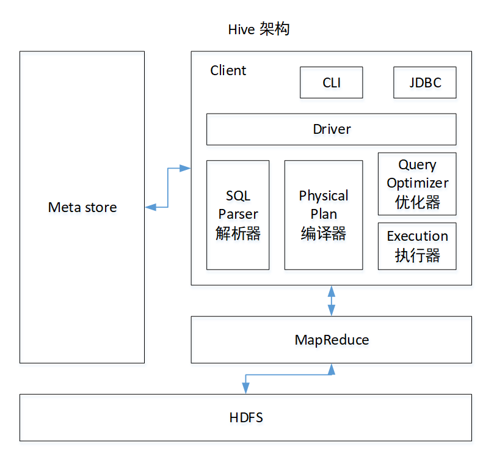
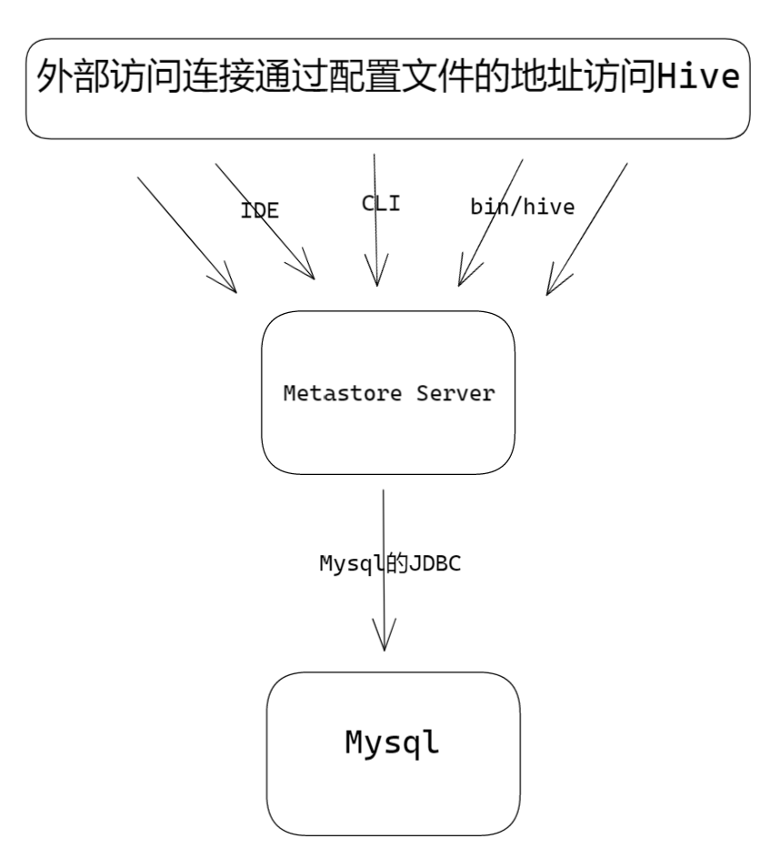
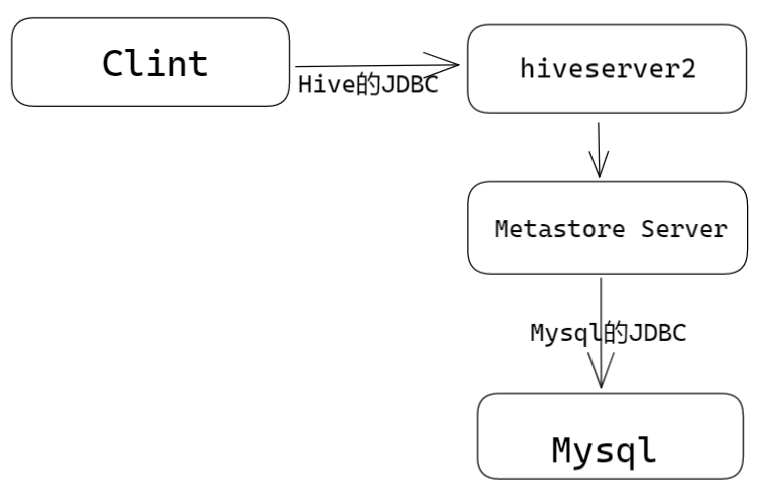
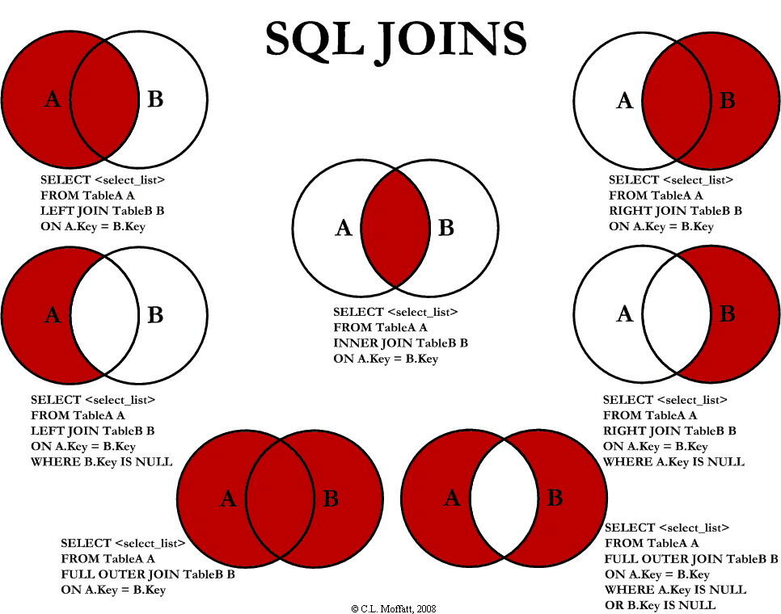
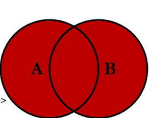
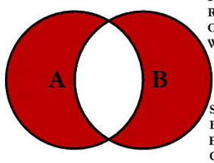

# 一、概念


Hive：由Facebook开源用于解决海量结构化日志的数据统计工具。

Hive 是一个构建在 Hadoop 之上的==数据仓库工具，==它可以**将结构化的数据文件映射成表，并提供类 SQL 查询功能，**用于查询的 SQL 语句会被转化为 MapReduce 作业，然后提交到 Hadoop 上运行。


**Hive本质**：将HQL转化成MapReduce程序

（1）Hive处理的数据存储在HDFS

（2）Hive分析数据底层的实现是MapReduce

（3）执行程序运行在Yarn上


## 架构




**1**）用户接口：Client

CLI（command-line interface）、JDBC/ODBC(jdbc访问hive)、WEBUI（浏览器访问hive）

**2**）元数据：Metastore

元数据包括：表名、表所属的数据库（默认是default）、表的拥有者、列/分区字段、表的类型（是否是外部表）、表的数据所在目录等；

默认存储在自带的derby数据库中，推荐使用MySQL存储Metastore

**3**）Hadoop

使用HDFS进行存储，使用MapReduce进行计算。

**4**）驱动器：Driver

（1）解析器（SQL Parser）：将SQL字符串转换成抽象语法树AST，这一步一般都用第三方工具库完成，比如antlr；对AST进行语法分析，比如==表是否存在、字段是否存在、SQL语义是否有误。==

（2）编译器（Physical Plan）：将AST编译==生成逻辑执行计划。==

（3）优化器（Query Optimizer）：对逻辑执行计划进行==优化。==

（4）执行器（Execution）：把逻辑执行计划==转换==成可以运行的物理计划。对于Hive来说，就是MR/Spark。


## 优缺点


**👍**

- 操作接口采用==类SQL语法==，提供快速开发的能力（简单、容易上手）。

- 避免了去写MapReduce，**减少开发人员的学习成本。**

- Hive的执行延迟比较高，因此Hive常用于数据分析，对实时性要求不高的场合。

- Hive优势在于处理大数据，对于处理小数据没有优势，因为Hive的执行延迟比较高。

- Hive支持用户自定义函数，用户可以根据自己的需求来实现自己的函数。


**👎**

**1）**Hive的HQL表达能力有限

（1）迭代式算法无法表达

（2）数据挖掘方面不擅长，由于MapReduce数据处理流程的限制，效率更高的算法却无法实现。

**2**）Hive的效率比较低

（1）Hive自动生成的MapReduce作业，通常情况下不够智能化

（2）Hive调优比较困难，粒度较粗


## Hive和 数据库比较


**由于 Hive 采用了类似SQL 的查询语言 HQL(Hive Query Language)，因此很容易将 Hive 理解为数据库。**其实从结构上来看，Hive 和数据库除了拥有类似的查询语言，再无类似之处。本文将从多个方面来阐述 Hive 和数据库的差异。数据库可以用在 Online 的应用中，但是Hive 是为数据仓库而设计的，清楚这一点，有助于从应用角度理解 Hive 的特性。


**查询语言**

==由于SQL被广泛的应用在数据仓库中，==因此，专门针对Hive的特性设计了类SQL的查询语言HQL。熟悉SQL开发的开发者可以很方便的使用Hive进行开发。

**数据更新**

由于Hive是针对数据仓库应用设计的，而数据仓库的内容是==读多写少的。==因此，==Hive中不建议对数据的改写==，所有的数据都是在加载的时候确定好的。而数据库中的数据通常是需要经常进行修改的，因此可以使用 INSERT INTO … VALUES 添加数据，使用 UPDATE … SET修改数据。

**执行延迟**

Hive 在查询数据的时候，由于没有索引，==需要扫描整个表==，因此延迟较高。另外一个导致 Hive 执行延迟高的因素是 MapReduce框架。==由于MapReduce 本身具有较高的延迟，==因此在利用MapReduce 执行Hive查询时，也会有较高的延迟。相对的，数据库的执行延迟较低。当然，这个低是有条件的，即数据规模较小，当数据规模大到超过数据库的处理能力的时候，Hive的并行计算显然能体现出优势。

 **数据规模**

由于Hive建立在集群上并可以利用MapReduce进行并行计算，因此==可以支持很大规模的数据==；对应的，数据库可以支持的数据规模较小。


# 二、Hive安装

[**Hive官网地址** ](http://hive.apache.org/)         [**文档查看地址**](https://cwiki.apache.org/confluence/display/Hive/GettingStarted)                         [**下载地址**](http://archive.apache.org/dist/hive/)                [**github地址**](https://github.com/apache/hive)


## MySql安装


==原因在于Hive默认使用的元数据库为derby，开启Hive之后就会占用元数据库==，且不与其他客户端共享数据，如果想多窗口操作就会报错，操作比较局限。以我们需要将Hive的元数据地址改为MySQL，==可支持多窗口操作。==


1. 卸载Linux自带的mysql
  
   1. **查自带的软件** 
   
   CentOS6->mysql   CentOS7 ->mariadb
   
   ​                                          👇**使用正则表达式识别转义字符\\**
   
   `rpm -qa | grep  -i  -E mysql\|mariadb`
   
   ​                                    👆**忽略大小写**
   
   2. **卸载**
       sudo rpm -e --nodeps mariadb-libs-5.5.56-2.el7.x86_64
       sudo rpm -e --nodeps mysql-community-common-5.7.16-1.el7.x86_64
   
     ​                                                                                   👇**传进来的参数的过滤器**
   
     `rpm -qa | grep  -i  -E mysql\|mariadb | xargs -n1 sudo rpm -e --nodeps` 

​																								  	**👆按一行传递**

~~~sh
#1）检查当前系统是否安装过Mysql
[atguigu@hadoop102 ~]$ rpm -qa|grep mariadb
mariadb-libs-5.5.56-2.el7.x86_64 //如果存在通过如下命令卸载
[atguigu @hadoop102 ~]$ sudo rpm -e --nodeps  mariadb-libs   //用此命令卸载mariadb

#2）将MySQL安装包拷贝到/opt/software目录下
[atguigu @hadoop102 software]# ll
总用量 528384
-rw-r--r--. 1 root root 609556480 3月  21 15:41 mysql-5.7.28-1.el7.x86_64.rpm-bundle.tar

#3）解压MySQL安装包
[atguigu @hadoop102 software]# tar -xf mysql-5.7.28-1.el7.x86_64.rpm-bundle.tar
 
#4）在安装目录下执行rpm安装
[atguigu @hadoop102 software]$ sudo rpm -ivh mysql-community-common-5.7.28-1.el7.x86_64.rpm
[atguigu @hadoop102 software]$ sudo rpm -ivh mysql-community-libs-5.7.28-1.el7.x86_64.rpm
[atguigu @hadoop102 software]$ sudo rpm -ivh mysql-community-libs-compat-5.7.28-1.el7.x86_64.rpm
[atguigu @hadoop102 software]$ sudo rpm -ivh mysql-community-client-5.7.28-1.el7.x86_64.rpm
[atguigu @hadoop102 software]$ sudo rpm -ivh mysql-community-server-5.7.28-1.el7.x86_64.rpm
注意:按照顺序依次执行
如果Linux是最小化安装的，在安装mysql-community-server-5.7.28-1.el7.x86_64.rpm时可能会出	现如下错误
[atguigu@hadoop102 software]$ sudo rpm -ivh mysql-community-server-5.7.28-1.el7.x86_64.rpm
警告：mysql-community-server-5.7.28-1.el7.x86_64.rpm: 头V3 DSA/SHA1 Signature, 密钥 ID 5072e1f5: NOKEY
错误：依赖检测失败：
        libaio.so.1()(64bit) 被 mysql-community-server-5.7.28-1.el7.x86_64 需要
        libaio.so.1(LIBAIO_0.1)(64bit) 被 mysql-community-server-5.7.28-1.el7.x86_64 需要
        libaio.so.1(LIBAIO_0.4)(64bit) 被 mysql-community-server-5.7.28-1.el7.x86_64 需要
通过yum安装缺少的依赖,然后重新安装mysql-community-server-5.7.28-1.el7.x86_64 即可
[atguigu@hadoop102 software] yum install -y libaio

#5）删除/etc/my.cnf文件中datadir指向的目录下的所有内容,如果有内容的情况下:
   查看datadir的值：
[mysqld]
datadir=/var/lib/mysql
   删除/var/lib/mysql目录下的所有内容:
[atguigu @hadoop102 mysql]# cd /var/lib/mysql
[atguigu @hadoop102 mysql]# sudo rm -rf ./*    //注意执行命令的位置

#6）初始化数据库
[atguigu @hadoop102 opt]$ sudo mysqld --initialize --user=mysql

#7）查看临时生成的root用户的密码 
[atguigu @hadoop102 opt]$ cat /var/log/mysqld.log 
  
#8）启动MySQL服务
[atguigu @hadoop102 opt]$ sudo systemctl start mysqld

#9）登录MySQL数据库
[atguigu @hadoop102 opt]$ mysql -uroot -p
Enter password:   输入临时生成的密码
   登录成功.

#10）必须先修改root用户的密码,否则执行其他的操作会报错
mysql> set password = password("新密码")

#11）修改mysql库下的user表中的root用户允许任意ip连接
mysql> update mysql.user set host='%' where user='root';
mysql> flush privileges;

~~~


##  Hive安装部署


~~~sh
#1）把apache-hive-3.1.2-bin.tar.gz上传到linux的/opt/software目录下
#2）解压apache-hive-3.1.2-bin.tar.gz到/opt/module/目录下面
[atguigu@hadoop102 software]$ tar -zxvf /opt/software/apache-hive-3.1.2-bin.tar.gz -C /opt/module/
			👆改变至目录 
#3）修改apache-hive-3.1.2-bin.tar.gz的名称为hive
[atguigu@hadoop102 software]$ mv /opt/module/apache-hive-3.1.2-bin/ /opt/module/hive

#4）修改/etc/profile.d/my_env.sh，添加环境变量
[atguigu@hadoop102 software]$ sudo vim /etc/profile.d/my_env.sh

#5）添加内容
#HIVE_HOME
HIVE_HOME=/opt/module/hive
PATH=$PATH:$JAVA_HOME/bin:$HADOOP_HOME/bin:$HADOOP_HOME/sbin:$HIVE_HOME/bin
export PATH JAVA_HOME HADOOP_HOME HIVE_HOME

#6）解决日志Jar包冲突
[atguigu@hadoop102 software]$ mv $HIVE_HOME/lib/log4j-slf4j-impl-2.10.0.jar $HIVE_HOME/lib/log4j-slf4j-impl-2.10.0.bak

~~~


## Hive元数据配置到MySql


~~~xml
🌴**拷贝驱动**
将MySQL的JDBC驱动拷贝到Hive的lib目录下
[atguigu@hadoop102 software]$ cp /opt/software/mysql-connector-java-5.1.48.jar $HIVE_HOME/lib

🌴配置Metastore到MySql
#在$HIVE_HOME/conf目录下新建hive-site.xml文件
[atguigu@hadoop102 software]$ vim $HIVE_HOME/conf/hive-site.xml
添加如下内容
<?xml version="1.0"?>
<?xml-stylesheet type="text/xsl" href="configuration.xsl"?>
<configuration>
    <!-- jdbc连接的URL -->
    <property>
        <name>javax.jdo.option.ConnectionURL</name>
        <value>jdbc:mysql://hadoop102:3306/metastore?useSSL=false</value>
</property>

    <!-- jdbc连接的Driver-->
    <property>
        <name>javax.jdo.option.ConnectionDriverName</name>
        <value>com.mysql.jdbc.Driver</value>
</property>

	<!-- jdbc连接的username-->
    <property>
        <name>javax.jdo.option.ConnectionUserName</name>
        <value>root</value>
    </property>

    <!-- jdbc连接的password -->
    <property>
        <name>javax.jdo.option.ConnectionPassword</name>
        <value>123456</value>
</property>

    <!-- Hive默认在HDFS的工作目录 -->
    <property>
        <name>hive.metastore.warehouse.dir</name>
        <value>/user/hive/warehouse</value>
    </property>
    
   <!-- Hive元数据存储的验证 -->
    <property>
        <name>hive.metastore.schema.verification</name>
        <value>false</value>
    </property>
   
    <!-- 元数据存储授权  -->
    <property>
        <name>hive.metastore.event.db.notification.api.auth</name>
        <value>false</value>
    </property>
</configuration>

~~~


## 初始化元数据库

```sh
#登陆MySQL
[atguigu@hadoop102 software]$ mysql -uroot -p000000

#新建Hive元数据库
mysql> create database metastore;
mysql> quit;

#初始化Hive元数据库📌
[atguigu@hadoop102 software]$ schematool -initSchema -dbType mysql -verbose
```


## 启动的三种方式Hive

> 根据连接方式将Hive的其中分为三种


**仅限本地连接**

- ```sh
  $bin/hive
  ```

  ==该方式直接命令启动即可不需要启动额外的服务==

**外部访问连接**

- 2、元数据服务的方式访问Hive
- 3、JDBC方式访问Hive


### 外部访问连接

------

#### 元数据服务的方式

------

​																								**原理图⚙**



- **在hive-site.xml文件中添加如下配置信息**

  ```xml
  <!-- 指定存储元数据要连接的地址 -->
      <property>
          <name>hive.metastore.uris</name>
          <value>thrift://hadoop102:9083</value>
      </property>
  ```

- **启动metastore Server**

  ```sh
  $ hive --service metastore
  ```

- ==启动HIve==

  ```sh
  hive]$ bin/hive
  ```

  


#### JDBC方式

------

​																							**原理图⚙**



- **在hive-site.xml文件中添加如下配置信息**

  ```xml
  <!-- 指定hiveserver2连接的host -->
      <property>
          <name>hive.server2.thrift.bind.host</name>
          <value>hadoop102</value>
      </property>
  
      <!-- 指定hiveserver2连接的端口号 -->
      <property>
          <name>hive.server2.thrift.port</name>
          <value>10000</value>
      </property>
  ```

- **启动hiveserver2**

  ```sh
  $ bin/hive --service hiveserver2
  ```

- **启动beeline客户端**                ==启动后多等待==

  ```sh
  $ bin/beeline -u jdbc:hive2://hadoop102:10000 -n atguigu
  ```

  

==Beeline/HS2连接报错==：Could not open client transport with JDBC Uri: jdbc:hive2://localhost:10000/default

**主要原因：**是hadoop引入了一个安全伪装机制，使得hadoop 不允许上层系统直接将实际用户传递到hadoop层，而是将实际用户传递给一个超级代理，由此代理在hadoop上执行操作，避免任意客户端随意操作hadoop

**解决方式：**在hadoop的配置文件core-site.xml增加如下配置，重启hdfs，其中“xxx”是连接beeline的用户，将“xxx”替换成自己的用户名即可。最关键的是==一定要重启hadoop==，先`stop-all.sh`，再`start-all.sh`，否则不会生效的！！那样就还是报错！


~~~xml
 <property>
        <name>hadoop.proxyuser.xxx.hosts</name>
        <value>*</value>
    </property>
    <property>
        <name>hadoop.proxyuser.xxx.groups</name>
        <value>*</value>
    </property>
~~~

**“\*”表示可通过超级代理“xxx”操作hadoop的用户、用户组和主机**

 


## 编写metastore和hiveserver2脚本


==用脚本的话注释掉JDBC和元数据的配置==     <!--  -->  [^XML注释符]


### Shell命令介绍

前台启动的方式导致需要打开多个shell窗口，可以使用如下方式后台方式启动

`nohup`: 放在命令开头，表示不挂起,也就是关闭终端进程也继续保持运行状态

0:标准输入

1:标准输出

2:错误输出

`2>&1` : 表示将错误重定向到标准输出上

`&`: 放在命令结尾,表示后台运行

一般会组合使用: nohup [xxx命令操作]> file 2>&1 & ， 表示将xxx命令运行的

结果输出到file中，并保持命令启动的进程在后台运行。

**逐一启动**

`$ nohup hive --service metastore 2>&1 &`

`$ nohup hive --service hiveserver2 2>&1 &`


### 编写脚本

~~~sh
[atguigu@hadoop102 hive]$ vim $HIVE_HOME/bin/hiveservices.sh

👇
#!/bin/bash
HIVE_LOG_DIR=$HIVE_HOME/logs
if [ ! -d $HIVE_LOG_DIR ]
then
	mkdir -p $HIVE_LOG_DIR
fi
#检查进程是否运行正常，参数1为进程名，参数2为进程端口
function check_process()
{
    pid=$(ps -ef 2>/dev/null | grep -v grep | grep -i $1 | awk '{print $2}')
    ppid=$(netstat -nltp 2>/dev/null | grep $2 | awk '{print $7}' | cut -d '/' -f 1)
    echo $pid
    [[ "$pid" =~ "$ppid" ]] && [ "$ppid" ] && return 0 || return 1
}

function hive_start()
{
    metapid=$(check_process HiveMetastore 9083)
    cmd="nohup hive --service metastore >$HIVE_LOG_DIR/metastore.log 2>&1 &"
    cmd=$cmd" sleep 4; hdfs dfsadmin -safemode wait >/dev/null 2>&1"
    [ -z "$metapid" ] && eval $cmd || echo "Metastroe服务已启动"
    server2pid=$(check_process HiveServer2 10000)
    cmd="nohup hive --service hiveserver2 >$HIVE_LOG_DIR/hiveServer2.log 2>&1 &"
    [ -z "$server2pid" ] && eval $cmd || echo "HiveServer2服务已启动"
}

function hive_stop()
{
    metapid=$(check_process HiveMetastore 9083)
    [ "$metapid" ] && kill $metapid || echo "Metastore服务未启动"
    server2pid=$(check_process HiveServer2 10000)
    [ "$server2pid" ] && kill $server2pid || echo "HiveServer2服务未启动"
}

case $1 in
"start")
    hive_start
    ;;
"stop")
    hive_stop
    ;;
"restart")
    hive_stop
    sleep 2
    hive_start
    ;;
"status")
    check_process HiveMetastore 9083 >/dev/null && echo "Metastore服务运行正常" || echo "Metastore服务运行异常"
    check_process HiveServer2 10000 >/dev/null && echo "HiveServer2服务运行正常" || echo "HiveServer2服务运行异常"
    ;;
*)
    echo Invalid Args!
    echo 'Usage: '$(basename $0)' start|stop|restart|status'
    ;;
esac

~~~


**添加执行权限**

~~~sh
[atguigu@hadoop102 hive]$ chmod u+x $HIVE_HOME/bin/hiveservices.sh
~~~

### Hive脚本操作

~~~sh
[atguigu@hadoop102 hive]$ hiveservices.sh start  👈启动
[atguigu@hadoop102 hive]$hiveservices.sh status  👈状态
[atguigu@hadoop102 hive]$ hiveservices.sh restart  👈重启

~~~


## HIve基操

###  Hive常用交互命令


`bin/hive -help`

~~~sh
🌼#1）“-e”不进入hive的交互窗口执行sql语句
[atguigu@hadoop102 hive]$ bin/hive -e "select id from student;"

🌼#2）“-f”执行脚本中sql语句
   #（1）在/opt/module/hive/下创建datas目录并在datas目录下创建hivef.sql文件
[atguigu@hadoop102 datas]$ touch hivef.sql
   #（2）文件中写入正确的sql语句
select *from student;
   #（3）执行文件中的sql语句
[atguigu@hadoop102 hive]$ bin/hive -f /opt/module/hive/datas/hivef.sql
   #（4）执行文件中的sql语句并将结果写入文件中
[atguigu@hadoop102 hive]$ bin/hive -f /opt/module/hive/datas/hivef.sql  > /opt/module/datas/hive_result.txt

~~~


### Hive其他命令操作

~~~sh
#1）退出hive窗口：
hive(default)>exit;
hive(default)>quit;
在新版的hive中没区别了，在以前的版本是有的：
exit:先隐性提交数据，再退出；
quit:不提交数据，退出；

#2）在hive cli命令窗口中如何查看hdfs文件系统
hive(default)>dfs -ls /;

#3）查看在hive中输入的所有历史命令
（1）进入到当前用户的根目录/root或/home/atguigu
（2）🧐查看. hivehistory文件
[atguig2u@hadoop102 ~]$ cat .hivehistory

~~~


### Hive常见属性配置

#### hive窗口打印默认库和表头

~~~xml
在hive-site.xml中加入如下两个配置: 
   <!--打印 当前库 和 表头 -->
  <property>
    <name>hive.cli.print.header</name>
    <value>true</value>
  </property>
   <property>
    <name>hive.cli.print.current.db</name>
    <value>true</value>
  </property>

~~~


   <!--打印 当前库 和 表头 -->

#### Hive运行日志信息配置


> **Hive的log默认存放在/tmp/atguigu/hive.log目录下（当前用户名下）**


🍂**修改*hive的log存放日志到*/opt/module/hive/logs**

~~~sh
#（1）修改/opt/module/hive/conf/hive-log4j2.properties.template文件名称为
hive-log4j2.properties
[atguigu@hadoop102 conf]$ pwd
/opt/module/hive/conf
[atguigu@hadoop102 conf]$ mv hive-log4j2.properties.template hive-log4j2.properties


#（2）在hive-log4j.properties文件中修改log存放位置
property.hive.log.dir=/opt/module/hive/logs
~~~


#### 参数配置方式


~~~sh
👉1）查看当前所有的配置信息
hive>set;
👉2）参数的配置三种方式
     🌴#（1）配置文件方式
默认配置文件：hive-default.xml 
用户自定义配置文件：hive-site.xml

     🌴#（2）命令行参数方式
启动Hive时，可以在命令行添加-hiveconf param=value来设定参数。
[atguigu@hadoop103 hive]$ bin/hive -hiveconf mapred.reduce.tasks=10;


     🌴#（3）参数声明方式
可以在HQL中使用SET关键字设定参数
hive (default)> set mapred.reduce.tasks=100;
查看参数设置
hive (default)> set mapred.reduce.tasks;

~~~

​																	👇default.xml	👇site.xml

上述三种设定方式的优先级依次递增。即**默认配置文件<配置文件<命令行参数<参数声明。**注意某些系统级的参数，例如log4j相关的设定，必须用前两种方式设定，因为那些参数的读取在会话建立以前已经完成了


🚩==注意：==用户自定义配置会覆盖默认配置。另外，Hive也会读入Hadoop的配置，因为Hive是作为Hadoop的客户端启动的，Hive的配置会覆盖Hadoop的配置。配置文件的设定对本机启动的所有Hive进程都有效。


==注意==：**命令行和参数声明方式仅对本次hive启动有效**


# 三、Hive数据类型


## 基本数据类型


| Hive数据类型 | Java数据类型 | 长度                                                 | 例子                                  |
| ------------ | ------------ | ---------------------------------------------------- | ------------------------------------- |
| TINYINT      | byte         | 1byte有符号整数                                      | 20                                    |
| SMALINT      | short        | 2byte有符号整数                                      | 20                                    |
| ==INT==      | int          | 4byte有符号整数                                      | 20                                    |
| ==BIGINT==   | long         | 8byte有符号整数                                      | 20                                    |
| BOOLEAN      | boolean      | 布尔类型，true或者false                              | TRUE FALSE                            |
| FLOAT        | float        | 单精度浮点数                                         | 3.14159                               |
| ==DOUBLE==   | double       | 双精度浮点数                                         | 3.14159                               |
| ==STRING==   | string       | 字符系列。可以指定字符集。可以使用单引号或者双引号。 | ‘now is the time’  “for all good men” |
| TIMESTAMP    |              | 时间类型                                             |                                       |
| BINARY       |              | 字节数组                                             |                                       |


对于Hive的String类型相当于数据库的varchar类型，该类型是一个可变的字符串，不过它不能声明其中最多能存储多少个字符，理论上它可以存储2GB的字符数。


## 集合数据类型


| 数据类型 | 描述                                                         | 语法示例                                         |
| -------- | ------------------------------------------------------------ | ------------------------------------------------ |
| STRUCT   | 和c语言中的struct类似，都可以通过“点”符号访问元素内容。例如，如果某个列的数据类型是STRUCT{first STRING, last  STRING},那么第1个元素可以通过字段.first来引用。 | struct()  例如struct<street:string, city:string> |
| MAP      | MAP是一组键-值对元组集合，使用数组表示法可以访问数据。例如，如果某个列的数据类型是MAP，其中键->值对是’first’->’John’和’last’->’Doe’，那么可以通过字段名[‘last’]获取最后一个元素 | map()  例如map<string, int>                      |
| ARRAY    | 数组是一组具有相同类型和名称的变量的集合。这些变量称为数组的元素，每个数组元素都有一个编号，编号从零开始。例如，数组值为[‘John’, ‘Doe’]，那么第2个元素可以通过数组名[1]进行引用。 | Array()  例如array<string>                       |


Hive有三种复杂数据类型ARRAY、MAP 和 STRUCT。**ARRAY和MAP与Java中的Array和Map类似，而STRUCT与Java语言中的对象类似，**它封装了一个字段集合，复杂数据类型允许任意层次的嵌套。


> 案例


用JSON格式来表示其数据结构。在Hive下访问的格式为

~~~json
{
    "name": "songsong",
    "friends": ["bingbing" , "lili"] ,        //列表Array, 
    "children": {                            //键值Map,
        "xiao song": 19 ,
        "xiaoxiao song": 18
    },
    "address": {                            //结构Struct,
        "street": "hui long guan" ,
        "city": "beijing" 
    }
}

~~~


在Hive里创建对应的表，并导入数据。

Hive上创建测试表test   

 ==注意：==name等字段前不要有**\t**必须为空格或空[^TAB与Linux自动补全冲突]

~~~sql
create table test(
name string,
friends array<string>,
children map<string, int>,
address struct<street:string, city:string>
)
row format delimited fields terminated by ','    
collection items terminated by '_'             
map keys terminated by ':'
lines terminated by '\n';
~~~

🧐

| row format delimited fields terminated by ',' | 列分隔符                                                 |
| --------------------------------------------- | -------------------------------------------------------- |
| collection items terminated by '_'            | **MAP**   **STRUCT** 和 **ARRAY** 的分隔符(数据分割符号) |
| map keys terminated by ':'                    | MAP中的key与value的分隔符                                |
| lines terminated by '\n';                     | 行分隔符                                                 |


⚙**导入文本数据到测试表**

创建文本写入内容📝

~~~txt
songsong   ,  bingbing_lili  ,  xiao song:18_xiaoxiao song:19  ,   hui long guan_beijing
yangyang   ,  caicai_susu    ,  xiao yang:18_xiaoxiao yang:19  ,   chao yang_beijing
~~~

导入集群（映射到test表）

`load data local inpath '/opt/module/hive/datas/test.txt' into table test;` 


**访问三种集合列里的数据，**以下分别是ARRAY，MAP，STRUCT的访问方式

~~~sql
hive (default)> select friends[1],children['xiao song'],address.city from test
where name="songsong";
OK
_c0     _c1     city

lili    18      beijing
Time taken: 0.076 seconds, Fetched: 1 row(s)

~~~


## 类型转换


Hive的原子数据类型是可以进行隐式转换的，**类似于Java的类型转换**，例如某表达式使用INT类型，TINYINT会自动转换为INT类型，但是Hive不会进行反向转化，例如，某表达式使用TINYINT类型，INT不会自动转换为TINYINT类型，它会返回错误，==除非使用CAST操作。==


**隐式类型转换规则如下**

> 从小到大自动转换
>

📁任何整数类型都可以隐式地转换为一个范围更广的类型，如TINYINT可以转换成INT，INT可以转换成BIGINT。                        自动转换

📁所有整数类型、FLOAT和STRING类型都可以隐式地转换成DOUBLE。

📁TINYINT、SMALLINT、INT都可以转换为FLOAT。

📁BOOLEAN类型不可以转换为任何其它的类型。


**使用CAST操作显示进行数据类型转换**

> 从大到小强制转换
>


`CAST('1' AS INT)`将把字符串'1' 转换成整数1；如果强制类型转换失败，如执行`CAST('X' AS INT)`，表达式返回空值 NULL。


# 四、DDL数据定义


## 库相关

### 创建数据库


> 建库语法
>

~~~mysql
CREATE DATABASE [IF NOT EXISTS] database_name
[COMMENT database_comment]							🍉库注释
[LOCATION hdfs_path]      							🍉指定创建在HDFS的路径
[WITH DBPROPERTIES (property_name=property_value, ...)]; 		
~~~


**创建数据库**

~~~mysql
create database if not exists mydb   
comment "my first db"
location '/db_hive2.db'
with dbproperties("createtime"="2021-04-24");
~~~


​		==数据库在HDFS上的默认存储路径是/user/hive/warehouse/\*.db==


### 查询数据库

🍏

| **显示数据库**                   | hive> show databases;                     |
| -------------------------------- | ----------------------------------------- |
| **过滤显示查询的数据库**         | **hive> show databases like 'db_hive*';** |
| **显示数据库信息**               | **hive> desc database db_hive;**          |
| **显示数据库详细信息，extended** | **hive> desc database extended db_hive;** |
| **切换当前数据库**               | **hive (default)> use db_hive;**          |


### 修改数据库


用户可以使用ALTER DATABASE命令为某个数据库的DBPROPERTIES**设置键-值对属性值，来描述这个数据库的属性信息。**


`alter database mydb set dbproperties("createtime"="2020-04-24","author"="wyh");`


### 删除数据库

| **删除空数据库**                                    | hive>drop database db_hive2;             |
| --------------------------------------------------- | ---------------------------------------- |
| **数据库不为空，可以采用==cascade==命令，强制删除** | **hive> drop database db_hive cascade;** |


## 表相关

### 创建表

==中括号里即为可省略内容==


> 建表语法
>

🧐

| 语法                                                         | 解释                                     |
| ------------------------------------------------------------ | ---------------------------------------- |
| ==CREATE [EXTERNAL] TABLE [IF NOT EXISTS] table_name==       | EXTERANL: 外部表                         |
| ==[(col_name data_type [COMMENT col_comment], ...)]==        | 列名 列类型 列描述信息                   |
| [COMMENT table_comment]                                      | 表描述信息                               |
| [PARTITIONED BY (col_name data_type [COMMENT col_comment], ...)] | 创建分区表指定分区字段  分区列名  列类型 |
| [CLUSTERED BY (col_name, col_name, ...)]                     | 创建分桶表指定分桶字段   分桶列名        |
| [SORTED BY (col_name [ASCDESC], ...)] INTO num_buckets BUCKETS] | 指定分桶数                               |
| ==[ROW FORMAT delimited fields terminated by ... ]==         | 指定一条数据字段与字段的分割符           |
| ==[collection items terminated by  ... ]==                   | 指定集合元素与元素的分割符               |
| ==[map keys terminated by ... ]==                            | 指定map的kv的分割符                      |
| [STORED AS file_format]                                      | 指定文件存储格式，默认为 textfile        |
| [LOCATION hdfs_path]                                         | 指定表在hdfs中对应的路径                 |
| [TBLPROPERTIES (property_name=property_value, ...)]          | 指定表的属性                             |
| [AS select_statement]                                        | 基于某个查询建表                         |

  

>  管理表(内部表)


默认创建的表都是所谓的管理表，有时也被称为**内部表**。因为这种表，Hive会（或多或少地）控制着数据的生命周期。Hive默认情况下会将这些表的数据存储在由配置项hive.metastore.warehouse.dir(例如，/user/hive/warehouse)所定义的目录的子目录下。  ==当我们删除一个管理表时，Hive也会删除这个表中数据==。管理表不适合和其他工具共享数据。


> 外部表


因为表是外部表，所以Hive并非认为其完全拥有这份数据。**删除该表并不会删除掉这份数据，不过描述表的元数据信息会被删除掉。**


🔥外部表用的多      删表不删数据


------

**管理表和外部表的使用场景**

每天将收集到的网站日志定期流入HDFS文本文件。在外部表（原始日志表）的基础上做大量的统计分析，用到的中间表、结果表使用内部表存储，数据通过SELECT+INSERT进入内部表。


**管理表与外部表的互相转换**

`alter table student2 set tblproperties('EXTERNAL'='TRUE');`     内转外


⚙**建表**

~~~sql
🔨
create table if not exists test1(
  id int comment "this's id ",
  name string  comment "this   name"
)
comment "this  table"
row format delimited fields terminated by ','
STORED as textfile 
TBLPROPERTIES("createtime"="2021-04-24")

🔨
create table if not exists test2(
  id int ,
  name string 
)
row format delimited fields terminated by ','
location "/test2.table"

🔨
create table if not exists test3(
  id int ,
  name string 
)
row format delimited fields terminated by ','
location "/mydata" ;

🔨
create table if not exists test4(
  id int ,
  name string 
)
row format delimited fields terminated by ',' ;

🔨
create external table if not exists test5(
  id int ,
  name string 
)
row format delimited fields terminated by ',' ;
~~~


### 修改表


**🔗重命名表**

`ALTER TABLE 表名 RENAME TO 新表名`


column：单个列后面参数不加括号     columns：多个列用括号包起来

**🔗增加/修改/替换列信息**													

`ALTER TABLE 表名 CHANGE COLUMN （旧列名 新列名 列类型） [列注释] [FIRST|AFTER column_name]`

例子：

~~~mysql
hive (default)> alter table dept change column deptdesc desc string;
~~~

**🔗改列名**

`alter table 列名 rename to 新列名 ;` 


**🔗增加列**

​													👇增加多个列

`alter table 列名 add columns (addr string, deptno int );`


**🔗替换列**

`alter table 列名/表名 replace columns (empid int, empname string);`


==注==：ADD是代表新增一字段，字段位置在所有列后面(partition列前)，**REPLACE则是表示替换表或列中所有字段。**


### 删除表

------

`drop table 表名字;`


# 五、DML数据操作


## 数据导入

==[  ]表示可省略内容==


### 向表中装载数据Load

**语法**

~~~sql
hive> load data [local] inpath '数据的path' [overwrite] into table student [partition (partcol1=val1,…)];
~~~

（1）load data:表示加载数据

（2）local:表示从本地加载数据到hive表；否则从HDFS加载数据到hive表

（3）inpath:表示加载数据的路径

（4）overwrite:表示覆盖表中已有数据，否则表示追加

（5）into table:表示加载到哪张表

（6）student:表示具体的表

（7）partition:表示上传到指定分区


> 案例


~~~mysql
本地路径导入
load data local inpath '/opt/module/hive-3.1.2/datas/student1.txt' into table student; 

本地路径导入覆写
load data local inpath '/opt/module/hive-3.1.2/datas/student2.txt' overwrite into table student; 


load data inpath '/hivedatas/student.txt' into table student; 

~~~


### 通过查询语句向表中插入数据Insert


insert  into：以追加数据的方式插入到表或分区，原有数据不会删除

insert  overwrite：会覆盖表中已存在的数据

==注意：insert不支持插入部分字段==


> 案例

~~~mysql
insert into student values(1017,'ss17'),(1018,'ss18'),(1019,'ss19');  

insert into student2 select id, name from student ;  
~~~


### 查询语句中创建表并加载数据As Select


根据查询结果创建表（查询的结果会添加到新创建的表中）


> 案例
>

~~~sql
create table student3 as select id, name from student ;
~~~


### 创建表时通过Location指定加载数据路径


> 案例
>


~~~sql
create table student4(id string, name string)
row format delimited fields terminated by '\t'
location '/student4' ;
~~~


### Import数据到指定Hive表中

==注意：先用export导出后，再将数据导入。==


> 案例

~~~sql
import table emptest2 from '/emptest';
~~~


## 数据导出


### Insert导出


> 案例
>


~~~sql
/*将查询的结果导出到本地 */
						👇
insert overwrite local directory '/opt/module/hive-3.1.2/datas/insert-result' select * from  emptest ;  

/*将查询的结果格式化导出到本地  */
						👇
insert overwrite local directory '/opt/module/hive-3.1.2/datas/insert-result' 
row format delimited fields terminated by ':'
select * from emptest ;

/* 将查询的结果导出到HDFS */
					👇
insert overwrite  directory '/insert-result' 
row format delimited fields terminated by ':'
select * from emptest ;
~~~


==如果表中的列的值为null,导出到文件中以后会通过\N来表示.==


### Hadoop命令导出到本地

> 案例
>

~~~sql

hive (default)> dfs -get /user/hive/warehouse/student/student.txt
/opt/module/datas/export/student3.txt;

~~~


### Hive Shell 命令导出

**基本语法**：（`hive -f/-e 执行语句或者脚本 > file`）


> 案例
>

~~~sh
											    👇
$ bin/hive -e 'select * from default.student;'   >
 /opt/module/hive/datas/export/student4.txt;

~~~


### Export导出到HDFS上


==包含元数据 可用于集群数据迁移==

**基本语法：**（`export  table  数据库.数据表  to 'HDFS路径';`）


> 案例
>

~~~sql

export table mydb.emptest to '/emptest' ;
~~~


### 清除表中数据（Truncate）


==注意：Truncate只能删除内部表的表和表数据，不能删除外部表中数据==


> 案例
>

~~~sql
truncate table student;
~~~


# 六、查询

[文档链接](https://cwiki.apache.org/confluence/display/Hive/LanguageManual+Select)


> 🧐查询语句语法
>

~~~sql
SELECT [ALL | DISTINCT] select_expr, select_expr, ...  -- 查哪些
  FROM table_reference  -- 从哪查
  [WHERE where_condition]  -- 过滤条件
  [GROUP BY col_list] -- 分组
  [HAVING having_contiditon] -- 分组后过滤条件
  [ORDER BY col_list] -- 全局排序
  [CLUSTER BY col_list  -- 分区排序
    ||  --等于
   [DISTRIBUTE BY col_list]  -- 分区
   [SORT BY col_list] -- 区内排序
  ]
 [LIMIT number] -- 限制返回的条数
~~~


## 基本查询


### 全表查询


~~~sql
hive (default)> select * from 表名;
~~~


### 选择特定列查询


~~~sql
hive (default)> select 列名1, 列名2 from 表名;
~~~


==注意：==

+ SQL 语言大小写不敏感。
+ SQL 可以写在一行或者多行
+ 关键字不能被缩写也不能分行
+ 各子句一般要分行写。
+ 使用缩进提高语句的可读性。


### 列别名

 ==关键字“AS”   加不加都行 注意格式就OK==

~~~sql
select 名字 AS 新名字, 名字 新名字 from 表名;
~~~


### 算术运算符


| 运算符 | 描述           |
| ------ | -------------- |
| A+B    | A和B 相加      |
| A-B    | A减去B         |
| A*B    | A和B 相乘      |
| A/B    | A除以B         |
| A%B    | A对B取余       |
| A&B    | A和B按位取与   |
| A\|B   | A和B按位取或   |
| A^B    | A和B按位取异或 |
| ~A     | A按位取反      |


> 案例
>

查询出所有员工的薪水后加1显示。

~~~sql
hive (default)> select sal +1 from emp;
~~~


### 常用函数


~~~sql
1）求总行数（count）
hive (default)> select count(*) cnt from emp;

2）求工资的最大值（max）
hive (default)> select max(sal) max_sal from emp;

3）求工资的最小值（min）
hive (default)> select min(sal) min_sal from emp;

4）求工资的总和（sum）
hive (default)> select sum(sal) sum_sal from emp; 

5）求工资的平均值（avg）
hive (default)> select avg(sal) avg_sal from emp;

~~~


### Limit语句（分页）


~~~sql
/*============== 分页 ================ 
语法 : SELECT * FROM table LIMIT [offset,] rows | rows OFFSET offset 
好处 : (用户体验,网络传输,查询压力)


推导:
		第一页 : limit 0,5
        第二页 : limit 5,5 
        第三页 : limit 10,5 
        ......   
        第N页 : limit (pageNo-1)*pageSzie,pageSzie 
        [pageNo:页码,pageSize:单页面显示条数]  
        
*/


hive (default)> select * from emp limit 3,3;
~~~


### Where语句及其条件判断


使用WHERE子句，将不满足条件的行过滤掉

==WHERE子句紧随FROM子句==

==注意：where子句中不能使用字段别名。==

~~~sql
hive (default)> select * from emp where sal >1000;
~~~


#### 比较运算符（Between/In/ Is Null）


| 操作符                   | 支持的数据类型 | 描述                                                         |
| ------------------------ | -------------- | ------------------------------------------------------------ |
| A=B                      | 基本数据类型   | 如果A等于B则返回TRUE，反之返回FALSE                          |
| A<=>B                    | 基本数据类型   | ==且==     如果A和B都为NULL，则返回TRUE，如果一边为NULL，返回False |
| A<>B, A!=B               | 基本数据类型   | ==或  非==     A或者B为NULL则返回NULL；如果A不等于B，则返回TRUE，反之返回FALSE |
| A<B                      | 基本数据类型   | A或者B为NULL，则返回NULL；如果A小于B，则返回TRUE，反之返回FALSE |
| A<=B                     | 基本数据类型   | A或者B为NULL，则返回NULL；如果A小于等于B，则返回TRUE，反之返回FALSE |
| A>B                      | 基本数据类型   | A或者B为NULL，则返回NULL；如果A大于B，则返回TRUE，反之返回FALSE |
| A>=B                     | 基本数据类型   | A或者B为NULL，则返回NULL；如果A大于等于B，则返回TRUE，反之返回FALSE |
| A [NOT] BETWEEN B  AND C | 基本数据类型   | ==表示A是否在BC之间==     如果A，B或者C任一为NULL，则结果为NULL。如果A的值大于等于B而且小于或等于C，则结果为TRUE，反之为FALSE。如果使用NOT关键字则可达到相反的效果。 |
| A IS NULL                | 所有数据类型   | 如果A等于NULL，则返回TRUE，反之返回FALSE                     |
| A IS NOT NULL            | 所有数据类型   | 如果A不等于NULL，则返回TRUE，反之返回FALSE                   |
| ==IN(数值1, 数值2)==     | 所有数据类型   | 使用 IN运算显示列表中的值                                    |
| A [NOT] LIKE B           | STRING 类型    | B是一个SQL下的简单正则表达式，也叫通配符模式，如果A与其匹配的话，则返回TRUE；反之返回FALSE。B的表达式说明如下：‘x%’表示A必须以字母‘x’开头，‘%x’表示A必须以字母’x’结尾，而‘%x%’表示A包含有字母’x’,可以位于开头，结尾或者字符串中间。如果使用NOT关键字则可达到相反的效果。 |
| A RLIKE B, A  REGEXP B   | STRING 类型    | B是基于java的正则表达式，如果A与其匹配，则返回TRUE；反之返回FALSE。匹配使用的是JDK中的正则表达式接口实现的，因为正则也依据其中的规则。例如，正则表达式必须和整个字符串A相匹配，而不是只需与其字符串匹配。 |


==这些操作符同样可以用于JOIN…ON和HAVING语句中。==


####  Like和RLike

------

使用LIKE运算选择类似的值（模糊查询）

选择条件可以包含字符或数字:

+ % 代表零个或多个字符(任意个字符)。

+  _ 代表一个字符。


RLIKE子句是Hive中这个功能的一个扩展，其可以通过**Java的正则表达式**这个更强大的语言来指定匹配条件。


~~~sql
（1）查找名字以A开头的员工信息
hive (default)> select * from emp where ename LIKE 'A%';


（2）查找名字中第二个字母为A的员工信息
hive (default)> select * from emp where ename LIKE '_A%';


（3）查找名字中带有A的员工信息
hive (default)> select * from emp where ename  RLIKE '[A]';
~~~


#### 逻辑运算符（And/Or/Not）

| 操作符 | 含义   |
| ------ | ------ |
| AND    | 逻辑并 |
| OR     | 逻辑或 |
| NOT    | 逻辑否 |


~~~sql
（1）查询薪水大于1000，部门是30
hive (default)> select * from emp where sal>1000 and deptno=30;

（2）查询薪水大于1000，或者部门是30
hive (default)> select * from emp where sal>1000 or deptno=30;

（3）查询除了20部门和30部门以外的员工信息
hive (default)> select * from emp where deptno not IN(30, 20);

~~~


## 分组


### Group By语句

GROUP BY语句通常会和聚合函数一起使用，按照一个或者多个列队结果进行分组，然后对每个组执行聚合操作。


**分组之后，select后面只能跟组标识(分组字段) 和 聚合函数(分组函数)**


~~~sql
计算emp表每个部门的平均工资
select deptno ,avg(sal) avg_sal from emp group by deptno 

计算emp每个部门中每个岗位的最高薪水
select deptno ,job ,max(sal) max_sal from emp group by deptno,job ; 
~~~


### Having语句


`having`与`where`不同点

- where后面不能写分组函数，而having后面可以使用分组函数。

- having只用于group by分组统计语句。


~~~sql
select
  deptno , avg(sal) avg_sal 
from 
emp
where job != 'CLERK'  	👈
group by deptno 		👈		
having avg_sal >2000 ;  👈
~~~


## Join语句





### 🚩Join核心思想

  👉内连接   A inner join B  on ....
     			内连接的结果集取交集

  👉外连接    
    		主表(驱动表) 和  从表(匹配表)
    		外连接的结果集主表的所有数据 +  从表中与主表匹配的数据. 

```sql
左连接  A left outer join B  on ....    A 主 B 从
         B right outer Join A  on.... 

右连接  A right outer join B  on ....   A 从 B 主
         B left outer join  A  on ....
```

  👉自连接 

​					 满外连接(full outer join ) 

 		

`Outer可加可不加`


### 内连接


~~~sql
		/*emp 和 dept共有的数据(内连接)*/
select
  e.ename, d.deptno 
from  
 emp e inner join dept  d
on e.deptno = d.deptno 
~~~


### 左右连接

#### 左连接


~~~sql
/*emp所有的数据  和  dept中与emp匹配的数据*/

select
  e.ename, d.deptno
from
 emp e left outer join dept d 
on e.deptno = d.deptno  ; 
~~~


#### 右连接


~~~sql
 /*dept中所有的数据 和  emp中与dept匹配的数据*/

select
 e.ename, d.deptno
from
emp e  right outer join dept d 
on d.deptno = e.deptno ;
~~~


#### 左独连接


~~~sql
/*emp表独有的数据*/
select
  e.ename, d.deptno
from
 emp e left outer join dept d 
on e.deptno = d.deptno  
where 
   d.deptno is null  👈
~~~


#### 右独连接


~~~sql
/*dept表独有的数据*/

select
 e.ename, d.deptno
from
dept d left outer join emp e 
on d.deptno = e.deptno 
where
   e.deptno is null ;
~~~


### 全连接


#### 不去重

`union all : 将结果集拼接到一起，不去重`




~~~sql
🌴NO.1
select
  e.ename, d.deptno
from		👇
 emp e full outer join dept d 
on e.deptno = d.deptno ;

🌴NO.2
select
  e.ename, d.deptno
from
 emp e left outer join dept d 
on e.deptno = d.deptno  
union all    👈
select
 e.ename, d.deptno
from
dept d left outer join emp e 
on d.deptno = e.deptno ;
~~~


#### 去重

`union: 将结果集拼接到一起，去重`





~~~sql
select
  e.ename, d.deptno
from
 emp e left outer join dept d 
on e.deptno = d.deptno  
union   	👈
select
 e.ename, d.deptno
from
dept d left outer join emp e 
on d.deptno = e.deptno ;

~~~


### 笛卡尔积


==一般不用==

**所有表中的所有行互相连接**

会生成庞大的数据表，谨慎使用


~~~sql
hive (default)> select empno, dname from emp, dept;
~~~


## 排序


### 全局排序（Order By）


==Order By：全局排序，只有一个Reducer==

| ASC（ascend）:       | 升序（默认） |
| -------------------- | ------------ |
| **DESC（descend）:** | **降序**     |


~~~sql
（1）查询员工信息按工资升序排列
hive (default)> select * from emp order by sal;

（2）查询员工信息按工资降序排列
hive (default)> select * from emp order by sal desc;

~~~


### 别名排序和多个列排序

~~~sql
/*按照员工薪水的2倍排序（别名）*/
hive (default)> select ename, sal*2 twosal from emp order by twosal;


/*按照部门和工资升序排序   按照先后顺序（多个列）*/
hive (default)> select ename, deptno, sal from emp order by deptno, sal ;

~~~


### 每个Reduce内部排序（Sort By）


==不会单独用 先有分区在内部排序==


Sort By：对于大规模的数据集order by的效率非常低。在很多情况下，并不需要全局排序，此时可以使用**sort by**。

Sort by为**每个reducer产生一个排序文件**。每个Reducer内部进行排序，**对全局结果集来说不是排序。**


~~~sql
/*1）设置reduce个数*/
hive (default)> set mapreduce.job.reduces=3;

/*2）查看设置reduce个数*/
hive (default)> set mapreduce.job.reduces;

/*3）根据部门编号降序查看员工信息*/
hive (default)> select * from emp sort by deptno desc;

/*4）将查询结果导入到文件中（按照部门编号降序排序）*/
hive (default)> insert overwrite local directory '/opt/module/hive/datas/sortby-result'
 select * from emp sort by deptno desc;

~~~


### 分区（Distribute By）


Distribute By： 在有些情况下，我们需要控制某个特定行应该到哪个reducer，通常是为了进行后续的聚集操作。**distribute by** 子句可以做这件事。**distribute by类似MR中partition**（自定义分区），进行分区，**结合sort by使用。** 

对于distribute by进行测试，==一定要分配多reduce进行处理，==否则无法看到distribute by的效果。


==注意：==

🚩distribute by的分区规则是根据分区字段的hash码与reduce的个数进行取模运算后，余数相同的分到一个区。

🚩Hive要求DISTRIBUTE BY语句要写在SORT BY语句之前。


~~~sql
（1）先按照部门编号分区，再按照员工编号降序排序。
hive (default)> set mapreduce.job.reduces=3;

hive (default)> insert overwrite local directory
'/opt/module/hive/datas/distribute-result' 
select * from emp
distribute by deptno 	👈
sort by empno desc;		👈

~~~


### Cluster By


**当distribute by和sort by字段相同时，可以使用cluster by方式。**

cluster by除了具有distribute by的功能外还兼具sort by的功能。**但是排序只能是升序排序，**不能指定排序规则为ASC或者DESC。


（1）以下两种写法等价

`hive (default)> select * from emp cluster by deptno;`

`hive (default)> select * from emp distribute by deptno sort by deptno;`

==注意==：按照部门编号分区，不一定就是固定死的数值，可以是20号和30号部门分到一个分区里面去。


# 七、分区表和分桶表


## 分区表


分区表实际上就是对应一个HDFS文件系统上的独立的文件夹，该文件夹下是该分区所有的数据文件。==Hive中的分区就是分目录==，把一个大的数据集根据业务需要分割成小的数据集。在查询时通过WHERE子句中的表达式选择查询所需要的指定的分区，这样的查询效率会提高很多。


**创建分区表语法**

~~~sql
create table dept_partition (
  deptno int ,
  dname string,
  loc string 
) 
partitioned by (day string ) 			👈
row format delimited fields terminated by '\t' ;
~~~


**往分区表加载数据**

~~~sql
load data local inpath '/opt/module/hive-3.1.2/datas/dept_20200401.log'  
                   into table dept_partition partition(day='20200401') ; 

load data local inpath '/opt/module/hive-3.1.2/datas/dept_20200402.log'  
                   into table dept_partition partition(day='20200402') ;

load data local inpath '/opt/module/hive-3.1.2/datas/dept_20200403.log'  
                   into table dept_partition partition(day='20200403') ;
~~~


==注意：分区表加载数据时，必须指定分区==


### 分区表基本操作


~~~sql
/*查分区:*/
show partitions dept_partition ;     

/*加分区: */
alter table dept_partition add partition(day='20200404');	/*单个*/
alter table dept_partition add partition(day='20200405') partition(day='20200406') ;		/*多个*/

/*删分区:*/
alter table dept_partition drop partition(day='20200404');	/*单个*/	
alter table dept_partition drop partition(day='20200405') , partition(day='20200406');	/*多个分区别忘加逗号*/ 			 										  👆
~~~


### 二级分区


**📢=HDFS上二级目录**


#### 创建与加载数据


~~~sql
/*创建*/
create table dept_partition2(
  deptno int, 
  dname string, 
  loc string 
)
partitioned by (day string ,hour string )
row format delimited fields terminated by '\t' ;

/*加载数据*/
load data local inpath '/opt/module/hive-3.1.2/datas/dept_20200401.log'  
                   into table dept_partition2 partition(day='20200401',hour='12') ; 

load data local inpath '/opt/module/hive-3.1.2/datas/dept_20200402.log'  
                   into table dept_partition2 partition(day='20200401',hour='13') ;

load data local inpath '/opt/module/hive-3.1.2/datas/dept_20200403.log'  
                   into table dept_partition2 partition(day='20200401',hour='14') ;

load data local inpath '/opt/module/hive-3.1.2/datas/dept_20200401.log'  
                   into table dept_partition2 partition(day='20200402',hour='07') ; 

load data local inpath '/opt/module/hive-3.1.2/datas/dept_20200402.log'  
                   into table dept_partition2 partition(day='20200402',hour='08') ;

load data local inpath '/opt/module/hive-3.1.2/datas/dept_20200403.log'  
                   into table dept_partition2 partition(day='20200402',hour='09') ;                   

~~~


#### 数据和分区表关联的方式


~~~sql
 /*🔧手动创建分区目录，手动上传数据 , 进行分区修复操作*/
hadoop fs -mkdir /user/hive/warehouse/mydb.db/dept_partition/day=20200404 
hadoop fs -put /opt/module/hive-3.1.2/datas/dept_20200403.log  /user/hive/warehouse/mydb.db/dept_partition/day=20200404
msck repair table dept_partition;

  /*🔧手动创建分区目录，手动上传数据 , 手动添加分区*/
hadoop fs -mkdir /user/hive/warehouse/mydb.db/dept_partition/day=20200405 
hadoop fs -put /opt/module/hive-3.1.2/datas/dept_20200403.log  /user/hive/warehouse/mydb.db/dept_partition/day=20200405
alter table dept_partition add partition(day='20200405');

 /*🔧手动创建分区目录,load数据到分区中*/
hadoop fs -mkdir /user/hive/warehouse/mydb.db/dept_partition/day=20200406
load data local inpath '/opt/module/hive-3.1.2/datas/dept_20200403.log' into table dept_partition partition(day='20200406')

~~~


### 动态分区


`分区半智能化`

关系型数据库中，对分区表Insert数据时候，数据库自动会根据分区字段的值，将数据插入到相应的分区中，Hive中也提供了类似的机制，即动态分区(Dynamic Partition)，只不过，使用Hive的动态分区，需要进行相应的配置。


**开启动态分区参数设置**


~~~sql
	🌼开启动态分区功能（默认true，开启）
hive.exec.dynamic.partition=true

	🌼设置为非严格模式（动态分区的模式，默认strict，表示必须指定至少一个分区为静态分区，nonstrict模式表示允许所有的分区字段都可以使用动态分区。）
hive.exec.dynamic.partition.mode=nonstrict

	🌼在所有执行MR的节点上，最大一共可以创建多少个动态分区。默认1000
hive.exec.max.dynamic.partitions=1000

	🌼在每个执行MR的节点上，最大可以创建多少个动态分区。该参数需要根据实际的数据来设定。比如：源数据中包含了一年的数据，即day字段有365个值，那么该参数就需要设置成大于365，如果使用默认值100，则会报错。
hive.exec.max.dynamic.partitions.pernode=100

	🌼整个MR Job中，最大可以创建多少个HDFS文件。默认100000
hive.exec.max.created.files=100000

	🌼当有空分区生成时，是否抛出异常。一般不需要设置。默认false
hive.error.on.empty.partition=false

~~~


## 分桶表


==切分文件==

分区提供一个隔离数据和优化查询的便利方式。不过，**并非所有的数据集都可形成合理的分区。**对于一张表或者分区，Hive 可以进一步组织成桶，也就是更为细粒度的数据范围划分。

分桶是将数据集分解成更容易管理的若干部分的另一个技术。

**分区针对的是数据的存储路径；分桶针对的是数据文件。**


**🌴分桶规则：**

根据结果可知：Hive的分桶采用对分桶字段的值进行哈希，然后除以桶的个数求余的方 式决定该条记录存放在哪个桶当中

**🌴分桶表操作需要注意的事项**

+ reduce的个数设置为-1,让Job自行决定需要用多少个reduce或者将reduce的个数设置为大于等于分桶表的桶数

+ 从hdfs中load数据到分桶表中，避免本地文件找不到问题

+ ==不要使用本地模式==


 

~~~sql
   1） 创建分桶表
create table student_bucket(
  id int, 
  name string 
)
clustered by (id)
into 4 buckets 
row format delimited fields terminated by '\t' ;   

    2）locd导入数据
load  data  inpath '/student.txt' into table student_bucket ;
		
	  insert导入数据
hive(default)>insert into table stu_buck select * from student_insert ;	  
~~~


```sql
🌴查询数据
>select * from stu_buck;
			
1016    ss16
1012    ss12
1008    ss8
1004    ss4

1009    ss9
1005    ss5
1001    ss1
1013    ss13

1010    ss10
1002    ss2
1006    ss6
1014    ss14

1003    ss3
1011    ss11
1007    ss7
1015    ss15
```


==可以看出分桶操作是对数据范围的均分==


## 抽样查询


对于非常大的数据集，有时用户需要使用的是一个具有代表性的查询结果而不是全部结果。Hive可以通过对表进行抽样来满足这个需求。

==相当于抽取每桶里的部分数据==

​												👇查看的桶数

**语法:** `TABLESAMPLE(BUCKET x OUT OF y)` 

​																  👆总桶数

==注意：x的值必须小于等于y的值==


~~~sql
hive (default)> select * from stu_bucket tablesample(bucket 1 out of 4 on id);
~~~


# 八、函数


## 内置函数


**查看系统自带的函数**  `show functions;`

**显示自带的函数的用法**   `desc function upper;`

**详细显示自带的函数的用法**   `desc function extended upper;`


### 空字段赋值


**🤔数据值为0和为空代表的意义**


**语法：**`NVL( value，default_value)`

它的功能是如果value为NULL，则NVL函数返回default_value的值，否则返回value的值，如果两个参数都为NULL ，则返回NULL。


~~~sql
查询：如果员工的comm为NULL，则用-1代替
hive (default)> select comm,nvl(comm, -1) from emp;

查询：如果员工的comm为NULL，则用领导id代替
hive (default)> select comm, nvl(comm,mgr) from emp;
~~~


###  CASE WHEN THEN ELSE END

​		==[  ]	里的内容可有可无==																								

**语法：**`case   a  when  b  then  c  [when d then e ]    [else   f]    end`

​																				👆可有N多个


> 案例
>

**数据**

| name | dept_id | sex  |
| ---- | ------- | ---- |
| 悟空 | A       | 男   |
| 大海 | A       | 男   |
| 宋宋 | B       | 男   |
| 凤姐 | A       | 女   |
| 婷姐 | B       | 女   |
| 婷婷 | B       | 女   |

**需求**
dept_Id   男      女
 A        	 2       1
 B        	 1       2


**SQL**


实现一

~~~sql
select 
  dept_Id, 
  sum(case sex when '男' then 1 else 0 end )   man, 
  sum(case sex when '女' then 1 else 0 end )  female
from
  emp_sex 
group by dept_Id ;
~~~


实现二

**📢if   方法只适用于两种值判断**

~~~sql

select 
  dept_Id, 
  sum(if(sex='男',1,0))   man,    👈
  sum(if(sex='女',1,0))  female	 👈
from
  emp_sex 
group by dept_Id    

~~~


### 行转列


**相关函数:** 

`concat()`: 字符串拼接
`concat_ws()` :字符串拼接 , CONCAT_WS must be "string or array<string>"
`collect_set()`: 去重汇总产生array类型字段。
`collect_list()`: 汇总


> 案例

📊

| name   | constellation | blood_type |
| ------ | ------------- | ---------- |
| 孙悟空 | 白羊座        | A          |
| 大海   | 射手座        | A          |
| 宋宋   | 白羊座        | B          |
| 猪八戒 | 白羊座        | A          |
| 凤姐   | 射手座        | A          |
| 苍老师 | 白羊座        | B          |
| 大海   | 射手座        | A          |


需求
射手座,A            大海|凤姐
白羊座,A            孙悟空|猪八戒
白羊座,B            宋宋|苍老师


**SQL**

~~~sql
创建hive表并导入数据
create table hjc(
name string, 
constellation string, 
blood_type string) 
row format delimited fields terminated by "\t";

load data local inpath "/tmp/hjc.txt" into table hjc;


将  constellation  和 blood_type 拼接到一起

select
  name, 
  concat_ws(',',constellation,blood_type) c_b
from 
  person_info  =>t1


按照 c_b分组，在组内将name进行去重汇总
select							
  t1.c_b,  concat_ws('|',collect_set(t1.name)) names
from 
 (select
  name, 
  concat_ws(',',constellation,blood_type) c_b
from 
  hjc)t1
group by t1.c_b 
+---------+----------+
| t1.c_b  |  names   |
+---------+----------+
| 射手座,A   | 大海|凤姐    |
| 白羊座,A   | 猪八戒|孙悟空  |
| 白羊座,B   | 苍老师|宋宋   |
+---------+----------+


#按照 c_b分组，在组内将name进行不去重汇总
select							
  t1.c_b,  concat_ws('|',collect_list(t1.name)) names
from 
 (select
  name, 
  concat_ws(',',constellation,blood_type) c_b
from 
  hjc)t1
group by t1.c_b 

+---------+-----------+
| t1.c_b  |   names   |
+---------+-----------+ 
| 射手座,A   | 大海|凤姐|大海  | 👈
| 白羊座,A   | 孙悟空|猪八戒   |
| 白羊座,B   | 宋宋|苍老师    |
+---------+-----------+

~~~


### 列转行

------


- **相关函数**
        `explode()`: 将数组或者map拆分成多行
        `LATERAL VIEW` : 侧写表(虚拟表)

- **用法：**`LATERAL VIEW udtf(expression) tableAlias AS columnAlias`

- **解释**：用于和split, explode等UDTF一起使用，它能够将一列数据拆成多行数据，**在此基础上可以对拆分后的数据进行聚合。**


> 案例


| movie         | category                 |
| ------------- | ------------------------ |
| 《疑犯追踪》  | 悬疑,动作,科幻,剧情      |
| 《Lie to me》 | 悬疑,警匪,动作,心理,剧情 |
| 《战狼2》     | 战争,动作,灾难           |


Need

《疑犯追踪》      悬疑
《疑犯追踪》      动作
《疑犯追踪》      科幻
《疑犯追踪》      剧情
《Lie to me》   悬疑
《Lie to me》   警匪
《Lie to me》   动作
《Lie to me》   心理
《Lie to me》   剧情
《战狼2》        战争
《战狼2》        动作
《战狼2》        灾难


**SQL**

~~~sql
select
   movie , 
   category_name
from 
   movie_info 
LATERAL view  explode(split(category,','))  movie_info_tmp  as category_name ;

~~~


### 🚩窗口函数（开窗函数）


| 相关函数说明             |                                                              |
| ------------------------ | ------------------------------------------------------------ |
| OVER()                   | 指定分析函数工作的数据窗口大小，这个数据窗口大小可能会随着行的改变而变化。 |
| CURRENT ROW              | 当前行                                                       |
| n PRECEDING              | 往前n行数据                                                  |
| n FOLLOWING              | 往后n行数据                                                  |
| UNBOUNDED                | 起点                                                         |
| UNBOUNDED PRECEDING      | 表示从前面的起点，                                           |
| UNBOUNDED FOLLOWING      | 表示到后面的终点                                             |
| LAG(col,n,default_val)   | 往前第n行数据                                                |
| LEAD(col,n, default_val) | 往后第n行数据                                                |
| NTILE(n)                 | 把有序窗口的行分发到指定数据的组中，各个组有编号，编号从1开始，对于每一行，NTILE返回此行所属的组的编号。==注意：n必须为int类型。== |


> 案例


~~~sql
需求二: 查询顾客的购买明细及所有顾客的月购买总额
 
select
  name, 
  orderdate, 
  cost , 
  sum(cost) over(partition by substring(orderdate,0,7))  month_cost
from
  business 
+-------+-------------+-------+-------------+
| name  |  orderdate  | cost  | month_cost  |
+-------+-------------+-------+-------------+
| jack  | 2017-01-01  | 10    | 205         |
| jack  | 2017-01-08  | 55    | 205         |
| tony  | 2017-01-07  | 50    | 205         |
| jack  | 2017-01-05  | 46    | 205         |
| tony  | 2017-01-04  | 29    | 205         |
| tony  | 2017-01-02  | 15    | 205         |
| jack  | 2017-02-03  | 23    | 23          |
| mart  | 2017-04-13  | 94    | 341         |
| jack  | 2017-04-06  | 42    | 341         |
| mart  | 2017-04-11  | 75    | 341         |
| mart  | 2017-04-09  | 68    | 341         |
| mart  | 2017-04-08  | 62    | 341         |
| neil  | 2017-05-10  | 12    | 12          |
| neil  | 2017-06-12  | 80    | 80          |
+-------+-------------+-------+-------------+


需求二: 查询顾客的购买明细及每个顾客的月购买总额

select
  name, 
  orderdate,
  cost, 
  sum(cost) over(partition by name, substring(orderdate,0,7)) name_month_cost
from 
  business
+-------+-------------+-------+------------------+
| name  |  orderdate  | cost  | name_month_cost  |
+-------+-------------+-------+------------------+
| jack  | 2017-01-05  | 46    | 111              |
| jack  | 2017-01-08  | 55    | 111              |
| jack  | 2017-01-01  | 10    | 111              |
| jack  | 2017-02-03  | 23    | 23               |
| jack  | 2017-04-06  | 42    | 42               |
| mart  | 2017-04-13  | 94    | 299              |
| mart  | 2017-04-11  | 75    | 299              |
| mart  | 2017-04-09  | 68    | 299              |
| mart  | 2017-04-08  | 62    | 299              |
| neil  | 2017-05-10  | 12    | 12               |
| neil  | 2017-06-12  | 80    | 80               |
| tony  | 2017-01-04  | 29    | 94               |
| tony  | 2017-01-02  | 15    | 94               |
| tony  | 2017-01-07  | 50    | 94               |
+-------+-------------+-------+------------------+


需求三: 将每个顾客的cost按照日期进行累加

select 
  name, 
  orderdate,
  cost,													👇
  sum(cost) over(partition by name order by orderdate rows between UNBOUNDED PRECEDING and CURRENT ROW) lj
from 
  business 

select 
  name, 
  orderdate,
  cost,
  sum(cost) over(partition by name order by orderdate ) lj
from 
  business   
+-------+-------------+-------+------+
| name  |  orderdate  | cost  |  lj  |
+-------+-------------+-------+------+
| jack  | 2017-01-01  | 10    | 10   |
| jack  | 2017-01-05  | 46    | 56   |
| jack  | 2017-01-08  | 55    | 111  |
| jack  | 2017-02-03  | 23    | 134  |
| jack  | 2017-04-06  | 42    | 176  |
| mart  | 2017-04-08  | 62    | 62   |
| mart  | 2017-04-09  | 68    | 130  |
| mart  | 2017-04-11  | 75    | 205  |
| mart  | 2017-04-13  | 94    | 299  |
| neil  | 2017-05-10  | 12    | 12   |
| neil  | 2017-06-12  | 80    | 92   |
| tony  | 2017-01-02  | 15    | 15   |
| tony  | 2017-01-04  | 29    | 44   |
| tony  | 2017-01-07  | 50    | 94   |
+-------+-------------+-------+------+


需求三: 将所有顾客的cost按照日期进行累加

select 
  name, 
  orderdate,
  cost,
  sum(cost) over(order by orderdate ) lj
from 
  business 
+-------+-------------+-------+------+
| name  |  orderdate  | cost  |  lj  |
+-------+-------------+-------+------+
| jack  | 2017-01-01  | 10    | 10   |
| tony  | 2017-01-02  | 15    | 25   |
| tony  | 2017-01-04  | 29    | 54   |
| jack  | 2017-01-05  | 46    | 100  |
| tony  | 2017-01-07  | 50    | 150  |
| jack  | 2017-01-08  | 55    | 205  |
| jack  | 2017-02-03  | 23    | 228  |
| jack  | 2017-04-06  | 42    | 270  |
| mart  | 2017-04-08  | 62    | 332  |
| mart  | 2017-04-09  | 68    | 400  |
| mart  | 2017-04-11  | 75    | 475  |
| mart  | 2017-04-13  | 94    | 569  |
| neil  | 2017-05-10  | 12    | 581  |
| neil  | 2017-06-12  | 80    | 661  |
+-------+-------------+-------+------+

需求三: 求所有顾客的购买明细及按照日期进行排序后
       求 所有顾客的cost  第一行 到 当前行 累加
          所有顾客的cost 上一行 到 当前行 的累加和 
          所有顾客的cost 上一行 到 下一行 的累加和
          所有顾客的cost 当前行 到 下一行 的累加和
          所有顾客的cost 当前行 到 最后一行的累加和


select
  name,
  orderdate,
  cost,
  sum(cost) over(order by orderdate rows between UNBOUNDED PRECEDING and CURRENT ROW) f_c,
  sum(cost) over(order by orderdate rows between 1 PRECEDING and CURRENT ROW ) p_c,
  sum(cost) over(order by orderdate rows between 1 PRECEDING and 1 FOLLOWING ) p_n,
  sum(cost) over(order by orderdate rows between CURRENT ROW and 1 FOLLOWING ) c_n,
  sum(cost) over(order by orderdate rows between CURRENT ROW and UNBOUNDED FOLLOWING ) c_l
from
  business
+-------+-------------+-------+------+------+------+------+------+
| name  |  orderdate  | cost  | f_c  | p_c  | p_n  | c_n  | c_l  |
+-------+-------------+-------+------+------+------+------+------+
| jack  | 2017-01-01  | 10    | 10   | 10   | 25   | 25   | 661  |
| tony  | 2017-01-02  | 15    | 25   | 25   | 54   | 44   | 651  |
| tony  | 2017-01-04  | 29    | 54   | 44   | 90   | 75   | 636  |
| jack  | 2017-01-05  | 46    | 100  | 75   | 125  | 96   | 607  |
| tony  | 2017-01-07  | 50    | 150  | 96   | 151  | 105  | 561  |
| jack  | 2017-01-08  | 55    | 205  | 105  | 128  | 78   | 511  |
| jack  | 2017-02-03  | 23    | 228  | 78   | 120  | 65   | 456  |
| jack  | 2017-04-06  | 42    | 270  | 65   | 127  | 104  | 433  |
| mart  | 2017-04-08  | 62    | 332  | 104  | 172  | 130  | 391  |
| mart  | 2017-04-09  | 68    | 400  | 130  | 205  | 143  | 329  |
| mart  | 2017-04-11  | 75    | 475  | 143  | 237  | 169  | 261  |
| mart  | 2017-04-13  | 94    | 569  | 169  | 181  | 106  | 186  |
| neil  | 2017-05-10  | 12    | 581  | 106  | 186  | 92   | 92   |
| neil  | 2017-06-12  | 80    | 661  | 92   | 92   | 80   | 80   |
+-------+-------------+-------+------+------+------+------+------+


需求四: 查询每个顾客上次的购买时间 及 下一次的购买时间 
select
   name,
   cost, 
   orderdate c_orderdate,
   lag(orderdate ,1 ,'1970-01-01') over(partition by name  order by orderdate) p_orderdate,
   lead(orderdate ,1 ,'9999-01-01') over(partition by name  order by orderdate) p_orderdate
from 
  business

+-------+-------+--------------+--------------+--------------+
| name  | cost  | c_orderdate  | p_orderdate  | p_orderdate  |
+-------+-------+--------------+--------------+--------------+
| jack  | 10    | 2017-01-01   | 1970-01-01   | 2017-01-05   |
| jack  | 46    | 2017-01-05   | 2017-01-01   | 2017-01-08   |
| jack  | 55    | 2017-01-08   | 2017-01-05   | 2017-02-03   |
| jack  | 23    | 2017-02-03   | 2017-01-08   | 2017-04-06   |
| jack  | 42    | 2017-04-06   | 2017-02-03   | 9999-01-01   |
| mart  | 62    | 2017-04-08   | 1970-01-01   | 2017-04-09   |
| mart  | 68    | 2017-04-09   | 2017-04-08   | 2017-04-11   |
| mart  | 75    | 2017-04-11   | 2017-04-09   | 2017-04-13   |
| mart  | 94    | 2017-04-13   | 2017-04-11   | 9999-01-01   |
| neil  | 12    | 2017-05-10   | 1970-01-01   | 2017-06-12   |
| neil  | 80    | 2017-06-12   | 2017-05-10   | 9999-01-01   |
| tony  | 15    | 2017-01-02   | 1970-01-01   | 2017-01-04   |
| tony  | 29    | 2017-01-04   | 2017-01-02   | 2017-01-07   |
| tony  | 50    | 2017-01-07   | 2017-01-04   | 9999-01-01   |
+-------+-------+--------------+--------------+--------------+


需求五: 查询前20%时间的订单信息

select 
  t1.name, 
  t1.orderdate,
  t1.cost ,
  t1.gid
from 
(select
  name, 
  orderdate,
  cost, 
  ntile(5) over(order by orderdate ) gid
from 
  business) t1
where t1.gid = 1 ; 

+----------+---------------+----------+---------+
| t1.name  | t1.orderdate  | t1.cost  | t1.gid  |
+----------+---------------+----------+---------+
| jack     | 2017-01-01    | 10       | 1       |
| tony     | 2017-01-02    | 15       | 1       |
| tony     | 2017-01-04    | 29       | 1       |
+----------+---------------+----------+---------+


~~~


#### 总结

| 函数                                                         | 概述                                                         |
| ------------------------------------------------------------ | ------------------------------------------------------------ |
| over()                                                       | 会为每条数据都开启一个窗口. 默认的窗口大小就是当前数据集的大小. |
| over(partition by ....)                                      | 会按照指定的字段进行分区， 将分区字段的值相同的数据划分到相同的区。<br/>                          每个区中的每条数据都会开启一个窗口.每条数据的窗口大小默认为当前分区数据集的大小. |
| over(order by ....)                                          | 会在窗口中按照指定的字段对数据进行排序. <br/>                      会为每条数据都开启一个窗口,默认的窗口大小为从数据集开始到当前行. |
| over(partition by .... order by ....)                        | 会按照指定的字段进行分区， 将分区字段的值相同的数据划分到相同的区,<br/>                                       在每个区中会按照指定的字段进行排序. <br/>                                       会为每条数据都开启一个窗口,默认的窗口大小为当前分区中从数据集开始到当前行. |
| over(partition by ... order by ... rows between ... and ....) | 指定每条数据的窗口大小.                                      |


#### 关键字


| 关键字         |                               |
| -------------- | ----------------------------- |
| order by       | 全局排序 或者 窗口函数中排序. |
| distribute by  | 分区                          |
| sort by        | 区内排序                      |
| cluster by     | 分区排序                      |
| partition by   | 窗口函数中分区                |
| partitioned by | 建表指定分区字段              |
| clustered by   | 建表指定分桶字段              |


### 排名函数


| 函数说明     |                                             |
| ------------ | ------------------------------------------- |
| RANK()       | 排序相同时会重复，总数不会变  1，2，2，4    |
| DENSE_RANK() | 排序相同时会重复，总数会减少  1，2，2，3，4 |
| ROW_NUMBER() | 会根据顺序计算                              |


> 案例
>


| name   | subject | score |
| ------ | ------- | ----- |
| 孙悟空 | 语文    | 87    |
| 孙悟空 | 数学    | 95    |
| 孙悟空 | 英语    | 68    |
| 大海   | 语文    | 94    |
| 大海   | 数学    | 56    |
| 大海   | 英语    | 84    |
| 宋宋   | 语文    | 64    |
| 宋宋   | 数学    | 86    |
| 宋宋   | 英语    | 84    |
| 婷婷   | 语文    | 65    |
| 婷婷   | 数学    | 85    |
| 婷婷   | 英语    | 78    |

~~~sql
🍉需求: 按照学科进行排名
select
  name, 
  subject,
  score,
  rank() over(partition by subject order by score desc ) rk,
  dense_rank() over(partition by subject order by score desc ) drk ,
  row_number() over(partition by subject order by score desc ) rn
from
  score 
+-------+----------+--------+-----+------+-----+
| name  | subject  | score  | rk  | drk  | rn  |
+-------+----------+--------+-----+------+-----+
| 孙悟空  | 数学       | 95     | 1   | 1    | 1   |
| 宋宋    | 数学       | 86     | 2   | 2    | 2   |
| 婷婷    | 数学       | 85     | 3   | 3    | 3   |
| 大海    | 数学       | 56     | 4   | 4    | 4   |
| 宋宋    | 英语       | 84     | 1   | 1    | 1   |
| 大海    | 英语       | 84     | 1   | 1    | 2   |
| 婷婷    | 英语       | 78     | 3   | 2    | 3   |
| 孙悟空  | 英语       | 68     | 4   | 3    | 4   |
| 大海    | 语文       | 94     | 1   | 1    | 1   |
| 孙悟空  | 语文       | 87     | 2   | 2    | 2   |
| 婷婷    | 语文       | 65     | 3   | 3    | 3   |
| 宋宋    | 语文       | 64     | 4   | 4    | 4   |
+-------+----------+--------+-----+------+-----+
~~~


### 常用函数

#### 常用日期函数

~~~sql

1. unix_timestamp:返回当前或指定时间的时间戳	
select unix_timestamp();
select unix_timestamp("2020-10-28",'yyyy-MM-dd');

2. from_unixtime：将时间戳转为日期格式
select from_unixtime(1603843200);

3. current_date：当前日期
select current_date;

4. current_timestamp：当前的日期加时间
select current_timestamp;

5. to_date：抽取日期部分
select to_date('2020-10-28 12:12:12');

6. year：获取年
select year('2020-10-28 12:12:12');

7. month：获取月
select month('2020-10-28 12:12:12');

8. day：获取日
select day('2020-10-28 12:12:12');

9. hour：获取时
select hour('2020-10-28 12:13:14');

10. minute：获取分
select minute('2020-10-28 12:13:14');

11. second：获取秒
select second('2020-10-28 12:13:14');

12. weekofyear：当前时间是一年中的第几周
select weekofyear('2020-10-28 12:12:12');

13. dayofmonth：当前时间是一个月中的第几天
select dayofmonth('2020-10-28 12:12:12');

14. months_between： 两个日期间的月份
select months_between('2020-04-01','2020-10-28');

15. add_months：日期加减月
select add_months('2020-10-28',-3);

16. datediff：两个日期相差的天数
select datediff('2020-11-04','2020-10-28');

17. date_add：日期加天数
select date_add('2020-10-28',4);

18. date_sub：日期减天数
select date_sub('2020-10-28',-4);

19. last_day：日期的当月的最后一天
select last_day('2020-02-30');

20. date_format(): 格式化日期
select date_format('2020-10-28 12:12:12','yyyy/MM/dd HH:mm:ss');
~~~


#### 常用取整函数

~~~sql
21. round： 四舍五入
select round(3.14);
select round(3.54);

22. ceil：  向上取整
select ceil(3.14);
select ceil(3.54);

floor： 向下取整
23. select floor(3.14);
select floor(3.54);
~~~


#### 常用字符串操作函数

~~~sql
24. upper： 转大写
select upper('low');

25. lower： 转小写
select lower('low');

26. length： 长度
select length("atguigu");

27. trim：  前后去空格
select trim(" atguigu ");

28. lpad： 向左补齐，到指定长度
select lpad('atguigu',9,'g');

29. rpad：  向右补齐，到指定长度
select rpad('atguigu',9,'g');

30. regexp_replace：使用正则表达式匹配目标字符串，匹配成功后替换！
SELECT regexp_replace('2020/10/25', '/', '-');
~~~


#### 集合操作

~~~sql
31. size： 集合中元素的个数
select size(friends) from test3;

32. map_keys： 返回map中的key
select map_keys(children) from test3;

33. map_values: 返回map中的value
select map_values(children) from test3;

34. array_contains: 判断array中是否包含某个元素
select array_contains(friends,'bingbing') from test3;

35. sort_array： 将array中的元素排序
select sort_array(friends) from test3;
~~~

#### 多维分析

```sql
grouping sets:多维分析
		建表
create table testgrouping (
  id int, 
  name string, 
  sex string, 
  deptno int 
)
row format delimited fields terminated by ',';

1001,zhangsan,man,10
1002,xiaohua,female,10
1003,lisi,man,20
1004,xiaohong,female,20

需求:  统计每个部门各多少人， 
      男女各多少人， 
      每个部门中男女各多少人 

select deptno, sex ,count(id) from testgrouping group by deptno,sex  grouping sets( (deptno,sex), sex , deptno )
```

==相当于多个group   by  的聚合==


## 自定义函数


[文档](https://cwiki.apache.org/confluence/display/Hive/HivePlugins)

🌴Hive 自带了一些函数，比如：max/min等，但是数量有限，自己可以通过自定义UDF来方便的扩展。


🌴当Hive提供的内置函数无法满足你的业务处理需要时，此时就可以考虑使用用户自定义函数（UDF：user-defined function）。


| 用户自定义函数类别                              | 概述                                       |
| ----------------------------------------------- | ------------------------------------------ |
| UDF（User-Defined-Function）                    | 一进一出                                   |
| UDAF（User-Defined Aggregation Function）       | 聚集函数，多进一出   类似于：count/max/min |
| UDTF（User-Defined Table-Generating Functions） | 一进多出  如lateral view explode()         |


~~~sql
（1）继承Hive提供的类
 		org.apache.hadoop.hive.ql.udf.generic.GenericUDF  
		org.apache.hadoop.hive.ql.udf.generic.GenericUDTF;
（2）实现类中的抽象方法

（3）在hive的命令行窗口创建函数
		添加jar
		add jar linux_jar_path
		创建function
		临时加temporary  永久的话jar包放lib重启hive
		create [temporary] function [dbname.]function_name（函数名） AS class_name;
		
（4）在hive的命令行窗口删除函数
		drop [temporary] function [if exists] [dbname.]function_name;

~~~


## 自定义UDF函数


> **需求:**自定义一个UDF实现计算给定字符串的长度，


**创建一个Maven工程Hive**

**🔗导入依赖**

~~~XML
<dependencies>
		<dependency>
			<groupId>org.apache.hive</groupId>
			<artifactId>hive-exec</artifactId>
			<version>3.1.2</version>
		</dependency>
</dependencies>
~~~


**🔨业务代码**

~~~java

/**
 * 自定义UDF函数，需要继承GenericUDF类
 * 需求: 计算指定字符串的长度
 */
public class MyStringLength extends GenericUDF {
    /**
     *
     * @param arguments 输入参数类型的鉴别器对象
     * @return 返回值类型的鉴别器对象
     * @throws UDFArgumentException
     */
    @Override
    public ObjectInspector initialize(ObjectInspector[] arguments) throws UDFArgumentException {
        // 判断输入参数的个数
        if(arguments.length !=1){
            throw new UDFArgumentLengthException("Input Args Length Error!!!");
        }
        // 判断输入参数的类型
        if(!arguments[0].getCategory().equals(ObjectInspector.Category.PRIMITIVE)){
            throw new UDFArgumentTypeException(0,"Input Args Type Error!!!");
        }
        //函数本身返回值为int，需要返回int类型的鉴别器对象
        return PrimitiveObjectInspectorFactory.javaIntObjectInspector;
    }

    /**
     * 函数的逻辑处理
     * @param arguments 输入的参数
     * @return 返回值
     * @throws HiveException
     */
    @Override
    public Object evaluate(DeferredObject[] arguments) throws HiveException {
       if(arguments[0].get() == null){
           return 0 ;
       }
       return arguments[0].get().toString().length();
    }

    @Override
    public String getDisplayString(String[] children) {
        return "";
    }
}
~~~


**👇NEXT** 

~~~sql
1）打成jar包上传到服务器/opt/module/hive/datas/myudf.jar

2）将jar包添加到hive的classpath
hive (default)> add jar /opt/module/hive/datas/myudf.jar;

3）创建临时函数与开发好的java class关联
hive (default)> create temporary function my_len as "com.atguigu.
MyStringLength";

4）即可在hql中使用自定义的函数 
hive (default)> select ename,my_len(ename) ename_len from emp;
~~~


## 自定义UDTF函数


> **需求**  自定义一个UDTF实现将一个任意分割符的字符串切割成独立的单词，

👇

~~~sql
hive(default)> select myudtf("hello,world,hadoop,hive", ",");

hello
world
hadoop
hive
~~~


**业务代码**

~~~sql
public class MyUDTF extends GenericUDTF {

    private ArrayList<String> outList = new ArrayList<>();

    @Override
    public StructObjectInspector initialize(StructObjectInspector argOIs) throws UDFArgumentException {


        //1.定义输出数据的列名和类型
        List<String> fieldNames = new ArrayList<>();
        List<ObjectInspector> fieldOIs = new ArrayList<>();

        //2.添加输出数据的列名和类型
        fieldNames.add("lineToWord");
        fieldOIs.add(PrimitiveObjectInspectorFactory.javaStringObjectInspector);

        return ObjectInspectorFactory.getStandardStructObjectInspector(fieldNames, fieldOIs);
    }

    @Override
    public void process(Object[] args) throws HiveException {
        
        //1.获取原始数据
        String arg = args[0].toString();

        //2.获取数据传入的第二个参数，此处为分隔符
        String splitKey = args[1].toString();

        //3.将原始数据按照传入的分隔符进行切分
        String[] fields = arg.split(splitKey);

        //4.遍历切分后的结果，并写出
        for (String field : fields) {

            //集合为复用的，首先清空集合
            outList.clear();

            //将每一个单词添加至集合
            outList.add(field);

            //将集合内容写出
            forward(outList);
        }
    }

    @Override
    public void close() throws HiveException {

    }
}
~~~


**👇NEXT**

~~~sql
🌵打成jar包上传到服务器/opt/module/hive/data/myudtf.jar
🌵将jar包添加到hive的classpath下
hive (default)> add jar /opt/module/hive/data/myudtf.jar;

🌵创建临时函数与开发好的java class关联
hive (default)> create temporary function myudtf as 
"com.atguigu.hive.MyUDTF";

🌵使用自定义的函数
hive (default)> select myudtf("hello,world,hadoop,hive",",") ;
~~~


# 九、压缩和存储


MR支持的压缩编码

| 压缩格式 | 算法    | 文件扩展名 | 是否可切分 |
| -------- | ------- | ---------- | ---------- |
| DEFLATE  | DEFLATE | .deflate   | 否         |
| Gzip     | DEFLATE | .gz        | 否         |
| bzip2    | bzip2   | .bz2       | 是         |
| LZO      | LZO     | .lzo       | 是         |
| Snappy   | Snappy  | .snappy    | 否         |


| 压缩格式 | 对应的编码/解码器                          |
| -------- | ------------------------------------------ |
| DEFLATE  | org.apache.hadoop.io.compress.DefaultCodec |
| gzip     | org.apache.hadoop.io.compress.GzipCodec    |
| bzip2    | org.apache.hadoop.io.compress.BZip2Codec   |
| LZO      | com.hadoop.compression.lzo.LzopCodec       |
| Snappy   | org.apache.hadoop.io.compress.SnappyCodec  |


要在Hadoop中启用压缩，可以配置如下参数（`mapred-site.xml`文件中）

| 参数                                                 | 默认值                                                       | 阶段        | 建议                                         |
| ---------------------------------------------------- | ------------------------------------------------------------ | ----------- | -------------------------------------------- |
| io.compression.codecs    （在core-site.xml中配置）   | org.apache.hadoop.io.compress.DefaultCodec,  org.apache.hadoop.io.compress.GzipCodec,  org.apache.hadoop.io.compress.BZip2Codec,  org.apache.hadoop.io.compress.Lz4Codec | 输入压缩    | Hadoop使用文件扩展名判断是否支持某种编解码器 |
| ==mapreduce.map.output.compress==                    | false                                                        | mapper输出  | 这个参数设为true启用压缩                     |
| ==mapreduce.map.output.compress.codec==              | org.apache.hadoop.io.compress.DefaultCodec                   | mapper输出  | 使用LZO、LZ4或snappy编解码器在此阶段压缩数据 |
| ==mapreduce.output.fileoutputformat.compress==       | false                                                        | reducer输出 | 这个参数设为true启用压缩                     |
| ==mapreduce.output.fileoutputformat.compress.codec== | org.apache.hadoop.io.compress. DefaultCodec                  | reducer输出 | 使用标准工具或者编解码器，如gzip和bzip2      |
| mapreduce.output.fileoutputformat.compress.type      | RECORD                                                       | reducer输出 | SequenceFile输出使用的压缩类型：NONE和BLOCK  |


### Map输出阶段压缩-😃

~~~sql
（1）开启hive中间传输数据压缩功能
hive (default)>set hive.exec.compress.intermediate=true;

（2）开启mapreduce中map输出压缩功能
hive (default)>set mapreduce.map.output.compress=true;

（3）设置mapreduce中map输出数据的压缩方式
hive (default)>set mapreduce.map.output.compress.codec=
 org.apache.hadoop.io.compress.SnappyCodec;
 
（4）执行查询语句
	hive (default)> select count(ename) name from emp;

~~~


### Reduce输出阶段压缩-😀


~~~sql
（1）开启hive最终输出数据压缩功能
hive (default)>set hive.exec.compress.output=true;

（2）开启mapreduce最终输出数据压缩
hive (default)>set mapreduce.output.fileoutputformat.compress=true;

（3）设置mapreduce最终数据输出压缩方式
hive (default)> set mapreduce.output.fileoutputformat.compress.codec =
 org.apache.hadoop.io.compress.SnappyCodec;
 
（4）设置mapreduce最终数据输出压缩为块压缩
hive (default)> set mapreduce.output.fileoutputformat.compress.type=BLOCK;

（5）测试一下输出结果是否是压缩文件
hive (default)> insert overwrite local directory
 '/opt/module/hive/datas/distribute-result' select * from emp distribute by deptno sort by empno desc;
~~~


## 文件存储格式


​                                   							👇文本格式      👇KV格式

Hive支持的存储数据的格式主要有：TEXTFILE 、SEQUENCEFILE、==ORC==、==PARQUET==。


### 列式存储和行式存储


**行存储的特点**

查询满足条件的一整行数据的时候，列存储则需要去每个聚集的字段找到对应的每个列的值，行存储只需要找到其中一个值，其余的值都在相邻地方，所以此时行存储查询的速度更快。


**列存储的特点**

因为每个字段的数据聚集存储，在查询只需要少数几个字段的时候，能大大减少读取的数据量；每个字段的数据类型一定是相同的，列式存储可以针对性的设计更好的设计压缩算法。

`TEXTFILE和SEQUENCEFILE的存储格式都是基于行存储的；`

`ORC和PARQUET是基于列式存储的。`


| 格式         | 概述                                                         |
| ------------ | ------------------------------------------------------------ |
| TextFile格式 | 默认格式，数据不做压缩，磁盘开销大，数据解析开销大。可结合Gzip、Bzip2使用，但使用Gzip这种方式，hive不会对数据进行切分，从而无法对数据进行并行操作。 |
| Orc格式      | 每个Orc文件由1个或多个stripe组成，每个stripe一般为HDFS的块大小 |
| Parquet格式  | Parquet文件是以二进制方式存储的，所以是不可以直接读取的，文件中包括该文件的数据和元数据，因此Parquet格式文件是自解析的 |


存储文件的大小对比总结：

==ORC > Parquet > textFile==

查询速度相近


## 存储和压缩结合


[OCR文档](https://cwiki.apache.org/confluence/display/Hive/LanguageManual+ORC)


**ORC存储方式的压缩：**

| Key                      | Default     | Notes                                                        |
| ------------------------ | ----------- | ------------------------------------------------------------ |
| orc.compress             | ZLIB        | high level  compression (one of NONE, ZLIB, SNAPPY)          |
| orc.compress.size        | 262,144     | number of bytes  in each compression chunk                   |
| orc.stripe.size          | 268,435,456 | number of bytes in each stripe                               |
| orc.row.index.stride     | 10,000      | number of rows between index entries (must be >= 1000)       |
| orc.create.index         | true        | whether to create  row indexes                               |
| orc.bloom.filter.columns | ""          | comma separated list of column names for which bloom filter should be  created |
| orc.bloom.filter.fpp     | 0.05        | false positive probability for bloom filter (must >0.0 and <1.0) |


==注意：==所有关于ORCFile的参数都是在HQL语句的`TBLPROPERTIES`字段里面出现

​										==OCR默认zlib==

创建一个ZLIB压缩的ORC存储方式

~~~sql
建表语句
create table log_orc_zlib(
track_time string,
url string,
session_id string,
referer string,
ip string,
end_user_id string,
city_id string
)
row format delimited fields terminated by '\t'
stored as orc
👉    tblproperties("orc.compress"="ZLIB");		👈

（2）插入数据
insert into log_orc_zlib select * from log_text;

（3）查看插入后数据
hive (default)> dfs -du -h /user/hive/warehouse/log_orc_zlib/ ;
~~~


**存储方式和压缩总结**


在实际的项目开发当中，hive表的数据存储格式一般选择：**orc或parquet。压缩方式一般选择snappy，lzo。**


# 十、调优


## 执行计划

**语法**

`EXPLAIN [EXTENDED | DEPENDENCY | AUTHORIZATION] query`


`explain  SQL语句`：查看简略执行计划

`explain    extended   SQL语句`：查看详细执行计划


## Fetch抓取


Fetch抓取是指==Hive中对某些情况的查询可以不必使用MapReduce计算==

例如：SELECT * FROM employees;在这种情况下，Hive可以简单地读取employee对应的存储目录下的文件，然后输出查询结果到控制台。


在`hive-default.xml.template`文件中`hive.fetch.task.conversion`默认是more，老版本hive默认是minimal，该属性修改为more以后，在全局查找、字段查找、limit查找等都不走mapreduce。

~~~xml

<property>
    <name>hive.fetch.task.conversion</name>
    <value>more</value>
    <description>
      Expects one of [none, minimal, more].
      Some select queries can be converted to single FETCH task minimizing latency.
      Currently the query should be single sourced not having any subquery and should not have any aggregations or distincts (which incurs RS), lateral views and joins.
      0. none : disable hive.fetch.task.conversion
      1. minimal : SELECT STAR, FILTER on partition columns, LIMIT only
      2. more  : SELECT, FILTER, LIMIT only (support TABLESAMPLE and virtual columns)
    </description>
</property>

~~~


## 本地模式


👉主要针对的是小文件的处理

==Hive可以通过本地模式在单台机器上处理所有的任务。对于小数据集，执行时间可以明显被缩短。==


**🔗本地模式相关设置**

~~~sql
set hive.exec.mode.local.auto=true;  //开启本地mr
//设置local mr的最大输入数据量，当输入数据量小于这个值时采用local  mr的方式，默认为134217728，即128M

set hive.exec.mode.local.auto.inputbytes.max=50000000;
//设置local mr的最大输入文件个数，当输入文件个数小于这个值时采用local mr的方式，默认为4

set hive.exec.mode.local.auto.input.files.max=10;
~~~

**📢开启**

~~~sql
hive (default)> set hive.exec.mode.local.auto=true; 
~~~

**📢关闭**

~~~sql
hive (default)> set hive.exec.mode.local.auto=false; 
~~~


## 表的优化


### 小表大表Join(MapJoin)


==新版的hive已经对小表JOIN大表和大表JOIN小表进行了优化。小表放在左边和右边已经没有明显区别。==


**MapJoin参数设置**

**📢开启**

~~~sql
set hive.auto.convert.join = true; 默认为true
~~~

**📢大表小表的阈值设置（默认25M以下认为是小表）**

~~~sql
set hive.mapjoin.smalltable.filesize = 25000000;
~~~


### 大表Join大表


> **空KEY过滤**

==空key对数据及无用==

不过滤 空key  的话空key进入一个reduce  造成数据倾斜


**🔨测试过滤空id**

~~~sql
hive (default)> insert overwrite table jointable select n.* from (select * from nullidtable where id is not null ) n  left join bigtable o on n.id = o.id;												👆
~~~

查看jobhistory

**⚙配置mapred-site.xml**

~~~xml
<property>
<name>mapreduce.jobhistory.address</name>
<value>hadoop102:10020</value>
</property>
<property>
    <name>mapreduce.jobhistory.webapp.address</name>
    <value>hadoop102:19888</value>
</property>

启动历史服务器
sbin/mr-jobhistory-daemon.sh start historyserver

http://hadoop102:19888/jobhistory
~~~


> **空key转换**

==空key对数据集有用==


将表a中key为空的字段赋一个随机的值，使得数据随机均匀地分不到不同的reducer上


> **SMB(Sort Merge Bucket join)**

桶join

**📢一张表中事先设定分桶规则使得每个桶中的数据为有规律的集合   另一张表也是如此  在join时 会根据两张表相对应的桶去join  不会去join整个数据  从而提高效率**


**🚩**集群满负荷运转时 桶个数=CPU数—2[^Reduce和Appmaster]


**📢Join前设置参数**

~~~sql
set hive.optimize.bucketmapjoin = true;								/*桶join优化*/
set hive.optimize.bucketmapjoin.sortedmerge = true;						/*排序归并*/
set hive.input.format=org.apache.hadoop.hive.ql.io.BucketizedHiveInputFormat;		/*读数据方式为桶*/
~~~


> 案例


~~~sql
📌创建分桶表1,桶的个数不要超过可用CPU的核数
create table bigtable_buck1(
    id bigint,
    t bigint,
    uid string,
    keyword string,
    url_rank int,
    click_num int,
    click_url string)
clustered by(id) 
sorted by(id)
into 6 buckets
row format delimited fields terminated by '\t';

insert into bigtable_buck1 select * from bigtable; 

📌创建分通表2,桶的个数不要超过可用CPU的核数
create table bigtable_buck2(
    id bigint,
    t bigint,
    uid string,
    keyword string,
    url_rank int,
    click_num int,
    click_url string)
clustered by(id)
sorted by(id) 
into 6 buckets
row format delimited fields terminated by '\t';

insert into bigtable_buck2 select * from bigtable;
~~~


### Group By


并不是所有的聚合操作都需要在Reduce端完成，很多聚合操作都可以**先在Map端进行部分聚合，最后在Reduce端得出最终结果。**


**📢Map端聚合参数设置**

~~~sql
🌳是否在Map端进行聚合，默认为True
set hive.map.aggr = true

🌳在Map端进行聚合操作的条目数目
set hive.groupby.mapaggr.checkinterval = 100000

🌳有数据倾斜的时候进行负载均衡（默认是false）
set hive.groupby.skewindata = true
~~~

当选项设定为 true，生成的查询计划会有两个MR Job。第一个MR Job中，Map的输出结果会随机分布到Reduce中，每个Reduce做部分聚合操作，并输出结果，这样处理的结果是相同的Group By Key有可能被分发到不同的Reduce中，从而达到负载均衡的目的；第二个MR Job再根据预处理的数据结果按照Group By Key分布到Reduce中（这个过程可以保证相同的Group By Key被分布到同一个Reduce中），最后完成最终的聚合操作。


### Count(Distinct) 去重统计


数据量小的时候无所谓，数据量大的情况下，由于COUNT DISTINCT操作需要用一个Reduce Task来完成，这一个Reduce需要处理的数据量太大，就会导致整个Job很难完成，==一般COUNT DISTINCT使用先GROUP BY再COUNT的方式替换==,但是需要注意group by造成的数据倾斜问题.


设置reduce个数

~~~sql
set mapreduce.job.reduces = 5;
~~~

执行去重id查询

~~~sql
hive (default)> select count(distinct id) from bigtable;


Stage-Stage-1: Map: 1  Reduce: 1   Cumulative CPU: 7.12 sec   HDFS Read: 
				  👆		 👆
120741990 HDFS Write: 7 SUCCESS
Total MapReduce CPU Time Spent: 7 seconds 120 msec
OK
c0
100001
Time taken: 23.607 seconds, Fetched: 1 row(s)

~~~

采用GROUP by去重id

~~~sql
hive (default)> select count(id) from (select id from bigtable group by id) a;
							👇
Stage-Stage-1: Map: 1  Reduce: 5   Cumulative CPU: 17.53 sec   HDFS Read: 120752703 HDFS Write: 580 SUCCESS
Stage-Stage-2: Map: 1  Reduce: 1   Cumulative CPU: 4.29 sec2   HDFS Read: 9409 HDFS Write: 7 SUCCESS
Total MapReduce CPU Time Spent: 21 seconds 820 msec
OK
_c0
100001
Time taken: 50.795 seconds, Fetched: 1 row(s)

/*多用一个Job来完成，但在数据量大的情况下，这个绝对是值得的。*/
~~~


### 尽量避免笛卡尔积

尽量避免笛卡尔积，join的时候不加on条件，或者无效的on条件，Hive只能使用1个reducer来完成笛卡尔积。


### 行列过滤

列处理：在SELECT中，只拿需要的列，如果有分区，尽量使用分区过滤，少用SELECT *。

行处理：在分区剪裁中，当使用外关联时，如果将副表的过滤条件写在Where后面，那么就会先全表关联，之后再过滤


### 分区分桶


见上👆


## 合理设置Map及Reduce数


> 复杂文件增加Map数

当input的文件都很大，任务逻辑复杂，map执行非常慢的时候，可以考虑增加Map数，来使得每个map处理的数据量减少，从而提高任务的执行效率。

增加map的方法为：根据

computeSliteSize(Math.max(minSize,Math.min(maxSize,blocksize)))=blocksize=128M公式，调整maxSize最大值。让maxSize最大值低于blocksize就可以增加map的个数。


>  小文件进行合并


~~~sql
🌳在map执行前合并小文件，减少map数：CombineHiveInputFormat具有对小文件进行合并的功能（系统默认的格式）。HiveInputFormat没有对小文件合并功能。
set hive.input.format= org.apache.hadoop.hive.ql.io.CombineHiveInputFormat;
🌳在Map-Reduce的任务结束时合并小文件的设置：
在map-only任务结束时合并小文件，默认true
SET hive.merge.mapfiles = true;
在map-reduce任务结束时合并小文件，默认false
SET hive.merge.mapredfiles = true;
合并文件的大小，默认256M
SET hive.merge.size.per.task = 268435456;
当输出文件的平均大小小于该值时，启动一个独立的map-reduce任务进行文件merge
SET hive.merge.smallfiles.avgsize = 16777216;
~~~


> 合理设置Reduce数


**调整reduce个数方法一**

~~~sql
（1）每个Reduce处理的数据量默认是256MB
hive.exec.reducers.bytes.per.reducer=256000000（参数一）
（2）每个任务最大的reduce数，默认为1009
hive.exec.reducers.max=1009		（参数二）
（3）计算reducer数的公式
N=min(参数2，总输入数据量/参数1)
~~~


**调整reduce个数方法二**

~~~sql
在hadoop的mapred-default.xml文件中修改
设置每个job的Reduce个数
set mapreduce.job.reduces = 15;
~~~


## 并行执行


**📢打开任务并行执行**

~~~sql
set hive.exec.parallel=true; 
~~~


**📢同一个sql允许最大并行度，默认为8。**

~~~sql
set hive.exec.parallel.thread.number=16; 
~~~


## 严格模式


**1**）分区表不使用分区过滤

  将hive.strict.checks.no.partition.filter设置为true时，对于分区表，除非where语句中含有分区字段过滤条件来限制范围，否则不允许执行。换句话说，就是用户不允许扫描所有分区。进行这个限制的原因是，通常分区表都拥有非常大的数据集，而且数据增加迅速。没有进行分区限制的查询可能会消耗令人不可接受的巨大资源来处理这个表。
 **2**）使用order by没有limit过滤

 将hive.strict.checks.orderby.no.limit设置为true时，对于使用了order by语句的查询，要求必须使用limit语句。因为order by为了执行排序过程会将所有的结果数据分发到同一个Reducer中进行处理，强制要求用户增加这个LIMIT语句可以防止Reducer额外执行很长一段时间。

**3**）笛卡尔积

 将hive.strict.checks.cartesian.product设置为true时，会限制笛卡尔积的查询。对关系型数据库非常了解的用户可能期望在 执行JOIN查询的时候不使用ON语句而是使用where语句，这样关系数据库的执行优化器就可以高效地将WHERE语句转化成那个ON语句。不幸的是，Hive并不会执行这种优化，因此，如果表足够大，那么这个查询就会出现不可控的情


## JVM重用和压缩


📢JVM重用简单来说就是一直开启容器，避免反复重启所增加的JOB时间


📢Uber模式：

判断Job的大小如果是小Job只需开启一个容器  避免资源浪费

🔗开启Uber模式

~~~sql
set mapreduce.job.ubertask.enable	/*默认false*/
~~~

**进行三个判断👇**

Job的Map数判断

~~~sql
mapreduce.job.ubertask.maxmaps     /*默认<=9  只能向下更改*/
~~~

Job的Reduce数判断

~~~sql
mapreduce.job.ubertask.maxreduces		  /*默认<=1 只能向下更改*/
~~~

Job计算任务的数据量判断

~~~sql
mapreduce.job.ubertask.maxbytes		  /*默认块大小  */
~~~


压缩见上


