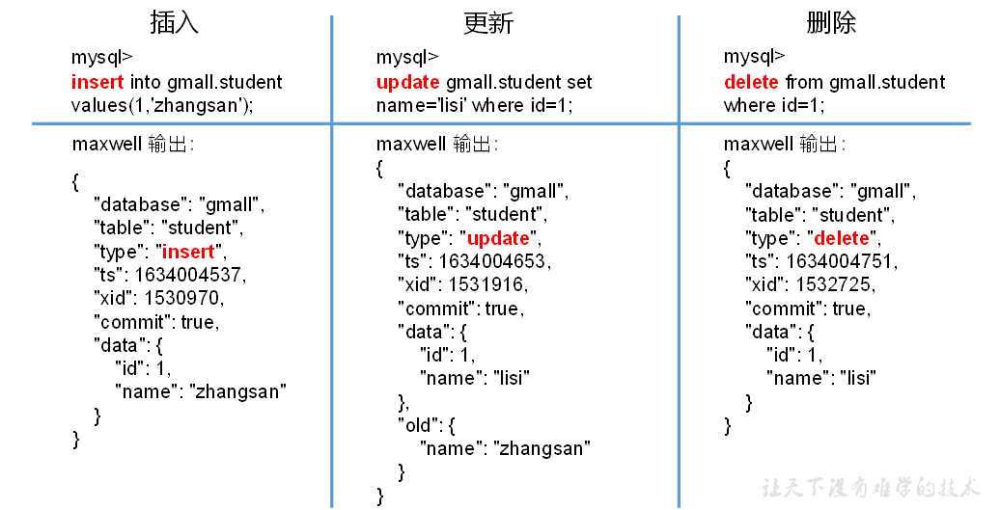
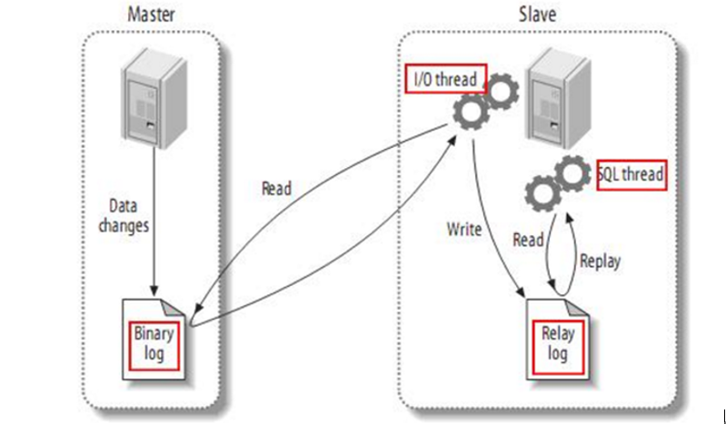

# 一、Maxwell 概述

## 定义


- Maxwell 是由美国 Zendesk 开源，用 Java 编写的 MySQL 实时抓取软件。 实时读取 MySQL 二进制日志 Binlog，==并生成 JSON 格式的消息==，作为生产者发送给 **Kafka，**Kinesis、 RabbitMQ、Redis、Google Cloud Pub/Sub、文件或其它平台的应用程序。


## 输出格式





| 字段     | 解释                                                         |
| -------- | ------------------------------------------------------------ |
| database | 变更数据所属的数据库                                         |
| table    | 表更数据所属的表                                             |
| **type** | 数据变更类型                                                 |
| **ts**   | 数据变更发生的时间                                           |
| xid      | 事务id                                                       |
| commit   | 事务提交标志，可用于重新组装事务                             |
| **data** | 对于insert类型，表示插入的数据；对于update类型，标识修改之后的数据；对于delete类型，表示删除的数据 |
| **old**  | 对于update类型，表示修改之前的数据，只包含变更字段           |

[官网地址](http://maxwells-daemon.io/)

## Mysql主从复制工作原理

**应用场景**

- 做数据库的热备：主数据库服务器故障后，可切换到从数据库继续工作。

- 读写分离：主数据库只负责业务数据的写入操作，

  而多个从数据库只负责业务数据的查询工作

  在读多写少场景下，可以提高数据库工作效率


**工作原理**

- Master 主库将改变记录，写到二进制日志(binary log)中 

- Slave 从库向 mysql master 发送 dump 协议，将 master 主库的 binary log events 拷贝 到它的中继日志(relay log)；
- Slave 从库读取并重做中继日志中的事件，将改变的数据同步到自己的数据库




- Maxwell 的工作原理很简单，==就是把自己伪装成 MySQL 的一个 slave==，然后以 slave 的身份假装从 MySQL(master)复制数据。


- **binlog详解**

  - 记录了所有的 ==DDL 和 DML==(除 了数据查询语句)语句，

    以事件形式记录，还包含语句所执行的消耗的时间，

    MySQL 的二进 制日志是事务安全型的。

  - **作用**：
  
    - 1、master-slave 数据一致的目的  
    - 2、数据恢复

  - **组成**：

    [^文件名后缀为.inde]: 二进制日志索引文件
    [^文件名后缀为.00000*]: 记录数据库所有的 DDL 和 DML
  
  - **三种配置参数**：STATEMENT          MIXED               ROW。
  
    
  
    |           |                             介绍                             |                             优点                             |                             缺点                             |
    | --------- | :----------------------------------------------------------: | :----------------------------------------------------------: | :----------------------------------------------------------: |
    | statement | 基于语句，Binlog会记录所有写操作的SQL语句，包括insert、update、delete等 |                           节省空间                           |                    有可能造成数据不一致。                    |
    | row✔      |           binlog 会记录每次操作后每行记录的变化。            | 保持数据的绝对一致性。因为不管 sql 是什么，引用了什么函数，他只记录 执行后的效果。 |                        占用较大空间。                        |
    | mixed     |              上面两种的杂糅后的优化版但并不完美              |              节省空间，同时兼顾了一定的一致性。              | 还有些极个别情况依旧会造成不一致，另外 statement 和 mixed 对于需要对 binlog 监控的情况都不方便。 |
  
    


## 对比

| 对比         | Canal    | Maxwell               |
| ------------ | -------- | --------------------- |
| 语言         | java     | java                  |
| 数据格式     | 格式自由 | json                  |
| 采集数据模式 | 增量     | 全量/增量             |
| 数据落地     | 定制     | 支持 kafka 等多种平台 |
| HA           | 支持     | 支持                  |


# 二、安装部署


[官方文档](https://maxwells-daemon.io/quickstart/)


## Mysql准备

```sh
#修改binlog配置
Linux: /etc/my.cnf
Windows: \my.ini

👇下面为linux配置
$sudo vim /etc/my.cnf
#注意此处my.cnf有权限问题在修改权限写入配置后请务必改回原来的权限-r--r--r--

#添加如下内容


#数据库id
server-id = 1
#启动binlog，该参数的值会作为binlog的文件名
log-bin=mysql-bin
#binlog类型，maxwell要求为row类型
binlog_format=row
#启用binlog的数据库，需根据实际情况作出修改
binlog-do-db=gmall

👆为需要监控的数据库 如不加   默认监控mysql数据库

#重启mysql
$ sudo systemctl restart mysqld

#进入MySQL查看binlog是否开启
mysql>show variables like 'log_bin';

#进入/var/lib/mysql 目录，查看 MySQL 生成的 binlog 文件
$cd /var/lib/mysql
$sudo ls -l

```


- **Maxwell元数据库的初始化**

```sql
#在MySQL中建立maxwell数据库用于初始化
mysql> CREATE DATABASE maxwell;

#设置 mysql 用户密码安全级别
mysql> set global validate_password_length=4;
mysql> set global validate_password_policy=0;


#创建Maxwell用户并赋予其必要权限
mysql> CREATE USER 'maxwell'@'%' IDENTIFIED BY 'maxwell';
#赋予maxwell下的所有表 所有权限
mysql> GRANT ALL ON maxwell.* TO 'maxwell'@'%';
#分配这个账号可以监控任意库的任意权限
mysql> GRANT SELECT, REPLICATION CLIENT, REPLICATION SLAVE ON *.* TO 'maxwell'@'%';


#刷新 mysql 表权限
mysql> flush privileges;

```


## Maxwell安装启动

- **解压maxwell-1.29.2.tar.gz**

  ```shell
  $ tar -zxvf maxwell-1.29.2.tar.gz -C /opt/module/
  ```


**启动**

- 方式一     命令行参数启动

  ```sh
  $ bin/maxwell --user='maxwell' --password='123456' --host='hadoop102' --producer=stdout
  ```

  | 参数       | 解释                                            |
  | ---------- | ----------------------------------------------- |
  | --user     | 连接 mysql 的用户                               |
  | --password | 连接 mysql 的用户的密码                         |
  | --host     | mysql 安装的主机名                              |
  | --producer | 生产者模式(stdout：控制台    kafka：kafka 集群) |


- 方式二   配置文件启动

  ```sh
  #拷贝
  $cp config.properties.example config.properties
  
  #修改
  $ vim config.properties
  
  #启动
  $ bin/maxwell --config ./config.properties
  ```


## 配置文件编写

- 修改配置文件名称

  ```sh
  $ cd /opt/module/maxwell
  $cp config.properties.example config.properties
  ```

- 修改配置文件

  ```sh
  $ vim config.properties
  
  #Maxwell数据发送目的地，可选配置有stdout|file|kafka|kinesis|pubsub|sqs|rabbitmq|redis
  producer=kafka
  #目标Kafka集群地址
  kafka.bootstrap.servers=hadoop102:9092,hadoop103:9092,hadoop104:9092
  #目标Kafka topic，可静态配置，例如:maxwell，也可动态配置，例如：%{database}_%{table}
  kafka_topic=maxwell
  
  #MySQL相关配置
  host=hadoop102
  user=maxwell
  password=maxwell
  jdbc_options=useSSL=false&serverTimezone=Asia/Shanghai
  ```

  


# 三、Maxwell使用

> 目的地为Kafka集群，则需要先确保Kafka集群为启动状态。

## 启动kafka集群

- ```sh
  zk.sh start
  kf.sh start
  ```


## Maxwell启停

**命令行**

- 启动

  ```sh
  $ /opt/module/maxwell/bin/maxwell --config /opt/module/maxwell/config.properties --daemon
  																					👆后台启动
  ```

- 停止

  ```sh
  $ ps -ef | grep maxwell | grep -v grep | grep maxwell | awk '{print $2}' | xargs kill -9
  ```

  

**启停脚本**

```sh
$ vim mxw.sh
```

```sh
#!/bin/bash

MAXWELL_HOME=/opt/module/maxwell

status_maxwell(){
    result=`ps -ef | grep maxwell | grep -v grep | wc -l`
    return $result
}


start_maxwell(){
    status_maxwell
    if [[ $? -lt 1 ]]; then
        echo "启动Maxwell"
        $MAXWELL_HOME/bin/maxwell --config $MAXWELL_HOME/config.properties --daemon
    else
        echo "Maxwell正在运行"
    fi
}


stop_maxwell(){
    status_maxwell
    if [[ $? -gt 0 ]]; then
        echo "停止Maxwell"
        ps -ef | grep maxwell | grep -v grep | awk '{print $2}' | xargs kill -9
    else
        echo "Maxwell未在运行"
    fi
}


case $1 in
    start )
        start_maxwell
    ;;
    stop )
        stop_maxwell
    ;;
    restart )
       stop_maxwell
       start_maxwell
    ;;
esac

```


## 增量数据同步

- 创建topic[^注意：此topic需要与配置文件名字相同]

  ```sh
  $bin/kafka-topics.sh --bootstrap-server E-com102:9092  --create --topic  maxwell --partitions 3
  ```

- 启动Kafka消费者

  ```sh
  $ bin/kafka-console-consumer.sh --bootstrap-server hadoop102:9092 --topic maxwell
  ```

- 启动Maxwell

  ```sh
  mxw.sh start
  ```

- 模拟生成数据

  ```sh
  db_log]$ java -jar gmall2020-mock-db-2021-01-22.jar
  ```

- 在消费者控制台观察数据生成


## 历史数据全量同步

> 🚩注意：第一条type为bootstrap-start和最后一条type为bootstrap-complete的数据
>
> 是bootstrap开始和结束的标志，不包含数据，中间的type为bootstrap-insert的数据才包含数据。
>
> 🚩注意：一次bootstrap输出的所有记录的ts都相同，为bootstrap开始的时间

- 使用命令同步数据

  ```sh
  $ /opt/module/maxwell/bin/maxwell-bootstrap --database gmall --table user_info --config /opt/module/maxwell/config.properties
  ```

- 数据格式

  ```json
  {
      "database": "fooDB",
      "table": "barTable",
      "type": "bootstrap-start",
      "ts": 1450557744,
      "data": {}
  }
  {
      "database": "fooDB",
      "table": "barTable",
      "type": "bootstrap-insert",
      "ts": 1450557744,
      "data": {
          "txt": "hello"
      }
  }
  {
      "database": "fooDB",
      "table": "barTable",
      "type": "bootstrap-insert",
      "ts": 1450557744,
      "data": {
          "txt": "bootstrap!"
      }
  }
  {
      "database": "fooDB",
      "table": "barTable",
      "type": "bootstrap-complete",
      "ts": 1450557744,
      "data": {}
  }
  
  ```

  


