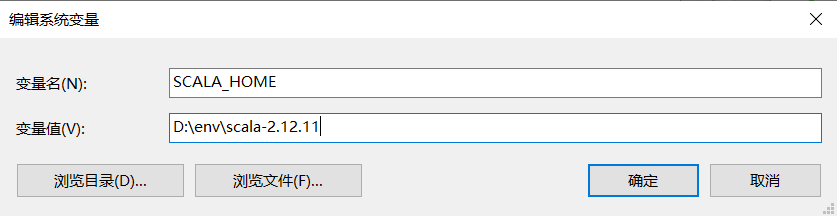
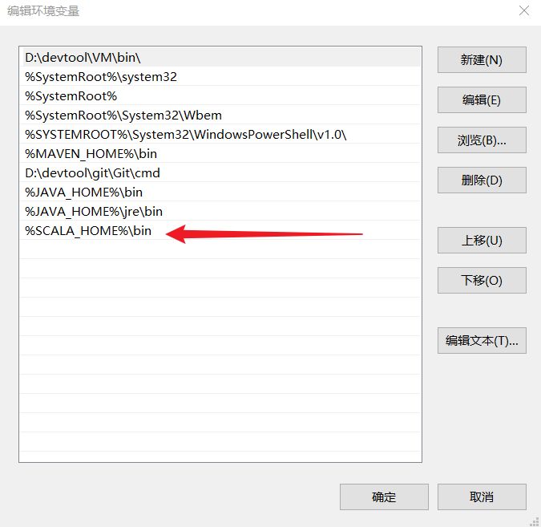
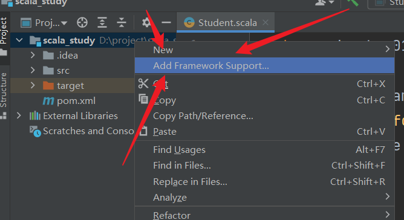
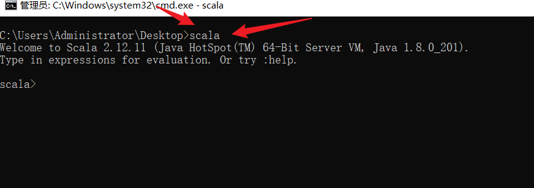
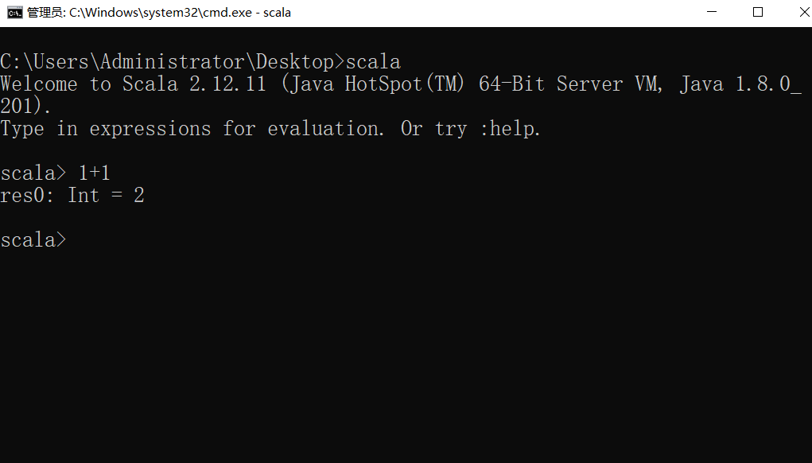

# 一、Scala简介

###  概念

Scala 全称为 Scalable Language，即“可伸缩的语言”，之所以这样命名，是因为它的设计目标是希望伴随着用户的需求一起成长。Scala 是一门综合了**面向对象**和**函数式编程概念**的**静态类型**的编程语言，它运行在标准的 Java 平台上，可以与所有的 Java 类库无缝协作。


###  特点

####  Scala是面向对象的

Scala 是一种面向对象的语言，每个值都是对象，每个方法都是调用。举例来说，如果你执行 `1+2`，则对于 Scala 而言，实际是在调用 Int 类里定义的名为 `+` 的方法。

####  Scala是函数式的

Scala 不只是一门纯的面对对象的语言，它也是功能完整的函数式编程语言。函数式编程以两大核心理念为指导：

+ 函数是一等公民；
+ 程序中的操作应该将输入值映射成输出值，而不是当场修改数据。即方法不应该有副作用。


###  Scala的优点

#### 与Java的兼容

Scala 可以与 Java 无缝对接，其在执行时会被编译成 JVM 字节码，这使得其性能与 Java 相当。Scala 可以直接调用 Java 中的方法、访问 Java 中的字段、继承 Java 类、实现 Java 接口。Scala 重度复用并包装了原生的 Java 类型，并支持隐式转换。

####  精简的语法

Scala 的程序通常比较简洁，相比 Java 而言，代码行数会大大减少，这使得程序员对代码的阅读和理解更快，缺陷也更少。

####  高级语言的特性

Scala 具有高级语言的特定，对代码进行了高级别的抽象，能够让你更好地控制程序的复杂度，保证开发的效率。

#### 静态类型

Scala 拥有非常先进的静态类型系统，Scala 不仅拥有与 Java 类似的允许嵌套类的类型系统，还支持使用泛型对类型进行参数化，用交集（intersection）来组合类型，以及使用抽象类型来进行隐藏类型的细节。通过这些特性，可以更快地设计出安全易用的程序和接口。


### 历史

​		Scala编程语言是由联邦理工学院洛桑（EPFL）的Martin Odersky于2001年基于Funnel的工作开始设计并开发的。由于Martin Odersky之前的工作是**开发通用Java和Javac**[^Sun公司的Java编译器]，所以基于Java平台的Scala语言于2003年底/2004年初发布。


# 二、配置


## Windows10环境安装

> 安装JDK1.8    安装scala-2.12.11

==注意：解压目录要求无中文无空格==

- 配置环境变量

  

  


## IDEA开发环境

> 前提条件：Scala 2.12.x 需要 JDK 1.8+。提前创建好Scala的maven项目


打开提前创建好的项目	👉Ctrl+Alt+S    👉   Plugins	👉	Marketplace	👉	搜索Scala	👉	安装后重启


- 对着项目右键👉	点击AddFrameworkSupport

  

- 选择Scale  添加Scala的SDK 重启IDEA


# 三、命令行操作

**打开DOC  输入scala  可查看版本并进入**




### 简单操作




#四、 伴生类和伴生对象所属类

## 前言

- scala是纯面向对象的语言，C是纯面向过程的语言，Java就是面向过程+面向对象的语言。
- 在说到伴生对象之前，要先说到java的`static`关键字，static关键字修饰的变量、方法可以使类对象共享，而非某个对象单独拥有，所以是通过`类名.变量名/方法名`去调用。而这违背了scala面向对象的初衷，因为这没有通过对象去调用。


## 运行原理

- **Java运行原理**
  - 先编译，再解释
  - .java源文件--->编译器(javac)--->.class字节码文件--->JVM(java 不同平台)--->机器指令

- **Scala运行原理**
  - 先编译，再解释
  - .scala源文件--->编译器(scalac)--->.class字节码文件--->JVM(scala 不同平台)--->机器指令


## 代码体现

- 创建文件`Scala01_HelloWorld.scala`

  ```scala
  object Scala01_HelloWorld {
   
    def main(args: Array[String]): Unit = {
    
      println("HelloScala")
      
    }
    
  }
  ```

  

  - 编译后生成了**两个.class文件**

    `Scala01_HelloWorld.class`		`Scala01_HelloWorld$.class`


- 反编译查看		`Scala01_HelloWorld.class`    **伴生类**

  ```scala
  package com.sun.scala.chapter01;
   
  import scala.reflect.ScalaSignature;
   
  @ScalaSignature(bytes="\006\001):Q!\001\002\t\002-\t\021cU2bY\006\004\024g\030%fY2|wk\034:e\025\t\031A!A\005dQ\006\004H/\032:1c)\021QAB\001\006g\016\fG.\031\006\003\017!\t1a];o\025\005I\021aA2p[\016\001\001C\001\007\016\033\005\021a!\002\b\003\021\003y!!E*dC2\f\007'M0IK2dwnV8sIN\021Q\002\005\t\003#Mi\021A\005\006\002\013%\021AC\005\002\007\003:L(+\0324\t\013YiA\021A\f\002\rqJg.\033;?)\005Y\001\"B\r\016\t\003Q\022\001B7bS:$\"a\007\020\021\005Ea\022BA\017\023\005\021)f.\033;\t\013}A\002\031\001\021\002\t\005\024xm\035\t\004#\005\032\023B\001\022\023\005\025\t%O]1z!\t!sE\004\002\022K%\021aEE\001\007!J,G-\0324\n\005!J#AB*ue&twM\003\002'%\001")
  public final class Scala01_HelloWord
  {
   
    public static void main(String[] paramArrayOfString)
    {
      Scala01_HelloWord..MODULE$.main(paramArrayOfString);
    }
    
  }
  ```

  

- 查看            `Scala01_HelloWorld$.class `        **伴生对象的所属类**

  ```scala
  package com.sun.scala.chapter01;
   
  import scala.Predef.;
   
  public final class Scala01_HelloWord$
  {
    public static final  MODULE$;
   
    static
    {
      	new ();
    }
   
    public void main(String[] args)
    {
      	Predef..MODULE$.println("hello,scala");
    }
    
    private Scala01_HelloWord$() 
    { 
    		MODULE$ = this; 
    }
   
  }
  ```

  


## Think🧐

 

- **object 名称**
  - 从语法角度讲，上面语法表示声明了一个**伴生对象**
  - Scala是**纯面向对象**的，去除了java中的static关键字，通过伴生对象模拟static的效果(`类名.变量名/方法名`)


- **伴生对象**
  - 伴随着某个类产生的一个对象
  - 当我们对源文件进行编译之后，默认会生成两个字节码文件，一个是伴生类，另一个是伴生对象所属类
  - 真正的伴生对象是伴生对象所属类中创建的`单例对象`
    如果不想默认生成伴生类，可以手动生成，要求伴生类名称和伴生对象名称一致
  - 所以在scala程序中，如果要想实现static效果，那么我们应该使用object关键字将属性以及方法定义在伴生对象类中

