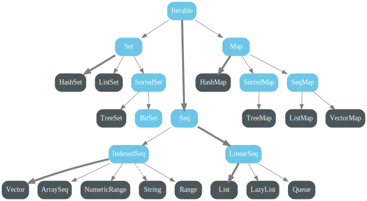

# 一、简介

> Scala的集合有三大类：序列Seq、集Set、映射Map，所有的集合都扩展自Iterable特质。对于几乎所有的集合类，Scala都同时提供了可变和不可变的版本。

- **不可变集合**
  - `scala.collection.immutable`
  - Scala 不可变集合，就是指该集合对象不可修改，每次修改就会==返回一个新对象==，而 不会对原对象进行修改。类似于 java 中的 String 对象
- **可变集合**
  - `scala.collection.mutable`
  - 可变集合，就是这个集合可以直接对原对象进行修改，而==不会返回新的对象==。类似 于 java 中 StringBuilder 对象


==在操作集合的时候，不可变用符号，可变用方法==


- **继承图**

  - **不可变集合**

    

    | 区别       |                                                              |
    | ---------- | ------------------------------------------------------------ |
    | IndexedSeq | 是通过索引来查找和定位，因此速度快，比如 String 就是一个索引集合，通过索引即可定位 |
    | LinearSeq  | 是线型的，即有头尾的概念，这种数据结构一般是通过遍历来查找   |

  

  - **可变集合**

    


# 二、数组


## 不可变数组

- **语法**

  ​											👇数据类型	

  `val arr1 = new Array[Int](10)`

  ​													  👆数据长度 确定后不在改变


```scala
package chapter07

//                 不可变数组

object Test01_ImmutableArray {
  def main(args: Array[String]): Unit = {
    // 1 创建数组
    val arr:Array[Int]=new Array[Int](6)
    // 另一种创建方式
    val arr2=Array(20,63,914,33,66,14)


    // 2 访问元素
    println(arr(0))
    println(arr(4))
    println(arr(5))

    // 注意不要越界

    arr(0)=12
    arr(3)=15
    println(arr(0))
    println(arr(3))
println("==============================")

    //3 数组的遍历
    //  1)  普通循环
    for (i <- 0 until  arr.length ) {
      println(arr(i))
    }

println("===============================")
    for (i<- arr.indices)println(arr(i))


println("===============================")
    // 2) 直接遍历所有元素 增强for循环
    for (elem <- arr2) println(elem)


    // 3) 迭代器
    val iter= arr2.iterator
    while (iter.hasNext)println(iter.next())

println("========================")
    // 4) 调用foreach 方法
    arr2.foreach((elem:Int)=>println(elem))
    arr.foreach(println)


    println(arr2.mkString("--"))


println("=========================")
    // 5) 添加元素
    val newArr =arr2.:+(78)
    println(arr2.mkString("--"))
    println(newArr.mkString("--"))

    val newArr2=newArr.+:(39)
    println(newArr2.mkString("--"))

    val newArr3=newArr2 :+ 16
//    val newArr4=newArr3 +: 66   error
//    Scala特性 : 用空格代替点的话 参数在左 对象在右
    val newArr4 =15 +: 66 +: newArr3 :+ 66 :+39 // 冒号朝对象
    println(newArr4.mkString(", "))


  }
}

```


## 可变数组

- **语法**

  ​													👇 Any 表示任意数据

  `val arr01 = ArrayBuffer[Any](3, 2, 5)`

​																		👆初始化元素


==ArrayBuffer 需要引入 scala.collection.mutable.ArrayBuffer==

```scala
package chapter07

import scala.collection.mutable.ArrayBuffer

object Test02_ArrayBuffer {
  def main(args: Array[String]): Unit = {
   // 1 创建可变数组
    val arr1 :ArrayBuffer[Int] =new ArrayBuffer[Int]()
    val arr2 =ArrayBuffer(36,99,38)

    println(arr1.mkString(", "))
    println(arr2)

    // 2 访问元素
//    println(arr1(0))   error数组越界
    println(arr2(1))

    // 3 添加元素
    arr1 :+ 18   // 没用   是对不可变集合使用
    val newArr1 = arr1 :+ 18
    println(newArr1)
    println(arr1==newArr1)

println("=============================")

    val newArr2= arr1 += 16
    println(arr1)
    println(newArr2)
    println(arr1==newArr2)
    newArr2 += 19   //  newArr2 改变 arr1也改变
    println(arr1)


    77 +=: arr1
    println(arr1)
    println(newArr2)

    arr1.append(92)
    arr1.prepend(55,16,95)
    arr1.insert(1,55,36,96)
    println(arr1)

    // 追加数组
    arr1.insertAll(2,newArr1)
    arr1.appendAll(newArr2)
    arr1.prependAll(newArr2)


    // 4 删除元素
    arr1.remove(3)
    println(arr1)

    arr1.remove(0,10)
    println(arr1)

    // 删除元素19
    arr1 -= 19
    println(arr1)
  }
}

```


## 相互转换

> 简介

- **arr1.toBuffer**
  - 不可变数组转可变数组
  - 返回结果才是一个不可变数组，arr2 本身没有变化
- **arr1.toBuffer**
  - 可变数组转不可变数组
  - 返回结果才是一个可变数组，arr1 本身没有变化


```scala
import scala.collection.mutable
import scala.collection.mutable.ArrayBuffer
object ScalaCollection{
    def main(args: Array[String]): Unit = {
        val buffer = ArrayBuffer(1,2,3,4)
        val array = Array(4,5,6,7)

        // 将不可变数组转换为可变数组
        val buffer1: mutable.Buffer[Int] = array.toBuffer
        // 将可变数组转换为不可变数组
        val array1: Array[Int] = buffer.toArray
    }
}
```


## 多维数组

- **语法**

  ```scala
  											   👇 指定为二维数组
  val array : Array[Array[Int]]= Array.ofDim[Int](2, 3)
  												   👆每一维度有三个元素		
  ```


```scala
package chapter07

object Test03_MulArray {
  def main(args: Array[String]): Unit = {
    // 1 创建二维数组
    val array : Array[Array[Int]]= Array.ofDim[Int](2, 3)

    // 2 访问元素
    array(0)(2)=12
    array(1)(0)=15

    println(array.mkString(", "))


    for (i <- 0 until array.length; j<- 0 until array(i).length){
      println(array(i)(j))
    }


    for (i <- array.indices; j<- array(i).indices){
      print(array(i)(j) + "\t")
      if (j==array(i).length-1)  println()
    }

    array.foreach(line => line.foreach(println))
    // 简化
    array.foreach(_.foreach(println))

  }
}

```


# 三、列表


## 不可变List

```scala
package chapter07

object Test04_List {
  def main(args: Array[String]): Unit = {
    // 1 创建一个List
    val list1 =List(12,36,75)
    println(list1)

    //2  访问和遍历元素
    println(list1(2))

    list1.foreach(println)

    //3 添加元素
    val list2 = 10 +: list1
    val list3 = list1 :+ 16
    println(list1)
    println(list2)
    println(list3)

    println("===================")


    //把62 加在前面
    val list4 = list2.::(62)
    println(list4)

    // Nil 用于创建新列表 直观便于理解
    val list5 =Nil.::(11)
    println(list5)

    val list6 =66::32 :: Nil
    val list7 =32 :: 25 ::99 ::15 ::22 ::Nil
    println(list7)


    // 4 合并列表

    // 不完全合并
    val list8 = list6 :: list7
    println(list8)

    // 完全合并  又称扁平化
    val list9 = list6 ::: list7
    println(list9)

    val list10 = list6 ++ list7
    println(list10)


  }
}

```


[^扁平化]:将一个整体拆成一个一个的个体


## 可变Listbuffer

```scala
package chapter07

import scala.collection.mutable.ListBuffer

object Test05_ListBuffer {
  def main(args: Array[String]): Unit = {
//    1 创建可变列表
    val list1:ListBuffer[Int] = new ListBuffer[Int]()
    val list2 =ListBuffer(15,36,93)

    println(list1)
    println(list2)

println("========================")

    // 2 添加元素
    list1.append(15,36)
    list2.prepend(62)
    println(list1)
    println(list2)


    list1 += 25 += 17
    11 +=: 88 +=: 69  +=: list1

    // 合体
//    11 +=: 88 +=: 69  +=: list1 += 25 += 17
    println(list1)


    // 3 合并 List
    val list3 =list1 ++ list2
    println(list1)
    println(list2)

    println("===================")

    // list1后面追加list2   list2 不变
    list1 ++= list2
    println(list1)
    println(list2)

    println("=================")

    //4  修改元素
    list2(3) = 78
//    list2.update(0,66) 底层实现方法
    println(list2)

    //5   删除元素
    list2.remove(2)
    list2 -= 23
    println(list2)

  }

}

```


# 四、Set集合

==注意 ：Scala 使用的是不可变集合，如果你想使用可变集合，需要引用 scala.collection.mutable.Set 包==


## 不可变Set

- Set 默认是不可变集合，数据无序
- 数据不可重复

```scala
package chapter07

object Test06_ImmutableSet {
  def main(args: Array[String]): Unit = {
    // 1 创建 set
    val set1 = Set(15,63,5,9,1,36,11,26,85,15)
    println(set1)  //使用set 进行数据去重

println("==============================")
    // 2 添加元素
    val set2 = set1.+(23)
//  val set2 = set1 + 23
    println(set1)
    println(set2)

    println("==============================")


    // 3 合并set
    val set3 =Set(5,9,1,36)
    val set4 =set2 ++ set3
    println(set2)
    println(set3)
    println(set4)

println("===================================")
    // 4 删除元素
    val set5 =set3- 1
    println(set3)
    println(set5)

  }
}

```


## 可变mutable.Set

```scala
package chapter07

import scala.collection.mutable

object Test07_MutableSet {
  def main(args: Array[String]): Unit = {
    // 1 创建Set
    val set1 :mutable.Set[Int] = mutable.Set(12, 36, 85, 2, 1, 44, 66, 91, 32, 14)
    println(set1)

println("============================")
    // 2 添加元素
   val set2 =set1 + 11
    println(set1)
    println(set2)

    set1 += 45
    println(set1)


    val flag1 = set1.add(16)
    println(flag1)
    println(set1)

    val flag2 = set1.add(16)
    println(flag2)
    println(set2)

println("===============================")

    // 3 删除元素
    set2 -= 15
    println(set2)

    val flag3 = set1.remove(16)
    println(flag3)
    println(set2)


    val flag4 = set1.remove(16)
    println(flag4)
    println(set2)

println("=======================")
    // 4  合并两个set
    val set3 =mutable.Set(25, 8, 3, 64, 62)
    println(set1)
    println(set3)

println("=============================")

    val set4 = set1 ++ set3
    println(set1)
    println(set3)
    println(set4)

    set1 ++= set3
    println(set1)
    println(set3)


  }
}

```


# 五、Map集合

==Scala 中的 Map 和 Java 类似，也是一个散列表，它存储的内容也是键值对（key-value） 映射==


## 不可变Map

```scala
package chapter07

object Test08_ImmutableMap {
  def main(args: Array[String]): Unit = {
    // 1 创建 Map
    val  map1 : Map[String,Int]= Map("a" -> 12 ,"b" -> 21 ,"hello" -> 52)
    println(map1)
    println(map1.getClass)

println("==============================")
    // 2 遍历元素
    map1.foreach(println)
    map1.foreach((kv:(String,Int)) => println(kv))

println("==============================")

    //3 取map中所有的key 或者 value
    for (key <- map1.keys){
      println(s"$key-------> ${map1.get(key)}")
    }


println("==============================")

    //4 访问某个元素
    println(map1.get("a").get)
    println(map1.get("c"))
    // 没有c 的value 的话返回  0
    println("c: " + map1.getOrElse("c",0))
  }

}

```


## 可变Map

```scala
package chapter07

import scala.collection.mutable

object Test09_MutableMap {
  def main(args: Array[String]): Unit = {
    //1 创建map
    val  map1 : mutable.Map[String, Int]= mutable.Map("a" -> 12 ,"b" -> 21 ,"hello" -> 52)
    println(map1)
    println(map1.getClass)

    println("===========================")

    //2 添加元素
    map1.put("c",5)
    map1.put("d",5)
    println(map1)

    map1 += (("e",7))
    println(map1)

    println("===========================")

    //3 删除元素
    println(map1("c"))
    map1.remove("c")
    println(map1.getOrElse("c",0))

    map1 -= "d"
    println(map1)

    println("===========================")

    // 4 修改元素
    map1.update("c",9)
    map1.update("e",15)

    map1 += (("e",90))
    println(map1)

    println("===========================")


    // 5 合并两个Map
    val map2 : Map[String,Int]=Map("aaa" -> 15,"b"-> 16 ,"hello"-> 17)
    //map1 ++= map2
    println(map1)
    println(map2)

    println("-----------------------------------")
    val map3: Map[String, Int] = map2 ++ map1  // 后面的map覆盖前面的map
    println(map1)
    println(map2)
    println(map3)

  }

}

```


## 六、元组

[^元组]:将多个无关的数据封装成一个整体

```scala
package chapter07

object Test10_Tuple {
  def main(args: Array[String]): Unit = {
    // 1 创建元组
    val tuple : (String,Int,Char,Boolean)= ("ktj",1,'l',true)
    println(tuple)

    // 2 访问数据
    println(tuple._1)
    println(tuple._2)
    println(tuple._3)
    println(tuple._4)

    // 传入索引   得到值
    println(tuple.productElement(1))
println("----------------------------------------")

    // 3 遍历元组 数据
    for (elem <- tuple.productIterator){
      println(elem)
    }

    // 4 嵌套元组
    val muTuple =(12,36,0.6,"yyy",(56,"sss"),39)
    println(muTuple._5._1)
  }
}

```


# 六、集合常用函数


## 基本属性和常用操作

```scala
package chapter07

object Test11_CommonOp {
  def main(args: Array[String]): Unit = {

    val list = List(25, 16, 3, 9, 15, 36, 14, 22)
    val set = Set(25, 16, 3, 9)


    //    （1）获取集合长度
    println(list)

    //    （2）获取集合大小
    println(set.size)

    //    （3）循环遍历
    for (elem <- list) {
      println(elem)
    }

    set.foreach(println)

    //    （4）迭代器
    for (elem <- list.iterator)  println(elem)


    println("======================")

    //    （5）生成字符串
    println(list)
    println(set)
    println(list.mkString("--"))

    //    （6）是否包含
    println(list.contains(25))
    println(set.contains(23))


  }
}

```


## 衍生集合

```scala
package chapter07

object Test12_DerivedCollection {
  def main(args: Array[String]): Unit = {

    val list1 = List(25, 16, 3, 9, 15, 36, 14, 22,11)
    val list2 = List(25, 16, 3, 9, 99, 62, 58, 12, 66)

    //    （1）获取集合的头
    println(list1.head)

    //    （2）获取集合的尾（不是头的就是尾）
    println(list1.tail) // 得到一个新的list  除了头之外都是尾

    //    （3）集合最后一个数据
    println(list2.last)

    //    （4）集合初始数据（不包含最后一个）
    println(list2.init)

    //    （5）反转
    println(list1.reverse)

    //    （6）取前（后）n 个元素
    println(list1.take(3))
    println(list1.takeRight(4))

    //    （7）去掉前（后）n 个元素
    println(list1.drop(3))
    println(list1.dropRight(3))

println("----------------------------------")
    //    （8）并集
    val union =list1.union(list2)
    println("union" + union)
    println(list1 ::: list2 )

          // set 做并集会去重
    val set1 = Set(25, 16, 3, 9)
    val set2 = Set(9, 99, 62, 58)

    val union2 =set1.union(set2)
    println("union" + union2)
    println(set1 ++ set2)

    //    （9）交集
    val intersection =list1.intersect(list2)
    println("intersection" + intersection)

    //    （10）差集
        // 某个集合独有的
    val diff1 =list1.diff(list2)
    val diff2 =list2.diff(list1)

    println("diff1 " +diff1)
    println("diff2 " +diff2)

    //    （11）拉链
    //    真形象
    println("zip1 " +list1.zip(list2))
    println("zip2 " +list2.zip(list1))

println("====================================")
    //    （12）滑窗
    //    绝了 窗口大小为3

    for (elem <- list1.sliding(3)){
      println(elem)
    }
println("============================")

    for (elem <- list1.sliding(4,2)){
      println(elem)
    }

    // 窗口大小和滑动距离相同  保证没有重复数据  又叫滚动窗口

    for (elem <- list1.sliding(4,4)){
      println(elem)
    }

  }
}

```


## 简单函数

```scala
package chapter07

object Test13_SimpleFunction {
  def main(args: Array[String]): Unit = {
    val list = List(5, 3, 6, 9, 23, -5, 13)
    val list2 = List(("a",4),("b",9),("c",8),("d",1)
      ,("e",7),("f",0))

    //    （1）求和
    var sum = 0
    for (elem <- list) {
      sum += elem
    }
    println(sum)
    println(list.sum)
    println("========================")

    //    （2）求乘积
    println(list.product)
    println("========================")

    //    （3）最大值

    println(list.max)
    println(list2.max)
    println(list2.maxBy((tuple : (String,Int)) => tuple._2 ))
    println(list2.maxBy( _._2 ))   // 绝   和上面相同

    println("========================")

    //    （4）最小值
    println(list.min)
    println(list2.minBy( _._2 ))

    println("========================")

    // （5）排序
       // sorted  从小到大
    val sortedList = list.sorted
    println(sortedList)

    // 从大到小
    println(sortedList.sorted.reverse)

    // 传入隐式参数  相当于把排序规则传入
    println(list.sorted(Ordering[Int].reverse))

    println(list2.sorted)


    //  sortBy  传入函数 对list2指定排序的meta元素
    println(list2.sortBy(_._2))   // 默认从小到大
    println(list2.sortBy(_._2)(Ordering[Int].reverse))


     //  sortWith  指定排序规则函数
    println(list.sortWith((a:Int , b:Int) =>{a<b} ))

    // 对上面简化
    println(list.sortWith( _ < _ ))
    println(list.sortWith( _ > _ ))


  }
}
```


## 高级函数

### Map

------


```scala
package chapter07

object Test14_HighLevelFunction_Map {
  def main(args: Array[String]): Unit = {
    val list=List(1,2,3,4,5,6,7,8,9)

      // 1 过滤
    // 选取偶数
    val evenList = list.filter((elem :Int) => elem % 2 ==0 )
    println(evenList)

    // 选取奇数
    println(list.filter(_ % 2 == 1))

println("==================================")
    // 2 map
    // 把集合中每个数乘2
    println(list.map( _ * 2))
     // 找不到特定函数则写表达式    平方操作
    println(list.map( x => x*x))

    //3 扁平化
    val  nestedList =List(List(1,2,3),List(4,5,6),List(7,8,9))

    val flatList =nestedList(0) ::: nestedList(1) ::: nestedList(2)
    println(flatList)

    val flatList2 =nestedList.flatten
    println(flatList2)

    // 4 扁平映射
    // 将一组字符串进行分词   并保存成单词列表
    val strings = List("hello ryan","hello jack","hello rose","we get")
    val splitList :List[Array[String]]= strings.map(_.split(" "))  // 分词
    val flattenList = splitList.flatten  //  打散后的扁平化 其实就是聚和 别当术语大师

    println(flattenList)


    //  其实就是打散后的再聚合  老头就是喜欢装 服s
    val flatmapList = strings.flatMap(_.split(" "))

    println("==========================")


    // 5 分组 groupBy
    //  分成奇数偶数 两组
    val groupMap = list.groupBy( _ % 2 )
    val groupMap2: Map[String, List[Int]] = list.groupBy(data => {
      if (data % 2 == 0) "偶数" else "奇数"
    })

    println(groupMap)
    println(groupMap2)

    // 给定一组词汇  按照单词的首字母进行分组
    val wordList = List("china", "america" ,"alice","jack","bob","ryan")
    println(wordList.groupBy(_.charAt(0)))  // 666

  }

}
```

### Reduce

------

```scala
package chapter07

object Test15_HighLevelFunction_Reduce {
  def main(args: Array[String]): Unit = {
    val list =List(1,2,3,4)


    //1 reduce
    println(list.reduce(_ + _))
    println(list.reduceLeft(_ + _))
    println(list.reduceRight(_ + _))

println("======================================")

    val list2 =List(3,4,5,8,10)
    println(list2.reduce(_ - _))  // -24
    println(list2.reduceLeft(_ - _))
    println(list2.reduceRight(_ - _))  // 3 - ( 4 - (5 - (8 - 10)))

println("======================================")

    // 2 fold
    println(list.fold(10)(_+_))  // 10 + 1 + 2 + 3 + 4
    println(list.fold(10)(_-_))  // 10 - 1 - 2 - 3 - 4

    // 3 - (4 -( 5 - ( 8 - ( 10 - 11 )))  执行顺序最里面的先开始
    println(list2.foldRight(11)(_ - _))


  }

}
```


### mergedMap

------

```scala
package chapter07

import scala.collection.mutable

object Test16_MergeMap {
  def main(args: Array[String]): Unit = {
    val map1 =Map("a" -> 1,"b"-> 3 ,"c"->6 )
    val map2 =mutable.Map("a" -> 6,"b"-> 2 ,"c"->9 ,"d"->3)

//    println(map1 ++ map2)


    /*
     fold 和 foldLeft的区别
        fold      的括号一和括号二的类型必须相同
        foldLeft  的括号一和括号二的类型不同
     */
    val map3 = map1.foldLeft(map2)(

      //mergedMap就是map2，kv是map1的元素，把map1的每个元素融合到mergeMap中

      (mergedMap,kv) => {
        val key =kv._1
        val value  =kv._2
        mergedMap(key)  =  mergedMap.getOrElse(key,0) + value
        mergedMap
      }
    )

    println(map3)

  }

}

```


## 普通WordCount案例

```scala
package chapter07

object Test17_CommonWordCount {
  def main(args: Array[String]): Unit = {
    val  stringList :List[String] = List(
      "hello",
      "hello world",
      "hello scala",
      "hello spark from scala",
      "hello flink from scala"
    )

    //1 对字符串进行切分 得到一个打散所有单词的列表
//    val wordList1 :List[Array[String]] =stringList.map(_.split(" "))
//    val wordList2 :List[String]=wordList1.flatten
//    println(wordList2)

    // 对上面简化
    val wordList =stringList.flatMap(_.split(" "))
    println(wordList)


    // 2 对相同的单词分组
    val groupMap = wordList.groupBy(word => word)  // 无法改为下划线 会产生语法错误
    println(groupMap)    // 返回一个map 每一个词为key value为词的出现次数


    //  3 对分组之后的 list 取长度 得到每个单词的大小
    val countMap = groupMap.map(kv => (kv._1, kv._2.length))


    // 4 将map转换为List 并 排序去前三

    val  sortList :List[(String,Int)] = countMap.toList
      .sortWith(_._2 > _._2).take(3)

    println(sortList)


  }

}

```


## 复杂WordCount案例

------

```scala
package chapter07

object Test18_ComplexWordCount {
  def main(args: Array[String]): Unit = {
    val  tupleList :List[(String,Int)] = List(
      ("hello",1),
      ("hello world",2),
      ("hello scala",3),
      ("hello spark from scala",1),
      ("hello flink from scala",2)
    )

    //思路1    展开为普通版本
    val  newStringList :List[String] = tupleList.map(
      kv => {
        // trim 用于去除单词后的空格 后面加空格防止连接在一起
        (kv._1.trim+ " ") * kv._2
      }
    )
    println(newStringList)

    // 接下来做正常的wordcount操作
    val  wordCountList :List[(String,Int)] =newStringList
      .flatMap(_.split(" "))                     //空格分词                 List[String]
      .groupBy( word => word)                           //按照单词分组              Map[String ,List[String]]
      .map( kv => (kv._1 ,kv._2.length))                //统计出每个单词的个数       Map [String ,Int]
      .toList                                           //转换为List               List[(String ,Int)]
      .sortBy(_._2)(Ordering[Int].reverse)              //排序                     List[(String ,Int)]
      .take(3)

   println(wordCountList)

    println("================================")
    //思路2  直接基于予统计的结果进行转换
          // 2.1 将字符串打散为单词 并结合为对应的个数包装成二元组
    val preCountList :List[(String,Int)] =tupleList
      .flatMap(
        tuple => {
          val strings :Array[String] = tuple._1.split(" ")
          strings.map( word => (word ,tuple._2))
        }
      )
    println(preCountList)

    // 2.2 对二元组按照单词进行分组
    val preCountMap:Map[String , List[(String,Int)]] = preCountList.groupBy(_._1)
    println(preCountMap)


    //2.3 叠加每个单词予统计的个数值
    val countMap: Map[String,Int] =preCountMap.mapValues(
      tupleList => tupleList.map(_._2).sum
    )

    println(countMap)

    //2.4 转换成List 排序取前三
    val  countList = countMap.toList
      .sortWith(_._2 > _._2)
      .take(3)

    println(countList)


   🌹 // 实现复杂  但是效率高 🌹


  }

}
```


# 七、队列

==先进先出==

```scala
package chapter07

import scala.collection.immutable.Queue
import scala.collection.mutable

object Test19_Queue {
  def main(args: Array[String]): Unit = {
    // 创建一个可变队列
    val queue =new mutable.Queue[String]()

    queue.enqueue("a","b","c")
    println(queue)
    println(queue.dequeue())
    println(queue)
    println(queue.dequeue())
    println(queue)

    queue.enqueue("d","e")
    println(queue)
    println(queue.dequeue())
    println(queue)

    println("=============================")
    // 不可变队列
    val queue2 =Queue("a","b","c")
    //    queue2.enqueue("d")   不起作用
    val queue3: Queue[String] = queue2.enqueue("d")
    println(queue2)
    println(queue3)

  }
}
```


[^进队方法]:enqueue
[^出队方法]:dequeue


# 八、并行集合

> Scala 为了充分使用多核 CPU，提供了并行集合（有别于前面的串行集合），用于多核 环境的并行计算

```scala
package chapter07

import scala.collection.immutable
import scala.collection.parallel.immutable.ParSeq

object Test20_Parallel {
  def main(args: Array[String]): Unit = {
    val result: immutable.IndexedSeq[Long] = (1 to 100).map(
      x => Thread.currentThread.getId
    )

    println(result)

    val result2: ParSeq[Long] = (1 to 100).par.map(
      x => Thread.currentThread.getId
    )

    println(result2)
  }
}
```


