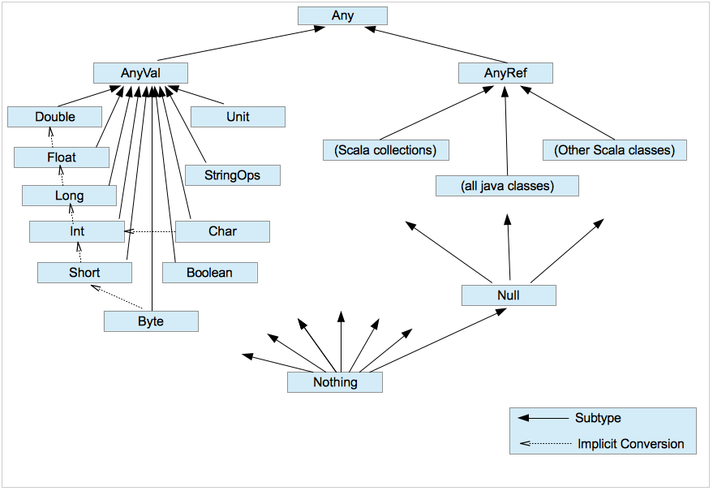

# 一、变量


```scala
package chapter02

import chapter01.Student

object Test02_Variable {
  def main(args: Array[String]): Unit = {

    //声明一个变量的通用语法
    var a: Int = 10

    //1 声明变量时  类型可以修改  编译器自动推导
    var a1 = 19
    val b1 = 90

    //2 类型确定后 就不能修改  说明Scala为强数据类型语言
    var a2 = 78

    //3 变量声明时 必须要有初始值
    //var a3 :Int  ×

    //4  声明或定义一个变量时 var修饰的变量可改变  val修饰的变量不可改变
    a1 = 12
    //b1=12    错误


    var master = new Student("master", 55)
    master = new Student("Master", 55)
    //此处如果要修改age属性 则应把class Student中的age加上var属性
    master.age = 32

    master.printerInfo()

  }
}

```


# 二、标识符


```scala
package chapter02

object Test03_Identifier {
  def main(args: Array[String]): Unit = {

    //1 以字母下划线开头  后接字母数字下划线

    val abc = 10
    //var h-b = "dasd"  ×
    //val 123abc = 122  ×

    //2 以操作符开头  且只包含操作符( + - * / # ! 等)

    val -+/ = "weq"
    println(-+/)

    //3 用反引号`  ` 包含任意字符串  包括Scale 39个关键子
    val `if` = "dasd"
    println(`if`)


  }

}

```


# 三、字符串

```scala
package chapter02

object Test04_String {
  def main(args: Array[String]): Unit = {

    //1  字符串通过  +  连接
    val name = "Jack"
    val age = 19
    println(age + "岁的" + name + "在加里敦学习")

    //1.1 通过*将一个值复制多次
    println(name * 3)


    //2  通过%传值
    printf("%d岁的%s在加里敦学习", age, name)


    //3 字符串模板  通过$ 获取变量  s模板  f模板  raw模板
    println(s"${age}岁的${name}在加里敦学习")

    val num: Double = 2.1231
    println(f"The Number is ${num}%2.2f") //格式化模板字符串
    println(raw"The Number is ${num}%2.2f") //原始输出

    //三引号表示字符串  ，保持多行字符串的原始输出
   val sql = s"""
       |select *
       |from
       |  student
       |where
       |  name =${name}
       |and
       |  age = ${age}
       |""".stripMargin
println(sql)
  }
}

```


# 四、输入输出


- **输出**

  ```scala
  package chapter02
  
  import scala.io.StdIn
  
  object Test05_StdIn {
    def main(args: Array[String]): Unit = {
      //出入信息
      println("请输入你的大名： ")
      val name: String= StdIn.readLine()
      println("请输入你的年龄： ")
      val age : Int = StdIn.readInt()
  
      //打印台  打印输出
      println(s"欢迎${age}岁的${name}来到加里敦学习")
  
    }
  }
  ```

  

- **输出**

  ```scala
  package chapter02
  
  import java.io.{File, PrintWriter}
  import scala.io.Source
  
  object Test06_FileIO {
    def main(args: Array[String]): Unit = {
      //1 从文件中读取数据
      Source.fromFile("src/main/resources/test.txt").foreach(print)
  
      //2 将数据写入文件
      val writer =new PrintWriter(new File("src/main/resources/out.txt"))
      writer.write("Hello boys and grils ")
      writer.close()
    }
  }
  
  ```

  


# 五、数据类型


## Overview




| 数据类型 | 描述                                                         |
| -------- | ------------------------------------------------------------ |
| Byte     | 8 位有符号补码整数。数值区间为 -128 到 127                   |
| Short    | 16 位有符号补码整数。数值区间为 -32768 到 32767              |
| Int      | 32 位有符号补码整数。数值区间为 -2147483648 到 2147483647    |
| Long     | 64 位有符号补码整数。数值区间为 -9223372036854775808 到 9223372036854775807 |
| Float    | 32 位, IEEE 754 标准的单精度浮点数                           |
| Double   | 64 位 IEEE 754 标准的双精度浮点数                            |
| Char     | 16 位无符号 Unicode 字符, 区间值为 U+0000 到 U+FFFF          |
| String   | 字符序列                                                     |
| Boolean  | true 或 false                                                |
| Unit     | 表示无值，等同于 Java 中的 void。用作不返回任何结果的方法的结果类型。Unit 只有一个实例值，写成 ()。 |
| Null     | null 或空引用                                                |
| Nothing  | Nothing 类型在 Scala 的类层级的最低端；它是任何其他类型的子类型。 |
| Any      | Any 是所有其他类的超类                                       |
| AnyRef   | AnyRef 类是 Scala 里所有引用类 (reference class) 的基类      |


## 整数类型

==Byte     Short     Int    Long==


```scala
  //1 整数类型
    val a1: Byte = 127
    val a2: Byte = -128
    //    val  a3 :Byte = -128          ×

    val a3 = 12 //整数默认Int
    val a4: Long = 12L //长整数


    val b1:Byte = 10
    val b2: Byte = (10+20) //自动转换 运行不会报错
    println(b2)

    val b3: Byte = (b1+20).toByte //强制转换
```


## 浮点类型

==Float  Double==

```scala
//2 浮点数
    val c1: Float = 1.22341f //单精度 直接写的话默认是Double
    val c2: Double = 1.22341 //双精度
```


## 字符类型

==Char==

```scala
  //3 字符类型
    val d1: Char = 'a'
    println(d1)

    val d2: Char = '9'
    println(d2)


    val d3: Char = '\t' // Tab
    val d4: Char = '\n' // 回车
    println("acv"+d3+"dsad")
    println("acv"+d4+"dsad")

    //4 转义字符
    val c5 = '\\' //转义字符\
    val c6 = '\'' //表示单引号
    println("acv"+c5+"dsad")
    println("acv"+c6+"dsad")


    // 字符变量最底层保存的是ASCII码
    val i1 :Int = d1
    println("i1: "+i1)
    val i2 :Int = d2
    println("i2: "+i2)
```


## 布尔类型

==Boolean==

```scala
    // 5 布尔类型
    val e1: Boolean = true
    val e2: Boolean = false
```


## 空类型

```scala
   val a : Unit =m1()
    println("a1 : "+ a)

    // 空引用Null
    // val a1: Int = null  //error
    var zhangsan = new Student("zhangsan", 20)
    zhangsan=null
    println(zhangsan)

    // Nothing类型
        def m2(n:Int) :Int = {
          if(n==10)
            throw  new NullPointerException
          else
              return n

        }

        val b =m2(1)
        println(b)
```


## 类型转换

```scala
package chapter02

object Test08_DataTypeConversion {
  def main(args: Array[String]): Unit = {

    🌴//1  自动类型转化（隐式转换）
    val a: Int = 10
    val b: Long = 12312
    val result: Long = a + b
    val result2: Int = a + b.toInt //强转

    // 把精度大的数据类型转换成精度小的数据类型 会报错
    val a2 : Byte = 1
    val b2 : Int = a2
            //    val c2 : Byte = a2  //error

    // (byte,short) 和 char 类型之间不会自动转换
    val a3 : Byte = 10
    val b3 : Char = 'a'
            //    val c3 : Byte = b3  //error
    val c3 : Int = b3
    println(c3)

    // byte , short , char 类型之间可以计算 但计算时转换为 int 类型
    val a4 : Byte = 10
    val b4 : Short = 10
    val c4 : Char = 'a'
    val result4 : Int = a4 + b4
    val result44 : Int = a4 + b4 + c4
    println(result44)


    //2  强制类型转换
        // 高精度转低精度  直接取整不会四舍五入
    val n1 : Int = -2.5.toInt
    println(n1)

        // 在做加法时 用小括号括起来提高精度
    val n2 : Int = 2.6.toInt+3.9.toInt
    val n3 : Int = (2.6+3.9).toInt
    println(n2)


    // String 类型转换

    // 数字转换为字符串
    val n : Int = 10
    val s : String = n.toString
    println(s)

    // 字符串转换为数字
    val s1 : String = "123"
    val s2 : Float = "123.45".toFloat
    val s3 : Int = "123.45".toFloat.toInt
    println()

  }

}

```


