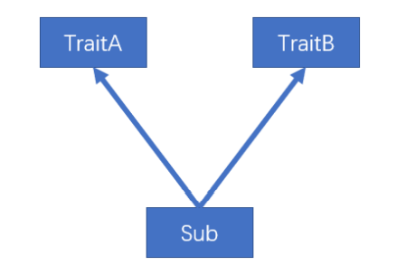
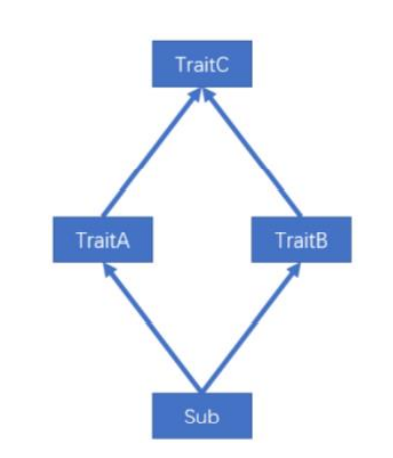
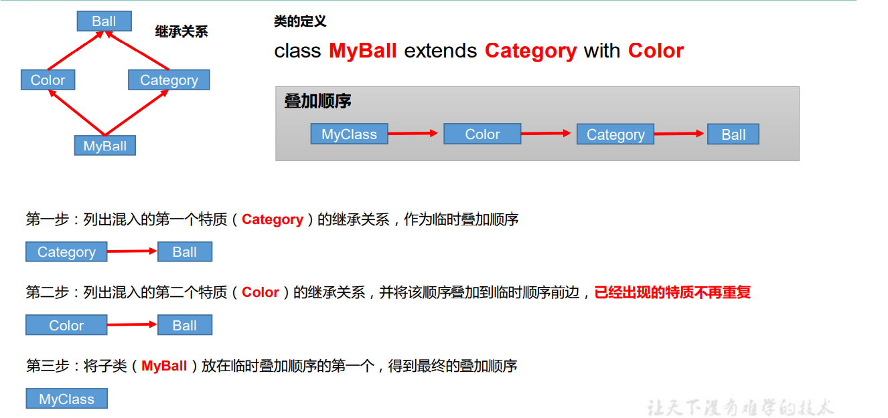

# 一、基础面向对象

> Scala 的面向对象思想和 Java 的面向对象思想和概念是一致的。


## 包

### Overview

- 基础语法

  ```
  package 包名
  ```

- 三大作用（和 Java 一样）

  - 区分相同名字的类 
  - 当类很多时，可以很好的管理类 
  - 控制访问范围

- 命名规则

  只能包含数字、字母、下划线、小圆点.，但不能用数字开头，也不要使用关键字

  

- ==命名规范==

  ```
  com.公司名.项目名.业务模块名
  ```

  


### 包语句

------

> 通过嵌套的风格表示层级关系

```scala
package com{
	package atguigu{
		package scala{
		}
	}
}
```


- 特点
  - 一个源文件中可以声明多个 package
  - 子包中的类可以直接访问父包中的内容，而无需导包


```scala
package ccc{
  package ddd{
    object Test02_PackageObject{
      def main(args: Array[String]): Unit = {
        // 要想访问该对象 则该对象必须在同一包层级下面
        // 就是包和对象在同一层级
        println(school)
      }
    }
  }

}


//定义一个对象
package object ccc{
  val  school:String ="Ryan"
}
```


### 包对象

------

> 在 Scala 中可以为每个包定义一个同名的包对象，定义在包对象中的成员，作为其对 应包下所有 class 和 object 的共享变量，可以被直接访问。

```scala
package object chapter06 {
// 定义当前包共享的属性和方法
  val commonValue ="哈哈哈"
  def commonMethod():Unit={
    println(s"我在${commonValue}")
  }

}
```

```scala
package chapter06{
  object Test02_PackageObject {
    def main(args: Array[String]): Unit = {
      commonMethod()
      println(commonValue)
    }
  }
}

```


[^嵌套方式管理包]:包对象可与包定义在同一文件中，但是要保证包对象 与包声明在同一作用域中。


```scala
package object chapter06 {
// 定义当前包共享的属性和方法
  val commonValue ="哈哈哈"
  def commonMethod():Unit={
    println(s"我在${commonValue}")
  }

}

package chapter06{
  object Test02_PackageObject {
    def main(args: Array[String]): Unit = {
      commonMethod()
      println(commonValue)
    }
  }
}
```


### 导包

------


| 操作               | 说明                                                 |
| ------------------ | ---------------------------------------------------- |
| 普通 导入          | import                                               |
| 局部导入           | 什么时候使用，什么时候导入。在其作用范围内都可以使用 |
| 通配符导入         | import java.util._                                   |
| 给类起名           | import java.util.{ArrayList=>JL}                     |
| 导入相同包的多个类 | import java.util.{HashSet, ArrayList}                |
| 屏蔽类             | import java.util.{ArrayList =>_,_}                   |
| 导入包的绝对路径   | new _root_.java.util.HashMap                         |

> 案例实操

| 说明                                  |                                                            |
| ------------------------------------- | ---------------------------------------------------------- |
| import com.atguigu.Fruit              | 引入 com.atguigu 包下 Fruit（class 和 object）             |
| import com.atguigu._                  | 引入 com.atguigu 下的所有成员                              |
| import com.atguigu.Fruit._            | 引入 Fruit(object)的所有成员                               |
| import com.atguigu.{Fruit,Vegetable}  | 引入 com.atguigu 下的 Fruit 和 Vegetable                   |
| import com.atguigu.{Fruit=>Shuiguo}   | 引入 com.atguigu 包下的 Fruit 并更名为 Shuiguo             |
| import com.atguigu.{Fruit=>Shuiguo,_} | 引入 com.atguigu 包下的所有成员，并将 Fruit 更名为 Shuiguo |
| import com.atguigu.{Fruit=>_,_}       | 引入 com.atguigu 包下屏蔽 Fruit 类                         |
| new _root_.java.util.HashMap          | 引入的 Java 的绝对路径                                     |


==Scala 中的三个默认导入分别是==

`import java.lang._`

`import scala._`

`import scala.Predef._`


## 类和对象

| 说明     |                      |
| -------- | -------------------- |
| **类**   | **可以看成一个模板** |
| **对象** | **表示具体的事物**   |


### 定义类

------

==Scala 中没有 public，一个.scala 中可以写多个类。==

- 基础语法
  - Scala 语法中，类并不声明为 public，所有这些类都具有公有可见性（即默认就是 public）
  - 一个 Scala 源文件可以包含多个类


```scala
class Student{
  // 定义属性
  private val name :String="Ryan"
  @BeanProperty   //一个注解直接包含  get 和 set
  var age:Int= _
  var sex:String= _   //  使用下划线 前面定义为var类型表示可变
}
```


### 封装

> 封装就是把抽象出的数据和对数据的操作封装在一起，数据被保护在内部，程序的其它 部分只有通过被授权的操作（成员方法），才能对数据进行操作。Java 封装操作如下，

- JAVA
  - 将属性进行私有化 
  - 提供一个公共的 set 方法，用于对属性赋值 
  - 提供一个公共的 get 方法，用于获取属性的值


- **Scala**
  - 定义好属性直接用注解@BeanProperty实现


### 方法

------

- **基础语法**

  ```scala
  def 方法名(参数列表) [：返回值类型] = { 
  		方法体
  }
  ```

  

### 创建对象

------

```scala
val | var 对象名 [：类型] = new 类型()
```

- ==注意==
  - val 修饰对象，不能改变对象的引用（即：内存地址），可以改变对象属性的值。 
  - var 修饰对象，可以修改对象的引用和修改对象的属性值 
  - 自动推导变量类型不能多态，所以多态需要显示声明


### 构造器

------

> 和 Java 一样，Scala 构造对象也需要调用构造方法，并且可以有任意多个构造方法。 Scala 类的构造器包括：主构造器和辅助构造器


```scala
package chapter06

object Test05_Constructor {
  def main(args: Array[String]): Unit = {

    val student1=new Student1
    student1.Student1()

    val student2=new Student1("Jack")
    val student3=new Student1("Ryan",26)


  }

}


// 定义一个类
class Student1() {
  // 定义属性
  var idCard: String = _
  var name: String = _
  var age: Int = _

  println("1  主构造方法被调用")

  // 声明 辅助构造方法
  def this(name:String){
    this()  //  直接调用主构造器
    println("2 辅助构造器方法")
    this.name=name
    println(s"name : $name age: $age")

  }

  def this(name:String,age:Int){
    this(name)
    println("3 辅助构造方法被调用")
    this.age=age
    println(s"name : $name age: $age")
  }


  def Student1():Unit={
    println("一般方法被调用")
  }


}
```


### 构造器参数

------

> Scala 类的主构造器函数的形参包括三种类型：未用任何修饰、var 修饰、val 修饰

- ==注意==
  - 未用任何修饰符修饰，这个参数就是一个局部变量 
  - var 修饰参数，作为类的成员属性使用，可以修改 
  - val 修饰参数，作为类只读属性使用，不能修改


```scala
package chapter06

object Test06_ConstructorParams {

  def main(args: Array[String]): Unit = {

    val student2 = new Student2
    student2.name="kafka"
    student2.age=18
    println(s"student2 name =${student2.name}, age = ${student2.age}")

    val student3=new Student3("Jop",96)
    println(s"student3 name =${student3.name}, age = ${student3.age}")

    val student4=new Student4("Jop",96)
//    println(s"student4 name =${student4.name}, age = ${student4.age}")
    student4.printInfo()


    //Student5的值定义过后无法修改
    val student5=new Student5("Jeep",56)
    println(s"student5 name =${student5.name}, age = ${student5.age}")


    // 既可以调用属性  也可以调用方法
    val student6=new Student6("Jop",96)
    println(s"student4 name =${student6.name}, age = ${student6.age}")
    student6.printInfo()
  }
}


//定义类
//无参构造
class Student2{
  //单独定义属性
  var name :String= _
  var age:Int= _
}


// 上面定义等价于   推荐使用
class Student3(var name :String ,var age:Int)


// 主构造器参数无修饰
class Student4(name: String, age: Int){
  def printInfo(): Unit ={
    println(s"student4 name=$name ,age =$age")
  }
}

//// 非常不推荐使用
//class Student44(_name: String, _age: Int){
//  var name :String= _name
//  var age:Int= _age
//}

class Student5(val name:String,val age:Int)


class Student6(var name :String ,var age:Int){
  var school :String =_


  def this(name:String,age:Int,school:String){
    this(name ,age)
    this.school=school
  }


  def printInfo(): Unit ={
    println(s"student6 :name = $name  ,age = $age  ,school =$school")
  }
}
```


## 访问权限


在 Java 中，访问权限分为：**public，private，protected** 和默认。在 Scala 中，你可以通 过类似的修饰符达到同样的效果。但是使用上有区别。 

- Scala 中属性和方法的==默认访问权限为 public==，但 Scala 中无 public 关键字。 
- private 为私有权限，只在类的内部和伴生对象中可用。 
- protected 为受保护权限，Scala 中受保护权限比 Java 中更严格，同类、子类可以 访问，同包无法访问。 
- private[包名]增加包访问权限，包名下的其他类也可以使用


```scala
package chapter06

object Test04_ClassForAccess {

}


//  定义父类
class Person{
  private var idCard:String="12364455846"
  protected var name:String="Ryan"
  var sex :String="female"
  private [chapter06] var age:Int=16
  def printInfo():Unit={
    println(s"Person: $idCard $name $sex")
  }
}
```


# 二、高阶面向对象


## 封装

> 封装就是把抽象出的数据和对数据的操作封装在一起，数据被保护在内部，程序的其它 部分只有通过被授权的操作（成员方法），才能对数据进行操作。Java 封装操作如下，

- JAVA
  - 将属性进行私有化 
  - 提供一个公共的 set 方法，用于对属性赋值 
  - 提供一个公共的 get 方法，用于获取属性的值


- **Scala**
  - 定义好属性直接用注解@BeanProperty实现


## 继承和多态

### 继承

- 基本语法

  ```scala
  class 子类名 extends 父类名 { 类体 }
  
  //子类继承父类的属性和方法
  //scala 单继承
  ```

- 执行时的调用顺序

  ```scala
  package chapter06
  
  object Test07_Inherit {
    def main(args: Array[String]): Unit = {
      val student1 = new Student7("Alex", 89)
      val student2 = new Student7("Mom", 65, "std002")
  
      student1.printInfo()
      student2.printInfo()
  
      val teacher = new Teacher
      teacher.printInfo()
  
      def personInfo(person: Person7):Unit={
        person.printInfo()
      }
  
    }
  }
  
  // 定义一个父类
  class Person7() {
    var name: String = _
    var age: Int = _
  
    println("1 父类的主构造器")
  
  
    def this(name: String, age: Int) {
      this()
      println("2 父类的 辅助构造器被调用")
      this.name = name
      this.age = age
    }
  
  
    def printInfo(): Unit = {
      println(s" Person $name  $age")
    }
  
  }
  
  // 定义子类
  class Student7(name: String, age: Int) extends Person7(name, age) {
  
    var stdNo: String = _
    println("3 子类主构造器被调用")
  
    def this(name: String, age: Int, stdNo: String) {
      this(name, age)
      println("4  子类的辅助构造器调用")
      this.stdNo = stdNo
    }
  
    override def printInfo(): Unit = {
      println(s" Student $name  $age  $stdNo")
  
    }
  }
  
  
  /*
  
  继承时父类无参
  new 时
  父类主无参 子类主无参   在无参调用子时 父主 <- 子主
  父类主无参 子类主有参   在有参调用子时 父主 <- 子主  <-子辅
  
  
  继承时父类有参
  new 时
  父类主无参 子类主无参   在无参调用子时 父主 <- 父辅 <- 子主
  父类主无参 子类主有参   在有参调用子时 父主 <- 父辅 <- 子主  <-子辅
  
   */
  
  
  
  class Teacher extends Person7{
  
    override def printInfo(): Unit = {
      println(s"Teacher")
    }
  
  }
  ```


### 多态

- 动态绑定

  ==Scala 中属性和方法都是动态绑定，而 Java 中只有方法为动态绑定。==

  

- 代码实现

  **Scala**

  ```scala
  package chapter06
  
  object Test08_DynamicBind {
    def main(args: Array[String]): Unit = {
      val student :Person8= new Student8
      println(student.name)
      student.hello()
    }
  }
  
  class Person8{
    val name:String ="person"
    def hello():Unit={
      println("hello person")
    }
  
  }
  
  class Student8 extends Person8{
    override val name: String = "student"  //本来继承自父类 这样表示重写更直观
    override def hello(): Unit = {
      println("hello student")
    }
  }
  
  /*
  
  Java 中属性是静态绑定的 方法是动态绑定的
  Scala 中属性和方法都是动态绑定的
  
   */
  
  
  ```

- **JAVA**

  ```java
  public class TestDynamicBind {
      public static void main(String[] args) {
          Worker worker = new Worker();
          System.out.println(worker.name);
          worker.hello();
          worker.hi();
          System.out.println("========================");
          // 多态
          Person person = new Worker();
          System.out.println(person.name);  //  属性是静态绑定属性
          person.hello();             //   动态绑定方法
  //      person.hi()   error
  
      }
  }
  
  class Person{
      String name ="person";
      public void hello(){
          System.out.println("hello person");
      }
  }
  class Worker extends Person{
      String name ="worker";
      @Override
      public void hello() {
          System.out.println("hello worker");
      }
      public void hi() {
          System.out.println("hi worker");
      }
  
  }
  ```


## 抽象类

- 基本语法
  - 定义抽象类：abstract class Person{} //通过 abstract 关键字标记抽象类 
  - 定义抽象属性：val|var name:String //一个属性没有初始化，就是抽象属性 
  - 定义抽象方法：def hello():String //只声明而没有实现的方法，就是抽象方法


- 继承&重写
  - 如果父类为抽象类，那么子类需要将抽象的属性和方法实现，否则子类也需声明 为抽象类 
  - 重写非抽象方法需要用 override 修饰，重写抽象方法则可以不加 override。 
  - 子类中调用父类的方法使用 super 关键字 
  - 子类对抽象属性进行实现，父类抽象属性可以用 var 修饰； 子类对非抽象属性重写，父类非抽象属性只支持 val 类型，而不支持 var。


==因为 var 修饰的为可变变量，子类继承之后就可以直接使用，没有必要重写==


```scala
package chapter06

object Test09_AbstractClass {
  def main(args: Array[String]): Unit = {

    val student = new Student9
    student.eat()
    student.sleep()
  }

}

//定义抽象类
abstract class Person9{
  // 非抽象属性
  var name:String ="person"

  // 抽象属性
  var age :Int

  // 非抽象方法
  def eat() :Unit={
    println("person eat")
  }

  // 抽象方法
  def sleep():Unit
}

// 定义具体的实现子类
class  Student9 extends Person9{

  var age :Int=18
  def sleep(): Unit = {
    println("student sleep")
  }

  // 重写非抽象属性和方法
//  override val name: String = "student"      error
  name= "Marray"
override def eat(): Unit = {
    super.eat()  //  此处会调用父类方法
    println("student eat")
  }

}

```


### 匿名子类

------

> 和 Java 一样，可以通过包含带有定义或重写的代码块的方式创建一个匿名的子类。

```scala
package chapter06

object Test10_AnnoymousClass {
  def main(args: Array[String]): Unit = {
  									👇			
    val person:Person10 =new Person10 {
      override var name: String = "Alex"
      override def eat(): Unit =println(" person eat")
    }
      
      
    println(person.name)
    person.eat()
  }

}

// 定义抽象类
abstract class Person10{
  var name :String
  def eat():Unit
}

```


## 单例对象（伴生对象）

- 简介

   Scala语言是完全面向对象的语言，所以并没有静态的操作（即在Scala中没有静态的概念）。但是为了能够和Java语言交互（因为Java中有静态概念），就产生了一种特殊的对象来模拟类对象，该对象为单例对象。若单例对象名与类名一致，则称该单例对象这个类的伴生对象，这个类的所有“静态”内容都可以放置在它的伴生对象中声明，然后通过伴生对象名称直接调用

- ==注意==

  - 单例对象采用 **object** 关键字声明 
  - 单例对象对应的类称之为**伴生类，伴生对象的名称应该和伴生类名一致。** 
  - 单例对象中的属性和方法都可以通过**伴生对象名（类名）直接调用访问**。


```scala
package chapter06

object Test11_Object {
  def main(args: Array[String]): Unit = {

//    val student = new Student11("Marray", 19)
//    student.printInfo()  构造方法私有化 则无法直接创建

    val  student= Student11.newStudent("Jack",15)
    student.printInfo()

    // Scala 特性 : 伴生对象中如果定义apply方法则在创建方法时
    // 可以省略 apply 方法名直接 加括号传参
    val  student2= Student11.apply("KOL",18)
    student2.printInfo()

    // 实际底层调用的还是apply方法
    val  student3= Student11("Oppo",18)

  }
}


// 定义类
class  Student11 private (val name :String ,val age:Int){
  def printInfo(): Unit ={
    println(s"student6 :name = $name  ,age = $age  ,school =${Student11.school}")
  }
}

// 由于学校属性所有学生相同  则可以定义在伴生对象里面
object Student11{
  val school :String ="Ryan"

  // 定义一个类的对象实例的创建方法
  def newStudent(name :String,age:Int):Student11=new Student11(name,age)

  def apply(name :String,age:Int):Student11=new Student11(name,age)


}

//  伴生对象可以直接访问伴生类的所有属性   因为相伴相生🌹


```


==注意：也可以创建其它类型对象，并不一定是伴生类对象==


> Scala 单例模式的实现

```scala
package chapter06

object Test12_Singleton {
  def main(args: Array[String]): Unit = {

    val student1 = Student12.getInstance()
    student1.printInfo()

    val student2 = Student12.getInstance()
    student2.printInfo()

    println(student1)
    println(student2)
  }
}

class Student12 private(val name: String, val age: Int) {
  def printInfo(): Unit = {
    println(s"student6 :name = $name  ,age = $age  ,school =${Student11.school}")
  }
}

// 饿汉式
//object Student12{
//  private val student:Student12=new Student12("Kpl",99)
//  def getInstance():Student12=student
//}


//懒汉式

object Student12 {
  private var student: Student12 = _
  def getInstance(): Student12 = {
    if (student == null) {
      // 如果没有对象实例的话  就创建一个
      student = new Student12("Lol", 96)
    }
    student
  }
}

```


## 特质（Trait）

### 简介

------

  Scala 语言中，==采用特质 trait（特征）来代替接口的概念==，也就是说，多个类具有相同 的特质（特征）时，就可以将这个特质（特征）独立出来，采用关键字 trait 声明。 Scala 中的==trait 中即可以有抽象属性和方法，也可以有具体的属性和方法，一个类可 以混入（mixin）多个特质。==这种感觉类似于 Java 中的抽象类。 Scala 引入 trait 特征，第一可以替代 Java 的接口，第二个也是对单继承机制的一种

  

### 基础语法

------


[^没有父类]:：class 类名 extends 特质 1 with 特质 2 with 特质 3 …
[^有父类]:class 类名 extends 父类 with 特质 1 with 特质 2 with 特质 3…


  ```scala
  package chapter06
  
  object Test13_Trait {
    def main(args: Array[String]): Unit = {
  
  
      val student:Student13=new Student13
      student.sayHello()
      student.study()
      student.dating()
      student.play()
    }
  }
  
  // 定义父类
  class Person13{
    val name :String ="person"
    var age :Int =15
    def sayHello():Unit={
      println("hello from " +name)
    }
  }
  
  
  // 定义一个特质
  
  trait Young{
  
    // 声明抽象和非抽象属性
    var age :Int
    val name :String="young"
  
    // 声明抽象和非抽象的方法
  
    def play():Unit={
      println(s"young people  ${name} is playing")
    }
  
    def dating():Unit
  
  }
  
  
  class Student13 extends Person13 with Young{
  
    // 重写冲突的属性
    override val name: String = "student"
  
  
    //实现抽象方法
    def dating(): Unit =println(s"student $name is dating")
  
    def study():Unit=println(s"stduent $name is studying")
  
    // 重写父类方法
    override def sayHello(): Unit =
      {
        super.sayHello()
        println(s"Hello from : student $name")
      }
  
  }
  
  ```

  

### 动态混入

------

动态混入：可灵活的扩展类的功能 

- ==动态混入：创建对象时混入 trait，而无需使类混入该 trait==
- ==如果混入的 trait 中有未实现的方法，则需要实现==

```scala
package chapter06

object Test14_TraitMixin {
  def main(args: Array[String]): Unit = {

    val student=new Student14
    student.study()
    student.increase()

    student.play()
    student.increase()


    student.dating()
    student.increase()

    println("===============================")
    // 动态混入
    val studentWithTalent =new Student14 with Talent {
      override def singing(): Unit = println("student is good at singing")

      override def dancing(): Unit = println("student is good at dancing")
    }

    studentWithTalent.sayHello()
    studentWithTalent.play()
    studentWithTalent.study()
    studentWithTalent.dating()
    studentWithTalent.dancing()
    studentWithTalent.singing()

  }
}

// 定义一个特征
trait Konwledge{
  var amount :Int=0
  def increase():Unit
}

trait Talent{
  def singing():Unit
  def dancing():Unit
}

class Student14 extends Person13 with Young with Konwledge {

  // 重写冲突的属性
  override val name: String = "student"


  //实现抽象方法
  def dating(): Unit =println(s"student $name is dating")

  def study():Unit=println(s"stduent $name is studying")

  // 重写父类方法
  override def sayHello(): Unit =
  {
    super.sayHello()
    println(s"Hello from : student $name")
  }

  // 实现特质中的抽象方法
  override def increase(): Unit = {
    amount+=1
    println(s"student $name konwledge increased : $amount")
  }

}
```


### 特质叠加

------

> 由于一个类可以混入（mixin）多个 trait，且 trait 中可以有具体的属性和方法，若混入 的特质中具有相同的方法（方法名，参数列表，返回值均相同），必然会出现继承冲突问题。
>

#### 问题

------


- 问题一     一个类继承两个特质

  

- 问题二   钻石问题

  


**🧐本质是在实现类面对相同的方法和属性时的执行顺序问题**


```scala
package chapter06


// 特质叠加执行顺序 从右到左
object Test15_TraitOverLying {

  def main(args: Array[String]): Unit = {
    val student=new Student15
    student.increase()

    // 钻石问题特征叠加
    val myFootBall = new MyFootBall
    println(myFootBall.describe())
  }
}


// 定义球类特征
trait Ball{
  def describe():String ="ball"
}


// 定义颜色特质
trait ColorBall extends Ball{
  var color :String ="red"
  override def describe(): String = color+ "_" +super.describe()
}

// 定义种类特征
trait CategotyBall extends Ball{
  var category :String ="foot"
  override def describe(): String = category+ "_" +super.describe()
}


class MyFootBall extends CategotyBall with  ColorBall{
                                                      //在钻石问题指定特定的加载类
  override def describe(): String ="my ball is a "+ super[CategotyBall].describe()
}


trait Konwledge15{
  var amount :Int=0
  def increase():Unit={
    println("konwledge increased")
  }
}


trait Talent15{
  def singing():Unit
  def dancing():Unit
  def increase(): Unit={
    println("talent increased")
  }
}


// 执行顺序是从后往前
class Student15 extends Person13 with Talent15 with Konwledge15{
  override def singing(): Unit = println("singing")

  override def dancing(): Unit = println("singing")

  override def increase(): Unit = {
    super.increase()
  }
}
```


#### 执行顺序

------

==从右往左==




[^Super问题]:MyClass 中的 super 指代 Color，Color 中的 super 指代 Category，Category 中的 super 指代 Ball

<!--想要调用某个指定的混入特质中的方法，可以增加约束：super[]-->

```scala
super[Category].describe()
```


### 自身类型

------

> 简单说就是  在接口中定义带参类的化身 便于拿到参数

==自身类型可实现依赖注入的功能。==


```scala
package chapter06

object Test16_TraitSelfType {
  def main(args: Array[String]): Unit = {
    val user =new RegisterUser("KFC","12369874")
    user.insert()
  }
}


// 用户类
class User(val name :String,val password:String){

}

trait UserDao{
  _:User=>
     👆用户类
    
  //  向数据库插入数据
  def insert():Unit={				👇拿到用户类的name
    println(s"insert into db : ${this.name} " )
  }
}

// 定义注册用户类
class RegisterUser(name:String,password:String) extends User(name ,password) with UserDao


```


### 与抽象类的区别

------

1.==优先使用特质==。一个类扩展多个特质是很方便的，但却只能扩展一个抽象类。

2.如果你==需要构造函数参数，使用抽象类==。因为抽象类可以定义带参数的构造函数， 而特质不行（有无参构造）。


# 三、扩展

## 类型的检测和转换

```scala
 //1 类型的检测和转换
    val student :Student17=new Student17("Mol",55)
    student.study()
    student.sayHi()

    val  person:Person17 =new Student17("jack",58)
    person.sayHi()
																																			👇//判断对象是否为某个类型的实例	
    println("student is Student17: "+student.isInstanceOf[Student17])
    println("student is Person17: "+student.isInstanceOf[Person17])
    println("person is Person17: "+person.isInstanceOf[Person17])
    println("person is Student: "+ person.isInstanceOf[Student17])

    val person2:Person17 =new Person17("MC",96)
    println("person2 is Student17 :" + person2.isInstanceOf[Student17])


//2 类型转换
    if(person.isInstanceOf[Student17]){
		        				👇//将对象转换为某个类型的实例
      val newStudent =person.asInstanceOf[Student17]
      newStudent.study()
    }
    println(classOf[Student17])

    println(WorkDay.MONDAY)
```


## 枚举类

需要继承 `Enumeration`


```scala
// 定义枚举类对象
object WorkDay extends Enumeration{
  val MONDAY=Value(1,"Monday")
  val TUESDAY=Value(2,"TuesDay")
}


println(WorkDay.MONDAY)
```


## 应用类

需要继承 `App`

```scala
//定义应用类对象
object TestApp extends App{
  println("app start")
	
    👇自己定义类型名字   
  type MyString =String
  val a:MyString="aaa"
  println(a)
}
```


