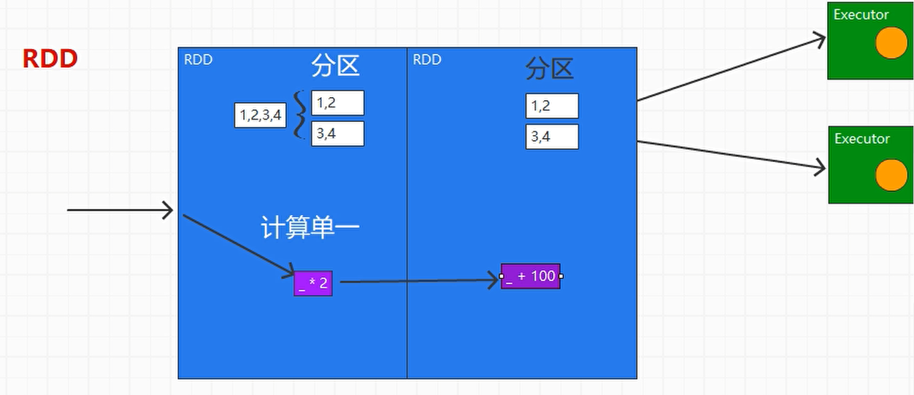
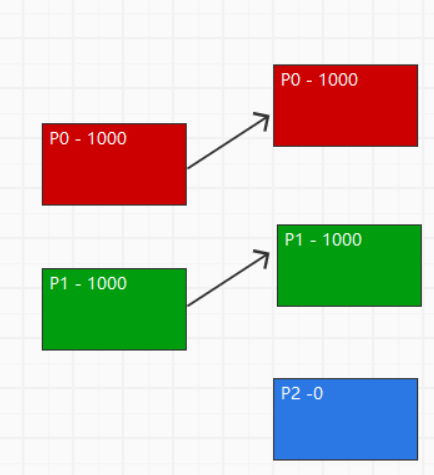
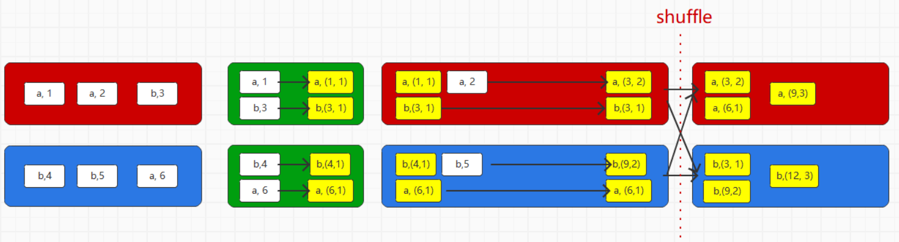
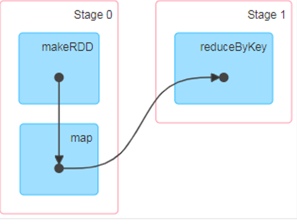
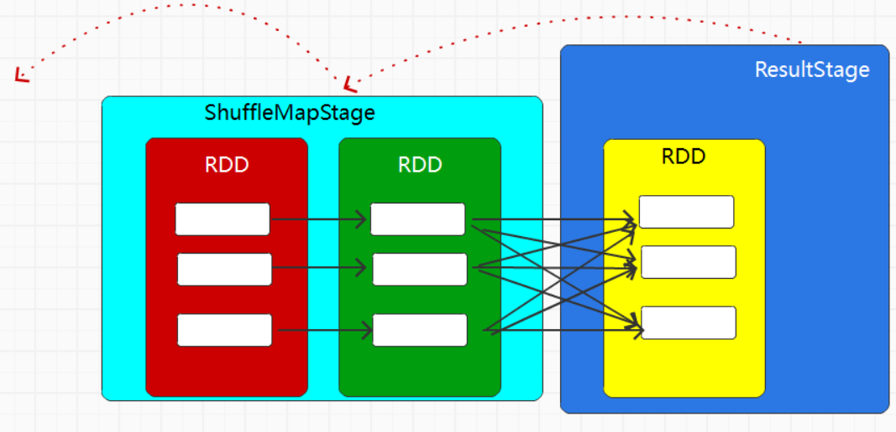

# 一、简介

> Spark是一种基于内存的快速、通用、可扩展的大数据分析计算引擎。

- **历史**

  Spark 于 2009 年诞生于加州大学伯克利分校 AMPLab，2013 年被捐赠给 Apache 软件基金会，2014 年 2 月成为 Apache 的顶级项目。相对于 MapReduce 的批处理计算，Spark 可以带来上百倍的性能提升，因此它成为继 MapReduce 之后，最为广泛使用的分布式计算框架。


- **功能对比**
  - **Hadoop**
    - Java语言编写
    - 处理海量数据时，性能横向扩展非常容易
    - 有基于HDFS的分布式数据库HBase，擅长实时地随机读/写超大规模数据集
  - **Spark**
    - Scala语言开发
    - Spark SQL  可以使用SQL 或者HIve（HQL ）来查询数据
    - Spark Streaming ：==实时数据进行流式计算的组件== 提供了丰富的处理数据流的API


**Spark一直被认为是Hadoop 框架的升级版  主要功能主要是用于数据计算**


[^PS]: 由于被定义为计算框架下面主要与Hadoop 的MR对比


## 特点

**优点**

- 加快了数据分析、挖掘的运行和读写速度，==并将计算单元缩小到更适合并行计算和重复使用的RDD计算模型==
- 擅长数据反复处理  [^主要是因为基于内存比较快]
- 核心技术：弹性分布式数据集（Resilient Distributed Datasets）支持复杂的数据挖掘算法和图形计算算法
- Spark多个作业之间数据通信是基于内存，而Hadoop是基于磁盘 ==解决多个作业之间的数据通信问题==
- Spark Task的启动时间快。Spark采用fork线程的方式，而Hadoop采用创建新的进程的方式
- Spark只有在shuffle的时候将数据写入磁盘
- Spark的缓存机制比HDFS的缓存机制高效


**缺点**

- 实际的生产环境中，由于**内存的限制**[^就是穷]，可能会由于内存资源不够导致Job执行失败
- **穷用Hadoop富用Spark**


**Other**

[^多语言支持]: 支持的有 Java，Scala，Python 和 R
[^DAG 调度程序]: 查询优化器和物理执行引擎，以实现性能上的保证
[^80 多个高级 API]: 轻松地构建应用程序
[^多数据源支持]:支持访问 HDFS，Alluxio，Cassandra，HBase，Hive 以及数百个其他数据源中的数据


## 模块


### Spark Core

------

[^简介]:Spark Core中提供了Spark最基础与最核心的功能，Spark其他的功能如：Spark SQL，Spark Streaming，GraphX, MLlib都是在Spark Core的基础上进行扩展的


###  Spark  SQL

Spark SQL 主要用于结构化数据的处理。其具有以下特点：

- 能够将 SQL 查询与 Spark 程序无缝混合，允许您使用 SQL 或 DataFrame API 对结构化数据进行查询；
- 支持多种数据源，包括 Hive，Avro，Parquet，ORC，JSON 和 JDBC；
- 支持 HiveQL 语法以及用户自定义函数 (UDF)，允许你访问现有的 Hive 仓库；
- 支持标准的 JDBC 和 ODBC 连接；
- 支持优化器，列式存储和代码生成等特性，以提高查询效率。

### Spark Streaming

Spark Streaming 主要用于快速构建可扩展，高吞吐量，高容错的流处理程序。支持从 HDFS，Flume，Kafka，Twitter 和 ZeroMQ 读取数据，并进行处理。


 Spark Streaming 的本质是微批处理，它将数据流进行极小粒度的拆分，拆分为多个批处理，从而达到接近于流处理的效果。


### Spark MLlib

MLlib 是 Spark 的机器学习库。

其设计目标是使得机器学习变得简单且可扩展。

它提供了以下工具：

+ **常见的机器学习算法**：如分类，回归，聚类和协同过滤；
+ **特征化**：特征提取，转换，降维和选择；
+ **管道**：用于构建，评估和调整 ML 管道的工具；
+ **持久性**：保存和加载算法，模型，管道数据；
+ **实用工具**：线性代数，统计，数据处理等。

### Spark Graphx

GraphX 是 Spark 中用于图形计算和图形并行计算的新组件。

在高层次上，GraphX 通过引入一个新的图形抽象来扩展 RDD(一种具有附加到每个顶点和边缘的属性的定向多重图形)。

为了支持图计算，GraphX 提供了一组基本运算符（如： subgraph，joinVertices 和 aggregateMessages）以及优化后的 Pregel API。

此外，GraphX 还包括越来越多的图形算法和构建器，以简化图形分析任务。


# 二、安装部署

## 开发环境

- 创建Maven项目

- 添加Scala插件  [^见Scala文档]

- 添加依赖

  ```xml
  <dependencies>
      <dependency>
          <groupId>org.apache.spark</groupId>
          <artifactId>spark-core_2.12</artifactId>
          <version>3.0.0</version>
      </dependency>
  </dependencies>
  ```

- 配置日志

  ```properties
  #🌴在resources目录中创建log4j.properties文件并以下添加日志配置信息
  
  log4j.rootCategory=ERROR, console
  log4j.appender.console=org.apache.log4j.ConsoleAppender
  log4j.appender.console.target=System.err
  log4j.appender.console.layout=org.apache.log4j.PatternLayout
  log4j.appender.console.layout.ConversionPattern=%d{yy/MM/dd HH:mm:ss} %p %c{1}: %m%n
  
  # Set the default spark-shell log level to ERROR. When running the spark-shell, the
  # log level for this class is used to overwrite the root logger's log level, so that
  # the user can have different defaults for the shell and regular Spark apps.
  log4j.logger.org.apache.spark.repl.Main=ERROR
  
  # Settings to quiet third party logs that are too verbose
  log4j.logger.org.spark_project.jetty=ERROR
  log4j.logger.org.spark_project.jetty.util.component.AbstractLifeCycle=ERROR
  log4j.logger.org.apache.spark.repl.SparkIMain$exprTyper=ERROR
  log4j.logger.org.apache.spark.repl.SparkILoop$SparkILoopInterpreter=ERROR
  log4j.logger.org.apache.parquet=ERROR
  log4j.logger.parquet=ERROR
  
  # SPARK-9183: Settings to avoid annoying messages when looking up nonexistent UDFs in SparkSQL with Hive support
  log4j.logger.org.apache.hadoop.hive.metastore.RetryingHMSHandler=FATAL
  log4j.logger.org.apache.hadoop.hive.ql.exec.FunctionRegistry=ERROR
  
  ```

  

> WordCount案例

```scala
package com.hjc.bigdata.spark.wc

import org.apache.spark.{SparkConf, SparkContext}

object Spark03_WordCount {
  def main(args: Array[String]): Unit = {
    println("Hello Scala")

    // 使用Spark
    // Spark: 计算框架  可用于代替MapReduce

    //1  添加依赖后
    //2获取Spark连接
    val conf = new SparkConf().setMaster("local").setAppName("WordCount")
    val sc = new SparkContext(conf)

    //3编写word count执行程序
          //3.1 读取文件
          val line = sc.textFile("data/word.text")

          //3.2 分词
          // word => (word,1)
          val word = line.flatMap(_.split(" "))
          val wordToOne = word.map((_, 1))

          //reduceByKey : 按照key分组 , 对相同的key和value进行reduce
          // (word,1)(word,1)(word,1)(word,1)(word,1)
          // reduce(1,1,1,1,1)
          // 框架的核心就是封装
          val wordToCount = wordToOne.reduceByKey(_ + _)


      //3.5 将结果打印到控制台上
      wordToCount.collect().foreach(println)

       sc.stop()
  }
}
```


## 集群环境

### Local模式

------


- 上传 `spark-3.0.0-bin-hadoop3.2.tgz` 至 Hadoop102

- **解压**

  ```shell
  tar -zxvf spark-3.0.0-bin-hadoop3.2.tgz -C /opt/module
  cd /opt/module 
  mv spark-3.0.0-bin-hadoop3.2 spark-local
  ```

- **启动并访问Web页面** 

  ```shell
  bin/spark-shell
  http://虚拟机地址:4040
  ```

- **命令行工具**

  ```sh
  sc.textFile("data/word.txt").flatMap(_.split(" ")).map((_,1)).reduceByKey(_+_).collect
  ```

  ==记得提前创建好data下面的word.txt==

  ```sh
  #退出
  :quit
  ```

- **提交应用**

  ```sh
  bin/spark-submit \
  --class org.apache.spark.examples.SparkPi \
  --master local[2] \
  ./examples/jars/spark-examples_2.12-3.0.0.jar \
  10
  ```


**参数解释**

```sh
./bin/spark-submit \
  --class <main-class> \        # 应用程序主入口类
  --master <master-url> \       # 集群的 Master Url
  --deploy-mode <deploy-mode> \ # 部署模式
  --conf <key>=<value> \        # 可选配置       
  ... # other options    
  <application-jar> \           # Jar 包路径 
  [application-arguments]       #传递给主入口类的参数  
```


### Standalone模式

------

- 🔭**集群规划**

  |       | Hadoop102      | Hadoop103 | Hadoop104 |
  | ----- | -------------- | --------- | --------- |
  | Spark | Worker  Master | Worker    | Worker    |


- **解压**

  ```sh
  tar -zxvf spark-3.0.0-bin-hadoop3.2.tgz -C /opt/module
  cd /opt/module 
  mv spark-3.0.0-bin-hadoop3.2 spark-standalone
  ```

- **修改配置文件**

  ```sh
  🥇#进入conf   修改slaves.template文件名为slaves
  mv slaves.template slaves
  
  #添加Worker
  hadoop102
  hadoop103
  hadoop104
  
  🥈#修改spark-env.sh.template文件名为spark-env.sh
  mv spark-env.sh.template spark-env.sh
  
  #修改spark-env.sh文件，添加JAVA_HOME环境变量和集群对应的master节点
  									👇此处一定查看是否为自己的路径
  export JAVA_HOME=/opt/module/jdk1.8.0_144
  SPARK_MASTER_HOST=hadoop102
  SPARK_MASTER_PORT=7077
  
  ```

  [^7077]: 相当于hadoop集群的8020端口


- **分发**

  ```sh
  xsync spark-standalone
  ```

  

**启动查看web页面**

```sh
sbin/start-all.sh
http://hadoop102:8080
```

**提交应用**

```sh
bin/spark-submit \
--class org.apache.spark.examples.SparkPi \
--master spark://linux1:7077 \
./examples/jars/spark-examples_2.12-3.0.0.jar \
10
```


`参数说明`

| 参数                      | 解释                                                         | 可选值举例                                |
| ------------------------- | ------------------------------------------------------------ | ----------------------------------------- |
| --class                   | Spark程序中包含主函数的类                                    |                                           |
| --master                  | Spark程序运行的模式(环境)                                    | 模式：local[*]、spark://linux1:7077、Yarn |
| --executor-memory  1G     | 指定每个executor可用内存为1G                                 |                                           |
| --total-executor-cores  2 | 指定所有executor使用的cpu核数为2个                           |                                           |
| --executor-cores          | 指定每个executor使用的cpu核数                                |                                           |
| application-jar           | 打包好的应用jar，包含依赖。这个URL在集群中全局可见。 比如hdfs:// 共享存储系统，如果是file://  path，那么所有的节点的path都包含同样的jar |                                           |
| application-arguments     | 传给main()方法的参数                                         |                                           |

- **配置历史服务器**

  修改`spark-defaults.conf.template`文件名为`spark-defaults.conf`

  ```sh
  mv spark-defaults.conf.template spark-defaults.conf
  ```

  修改`spark-default.conf`文件，配置日志存储路径

  ```sh
  spark.eventLog.enabled          true
  spark.eventLog.dir               hdfs://hadoop102:8020/directory
  ```

  ==需要启动hadoop集群，HDFS上的directory目录需要提前存在==

  修改`spark-env.sh`文件, 添加日志配置

  ```sh
  export SPARK_HISTORY_OPTS="
  -Dspark.history.ui.port=18080 
  -Dspark.history.fs.logDirectory=hdfs://hadoop102:8020/directory 
  -Dspark.history.retainedApplications=30"
  ```

  | 参数       | 含义                                                         |
  | ---------- | ------------------------------------------------------------ |
  | 18080      | WEB UI访问的端口号                                           |
  | /directory | 历史服务器日志存储路径                                       |
  | 30         | 内存中的应用数，而不是页面上显示的应用数，如果超过这个值，旧的应用程序信息将被删除 |

  

 

[^查看历史服务]: http://hadoop102:18080


**高可用HA**

`集群规划`

|       | Linux1                    | Linux2                    | Linux3            |
| ----- | ------------------------- | ------------------------- | ----------------- |
| Spark | Master  Zookeeper  Worker | Master  Zookeeper  Worker | Zookeeper  Worker |

```sh
#停止集群
sbin/stop-all.sh
#启动Zookeeper
zk start

#修改spark-env.sh文件添加如下配置
注释如下内容：
#SPARK_MASTER_HOST=linux1
#SPARK_MASTER_PORT=7077

添加如下内容:
#Master监控页面默认访问端口为8080，但是可能会和Zookeeper冲突，所以改成8989，也可以自定义，访问UI监控页面时请注意
SPARK_MASTER_WEBUI_PORT=8989

export SPARK_DAEMON_JAVA_OPTS="
-Dspark.deploy.recoveryMode=ZOOKEEPER 
-Dspark.deploy.zookeeper.url=hadoop102,hadoop103,hadoop104 
-Dspark.deploy.zookeeper.dir=/spark"

```


- **分发并启动**

  ```sh
  xsync conf/ 
  sbin/start-all.sh 
  ```

  

- 单独启动hadoop103Master  ， 此时Hadoop103的master处于备用状态

  ```sh
  sbin/start-master.sh 
  ```

-  提交应用到高可用集群

  ```sh
  bin/spark-submit \
  --class org.apache.spark.examples.SparkPi \
  --master spark://hadoop102:7077,hadoop103:7077 \
  ./examples/jars/spark-examples_2.12-3.0.0.jar \
  10
  ```


**Kill掉Hadoop102的master可看到Hadoop103为活动状态**

[^Status]: ALIVE


### Yarn模式

------

> Spark主要是计算框架，而不是资源调度框架 所以可以用Yarn来进行资源调度


- **解压缩改名**

  ```sh
  tar -zxvf spark-3.0.0-bin-hadoop3.2.tgz -C /opt/module
  cd /opt/module 
  mv spark-3.0.0-bin-hadoop3.2 spark-yarn
  ```

- **修改配置文件并分发**

  ```xml
  🌴#修改hadoop配置文件/opt/module/hadoop/etc/hadoop/yarn-site.xml
  
  <!--是否启动一个线程检查每个任务正使用的物理内存量，如果任务超出分配值，则直接将其杀掉，默认是true -->
  <property>
       <name>yarn.nodemanager.pmem-check-enabled</name>
       <value>false</value>
  </property>
  
  <!--是否启动一个线程检查每个任务正使用的虚拟内存量，如果任务超出分配值，则直接将其杀掉，默认是true -->
  <property>
       <name>yarn.nodemanager.vmem-check-enabled</name>
       <value>false</value>
  </property>
  
  ```

- **修改conf/spark-env.sh**

  ```sh
  mv spark-env.sh.template spark-env.sh
  
  export JAVA_HOME=/opt/module/jdk1.8.0_144
  YARN_CONF_DIR=/opt/module/hadoop/etc/hadoop
  ```

- **启动Hadoop  提交应用**

  ```sh
  bin/spark-submit \
  --class org.apache.spark.examples.SparkPi \
  --master yarn \
  --deploy-mode cluster \
  ./examples/jars/spark-examples_2.12-3.0.0.jar \
  10
  ```

- **查看历史**http://hadoop102:8088


> 配置历史服务


- 修改`spark-defaults.conf.template`文件名为`spark-defaults.conf`

- 修改spark-default.conf文件，配置日志存储路径

  ```xml
  spark.eventLog.enabled          true
  spark.eventLog.dir              hdfs://hadoop102:8020/directory
  ```

  ==启动Hadoop集群  HDFS上的目录需要提前存在==

  ```sh
  myhadoop start
  hadoop fs -mkdir /directory
  ```

- 修改`spark-env.sh`文件    添加日志配置

  ```sh
  export SPARK_HISTORY_OPTS="
  -Dspark.history.ui.port=18080 
  -Dspark.history.fs.logDirectory=hdfs://hadoop102:8020/directory 
  -Dspark.history.retainedApplications=30"
  ```

-  修改`spark-defaults.conf`

  ```sh
  spark.yarn.historyServer.address=hadoop102:18080
  spark.history.ui.port=18080
  ```

- 启动历史服务

  ```sh
  sbin/start-history-server.sh 
  ```

-  重新提交应用

  ```sh
  bin/spark-submit \
  --class org.apache.spark.examples.SparkPi \
  --master yarn \
  --deploy-mode client \
  ./examples/jars/spark-examples_2.12-3.0.0.jar \
  10
  ```

  Web 查看日志http://hadoop103:8088    👉   点击log即可跳转至spark的历史服务


### K8S & Mesos模式

------


> K8S

[学习链接](https://spark.apache.org/docs/latest/running-on-kubernetes.html)


> Mesos

- 千节点集群，少定制：使用开源 Kubernetes （细粒度设计，契合微服务思想）
- 万节点集群，多定制：使用 Mesos + Marathon （双层调度好犀利）
- 万节点集群，IT 能力强：深度定制 Kubernetes （如网易云）
- 万节点集群，IT 能力强：深入掌握使用 DC/OS （DC/OS 在最基础的 Marathon 和 Mesos 之上添加了很多的组件）
- 大数据集群：Spark on Mesos （建议只基于容器部署计算部分，数据部分另行部署）


## Windows环境

> 为了体验更加流畅的教学效果和教学体验  
>


- **解压：**将文件spark-3.0.0-bin-hadoop3.2.tgz解压缩到无中文无空格的路径中

- **启动：** 执行解压缩文件路径下bin目录中的spark-shell.cmd文件，启动Spark本地环境

- **执行：**在bin目录中创建input目录，并添加word.txt文件, 在命令行中输入脚本代码

  ```sh
  scala>sc.text("input/word.txt").flatMap(_.split(", ")).map((_,1)).reduceByKey(_+_).collect
  ```

- **提交应用：**

  ```sh
  spark-submit --class org.apache.spark.examples.SparkPi --master local[2] ../examples/jars/spark-examples_2.12-3.0.0.jar 10
  ```

  

## 小结

| 模式       | Spark安装机器数 | 需启动的进程   | 所属者 | 应用场景 |
| ---------- | --------------- | -------------- | ------ | -------- |
| Local      | 1               | 无             | Spark  | 测试     |
| Standalone | 3               | Master及Worker | Spark  | 单独部署 |
| Yarn       | 1               | Yarn及HDFS     | Hadoop | 混合部署 |


| 端口号       |                                            |
| ------------ | ------------------------------------------ |
| 4040 [^计算] | Spark查看当前Spark-shell运行任务情况端口号 |
| 7077         | Spark Master内部通信服务端口号             |
| 8080[^资源]  | Standalone模式下，Spark Master Web端口号   |
| 18080        | Spark历史服务器端口号                      |
| 8088         | Hadoop YARN任务运行情况查看端口号          |


# 三、Spark运行架构

## 运行架构

> 标准 master-slave 的结构


[^Driver]: master
[^Executor]: slave
[^Hadoop中的 ApplicationMaster]: 用于ResourceManager（资源）和Driver（计算）之间的解耦合


| Term（术语）    | 简介                                                         |
| --------------- | ------------------------------------------------------------ |
| Application     | Spark 应用程序，由集群上的一个 Driver 节点和多个 Executor 节点组成。 |
| Driver program  | 主运用程序，该进程运行应用的 main() 方法并且创建  SparkContext |
| Cluster manager | 集群资源管理器（例如，Standlone Manager，Mesos，YARN）       |
| Worker node     | 执行计算任务的工作节点                                       |
| Executor        | 位于工作节点上的JVM进程，负责执行计算任务并且将输出数据保存到内存或者磁盘中 |
| Task            | 被发送到 Executor 中的工作单元                               |

==详细功能==

- **Diver**

  Ø 将用户程序转化为作业（job）

  Ø 在Executor之间调度任务(task)

  Ø 跟踪Executor的执行情况

  Ø 通过UI展示查询运行情况

- **Executor**

  Ø 负责运行组成Spark应用的任务，并将结果返回给驱动器进程

  Ø 通过自身的块管理器（Block Manager）为用户程序中要求缓存的 RDD 提供内存式存储。RDD 是直接缓存在Executor进程内的，因此任务可以在运行时==充分利用缓存数据加速运算==。


## 核心概念

### Executor相关参数

> 可以提供参数指定计算节点的个数，以及工作节点Executor的内存大小和使用的虚拟CPU核（Core）数量。
>


| 名称              | 说明                                |
| ----------------- | ----------------------------------- |
| --num-executors   | 配置Executor的数量                  |
| --executor-memory | 配置每个Executor的内存大小          |
| --executor-cores  | 配置每个Executor的虚拟CPU  core数量 |


### 并行度

> 整个集群并行执行任务的数量称之为并行度


- 串行: 多线程  一个走完了才能走另一个
- 并发：多个线程抢占同一个资源，并且交叉执行
- 并行：多个线程抢占多个cpu核数【资源】  可同时真正的执行多个线程
- 并行度：多少个核同时执行任务   和任务多少、 cpu总核数无关


==一个作业到底并行度是多少？取决于框架的默认配置。应用程序也可以在运行过程中动态修改。==


### DAG有向无环图

> 简单理解就是将整个程序计算的执行过程用图形表示出来


- 一代计算引擎

  Hadoop所承载的MapReduce,它将计算分为两个阶段，分别为 Map阶段 和 Reduce阶段。

  导致不得不在上层应用实现多个 Job 的串联，以完成一个完整的算法

  催生👇

- 二代计算引擎

  Tez 以及更上层的 Oozie

- 三代计算引擎

  Spark 为代表 

  特点主要是 Job 内部的==DAG 支持==（不跨越 Job），以及实时计算

  

[^DAG（Directed Acyclic Graph）]: 有向无环图是由点和线组成的拓扑图形，该图形具有方向，不会闭环。


## 提交流程

> 根据需求写的应用程序通过Spark客户端提交给Spark运行环境执行计算的流程

Spark应用程序提交到Yarn环境中执行的时候，一般会有两种部署执行的方式：Client和Cluster。两种模式主要区别在于：Driver程序的运行节点位置。

[^Client]:Driver运行在集群外部
[^Cluster]:Driver运行在集群内部

**该提交流程基于Yarn 👇**


[^横线]:资源

[^竖线]: 计算逻辑


# 四、Spark Core

> 为了进行高并发和高吞吐的数据处理，封装了三大数据结构，用于处理不同的应用场景

==数据结构：组织和管理数据的结构==

-  RDD : 弹性分布式数据集
-  累加器：分布式共享只写变量
-  广播变量：分布式共享只读变量


## RDD

**回顾：**将计算单元缩小到更适合==并行计算和重复使用==的RDD计算模型

> RDD（Resilient Distributed Dataset）叫做弹性分布式数据集，是Spark中最基本的数据处理模型。代码中是一个抽象类，它代表一个弹性的、不可变、可分区、里面的元素可并行计算的集合

**特点**

-  弹性
  - l 存储的弹性：内存与磁盘的自动切换；
  - l 容错的弹性：数据丢失可以自动恢复；
  - l 计算的弹性：计算出错重试机制；
  - l 分片的弹性：可根据需要重新分片。
-  分布式：数据存储在大数据集群不同节点上
-  数据集：RDD封装了计算逻辑，并不保存数据
-  数据抽象：RDD是一个抽象类，需要子类具体实现
-  不可变：RDD封装了计算逻辑，是不可以改变的，想要改变，只能产生新的RDD，在新的RDD里面封装计算逻辑
- 可分区、并行计算


### 分析RDD🐠

#### 并行计算

想要==并行计算==就必须有分区  简单说就是将数据分开

每个RDD分区类似与链表中的Node

**几种数据结构对比**

- 数组  

  

- 双向链表

  

- RDD

  


- 所谓的RDD，其实就是一个数据结构，类似与链表中的Node
- RDD中有适合并行计算的分区操作
- RDD中封装了最小的计算单元，目的是更适合重复使用
- Spark的计算主要就是通过组合RDD的操作，完成业务需求


#### 重复使用

==功能越单一越能重复使用==

> 在每个RDD中都封装了单一的计算逻辑，简单说就是解耦合 便于重复使用
>

**🤪举个栗子**

- 未解耦合  功能复杂  无法重复使用

  ```java
      public static String headerUpper(String s) {
          return s.substring(0, 1).toUpperCase();
      }				👆取首字母
  
      public static String headerLower(String s) {
          return s.substring(0, 1).toLowerCase();
      }
  
      public static int headerMulti2(String s) {
          return s.substring(0, 1).charAt(0) * 2;
      }
  
  //可以看出subString方法重复使用
  ```

- 解耦合之后

  ```java
      public static String headerUpper(String s) {
          return upper(header(s));
      }
  
      public static String headerLower(String s) {
          return lower(header(s));
      }
  
      public static int headerMulti2(String s) {
          return header(s).charAt(0) * 2;
      }
      public static String header(String s){
          return s.substring(0,1);
      }
      public static String upper(String s){
          return s.toUpperCase();
      }
      public static String lower(String s){
          return s.toLowerCase();
      }
  }
  ```


#### RDD功能的组合

------

> RDD是怎么组合在一起的🧐？  下面从JAVA  IO切入


**JAVA IO**

- 字节流和字符流

  ```java
  InputStream in = new FileInputStream("xxxxxxx")
  int i = -1
   
  while  ( （i = in.read()）!= -1 ) {
       println(i)
  }
  in.close();
  ```

  

- 装饰者设计模式：用与扩展功能

  ```java
  Reader in = new BufferedReader(
      new InputStreamReader(
                new FileInputStream(),
                "UTF-8"
      )
  )
  String s = null;
  while ( ( s = in.read()) != null ) {
       println(s)
  }
  in.close();
  ```

  

   C  B  A  按照  A B C 👉  最里层的Buff  👉  填满之后 用UTF8 编译成文字  👉 外层Buff 👉 填满之后输出


可以看出蓝色和绿色有没有都行，因为实际读取时是红色读  

[^Buff作用]: 主要是将输出变快


**调用顺序**


==从外往里调用，由于功能是一样[^对IO中Buff而言]  可以进行叠加  也叫功能的扩展==


**RDD**

- RDD的功能扩展就是和IO一样

- RDD的扩展功能采用的也是装饰者设计模式

- RDD中的collect方法类似于IO中的read方法 **不调用就没有数据流**

  👇流程图👇


### 核心属性🥑

```java
 * Internally, each RDD is characterized by five main properties:
 *
 *  - A list of partitions
 *  - A function for computing each split
 *  - A list of dependencies on other RDDs
 *  - Optionally, a Partitioner for key-value RDDs (e.g. to say that the RDD is hash-partitioned)
 *  - Optionally, a list of preferred locations to compute each split on (e.g. block locations for
 *    an HDFS file)
 *
```


| 五大属性          | 简介                                                         |
| ----------------- | ------------------------------------------------------------ |
| 分区列表          | RDD数据结构中存在分区列表，用于执行任务时并行计算，是实现分布式计算的重要属性。 |
| 分区计算函数      | Spark在计算时，是使用分区函数对每一个分区进行计算            |
| RDD之间的依赖关系 | RDD是计算模型的封装，当需求中需要将多个计算模型进行组合时，就需要将多个RDD建立依赖关系 |
| 分区器（可选）    | 当数据为KV类型数据时，可以通过设定分区器自定义数据的分区     |
| 首选位置（可选）  | 计算数据时，可以根据计算节点的状态选择不同的节点位置进行计算 |


**属性五：首选位置详解**

[^File]: 数据文件
[^Task]:计算逻辑
[^rack-1]: 机架
[^NodeManager]: 实体物理机一台
[^Executor]: 执行器 可理解为虚拟机

==数据和计算的位置称之为本地化==

从上往下 为最优到最劣 情形

- 🥇数据和计算的位置在**同一个进程**上称之为**进程本地化**

  

- 🥈数据和计算的位置在**同一个节点**上称之为**节点本地化**

  

- 🥉数据和计算的位置在**同一个机架**上称之为**机架本地化**

  


[^移动数据不如移动计算]:在某个节点的Task挂掉后 但文件还在该节点  Manager 会首先选择重新发送任务  而不是移动文件


### 执行原理

------

> Yarn环境中，RDD的工作原理

-  启动Yarn集群环境

  

- Spark通过申请资源创建调度节点和计算节点

  

-  Spark框架根据需求将计算逻辑根据分区划分成不同的任务

  

- 调度节点将任务根据计算节点状发送到对应的计算节点进行计算

  

  

### 基础编程

------

#### RDD的创建

------

**从集合（内存）中创建RDD**

------


- 方法一

  ```scala
  val rdd: RDD[Int] = sc.parallelize(
      Seq(1, 2, 3, 4)
  )
  ```

- 方法二👍

  ```scala
  val rdd1 : RDD[Int] = sc.makeRDD(
      Seq(1,2,3,4)
  )
  //底层用的还是parallelize
  ```


[^Parallelize方法]:用于构建RDD,也可以将这个集合当成数据模型处理的数据源


**从外部存储（文件）创建RDD**

------


- 简单读取

  ```scala
  val rdd: RDD[String] = sc.textFile("data/word*.txt")
  											 👆通配符
  ```

- 如果读取文件后，想要获取文件数据的来源[文件路径]

  ```scala
  val rdd: RDD[(String, String)] = sc.wholeTextFiles("data/word*.txt")
  ```


1. textFile方法可以通过路径获取数据，所以可以将文件作为数据处理的数据源
2. textFile路径可以是相对路径，也可以是绝对路径，甚至可以为HDFS路径
3. textFile路径不仅仅可以为文件路径，也可以为目录路径, 还可以为**通配符路径**


**从其他RDD创建**

一个RDD运算完后，再产生新的RDD


**直接创建RDD**

使用new的方式直接构造RDD，一般由Spark框架自身使用


#### RDD的分区🚩

##### 内存

------

**分区设置**

------

<!--就是指定分几个区-->

- 环境配置——分区

  ```scala
  val conf = new SparkConf().setMaster("local[*]").setAppName("RDD")
  ```

  [^Local【*】]:  星表示用本地CPU核数代表分区数
  [^Local【数字】]:用自己写的数字代表分区数


- 参数配置——分区

  ```scala
  conf.set("spark.default.parallelism", "4")
  ```

  [^parallelism]: 并行度  

  用并行度来表示分区


- 方法配置——分区

  ```scala
  val rdd1 : RDD[Int] = sc.makeRDD(
      Seq(1,2,3,4,5), 3
  )					👆numSlices=分区数
  ```

  

分区设置的优先级 ： `方法参数` > `配置参数` > `环境配置`


[^生成分区文件]: rdd1.saveAsTextFile("output")


**分区策略**

------

<!--就是每个分区放什么数据-->

> 背景一：Seq(1,2,3,4,5)     分两个区

- Kafka消费者分区策略

  ```
  方式一 RoundRobin轮询：【1，3,5】【2，4】  
  方式二 Range范围：【1，2, 3】【5，4】
  ```

- Spark

  ```
  Range范围：【1，2】【3，4，5】  能看出与kafka不太一样
  ```


> 背景二：Seq(1,2,3,4,5)  分三个区

- Kafka

  ```
  【1，2】【3，4】【5】 ：范围
  ```

- Spark

  ```
  【1】【2，3】【4，5】：范围
  ```

  

[^解释]:Spark中将切片数据分为三类 使用模式匹配实现

- 范围型数据   1  to  10   `Range`

- 浮点范围型数据   Long, Double, BigInteger, etc        `NumericRange`

- 其他所有      __

  ```
    例： Seq(1,2,3,4,5)     3个区  
  
  3个区  =>  (0 until 3) =>   (0,1,2)
  
  对(0,1,2)每个值 做如下操作
  
    start = ((i * 数据长度也就是5) / 分区数也就是3)
  
    end = (((i + 1) * 数据长度也就是5) / 分区数也就是3)
  
  得到三个tuple  👇
  
  分区一   (start, end)   =>  【0，1)
  分区二   (start, end)   =>  【1，3)
  分区三   (start, end)   =>  【3，5)
  
  按此tuple分区得到  👉  【1】【2，3】【4，5】
  ```


[^看不懂?  看源码]: org.apache.spark.rdd.ParallelCollectionRDD


##### 磁盘

------

**分区设置**

<!--指定分几个区-->

- **方法中设置分区**

  ```scala
  val rdd = sc.textFile("data/word.txt", 2)
  ```

  第二个参数表示最小分区数所以最终的分区数量可以大于这个值的。

  [^textFile方法]: 设定分区时，应该传递第二个参数，如果不设定，存在默认值2

  `math.min(defaultParallelism, 2)`

  ​	

  

- **详细流程**

  > 背景：（想要切片数量）numSplits = 2     数据大小7个字节

  [^预计每个分区的字节大小]: goalSize = totalSize / numSplits = 7 / 2 = 3
  [^实际每个分区]: 7 / 3 = 2...1 = 2 + 1 = 3

  注意：👆此处会有一个判断——  `余数➗商   >  10%   ❓   余数➕商   ：  商`


> 🧐如果数据大小为10G的话 ，想切成2片  会是  5G  5G么？

不会  

- 底层函数

  ```scala
  splitSize = Math.max(minSize(1), Math.min(goalSize(5G), blockSize(128M))) = 128M;
  						👆默认1				10 /2 				HDFS默认
  ```

  最后拿10G  /  128 M     得到实际分区数


**分区策略**

------

<!--每个分区放什么数据-->

- 分区数据的处理也是由Hadoop决定的。
- hadoop在计算分区时与处理数据时的逻辑不一样。
- Spark读取文件数据底层使用的就是hadoop读取的，所以读取规则用的是hadoop
  - hadoop读取数据是按行读取的，不是按字节读取
  - hadoop读取数据是偏移量读取的
  - hadoop读取数据时，不会重复读取相同的偏移量


```scala
// 原数据
 👇 @@ 表示回车换行  @@总共占两个字节 该文本总共7个字节
1@@ => 012
2@@ => 345
3   => 6

计算读取偏移量
[0, 3] => [12]  	//此处读到3 由于是按行读取所有4 5也被读取 
[3, 6] => [3]		// 第二行已经读过不会在读 直接读第三行
[6, 7] => []		// 没有数据  为空
```


> 案例 ：13个字节的文本  希望3个分区


  **思维框架**

1. 计算有多少个分区？

   ```
   13 / 3 = 4
   13 / 4 = 3...1 = 3 + 1 = 4
   ```

2. 计算每个分区放什么数据？

   ```
   //索引
   123@@ => 01234
   456@@ => 56789
   789   => 101112
   
   //计算分区数据
   [0, 4] => [123]
   [4, 8] => [456]
   [8, 12] => [789]
   [12, 13] => []
   ```


#### RDD算子

------

> 将RDD的方法称之为算子的原因：为了和Scala集合的方法进行区分

[^Scala方法]: 单点
[^RDD算子]: 分布式


[^转换算子]: 逻辑封装，将旧的逻辑转换为新的逻辑
[^行动算子]:执行逻辑，将封装好的逻辑开始执行，让整个作业运行起来


##### 转换算子

------

> RDD根据数据处理方式的不同将算子整体上分为Value类型、双Value类型和Key-Value类型


###### map[^value]

------
- 说明：

  将处理的数据逐条进行映射转换，这里的转换可以是类型的转换，也可以是值的转换
  
  - map算子表示将数据源中的每一条数据进行处理
  - map算子的参数是函数类型： Int => U(不确定)
  
  ```scala
  def mapFunction( num : Int ): Int = {
      num * 2
  }
  
  // A => B
  //val rdd1: RDD[Int] = rdd.map(mapFunction)
  val rdd1: RDD[Int] = rdd.map(_ * 2)
  						  👆
  ```


- 问题一：在RDD进行转换时  新旧分区数量问题？
  - 
  - ==在RDD进行转换时，新的RDD和旧的RDD的分区数量保持一致==


- 问题二：数据处理分区能否改变？[^就是旧的RDD红色分区流向新的RDD黄色分区]
  - ==数据在处理过程中，默认的分区不变==  注意是默认  不是说不能改变


- 问题三：每条数据的执行顺序问题？[^哪个分区先执行，区内按照什么顺序]
  - 数据在处理过程中，遵循执行的顺序：==分区内有序，分区间无序==


- 问题四：多个RDD执行过程 ，区内部分数据在执行中途是否会等待剩余数据到达中途后继续在执行？

  - RDD其实就是封装的逻辑，所以如果有多个RDD的话，那么==第一条数据应该所有的逻辑执行完毕后，才执行下一条数据==

    

  

  

  

###### mapPartitions[^value]

------
- 说明：

  将待处理的数据==以分区为单位==发送到计算节点进行处理，这里的处理是指可以进行任意的处理，哪怕是过滤数据

  ```scala
  val rdd1 = rdd.mapPartitions(
      list => {
          println("*********************")
          list.map(_*2)
      }
  )
  ```

  

  

🧐map和mapPartitions的区别


**数据处理角度**

- Map算子是分区内一个数据一个数据的执行

- mapPartitions算子是以分区为单位进行批处理操作

   

   

**功能的角度**	

- Map算子主要目的将数据源中的数据进行转换和改变。但是不会减少或增多数据

-   MapPartitions算子需要传递一个迭代器，返回一个迭代器，没有要求的元素的个数保持不变，所以可以增加或减少数据


 **性能的角度**

- Map算子因为类似于串行操作，所以性能比较低

- mapPartitions算子类似于批处理，所以性能较高。但是mapPartitions算子会长时间占用内存，那么这样会导致内存可能不够用，出现内存溢出的错误。

  - 😒为什么长时间占用内存？  类比  Java克隆浅复制

    🌴简单说一下：

    > 该图为集合对数据的引用

    

    ==对集合乘以2 操作  👉   1 => 2   👉  但引用还是  1  直到每条数据都更改完毕后  集合才释放  所以占用大量内存==    [^修改后数据在下一个RDD中]

​	

[^重要概念]: 完成比完美更重要  看来牺牲点也没啥


###### mapPartitionsWithIndex[^value]

------
- 说明

  将待处理的数据以分区为单位发送到计算节点进行处理，这里的处理是指可以进行任意的处理，哪怕是过滤数据，在处理时同时可以**获取当前分区索引**

  ```scala
          val rdd = sc.makeRDD(List(1,2,3,4,5,6), 3)
  	👇	获取索引的常规方法
          // 【1，2】，【3，4】，【5，6】
  //        var cnt = 0
  //        val rdd1 = rdd.mapPartitions(
  //            list => {
  //                if ( cnt == 1 ) {
  //                    cnt = cnt + 1
  //                    list
  //                } else {
  //                    cnt = cnt + 1
  //                    Nil.iterator
  //                }
  //            }
  //        )
  //        rdd1.collect().foreach(println)
  							👇使用算子获取
          val rdd1 = rdd.mapPartitionsWithIndex(
              (ind, list) => {
                  if ( ind == 1 ) {
                      list
                  } else {
                      Nil.iterator
                  }
              }
          )
  ```


###### flapMap[^value]

------

- 说明

  将处理的数据进行扁平化后再进行映射处理，所以算子也称之为扁平映射

  [^核心]: 整体=>个体

  ```scala
  val rdd = sc.makeRDD(
      List(
          "Hello Scala", "Hello Spark"
      )
  )
  val rdd1 = sc.makeRDD(
      List(
          List(1,2), List(3,4)
      )
  )
  
  // 整体 => 个体
  //val rdd2 = rdd.flatMap(_.split(" "))
  val rdd2 = rdd.flatMap(
      str => { // 整体（1）
          // 容器（个体（N））
          str.split(" ")
      }
  )
  
  val rdd3 = rdd1.flatMap(
      list => {
          list
      }
  )
  ```


😶数据类型不一样怎么办？

```scala
val rdd = sc.makeRDD(
    			  👇类型不同
    List(List(1,2),3,List(4,5))
)

val rdd1 = rdd.flatMap {
    case list : List[_] => list
    case other => List(other)
}
```

[^总结]: 可以做模式匹配 来处理数据


###### glom[^value]

------

- 说明

  将同一个分区的数据直接**转换为相同类型**的内存数组进行处理，分区不变

  ```scala
  val rdd : RDD[Int] = sc.makeRDD(List(1,2,3,4,5,6), 2)
  //				👇看类型变了
  val rdd1: RDD[Array[Int]] = rdd.glom()
  ```


- 小功能：计算所有分区最大值求和（分区内取最大值，分区间最大值求和）

  ```scala
  val rdd : RDD[Int] = sc.makeRDD(List(1,2,3,4,5,6), 2)
  
  val rdd1: RDD[Array[Int]] = rdd.glom()
  
  val rdd2: RDD[Int] = rdd1.map(_.max)
  
  println(rdd2.collect().sum)
  ```


###### groupBy[^value]

------

- 说明

  将数据根据**指定的规则**进行分组, 分区默认不变

  但是**数据会被打乱重新组合**，我们将这样的操作称之为==shuffle==。极限情况下，数据可能被分在同一个分区中

  ==Spark要求，一个组的数据必须在一个分区中==，但是并不是说一个分区中只有一个组
  
  ```scala
  val conf = new SparkConf().setMaster("local[*]").setAppName("RDD")
  conf.set("spark.local.dir", "e:/test")
  val sc = new SparkContext(conf)
  
  // TODO 算子 - 转换
  val rdd : RDD[Int] = sc.makeRDD(List(1,2,3,4,5,6))
  
  // groupBy算子根据函数计算结果进行分组。
  // groupBy算子执行结果为KV数据类型
  //     k是为分组的标识， v就是同一个组的数据集合
  val rdd1: RDD[(Int, Iterable[Int])] = rdd.groupBy(_ % 2)
  //rdd1.mapValues()
  // 1 => 1
  // 2 => 0
  // 3 => 1
  // 4 => 0
  // 5 => 1
  // 6 => 0
  ```
  
  [^函数规则]: 有shuffle必定有分区  有分区不一定有shuffle  这是对函数参数来说


 **Shufle说明**

[^FAQ]: 为什么会有Shuffle❓


- 举个栗子👻

  > 背景：第一个RDD有1000个分区，groupby后数据只进入第二个RDD的2个分区  剩余的998个分区则空闲占用

  


- 为了解决这个问题有了Shuffle

  

  - ==shuffle会将完整的计算过程一分为二，形成两个阶段，一个阶段用于写数据，一个阶段用于读数据==
    - 此处可以在web:4040  看到一个Task 分为两段   Shuffle Read  ——Shuffle write
  - ==写数据的阶段如果没有完成，读数据的阶段不能执行的==


[^FAQ]: 为什么Shuffle慢❓

- ==shuffle操作不允许在内存中等待，必须落盘==


**Shuffle可更改分区**

为什么要更改分区❓

- 在数据处理过程中会发生数据倾斜问题

  

  


==Shuffle表示一个分区的数据**被打乱**后和其他分区的数据**重新组合**在一起==

[^FAQ]:怎么组合的？

👉在组合时会有一个**首选位置**


[^PS]:在此情形下Task10则会  和Task11组合


  


###### filter[^value]

------

- 说明

  将数据根据指定的规则进行筛选过滤，符合规则的数据保留，不符合规则的数据丢弃。

  当数据进行筛选过滤后，分区不变，但是分区内的数据可能不均衡，生产环境下，可能会出现数据倾斜

  ```scala
  // TODO 算子 - 转换
  val rdd : RDD[Int] = sc.makeRDD(List(1,2,3,4,5,6))
  
  // filter算子可以按照指定的规则对每一条数据进行筛选过滤
  // 数据处理结果为true，表示数据保留，如果为false，数据就丢弃
  val rdd1 = rdd.filter(
      num => num % 2 == 1
  )
  
  rdd1.collect.foreach(println)
  ```


###### sample[^value]

------

- 说明

  根据指定的规则从数据集中抽取数据

  ```scala
  // TODO 算子 - 转换
  val rdd : RDD[Int] = sc.makeRDD(1 to 10)
  
  // 抽取数据，采样数据
  // 第一个参数表示抽取数据的方式：true. 抽取放回，false. 抽取不放回
  // 第二个参数和第一个参数有关系
  //     如果抽取不放回的场合：参数表示每条数据被抽取的几率
  //     如果抽取放回的场合：参数表示每条数据希望被重复抽取的次数
  // 第三个参数是【随机数】种子
  //     随机数不随机，所谓的随机数，其实是通过随机算法获取的一个数
  //     3 = xxxxx(10)
  //     7 = xxxxx(3)
  //val rdd1: RDD[Int] = rdd.sample(false, 0.5)
  //val rdd1: RDD[Int] = rdd.sample(true, 2)
  val rdd1: RDD[Int] = rdd.sample(false, 0.5, 2)
  rdd1.collect.foreach(println)
  ```


[^伯努利算法(抽取数据不放回)]:又叫0、1分布。例如扔硬币，要么正面，要么反面。
[^泊松算法(抽取数据放回)]:百度一下


###### distinct[^value]

------

- 说明

  将数据集中重复的数据去重

  ```scala
  val rdd : RDD[Int] = sc.makeRDD(
      List(1,1,1)
  )
  
  val rdd1: RDD[Int] = rdd.distinct()
  rdd1.collect.foreach(println)
  ```

- 去重原理

  ```scala
  	👇源码 
   map(x => (x, null))    
  .reduceByKey((x, _) => x, numPartitions)
  .map(_._1)
  
  原数据						👉【1，1，1】    
  
  第一个算子将数据转换为这种格式 👉【(1, null)，(1, null)，(1, null)】 
  
  第二个算子聚合				 👉【null, null, null】
  
  第二个算子括号中的逻辑：
  只取头一个数值并不断迭代计算	 👉【null, null】
  
  计算完K为1将1填入进入下一个算子👉【(1, null)】
  
  第三个算子取元素的第一个值     👉【1】
  ```


[^不使用该算子如何去重]: 将数据转换为集合  利用集合中的distinct去重


###### colaesce[^value]

------

- 说明

  根据数据量**缩减分区**，用于大数据集过滤后，提高小数据集的执行效率

  当spark程序中，存在过多的小任务的时候，可以通过coalesce方法，收缩合并分区，减少分区的个数，减小任务调度成本

  ```scala
  val rdd : RDD[Int] = sc.makeRDD(
      List(1,2,3,4,5,6), 3
  )
  
  // 缩减 (合并)， 默认情况下，缩减分区不会shuffle	
  																👇
  //👉源码	def coalesce(numPartitions: Int, shuffle: Boolean = false,
  //val rdd1: RDD[Int] = rdd.coalesce(2)
  // 这种方式在某些情况下，无法解决数据倾斜问题，所以还可以在缩减分区的同时，进行数据的shuffle操作
  
  val rdd2: RDD[Int] = rdd.coalesce(2, true)
  ```


- 其实该函数还可以扩大分区

  ```scala
  val rdd : RDD[Int] = sc.makeRDD(
      List(1,2,3,4,5,6), 2
  )
  
  
  // 在不shuffle的情况下，coalesce算子扩大分区是没有意义的。
  //									  👇Shuffle开关
  val rdd1: RDD[Int] = rdd.coalesce(3, true)
  
  ```

  - 关闭shuffle 扩大分区详解

    

    - 没有Shuffle  数据并没有打乱重排  同时又申请了一个分区[^这个分区啥都没干]	浪费资源

  

  

  🌴为了做到一个函数一个功能  将扩大分区操作定义了一个新算子`repartition`👇


###### repartition[^value]

------

- 说明

  该操作内部其实执行的是coalesce操作，参数shuffle的默认值为true。

  ```scala
  def repartition(numPartitions: Int)(implicit ord: Ordering[T] = null): RDD[T] = withScope {
    coalesce(numPartitions, shuffle = true)
      								 👆
  }
  ```

  无论是将分区数多的RDD转换为分区数少的RDD，还是将分区数少的RDD转换为分区数多的RDD，repartition操作都可以完成，因为无论如何都会经shuffle过程

  


###### sortBy[^value]

------

- 说明

  该操作用于排序数据。在排序之前，可以将数据通过f函数进行处理，之后按照f函数处理的结果进行排序，默认为**升序排列**。排序后新产生的RDD的分区数与原RDD的分区数一致。中间存在shuffle的过程

  ```scala
  val conf = new SparkConf().setMaster("local[*]").setAppName("RDD")
  conf.set("spark.local.dir", "e:/test")
  val sc = new SparkContext(conf)
  
  // TODO 算子 - 转换 - 排序
  val rdd : RDD[Int] = sc.makeRDD(
      List(1,4,3,2,6,5),2
  )
  											 👇false为降序
  val rdd1: RDD[Int] = rdd.sortBy(num => num, false)
  println(rdd1.collect.mkString(","))
  ```


###### 集合操作

------

> 交集，并集，差集  及 注意事项

==全部是双value类型==

| 函数         | 说明                                                         |
| ------------ | ------------------------------------------------------------ |
| intersection | 对源RDD和参数RDD求交集后返回一个新的RDD                      |
| union        | 对源RDD和参数RDD求并集后返回一个新的RDD                      |
| subtract     | 以一个RDD元素为主，去除两个RDD中重复元素，将其他元素保留下来。求差集 |

```scala
val rdd : RDD[Int] = sc.makeRDD(
    List(1,2,3,4),2
)

val rdd1 : RDD[Int] = sc.makeRDD(
    List(3,4,5,6),2
    
    
// 交集
//println(rdd.intersection(rdd).collect().mkString(","))
// 并集
//println(rdd.union(rdd1).collect().mkString(","))
// 差集
//println(rdd.subtract(rdd1).collect().mkString(","))
```

==注意==

- 两个RDD数据类型必须一致  

  因为底层是对两个元素对比

  


###### zip[^双value]

------

- 说明

  将两个RDD中的元素，以键值对的形式进行合并。其中，键值对中的Key为第1个RDD中的元素，Value为第2个RDD中的相同位置的元素。

  ```scala
          // TODO 算子 - 转换 - 排序
          val rdd : RDD[Int] = sc.makeRDD(
              List(1,2,3,4),2
          )
  
          val rdd1 : RDD[Int] = sc.makeRDD(
              List(3,4,5,6),2
          )
          val rdd2 : RDD[String] = sc.makeRDD(
              List("3","4","5", "6"),2
          )
          
  // 拉链
  // 英文翻译：
  // Can only zip RDDs with same number of elements in each partition
  //分区数据数量相同		
  // Can't zip RDDs with unequal numbers of partitions: List(2, 3)
  //分区数量相同
  println(rdd.zip(rdd1).collect().mkString(",")) 
  println(rdd.zip(rdd2).collect().mkString(","))
  ```


| FAQ                                   |                |
| ------------------------------------- | -------------- |
| 如果两个RDD数据类型不一致怎么办？     | 没事，能拉上   |
| 如果两个RDD数据分区不一致怎么办？     | 报错，必须一致 |
| 如果两个RDD分区数据数量不一致怎么办？ | 报错，必须一致 |


###### partitionBy[^K-V类型]

------

- 说明

  将数据按照指定Partitioner重新进行分区。Spark默认的分区器是HashPartitioner

  ```scala
  val rdd : RDD[Int] = sc.makeRDD(
        List(1,2,3,4),2
  )
  
  // 下面调用RDD对象的partitionBy方法一定会报错。
  //第一次找不到该函数会 二次编译（隐式转换）
  // RDD => PairRDDFunctions
  
  rdd.partitionBy(null);
  		👆该方法属于PairRDDFunctions
  
  //想要用该方法必须要有K-V类型的RDD
  ```

- 分区器一 ：`RangePartitioner`[^一般在sortBy用]原理图👇

  

  负无穷、————————————— c  —————————————   e    ————————————	正无穷

  - 什么时候会用到？😶

    `sortBy`	👉	底层调用范围分区器

    ```scala
    val rdd : RDD[Int] = sc.makeRDD(
        List(1,2,3,4),2
    )
    rdd.sortBy(num=>num)
    ```

    [^一句话]: 将数据按范围分区

    

- 分区器二：`HashPartitioner`[^默认]

  HashPartitioner是Spark中shuffle的默认分区器

  ```scala
  def getPartition(key: Any): Int = key match {
    case null => 0
    case _ => Utils.nonNegativeMod(key.hashCode, numPartitions)
  }					  👆			👆				👆
  					取余运算	  Key的hash值	     分区数
  //与Kafka类似
  ```


| 对比        |                                      |
| ----------- | ------------------------------------ |
| partitionBy | 关心数据的分区规则                   |
| repartition | 强调分区数量的变化，数据怎么变不关心 |


###### reduceByKey[^K-V类型]

------

- 说明

  可以将数据按照相同的Key对Value进行**聚合**

  ```scala
  val rdd : RDD[(String, Int)] = sc.makeRDD(
      List(
          ("a", 1),
          ("a", 1),
          ("a", 1)
      )
  )
  
  val rdd2: RDD[(String, Int)] = rdd1.mapValues(_.size)
  
  //结果 (a,3)
  ```


###### groupByKey[^K-V类型]

------

- 说明

  将数据源的数据根据key对value进行分组

  ```scala
  val rdd : RDD[(String, Int)] = sc.makeRDD(
      List(
          ("a", 1),
          ("a", 1),
          ("a", 1)
      )
  )
  
  val rdd1: RDD[(String, Iterable[Int])] = rdd.groupByKey()
  //结果👉	(a,CompactBuffer(1, 1, 1))
  ```


| 对比       | 数据类型           | 分组规则               | 返回结果类型                      |
| ---------- | ------------------ | ---------------------- | --------------------------------- |
| groupBy    | 不需要考虑数据类型 | 按照指定的规则进行分组 | (String, Iterable[Int])           |
| groupByKey | 必须保证数据kv类型 | 必须根据key对value分组 | (String, Iterable[(String, Int)]) |


**🚩 groupByKey 和 reduceByKey 的区别**


**🌴Shuffle角度**

- groupByKey原理图	👇 

  

  [^黄色区域]: Shuffle流程


- reduceByKey原理图[^未优化]	👇

  

  [^优化后]: 👇

  

  [^所谓优化]: 就是reduceByKey可以在shuffle之前，对分区内的数据进行预聚合，称之为combine


- [^一句话]:reduceByKey比groupByKey好的点就是可以减少落盘的数据量。[^提升了性能]

  

**🌴功能角度**

| reduceByKey | groupByKey |
| ----------- | ---------- |
| 分组和聚合  | 只能分组   |

==根据实际业务具体分析==


###### aggregateByKey[^K-V类型]

------

- 说明

  将数据根据不同的规则进行分区内计算和分区间计算

  > 需求：取出每个分区内相同key的最大值然后分区间相加

  ```scala
  //				🎡流程分析
  //
  // 【（a,1）,(a,2),(b,3)】
  //		👇
  //      => 【（a, 2）, (b, 3)】
  //                => 【 (a, 8), (b, 8) 】
  //      => 【(b, 5), (a, 6)】
  //		👆
  // 【（b,4）,(b,5),(a,6)】
  
  
  🌴业务实现
  val rdd = sc.makeRDD(
      List(
          ("a",1),("a",2),("b",3),
          ("b",4),("b",5),("a",6)
      ),
      2
  )
  
  // aggregateByKey算子存在函数柯里化
  
  val rdd1 = rdd.aggregateByKey(5)(
      (x, y) => {
          math.max(x, y)
      },
      (x, y) => {
          x + y
      }
  )
  
  ```

  [^第一个括号参数]: 只有一个参数用于算初始值 	用于数据进行分区内计算

  - [^解释]:在第一个数据传进去后，计算逻辑需要进行比大小，此时初始值派上用场

  [^第二个括号参数]:参数列表中有两个参数

  - [^参数一]: 表示 分区内计算规则

  - [^参数二]: 表示 分区间计算规则


- 柯里化实现

  ```scala
  val rdd2 = rdd.aggregateByKey(0)(_+_, _+_)
  ```


**流程图**


- 初始值改变

  ​															👇

  


###### foldByKey[^K-V类型]

------

- 说明

  当分区内计算规则和分区间计算规则相同时，aggregateByKey就可以简化为foldByKey

  ```scala
  
  val rdd2 = rdd.aggregateByKey(0)(_+_, _+_)
  
  // TODO 如果aggregateByKey算子的分区内计算逻辑和分区间计算逻辑相同，那么可以使用foldByKey算子简化
  val rdd3 = rdd.foldByKey(0)(_+_)
  ```


###### combineByKey[^K-V类型]

------

- 说明

  最通用的对key-value型rdd进行聚集操作的聚集函数（aggregation function）。类似于aggregate()，combineByKey()允许用户返回值的类型与输入不一致。

  > 需求：将数据
  >
  > ```scala
  > List(
  >     ("a", 1), ("a", 2), ("b", 3),
  >     ("b", 4), ("b", 5), ("a", 6)
  > )
  > ```
  >
  > 求每个key的平均值

  `combineByKey算子的三个参数`

  [^第一个参数]: 当第一个数据不符合我们的规则时，用于进行转换的操作
  [^第二个参数]:分区内计算规则
  [^第三个参数]:分区间计算规则

  ```scala
  
  val rdd2 = rdd.combineByKey(
      num => (num, 1),
      
      //分区内
      (x : (Int, Int), y) => {
          (x._1 + y, x._2 + 1)
      },
      //分区间
      ( x : (Int, Int), y:(Int, Int) ) => {
          (x._1 + y._1, x._2 + y._2)
      }
  )
  
  ```


- 流程图

  


| 对比                                                 | 相同点                                                       | 不同点             |
| ---------------------------------------------------- | ------------------------------------------------------------ | ------------------ |
| reduceByKey、aggregateByKey、foldByKey、combineByKey | 底层都是一套逻辑                                             | 参数的表现形式不同 |
|                                                      | 都有Map的予聚合和功能                                                                                       [^mapSideCombine: Boolean = true                                                                                                                                      ]此处对比groupBy  没有予聚合 |                    |

​	

sortByKey[^K-V类型]

------

- 说明

  在一个(K,V)的RDD上调用，K必须实现Ordered接口(特质)，返回一个按照key进行排序的

  ```scala
  val rdd = sc.makeRDD(
      List(
          ("a", 2), ("a", 1), ("c", 3), ("b", 4)
      )
  )
  
  
  //											   👇输入false为降序默认升序
  val rdd1: RDD[(String, Int)] = rdd.sortByKey(false)
  
  rdd1.collect.foreach(println)
  
  //输出
  //(a,2)
  //(a,1)
  //(b,4)
  //(c,3)
  ```

  ==sortByKey算子就是按照key排序==

- 实现Ordered接口说明

  ```scala
      val rdd = sc.makeRDD(
          List(
              (new User(), 2), (new User(), 1), (new User(), 3), (new User(), 4)
          )
      )
  
  
      val rdd1: RDD[(User, Int)] = rdd.sortByKey(false)
  
      rdd1.collect.foreach(println)
  
  
      sc.stop()
  
  }
  class User extends Ordered[User]{
      override def compare(that: User): Int = {
          1
      }
  }
  ```

  ==注意：混入特质后重写方法==

  **重写方法的返回值说明**

  - [^1]:大于

  - [^0]:相等

  - [^-1]: 小于

  

  

  

###### Join操作[^K-V类型]

------

 

**Join**

- 内连接

  ```scala
  val rdd1 = sc.makeRDD(
      List(
          ("a", 1),  ("b", 2), ("c", 3)
      )
  )
  val rdd2 = sc.makeRDD(
      List(
          ("e", 4),  ("f", 5), ("a", 6)
      )
  )
  
  val rdd3: RDD[(String, (Int, Int))] = rdd1.join(rdd2)
  
  //输出	(a,(1,6))
  ```

  - spark中join操作主要针对于两个数据集中相同的key的数据连接

  - join操作可能会产生笛卡尔乘积，可能会出现shuffle，性能比较差

  - 如果能使用其他方式实现同样的功能，不推荐使用join

    

**leftOuterJoin**

- 左连接

  ```scala
  val rdd1 = sc.makeRDD(
      List(
          ("a", 1),  ("b", 2), ("c", 3)
      )
  )
  val rdd2 = sc.makeRDD(
      List(
          ("e", 4),  ("f", 5), ("a", 6)
      )
  )
  
          val rdd3 = rdd1.leftOuterJoin(rdd2)
  //输出
  (a,(1,Some(6)))
  (b,(2,None))
  (c,(3,None))
  ```


**rightOuterJoin**

- 右连接

  类比左连接  只是主表和从表的关系


**fullOuterJoin**

- 全连接

  ```scala
  val rdd5 = rdd1.fullOuterJoin(rdd2)
  
  //输出
  (a,(Some(1),Some(6)))
  (b,(Some(2),None))
  (c,(Some(3),None))
  (e,(None,Some(4)))
  (f,(None,Some(5)))
  ```

  


###### cogroup[^K-V类型]

------

- 说明

  在类型为(K,V)和(K,W)的RDD上调用，返回一个(K,(Iterable<V>,Iterable<W>))类型的RDD

  [^cogroup]:connect + group  分组+连接

  ```scala
  val rdd6: RDD[(String, (Iterable[Int], Iterable[Int]))] = rdd1.cogroup(rdd2)
  
  //输出
  (a,(CompactBuffer(1),CompactBuffer(6)))
  (b,(CompactBuffer(2),CompactBuffer()))
  (c,(CompactBuffer(3),CompactBuffer()))
  (e,(CompactBuffer(),CompactBuffer(4)))
  (f,(CompactBuffer(),CompactBuffer(5)))
  ```


##### 行动算子

------


###### reduce

------


- 说明

  聚集RDD中的所有元素，先聚合分区内数据，再聚合分区间数据

  ```scala
  // TODO 算子 - 行动
  val rdd = sc.makeRDD(List(1,4,3,2))
  
  // reduce算子
  val i: Int = rdd.reduce(_ + _)
  println(i)
  
  //输出
  10
  ```

  


###### collect

------

- 说明

  在驱动程序（Driver）中，以数组Array的形式返回数据集的所有元素

  ```scala
  val rdd = sc.makeRDD(List(1,4,3,2))
  
  val ints: Array[Int] = rdd.collect()
  println(ints.mkString(","))
  ```

  - 将数据从Executor端采集回到Driver端
  - collect会将数据全部拉取到Driver端的内存中，形成数据集合，可能会导致内存溢出

- 流程图    👇

  


###### count

------

- 说明

  返回RDD中元素的个数

  ```scala
  val l: Long = rdd.count()
  println(l)
  ```


###### first

------

- 说明

  返回RDD中的第一个元素

  ```scala
  val i1: Int = rdd.first()
  println(i1)
  ```

  

###### take

------

- 说明

  返回一个由RDD的前n个元素组成的数组s

  ```scala
  val ints1: Array[Int] = rdd.take(3)
  println(ints1.mkString(","))
  ```

  

###### takeOrdered

------

- 说明

  返回该RDD排序后的前n个元素组成的数组

  ```scala
  val ints2: Array[Int] = rdd.takeOrdered(3)
  println(ints2.mkString(","))
  ```


###### aggregate

------

- 说明

  分区的数据通过初始值和分区内的数据进行聚合，👉然后再和初始值进行分区间的数据聚合

  ```scala
  val rdd = sc.makeRDD(List(1,4,3,2),2)
  
  val i: Int = rdd.aggregate(5)(_ + _, _ + _)
  ```

  ​	

  上述流程解析👇

  ```
  【1，4】，【3，2】	👉	【5，1，4】，【5，3，2】	👉 【10】【10】 👉 【5， 10， 10】 
  //结果  25
  ```


| 区分        | aggregate                                                    | aggregateByKey                                        |
| ----------- | ------------------------------------------------------------ | ----------------------------------------------------- |
| 1、数据格式 | 直接对数据聚合不考虑K                                        | 相同的Key对V做聚合                                    |
| 2、算子分类 | aggregate是一个行动算子，所以执行后会得到结果                | aggregateByKey是一个转换算子，所以执行后会产生新的RDD |
| 3、结果不同 | aggregate执行计算时，初始值会参与分区内计算,也会参与分区间的计算 | aggregateByKey执行计算时，初始值只会参与分区内计算    |


###### fold

------

- 说明

  aggregate的分区内和分区间操作相同的话用fold

  ```scala
  val rdd = sc.makeRDD(List(1,4,3,2),2)
  
  val i: Int = rdd.aggregate(5)(_ + _, _ + _)
  👆👇相等
  val j: Int = rdd.fold(5)(_ + _)
  ```

  


###### count

------


- countByKey

  - 说明

    统计每种key的个数    countByKey算子表示相同key出现的次数

    ```scala
    val rdd = sc.makeRDD(List(1,4,3,2),2)
    
    val rdd1: RDD[(String, Int)] = rdd.map(("a", _))
    
    val map: collection.Map[String, Long] = rdd1.countByKey()
    
    println(map)
    
    //输出		Map(a -> 4)
    ```


- countByValue

  - 说明

     表示每个数据出现的次数[^每个数据都是Value]

    countByValue中Value不是KV键值对中的v的意思

    ```scala
            val rdd = sc.makeRDD(List(1,1,1,1,2,2,3),2)
    //        val rdd = sc.makeRDD(List(
    //            ("a", 2), ("a", 3),("a", 3)
    //        ),2)
    
    val map = rdd.countByValue()
    println(map)
    
    //输出  Map(2 -> 2, 1 -> 4, 3 -> 1)
    //		Map((a,3) -> 2, (a,2) -> 1)
    ```


###### save

------


**saveAsTextFile**

- 说明

  保存成分区文件

  

**saveAsObjectFile**

- 说明

  保存成对象文件  ==注意：会序列化==

  [^hadoop.io.BytesWritbale]:Java序列化操作

  

**saveAsSequenceFile**

- 说明

  保存成序列文件

  [^hadoop.io.IntWritbale]:hadoop序列操作

  

```scala
// TODO 算子 - 行动
val rdd = sc.makeRDD(List(
    ("a", 2), ("a", 3)
),2)

rdd.saveAsTextFile("output")
rdd.saveAsObjectFile("output1")
rdd.saveAsSequenceFile("output2")
```


###### foreach

------

- 说明

  **分布式**遍历RDD中的每一个元素，调用指定函数

  ```scala
  // TODO 算子 - 行动
  val rdd = sc.makeRDD(
      List(2,4,3,1),2
  )
  
  // collect是按照分区号码进行采集
  rdd.collect.foreach(println)
  println("****************************")
  rdd.foreach(println)
  
  //输出1
  2
  4
  3
  1
  ****************************
  //输出2
  3
  2
  1
  4
  
  ```


`rdd.collect.foreach(println)`	流程图👇


[^一句话]:collect是按照分区号码进行采集 所以输出时也按照分区号码顺序输出


`rdd.foreach(println)` 	流程图👇


没有collect 不会调回Driver端遍历  在各个Executor遍历输出


#### RDD序列化

------


##### 闭包检查

------

- 计算的角度

  ==算子以外的代码都是在Driver端执行, 算子里面的代码都是在Executor端执行。==

  [^需求]:在scala的函数式编程中，会导致算子内经常会用到算子外的数据

  如果使用的算子外的数据无法序列化，就意味着无法传值给Executor端执行，就会发生错误

  **闭包检测出现**

  [^闭包检测]: 在执行任务计算前，检测闭包内的对象是否可以进行序列化

  

##### 序列化方法和属性

------

```scala
    val rdd = sc.makeRDD(List(
        "Hello", "Hive", "Spark", "Scala"
    ))


    val s = new Search("S")
    s.filterByQuery(rdd).foreach(println)


    sc.stop()

}
class Search( q : String )  {
    def filterByQuery( rdd : RDD[String] ): RDD[String] = {
        // 算子外 -> Driver端
        // 算子内 -> Executor端
        //				👇Executor端
        rdd.filter(_.startsWith(q) )
        //						👆Executor端
    }
}
🌴//运行后报错  👇
```

**🤔q为字符串	难道Spark连字符串都无法传输吗？**

[^exp]:通过反编译发现q在编译时被编译为了Search的私有属性所以在创建对象包含q然后用到的了Sarch类

👉然后Search没有序列化  运行报错


- **解决方法一**

  ```scala
     class Search( q : String )  {
          def filterByQuery( rdd : RDD[String] ): RDD[String] = {
              // 算子外 -> Driver端
              // 算子内 -> Executor端
              val s : String = this.q;
              //						👇传进去的是 普通s字符串没有用私有属性q 👉编译不报错
              rdd.filter(_.startsWith(s) )
          }
      }
  ```


- **解决方法二**

  ```scala
  //👇
  case class Search( q : String )  {
      def filterByQuery( rdd : RDD[String] ): RDD[String] = {
          // 算子外 -> Driver端
          // 算子内 -> Executor端
          rdd.filter(_.startsWith(q) )
      }
  }
  ```

  [^case]:样例类  样例类默认实现序列化接口


- **解决方法三**

  ```scala
  //	直接实现序列化接口				👇
  class Search( q : String ) extends Serializable {
      def filterByQuery( rdd : RDD[String] ): RDD[String] = {
          // 算子外 -> Driver端
          // 算子内 -> Executor端
          val s : String = this.q;
          rdd.filter(_.startsWith(q) )
      }
  }
  ```


##### Kryo序列化框架

------

> Java的序列化能够序列化任何的类。但是比较重（字节多），序列化后，对象的提交也比较大

[GitHub](https://github.com/EsotericSoftware/kryo)

**优点**

- Kryo速度是Serializable的10倍
- 压缩体积较小

**缺点**

- 为了将冗余数据去除
- 必须知道每个类的结构
- 所以每个类都需要注册一下
- **麻烦**

[^Tips]: 当RDD在Shuffle数据的时候，简单数据类型、数组和字符串类型已经在Spark内部使用Kryo来序列化


==注意：即使使用Kryo序列化，也要继承Serializable接口==

```java
package com.hjc.bigdata.spark.test;

import java.io.BufferedInputStream;
import java.io.BufferedOutputStream;
import java.io.FileInputStream;
import java.io.FileOutputStream;
import java.io.ObjectOutputStream;
import java.io.Serializable;
import java.util.ArrayList;

import com.esotericsoftware.kryo.Kryo;
import com.esotericsoftware.kryo.io.Input;
import com.esotericsoftware.kryo.io.Output;
import com.esotericsoftware.kryo.serializers.BeanSerializer;

public class KryoTest {

   public static void main(String[] args) {
      UserX user = new UserX();
      user.setUserage(20);
      user.setUsername("zhangsan"); //
      //javaSerial(user, "e:/user.dat");
      //kryoSerial(user, "e:/user1.dat");
      UserX user1 = kryoDeSerial(UserX.class, "e:/user1.dat");
      System.out.println(user1.getUsername());
      System.out.println(user1.getUserage());

      new ArrayList();
   }
    
   public static void javaSerial(Serializable s, String filepath) {
      
      try {
         ObjectOutputStream out = new ObjectOutputStream(new BufferedOutputStream(new FileOutputStream(filepath)));
         out.writeObject(s);
         out.flush(); 
         out.close();  
      } catch (Exception e) {
         e.printStackTrace();
      }
   }
    
   public static <T> T kryoDeSerial(Class<T> c, String filepath) {
      try {
         Kryo kryo=new Kryo();  
         kryo.register(c,new BeanSerializer(kryo, c));  
           Input input = new Input(new BufferedInputStream(new FileInputStream(filepath)));        
           T t = kryo.readObject(input, c);
           input.close();  
           return t;
      } catch (Exception e) {
         e.printStackTrace();
      }
      return null;
   }
    
   public static void kryoSerial(Serializable s, String filepath) {
      
      try {
         Kryo kryo=new Kryo();  
         kryo.register(s.getClass(),new BeanSerializer(kryo, s.getClass()));  
           Output output=new Output(new BufferedOutputStream(new FileOutputStream(filepath)));        
           kryo.writeObject(output, s);  
           output.flush(); 
           output.close();  
      } catch (Exception e) {
         e.printStackTrace();
      }
   }
}
class UserX implements Serializable {

   // transient 瞬时关键字
   private transient String username;
   //private String username;
   private int userage;
   public String getUsername() {
      return username;
   }
   public void setUsername(String username) {
      this.username = username;
   }
   public int getUserage() {
      return userage;
   }
   public void setUserage(int userage) {
      this.userage = userage;
   }
   
}
```

[^transient]:瞬时关键字表示该属性无法被长久保存

**🤔可以发现在使用transient关键字后，Kryo还是可以将username属性压缩 为什么？**

[^Java设计缺陷]: Java的数组源码中会将数组数据传给`transient Object[] elementData;`如果不屏蔽掉就无法传输

在95年设计的时候没有考虑到海量数据传输场景，所以Kryo将该关键字屏蔽掉了


#### RDD依赖

------


**🌾血缘关系**

> 相邻的两个RDD之间的关系，称之为依赖关系，多个连续的依赖关系称之为血缘关系


RDD只支持粗粒度转换，即在大量记录上执行的单个操作。

将创建RDD的一系列Lineage（血统）记录下来，以便恢复丢失的分区。

[^RDD的Lineage]:记录RDD的元数据信息和转换行为

==当该RDD的部分分区数据丢失时，它可以根据这些信息来重新运算和恢复丢失的数据分区。==

- 流程图👇

  


**🌾依赖关系**

> 两个相邻RDD之间的关系

- **窄依赖**

  

  [^窄依赖]: 上游RDD的一个分区的数据被下游的RDD的一个分区所独享，称之为窄依赖
  
  <!--窄依赖示例-->
  
  


- **宽依赖**

  

  [^宽依赖]: 上游RDD的一个分区的数据被下游的RDD的多个分区所共享，称之为宽依赖

  

  

  **🌾阶段划分**

> DAG记录了RDD的转换过程和任务的阶段
>

​																			==一个Stage为一个阶段==




- 源码角度

  


- DAG角度[^便于理解]

  


**🌾任务划分**

> RDD任务切分中间分为：Application、Job、Stage和Task

- Application：初始化一个SparkContext即生成一个Application；
- Job：一个Action算子就会生成一个Job；
- Stage：Stage等于宽依赖(ShuffleDependency)的个数加1；
- Task：一个Stage阶段中，最后一个RDD的分区个数就是Task的个数。

[^所有Task任务的数量]:所有的阶段的最后一个RDD的分区数之和

==注意：Application	->	Job->Stage	->	Task每一层都是1对n的关系。==


- **案例：求Task数**

  

  该图的Task数量就是绿色和黄色RDD的分区数之和	=6


#### RDD持久化

------


##### Cache缓存

------

> RDD通过Cache或者Persist方法将前面的计算结果缓存，默认情况下会把数据以缓存在JVM的堆内存中。
>
> 但是并不是这两个方法被调用时立即缓存，而是触发后面的action算子时，该RDD将会被缓存在计算节点的内存中，并供后面重用。

```scala

// cache方法可以将血缘关系进行修改，添加一个和缓存相关的依赖关系
wordToOne.cache()

// 如果持久化的话，那么持久化的文件只能自己用。而且使用完毕后， 会删除
wordToOne.persist(StorageLevel.DISK_ONLY_2)
```

[^cache操作不安全]: 因为当JVM内存满时 cache操作会造成内存溢出   虽然说有gcc但是其为守护进程不会随便回收


[^级别格式说明]: 内存或磁盘  _ 只或和 _ 是否序列化 __ 备份数量


| 级别                | 使用的空间 | CPU时间 | 是否在内存中 | 是否在磁盘上 | 备注                                   |
| ------------------- | ---------- | ------- | ------------ | ------------ | -------------------------------------- |
| MEMORY_ONLY         | 高         | 低      | 是           | 否           |                                        |
| MEMORY_ONLY_SER     | 低         | 高      | 是           | 否           |                                        |
| MEMORY_AND_DISK     | 高         | 中等    | 部分         | 部分         | 如果数据在内存中放不下，则溢写到磁盘上 |
| MEMORY_AND_DISK_SER | 低         | 高      | 部分         | 部分         | 如果数据在内存中放不下，则溢写到磁盘上 |
| DISK_ONLY           | 低         | 高      | 否           | 是           |                                        |


#####  CheckPoint检查点

------

> 其实就是将RDD中间结果写入磁盘

**对RDD进行checkpoint操作并不会马上被执行，必须执行Action操作才能触发。**


```scala
val conf = new SparkConf().setMaster("local[*]").setAppName("WordCount")
val sc = new SparkContext(conf)
sc.setCheckpointDir("cp")
//  	 👆使用checkPoint需要设置保存路径 一般是HDFS路径
```


```scala
// 创建一个RDD，读取指定位置文件:hello atguigu atguigu
val lineRdd: RDD[String] = sc.textFile("input/1.txt")

// 业务逻辑
val wordRdd: RDD[String] = lineRdd.flatMap(line => line.split(" "))

val wordToOneRdd: RDD[(String, Long)] = wordRdd.map {
    word => {
        (word, System.currentTimeMillis())
    }
}

// 增加缓存,避免再重新跑一个job做checkpoint  checkpoint会切断血缘导致将流程重新跑一遍
wordToOneRdd.cache()
// 数据检查点：针对wordToOneRdd做检查点计算
wordToOneRdd.checkpoint()

// 触发执行逻辑
wordToOneRdd.collect().foreach(println)

```


| 对比       | 存储位置                                     | 是否切断血缘 |
| ---------- | -------------------------------------------- | ------------ |
| Cache      | 存储在磁盘、内存等地方，可靠性低             | 否           |
| checkpoint | 存储在HDFS等容错、高可用的文件系统，可靠性高 | 是           |

[^建议]: wordToOneRdd.cache()   +  wordToOneRdd.checkpoint()   这样checkpoint的job只需从Cache缓存中读取数据即可，否则需要再从头计算一次RDD。


#### RDD分区器

------

> Spark目前支持Hash分区和Range分区，和	用户自定义分区


- 分区器直接决定了RDD中分区的个数、RDD中每条数据经过Shuffle后进入哪个分区，进而决定了Reduce的个数。
-  只有Key-Value类型的RDD才有分区器，非Key-Value类型的RDD分区的值是None


**Hash分区和Range分区**  [按着Crtl点我](######partitionBy[^K-V类型])


**自定义分区👇**

------


```scala
    val lines = sc.makeRDD(
        List(
            ("nba", "xxxxxx"),
            ("cba", "11111"),
            ("nba", "yyyyy"),
            ("wnba", "22222")
        ),2
    )

    val rdd2: RDD[(String, String)] = lines.partitionBy(new MyPartitioner())

    rdd2.saveAsTextFile("output")

    sc.stop()

}

class MyPartitioner extends Partitioner {
    // TODO 分区数量
    override def numPartitions: Int = {
        3
    }

    // TODO 根据数据的key返回所在的分区编号，从0开始
    override def getPartition(key: Any): Int = {
        key match {
            case "nba" => 0
            case "cba" => 1
            case "wnba" => 2
        }
    }
```

**🤔如果一个RDD做两次操作  ，那么分区会在new 一个还是 重复使用上一个RDD的？**

```scala
//        val rdd1: RDD[(String, Int)] = lines.reduceByKey(_ + _)
//        val rdd2: RDD[(String, Int)] = rdd1.reduceByKey(_ + _)
         val rdd1: RDD[(String, Int)] = lines.partitionBy(new MyPartitioner())
         val rdd2: RDD[(String, Int)] = rdd1.partitionBy(new MyPartitioner())
```

```scala
// 自定义分区器
// 1. 继承Partitioner
//			  👇必须重写的方法
// 2. 重写方法(2 + 2)
//				 👆为了处理重复问题的两个方法
class MyPartitioner extends Partitioner {
    // TODO 分区数量
    override def numPartitions: Int = {
        3
    }

    // TODO 根据数据的key返回所在的分区编号，从0开始
    override def getPartition(key: Any): Int = {
        key match {
            case "nba" => 0
            case "cba" => 1
            case "wnba" => 2
        }
    }

    override def equals(other: Any): Boolean = other match {
        case h: MyPartitioner =>
            h.numPartitions == numPartitions
        case _ =>
            false
    }

    override def hashCode: Int = numPartitions
}
```

[^一句话]: 上一个RDD与下一个RDD分区器相同时使用一个 不同时在内部New一个


#### RDD文件读取与保存

------

> 数据读取及数据保存从两个维度来作区分
>

| 两个维度 |              |         |              |            |
| -------- | ------------ | ------- | ------------ | ---------- |
| 文件格式 | text文件     | csv文件 | sequence文件 | Object文件 |
| 文件系统 | 本地文件系统 | HDFS    | HBASE        | 数据库     |


**Text文件**

- 读取

  ```scala
  val inputRDD: RDD[String] = sc.textFile("input/1.txt")
  ```

- 保存

  ```scala
  inputRDD.saveAsTextFile("output")
  ```


**Sequence 文件**

> SequenceFile文件是[Hadoop](http://lib.csdn.net/base/hadoop)用来存储二进制形式的key-value对而设计的一种平面文件(Flat File)

- 读取

  ```scala
  // 读取SequenceFile文件
  sc.sequenceFile[Int,Int]("output").collect().foreach(println)
  ```

- 保存

  ```scala
  dataRDD.saveAsSequenceFile("output")
  ```


**object文件**

> 对象文件是将对象序列化后保存的文件，采用Java的序列化机制。

- 读取

  ```scala
  sc.objectFile[Int]("output").collect().foreach(println)
  ```

- 保存

  ```scala
  dataRDD.saveAsObjectFile("output")
  ```


🐠🐠🐠🐠🐠🐠🐠🐠🐠🐠🐠🐠🐠🐠🐠🐠🐠🐠🐠🐠🐠🐠🐠🐠🐠🐠🐠🐠


## 累加器

> 累加器用来把Executor端变量信息聚合到Driver端

在Driver程序中定义的变量，在Executor端的每个Task都会得到这个变量的一份新的副本，

每个task==更新==这些副本的值后，传回Driver端进行merge

### 系统累加器

**🌴小案例**

```scala
val rdd = sc.makeRDD(
    List(1,2,3,4),2
)

// TODO 创建累加器
val sum = sc.longAccumulator("sum")
//sc.collectionAccumulator()

rdd.foreach(		//driver
    num => {
        // 使用累计器
        sum.add(num)	//executor
    }
)

// 获取累加器的结果
println(sum.value)
```

**流程图/实现原理👇**


### 自定义累加器

**定义流程👇**

- **继承AccumulatorV2**

- **定义泛型**

  - [^IN]: 输入泛型

  - [^OUT]: 输出泛型

    

- **重写方法（3 + 3）**
  - 表示重写的方法3个和计算相关3个和状态相关

  - 状态相关：`copy()  reset()   isZero` 

    - 调用顺序 	copy() 	👉 	reset() 	👉	  isZero
  
  - 计算相关：
  
    - [^add]: 从外部向累加器中添加数据
  
    - [^merge]:合并两个累加器的结果
  
    - [^value]: 将结果返回到外部
  
      


> 案例：求下面List的WordCount案例
>

```scala
val rdd = sc.makeRDD(
    List(
        "scala",
        "scala",
        "scala",
        "scala",
        "scala",
        "scala",
        "spark",
        "spark",
        "spark",
        "spark"
    )
)

// TODO 创建累加器
val acc = new WordCountAccumulator()
// TODO 向Spark进行注册
sc.register(acc, "wordCount")

rdd.foreach(
    word => {
        // TODO 将单词放入到累加器中
        acc.add(word)
    }
)

// TODO 获取累加器的累加结果
println(acc.value)


sc.stop()
```

**自定义数据累加器**

```scala
// 1. 继承AccumulatorV2
// 2. 定义泛型
//    IN : String
//    OUT : Map[K, V]
// 3. 重写方法（3 + 3）
class WordCountAccumulator extends AccumulatorV2[String, mutable.Map[String, Int]] {

    private val wcMap = mutable.Map[String,Int]()

    // 判断累加器是否为初始状态
    // copyAndReset must return a zero value copy
    // TODO 3. true
    override def isZero: Boolean = {
        wcMap.isEmpty
    }

    // TODO 1.
    override def copy(): AccumulatorV2[String, mutable.Map[String, Int]] = {
        new WordCountAccumulator()
    }

    // 重置累加器
    // TODO 2.
    override def reset(): Unit = {
        wcMap.clear()
    }

    // 从外部向累加器中添加数据
    override def add(word: String): Unit = {
        val oldCnt = wcMap.getOrElse(word, 0)
        wcMap.update(word, oldCnt + 1)
    }

    // 合并两个累加器的结果
    override def merge(other: AccumulatorV2[String, mutable.Map[String, Int]]): Unit = {

        other.value.foreach {
            case (word, cnt) => {
                val oldCnt = wcMap.getOrElse(word, 0)
                wcMap.update( word, oldCnt + cnt )
            }
        }
    }

    // 将结果返回到外部
    override def value: mutable.Map[String, Int] = wcMap
}
```


## 广播变量

> 问题：闭包中某些变量，会随着任务的分发而分发，如果有1000个任务，则会被分发1000次，且被缓存1000次，影响作业运行性能。
>


[^用广播变量来解决]: spark也许使用广播在task分发之前将变量发送到executor，同一个executor的多个task共享这个变量，降低了任务分发时的消耗和内存消耗。


==executor 不能修改广播数据，广播数据是只读的==


> 案例实操

```scala
val rdd1 = sc.makeRDD(
    List(
        ("a", 1), ("b", 2)
    )
)

val map = mutable.Map[String, Int](
    ("a", 3), ("b", 4)
)
val bcMap: Broadcast[mutable.Map[String, Int]] = sc.broadcast(map)


val rdd3 = rdd1.map {
    case ( word, cnt ) => {

        val cnt2 = bcMap.value.getOrElse(word, 0)

        (word, (cnt, cnt2))
    }
}

rdd3.collect.foreach(println)
```


|      对比      |                            累加器                            | 广播变量                                                     |
| :------------: | :----------------------------------------------------------: | ------------------------------------------------------------ |
| 定义与读写权限 | Driver端定义赋初始值，累加器只能在Driver端读取最后的值，==在Executor端更新== | 只能在Driver端定义，可以在Driver端絛改广播变量的值，不能在Executor端定义，==无法修改值== |
|      功能      |                      用来对信息进行聚合                      | 用来高效的分发较大的对象                                     |
|      用途      |              可以用在诸如统计全局次数之类的场景              | 用在优化shuffle、提升性能的场景                              |


# 五、核心知识点（内核）

[Driver和Executor](##运行架构)

## Spark部署模式与流程

### Hadoop YARN

------

#### Cluster


1、客户端生成作业信息提交给ResourceManager(RM)。
2、RM在某一个NodeManager(NM)启动container，并将Application Master(AM)分配给该NM。
3、NM接收到RM的分配并启动Application Master，这时这个NM就是Driver。
4、Application向RM申请资源，分配资源并通知其他NM启动相应的Executor。
5、Executor向AM注册并汇报作业进度，启动task任务。


==注意：==

[^独立进程]: SparkSubmit、ApplicationMaster和CoarseGrainedExecutorBackend
[^独立线程]: Driver
[^对象]: Executor和YarnClusterApplication


#### Clint

> 不要用 ，只是测试用，有严重问题 ，一般为集群模式


1、客户端生成作业信息提交给Resource Manager(RM)。
2、RM在本地NodeManager启动container，并将Application Master(AM)分配给该NodeManager(NM)。
3、NodeManager接收到Resource Manager(RM)的分配信息，启动Application Master(AM)并初始化作业。
4、ApplicationMaster向RM申请资源，分配资源并通知其它的NodeManager启动Executor。
5、Executor向ApplicationMaster注册并汇报作业进度，启动task任务。

==注意：==

[^独立进程]: SparkSubmit、ApplicationMaster和CoarseGrainedExecutorBackend
[^独立线程]: Driver
[^对象]: Executor和YarnClusterApplication


| 对比        | Driver位置 | 本地提交任务出现意外                                         |
| ----------- | ---------- | ------------------------------------------------------------ |
| yarn-cluste | 集群       | 整个Spark任务不会退出，因为Driver是在远程运行的              |
| yarn-client | 本地       | Driver完成或意外退出，AppMaster会释放资源并注销自己，整个任务也就退出了 |


### Standalone[^用的不多]

------

> Standalone集群有2个重要组成部分

[^Master]:相当于Hadoop的ResourceManage
[^Worker]: 相当于Hadoop的NodeManage

#### Cluster


流程与Yarn集群类似

#### Clint


流程与YarnClint类似


## Spark通信架构

| 术语                                                     | 解释           |
| -------------------------------------------------------- | -------------- |
| BIO：Blocking IO                                         | 阻塞式IO       |
| NIO：Non-Blocking IO                                     | 非阻塞式IO     |
| AIO[^Linu不支持Window支持]：Asynchronous Non-Blocking IO | 异步非阻塞式IO |

**举个例子**

> 背景：100个人去上厕所，一个厕所 ，每个人手里都有排队序号	无法插队[^假设]

**BIO：**老老实实排队就等着

**NIO：**去做别的事情，轮到我了再回去

- 缺点：需要时不时回去看看轮到自己没==NIO中要时不时查看通讯状态 ——>资源占用————>性能不高

**AIO：**联系所长预约厕所空闲时间  到时间直接去  各自的时间互不干扰


**历史**

- Spark早期版本中采用Akka作为内部通信部件。
- Spark1.3中引入Netty通信框架，为了解决Shuffle的大数据传输问题使用
- Spark1.6中Akka和Netty可以配置使用。Netty完全实现了Akka在Spark中的功能。
- Spark2系列中，Spark抛弃Akka，使用Netty。
- Spark2.x版本使用Netty通讯框架作为内部通讯组件。**Spark 基于Netty新的RPC框架**


[^Akka]: 基于NIO
[^Netty]: 设计初期就是AIO 由于服务器大都是Linux 但Linux不支持AIO 所有Spark用时还内部是NIO


------

**两个Node通信架构**


**单独Node详细流程**


 🟩TransportServer服务器收到消息	   		👉		🟧发送到Dispatcher 调度器			👉	🟢通过调度器发送到  InBox收件箱	

​				👆																																										

 🟩通过Netty网络通信发送到  TransportServer																										   👇

​			👆																																										👇

🟦转发到TransportClint																																				  👇

​			👆																																										👇

🔵RpcAddress 地址 与Ourbox发件箱消息绑定 																										  👇

​				👆								

🔵发送送到OutBox 发件箱		👈		🟧发送到Dispatcher 调度器 调度			👈		🟨RpcEndpoint 消费消息   做出响应信息	


## Spark任务调度

| Term        |                                                      |
| ----------- | ---------------------------------------------------- |
| Application | 初始化一个SparkContext即生成一个Application          |
| Job         | 一个Action算子就会生成一个Job                        |
| Stage       | Stage等于宽依赖(ShuffleDependency)的个数加1          |
| Task        | 一个Stage阶段中，最后一个RDD的分区个数就是Task的个数 |


### 总体调度流程

------

> Spark的任务调度总体来说分两路进行 一路是Stage级的调度，一路是Task级的调度


1. Spark RDD通过其Transactions操作，形成了[RDD血缘](####RDD依赖)（依赖）关系图，即DAG
2. 最后通过Action的调用，触发Job并调度执行，
   - Job提交的相关方法调用流程图👇
   - 
3. 执行过程中会创建两个调度器：

**DAGScheduler	和	TaskScheduler**

[^DAGScheduler]:负责Stage级的调度，主要是将job切分成若干Stages，并将每个Stage打包成TaskSet交给TaskScheduler调度。
[^TaskScheduler]:负责Task级的调度，将DAGScheduler给过来的TaskSet按照指定的调度策略分发到Executor上执行
[^SchedulerBackend]:负责提供可用资源   多种实现，分别对接不同的资源管理系统。


==Job由最终的RDD和Action方法封装而成==


### Stage级调度[^DAGScheduler]

------

> 三个调度器创建好之后


1. SparkContext将Job交给DAGScheduler提交，

2. 它会根据RDD的血缘关系构成的DAG进行切分，将一个Job划分为若干Stages，

   - [^具体划分策略]:由最终的RDD不断通过依赖回溯判断父依赖是否是宽依赖，即以Shuffle为界，划分Stage，窄依赖的RDD之间被划分到同一个Stage中

3. 可以进行pipeline式的计算。

   - 

4. 划分的Stages分两类，

**ResultStage	和	ShuffleMapStage**

[^ResultStage]:为DAG最下游的Stage，由Action方法决定
[^ShuffleMapStage]:为下游Stage准备数据


==一个Stage是否被提交，需要判断它的父Stage是否执行，只有在父Stage执行完毕才能提交当前Stage==

- 如果一个Stage没有父Stage，那么从该Stage开始提交。
- Stage提交时会将Task信息[^分区信息以及方法等]序列化并被打包成TaskSet交给TaskScheduler，


==一个Partition对应一个Task，另一方面TaskScheduler会监控Stage的运行状态==

- 只有Executor丢失或者Task由于Fetch失败才需要重新提交失败的Stage以调度运行失败的任务
- 其他类型的Task失败会在TaskScheduler的调度过程中重试。
- 相对来说DAGScheduler做的事情较为简单，仅仅是在Stage层面上划分DAG，提交Stage并监控相关状态信息


### Task级调度

------

| Task | 一个Stage阶段中，最后一个RDD的分区个数就是Task的个数 |
| ---- | ---------------------------------------------------- |

> DAGScheduler将Stage打包到交给TaskScheTaskSetduler，TaskScheduler会将TaskSet[^Task个数]封装为TaskSetManager加入到调度队列中
>


TaskSetManager结构	👇


[^TaskSetManager]: 负责监控管理同一个Stage中的Tasks，TaskScheduler就是以TaskSetManager为单元来调度任务


1. TaskScheduler初始化后会启动SchedulerBackend

   - 

   - [^SchedulerBackend]:它负责跟外界打交道，接收Executor的注册信息，并维护Executor的状态

2. 同时它在启动后会定期地去“询问”TaskScheduler有没有任务要运行，

3. 在SchedulerBackend“问”TaskScheduler的时候，会从调度队列中按照指定的调度策略选择TaskSetManager去调度运行

4. 大致流程     👇

   

5. 将TaskSetManager加入rootPool调度池中之后，

6. 调用==SchedulerBackend==的==riviveOffers==方法给==DriverEndpoint==发送ReviveOffer消息

   - 

7. DriverEndpoint收到ReviveOffer消息后调用makeOffers方法，过滤出活跃状态的Executor[^这些Executor都是任务启动时反向注册到Driver的Executor]

8. 然后将Executor封装成WorkerOffer对象；

9. 准备好计算资源[^WorkerOffer]后，TaskScheduler基于这些资源调用resourceOffer在Executor上分配task。


### 调度策略

------

> 对TaskScheduler而言

#### FIFO先进先出

------


- **先来先到的方式**


#### FAIR公平调度

------


#### 本地化调度

------


> 根据每个Task的优先位置，确定Task的Locality级别，Locality一共有五种，**优先级由高到低顺序**

[本地化详解](###核心属性🥑)

| 名称          | 解析                                                         |
| ------------- | ------------------------------------------------------------ |
| PROCESS_LOCAL | 进程本地化，task和数据在同一个Executor中，性能最好。         |
| NODE_LOCAL    | 节点本地化，task和数据在同一个节点中，但是task和数据不在同一个Executor中，数据需要在进程间进行传输。 |
| RACK_LOCAL    | 机架本地化，task和数据在同一个机架的两个节点上，数据需要通过网络在节点之间进行传输。 |
| ANY           | task和数据可以在集群的任何地方，而且不在一个机架中，性能最差。 |
| NO_PREF       | 对于task来说，从哪里获取都一样，没有好坏之分                 |

**NO_PREF	和	ANY  区别**

- NO_PREF 没有级别  发给谁都一样   例如：连接数据库的计算 在哪个节点都嘚远程连接
- ANY 有级别               例：进程本地化满足不了👉节点本地化 ，还满足不了👉机架本地化，还满足不了👉   `ANY`


<!--在调度执行时，Spark调度总是会尽量让每个task以最高的本地性级别来启动，当一个task以X本地性级别启动，但是该本地性级别对应的所有节点都没有空闲资源而启动失败，此时并不会马上降低本地性级别启动而是在某个时间长度内再次以X本地性级别来启动该task，若超过限时时间则降级启动，去尝试下一个本地性级别，依次类推。可以通过调大每个类别的最大容忍延迟时间，在等待阶段对应的Executor可能就会有相应的资源去执行此task，这就在在一定程度上提到了运行性能-->


### 失败重试与黑名单机制

------


1. 除了选择合适的Task调度运行外，还需要监控Task的执行状态，
2. 与外部打交道的是SchedulerBackend，Task被提交到Executor启动执行后，
3. Executor会将执行状态上报给SchedulerBackend，SchedulerBackend则告诉TaskScheduler，
4. TaskScheduler找到该Task对应的TaskSetManager，并通知到该TaskSetManager，
5. 这样TaskSetManager就知道Task的失败与成功状态，
6. 对于失败的Task，会记录它失败的次数，
7. 如果失败次数还没有超过最大重试次数，那么就把它放回待调度的Task池子中，否则整个Application失败。
8. 在记录Task失败次数过程中，会记录它上一次失败所在的Executor Id和Host，
9. 这样下次再调度这个Task时，会使用黑名单机制，避免它被调度到上一次失败的节点上，起到一定的容错作用。
10. 黑名单记录Task上一次失败所在的Executor Id和Host，以及其对应的“拉黑”时间，“拉黑”时间是指这段时间内不要再往这个节点上调度这个Task了。


## Spark Shuffle

[^ResultStage]:质上是一个ResultStage对象，前面的所有stage被称为ShuffleMapStage
[^ShuffleMapStage]:最终伴随着shuffle文件的写磁盘


### HashShuffle

------

> 背景：每个Executor只有1个CPU core，无论这个Executor上分配多少个task线程，同一时间都只能执行一个task线程。
>

#### 未优化


**图中有3个 Reducer**

- 从Task 开始那边各自把自己进行 Hash 计算[^分区器：hash/numreduce取模]
- 分类出3个不同的类别，每个 Task 都分成3种类别的数据，
- 想把不同的数据汇聚然后计算出最终的结果，
- Reducer 会在每个 Task 中把属于自己类别的数据收集过来，
- 汇聚成一个同类别的大集合，每1个 Task 输出3份本地文件，
- 这里有4个 Mapper Tasks，所以总共输出了4个 Tasks x 3个分类文件 = 12个本地小文件。


**过多的小文件会占用大量资源** 

举个例子： 申请获取小文件用时300ms  

​				   实际读取花费 		2ms


#### 优化后

> 优化的HashShuffle过程就是启用合并机制，合并机制就是复用buffer，
>
> 开启合并机制的配置是**spark.shuffle.consolidateFiles**
>
> 该参数默认值为false，将其设置为true即可开启优化机制。使用时建议开启


- 这里还是有4个Tasks，数据类别还是分成3种类型，
- 因为Hash算法会根据你的 Key 进行分类，
- 在同一个进程中，**无论是有多少过Task，都会把同样的Key放在同一个Buffer里，**
- 然后把Buffer中的数据写入以Core数量为单位的本地文件中，(一个Core只有一种类型的Key的数据)，每1个Task所在的进程中，分别写入共同进程中的3份本地文件，
- 这里有4个Mapper Tasks，所以总共输出是 2个Cores x 3个分类文件 = 6个本地小文件。


### SortShuffle

------

#### 普通版

> 数据会先写入一个数据结构
>
> reduceByKey写入Map，一边通过Map局部聚合，一遍写入内存。
>
> Join算子写入ArrayList直接写入内存中。
>
> 然后需要判断是否达到阈值，如果达到就会将内存数据结构的数据写入到磁盘，
>
> 清空内存数据结构


**在溢写磁盘前**

- 先根据key进行排序，排序过后的数据，会分批写入到磁盘文件中。[^默认批次为10000条，数据会以每批一万条写入到磁盘文件]
- 写入磁盘文件通过缓冲区溢写的方式，每次溢写都会产生一个磁盘文件，
- ==也就是说一个Task过程会产生多个临时文件==。


**最后merge**

- 在每个Task中，将所有的临时文件合并，这就是merge过程，
- 此过程将所有临时文件读取出来，一次写入到最终文件。
- 意味着一个Task的所有数据都在这一个文件中。
- 同时单独写一份索引文件，标识下游各个Task的数据在文件中的索引，start offset和end offset。


#### bypass版

------

**触发条件**

- shuffle reduce task数量小于==spark.shuffle.sort.bypassMergeThreshold==参数的值[^默认为200]
- 不是聚合类的shuffle算子[^比如reduceByKey]


1. task会为每个reduce端的task都创建一个临时磁盘文件，
2. 并将数据按key进行hash然后根据key的hash值，将key写入对应的磁盘文件之中
3. 当然，写入磁盘文件时也是先写入内存缓冲，缓冲写满之后再溢写到磁盘文件的。
4. 最后，同样会将所有临时磁盘文件都合并成一个磁盘文件，并创建一个单独的索引文件。
5. 该过程的磁盘写机制其实跟未经优化的HashShuffleManager是一模一样的，
6. 因为都要创建数量惊人的磁盘文件，**只是在最后会做一个磁盘文件的合并而已。**
7. 因此少量的最终磁盘文件，也让该机制相对未经优化的HashShuffleManager来说，
8. shuffle read的性能会更好

而该机制与普通SortShuffleManager运行机制的不同在于：

- 不会进行排序。也就是说，启用该机制的最大好处在于，
- shuffle write过程中，不需要进行数据的排序操作，也就节省掉了这部分的性能开销


## Spark 内存管理


### 堆内和堆外

**1)**    **堆内内存**

堆内内存的大小，由Spark应用程序启动时的 –executor-memory 或 spark.executor.memory 参数配置。Executor 内运行的并发任务共享 JVM 堆内内存，这些任务在缓存 RDD 数据和广播（Broadcast）数据时占用的内存被规划为存储（Storage）内存，而这些任务在执行 Shuffle 时占用的内存被规划为执行（Execution）内存，剩余的部分不做特殊规划，那些Spark内部的对象实例，或者用户定义的 Spark 应用程序中的对象实例，均占用剩余的空间。不同的管理模式下，这三部分占用的空间大小各不相同。

Spark对堆内内存的管理是一种逻辑上的”规划式”的管理，因为对象实例占用内存的申请和释放都由JVM完成，Spark只能在申请后和释放前记录这些内存，我们来看其具体流程：

申请内存流程如下：

Spark 在代码中 new 一个对象实例；

JVM 从堆内内存分配空间，创建对象并返回对象引用；

Spark 保存该对象的引用，记录该对象占用的内存。

释放内存流程如下：

\1.  Spark记录该对象释放的内存，删除该对象的引用；

\2.  等待JVM的垃圾回收机制释放该对象占用的堆内内存。

我们知道，JVM 的对象可以以序列化的方式存储，序列化的过程是将对象转换为二进制字节流，本质上可以理解为将非连续空间的链式存储转化为连续空间或块存储，在访问时则需要进行序列化的逆过程——反序列化，将字节流转化为对象，序列化的方式可以节省存储空间，但增加了存储和读取时候的计算开销。

对于Spark中序列化的对象，由于是字节流的形式，其占用的内存大小可直接计算，而对于非序列化的对象，其占用的内存是通过周期性地采样近似估算而得，即并不是每次新增的数据项都会计算一次占用的内存大小，这种方法降低了时间开销但是有可能误差较大，导致某一时刻的实际内存有可能远远超出预期。此外，在被Spark标记为释放的对象实例，很有可能在实际上并没有被JVM回收，导致实际可用的内存小于Spark记录的可用内存。所以 Spark并不能准确记录实际可用的堆内内存，从而也就无法完全避免内存溢出（OOM, Out of Memory）的异常。

虽然不能精准控制堆内内存的申请和释放，但 Spark 通过对存储内存和执行内存各自独立的规划管理，可以决定是否要在存储内存里缓存新的 RDD，以及是否为新的任务分配执行内存，在一定程度上可以提升内存的利用率，减少异常的出现。

**2)**    **堆外内存**

为了进一步优化内存的使用以及提高Shuffle时排序的效率，Spark引入了堆外（Off-heap）内存，使之可以直接在工作节点的系统内存中开辟空间，存储经过序列化的二进制数据。

堆外内存意味着把内存对象分配在Java虚拟机的堆以外的内存，这些内存直接受操作系统管理（而不是虚拟机）。这样做的结果就是能保持一个较小的堆，以减少垃圾收集对应用的影响。

利用JDK Unsafe API（从Spark 2.0开始，在管理堆外的存储内存时不再基于Tachyon，而是与堆外的执行内存一样，基于 JDK Unsafe API 实现），Spark 可以直接操作系统堆外内存，减少了不必要的内存开销，以及频繁的 GC 扫描和回收，提升了处理性能。堆外内存可以被精确地申请和释放（堆外内存之所以能够被精确的申请和释放，是由于内存的申请和释放不再通过JVM机制，而是直接向操作系统申请，JVM对于内存的清理是无法准确指定时间点的，因此无法实现精确的释放），而且序列化的数据占用的空间可以被精确计算，所以相比堆内内存来说降低了管理的难度，也降低了误差。

在默认情况下堆外内存并不启用，可通过配置 spark.memory.offHeap.enabled 参数启用，并由 spark.memory.offHeap.size 参数设定堆外空间的大小。除了没有 other 空间，堆外内存与堆内内存的划分方式相同，所有运行中的并发任务共享存储内存和执行内存。


### 内存分配

#### 静态内存管理

> Spark最初采用的静态内存管理机制下，存储内存、执行内存和其他内存的大小在Spark应用程序运行期间均为固定的，
>
> 但用户可以应用程序启动前进行配置


#### 动态内存管理


**🚩动态占用机制**


- 设定基本的存储内存和执行内存区域（spark.storage.storageFraction参数），该设定确定

  了双方各自拥有的空间的范围

- 双方的空间都不足时，则存储到硬盘；若己方空间不足而对方空余时，可借用对方的空

  间;（存储空间不足是指不足以放下一个完整的Block）

- 执行内存的空间被对方占用后，可让对方将占用的部分转存到硬盘，然后”归还”借用的

  空间；

- 存储内存的空间被对方占用后，无法让对方”归还”，因为需要考虑 Shuffle过程中的很

  多因素，实现起来较为复杂。


凭借统一内存管理机制，Spark在一定程度上提高了堆内和堆外内存资源的利用率，降低了开发者维护Spark内存的难度，但并不意味着开发者可以高枕无忧。如果存储内存的空间太大或者说缓存的数据过多，反而会导致频繁的全量垃圾回收，降低任务执行时的性能，因为缓存的RDD数据通常都是长期驻留内存的。所以要想充分发挥Spark的性能，需要开发者进一步了解存储内存和执行内存各自的管理方式和实现原理。

## Spark存储内存管理

[点我](RDD持久化)

> 存储级别从三个维度定义了RDD的 Partition


- **存储位置**：磁盘／堆内内存／堆外内存。如MEMORY_AND_DISK是同时在磁盘和堆

  内内存上存储，实现了冗余备份。OFF_HEAP 则是只在堆外内存存储，目前选择堆外

  内存时不能同时存储到其他位置。

- **存储形式**：Block 缓存到存储内存后，是否为非序列化的形式。如 MEMORY_ONLY是

  非序列化方式存储，OFF_HEAP 是序列化方式存储。

- **副本数量**：大于1时需要远程冗余备份到其他节点。如DISK_ONLY_2需要远程备份1

  个副本。


**1)**    **RDD****的缓存过程**

RDD 在缓存到存储内存之前，Partition中的数据一般以迭代器（[Iterator](http://www.scala-lang.org/docu/files/collections-api/collections_43.html)）的数据结构来访问，这是Scala语言中一种遍历数据集合的方法。通过Iterator可以获取分区中每一条序列化或者非序列化的数据项(Record)，这些Record的对象实例在逻辑上占用了JVM堆内内存的other部分的空间，同一Partition的不同 Record 的存储空间并不连续。

RDD 在缓存到存储内存之后，Partition 被转换成Block，Record在堆内或堆外存储内存中占用一块连续的空间。将Partition由不连续的存储空间转换为连续存储空间的过程，Spark称之为"展开"（Unroll）。

Block 有序列化和非序列化两种存储格式，具体以哪种方式取决于该 RDD 的存储级别。非序列化的Block以一种 DeserializedMemoryEntry 的数据结构定义，用一个数组存储所有的对象实例，序列化的Block则以SerializedMemoryEntry的数据结构定义，用字节缓冲区（ByteBuffer）来存储二进制数据。每个 Executor 的 Storage模块用一个链式Map结构（LinkedHashMap）来管理堆内和堆外存储内存中所有的Block对象的实例，对这个LinkedHashMap新增和删除间接记录了内存的申请和释放。

因为不能保证存储空间可以一次容纳 Iterator 中的所有数据，当前的计算任务在 Unroll 时要向 MemoryManager 申请足够的Unroll空间来临时占位，空间不足则Unroll失败，空间足够时可以继续进行。

对于序列化的Partition，其所需的Unroll空间可以直接累加计算，一次申请。

对于非序列化的 Partition 则要在遍历 Record 的过程中依次申请，即每读取一条 Record，采样估算其所需的Unroll空间并进行申请，空间不足时可以中断，释放已占用的Unroll空间。

如果最终Unroll成功，当前Partition所占用的Unroll空间被转换为正常的缓存 RDD的存储空间，如下图所示。


在静态内存管理时，Spark 在存储内存中专门划分了一块 Unroll 空间，其大小是固定的，统一内存管理时则没有对 Unroll 空间进行特别区分，当存储空间不足时会根据动态占用机制进行处理。

**2)**    **淘汰与落盘**

由于同一个Executor的所有的计算任务共享有限的存储内存空间，当有新的 Block 需要缓存但是剩余空间不足且无法动态占用时，就要对LinkedHashMap中的旧Block进行淘汰（Eviction），而被淘汰的Block如果其存储级别中同时包含存储到磁盘的要求，则要对其进行落盘（Drop），否则直接删除该Block。

存储内存的淘汰规则为：

Ø 被淘汰的旧Block要与新Block的MemoryMode相同，即同属于堆外或堆内内存；

Ø 新旧Block不能属于同一个RDD，避免循环淘汰；

Ø 旧Block所属RDD不能处于被读状态，避免引发一致性问题；

Ø 遍历LinkedHashMap中Block，按照最近最少使用（LRU）的顺序淘汰，直到满足新Block所需的空间。其中LRU是LinkedHashMap的特性。

落盘的流程则比较简单，如果其存储级别符合_useDisk为true的条件，再根据其_deserialized判断是否是非序列化的形式，若是则对其进行序列化，最后将数据存储到磁盘，在Storage模块中更新其信息。

## Spark执行内存管理

执行内存主要用来存储任务在执行Shuffle时占用的内存，Shuffle是按照一定规则对RDD数据重新分区的过程，我们来看Shuffle的Write和Read两阶段对执行内存的使用：

**1)**    **Shuffle Write**

若在map端选择普通的排序方式，会采用ExternalSorter进行外排，在内存中存储数据时主要占用堆内执行空间。

若在map端选择 Tungsten 的排序方式，则采用ShuffleExternalSorter直接对以序列化形式存储的数据排序，在内存中存储数据时可以占用堆外或堆内执行空间，取决于用户是否开启了堆外内存以及堆外执行内存是否足够。

**2)**    **Shuffle Read**

在对reduce端的数据进行聚合时，要将数据交给Aggregator处理，在内存中存储数据时占用堆内执行空间。

如果需要进行最终结果排序，则要将再次将数据交给ExternalSorter 处理，占用堆内执行空间。

在ExternalSorter和Aggregator中，Spark会使用一种叫AppendOnlyMap的哈希表在堆内执行内存中存储数据，但在 Shuffle 过程中所有数据并不能都保存到该哈希表中，当这个哈希表占用的内存会进行周期性地采样估算，当其大到一定程度，无法再从MemoryManager 申请到新的执行内存时，Spark就会将其全部内容存储到磁盘文件中，这个过程被称为溢存(Spill)，溢存到磁盘的文件最后会被归并(Merge)。

Shuffle Write 阶段中用到的Tungsten是Databricks公司提出的对Spark优化内存和CPU使用的计划（钨丝计划），解决了一些JVM在性能上的限制和弊端。Spark会根据Shuffle的情况来自动选择是否采用Tungsten排序。

Tungsten 采用的页式内存管理机制建立在MemoryManager之上，即 Tungsten 对执行内存的使用进行了一步的抽象，这样在 Shuffle 过程中无需关心数据具体存储在堆内还是堆外。

每个内存页用一个MemoryBlock来定义，并用 Object obj 和 long offset 这两个变量统一标识一个内存页在系统内存中的地址。

堆内的MemoryBlock是以long型数组的形式分配的内存，其obj的值为是这个数组的对象引用，offset是long型数组的在JVM中的初始偏移地址，两者配合使用可以定位这个数组在堆内的绝对地址；堆外的 MemoryBlock是直接申请到的内存块，其obj为null，offset是这个内存块在系统内存中的64位绝对地址。Spark用MemoryBlock巧妙地将堆内和堆外内存页统一抽象封装，并用页表(pageTable)管理每个Task申请到的内存页。

Tungsten 页式管理下的所有内存用64位的逻辑地址表示，由页号和页内偏移量组成：

页号：占13位，唯一标识一个内存页，Spark在申请内存页之前要先申请空闲页号。

页内偏移量：占51位，是在使用内存页存储数据时，数据在页内的偏移地址。

有了统一的寻址方式，Spark 可以用64位逻辑地址的指针定位到堆内或堆外的内存，整个Shuffle Write排序的过程只需要对指针进行排序，并且无需反序列化，整个过程非常高效，对于内存访问效率和CPU使用效率带来了明显的提升。

Spark的存储内存和执行内存有着截然不同的管理方式：对于存储内存来说，Spark用一个LinkedHashMap来集中管理所有的Block，Block由需要缓存的 RDD的Partition转化而成；而对于执行内存，Spark用AppendOnlyMap来存储 Shuffle过程中的数据，在Tungsten排序中甚至抽象成为页式内存管理，开辟了全新的JVM内存管理机制。

 
