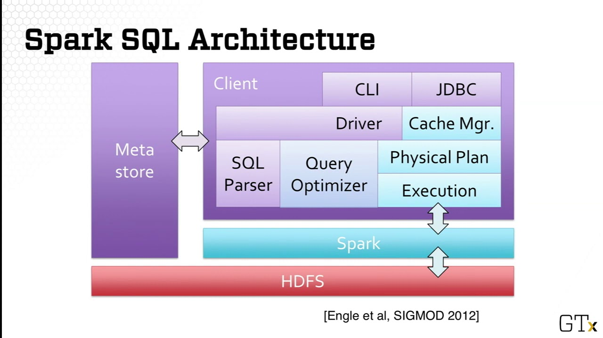
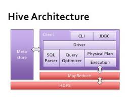
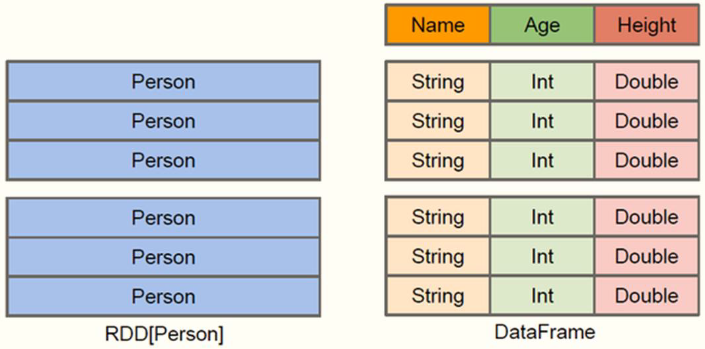
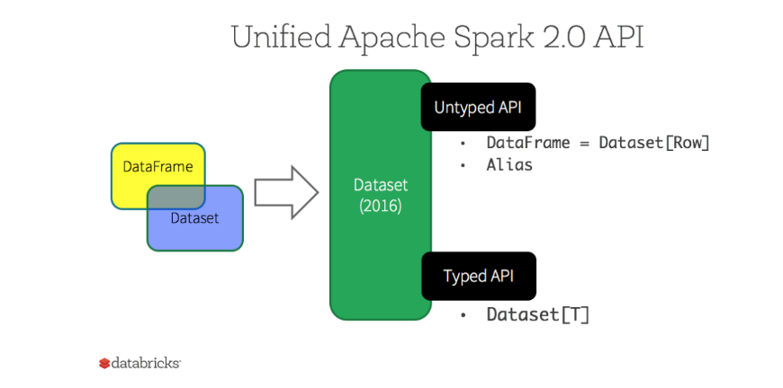
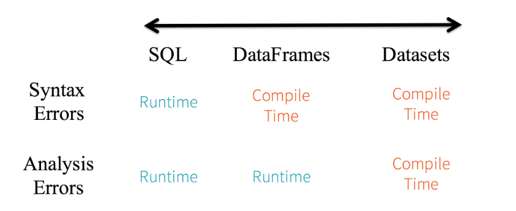
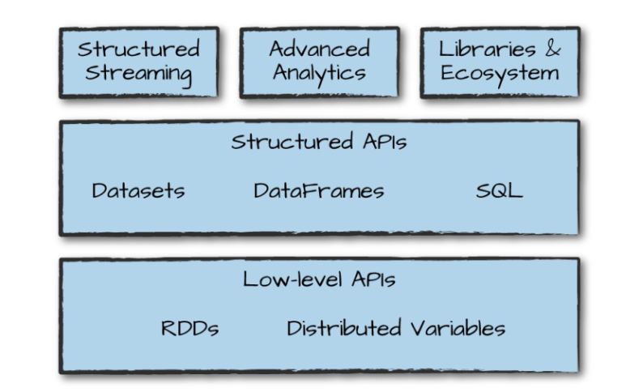
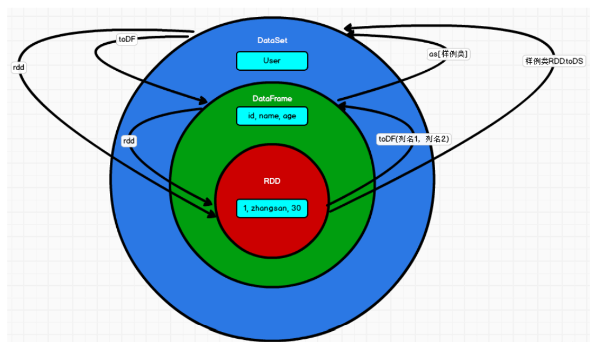
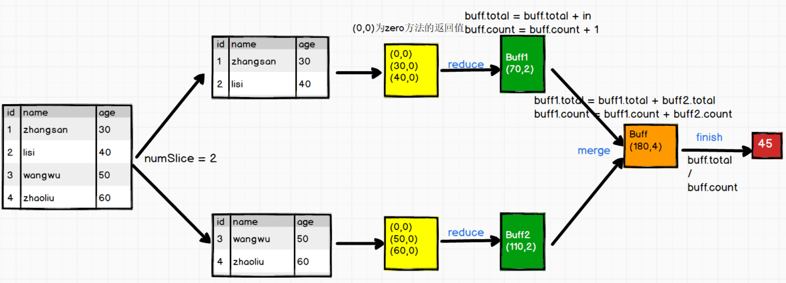

# 一、简介

> Spark SQL是Spark用于结构化数据(structured data)处理的Spark模块

- **历史**

  SparkSQL的前身是Shark  Shark是伯克利实验室Spark生态环境的组件之一，是基于**Hive**所开发的工具  

  Shark对于Hive的太多依赖  制约了Spark各个组件的相互集成，所以提出了SparkSQL项目  SparkSQL抛弃原有Shark的代码，汲取了Shark的一些优点重新开发了SparkSQL代码  摆脱了对Hive的依赖性

  2014年6月1日Shark项目和SparkSQL项目的主持人Reynold Xin宣布：停止对Shark的开发，团队将所有资源放SparkSQL项目上，至此，Shark的发展画上了句话，但也因此发展出两个支线：==SparkSQL和Hive on Spark==


- **架构对比**

  Spark SQL

  

  Hive

  

  [^主要修改模块]: 内存管理、物理计划、执行三个模块

  

## 特点


- 能够将 SQL 查询与 Spark 程序无缝混合，允许您使用 SQL 或 DataFrame API 对结构化数据进行查询；
- 支持多种开发语言；
- 支持多达上百种的外部数据源[^包括 Hive，Avro，Parquet，ORC，JSON 和 JDBC 等；]
- 支持 HiveQL 语法以及 Hive SerDes 和 UDF，允许你访问现有的 Hive 仓库；
- 支持标准的 JDBC 和 ODBC 连接；
- 支持优化器，列式存储和代码生成等特性；
- 支持扩展并能保证容错


## DataFrame和RDD对比

> DataFrame 和 RDDs 最主要的区别在于一个面向的是结构化数据，一个面向的是非结构化数据

==DataFrame是一种以RDD为基础的分布式数据集，类似于传统数据库中的二维表格==



DataFrame 内部的有明确 Scheme 结构，即列名、列字段类型都是已知的，

这带来的好处是可以**减少数据读取以及更好地优化执行计划，从而保证查询效率。**

**✌DataFrame 和 RDDs 应该如何选择？**

- 如果你想使用函数式编程而不是 DataFrame API，则使用 RDDs；
- 如果你的数据是非结构化的 (比如流媒体或者字符流)，则使用 RDDs，
- 如果你的数据是结构化的 (如 RDBMS 中的数据) 或者半结构化的 (如日志)，出于性能上的考虑，应优先使用 DataFrame。


## DataSet

> DataSet是分布式数据集合。DataSet是Spark 1.6中添加的一个新抽象


**特点**

- 集成了 RDD 和 DataFrame 的优点，具备强类型的特点，同时支持 Lambda 函数，但只能在 Scala 和 Java 语言中使用
- Spark 2.0 后，为了方便开发者，Spark 将 DataFrame 和 Dataset 的 API 融合到一起，提供了结构化的 API(Structured API)，即用户可以通过一套标准的 API 就能完成对两者的操作
- 用样例类来对DataSet中定义数据的结构信息，样例类中每个属性的名称直接映射到DataSet中的字段名称
- DataFrame是DataSet的特列，·`DataFrame=DataSet[Row]`


**类型问题**

- DataFrame 被标记为 Untyped API，而 DataSet 被标记为 Typed API




- **引出类型安全问题**

  流程： Compile  -->  Runtime

  

  [^Syntax Errors]:  语法错误    
  [^Analtsis Error]: 解析错误
  [^一句话]: Dataset 最严格，但对于开发者来说效率最高

  

## 小结

**DataFrame 🔗 DataSet 🔗 RDDs** 

- RDDs 适合非结构化数据的处理，而 DataFrame & DataSet 更适合结构化数据和半结构化的处理；
- DataFrame & DataSet 可以通过统一的 Structured API 进行访问，而 RDDs 则更适合函数式编程的场景；
- 相比于 DataFrame 而言，DataSet 是强类型的 (Typed)，有着更为严格的静态类型检查；
- DataSets、DataFrames、SQL 的底层都依赖了 RDDs API，并对外提供结构化的访问接口。





# 二、SparkSQL核心

> 整体流程

1. **创建环境**

   - ```scala
     //方式一
     val spark = SparkSession.builder().appName("Spark-SQL").master("local[*]").getOrCreate()
     
     //方式二
     val sparkConf = new SparkConf().setMaster("local[*]").setAppName("SparkSQL01_Basic")
     val spark = SparkSession.builder().config(sparkConf).getOrCreate()
     ```

2. **执行逻辑操作逻辑**

3. **关闭 运行环境**

   ```scala
   spark.close()
   ```


**全局临时视图**

- 使用 `createOrReplaceTempView` 创建的是会话临时视图，它的生命周期仅限于会话范围，会随会话的结束而结束。

-  `createGlobalTempView` 创建全局临时视图，全局临时视图可以在所有会话之间共享，并直到整个 Spark 应用程序终止后才会消失。
- 全局临时视图被定义在内置的 `global_temp` 数据库下，需要使用限定名称进行引用，
- 如 `SELECT * FROM global_temp.view1`。

```scala
// 注册为全局临时视图
df.createGlobalTempView("gemp")

// 使用限定名称进行引用
spark.sql("SELECT ename,job FROM global_temp.gemp").show()
```


## IDEA开发

**添加依赖**

```xml
<dependency>
    <groupId>org.apache.spark</groupId>
    <artifactId>spark-sql_2.12</artifactId>
    <version>3.0.0</version>
</dependency>
```

[^Tips]: 建议在进行 spark SQL 编程前导入下面的隐式转换，因为 DataFrames 和 dataSets 中很多操作都依赖了隐式转换 import spark.implicits._


### DataFrame

------

```json
{"username": "zhangsan","age": 20}
{"username": "lisi","age": 29}
{"username": "wangwu","age": 49}
```

```scala
    // 创建DataFrame
    val df = spark.read.json("data/user.json")

    // 创建临时表
    df.createOrReplaceTempView("user")

    //sql查询
    spark.sql("select * from user").show()
    spark.sql("select username,age from user").show()
    spark.sql("select avg(age) from user").show()

    // DSL查询
    import spark.implicits._
    df.select("username", "age").show()
    df.select($"age" + 1).show()								   👇为上下文环境对象
				👆 将字符串转换为结构化数据的列 需引入隐式转换规则  import XX.implicits._
    df.select('age + 1).show()
				👆简化
```


**相互转化**

- **RDD <-> DataFrame**

  ```scala
  val rdd: RDD[(Int, String, Int)] = spark.sparkContext.makeRDD(List((1, "zhangsan", 20), (2, "lisi", 30), (3, "wangwu", 40)))
  val dataFrame = rdd.toDF("id", "name", "age")
  //					 👆
  val rdd1: RDD[Row] = dataFrame.rdd
  //								👆
  ```


### DataSet

------

```scala
// DataSet
// DF 其实是DataSet的一个特例 特定泛型
val seq = Seq(1, 2, 3, 4)

val ds: Dataset[Int] = seq.toDS()
ds.show()
```


**相互转化**

- DataSet <--> RDD

  ```scala
  
  val rdd: RDD[(Int, String, Int)] = spark.sparkContext.makeRDD(List((1, "zhangsan", 20), (2, "lisi", 30), (3, "wangwu", 40)))
  
  
  val ds1: Dataset[User] = rdd.map {
    case (id, name, age) => User(id, name, age)
  }.toDS()
  
  
  case class User(id: Int, name: String, age: Int)
  ```

-  DataFrame <-> DataSet

  ```scala
  val ds: Dataset[User] = dataFrame.as[User]
  val dataFrame1 = ds.toDF()
  ```


## DataFrame🔗DataSet🔗RDD

### 共性

- 都是spark平台下的分布式弹性数据集，为处理超大型数据提供便利
- 惰性机制，在进行创建、转换，如map方法时，不会立即执行，只有在遇到Action如foreach时，三者才会开始遍历运算
- 三者有许多共同的函数，如filter，排序
- 在对DataFrame和Dataset进行操作许多操作都需要这个包:import spark.implicits
- 都会根据 Spark 的内存情况自动缓存运算，这样即使数据量很大，也不用担心会内存溢出
- 都有partition的概念
- DataFrame和DataSet均可使用模式匹配获取各个字段的值和类型


### 区别


| RDD                       | DataFrame                        | DataSet                       |
| ------------------------- | -------------------------------- | ----------------------------- |
| 一般和spark mllib同时使用 | 一般不与 spark mllib 同时使用    | 一般不与 spark mllib 同时使用 |
| 不支持sparksql操作        | 支持sparksql操作                 | 支持sparksql操作              |
|                           | 只有通过解析才能获取各个字段的值 |                               |
|                           | 支持一些特别方便的保存方式       | 支持一些特别方便的保存方式    |


### 相互转换




## UDF

[^UDF]:UserDefinedFunction

> 用户定义函数 ，通过spark.udf功能添加自定义函数，实现自定义功能
>

```scala
package com.hjc.sql_15

import org.apache.spark.sql.{DataFrame, SparkSession}

object SparkSQL02_UDF {
  def main(args: Array[String]): Unit = {
    val sparkSession: SparkSession = SparkSession.builder()
      .master("local[2]")
      .appName("SparkSQL")
      .getOrCreate()
    import sparkSession.implicits._

    val df: DataFrame = sparkSession.read.json("user.json")

    df.createTempView("user")

    //如何自定义UDF函数
    sparkSession.udf.register("addpre", (x: String, y: String) => y + x)

    sparkSession.sql("select addpre(name, '我是前缀:') from user").show

    sparkSession.close()
  }
}
```


## UDAF

[^UDAF]: UserDefinedAggregateFunction

> 用户定义聚合函数  Scala 提供了两种自定义聚合函数的方法
>

- 有类型的自定义聚合函数，主要适用于 DataSet
- 无类型的自定义聚合函数，主要适用于 DataFrame


这里以计算年龄的平均值为例

```json
// 原数据
{"username": "zhangsan","age": 30}
{"username": "lisi","age": 40}
{"username": "wangwu","age": 50}
{"username": "zhaoliu","age": 60}
```

**两种自定义方式分别如下👇：**

### 有类型的自定义聚合函数

------

```scala
package com.hjc.sql_bili

import org.apache.spark.SparkConf
import org.apache.spark.sql.expressions.{Aggregator, MutableAggregationBuffer, UserDefinedAggregateFunction}
import org.apache.spark.sql.types.{DataType, LongType, StructField, StructType}
import org.apache.spark.sql.{Encoder, Encoders, Row, SparkSession, functions}

object Spark03_SparkSQL_UDAF1 {

    def main(args: Array[String]): Unit = {

        // TODO 创建SparkSQL的运行环境						👇 分区数也是调用核数
        val sparkConf = new SparkConf().setMaster("local[2]").setAppName("sparkSQL")
        val spark = SparkSession.builder().config(sparkConf).getOrCreate()

        val df = spark.read.json("datas/user.json")
        df.createOrReplaceTempView("user")

        spark.udf.register("ageAvg", functions.udaf(new MyAvgUDAF()))

        spark.sql("select ageAvg(age) from user").show


        // TODO 关闭环境
        spark.close()
    }
    /*
     自定义聚合函数类：计算年龄的平均值
     1. 继承org.apache.spark.sql.expressions.Aggregator, 定义泛型
         IN : 输入的数据类型 Long
         BUF : 缓冲区的数据类型 Buff
         OUT : 输出的数据类型 Long
     2. 重写方法(6)
     */
    case class Buff( var total:Long, var count:Long )
    class MyAvgUDAF extends Aggregator[Long, Buff, Long]{
        // z & zero : 初始值或零值
        // 缓冲区的初始化
        override def zero: Buff = {
            Buff(0L,0L)
        }

        // 根据输入的数据更新缓冲区的数据
        override def reduce(buff: Buff, in: Long): Buff = {
            buff.total = buff.total + in
            buff.count = buff.count + 1
            buff
        }

        // 合并缓冲区
        override def merge(buff1: Buff, buff2: Buff): Buff = {
            buff1.total = buff1.total + buff2.total
            buff1.count = buff1.count + buff2.count
            buff1
        }

        //计算结果
        override def finish(buff: Buff): Long = {
            buff.total / buff.count
        }

        // 缓冲区的编码操作
        override def bufferEncoder: Encoder[Buff] = Encoders.product

        // 输出的编码操作
        override def outputEncoder: Encoder[Long] = Encoders.scalaLong
    }
}

```

[^继承类]: Aggregator
[^执行前需注册]: spark.udf.register("ageAvg", 	functions.udaf(new MyAvgUDAF()))
[^bufferEncoder]:自定义类型 Case Class 或者元组就使用 `Encoders.product` 方法
[^outputEncoder]:基本类型就使用其对应名称的方法，如 `scalaByte `，`scalaFloat`，`scalaShort` 等


[^详细流程图]: 👇




### 无类型的自定义聚合函数

------


```scala
package com.hjc.sql_bili

import org.apache.spark.SparkConf
import org.apache.spark.sql.{Row, SparkSession}
import org.apache.spark.sql.expressions.{MutableAggregationBuffer, UserDefinedAggregateFunction}
import org.apache.spark.sql.types.{DataType, LongType, StructField, StructType}

object Spark03_SparkSQL_UDAF {

    def main(args: Array[String]): Unit = {

        // TODO 创建SparkSQL的运行环境
        val sparkConf = new SparkConf().setMaster("local[*]").setAppName("sparkSQL")
        val spark = SparkSession.builder().config(sparkConf).getOrCreate()

        val df = spark.read.json("datas/user.json")
        df.createOrReplaceTempView("user")

        spark.udf.register("ageAvg", new MyAvgUDAF())

        spark.sql("select ageAvg(age) from user").show


        // TODO 关闭环境
        spark.close()
    }
    /*
     自定义聚合函数类：计算年龄的平均值
     1. 继承UserDefinedAggregateFunction
     2. 重写方法(8)
     */
    class MyAvgUDAF extends UserDefinedAggregateFunction{
        // 输入数据的结构 : Int
        override def inputSchema: StructType = {
            StructType(
                Array(
                    StructField("age", LongType)
                )
            )
        }
        // 缓冲区数据的结构 : Buffer
        override def bufferSchema: StructType = {
            StructType(
                Array(
                    StructField("total", LongType),
                    StructField("count", LongType)
                )
            )
        }

        // 函数计算结果的数据类型：Out
        override def dataType: DataType = LongType

        // 函数的稳定性
        override def deterministic: Boolean = true

        // 缓冲区初始化
        override def initialize(buffer: MutableAggregationBuffer): Unit = {
            //buffer(0) = 0L
            //buffer(1) = 0L

            buffer.update(0, 0L)
            buffer.update(1, 0L)
        }

        // 根据输入的值更新缓冲区数据
        override def update(buffer: MutableAggregationBuffer, input: Row): Unit = {
            buffer.update(0, buffer.getLong(0)+input.getLong(0))
            buffer.update(1, buffer.getLong(1)+1)
        }

        // 缓冲区数据合并
        override def merge(buffer1: MutableAggregationBuffer, buffer2: Row): Unit = {
            buffer1.update(0, buffer1.getLong(0) + buffer2.getLong(0))
            buffer1.update(1, buffer1.getLong(1) + buffer2.getLong(1))
        }

        // 计算平均值
        override def evaluate(buffer: Row): Any = {
            buffer.getLong(0)/buffer.getLong(1)
        }
    }
}
```


### 早期版本有类型UDAF操作

> 早期版本中，spark不能在sql中使用强类型UDAF操作


```scala
package com.hjc.sql_bili

import org.apache.spark.SparkConf
import org.apache.spark.sql.expressions.Aggregator
import org.apache.spark.sql.{Dataset, Encoder, Encoders, SparkSession, TypedColumn, functions}

object Spark03_SparkSQL_UDAF2 {

    def main(args: Array[String]): Unit = {

        // TODO 创建SparkSQL的运行环境
        val sparkConf = new SparkConf().setMaster("local[*]").setAppName("sparkSQL")
        val spark = SparkSession.builder().config(sparkConf).getOrCreate()
        import spark.implicits._
        val df = spark.read.json("datas/user.json")

        // 早期版本中，spark不能在sql中使用强类型UDAF操作
        // SQL & DSL
        // 早期的UDAF强类型聚合函数使用DSL语法操作
        val ds: Dataset[User] = df.as[User]

        // 将UDAF函数转换为查询的列对象
        val udafCol: TypedColumn[User, Long] = new MyAvgUDAF().toColumn

        ds.select(udafCol).show


        // TODO 关闭环境
        spark.close()
    }
    /*
     自定义聚合函数类：计算年龄的平均值
     1. 继承org.apache.spark.sql.expressions.Aggregator, 定义泛型
         IN : 输入的数据类型 User
         BUF : 缓冲区的数据类型 Buff
         OUT : 输出的数据类型 Long
     2. 重写方法(6)
     */
    case class User(username:String, age:Long)
    case class Buff( var total:Long, var count:Long )
    class MyAvgUDAF extends Aggregator[User, Buff, Long]{
        // z & zero : 初始值或零值
        // 缓冲区的初始化
        override def zero: Buff = {
            Buff(0L,0L)
        }

        // 根据输入的数据更新缓冲区的数据
        override def reduce(buff: Buff, in: User): Buff = {
            buff.total = buff.total + in.age
            buff.count = buff.count + 1
            buff
        }

        // 合并缓冲区
        override def merge(buff1: Buff, buff2: Buff): Buff = {
            buff1.total = buff1.total + buff2.total
            buff1.count = buff1.count + buff2.count
            buff1
        }

        //计算结果
        override def finish(buff: Buff): Long = {
            buff.total / buff.count
        }

        // 缓冲区的编码操作
        override def bufferEncoder: Encoder[Buff] = Encoders.product

        // 输出的编码操作
        override def outputEncoder: Encoder[Long] = Encoders.scalaLong
    }
}
```

步骤

1. 转换为Dataset

   ```scala
   val ds: Dataset[User] = df.as[User]
   ```

2. 将函数转换为列对象

   ```scala
   val udafCol: TypedColumn[User, Long] = new MyAvgUDAF().toColumn
   ```

3. 执行

   ```scala
   ds.select(udafCol).show
   ```

   


## 读写数据

> Spark 支持以下六个核心数据源，同时 Spark 社区还提供了多达上百种数据源的读取方式，能够满足绝大部分使用场景

- CSV
- JSON
- Parquet
- ORC
- JDBC/ODBC connections
- Plain-text files


**预定义数据格式**

- 定义格式

  ```scala
  val myManualSchema = new StructType(Array(
      StructField("deptno", LongType, nullable = false),
      StructField("dname", StringType,nullable = true),
      StructField("loc", StringType,nullable = true)
  ))
  ```

- 使用方式

  ```scala
  .schema(myManualSchema) 
  ```

  


### 读数据格式

所有读取 API 遵循以下调用格式：

```scala
// 格式
DataFrameReader.format(...).option("key", "value").schema(...).load()

// 示例
spark.read.format("csv")
.option("mode", "FAILFAST")          // 读取模式
.option("inferSchema", "true")       // 是否自动推断 schema
.option("path", "path/to/file(s)")   // 文件路径
.schema(someSchema)                  // 使用预定义的 schema      
.load()
```


[^读取模式三种选项]:👇

| 读模式          | 描述                                                         |
| --------------- | ------------------------------------------------------------ |
| `permissive`    | 当遇到损坏的记录时，将其所有字段设置为 null，并将所有损坏的记录放在名为 _corruption t_record 的字符串列中 |
| `dropMalformed` | 删除格式不正确的行                                           |
| `failFast`      | 遇到格式不正确的数据时立即失败                               |

### 写数据格式

```scala
// 格式
DataFrameWriter.format(...).option(...).partitionBy(...).bucketBy(...).sortBy(...).save()

//示例
dataframe.write.format("csv")
.option("mode", "OVERWRITE")         //写模式
.option("dateFormat", "yyyy-MM-dd")  //日期格式
.option("path", "path/to/file(s)")
.mode(SaveMode.Append)
.save()
```


[^写数据模式四种选项：]:👇

| Scala/Java               | 描述                                                         |
| ------------------------ | ------------------------------------------------------------ |
| `SaveMode.ErrorIfExists` | 如果给定的路径已经存在文件，则抛出异常，这是写数据默认的模式 |
| `SaveMode.Append`        | 数据以追加的方式写入                                         |
| `SaveMode.Overwrite`     | 数据以覆盖的方式写入                                         |
| `SaveMode.Ignore`        | 如果给定的路径已经存在文件，则不做任何操作                   |


### CSV

> CSV 是一种常见的文本文件格式，其中每一行表示一条记录，记录中的每个字段用逗号分隔。

**读取CSV文件**

- 自动推断类型读取读取示例：

```scala
spark.read.format("csv")
.option("header", "false")        // 文件中的第一行是否为列的名称
.option("mode", "FAILFAST")      // 是否快速失败
.option("inferSchema", "true")   // 是否自动推断 schema
.load("/usr/file/csv/dept.csv")
.show()
```


**写入CSV文件**

- 常规写入

  ```scala
  df.write.format("csv").mode("overwrite").save("/tmp/csv/dept2")
  ```

- 指定具体的分隔符

  ```scala
  df.write.format("csv").mode("overwrite").option("sep", "\t").save("/tmp/csv/dept2")
  ```


**🤳可选配置**

| 读\写操作 |           配置项            |                          可选值                          |           默认值           |                             描述                             |
| :-------: | :-------------------------: | :------------------------------------------------------: | :------------------------: | :----------------------------------------------------------: |
|   Both    |             seq             |                         任意字符                         |         ,   (逗号)         |                            分隔符                            |
|   Both    |           header            |                       true, false                        |           false            |                文件中的第一行是否为列的名称。                |
|   Read    |           escape            |                         任意字符                         |             \              |                           转义字符                           |
|   Read    |         inferSchema         |                       true, false                        |           false            |                      是否自动推断列类型                      |
|   Read    |   ignoreLeadingWhiteSpace   |                       true, false                        |           false            |                     是否跳过值前面的空格                     |
|   Both    |  ignoreTrailingWhiteSpace   |                       true, false                        |           false            |                     是否跳过值后面的空格                     |
|   Both    |          nullValue          |                         任意字符                         |             “”             |                  声明文件中哪个字符表示空值                  |
|   Both    |          nanValue           |                         任意字符                         |            NaN             |                声明哪个值表示 NaN 或者缺省值                 |
|   Both    |         positiveInf         |                         任意字符                         |            Inf             |                            正无穷                            |
|   Both    |         negativeInf         |                         任意字符                         |            -Inf            |                            负无穷                            |
|   Both    |    compression or codec     | None, uncompressed, bzip2, deflate, gzip, lz4, or snappy |            none            |                         文件压缩格式                         |
|   Both    |         dateFormat          |      任何能转换为 Java 的 SimpleDataFormat 的字符串      |         yyyy-MM-dd         |                           日期格式                           |
|   Both    |       timestampFormat       |      任何能转换为 Java 的 SimpleDataFormat 的字符串      | yyyy-MMdd’T’HH:mm:ss.SSSZZ |                          时间戳格式                          |
|   Read    |         maxColumns          |                         任意整数                         |           20480            |                     声明文件中的最大列数                     |
|   Read    |      maxCharsPerColumn      |                         任意整数                         |          1000000           |                  声明一个列中的最大字符数。                  |
|   Read    |        escapeQuotes         |                       true, false                        |            true            |                   是否应该转义行中的引号。                   |
|   Read    | maxMalformedLogPerPartition |                         任意整数                         |             10             | 声明每个分区中最多允许多少条格式错误的数据，超过这个值后格式错误的数据将不会被读取 |
|   Write   |          quoteAll           |                       true, false                        |           false            | 指定是否应该将所有值都括在引号中，而不只是转义具有引号字符的值。 |
|   Read    |          multiLine          |                       true, false                        |           false            |                 是否允许每条完整记录跨域多行                 |


### JSON

------

**读取JSON文件**

> 需要注意的是：默认不支持一条数据记录跨越多行    可以通过配置 multiLine 为 true来进行更改，其默认值为 false

```scala
spark.read.format("json").option("mode", "FAILFAST").load("/usr/file/json/dept.json").show(5)
```


```scala
// 默认支持单行
{"DEPTNO": 10,"DNAME": "ACCOUNTING","LOC": "NEW YORK"}

//默认不支持多行
{
  "DEPTNO": 10,
  "DNAME": "ACCOUNTING",
  "LOC": "NEW YORK"
}
```


**写入JSON文件**

```scala
df.write.format("json").mode("overwrite").save("/tmp/spark/json/dept")
```


**🤳可选配置**

| 读\写操作 | 配置项                             | 可选值                                                   | 默认值                           |
| --------- | ---------------------------------- | -------------------------------------------------------- | -------------------------------- |
| Both      | compression or codec               | None, uncompressed, bzip2, deflate, gzip, lz4, or snappy | none                             |
| Both      | dateFormat                         | 任何能转换为 Java 的 SimpleDataFormat 的字符串           | yyyy-MM-dd                       |
| Both      | timestampFormat                    | 任何能转换为 Java 的 SimpleDataFormat 的字符串           | yyyy-MMdd’T’HH:mm:ss.SSSZZ       |
| Read      | primitiveAsString                  | true, false                                              | false                            |
| Read      | allowComments                      | true, false                                              | false                            |
| Read      | allowUnquotedFieldNames            | true, false                                              | false                            |
| Read      | allowSingleQuotes                  | true, false                                              | true                             |
| Read      | allowNumericLeadingZeros           | true, false                                              | false                            |
| Read      | allowBackslashEscapingAnyCharacter | true, false                                              | false                            |
| Read      | columnNameOfCorruptRecord          | true, false                                              | Value of spark.sql.column&NameOf |
| Read      | multiLine                          | true, false                                              | false                            |


### Parquet

------

> Parquet 是一个开源的面向列的数据存储，它提供了多种存储优化，允许读取单独的列非整个文件，这不仅节省了存储空间而且提升了读取效率，它是 Spark 是默认的文件格式。

- **读取Parquet文件**

  ```scala
  spark.read.format("parquet").load("/usr/file/parquet/dept.parquet").show(5)
  ```

  

- **写入Parquet文件**

  ```scala
  df.write.format("parquet").mode("overwrite").save("/tmp/spark/parquet/dept")
  ```

  

- **可选配置**

  Parquet 文件有着自己的存储规则，因此其可选配置项比较少，常用的有如下两个：

| 读写操作 | 配置项               | 可选值                                                   | 默认值                                       | 描述                                                         |
| -------- | -------------------- | -------------------------------------------------------- | -------------------------------------------- | ------------------------------------------------------------ |
| Write    | compression or codec | None, uncompressed, bzip2, deflate, gzip, lz4, or snappy | None                                         | 压缩文件格式                                                 |
| Read     | mergeSchema          | true, false                                              | 取决于配置项 `spark.sql.parquet.mergeSchema` | 当为真时，Parquet 数据源将所有数据文件收集的 Schema 合并在一起，否则将从摘要文件中选择 Schema，如果没有可用的摘要文件，则从随机数据文件中选择 Schema。 |

[更多配置点我](https://spark.apache.org/docs/latest/sql-data-sources-parquet.html)


### ORC

> ORC 是一种自描述的、类型感知的列文件格式，它针对大型数据的读写进行了优化，也是大数据中常用的文件格式。

- 读取ORC文件

  ```scala
  spark.read.format("orc").load("/usr/file/orc/dept.orc").show(5)
  ```

  

- 写入ORC文件

  ```scala
  csvFile.write.format("orc").mode("overwrite").save("/tmp/spark/orc/dept")
  ```

  


### MYSQL

> Spark 同样支持与传统的关系型数据库进行数据读写。但是 Spark 程序默认是没有提供数据库驱动的，所以在使用前需要将对应的数据库驱动上传到安装目录下的 `jars` 目录中。下面示例使用的是 Mysql 数据库，使用前需要将对应的 `mysql-connector-java-x.x.x.jar` 上传到 `jars` 目录下。
>

 **读写数据** 

- 导入依赖

  ```xml
  <dependency>
      <groupId>mysql</groupId>
      <artifactId>mysql-connector-java</artifactId>
      <version>5.1.27</version>
  </dependency>
  
  ```

- 编写代码

  ```scala
  package com.hjc.sql_bili
  
  import org.apache.spark.SparkConf
  import org.apache.spark.sql.expressions.Aggregator
  import org.apache.spark.sql._
  
  object Spark04_SparkSQL_JDBC {
  
      def main(args: Array[String]): Unit = {
  
          // TODO 创建SparkSQL的运行环境
          val sparkConf = new SparkConf().setMaster("local[*]").setAppName("sparkSQL")
          val spark = SparkSession.builder().config(sparkConf).getOrCreate()
          import spark.implicits._
  
          // 读取MySQL数据
          val df = spark.read
                  .format("jdbc")
                  .option("url", "jdbc:mysql://linux1:3306/spark-sql")
                  .option("driver", "com.mysql.jdbc.Driver")
                  .option("user", "root")
                  .option("password", "123123")
                  .option("dbtable", "user")
                  .load()
          //df.show
  
          // 保存数据
          df.write
                  .format("jdbc")
                  .option("url", "jdbc:mysql://linux1:3306/spark-sql")
                  .option("driver", "com.mysql.jdbc.Driver")
                  .option("user", "root")
                  .option("password", "123123")
                  .option("dbtable", "user1")
                  .mode(SaveMode.Append)
                  .save()
  
  
          // TODO 关闭环境
          spark.close()
      }
  }
  ```

  

**🤳可选配置**

- |                属性名称                |                             含义                             |
  | :------------------------------------: | :----------------------------------------------------------: |
  |                  url                   |                          数据库地址                          |
  |                dbtable                 |                            表名称                            |
  |                 driver                 |                          数据库驱动                          |
  | partitionColumn, lowerBound, upperBoun |                     分区总数，上界，下界                     |
  |             numPartitions              | 可用于表读写并行性的最大分区数。如果要写的分区数量超过这个限制，那么可以调用 coalesce(numpartition) 重置分区数。 |
  |               fetchsize                |      每次往返要获取多少行数据。此选项仅适用于读取数据。      |
  |               batchsize                | 每次往返插入多少行数据，这个选项只适用于写入数据。默认值是 1000。 |
  |             isolationLevel             | 事务隔离级别：可以是 NONE，READ_COMMITTED, READ_UNCOMMITTED，REPEATABLE_READ 或 SERIALIZABLE，即标准事务隔离级别。 默认值是 READ_UNCOMMITTED。这个选项只适用于数据读取。 |
  |           createTableOptions           |               写入数据时自定义创建表的相关配置               |
  |         createTableColumnTypes         |                写入数据时自定义创建列的列类型                |


[更多配置点我](https://spark.apache.org/docs/latest/sql-data-sources-jdbc.html)


### Text

> Text 文件在读写性能方面并没有任何优势，且不能表达明确的数据结构，所以其使用的比较少，读写操作如下：
>

- 读取Text数据

- ```
  spark.read.textFile("/usr/file/txt/dept.txt").show()
  ```

-  写入Text数据

- ```
  df.write.text("/tmp/spark/txt/dept")
  ```


### Hive

------

> spark-shell默认是支持Hive


#### 内嵌版[^spark内嵌的hive一般不用]

- 启动Sparkshell

- 创建临时表

  ```scala
  scala> spark.sql("show tables").show
  。。。
  +--------+---------+-----------+
  |database|tableName|isTemporary|
  +--------+---------+-----------+
  +--------+---------+-----------+
  
  scala> spark.sql("create table aa(id int)")
  
  。。。
  
  scala> spark.sql("show tables").show
  +--------+---------+-----------+
  |database|tableName|isTemporary|
  +--------+---------+-----------+
  | default|       aa|      false|
  +--------+---------+-----------+
  
  ```

- 装载数据

  ```scala
  scala> spark.sql("load data local inpath 'input/ids.txt' into table aa")
  
  。。。
  
  scala> spark.sql("select * from aa").show
  +---+
  | id|
  +---+
  |  1|
  |  2|
  |  3|
  |  4|
  +---+
  ```

  

[^PS]: 在实际使用中, 几乎没有任何人会使用内置的 Hive


#### 外嵌版

------

==注意：使用SparkSQL    HIVE外嵌操作  需要开启的应用==


**👉准备工作**

- 将Hive的hive-site.xml拷贝到spark的 conf/目录下

- Mysql的驱动copy到spark  jars/目录下

- 按顺序启动

  zk	👉	Hadoop集群	👉	hiveservices.sh	👉	spark-shell


**为了方便查询可以启动SparkSQL  来代替spark-shell**

- ```sh
  $bin/spark-sql
  ```


**为了无缝兼容HiveServer2	运行Spark beeline来代替SparkSQL[^SparkSQL主要是在查询时视图不够完美]**

- 在准备工作的基础上

  如果访问不到hdfs，则需要把core-site.xml和hdfs-site.xml拷贝到conf/目录下

- 启动Thrift Server

  ```sh
  sbin/start-thriftserver.sh
  ```

- 使用beeline连接Thrift Server

  ```sh
  bin/beeline -u jdbc:hive2://hadoop102:10000 -n root
  ```

  


#### 代码版

------

**导入依赖**

- ```xml
  <dependency>
      <groupId>org.apache.spark</groupId>
      <artifactId>spark-hive_2.12</artifactId>
      <version>3.0.0</version>
  </dependency>
  
  <dependency>
      <groupId>org.apache.hive</groupId>
      <artifactId>hive-exec</artifactId>
      <version>1.2.1</version>
  </dependency>
  <dependency>
      <groupId>mysql</groupId>
      <artifactId>mysql-connector-java</artifactId>
      <version>5.1.27</version>
  </dependency>
  ```

- 将hive-site.xml文件拷贝到项目的resources目录中

- 代码实现

  ```scala
  package com.hjc.sql_bili
  
  import org.apache.spark.SparkConf
  import org.apache.spark.sql._
  
  object Spark05_SparkSQL_Hive {
  
      def main(args: Array[String]): Unit = {
          //										 👇此处自己集群的用户名
          System.setProperty("HADOOP_USER_NAME", "root")
          // TODO 创建SparkSQL的运行环境
          val sparkConf = new SparkConf().setMaster("local[*]").setAppName("sparkSQL")
          val spark = SparkSession.builder().enableHiveSupport().config(sparkConf).getOrCreate()
  
          // 使用SparkSQL连接外置的Hive
          // 1. 拷贝Hive-size.xml文件到classpath下
          // 2. 启用Hive的支持
          // 3. 增加对应的依赖关系（包含MySQL驱动）
          spark.sql("show tables").show
  
          // TODO 关闭环境
          spark.close()
      }
  }
  ```

  


