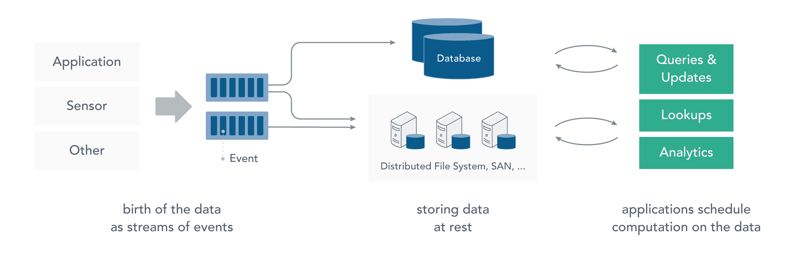
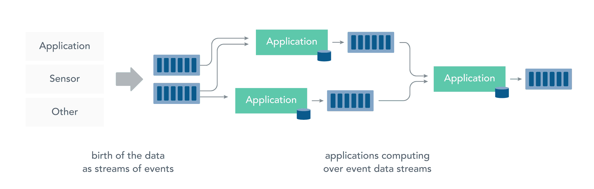
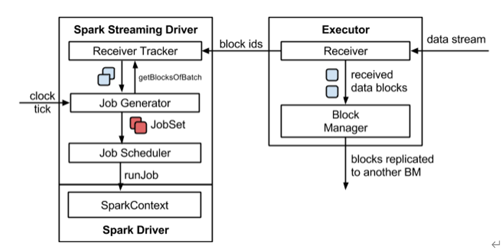
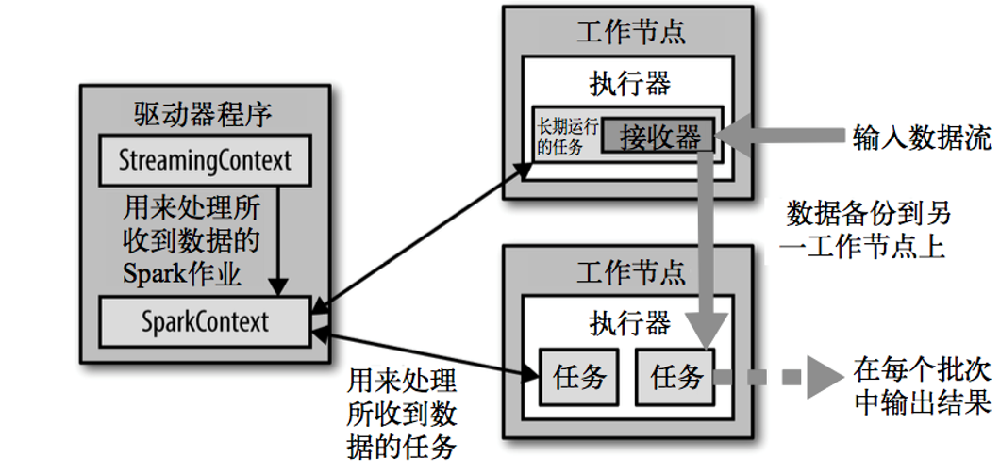
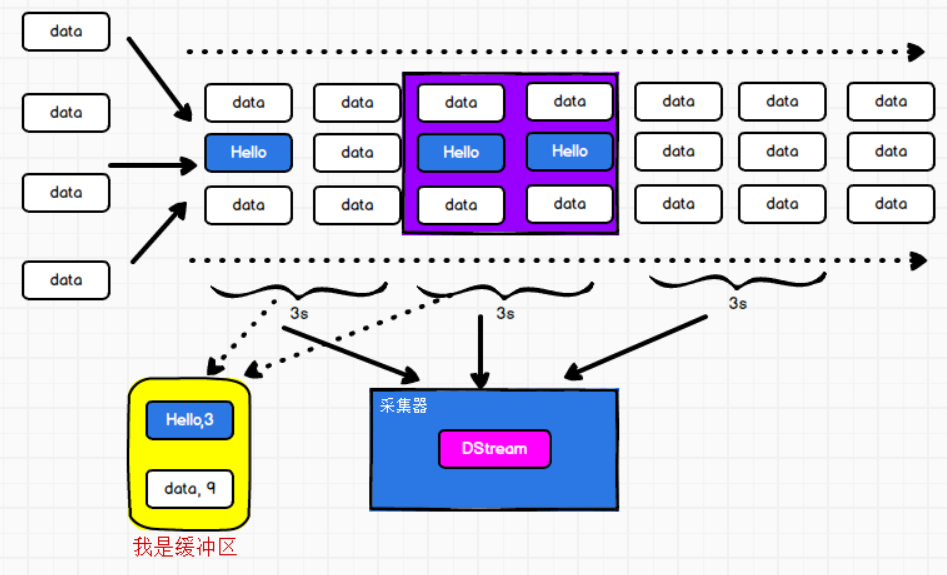

# 一、简介

> Spark Streaming 是 Spark 的一个子模块，用于快速构建可扩展，高吞吐量，高容错的流处理程序


## 特点

- 通过高级 API 构建应用程序，简单易用；
- 支持多种语言，如 Java，Scala 和 Python；
- 良好的容错性，Spark Streaming 支持快速从失败中恢复丢失的操作状态；
- 能够和 Spark 其他模块无缝集成，将流处理与批处理完美结合；
- Spark Streaming 可以从 HDFS，Flume，Kafka，Twitter 和 ZeroMQ 读取数据，也支持自定义数据源。

[](https://camo.githubusercontent.com/bdc8fef2e08b4b88cc32da3c22752ef2b7557c5d9df3fd20950ccf1eec5e58be/68747470733a2f2f67697465652e636f6d2f68656962616979696e672f426967446174612d4e6f7465732f7261772f6d61737465722f70696374757265732f737061726b2d73747265616d696e672d617263682e706e67)


## DStream

> Spark Streaming 提供称为离散流 (DStream) 的高级抽象，用于表示连续的数据流。

-  DStream 可以从来自 Kafka，Flume 和 Kinesis 等数据源的输入数据流创建，
- 也可以由其他 DStream 转化而来。==在内部，DStream 表示为一系列 RDD==

[](https://camo.githubusercontent.com/ddff4927bfe9c2c409b0448817415b87dedc36361e37aca8fb47e79010679e24/68747470733a2f2f67697465652e636f6d2f68656962616979696e672f426967446174612d4e6f7465732f7261772f6d61737465722f70696374757265732f737061726b2d73747265616d696e672d666c6f772e706e67)


## 批处理与流处理


### 批处理

在流处理之前，数据通常存储在数据库，文件系统或其他形式的存储系统中。应用程序根据需要查询数据或计算数据。这就是传统的静态数据处理架构。Hadoop 采用 HDFS 进行数据存储，采用 MapReduce 进行数据查询或分析，这就是典型的静态数据处理架构。

[](https://camo.githubusercontent.com/973240254714d6016213968084d544c49d396a17875790328d6825c0ddd17b6f/68747470733a2f2f67697465652e636f6d2f68656962616979696e672f426967446174612d4e6f7465732f7261772f6d61737465722f70696374757265732f30315f646174615f61745f726573745f696e6672617374727563747572652e706e67)

###  流处理

而流处理则是直接对运动中的数据的处理，在接收数据时直接计算数据。

大多数数据都是连续的流：传感器事件，网站上的用户活动，金融交易等等 ，所有这些数据都是随着时间的推移而创建的。

接收和发送数据流并执行应用程序或分析逻辑的系统称为**流处理器**。流处理器的基本职责是确保数据有效流动，同时具备可扩展性和容错能力，Storm 和 Flink 就是其代表性的实现。



流处理带来了静态数据处理所不具备的众多优点：

- **应用程序立即对数据做出反应**
  - 降低了数据的滞后性，使得数据更具有时效性，更能反映对未来的预期；
- **流处理可以处理更大的数据量**：
  - 直接处理数据流，并且只保留数据中有意义的子集，并将其传送到下一个处理单元，逐级过滤数据，降低需要处理的数据量，从而能够承受更大的数据量；
- **流处理更贴近现实的数据模型**：
  - 在实际的环境中，一切数据都是持续变化的，要想能够通过过去的数据推断未来的趋势，必须保证数据的不断输入和模型的不断修正，典型的就是金融市场、股票市场，流处理能更好的应对这些数据的连续性的特征和及时性的需求；
- **流处理分散和分离基础设施**：
  - 流式处理减少了对大型数据库的需求。相反，每个流处理程序通过流处理框架维护了自己的数据和状态，这使得流处理程序更适合微服务架构。


## Arch



**简化版👇**




## 背压机制

> 一句话：动态控制数据接收速率来适配集群数据处理能力

**历史**

- Spark 1.5以前版本，用户如果要限制Receiver的数据接收速率，可以通过设置静态配制参数“`spark.streaming.receiver.maxRate`”的值来实现，此举虽然可以通过限制接收速率，来适配当前的处理能力，防止内存溢出，但也会引入其它问题。

  比如：producer数据生产高于maxRate，当前集群处理能力也高于maxRate，这就会造成资源利用率下降等问题


**目的**

- 为了更好的协调数据接收速率与资源处理能力

  1.5版本开始Spark Streaming可以动态控制数据接收速率来适配集群数据处理能力


**解决**

- [^背压机制（即Spark Streaming Backpressure）]:根据JobScheduler反馈作业的执行信息来动态调整Receiver数据接收率。

- **使用方法**

  [^属性“spark.streaming.backpressure.enabled”]: 控制是否启用backpressure机制，默认值false，即不启用。

  


# 二、DStream创建

## StreamingContext

> Spark Streaming 编程的入口类 StreamingContext

Spark 流处理本质是将流数据拆分为一个个批次，然后进行微批处理


**创建StreamingContext的两个参数**

- ```scala
  val sparkConf = new SparkConf().setMaster("local[*]").setAppName("SparkStreaming")
  // 第一个参数表示环境配置
  // 第二个参数表示批量处理的周期（采集周期）
  val ssc = new StreamingContext(sparkConf, Seconds(3))
  ```

| 参数说明      |                    |
| ------------- | ------------------ |
| sparkConf     | 配置信息           |
| batchDuration | 批次拆分的时间间隔 |


[^注意]: 使用的是本地模式，配置为 `local[2]`，这里不能配置为 `local[1]`。这是因为对于流数据的处理，Spark 必须有一个独立的 Executor 来接收数据，然后再由其他的 Executors 来处理，所以为了保证数据能够被处理，至少要有 2 个 Executors。这里我们的程序只有一个数据流，在并行读取多个数据流的时候，也需要保证有足够的 Executors 来接收和处理数据。


## 服务的启动与停止


| 说明                                    |                              |
| --------------------------------------- | ---------------------------- |
| StreamingContext对象.start()            | 代表启动服务                 |
| StreamingContext对象.awaitTermination() | 使服务处于等待和可用的状态   |
| StreamingContext对象.stop()             | 发生异常或者手动使用进行终止 |


## 数据来源

### 基本数据源

> 包括RDD队列、文件系统、Socket 连接等
>

#### RDD队列

------

```scala
package com.hjc.streaming_bilibili

import org.apache.spark.SparkConf
import org.apache.spark.rdd.RDD
import org.apache.spark.streaming.dstream.{DStream, ReceiverInputDStream}
import org.apache.spark.streaming.{Seconds, StreamingContext}

import scala.collection.mutable

object SparkStreaming02_Queue {

    def main(args: Array[String]): Unit = {

        // TODO 创建环境对象
        // StreamingContext创建时，需要传递两个参数
        // 第一个参数表示环境配置
        val sparkConf = new SparkConf().setMaster("local[*]").setAppName("SparkStreaming")
        // 第二个参数表示批量处理的周期（采集周期）
        val ssc = new StreamingContext(sparkConf, Seconds(3))

        val rddQueue = new mutable.Queue[RDD[Int]]()
		//							👇
        val inputStream = ssc.queueStream(rddQueue,oneAtATime = false)
        val mappedStream = inputStream.map((_,1))
        val reducedStream = mappedStream.reduceByKey(_ + _)
        reducedStream.print()

        ssc.start()

        for (i <- 1 to 5) {
            rddQueue += ssc.sparkContext.makeRDD(1 to 300, 10)
            Thread.sleep(2000)
        }

        ssc.awaitTermination()
    }
}

```

[^ssc.queueStream]:用来创建DStream


#### Socket 数据源

------

> 需要自定义数据源  继承Receiver，并实现onStart、onStop方法来自定义数据源采集

```scala
object SparkStreaming03_CustomReceiver {
  def main(args: Array[String]): Unit = {
    //1. 生成一个Dstream
    val sparkConf: SparkConf = new SparkConf()
      .setMaster("local[2]")
      .setAppName("StreamingTest")
    val streamingContext = new StreamingContext(sparkConf, Seconds(4))

    val myStream: ReceiverInputDStream[String] = streamingContext.receiverStream(new MyReceiver)
    myStream
      .flatMap(_.split(" "))
      .map((_,1))
      .reduceByKey(_+_)
      .print()

    //3. 运行流程序
    streamingContext.start()
    streamingContext.awaitTermination()
  }
}

class MyReceiver extends Receiver[String](StorageLevel.MEMORY_ONLY) {
  override def onStart(): Unit = {
    new Thread {
      override def run(): Unit = {
        val socket = new Socket("hadoop102", 9999)
        val reader = new BufferedReader(new InputStreamReader(socket.getInputStream, StandardCharsets.UTF_8))
        var line: String = reader.readLine()
        while (line != null) {
          store(line)
          line = reader.readLine()
        }
      }
    }.start()
  }

  override def onStop(): Unit = {

  }
}
```


### 高级数据源

> 包括 Kafka，Flume，Kinesis 等


#### Kafka数据源

------

```scala
package com.hjc.streaming_bilibili

import java.util.Random

import org.apache.kafka.clients.consumer.{ConsumerConfig, ConsumerRecord}
import org.apache.spark.SparkConf
import org.apache.spark.storage.StorageLevel
import org.apache.spark.streaming.dstream.{InputDStream, ReceiverInputDStream}
import org.apache.spark.streaming.kafka010.{ConsumerStrategies, KafkaUtils, LocationStrategies}
import org.apache.spark.streaming.receiver.Receiver
import org.apache.spark.streaming.{Seconds, StreamingContext}

object SparkStreaming04_Kafka {

    def main(args: Array[String]): Unit = {

        val sparkConf = new SparkConf().setMaster("local[*]").setAppName("SparkStreaming")
        val ssc = new StreamingContext(sparkConf, Seconds(3))

        val kafkaPara: Map[String, Object] = Map[String, Object](
            ConsumerConfig.BOOTSTRAP_SERVERS_CONFIG -> "hadoop102:9092,hadoop103:9092,hadoop104:9092",
            ConsumerConfig.GROUP_ID_CONFIG -> "atguigu",
            "key.deserializer" -> "org.apache.kafka.common.serialization.StringDeserializer",
            "value.deserializer" -> "org.apache.kafka.common.serialization.StringDeserializer"
        )

        val kafkaDataDS: InputDStream[ConsumerRecord[String, String]] = 	
        KafkaUtils.createDirectStream[String, String](
            ssc,
            //  ✨
            LocationStrategies.PreferConsistent,
            ConsumerStrategies.Subscribe[String, String](Set("atguiguNew"), kafkaPara)
        )
        kafkaDataDS.map(_.value()).print()


        ssc.start()
        ssc.awaitTermination()
    }
}
```


| ✨LocationStrategies的三种模式[^采集节点和处理节点的匹配策略] |                            |      |
| ------------------------------------------------------------ | -------------------------- | ---- |
| PreferBrokers                                                | 让Borkers去选择[^一般不用] |      |
| PreferConsistent                                             | 自动选择                   |      |
| PreferFixed                                                  | 混合模式                   |      |


# 三、DStream转换

> DStream 的任何操作都会转换为底层 RDD 上的操作、所以 DStream 能够支持 RDD 大部分的转换算子

[^概念引入]: **状态**

**🤔什么是状态？**

[^🌰]: 在登陆网页时，第一次需要输入账号密码  而第二次可能就不需要了  这是因为网站保存了我们上一次登陆的状态、


带入到Spark Streaming就是：每个采集周期是否对该周期的状态[^数据什么的]进行保存   便于后续的 聚合 汇总等操作

主要分为以下两类👇

- **无状态转化**
- **有状态转化**


## 无状态转化

> 无状态数据操作，只对当前的采集周期内的数据进行处理

### Transform

------

==执行任意的RDD-to-RDD函数==

```scala
package com.hjc.streaming_bilibili

import org.apache.spark.SparkConf
import org.apache.spark.streaming.dstream.DStream
import org.apache.spark.streaming.{Seconds, StreamingContext}

object SparkStreaming06_State_Transform {

    def main(args: Array[String]): Unit = {

        val sparkConf = new SparkConf().setMaster("local[*]").setAppName("SparkStreaming")
        val ssc = new StreamingContext(sparkConf, Seconds(3))

        val lines = ssc.socketTextStream("localhost", 9999)


        // Code : Driver端					👇
        val newDS: DStream[String] = lines.transform(
            rdd => {
                // Code : Driver端，（周期性执行）
                rdd.map(
                    str => {
                        // Code : Executor端
                        str
                    }
                )
            }
        )
        // Code : Driver端			       👇
        val newDS1: DStream[String] = lines.map(
            data => {
                // Code : Executor端
                data
            }
        )

        ssc.start()
        ssc.awaitTermination()
    }

}

```


[^✨]:该函数每一批次调度一次。其实也就是对DStream中的RDD应用转换


### Join

------

> 所谓的DStream的Join操作，其实就是两个RDD的join

[^📢]: 两个流之间的join需要两个流的批次大小一致，这样才能做到同时触发计算。计算过程就是对当前批次的两个流中各自的RDD进行join，与两个RDD的join效果相同


```scala
package com.hjc.streaming_bilibili

import org.apache.spark.SparkConf
import org.apache.spark.streaming.dstream.DStream
import org.apache.spark.streaming.{Seconds, StreamingContext}

object SparkStreaming06_State_Join {

    def main(args: Array[String]): Unit = {

        val sparkConf = new SparkConf().setMaster("local[*]").setAppName("SparkStreaming")
        val ssc = new StreamingContext(sparkConf, Seconds(5))

        val data9999 = ssc.socketTextStream("localhost", 9999)
        val data8888 = ssc.socketTextStream("localhost", 8888)

        val map9999: DStream[(String, Int)] = data9999.map((_,9))
        val map8888: DStream[(String, Int)] = data8888.map((_,8))

        // 所谓的DStream的Join操作，其实就是两个RDD的join
        val joinDS: DStream[(String, (Int, Int))] = map9999.join(map8888)

        joinDS.print()

        ssc.start()
        ssc.awaitTermination()
    }
}
```


## 有状态转化

### UpdateStateByKey

> 在某些场合下，需要保留数据统计结果（状态），实现数据的汇总  有点像累加器

**实现步骤**

- 定义状态，状态可以是一个**任意的数据类型**

- 定义状态更新函数，用此函数阐明如何使用之前的状态和来自输入流的新值对状态进行更新

- 配置检查点目录

  

```scala
package com.hjc.streaming_bilibili

import org.apache.kafka.clients.consumer.{ConsumerConfig, ConsumerRecord}
import org.apache.spark.SparkConf
import org.apache.spark.streaming.dstream.InputDStream
import org.apache.spark.streaming.kafka010.{ConsumerStrategies, KafkaUtils, LocationStrategies}
import org.apache.spark.streaming.{Seconds, StreamingContext}

object SparkStreaming05_State {

    def main(args: Array[String]): Unit = {

        val sparkConf = new SparkConf().setMaster("local[*]").setAppName("SparkStreaming")
        val ssc = new StreamingContext(sparkConf, Seconds(3))
        ssc.checkpoint("cp")

        // 在某些场合下，需要保留数据统计结果（状态），实现数据的汇总
        // 使用有状态操作时，需要设定检查点路径
        val datas = ssc.socketTextStream("localhost", 9999)

        val wordToOne = datas.map((_,1))

        //val wordToCount = wordToOne.reduceByKey(_+_)

        // updateStateByKey：根据key对数据的状态进行更新
        // 传递的参数中含有两个值
        // 第一个值表示相同的key的value数据
        // 第二个值表示缓存区相同key的value数据
        val state = wordToOne.updateStateByKey(
            ( seq:Seq[Int], buff:Option[Int] ) => {
                val newCount = buff.getOrElse(0) + seq.sum
                Option(newCount)
            }
        )

        state.print()

        ssc.start()
        ssc.awaitTermination()
    }

}
```


**该函数的两个参数**

[^参数一]:就像把 数据map给为（hello，1）的那个 1
[^参数二]: 就是对每个 hello的 1  做操作后 的数据

参照累加器


​																									==👇流程图👇==




### 窗口操作

------

> Window Operations可以设置窗口的大小和滑动窗口的间隔来动态的获取当前Steaming的允许状态。
>
> 所有基于窗口的操作都需要两个参数，分别为窗口时长以及滑动步长。

- **窗口时长**[^windowLength]：计算内容的时间范围
- **滑动步长**[^slideInterval]：隔多久触发一次计算


==注意：这两者都必须为采集周期大小的整数倍==


#### window

> 参数	(windowLength, slideInterval)

- 说明

  基于对源DStream窗化的批次进行计算返回一个新的Dstream


#### countByWindow

> 参数	(windowLength, slideInterval)

- 说明

  返回一个滑动窗口计数流中的元素个数

- 代码

  ```scala
  object SparkStreaming09_CounyByWindow {
    def main(args: Array[String]): Unit = {
      val context: StreamingContext = StreamingContext.getOrCreate(
        "./ck",
        () => {
          //1. 生成一个Dstream
          val sparkConf: SparkConf = new SparkConf()
            .setMaster("local[2]")
            .setAppName("StreamingTest")
          val streamingContext = new StreamingContext(sparkConf, Seconds(3))
  
          streamingContext.checkpoint("./ck")
  
          val dStream: ReceiverInputDStream[String] = streamingContext.socketTextStream("hadoop102", 9999)
  
          //2. 计算(wordcount)
          dStream
            .flatMap(_.split(" "))
            .map((_, 1))
            .countByWindow(
              Seconds(12),
              Seconds(6)
            )
            .print()
          streamingContext
        })
  
      context.start()
      context.awaitTermination()
    }
  
  }
  ```


#### reduceByWindow

> 参数	(func, windowLength, slideInterval)

- 说明

  通过使用自定义函数整合滑动区间流元素来创建一个新的单元素流

- 代码

  ```scala
  object SparkStreaming10_ReduceByWindow {
    def main(args: Array[String]): Unit = {
      //1. 生成一个DStream
      val sparkConf: SparkConf = new SparkConf()
        .setMaster("local[2]")
        .setAppName("StreamingTest")
      val streamingContext = new StreamingContext(sparkConf, Seconds(4))
  
      //2. 生成DStream
      val queue: mutable.Queue[RDD[Int]] = mutable.Queue.empty[RDD[Int]]
      val QueueDStream: InputDStream[Int] = streamingContext.queueStream(queue, oneAtATime = false)
      QueueDStream
        .reduceByWindow(
          (x: Int, y:Int) => x + y,
          Seconds(8),
          Seconds(4)
        )
        .print()
  
  
      //3. 运行流程序
      streamingContext.start()
  
      //4. 向队列中添加RDD
      while (true) {
        val rdd: RDD[Int] = streamingContext.sparkContext.makeRDD(Seq(1, 2, 3, 4, 5))
        queue.enqueue(rdd)
        Thread.sleep(2000)
      }
      streamingContext.awaitTermination()
    }
  
  }
  ```


#### reduceByKeyAndWindow

##### 三个参数

> (func, windowLength, slideInterval, [numTasks])

- 说明

  当在一个(K,V)对的DStream上调用此函数，会返回一个新(K,V)对的DStream，此处通过对滑动窗口中批次数据使用reduce函数来整合每个key的value值

- 代码

  ```scala
  import org.apache.spark.SparkConf
  import org.apache.spark.rdd.RDD
  import org.apache.spark.streaming.dstream.InputDStream
  import org.apache.spark.streaming.{Seconds, StreamingContext}
  
  import scala.collection.mutable
  
  object SparkStreaming10_ReduceByWindow {
    def main(args: Array[String]): Unit = {
      //1. 生成一个DStream
      val sparkConf: SparkConf = new SparkConf()
        .setMaster("local[2]")
        .setAppName("StreamingTest")
      val streamingContext = new StreamingContext(sparkConf, Seconds(4))
  
      //2. 生成DStream
      val queue: mutable.Queue[RDD[Int]] = mutable.Queue.empty[RDD[Int]]
      val QueueDStream: InputDStream[Int] = streamingContext.queueStream(queue, oneAtATime = false)
      QueueDStream
        .reduceByWindow(
          (x: Int, y:Int) => x + y,
          Seconds(8),
          Seconds(4)
        )
        .print()
  
  
      //3. 运行流程序
      streamingContext.start()
  
      //4. 向队列中添加RDD
      while (true) {
        val rdd: RDD[Int] = streamingContext.sparkContext.makeRDD(Seq(1, 2, 3, 4, 5))
        queue.enqueue(rdd)
        Thread.sleep(2000)
      }
      streamingContext.awaitTermination()
    }
  
  }
  ```


##### 四个参数

> (func, invFunc, windowLength, slideInterval, [numTasks])

[^第一个函数]: 是在一个步长后对进入的数据做的操作
[^第二个函数]: 是对一个步长后对离开窗口的数据做的操作


- 说明

  当窗口范围比较大，但是滑动幅度比较小，那么可以采用增加数据和删除数据的方式

- 代码

  ```scala
  package com.hjc.streaming_bilibili
  
  import org.apache.spark.SparkConf
  import org.apache.spark.streaming.dstream.DStream
  import org.apache.spark.streaming.{Seconds, StreamingContext}
  
  object SparkStreaming06_State_Window1 {
  
      def main(args: Array[String]): Unit = {
  
          val sparkConf = new SparkConf().setMaster("local[*]").setAppName("SparkStreaming")
          val ssc = new StreamingContext(sparkConf, Seconds(3))
          ssc.checkpoint("cp")
  
          val lines = ssc.socketTextStream("localhost", 9999)
          val wordToOne = lines.map((_,1))
  
          
          val windowDS: DStream[(String, Int)] =
              wordToOne.reduceByKeyAndWindow(
                  (x:Int, y:Int) => { x + y},
                  (x:Int, y:Int) => {x - y},
                  Seconds(9), Seconds(3))
  
          windowDS.print()
  
          ssc.start()
          ssc.awaitTermination()
      }
  
  }
  ```


# 四、DSteam输出

Spark Streaming 支持以下输出操作：

| Output Operation                            | Meaning                                                      |
| ------------------------------------------- | ------------------------------------------------------------ |
| **print**()                                 | 在运行流应用程序的 driver 节点上打印 DStream 中每个批次的前十个元素。用于开发调试。 |
| **saveAsTextFiles**(*prefix*, [*suffix*])   | 将 DStream 的内容保存为文本文件。每个批处理间隔的文件名基于前缀和后缀生成：“prefix-TIME_IN_MS [.suffix]”。 |
| **saveAsObjectFiles**(*prefix*, [*suffix*]) | 将 DStream 的内容序列化为 Java 对象，并保存到 SequenceFiles。每个批处理间隔的文件名基于前缀和后缀生成：“prefix-TIME_IN_MS [.suffix]”。 |
| **saveAsHadoopFiles**(*prefix*, [*suffix*]) | 将 DStream 的内容保存为 Hadoop 文件。每个批处理间隔的文件名基于前缀和后缀生成：“prefix-TIME_IN_MS [.suffix]”。 |
| **foreachRDD**(*func*)                      | 最通用的输出方式，它将函数 func 应用于从流生成的每个 RDD。此函数应将每个 RDD 中的数据推送到外部系统，例如将 RDD 保存到文件，或通过网络将其写入数据库。 |


## foreachRDD

> 实现对数据库的操作


```scala
reduceDS.foreachRDD(
    rdd => {
        rdd.foreachPartition(
            iter => {
                val conn = JDBCUtil.getConnection
                val pstat = conn.prepareStatement(
                    """
                      | insert into area_city_ad_count ( dt, area, city, adid, count )
                      | values ( ?, ?, ?, ?, ? )
                      | on DUPLICATE KEY
                      | UPDATE count = count + ?
                    """.stripMargin)
                iter.foreach{
                    case ( ( day, area, city, ad ), sum ) => {
                        pstat.setString(1,day )
                        pstat.setString(2,area )
                        pstat.setString(3, city)
                        pstat.setString(4, ad)
                        pstat.setInt(5, sum)
                        pstat.setInt(6,sum )
                        pstat.executeUpdate()
                    }
                }
                pstat.close()
                conn.close()
            }
        )
    }
)
```


==注意==

- 连接不能写在driver层面（序列化）
- 如果写在foreach则每个RDD中的每一条数据都创建，得不偿失
- 增加foreachPartition，在分区创建（获取）


# 五、关闭

> 流式任务需要7*24小时执行，但是有时涉及到升级代码需要主动停止程序，但是分布式程序，没办法做到一个个进程去杀死，所有配置优雅的关闭就显得至关重要了。


**使用外部文件系统来控制内部程序关闭**

```scala
package com.hjc.streaming_bilibili

import org.apache.spark.SparkConf
import org.apache.spark.streaming.dstream.DStream
import org.apache.spark.streaming.{Seconds, StreamingContext, StreamingContextState}

object SparkStreaming08_Close {

    def main(args: Array[String]): Unit = {

        /*
           线程的关闭：
           val thread = new Thread()
           thread.start()

           thread.stop(); // 强制关闭

         */

        val sparkConf = new SparkConf().setMaster("local[*]").setAppName("SparkStreaming")
        val ssc = new StreamingContext(sparkConf, Seconds(3))

        val lines = ssc.socketTextStream("localhost", 9999)
        val wordToOne = lines.map((_,1))

        wordToOne.print()

        ssc.start()

        // 如果想要关闭采集器，那么需要创建新的线程
        // 而且需要在第三方程序中增加关闭状态
        new Thread(
            new Runnable {
                override def run(): Unit = {
                    // 优雅地关闭
                    // 计算节点不在接收新的数据，而是将现有的数据处理完毕，然后关闭
                    // Mysql : Table(stopSpark) => Row => data
                    // Redis : Data（K-V）
                    // ZK    : /stopSpark
                    // HDFS  : /stopSpark
                    /*
                    while ( true ) {
                        if (true) {
                            // 获取SparkStreaming状态
                            val state: StreamingContextState = ssc.getState()
                            if ( state == StreamingContextState.ACTIVE ) {
                                ssc.stop(true, true)
                            }
                        }
                        Thread.sleep(5000)
                    }
                     */

                    Thread.sleep(5000)
                    val state: StreamingContextState = ssc.getState()
                    if ( state == StreamingContextState.ACTIVE ) {
                        ssc.stop(true, true)
                    }
                    System.exit(0)
                }
            }
        ).start()

        ssc.awaitTermination() // block 阻塞main线程


    }

}
```


