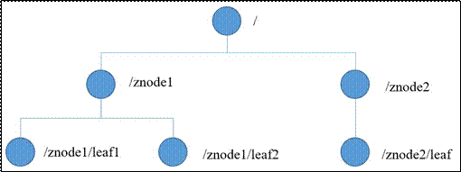
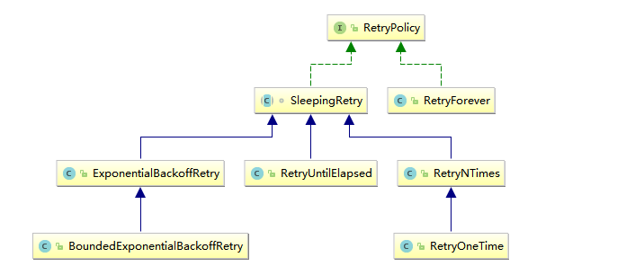
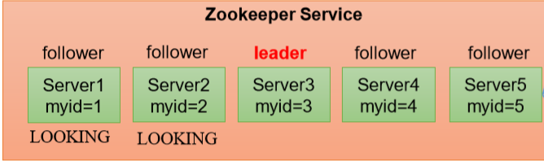
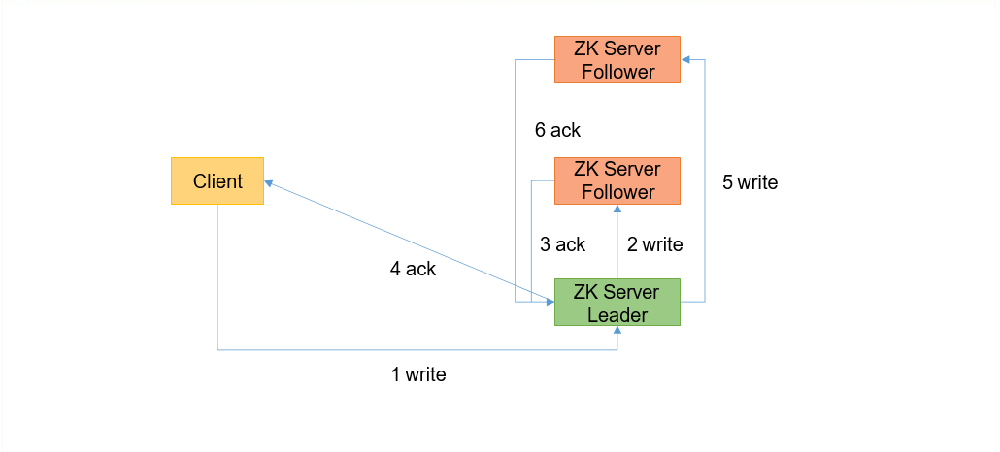
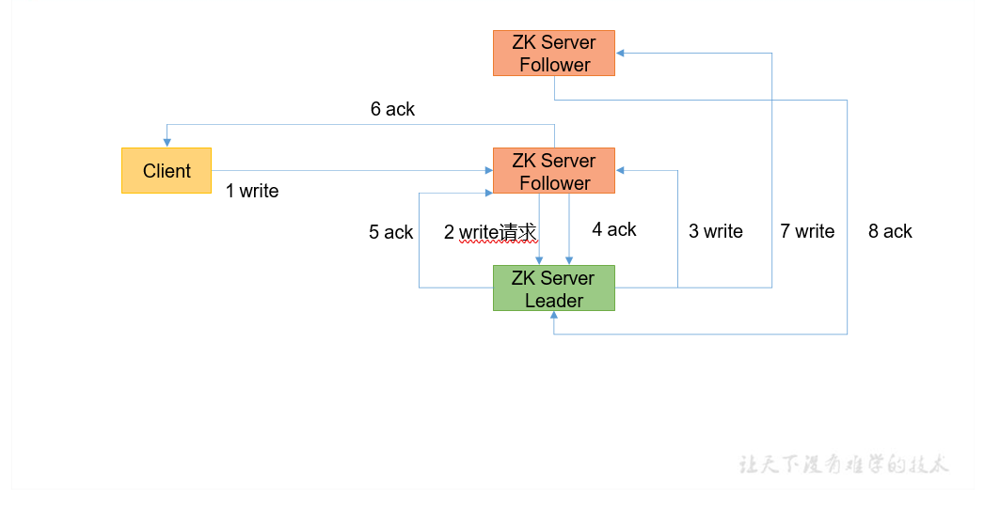
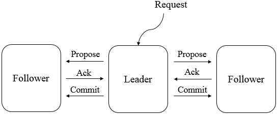

# **一**、简介及核心概念


## Zookeeper简介

 Zookeeper 是一个开源的分布式协调服务，目前由 Apache 进行维护。Zookeeper 可以用于实现分布式系统中常见的发布/订阅、负载均衡、命令服务、分布式协调/通知、集群管理、Master 选举、分布式锁和分布式队列等功能。


它具有以下特性：

- **顺序一致性**：从一个客户端发起的事务请求，最终都会严格按照其发起顺序被应用到 Zookeeper 中；
- **原子性**：所有事务请求的处理结果在整个集群中所有机器上都是一致的；不存在部分机器应用了该事务，而另一部分没有应用的情况；
- **单一视图**：所有客户端看到的服务端数据模型都是一致的；
- **可靠性**：一旦服务端成功应用了一个事务，则其引起的改变会一直保留，直到被另外一个事务所更改；
- **实时性**：一旦一个事务被成功应用后，Zookeeper 可以保证客户端立即可以读取到这个事务变更后的最新状态的数据。
- **一个领导者**（Leader），多个跟随者（Follower）组成的集群。
-  集群中只要有半数以上节点存活，Zookeeper集群就能正常服务。**所以Zookeeper适合安装奇数台服务器**。


Zookeeper从设计模式角度来理解：是一个基 于观察者模式设计的分布式服务管理框架，它==负责 存储和管理大家都关心的数据，==然后==接受观察者的 注册==，一旦这些数据的状态发生变化，Zookeeper 就将==负责通知已经在Zookeeper上注册的那些观察者==做出相应的反应。


## 核心概念


### 集群角色

Zookeeper 集群中的机器分为以下三种角色：

- **Leader** ：为客户端提供读写服务，并维护集群状态，它是由集群选举所产生的；
- **Follower** ：为客户端提供读写服务，并定期向 Leader 汇报自己的节点状态。同时也参与写操作“过半写成功”的策略和 Leader 的选举；
- **Observer** ：为客户端提供读写服务，并定期向 Leader 汇报自己的节点状态，但不参与写操作“过半写成功”的策略和 Leader 的选举，因此 Observer 可以在不影响写性能的情况下提升集群的读性能。


### 会话

Zookeeper 客户端通过 TCP 长连接连接到服务集群，会话 (Session) 从第一次连接开始就已经建立，之后通过心跳检测机制来保持有效的会话状态。通过这个连接，客户端可以发送请求并接收响应，同时也可以接收到 Watch 事件的通知。

关于会话中另外一个核心的概念是 sessionTimeOut(会话超时时间)，当由于网络故障或者客户端主动断开等原因，导致连接断开，此时只要在会话超时时间之内重新建立连接，则之前创建的会话依然有效。


###  数据节点




Zookeeper 数据模型是由一系列基本数据单元 `Znode`(数据节点) 组成的节点树，其中根节点为 `/`。每个节点上都会保存自己的数据和节点信息。Zookeeper 中节点可以分为两大类：

- **持久节点** ：节点一旦创建，除非被主动删除，否则一直存在；
- **临时节点** ：一旦创建该节点的客户端会话失效，则所有该客户端创建的临时节点都会被删除。

临时节点和持久节点都可以添加一个特殊的属性：`SEQUENTIAL`，代表该节点是否具有递增属性。如果指定该属性，那么在这个节点创建时，Zookeeper 会自动在其节点名称后面追加一个由父节点维护的递增数字。


###  节点信息

每个 ZNode 节点在存储数据的同时，都会维护一个叫做 `Stat` 的数据结构，里面存储了关于该节点的全部状态信息。如下：

| **状态属性**   | **说明**                                                     |
| -------------- | ------------------------------------------------------------ |
| czxid          | 数据节点创建时的事务 ID                                      |
| ctime          | 数据节点创建时的时间                                         |
| mzxid          | 数据节点最后一次更新时的事务 ID                              |
| mtime          | 数据节点最后一次更新时的时间                                 |
| pzxid          | 数据节点的子节点最后一次被修改时的事务 ID                    |
| cversion       | 子节点的更改次数                                             |
| version        | 节点数据的更改次数                                           |
| aversion       | 节点的 ACL 的更改次数                                        |
| ephemeralOwner | 如果节点是临时节点，则表示创建该节点的会话的 SessionID；如果节点是持久节点，则该属性值为 0 |
| dataLength     | 数据内容的长度                                               |
| numChildren    | 数据节点当前的子节点个数                                     |


###  Watcher

Zookeeper 中一个常用的功能是 Watcher(事件监听器)，它允许用户在指定节点上针对感兴趣的事件注册监听，当事件发生时，监听器会被触发，并将事件信息推送到客户端。该机制是 Zookeeper 实现分布式协调服务的重要特性。


###  ACL

Zookeeper 采用 ACL(Access Control Lists) 策略来进行权限控制，类似于 UNIX 文件系统的权限控制。它定义了如下五种权限：

- **CREATE**：允许创建子节点；
- **READ**：允许从节点获取数据并列出其子节点；
- **WRITE**：允许为节点设置数据；
- **DELETE**：允许删除子节点；
- **ADMIN**：允许为节点设置权限。


## 应用场景

### 数据的发布/订阅

数据的发布/订阅系统，通常也用作配置中心。在分布式系统中，你可能有成千上万个服务节点，如果想要对所有服务的某项配置进行更改，由于数据节点过多，你不可逐台进行修改，而应该在设计时采用统一的配置中心。之后发布者只需要将新的配置发送到配置中心，所有服务节点即可自动下载并进行更新，从而实现配置的集中管理和动态更新。

Zookeeper 通过 Watcher 机制可以实现数据的发布和订阅。分布式系统的所有的服务节点可以对某个 ZNode 注册监听，之后只需要将新的配置写入该 ZNode，所有服务节点都会收到该事件。

### 命名服务

在分布式系统中，通常需要一个全局唯一的名字，如生成全局唯一的订单号等，Zookeeper 可以通过顺序节点的特性来生成全局唯一 ID，从而可以对分布式系统提供命名服务。

###  Master选举

分布式系统一个重要的模式就是主从模式 (Master/Salves)，Zookeeper 可以用于该模式下的 Matser 选举。可以让所有服务节点去竞争性地创建同一个 ZNode，由于 Zookeeper 不能有路径相同的 ZNode，必然只有一个服务节点能够创建成功，这样该服务节点就可以成为 Master 节点。

###  分布式锁

可以通过 Zookeeper 的临时节点和 Watcher 机制来实现分布式锁，这里以排它锁为例进行说明：

分布式系统的所有服务节点可以竞争性地去创建同一个临时 ZNode，由于 Zookeeper 不能有路径相同的 ZNode，必然只有一个服务节点能够创建成功，此时可以认为该节点获得了锁。其他没有获得锁的服务节点通过在该 ZNode 上注册监听，从而当锁释放时再去竞争获得锁。锁的释放情况有以下两种：

- 当正常执行完业务逻辑后，客户端主动将临时 ZNode 删除，此时锁被释放；
- 当获得锁的客户端发生宕机时，临时 ZNode 会被自动删除，此时认为锁已经释放。

当锁被释放后，其他服务节点则再次去竞争性地进行创建，但每次都只有一个服务节点能够获取到锁，这就是排他锁。

###  集群管理

Zookeeper 还能解决大多数分布式系统中的问题：

- 如可以通过创建临时节点来建立心跳检测机制。如果分布式系统的某个服务节点宕机了，则其持有的会话会超时，此时该临时节点会被删除，相应的监听事件就会被触发。
- 分布式系统的每个服务节点还可以将自己的节点状态写入临时节点，从而完成状态报告或节点工作进度汇报。
- 通过数据的订阅和发布功能，Zookeeper 还能对分布式系统进行模块的解耦和任务的调度。
- 通过监听机制，还能对分布式系统的服务节点进行动态上下线，从而实现服务的动态扩容。


# 二、安装


## 👩‍💻本地模式安装

### 1.1 下载

下载对应版本 Zookeeper  官方下载地址：https://archive.apache.org/dist/zookeeper/

上传到/opt/software

### 1.2 解压

```sh
[atguigu@hadoop102 software]$ tar -zxvf apache-zookeeper-3.5.7- bin.tar.gz -C /opt/module/
```

### 1.3 配置环境变量

```sh
# vim /etc/profile
```

添加环境变量：

```sh
#ZOOKEEPRER_HOME
export ZOOKEEPER_HOME=/opt/module/zookeeper-3.5.7
export PATH=$ZOOKEEPER_HOME/bin:$PATH
```

使得配置的环境变量生效：

```
# source /etc/profile
```

### 1.4 修改配置

进入安装目录的 `conf/` 目录下，拷贝配置样本并进行修改：

```
# cp zoo_sample.cfg  zoo.cfg
```

修改后完整配置如下：

```properties
# The number of milliseconds of each tick
tickTime=2000
# The number of ticks that the initial
# synchronization phase can take
initLimit=10
# The number of ticks that can pass between
# sending a request and getting an acknowledgement
syncLimit=5
# the directory where the snapshot is stored.
# do not use /tmp for storage, /tmp here is just
# example sakes.
dataDir=/opt/module/zookeeper-3.5.7/zkData
# the port at which the clients will connect
clientPort=2181
# the maximum number of client connections.
# increase this if you need to handle more clients
#maxClientCnxns=60
#
# Be sure to read the maintenance section of the
# administrator guide before turning on autopurge.
#
# http://zookeeper.apache.org/doc/current/zookeeperAdmin.html#sc_maintenance
#
# The number of snapshots to retain in dataDir
#autopurge.snapRetainCount=3
# Purge task interval in hours
# Set to "0" to disable auto purge feature
#autopurge.purgeInterval=1
```

 在/opt/module/zookeeper-3.5.7/这个目录上创建 zkData 文件夹

~~~sh
[atguigu@hadoop102 zookeeper-3.5.7]$ mkdir zkData
~~~

> 配置参数说明：
>
> - **tickTime**：用于计算的基础时间单元。比如 session 超时：N*tickTime；
> - **initLimit**：用于集群，允许从节点连接并同步到 master 节点的初始化连接时间，以 tickTime 的倍数来表示；
> - **syncLimit**：用于集群， master 主节点与从节点之间发送消息，请求和应答时间长度（心跳机制）；
> - **dataDir**：数据存储位置；
> - **dataLogDir**：日志目录；
> - **clientPort**：用于客户端连接的端口，默认 2181

### 1.5 启动

由于已经配置过环境变量，直接使用下面命令启动即可：

```sh
zkServer.sh start
```

### 1.6 验证

使用 JPS 验证进程是否已经启动，出现 `QuorumPeerMain` 则代表启动成功。

```sh
[root@hadoop001 bin]# jps
3814 QuorumPeerMain
```


## 👩‍💻集群安装


为保证集群高可用，Zookeeper 集群的节点数最好是奇数，最少有三个节点，所以这里演示搭建一个三个节点的集群。这里我使用三台主机进行搭建，主机名分别为 hadoop102，hadoop103，hadoop104。


### 修改配置

解压一份 zookeeper 安装包，修改其配置文件 `zoo.cfg`，增加修改内容如下。之后使用xsync 命令将安装包分发到三台服务器上：

~~~properties
# The number of milliseconds of each tick
tickTime=2000
# The number of ticks that the initial 
# synchronization phase can take
initLimit=10
# The number of ticks that can pass between 
# sending a request and getting an acknowledgement
syncLimit=5
# the directory where the snapshot is stored.
# do not use /tmp for storage, /tmp here is just 
# example sakes.
dataDir=/opt/module/zookeeper-3.5.7/zkData		👈
# the port at which the clients will connect
clientPort=2181
# the maximum number of client connections.
# increase this if you need to handle more clients


# server.1 这个1是服务器的标识，可以是任意有效数字，标识这是第几个服务器节点，这个标识要写到dataDir目录下面myid文件里
# 指名集群间通讯端口和选举端口

#######################cluster##########################
server.2=hadoop102:2888:3888
server.3=hadoop103:2888:3888
server.4=hadoop104:2888:3888

📢3888后不要有空格  否则zookeeper无法启动
~~~


👉在/opt/module/zookeeper-3.5.7创建zkData文件夹

~~~sh
[atguigu@hadoop102 zookeeper-3.5.7]$ mkdir zkData
~~~

👉在/opt/module/zookeeper-3.5.7/zkData 目录下创建一个 myid 的文件

~~~sh
[atguigu@hadoop102 zkData]$ vim myid
#在文件中添加与 server 对应的编号（注意：上下不要有空行，左右不要有空格）
2
~~~

==注意：添加 myid 文件，一定要在 Linux 里面创建，在 notepad++里面很可能乱码==

👉拷贝配置好的 zookeeper 到其他机器上

~~~sh
[atguigu@hadoop102 module ]$ xsync zookeeper-3.5.7

🚩并分别在 hadoop103、hadoop104 上修改 myid 文件中内容为 3、4
~~~


### 启动集群

分别在三台主机上，执行如下命令启动服务：

~~~sh
 bin/zkServer.sh start 

#查看状态
[atguigu@hadoop102 zookeeper-3.5.7]# bin/zkServer.sh status JMX enabled by default
Using config: /opt/module/zookeeper-3.5.7/bin/../conf/zoo.cfg Mode: follower
[atguigu@hadoop103 zookeeper-3.5.7]# bin/zkServer.sh status JMX enabled by default
Using config: /opt/module/zookeeper-3.5.7/bin/../conf/zoo.cfg Mode: leader
[atguigu@hadoop104 zookeeper-3.4.5]# bin/zkServer.sh status JMX enabled by default
Using config: /opt/module/zookeeper-3.5.7/bin/../conf/zoo.cfg Mode: follower

~~~


### 集群启动停止脚本

在hadoop102 的/home/atguigu/bin 目录下创建脚本

~~~sh
[atguigu@hadoop102 bin]$ vim zk.sh
~~~

~~~sh
#在脚本中编写如下内容


#!/bin/bash
case $1 in
"start"){
        for i in hadoop102 hadoop103 hadoop104
        do
                echo ---------- zookeeper $i 启动 ------------
                ssh $i "/opt/module/zookeeper-3.5.7/bin/zkServer.sh start"
        done
};;
"stop"){
        for i in hadoop102 hadoop103 hadoop104
        do
                echo ---------- zookeeper $i 停止 ------------
                ssh $i "/opt/module/zookeeper-3.5.7/bin/zkServer.sh stop"
        done
};;
"status"){
        for i in hadoop102 hadoop103 hadoop104
        do
                echo ---------- zookeeper $i 状态 ------------
                ssh $i "/opt/module/zookeeper-3.5.7/bin/zkServer.sh status"
        done
};;
esac


#增加脚本执行权限
[atguigu@hadoop102 bin]$ chmod u+x zk.sh	

#Zookeeper 集群启动脚本
[atguigu@hadoop102 module]$ zk.sh start	

#Zookeeper 集群停止脚本
[atguigu@hadoop102 module]$ zk.sh stop

~~~


# 三、常用Shell命令

## 节点增删改查

### 启动服务和连接服务

```sh
# 启动服务
bin/zkServer.sh start

#连接服务 不指定服务地址则默认连接到localhost:2181
zkCli.sh -server hadoop001:2181
```

### help命令

使用 `help` 可以查看所有命令及格式。

### 查看节点列表

查看节点列表有 `ls path` 和 `ls2 path` 两个命令，后者是前者的增强，不仅可以查看指定路径下的所有节点，还可以查看当前节点的信息。

```sh
[zk: localhost:2181(CONNECTED) 0] ls /
[cluster, controller_epoch, brokers, storm, zookeeper, admin,  ...]
[zk: localhost:2181(CONNECTED) 1] ls2 /
[cluster, controller_epoch, brokers, storm, zookeeper, admin, ....]
cZxid = 0x0
ctime = Thu Jan 01 08:00:00 CST 1970
mZxid = 0x0
mtime = Thu Jan 01 08:00:00 CST 1970
pZxid = 0x130
cversion = 19
dataVersion = 0
aclVersion = 0
ephemeralOwner = 0x0
dataLength = 0
numChildren = 11
```

###  新增节点

```sh
create [-s] [-e] path data acl   #其中-s 为有序节点，-e 临时节点
```

创建节点并写入数据：

```
create /hadoop 123456
```

创建有序节点，此时创建的节点名为指定节点名 + 自增序号：

```sh
[zk: localhost:2181(CONNECTED) 23] create -s /a  "aaa"
Created /a0000000022
[zk: localhost:2181(CONNECTED) 24] create -s /b  "bbb"
Created /b0000000023
[zk: localhost:2181(CONNECTED) 25] create -s /c  "ccc"
Created /c0000000024
```

创建临时节点，临时节点会在会话过期后被删除：

```
[zk: localhost:2181(CONNECTED) 26] create -e /tmp  "tmp"
Created /tmp
```

###  查看节点

#### 1. 获取节点数据

```sh
# 格式
get path [watch] 
[zk: localhost:2181(CONNECTED) 31] get /hadoop
123456   #节点数据
cZxid = 0x14b
ctime = Fri May 24 17:03:06 CST 2019
mZxid = 0x14b
mtime = Fri May 24 17:03:06 CST 2019
pZxid = 0x14b
cversion = 0
dataVersion = 0
aclVersion = 0
ephemeralOwner = 0x0
dataLength = 6
numChildren = 0
```

节点各个属性如下表。其中一个重要的概念是 Zxid(ZooKeeper Transaction Id)，ZooKeeper 节点的每一次更改都具有唯一的 Zxid，如果 Zxid1 小于 Zxid2，则 Zxid1 的更改发生在 Zxid2 更改之前。

| **状态属性**   | **说明**                                                     |
| -------------- | ------------------------------------------------------------ |
| cZxid          | 数据节点创建时的事务 ID                                      |
| ctime          | 数据节点创建时的时间                                         |
| mZxid          | 数据节点最后一次更新时的事务 ID                              |
| mtime          | 数据节点最后一次更新时的时间                                 |
| pZxid          | 数据节点的子节点最后一次被修改时的事务 ID                    |
| cversion       | 子节点的更改次数                                             |
| dataVersion    | 节点数据的更改次数                                           |
| aclVersion     | 节点的 ACL 的更改次数                                        |
| ephemeralOwner | 如果节点是临时节点，则表示创建该节点的会话的 SessionID；如果节点是持久节点，则该属性值为 0 |
| dataLength     | 数据内容的长度                                               |
| numChildren    | 数据节点当前的子节点个数                                     |

#### 2. 查看节点状态

可以使用 `stat` 命令查看节点状态，它的返回值和 `get` 命令类似，但不会返回节点数据。

```sh
[zk: localhost:2181(CONNECTED) 32] stat /hadoop
cZxid = 0x14b
ctime = Fri May 24 17:03:06 CST 2019
mZxid = 0x14b
mtime = Fri May 24 17:03:06 CST 2019
pZxid = 0x14b
cversion = 0
dataVersion = 0
aclVersion = 0
ephemeralOwner = 0x0
dataLength = 6
numChildren = 0
```

###  更新节点

更新节点的命令是 `set`，可以直接进行修改，如下：

```sh
[zk: localhost:2181(CONNECTED) 33] set /hadoop 345
cZxid = 0x14b
ctime = Fri May 24 17:03:06 CST 2019
mZxid = 0x14c
mtime = Fri May 24 17:13:05 CST 2019
pZxid = 0x14b
cversion = 0
dataVersion = 1  # 注意更改后此时版本号为 1，默认创建时为 0
aclVersion = 0
ephemeralOwner = 0x0
dataLength = 3
numChildren = 0
```

也可以基于版本号进行更改，此时类似于乐观锁机制，当你传入的数据版本号 (dataVersion) 和当前节点的数据版本号不符合时，zookeeper 会拒绝本次修改：

```
[zk: localhost:2181(CONNECTED) 34] set /hadoop 678 0
version No is not valid : /hadoop    #无效的版本号
```

###  删除节点

删除节点的语法如下：

```sh
delete path [version]
```

和更新节点数据一样，也可以传入版本号，当你传入的数据版本号 (dataVersion) 和当前节点的数据版本号不符合时，zookeeper 不会执行删除操作。

```sh
[zk: localhost:2181(CONNECTED) 36] delete /hadoop 0
version No is not valid : /hadoop   #无效的版本号
[zk: localhost:2181(CONNECTED) 37] delete /hadoop 1
[zk: localhost:2181(CONNECTED) 38]
```

要想删除某个节点及其所有后代节点，可以使用递归删除，命令为 `rmr path`。

## 监听器

###  get path [watch]

使用 `get path [watch]` 注册的监听器能够在节点内容发生改变的时候，向客户端发出通知。需要注意的是 zookeeper 的触发器是一次性的 (One-time trigger)，即触发一次后就会立即失效。

```sh
[zk: localhost:2181(CONNECTED) 4] get /hadoop  watch
[zk: localhost:2181(CONNECTED) 5] set /hadoop 45678
WATCHER::
WatchedEvent state:SyncConnected type:NodeDataChanged path:/hadoop  #节点值改变
```

###  stat path [watch]

使用 `stat path [watch]` 注册的监听器能够在节点状态发生改变的时候，向客户端发出通知。

```sh
[zk: localhost:2181(CONNECTED) 7] stat /hadoop watch
[zk: localhost:2181(CONNECTED) 8] set /hadoop 112233
WATCHER::
WatchedEvent state:SyncConnected type:NodeDataChanged path:/hadoop  #节点值改变
```

###  ls\ls2 path [watch]

使用 `ls path [watch]` 或 `ls2 path [watch]` 注册的监听器能够监听该节点下所有**子节点**的增加和删除操作。

```
[zk: localhost:2181(CONNECTED) 9] ls /hadoop watch
[]
[zk: localhost:2181(CONNECTED) 10] create  /hadoop/yarn "aaa"
WATCHER::
WatchedEvent state:SyncConnected type:NodeChildrenChanged path:/hadoop
```

###  zookeeper 四字命令

| 命令 | 功能描述                                                     |
| ---- | ------------------------------------------------------------ |
| conf | 打印服务配置的详细信息。                                     |
| cons | 列出连接到此服务器的所有客户端的完整连接/会话详细信息。包括接收/发送的数据包数量，会话 ID，操作延迟，上次执行的操作等信息。 |
| dump | 列出未完成的会话和临时节点。这只适用于 Leader 节点。         |
| envi | 打印服务环境的详细信息。                                     |
| ruok | 测试服务是否处于正确状态。如果正确则返回“imok”，否则不做任何相应。 |
| stat | 列出服务器和连接客户端的简要详细信息。                       |
| wchs | 列出所有 watch 的简单信息。                                  |
| wchc | 按会话列出服务器 watch 的详细信息。                          |
| wchp | 按路径列出服务器 watch 的详细信息。                          |

> 更多四字命令可以参阅官方文档：https://zookeeper.apache.org/doc/current/zookeeperAdmin.html

使用前需要使用 `yum install nc` 安装 nc 命令，使用示例如下：

```sh
[root@hadoop001 bin]# echo stat | nc localhost 2181
Zookeeper version: 3.4.13-2d71af4dbe22557fda74f9a9b4309b15a7487f03, 
built on 06/29/2018 04:05 GMT
Clients:
 /0:0:0:0:0:0:0:1:50584[1](queued=0,recved=371,sent=371)
 /0:0:0:0:0:0:0:1:50656[0](queued=0,recved=1,sent=0)
Latency min/avg/max: 0/0/19
Received: 372
Sent: 371
Connections: 2
Outstanding: 0
Zxid: 0x150
Mode: standalone
Node count: 167
```


# 四、客户端 API 操作


前提：保证hadoop102、hadoop103、hadoop104 服务器上Zookeeper 集群服务端启动。


## 原生框架

创建一个工程：zookeeper 

添加pom文件

~~~xml
 <dependencies>
         <dependency>
        <groupId>junit</groupId>
        <artifactId>junit</artifactId>
        <version>RELEASE</version>
        </dependency>

        <dependency>
    <groupId>org.apache.logging.log4j</groupId>
         <artifactId>log4j-core</artifactId>
         <version>2.8.2</version>
        </dependency>
     
     
        <dependency>
        <groupId>org.apache.zookeeper</groupId>
            <artifactId>zookeeper</artifactId>
            <version>3.5.7</version>
        </dependency>
</dependencies>
~~~


**拷贝log4j.properties文件到项目根目录**


~~~properties
需要在项目的 src/main/resources 目录下，新建一个文件，命名为“log4j.properties”，在文件中填入。


log4j.rootLogger=INFO, stdout
log4j.appender.stdout=org.apache.log4j.ConsoleAppender
log4j.appender.stdout.layout=org.apache.log4j.PatternLayout
log4j.appender.stdout.layout.ConversionPattern=%d %p [%c] - %m%n
log4j.appender.logfile=org.apache.log4j.FileAppender
log4j.appender.logfile.File=target/spring.log
log4j.appender.logfile.layout=org.apache.log4j.PatternLayout
log4j.appender.logfile.layout.ConversionPattern=%d %p [%c] - %m%n

~~~


###  创建 ZooKeeper 客户端


~~~java
// 注意：逗号前后不能有空格 

private static String connectString =  "hadoop102:2181,hadoop103:2181,hadoop104:2181"; 
 
 private static int sessionTimeout = 2000; 
private ZooKeeper zkClient = null; 
 
 	@Before  
public void init() throws Exception { 
 
 zkClient = new ZooKeeper(connectString, sessionTimeout, new Watcher() { 
 
   @Override    
     public void process(WatchedEvent watchedEvent) { 
 
    // 收到事件通知后的回调函数（用户的业务逻辑）   
    System.out.println(watchedEvent.getType() + "--" + watchedEvent.getPath()); 
 
    //再次启动监听   
        try {     
        List<String> children = zkClient.getChildren("/", true);                     for (String child : children) {            
            System.out.println(child);            
        } 
       } catch (Exception e) {  
            e.printStackTrace();  
        }   
~~~


### 创建子节点 

~~~java
// 创建子节点
@Test
public void create() throws Exception { 
 
 // 参数 1：要创建的节点的路径； 参数 2：节点数据 ； 参数 3：节点权限 ； 参数 4：节点的类型 
    String nodeCreated = zkClient.create("/atguigu", "shuaige".getBytes(), Ids.OPEN_ACL_UNSAFE, CreateMode.PERSISTENT); }


测试：在 hadoop102 的 zk 客户端上查看创建节点情况 
[zk: localhost:2181(CONNECTED) 16] get -s /atguigu shuaige 
~~~


### 获取子节点并监听节点变化 

~~~java
// 获取子节点 
@Test
public void getChildren() throws Exception { 
 
 List<String> children = zkClient.getChildren("/", true); 
 
 for (String child : children) {   System.out.println(child);  } 
 
 // 延时阻塞 
Thread.sleep(Long.MAX_VALUE); } 


（1）在 IDEA 控制台上看到如下节点： 
    zookeeper
    sanguo
    atguigu 
    
（2）在 hadoop102 的客户端上创建再创建一个节点/atguigu1，观察 IDEA 控制台
    [zk: localhost:2181(CONNECTED) 3] create /atguigu1 "atguigu1"
    
（3）在 hadoop102 的客户端上删除节点/atguigu1，观察 IDEA 控制台 
    [zk: localhost:2181(CONNECTED) 4] delete /atguigu1 
~~~


### 判断 Znode 是否存在 


~~~java
// 判断 znode 是否存在 
@Test 
public void exist() throws Exception { 
  Stat stat = zkClient.exists("/atguigu", false); 
 
 System.out.println(stat == null ? "not exist" : "exist"); }
~~~


## Curator 框架

Curator 是 Netflix 公司开源的一个 Zookeeper 客户端，目前由 Apache 进行维护。与 Zookeeper 原生客户端相比，Curator 的抽象层次更高，功能也更加丰富，是目前 Zookeeper 使用范围最广的 Java 客户端。本篇文章主要讲解其基本使用，项目采用 Maven 构建，以单元测试的方法进行讲解，

相关依赖如下：

~~~xml
    <dependencies>
		<dependency>
            <groupId>org.apache.curator</groupId>
            <artifactId>curator-framework</artifactId>
            <version>4.3.0</version>
        </dependency>
        <dependency>
            <groupId>org.apache.curator</groupId>
            <artifactId>curator-recipes</artifactId>
            <version>4.3.0</version>
        </dependency>
        <dependency>
            <groupId>org.apache.curator</groupId>
            <artifactId>curator-client</artifactId>
            <version>4.3.0</version>
        </dependency>
        
         <dependency>
        <groupId>junit</groupId>
        <artifactId>junit</artifactId>
        <version>4.12</version>
    	</dependency>

        <dependency>
            <groupId>org.apache.zookeeper</groupId>
            <artifactId>zookeeper</artifactId>
            <version>3.5.7</version>
        </dependency>
    </dependencies>

~~~


### 客户端相关操作

#### 创建客户端实例

这里使用 `@Before` 在单元测试执行前创建客户端实例，并使用 `@After` 在单元测试后关闭客户端连接。

```java
public class BasicOperation {

    private CuratorFramework client = null;
    private static final String zkServerPath = "192.168.0.226:2181";
    private static final String nodePath = "/hadoop/yarn";

    @Before
    public void prepare() {
        // 重试策略
        RetryPolicy retryPolicy = new RetryNTimes(3, 5000);
        client = CuratorFrameworkFactory.builder()
        .connectString(zkServerPath)
        .sessionTimeoutMs(10000).retryPolicy(retryPolicy)
        .namespace("workspace").build();  //指定命名空间后，client 的所有路径操作都会以/workspace 开头
        client.start();
    }

    @After
    public void destroy() {
        if (client != null) {
            client.close();
        }
    }
}
```

####  重试策略

在连接 Zookeeper 时，Curator 提供了多种重试策略以满足各种需求，所有重试策略均继承自 `RetryPolicy` 接口，如下图：

[](https://camo.githubusercontent.com/c510d2b8df57b5f7b8c4d5b854a2f5221c350803bab6b5f60b7ffe3576581ee1/68747470733a2f2f67697465652e636f6d2f68656962616979696e672f426967446174612d4e6f7465732f7261772f6d61737465722f70696374757265732f63757261746f722d72657472792d706f6c6963792e706e67)

这些重试策略类主要分为以下两类：

- **RetryForever** ：代表一直重试，直到连接成功；
- **SleepingRetry** ： 基于一定间隔时间的重试。这里以其子类 `ExponentialBackoffRetry` 为例说明，其构造器如下：

```
/**
 * @param baseSleepTimeMs 重试之间等待的初始时间
 * @param maxRetries 最大重试次数
 * @param maxSleepMs 每次重试间隔的最长睡眠时间（毫秒）
 */
ExponentialBackoffRetry(int baseSleepTimeMs, int maxRetries, int maxSleepMs)    
```

####  判断服务状态

```java
@Test
public void getStatus() {
    CuratorFrameworkState state = client.getState();
    System.out.println("服务是否已经启动:" + (state == CuratorFrameworkState.STARTED));
}
```


###  节点增删改查


#### 创建节点

```java
@Test
public void createNodes() throws Exception {
    byte[] data = "abc".getBytes();
    client.create().creatingParentsIfNeeded()
            .withMode(CreateMode.PERSISTENT)      //节点类型
            .withACL(ZooDefs.Ids.OPEN_ACL_UNSAFE)
            .forPath(nodePath, data);
}
```

创建时可以指定节点类型，这里的节点类型和 Zookeeper 原生的一致，全部类型定义在枚举类 `CreateMode` 中：

```java
public enum CreateMode {
    // 永久节点
    PERSISTENT (0, false, false),
    //永久有序节点
    PERSISTENT_SEQUENTIAL (2, false, true),
    // 临时节点
    EPHEMERAL (1, true, false),
    // 临时有序节点
    EPHEMERAL_SEQUENTIAL (3, true, true);
    ....
}
```

####  获取节点信息

```java
@Test
public void getNode() throws Exception {
    Stat stat = new Stat();
    byte[] data = client.getData().storingStatIn(stat).forPath(nodePath);
    System.out.println("节点数据:" + new String(data));
    System.out.println("节点信息:" + stat.toString());
}
```

如上所示，节点信息被封装在 `Stat` 类中，其主要属性如下：

```java
public class Stat implements Record {
    private long czxid;
    private long mzxid;
    private long ctime;
    private long mtime;
    private int version;
    private int cversion;
    private int aversion;
    private long ephemeralOwner;
    private int dataLength;
    private int numChildren;
    private long pzxid;
    ...
}
```

每个属性的含义如下：

| **状态属性**   | **说明**                                                     |
| -------------- | ------------------------------------------------------------ |
| czxid          | 数据节点创建时的事务 ID                                      |
| ctime          | 数据节点创建时的时间                                         |
| mzxid          | 数据节点最后一次更新时的事务 ID                              |
| mtime          | 数据节点最后一次更新时的时间                                 |
| pzxid          | 数据节点的子节点最后一次被修改时的事务 ID                    |
| cversion       | 子节点的更改次数                                             |
| version        | 节点数据的更改次数                                           |
| aversion       | 节点的 ACL 的更改次数                                        |
| ephemeralOwner | 如果节点是临时节点，则表示创建该节点的会话的 SessionID；如果节点是持久节点，则该属性值为 0 |
| dataLength     | 数据内容的长度                                               |
| numChildren    | 数据节点当前的子节点个数                                     |

####  获取子节点列表

```java
@Test
public void getChildrenNodes() throws Exception {
    List<String> childNodes = client.getChildren().forPath("/hadoop");
    for (String s : childNodes) {
        System.out.println(s);
    }
}
```

####  更新节点

更新时可以传入版本号也可以不传入，如果传入则类似于乐观锁机制，只有在版本号正确的时候才会被更新。

```java
@Test
public void updateNode() throws Exception {
    byte[] newData = "defg".getBytes();
    client.setData().withVersion(0)     // 传入版本号，如果版本号错误则拒绝更新操作,并抛出 BadVersion 异常
            .forPath(nodePath, newData);
}
```

####  删除节点

```java
@Test
public void deleteNodes() throws Exception {
    client.delete()
            .guaranteed()                // 如果删除失败，那么在会继续执行，直到成功
            .deletingChildrenIfNeeded()  // 如果有子节点，则递归删除
            .withVersion(0)              // 传入版本号，如果版本号错误则拒绝删除操作,并抛出 BadVersion 异常
            .forPath(nodePath);
}
```

####  判断节点是否存在

```java
@Test
public void existNode() throws Exception {
    // 如果节点存在则返回其状态信息如果不存在则为 null
    Stat stat = client.checkExists().forPath(nodePath + "aa/bb/cc");
    System.out.println("节点是否存在:" + !(stat == null));
}
```

### 监听事件

####  创建一次性监听

和 Zookeeper 原生监听一样，使用 `usingWatcher` 注册的监听是一次性的，即监听只会触发一次，触发后就销毁。示例如下：

```java
@Test
public void DisposableWatch() throws Exception {
    client.getData().usingWatcher(new CuratorWatcher() {
        public void process(WatchedEvent event) {
            System.out.println("节点" + event.getPath() + "发生了事件:" + event.getType());
        }
    }).forPath(nodePath);
    Thread.sleep(1000 * 1000);  //休眠以观察测试效果
}
```

####  创建永久监听

Curator 还提供了创建永久监听的 API，其使用方式如下：

```java
@Test
public void permanentWatch() throws Exception {
    // 使用 NodeCache 包装节点，对其注册的监听作用于节点，且是永久性的
    NodeCache nodeCache = new NodeCache(client, nodePath);
    // 通常设置为 true, 代表创建 nodeCache 时,就去获取对应节点的值并缓存
    nodeCache.start(true);
    nodeCache.getListenable().addListener(new NodeCacheListener() {
        public void nodeChanged() {
            ChildData currentData = nodeCache.getCurrentData();
            if (currentData != null) {
                System.out.println("节点路径：" + currentData.getPath() +
                        "数据：" + new String(currentData.getData()));
            }
        }
    });
    Thread.sleep(1000 * 1000);  //休眠以观察测试效果
}
```

####  监听子节点

这里以监听 `/hadoop` 下所有子节点为例，实现方式如下：

```java
@Test
public void permanentChildrenNodesWatch() throws Exception {

    // 第三个参数代表除了节点状态外，是否还缓存节点内容
    PathChildrenCache childrenCache = new PathChildrenCache(client, "/hadoop", true);
    /*
         * StartMode 代表初始化方式:
         *    NORMAL: 异步初始化
         *    BUILD_INITIAL_CACHE: 同步初始化
         *    POST_INITIALIZED_EVENT: 异步并通知,初始化之后会触发 INITIALIZED 事件
         */
    childrenCache.start(StartMode.POST_INITIALIZED_EVENT);

    List<ChildData> childDataList = childrenCache.getCurrentData();
    System.out.println("当前数据节点的子节点列表：");
    childDataList.forEach(x -> System.out.println(x.getPath()));

    childrenCache.getListenable().addListener(new PathChildrenCacheListener() {
        public void childEvent(CuratorFramework client, PathChildrenCacheEvent event) {
            switch (event.getType()) {
                case INITIALIZED:
                System.out.println("childrenCache 初始化完成");
                break;
                case CHILD_ADDED:
                // 需要注意的是: 即使是之前已经存在的子节点，也会触发该监听，因为会把该子节点加入 childrenCache 缓存中
                System.out.println("增加子节点:" + event.getData().getPath());
                break;
                case CHILD_REMOVED:
                System.out.println("删除子节点:" + event.getData().getPath());
                break;
                case CHILD_UPDATED:
                System.out.println("被修改的子节点的路径:" + event.getData().getPath());
                System.out.println("修改后的数据:" + new String(event.getData().getData()));
                break;
            }
        }
    });
    Thread.sleep(1000 * 1000); //休眠以观察测试效果
}
```


### 分布式锁

~~~java
import org.apache.curator.RetryPolicy;
import org.apache.curator.framework.CuratorFramework;
import org.apache.curator.framework.CuratorFrameworkFactory;
import org.apache.curator.framework.recipes.locks.InterProcessMutex;
import org.apache.curator.retry.ExponentialBackoffRetry;


public class DistributeServer {

    private String rootNode = "/locks";
    private String connectString = "hadoop102:2181,hadoop103:2181,hadoop104:2181";
    private int connectionTimeout = 2000;
    private int sessionTimeout = 2000;


    public CuratorFramework getCuratorFramework() {

        RetryPolicy policy = new ExponentialBackoffRetry(3000, 3);
        CuratorFramework client = CuratorFrameworkFactory.builder().connectString(connectString)
                .connectionTimeoutMs(connectionTimeout).sessionTimeoutMs(sessionTimeout).retryPolicy(policy).build();

        client.start();

        System.out.println("zookeeper 初始化完成");

        return client;

    }


    private void test() {
        final InterProcessMutex lock1 = new InterProcessMutex(getCuratorFramework(), rootNode);
        final InterProcessMutex lock2 = new InterProcessMutex(getCuratorFramework(), rootNode);


        new Thread(new Runnable() {
            public void run() {

                try {
                    lock1.acquire();
                    System.out.println("线程 1 获取锁");
// 测试锁重入
                    lock1.acquire();
                    System.out.println("线程 1 再次获取锁");
                    Thread.sleep(5 * 1000);
                    lock1.release();
                    System.out.println("线程 1 释放锁");
                    lock1.release();
                    System.out.println("线程 1 再次释放锁");
                } catch (Exception e) {
                    e.printStackTrace();
                }

            }
        }).start();

        new Thread(new Runnable() {
            public void run() {

                try {
                    lock2.acquire();
                    System.out.println("线程 2 获取锁");
// 测试锁重入
                    lock2.acquire();
                    System.out.println("线程 2 再次获取锁");
                    Thread.sleep(5 * 1000);
                    lock2.release();
                    System.out.println("线程 2 释放锁");
                    lock2.release();
                    System.out.println("线程 2 再次释放锁");
                } catch (Exception e) {
                    e.printStackTrace();
                }

            }
        }).start();


    }

    public static void main(String[] args) {

        new DistributeServer().test();


    }
}

~~~


# 五、理论要点


## 选举机制

> **集群第一次启动**




（1）服务器1启动，发起一次选举。服务器1投自己一票。此时服务器1票数一票，不够半数以上（3票），选举无法完成，服务器1状态保持为 LOOKING； 

（2）服务器2启动，再发起一次选举。服务器1和2分别投自己一票并交换选票信息：此时服务器1发现服务器2的myid比自己目前投票推举的（服务器1） 大，更改选票为推举服务器2。此时服务器1票数0票，服务器2票数2票，没有半数以上结果，选举无法完成，服务器1，2状态保持LOOKING

（3）服务器3启动，发起一次选举。此时服务器1和2都会更改选票为服务器3。此次投票结果：服务器1为0票，服务器2为0票，服务器3为3票。此时服 务器3的票数已经超过半数，服务器3当选Leader。服务器1，2更改状态为FOLLOWING，服务器3更改状态为LEADING；

（4）服务器4启动，发起一次选举。此时服务器1，2，3已经不是LOOKING状态，不会更改选票信息。交换选票信息结果：服务器3为3票，服务器4为 1票。此时服务器4服从多数，更改选票信息为服务器3，并更改状态为FOLLOWING；

（5）服务器5启动，同4一样当小弟。


| **SID**   | **服务器ID。用来唯一标识一台 ZooKeeper集群中的机器，每台机器不能重 复，和myid一致** |
| --------- | ------------------------------------------------------------ |
| **ZXID**  | **事务ID。ZXID是一个事务ID，用来 标识一次服务器状态的变更。在某一时刻， 集群中的每台机器的ZXID值不一定完全一 致，这和ZooKeeper服务器对于客户端“更 新请求”的处理逻辑有关。** |
| **Epoch** | **每个Leader任期的代号。没有 Leader时同一轮投票过程中的逻辑时钟值是 相同的。每投完一次票这个数据就会增加** |


> **非第一次启动**


（1）当ZooKeeper集群中的一台服务器出现以下两种情况之一时，就会开始进入Leader选举：

 •  服务器初始化启动。

 • 服务器运行期间无法和Leader保持连接。


（2）而当一台机器进入Leader选举流程时，当前集群也可能会处于以下两种状态：


 • 集群中本来就已经存在一个Leader。 

对于第一种已经存在Leader的情况，机器试图去选举Leader时，会被告知当前服务器的Leader信息，对于该机器来说，仅仅需要和Leader机器建立连 接，并进行状态同步即可。


• 集群中确实不存在Leader。

 假设ZooKeeper由5台服务器组成，SID分别为1、2、3、4、5，ZXID分别为8、8、8、7、7，并且此时SID为3的服务器是Leader。某一时刻， 3和5服务器出现故障，因此开始进行Leader选举。 


==选举Leader规则： ①EPOCH大的直接胜出 ②EPOCH相同，事务id大的胜出 ③事务id相同，服务器id大的胜出==


## 客户端向服务端写数据流程


写流程之写入请求直接发送给Leade节点




写流程之写入请求直接发送给follower节点





## ZAB协议


### ZAB协议与数据一致性

ZAB 协议是 Zookeeper 专门设计的一种支持崩溃恢复的==原子广播协议==。通过该协议，Zookeeper 基于主从模式的系统架构来保持集群中各个副本之间数据的一致性。具体如下：

Zookeeper 使用一个单一的主进程来接收并处理客户端的所有事务请求，并采用原子广播协议将数据状态的变更以事务 Proposal 的形式广播到所有的副本进程上去。如下图：

[](https://camo.githubusercontent.com/6bc65ee33b007538374ed886eda2737d1daa12db8efbe722f13a92505bc25b0b/68747470733a2f2f67697465652e636f6d2f68656962616979696e672f426967446174612d4e6f7465732f7261772f6d61737465722f70696374757265732f7a6f6f6b65657065722d7a6b636f6d706f6e656e74732e6a7067)

具体流程如下：

所有的事务请求必须由唯一的 Leader 服务来处理，Leader 服务将事务请求转换为事务 Proposal，并将该 Proposal 分发给集群中所有的 Follower 服务。如果有半数的 Follower 服务进行了正确的反馈，那么 Leader 就会再次向所有的 Follower 发出 Commit 消息，要求将前一个 Proposal 进行提交。

###  ZAB协议的内容

ZAB 协议包括两种基本的模式，分别是崩溃恢复和消息广播：

#### 1. 崩溃恢复

当整个服务框架在启动过程中，或者当 Leader 服务器出现异常时，ZAB 协议就会进入恢复模式，通过过半选举机制产生新的 Leader，之后其他机器将从新的 Leader 上同步状态，当有过半机器完成状态同步后，就退出恢复模式，进入消息广播模式。

#### 2. 消息广播

ZAB 协议的消息广播过程使用的是原子广播协议。在整个消息的广播过程中，Leader 服务器会每个事物请求生成对应的 Proposal，并为其分配一个全局唯一的递增的事务 ID(ZXID)，之后再对其进行广播。具体过程如下：

Leader 服务会为每一个 Follower 服务器分配一个单独的队列，然后将事务 Proposal 依次放入队列中，并根据 FIFO(先进先出) 的策略进行消息发送。Follower 服务在接收到 Proposal 后，会将其以事务日志的形式写入本地磁盘中，并在写入成功后反馈给 Leader 一个 Ack 响应。当 Leader 接收到超过半数 Follower 的 Ack 响应后，就会广播一个 Commit 消息给所有的 Follower 以通知其进行事务提交，之后 Leader 自身也会完成对事务的提交。而每一个 Follower 则在接收到 Commit 消息后，完成事务的提交。

[](https://camo.githubusercontent.com/0c7e55a3f86209b9c228a71a1f661cd167abd90cff365578af6cfd72aaf2ebe3/68747470733a2f2f67697465652e636f6d2f68656962616979696e672f426967446174612d4e6f7465732f7261772f6d61737465722f70696374757265732f7a6f6f6b65657065722d62726f636173742e6a7067)


## ACL权限控制


# 六、面试重点


##   选举机制

半数机制，超过半数的投票通过，即通过。

 

（1） 第一次启动选举规则：

 

投票过半数时，服务器 id 大的胜出

 

（2） 第二次启动选举规则：

 

①EPOCH 大的直接胜出

 

②EPOCH 相同，事务 id 大的胜出

 

③事务 id 相同，服务器 id 大的胜出

 

## 生产集群安装多少 zk 合适


安装奇数台。生产经验：

10 台服务器：3 台 zk；

20 台服务器：5 台 zk；

100 台服务器：11 台 zk；

200 台服务器：11 台 zk


服务器台数多：好处，提高可靠性；坏处：提高通信延时


## 常用命令

ls、get、create、delete


