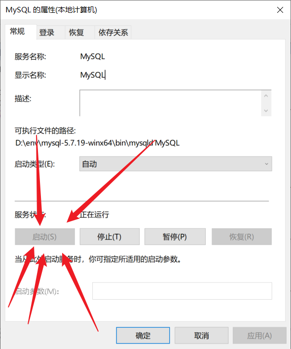

# Sqoop


## 一、错误：找不到或无法加载主类

- 报错一

  ```
  错误: 找不到或无法加载主类 org.apache.hadoop.hbase.util.GetJavaProperty
  ```

- 解决方案

  ```sh
  我们需要改一下hbase/bin/目录下的hbase文件
  
  cd /opt/bigdata/hbase/bin
  vi hbase
  
  切到182行，在add_to_cp_if_exists “${HBASE_HOME}/hbase-server/target” 这里下面加上两行
  
          # Needed for GetJavaProperty check below
      add_to_cp_if_exists "${HBASE_HOME}/hbase-server/target/classes"
  
  把下面大概186，187行的
  
  	#add the hbase jars for each module
  	for f in $HBASE_HOME/hbase-jars/hbase*.jar; do
  		if [[ $f = *sources.jar ]]
  	  then
  	    : # Skip sources.jar
  	  elif [ -f $f ]
  	  then
  	    CLASSPATH=${CLASSPATH}:$f;
  	  fi
  	done
  
  这段删掉。
  切到大概310行左右，在 if [ -n “KaTeX parse error: Expected 'EOF', got '&' at position 21: …OP_IN_PATH}" ] &̲& [ -f "{HADOOP_IN_PATH}” ]; then 下面加上一段：
  
    # If built hbase, temporarily add hbase-server*.jar to classpath for GetJavaProperty
    # Exclude hbase-server*-tests.jar
    temporary_cp=
    for f in "${HBASE_HOME}"/lib/hbase-server*.jar; do
      if [[ ! "${f}" =~ ^.*\-tests\.jar$ ]]; then
        temporary_cp=":$f"
      fi
    done
  
  然后把 
  	HADOOP_JAVA_LIBRARY_PATH=(HADOOP_CLASSPATH="(HADOOPCLASSPATH="CLASSPATH" “${HADOOP_IN_PATH}” \ 
  改成
     HADOOP_JAVA_LIBRARY_PATH=$(HADOOP_CLASSPATH="$CLASSPATH${temporary_cp}" "${HADOOP_IN_PATH}" \
  
  然后wq保存退出，重启一下hbase，就可以了。
  很好！我知道你肯定想吐槽我不知道我写的什么东西，所以你再看看下面链接你就懂了。
  https://reviews.apache.org/r/69299/diff/2/?expand=1
  然后再查一下，正常了，其实我i也不知道这个报错有什么影响，因为就算不改，hbase好像是可以正常使用的。
  ```


- 报错二

  ```
  错误: 找不到或无法加载主类 org.apache.sqoop.Sqoop
  ```

- 解决方案

  ```sh
  sqoop-1.4.x.tar.gz在1.4.5以上的安装包已经没有了这个jar包
  去官网下载并解压sqoop-1.4.6.bin_hadoop-2.0.4-alpha.tar.gz中的sqoop-1.4.6.jar
  将其上传到hadoop/share/hadoop/mapreduce/的lib目录下解决
  ```

  

## 二、sqoop向Hbase导入数据

- 背景描述

  > sqoop1.4.6    hbase2.1.0  Hadoop3.1.3

- 报错信息

  ```
  Exception in thread "main" java.lang.NoSuchMethodError: org.apache.hadoop.hbase.client.HBaseAdmin.<init>(Lorg/apache/hadoop/conf/Configuration;)V
  ```

- 解决方法

  ```
  因为hbase版本太高啦，把一个低本的hbase的lib目录下的jar包，复制到 sqooop/lib，就可以了
  我复制的是hbase1.3.1的，测试可用
  ```

  


# Hbase


## 一、无法启动hbase  

- 背景描述

  > hbase2.1.0   Hadoop3.3.1  ZK已启动    后台无进程 web打不开

  ```sh
  #报错信息
  ERROR [main] master.HMasterCommandLine: Master exiting
  java.lang.RuntimeException: Failed construction of Master: class org.apache.hadoop.hbase.master.HMaster.
  ```

- 解决三台相同操作

  ```sh
  将hbase/lib/client-facing-thirdparty/htrace-core-3.1.0-incubating.jar文件拷贝到/hbase/lib/下面即可
  
  cp hbase/lib/client-facing-thirdparty/htrace-core-3.1.0-incubating.jar  /hbase/lib/
  ```


## 二、phoenix连接hbase报错


- 背景

  > phoenix  hbase2.1.0   Hadoop3.3.1  ZK已启动

- ```sh
  #终端报错信息
  Inconsistent namespace mapping properties. Ensure that config phoenix.schema.isName
  ```

- 解决方法

  ```sh
  将hbase/conf/hbase-site.xml拷贝至 phoenix/bin/hbase-site.xml  无需分发
  ```

  

# Azkaban

## 一、azkaban执行javaprocess任务失败

- 背景

  > azkaban3.84.4    jdk1.8 

- 报错信息

  ```
  #丢失 ，简单概括
  集群的jdk为jdk1.8  而本机jdk为openjdk18 两个jdk中的jre版本不同 
  所以报错
  ```

- 解决方法

  ```
  重新下载jdk1.8 配置到idea  maven打包 
  ```

  - maven在打包时发生错误

    ```sh
    #终端报错信息
    maven无效的目标发行版: 16
    ```

    解决方法

    ```sh
    将pom文件的
    <build>   </build>  
    <properties>     </properties>
    删除重新打包解决🧨
    ```

    

## 二、azkaban所有job都失败

- 背景

  > azkaban3.84.4    jdk1.8     azkaban集群部署  3台exec  1台 web

- 报错信息

  ```
  azkaban.utils.UndefinedPropertyException: Missing required property'azkaban.native.lib'  👈
  	at azkaban.utils.Props.getString(Props.java:450)
  	at azkaban.jobExecutor.ProcessJob.run(ProcessJob.java:242)
  	at azkaban.execapp.JobRunner.runJob(JobRunner.java:823)
  	at azkaban.execapp.JobRunner.doRun(JobRunner.java:602)
  	at azkaban.execapp.JobRunner.run(JobRunner.java:563)
  	at java.util.concurrent.Executors$RunnableAdapter.call(Executors.java:511)
  	at java.util.concurrent.FutureTask.run(FutureTask.java:266)
  	at java.util.concurrent.ThreadPoolExecutor.runWorker(ThreadPoolExecutor.java:1149)
  	at java.util.concurrent.ThreadPoolExecutor$Worker.run(ThreadPoolExecutor.java:624)
  	at java.lang.Thread.run(Thread.java:748)
  13-04-2022 16:33:54 CST jobA ERROR - Missing required property 'azkaban.native.lib' cause: null  👈
  13-04-2022 16:33:54 CST jobA INFO - Finishing job jobA at 1649838834255 with status FAILED
  ```

- 解决方法

  ```sh
  出现这个错误时，
  查看选项 
  $vim /opt/module/azkaban/azkaban-exec/conf/azkaban.properties
  azkaban.jobtype.plugin.dir=plugins/jobtypes
  
  #改为全路径
  azkaban.jobtype.plugin.dir=/opt/module/azkaban/azkaban-exec/plugins/jobtypes
  
  #在azkaban-exec/plugins/jobtypes 目录下添加commonprivate.properties配置文件，
  内容中添加：azkaban.native.lib=false
  
  
  #分发
  #之后再次重启
  ```

  

# Maxwell


## MySQL

- 背景

  > maxwell1.29.2在配置mysqlbinlog时  在/var/lib/mysql没有binlog文件生成且在mysql中log_bin为off

- 解决方法

  ```sh
  #查看binlog是否开启
  mysql>show variables like 'log_bin';
  
  由于在修改/etc/my.cnf文件时发现为只读文件无法写入配置，
  所以修改权限写入配置
  但此文件的权限如果不是-r--r--r--则无法更新配置
  修改权限
  chmod a+r my.cnf
  chmod a-wx my.cnf
  查看权限
  sudo ls -l
  
  重启mysql完美解决
  sudo systemctl restart mysqld
  ```
  
  


# Mysql


- 背景

  > Win10 安装Mysql压缩版  安装初始化完毕    无法连接

- 报错信息

  ```shell
  ERROR 2003 (HY000): Can't connect to MySQL server on 'localhost' (10061)
  ```

- 解决方法

  win+R   👉  输入  `services.msc`     👉  找到MySQL  👉  双击  👉  启动

  

- ```shell
  #再次初始化完美解决
  ```

  


# Git

- 背景

  > Git 命令窗口中连接 
  >
  > ```sh
  > $ssh git@github.com
  > ```
  >
  > 报错

- 报错信息

  ```sh
  ssh: Could not resolve hostname github.com: Name or service not known
  ```

- 解决方法

  1、通过 [点我](https://ipaddress.com/website/github.com)  查看GitHub的IP

  2、进入`C:\Windows\System32\drivers\etc`

  3、修改Host文件

  ```sh
  添加如下内容👇
  
  140.82.113.4    github.com
  ```

  4、保存退出再次测试即可连接


# Spark


## Sql

- 背景

  > 运行Spark beeline报错       		zk  hadoop  hiveservices2    sparkThrift Server 已启动 

- 报错信息

  ```sh
  Error: Could not open client transport with JDBC Uri: jdbc:hive2://hadoop102:10000: Failed to open new session: java.lang.RuntimeException: org.apache.hadoop.ipc.RemoteException(org.apache.hadoop.security.authorize.AuthorizationException): User: atguigu is not allowed to impersonate root (state=08S01,code=0)
  Beeline version 2.3.7 by Apache Hive
  ```

- 解决方法

  1. 找到Hadoop的 core-site.xml  添加如下内容

     ```xml
         <property>
             <name>hadoop.proxyuser.root.hosts</name>
             <value>*</value>
         </property>
     
         <property>
             <name>hadoop.proxyuser.root.groups</name>
             <value>*</value>
         </property>
     ```

  2. 重启Hadoop 完美解决


