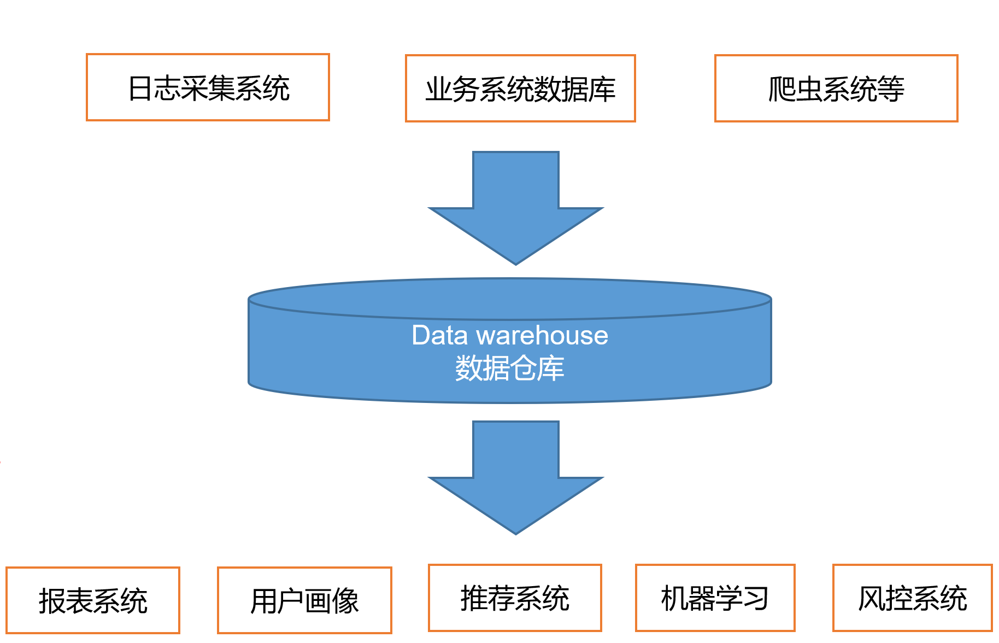
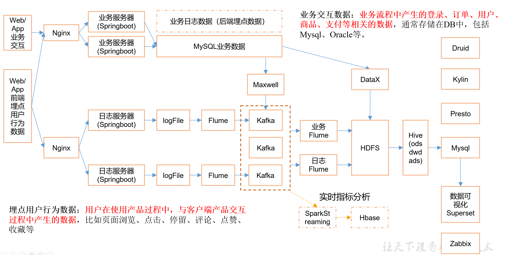
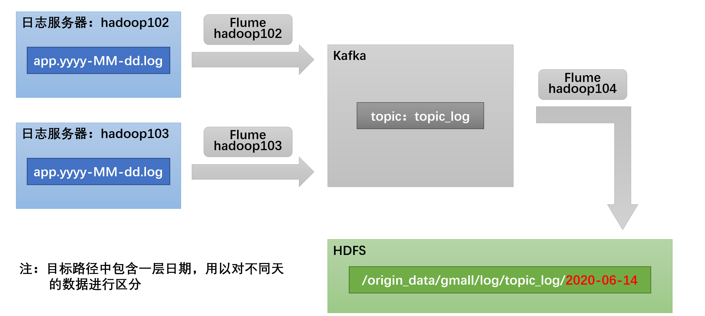
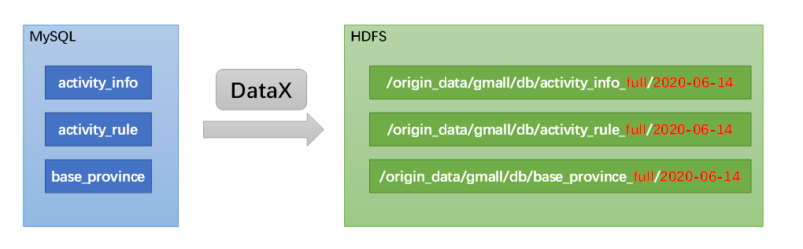

# 一、前置知识介绍

## 简介

> 数据仓库（ Data Warehouse ），是为企业所有决策制定过程，提供所有系统数据支持的战略集合。



通过对数据仓库中数据的分析，可以帮助企业，改进业务流程、控制成本、提高产品质量等。

==数据仓库，并不是数据的最终目的地，而是为数据最终的目的地做好准备。==

这些准备包括对数据的：

- 清洗	转义	分类	重组	合并	拆分	统计等等


## 需求及框架

### 项目需求

- 用户行为数据	业务数据 采集平台搭建
- **数仓维度建模**
- 分析指标
- **使用即席查询工具  随时分析指标**
- **对集群性能监控  异常时报警**
- **元数据管理**
- **质量监控**


### 项目框架

#### 👇技术选型

> 技术选型主要考虑因素：数据量大小、业务需求、行业内经验、技术成熟度、开发维护成本、总成本预算


| 各大模块       | 框架                                |
| -------------- | ----------------------------------- |
| 数据采集传输： | Flume，DataX，Maxwell，Sqoop，Kafka |
| 数据存储：     | MySql，HDFS，HBase，Redis，MongoDB  |
| 数据计算：     | Hive，Tez， Spark， Flink，Storm    |
| 数据查询：     | Presto，Kylin ，Impala，Druid       |
| 数据可视化：   | Superset、QuickBI、DataV            |
| 任务调度：     | DolphinScheduler、Azkaban、Oozie    |
| 集群监控：     | Zabbix                              |
| 元数据管理     | Atlas                               |

#### 👇数据流程设计




#### 👇框架版本选择

- **Apache：**运维麻烦，组件间兼容性需要自己调研。[^（一般大厂使用，技术实力雄厚，有专业的运维人员） **（**建议使用）]
- **CDH：**国内使用最多的版本，但CM不开源，今年开始要收费，一个节点1万美金。
- **HDP：**开源，可以进行二次开发，但是没有CDH稳定，国内使用较少

**👉确定版本型号**

| **产品**      | **版本** |
| ------------- | -------- |
| **Java**      | 1.8      |
| **Hadoop**    | 3.1.3    |
| **Hive**      | 3.1.2    |
| **Flume**     | 1.9.0    |
| **Zookeeper** | 3.5.7    |
| **Kafka**     | 2.4.1    |
| **DataX**     | 3.0      |
| **Maxwell**   | 1.29.2   |


#### 👇服务器选型

- **物理机**

  | 128G | 20核CPU | 8T 机械HDD | 2T固态SSD | 戴尔 |
  | ---- | ------- | ---------- | --------- | ---- |

  售价  4W   寿命  5 年  	运维一月  1 W

- **云主机**

  一年   5W  	磁盘贵     不需要运维

- **如何选择？🤔**

  - 有钱的和  与主机商  无冲突选   云
  - 中小型       为了上市选  云   上市拉到融资选  物理
  - 有长期打算资金充足选   物理机


#### 👇集群资源规划

##### 确认规模

**如何确认集群规模？😶**

1. **计算数据量**

   DAU = 100W人   一人100条		100W*100  =1亿条

2. **确认数据总大小**

   一条 1K  一天1亿条		1亿  /1024 /1024=  大约100G

3. **计算 一年或半年量**

   半年不扩容   	100G*180 =18T

4. **乘上副本数量**

   18T*3  = 54T

5. **预留20%~30%**

   54T  /   0.7  =77T

6. **汇总**

   大约需要   8T  的机器   10 台

   

##### 具体规划

​																						**以下为测试规划👇	**


| 服务名称           | 子服务           | 服务器  hadoop102 | 服务器  hadoop103 | 服务器  hadoop104 |
| ------------------ | ---------------- | ----------------- | ----------------- | ----------------- |
| HDFS               | NameNode         | √                 |                   |                   |
| DataNode           | √                | √                 | √                 |                   |
| SecondaryNameNode  |                  |                   | √                 |                   |
| Yarn               | NodeManager      | √                 | √                 | √                 |
| Resourcemanager    |                  | √                 |                   |                   |
| Zookeeper          | Zookeeper Server | √                 | √                 | √                 |
| Flume(采集日志)    | Flume            | √                 | √                 |                   |
| Kafka              | Kafka            | √                 | √                 | √                 |
| Flume（消费Kafka） | Flume            |                   |                   | √                 |
| Hive               | Hive             | √                 |                   |                   |
| MySQL              | MySQL            | √                 |                   |                   |
| DataX              | DataX            | √                 |                   |                   |
| Maxwell            | Maxwell          | √                 |                   |                   |
| Presto             | Coordinator      | √                 |                   |                   |
| Worker             | √                | √                 | √                 |                   |
| DolphinScheduler   | MasterServer     | √                 |                   |                   |
| WorkerServer       | √                | √                 | √                 |                   |
| Druid              | Druid            | √                 | √                 | √                 |
| Kylin              |                  | √                 |                   |                   |
| Hbase              | HMaster          | √                 |                   |                   |
| HRegionServer      | √                | √                 | √                 |                   |
| Superset           |                  | √                 |                   |                   |
| Atlas              |                  | √                 |                   |                   |
| Solr               | Jar              | √                 | √                 | √                 |


# 二、搭建流程

## 日志数据采集模块

### 用户行为日志

#### 概述

> 用户行为日志的内容，主要包括用户的各项**行为信息**以及行为所处的**环境信息**。收集这些信息的主要目的是优化产品和为各项分析统计指标提供数据支撑。

**👉收集这些信息的手段通常为埋点。**

目前主流的埋点方式有

- 代码埋点（前端/后端）
- 可视化埋点
- 全埋点等

|  埋点方式  |                             介绍                             |
| :--------: | :----------------------------------------------------------: |
|  代码埋点  | 是通过调用埋点SDK函数，在需要埋点的业务逻辑功能位置调用接口，上报埋点数据。例如，我们对页面中的某个按钮埋点后，当这个按钮被点击时，可以在这个按钮对应的 OnClick 函数里面调用SDK提供的数据发送接口，来发送数据 |
| 可视化埋点 | 只需要研发人员集成采集 SDK，不需要写埋点代码，业务人员就可以通过访问分析平台的“圈选”功能，来“圈”出需要对用户行为进行捕捉的控件，并对该事件进行命名。圈选完毕后，这些配置会同步到各个用户的终端上，由采集 SDK 按照圈选的配置自动进行用户行为数据的采集和发送。 |
|   全埋点   | 是通过在产品中嵌入SDK，前端自动采集页面上的全部用户行为事件，上报埋点数据，相当于做了一个统一的埋点。然后再通过界面配置哪些数据需要在系统里面进行分析。 |


#### 日志内容

------


|   主要内容   |                             介绍                             |
| :----------: | :----------------------------------------------------------: |
| 页面浏览记录 | 页面浏览记录，记录的是访客对页面的浏览行为，该行为的环境信息主要有用户信息、时间信息、地理位置信息、设备信息、应用信息、渠道信息及页面信息等。 |
|   动作记录   | 动作记录，记录的是用户的业务操作行为，该行为的环境信息主要有用户信息、时间信息、地理位置信息、设备信息、应用信息、渠道信息及动作目标对象信息等。 |
|   曝光记录   | 曝光记录，记录的是曝光行为，该行为的环境信息主要有用户信息、时间信息、地理位置信息、设备信息、应用信息、渠道信息及曝光对象信息等。 |
|   启动记录   | 启动记录，记录的是用户启动应用的行为，该行为的环境信息主要有用户信息、时间信息、地理位置信息、设备信息、应用信息、渠道信息、启动类型及开屏广告信息等。 |
|   错误记录   | 启动记录，记录的是用户在使用应用过程中的报错行为，该行为的环境信息主要有用户信息、时间信息、地理位置信息、设备信息、应用信息、渠道信息、以及可能与报错相关的页面信息、动作信息、曝光信息和动作信息。 |


#### 日志格式

------

**我们的日志结构大致可分为两类**

- **页面日志**

  页面日志，以页面浏览为单位，即一个页面浏览记录，生成一条页面埋点日志。

  一条**完整**的页面日志包含，一个页面浏览记录，若干个用户在该页面所做的动作记录，若干个该页面的曝光记录，以及一个在该页面发生的报错记录。

  除上述行为信息，页面日志还包含了这些行为所处的各种环境信息，

  包括用户信息、时间信息、地理位置信息、设备信息、应用信息、渠道信息等。

- **启动日志**

  启动日志以启动为单位，及一次启动行为，生成一条启动日志。

  一条完整的启动日志包括一个启动记录，一个本次启动时的报错记录，

  以及启动时所处的环境信息，包括用户信息、时间信息、地理位置信息、设备信息、应用信息、渠道信息等。

  


​																							**数据通道图👇**




### 环境准备

------

> 三台虚拟机    			模拟数据 				常用脚本

#### 虚拟机

- 模板机器克隆   注意：[^网段和	网关  windows的hosts文件   虚拟网络编辑器  文件夹   防火墙    用户权限 ]

- 修改三台的的  IP  hostname  重启

- 配置免密  

- 卸载JDK  重装并配置JDK

  - 上传并解压

    ```sh
    # tar -zxvf jdk-8u212-linux-x64.tar.gz -C /opt/module/
    ```

  - 配置环境变量 

    ```sh
    # sudo vim /etc/profile.d/my_env.sh
    
    #JAVA_HOME
    export JAVA_HOME=/opt/module/jdk1.8.0_212
    export PATH=$PATH:$JAVA_HOME/bin
    ```

  - 分发  并使其生效

    ```sh
    $xsync /opt/module/jdk1.8.0_212/
    
    $xcall source /etc/profile.d/my_env.sh
    ```

[xsync点我](#####xsync)						[xcall点我](#####xcall)


#### 模拟数据

------

> 主要在102  和103  上生成模拟数据

- 创建文件夹  并上传模拟器文件

  ```sh
  $ mkdir /opt/module/applog
  
  #将application.yml、
  #gmall2020-mock-log-2021-10-10.jar、
  #path.json、
  #logback.xml
  #上传到hadoop102的/opt/module/applog目录下
  ```

- 修改配置文件

  - [^path.json]: 该文件用来配置访问路径，可以根据需求，灵活配置用户访问路径。

  - **logback配置文件**：配置日志生成路径

    ```xml
    <?xml version="1.0" encoding="UTF-8"?>
    <configuration>
          <!--				👇					👇 -->
        <property name="LOG_HOME" value="/opt/module/applog/log" />
        <appender name="console" class="ch.qos.logback.core.ConsoleAppender">
            <encoder>
                <pattern>%msg%n</pattern>
            </encoder>
        </appender>
    
        <appender name="rollingFile" class="ch.qos.logback.core.rolling.RollingFileAppender">
            <rollingPolicy class="ch.qos.logback.core.rolling.TimeBasedRollingPolicy">
                <fileNamePattern>${LOG_HOME}/app.%d{yyyy-MM-dd}.log</fileNamePattern>
            </rollingPolicy>
            <encoder>
                <pattern>%msg%n</pattern>
            </encoder>
        </appender>
        <!-- 将某一个包下日志单独打印日志 -->
        <logger name="com.atguigu.gmall2020.mock.log.util.LogUtil"
                level="INFO" additivity="false">
            <appender-ref ref="rollingFile" />
             <appender-ref ref="console" />
        </logger>
    
        <root level="error"  >
            <appender-ref ref="console" />
            <!-- <appender-ref ref="async-rollingFile" />  -->
        </root>
    </configuration>
    
    ```

  - 生成日志

    ```sh
    applog]$ java -jar gmall2020-mock-log-2021-10-10.jar
    ```
    
  - 编写自动生成脚本
  
    [lg.sh](#####lg)
  
  


#### 常用脚本

------

> 注意  要在用户的bin下创建脚本  
>
>    创建后保存退出   赋权  
>
> ```sh
> chown  +x    $脚本名字$
> ```

##### xsync

```sh
#!/bin/bash

#1. 判断参数个数
if [ $# -lt 1 ]
then
    echo Not Enough Arguement!
    exit;
fi

#2. 遍历集群所有机器
for host in hadoop102 hadoop103 hadoop104
do
    echo ====================  $host  ====================
    #3. 遍历所有目录，挨个发送

    for file in $@
    do
        #4. 判断文件是否存在
        if [ -e $file ]
            then
                #5. 获取父目录
                pdir=$(cd -P $(dirname $file); pwd)

                #6. 获取当前文件的名称
                fname=$(basename $file)
                ssh $host "mkdir -p $pdir"
                rsync -av $pdir/$fname $host:$pdir
            else
                echo $file does not exists!
        fi
    done
done

```

##### xcall

```sh
#!/bin/bash

# 获取控制台指令

cmd=$*

# 判断指令是否为空
if [ ! -n "$cmd" ]
then
        echo "command can not be null !"
        exit
fi

# 获取当前登录用户
user=`whoami`

# 在从机执行指令,这里需要根据你具体的集群情况配置，host与具体主机名一致，同上
for (( host=2;host<=4;host++ ))
do
        echo "================current host is hadoop10$host================="
        echo "--> excute command \"$cmd\""
        ssh $user@hadoop10$host $cmd
done

echo "excute successfully !"
```

##### lg

```sh
#!/bin/bash
for i in hadoop102 hadoop103; do
    echo "========== $i =========="
    ssh $i "cd /opt/module/applog/; java -jar gmall2020-mock-log-2021-10-10.jar >/dev/null 2>&1 &"
done 

```

##### jpsall

```sh
#! /bin/bash
 
for i in hadoop102 hadoop103 hadoop104
do
    echo --------- $i ----------
    ssh $i "jps $@ | grep -v Jps"
done

```


### 采集模块框架安装

> 上传  解压  配置环境  不予赘述

#### Hadoop

------

**项目经验**

- **HDSF存储多目录**[^本项目不开]

  - 查看磁盘使用情况

    ```sh
    $df -h
    ```

  - 在`hdfs-site.xml`文件中配置多目录

    ```xml
    <property>
        <name>dfs.datanode.data.dir</name>        
     				   <value>file:///dfs/data1,file:///hd2/dfs/data2,file:///hd3/dfs/data3,file:///hd4/dfs/data4</value>
    </property>
    ```

    ==注意：每台服务器挂载的磁盘不一样，所以每个节点的多目录配置可以不一致。单独配置即可。==

  

- **集群数据均衡**

  - 节点间数据均衡

    ```sh
    #开启
    start-balancer.sh -threshold 10
    #停止
    stop-balancer.sh
    ```
    
    [^10]: 代表的是集群中各个节点的磁盘空间利用率相差不超过10%，可根据实际情况进行调整。
    
  - 磁盘间数据均衡[^一块磁盘不用开]
  
    ```sh
    生成均衡计划（我们只有一块磁盘，不会生成计划）
    hdfs diskbalancer -plan hadoop103
    执行均衡计划
    hdfs diskbalancer -execute hadoop103.plan.json
    查看当前均衡任务的执行情况
    hdfs diskbalancer -query hadoop103
    取消均衡任务
    hdfs diskbalancer -cancel hadoop103.plan.json
    ```


- **参数调优**

  - HDFS参数调优hdfs-site.xml

    ```xml
    NameNode有一个工作线程池，用来处理不同DataNode的并发心跳以及客户端并发的元数据操作。
    对于大集群或者有大量客户端的集群来说，通常需要增大参数dfs.namenode.handler.count的默认值10。
    <property>
        <name>dfs.namenode.handler.count</name>
        <value>10</value>
    </property>
    ```

    使用Python计算该值

    ​																			**公式如下👇**
    $$
    dfs.namenode.handler.count=20\times\log_e(集群机器总数)
    $$

    ```sh
    $ python
    >>> import math
    >>> print int(20*math.log(8))
    41
    >>> quit()
    ```

  - YARN参数调优yarn-site.xml

    - **背景**：7台机器，每天几亿条数据，数据源->Flume->Kafka->HDFS->Hive

    - **问题**：数据统计主要用HiveSQL，没有数据倾斜，小文件已经做了合并处理，开启的JVM重用，而且IO没有阻塞，==内存用了不到50%==。但是还是跑的非常慢，而且数据量洪峰过来时，整个集群都会宕掉。基于这种情况有没有优化方案。

    - **解决**

      [^yarn.nodemanager.resource.memory-mb]:表示该节点上YARN可使用的物理内存总量，默认是8192（MB），注意，如果你的节点内存资源不够8GB，则需要调减小这个值，而YARN不会智能的探测节点的物理内存总量。
      [^yarn.scheduler.maximum-allocation-mb]:单个任务可申请的最多物理内存量，默认是8192（MB）


#### ZK

------

**启停脚本**

- ```sh
  #!/bin/bash
  
  case $1 in
  "start"){
  	for i in hadoop102 hadoop103 hadoop104
  	do
          echo ---------- zookeeper $i 启动 ------------
  		ssh $i "/opt/module/zookeeper-3.5.7/bin/zkServer.sh start"
  	done
  };;
  "stop"){
  	for i in hadoop102 hadoop103 hadoop104
  	do
          echo ---------- zookeeper $i 停止 ------------    
  		ssh $i "/opt/module/zookeeper-3.5.7/bin/zkServer.sh stop"
  	done
  };;
  "status"){
  	for i in hadoop102 hadoop103 hadoop104
  	do
          echo ---------- zookeeper $i 状态 ------------    
  		ssh $i "/opt/module/zookeeper-3.5.7/bin/zkServer.sh status"
  	done
  };;
  esac
  
  ```

  


#### Kafka

------

> Kafka 的运行依赖于 zookeeper，需要预先启动

**启停脚本**

- ```sh
  s#! /bin/bash
  
  case $1 in
  "start"){
      for i in hadoop102 hadoop103 hadoop104
      do
          echo " --------启动 $i Kafka-------"
          ssh $i "/opt/module/kafka/bin/kafka-server-start.sh -daemon /opt/module/kafka/config/server.properties"
      done
  };;
  "stop"){
      for i in hadoop102 hadoop103 hadoop104
      do
          echo " --------停止 $i Kafka-------"
          ssh $i "/opt/module/kafka/bin/kafka-server-stop.sh stop"
      done
  };;
  esac
  
  ```


**常用命令**

- 查看Topic

  ```sh
  bin/kafka-topics.sh  --bootstrap-server hadoop102:9092 \
   					  --list
  ```

- 创建Topic

  ```sh
  bin/kafka-topics.sh --create \
                      --bootstrap-server hadoop102:9092 \
                       --replication-factor 1 --partitions 1 \
                       --topic Hello-Kafka
  ```

- 删除Topic

  ```sh
  bin/kafka-topics.sh --bootstrap-server hadoop102:9092 \
  					--delete \
  					--topic topic_log
  ```

- 修改Topic属性

  ```sh
  修改分区数（注意：分区数只能增加，不能减少）
  bin/kafka-topics.sh --bootstrap-server hadoop102:9092 \
  					  --alter \
  					  --topic first \
  					  --partitions 3
  					  
  查看详情
  bin/kafka-topics.sh --bootstrap-server E-comp102:9092 \
  					  --describe \
                        --topic first
  ```

  

- 模拟生产者生产消息

  ```sh
  bin/kafka-console-producer.sh --bootstrap-server hadoop102:9092 --topic first
  ```

- 模拟消费者消费消息

  ```sh
  #不从头消费
  bin/kafka-console-consumer.sh --bootstrap-server hadoop102:9092 --topic first
  #从头消费
  bin/kafka-console-consumer.sh --bootstrap-server hadoop102:9092 --from-beginning --topic first
  ```

  

#### Flume

------

> 删除guava包  解决  新旧包冲突问题
>
> ```sh
> $ rm /opt/module/flume/lib/guava-11.0.2.jar
> ```
>
> 注意：删除guava-11.0.2.jar的服务器节点，一定要配置hadoop环境变量。否则会报异常。
>
> 环境不用配置  直接分发


**项目经验**

- 堆内存调整[^虚拟机不要配]

  ```xml
  修改/opt/module/flume/conf/flume-env.sh文件，配置如下参数
  export JAVA_OPTS="-Xms4096m -Xmx4096m -Dcom.sun.management.jmxremote"
  ```

  [^-Xms]: 表示JVM Heap(堆内存)最小尺寸，初始分配
  [^-Xmx]: 表示JVM Heap(堆内存)最大允许的尺寸，按需分配


### Flume采集和消费配置

------

> 需要在hadoop102，hadoop103两台节点配置日志采集Flume

选择  TaildirSource	+	KafkaChannel	并配置日志校验拦截器

**Source对比**

[^TaildirSource]:断点续传、多目录。Flume1.6以前需要自己自定义Source记录每次读取文件位置，实现断点续传
[^ExecSource]: 可以实时搜集数据，但是在Flume不运行或者Shell命令出错的情况下，数据将会丢失。
[^SpoolingDirectorySource]: 监控目录，支持断点续传


**使用Kafka Channel原因**

==采用Kafka Channel，省去了Sink，提高了效率==


#### 采集配置

------

- 创建配置文件

  ```sh
  [atguigu@hadoop104 flume]$ mkdir job
  [atguigu@hadoop104 flume]$ vim job/file_to_kafka.conf 
  ```

- 写入内容

  ```sh
  #为各组件命名
  a1.sources = r1
  a1.channels = c1
  
  #描述source
  a1.sources.r1.type = TAILDIR
  a1.sources.r1.filegroups = f1
  a1.sources.r1.filegroups.f1 = /opt/module/applog/log/app.*
  a1.sources.r1.positionFile = /opt/module/flume/taildir_position.json
  a1.sources.r1.interceptors =  i1
  a1.sources.r1.interceptors.i1.type = com.atguigu.flume.interceptor.ETLInterceptor$Builder
  
  #描述channel
  a1.channels.c1.type = org.apache.flume.channel.kafka.KafkaChannel
  a1.channels.c1.kafka.bootstrap.servers = hadoop102:9092,hadoop103:9092
  a1.channels.c1.kafka.topic = topic_log
  a1.channels.c1.parseAsFlumeEvent = false
  
  #绑定source和channel以及sink和channel的关系
  a1.sources.r1.channels = c1
  
  ```

- 编写拦截器

  - 创建maven  创建包

  - 添加pom

    ```xml
    <dependencies>
        <dependency>
            <groupId>org.apache.flume</groupId>
            <artifactId>flume-ng-core</artifactId>
            <version>1.9.0</version>
            <scope>provided</scope>
        </dependency>
    
        <dependency>
            <groupId>com.alibaba</groupId>
            <artifactId>fastjson</artifactId>
            <version>1.2.62</version>
        </dependency>
    </dependencies>
    
    <build>
        <plugins>
            <plugin>
                <artifactId>maven-compiler-plugin</artifactId>
                <version>2.3.2</version>
                <configuration>
                    <source>1.8</source>
                    <target>1.8</target>
                </configuration>
            </plugin>
            <plugin>
                <artifactId>maven-assembly-plugin</artifactId>
                <configuration>
                    <descriptorRefs>
                        <descriptorRef>jar-with-dependencies</descriptorRef>
                    </descriptorRefs>
                </configuration>
                <executions>
                    <execution>
                        <id>make-assembly</id>
                        <phase>package</phase>
                        <goals>
                            <goal>single</goal>
                        </goals>
                    </execution>
                </executions>
            </plugin>
        </plugins>
    </build>
    
    ```

    [^Bulid中插件作用]: 不配置插件打包没有依赖
    
  - 在com.Ryan.flume.interceptor包下创建JSONUtils类  [^该工具类把判断是否为JSON 进行封装]
  
    ```java
    package com.Ryan.flume.interceptor;
    
    import com.alibaba.fastjson.JSONObject;
    
    public class JSONUtils {
        public static boolean isJSON(String str) {
            try {
                JSONObject.parseObject(str);
                return true;
            } catch (Exception e) {
                return false;
            }
        }
    }
    
    ```
  
  - 在com.Ryan.flume.interceptor包下创建ETLInterceptor类
  
    ```java
    package com.Ryan.flume.interceptor;
    
    
    import org.apache.flume.Context;
    import org.apache.flume.Event;
    import org.apache.flume.interceptor.Interceptor;
    
    import java.nio.charset.StandardCharsets;
    import java.util.List;
    
    public class ETLInterceptor implements Interceptor {
    
    
        @Override
        public void initialize() {
    
        }
    
        @Override
        public Event intercept(Event event) {
            //TODO 1 获取event的body
            byte[] body = event.getBody();
    
            //TODO 2 设置event的body编码
            String log = new String(body, StandardCharsets.UTF_8);
    
            //TODO 3 判断log是否json格式
            boolean flag = JSONUtils.isJSON(log);
            return flag ? event : null;
    
    
        }
    
    
    
    
        @Override
        public List<Event> intercept(List<Event> events) {
    
            //TODO 删除为null的event 使用迭代器
            // 可以使用lamda表达式代替
            events.removeIf(event -> intercept(event) == null);
    
    
            return events;
        }
    
        @Override
        public void close() {
    
        }
    
        public static class Builder implements Interceptor.Builder{
    
            @Override
            public Interceptor build() {
                return new ETLInterceptor();
            }
    
    
    
            @Override
            public void configure(Context context) {
    
            }
        }
    }
    
    ```
  
  - 打包
  
    
  
  - 上传至102 的     /opt/module/flume/lib文件夹下面
  
  - 分发  flume配置文件和刚上传的  拦截器jar包

##### 启停脚本

------

- 在102   用户bin下创建f1.sh

  ```sh
  bin]$ vim f1.sh
  ```

- 填入如下内容

  ```sh
  #!/bin/bash
  
  case $1 in
  "start"){
          for i in hadoop102 hadoop103
          do
                  echo " --------启动 $i 采集flume-------"
                  ssh $i "nohup /opt/module/flume/bin/flume-ng agent -n a1 -c /opt/module/flume/conf/ -f /opt/module/flume/job/file_to_kafka.conf >/dev/null 2>&1 &"
          done
  };; 
  "stop"){
          for i in hadoop102 hadoop103
          do
                  echo " --------停止 $i 采集flume-------"
                  ssh $i "ps -ef | grep file_to_kafka.conf | grep -v grep |awk  '{print \$2}' | xargs -n1 kill -9 "
          done
  
  };;
  esac
  
  ```

  [^注意]: 别忘了赋权

  

#### 消费配置

------

> 此处选择KafkaSource、FileChannel、HDFSSink。

- **创建Flume配置文件并写入内容**

  ```properties
  #在hadoop102节点的Flume的job目录下创建kafka_to_hdfs.conf  并写入一下内容
  
  # Name the components on this agent
  a1.sources = r1
  a1.sinks = k1
  a1.channels = c1
  
  # Describe/configure the source
  a1.sources.r1.type = org.apache.flume.source.kafka.KafkaSource
  a1.sources.r1.kafka.bootstrap.servers = E-com102:9092
  a1.sources.r1.kafka.consumer.group.id = flume2
  a1.sources.r1.kafka.topics = topic_log
  
  a1.sources.r1.batchSize = 5000
  a1.sources.r1.batchDurationMillis = 2000
  
  a1.sources.r1.interceptors = i1
  a1.sources.r1.interceptors.i1.type = com.ryan.flume.interceptor.TimestampInterceptor$Builder
  
  
  # Describe the sink
  a1.sinks.k1.type = hdfs
  a1.sinks.k1.hdfs.path=/origin_data/gmall/log/topic_log/%Y-%m-%d
  a1.sinks.k1.hdfs.filePrefix=log-
  
  a1.sinks.k1.hdfs.rollInterval = 10
  a1.sinks.k1.hdfs.rollSize = 134217728
  a1.sinks.k1.hdfs.rollCount = 0
  
  a1.sinks.k1.hdfs.fileType=CompressedStream
  a1.sinks.k1.hdfs.codeC=gzip
  
  # Use a channel which buffers events in memory
  a1.channels.c1.type = file
  a1.channels.c1.dataDirs = /opt/module/flume/data/behavior1/
  a1.channels.c1.checkpointDir = /opt/module/flume/checkpoint/behavior1
  
  
  # Bind the source and sink to the channel
  a1.sources.r1.channels = c1
  a1.sinks.k1.channel = c1
  ```

  [^FileChannel优化]: 配置dataDirs    checkpointDir和backupCheckpointDir指  向多个路径，每个路径对应不同的硬盘，增大Flume吞吐量保证高可用
  [^HDFS Sink优化]: 配置hdfs.rollInterval=3600，hdfs.rollSize=134217728，hdfs.rollCount =0   文件在达到128M时会滚动生成新文件  文件创建超3600秒时会滚动生成新文件

- **编写Flume拦截器**

  [^解决零点漂移问题]: 就是时间戳使用数据内的时间戳    使用当前时间戳

  在com.ryan.flume.interceptor包下创建TimestampInterceptor类

  ```java
  package com.ryan.flume.interceptor;
  
  import com.alibaba.fastjson.JSONObject;
  import org.apache.flume.Context;
  import org.apache.flume.Event;
  import org.apache.flume.interceptor.Interceptor;
  
  import java.nio.charset.StandardCharsets;
  import java.util.List;
  import java.util.Map;
  
  public class TimestampInterceptor implements Interceptor {
      @Override
      public void initialize() {
  
      }
  
      @Override
      public Event intercept(Event event) {
  
          byte[] body = event.getBody();
  
          String log = new String(body, StandardCharsets.UTF_8);
  
          JSONObject jsonObject = JSONObject.parseObject(log);
          String ts = jsonObject.getString("ts");
  
  
          Map<String, String> headers = event.getHeaders();
          headers.put("timestamp",ts);
          return event;
      }
  
      @Override
      public List<Event> intercept(List<Event> events) {
  
          for (Event event : events) {
              intercept(event);
          }
          return events;
      }
  
      @Override
      public void close() {
  
      }
  
  
      public static class Builder implements Interceptor.Builder{
  
          @Override
          public Interceptor build() {
              return new TimestampInterceptor();
          }
  
          @Override
          public void configure(Context context) {
  
          }
      }
  }
  
  ```

- **重新打包放入102 lib下**
- **分发配置文件和jar包**


**测试**

- 按照顺序启动  zk  kafka  hadoop  

- 102  启动  flume  👉  kafka

  ```sh
  $f1.sh start
  ```

- 103 启动kafka消费者

  ```sh
  $kafka-console-consumer --bootstrap-server E-com102:9092 --topic topic_log
  ```

- 104  启动   kafka  👉  hdfs

  ```sh
  flume]$ bin/flume-ng agent -n a1 -c conf/ -f job/kafka_to_hdfs.conf -Dflume.root.logger=info,console
  ```

- 生成模拟数据

  ```sh
  $lg.sh
  ```

- 查看HDFS  是否生成数据


##### 启停脚本

```sh
#!/bin/bash

case $1 in
        "start")
        
                echo " --------启动消费日志flume-------"


                echo " --------E-com104-------"                
                ssh E-com104 "nohup /opt/module/flume/bin/flume-ng agent -n a1 -c /opt/module/flume/conf/ -f /opt/module/flume/job/kafka_to_hdfs.conf >/dev/null 2>&1 &"
        
        ;; 
        "stop")
        
                echo " --------停止消费日志flume-------"

                echo " --------E-com104-------"
                ssh $i "ps -ef | grep kafka_to_hdfs.conf | grep -v grep |awk  '{print \$2}' | xargs -n1 kill -9 "
        

        ;;
esac


```


### 采集通道启停脚本

```sh
#!/bin/bash

case $1 in
"start"){
        echo ================== 启动 集群 ==================

        #启动 Zookeeper集群
        zk.sh start

        #启动 Hadoop集群
        myhadoop.sh start

        #启动 Kafka采集集群
        kf.sh start

        #启动 Flume采集集群
        f1.sh start

        #启动 Flume消费集群
        f2.sh start

        };;
"stop"){
        echo ================== 停止 集群 ==================

        #停止 Flume消费集群
        f2.sh stop

        #停止 Flume采集集群
        f1.sh stop

        #停止 Kafka采集集群
        kf.sh stop

        #停止 Hadoop集群
        myhadoop.sh stop

        #停止 Zookeeper集群
        zk.sh stop

};;
esac

```


## 业务数据采集模块

> 主要对Mysql 数据库中的业务表操作


[^SKU=Stock Keeping Unit]:（库存量基本单位）
[^SPU（Standard Product Unit）]:是商品信息聚合的最小单位，是一组可复用、易检索的标准化信息集合
[^例子：]: iPhoneX手机就是SPU。一台银色、128G内存的、支持联通网络的iPhoneX，就是SKU

==SPU表示一类商品  同意SPU商品公用商品图片、海报等==


### 环境准备

------

#### 模拟数据

------

##### Mysql安装

- **卸载自带mysql-libs**

  ```sh
   rpm -qa | grep -i -E mysql\|mariadb | xargs -n1 sudo rpm -e --nodeps
  ```

- **在/opt/software下创建mysql文件夹并上传驱动和5个安装包**

- **使用rpm命令按照顺序安装**

  ```sh
  $ sudo rpm -ivh 01_mysql-community-common-5.7.16-1.el7.x86_64.rpm
  ```

- **启动mysql**

  ```sh
  $ sudo systemctl start mysqld
  ```

- **查看mysql密码**

  ```sh
  $ sudo cat /var/log/mysqld.log | grep password
  ```

  

##### Mysql配置

- **使用刚才查到的密码登陆**

  ```sh
  $ mysql -uroot -p'password'
  ```

- **设置复杂密码(由于mysql密码策略，此密码必须足够复杂)**

  ```mysql
  mysql> set password=password("Qs23=zs32");
  ```

- **更改密码策略**

  ```mysql
  					👇密码最小长度
  mysql> set global validate_password_length=4;
  mysql> set global validate_password_policy=0;
  					 👆允许的不同字符个数  0表示不限制
  ```

- **设置简单好记的密码**

  ```sh
  mysql> set password=password("123456");
  ```

- **配置第三方访问**

  ```mysql
  mysql> use mysql
  mysql> select user, host from user;
  mysql> update user set host="%" where user="root";
  mysql> flush privileges;
  ```

- **退出**

  ```mysql
  mysql> quit;
  ```

  


##### 业务数据生成

- **通过navicat连接至mysql数据库**[^注意不要连错了]

- **创建gmall数据库设置编码为utf-8，排序规则为utf8_general_ci**

- **导入gmall.sql**

- **在/opt/module创建db_log文件夹**

  ```sh
  module]$ mkdir db_log/
  ```

- **上传gmall2020-mock-db-2021-11-14.jar和application.properties至该文件夹**

- **修改application.properties相关配置**、

  ```properties
  logging.level.root=info
  
  spring.datasource.driver-class-name=com.mysql.jdbc.Driver
  #										👇注意修改
  spring.datasource.url=jdbc:mysql://E-com102:3306/gmall?useUnicode=true&characterEncoding=utf-8&useSSL=false&serverTimezone=GMT%2B8
  spring.datasource.username=root
  spring.datasource.password=123456
  
  logging.pattern.console=%m%n
  
  
  mybatis-plus.global-config.db-config.field-strategy=not_null
  mybatis.mapperLocations=classpath:mapper/*.xml
  
  #业务日期
  mock.date=2020-06-14
  #🚩是否重置，首日须设置为1
  mock.clear=1
  #🚩是否重置用户，首日须设置为1
  mock.clear.user=1
  
  #生成新用户数量
  mock.user.count=200
  #男性比例
  mock.user.male-rate=20
  #用户数据变化概率
  mock.user.update-rate:20
  
  #收藏取消比例
  mock.favor.cancel-rate=10
  #收藏数量
  mock.favor.count=100
  
  #每个用户添加购物车的概率
  mock.cart.user-rate=10
  #每次每个用户最多添加多少种商品进购物车
  mock.cart.max-sku-count=8 
  #每个商品最多买几个
  mock.cart.max-sku-num=3 
  
  #购物车来源  用户查询，商品推广，智能推荐, 促销活动
  mock.cart.source-type-rate=60:20:10:10
  
  #用户下单比例
  mock.order.user-rate=30
  #用户从购物中购买商品比例
  mock.order.sku-rate=50
  #是否参加活动
  mock.order.join-activity=1
  #是否使用购物券
  mock.order.use-coupon=1
  #购物券领取人数
  mock.coupon.user-count=100
  
  #支付比例
  mock.payment.rate=70
  #支付方式 支付宝：微信 ：银联
  mock.payment.payment-type=30:60:10
  
  #评价比例 好：中：差：自动
  mock.comment.appraise-rate=30:10:10:50
  
  #退款原因比例：质量问题 商品描述与实际描述不一致 缺货 号码不合适 拍错 不想买了 其他
  mock.refund.reason-rate=30:10:20:5:15:5:5
  
  logging.level.com.atguigu.gmall2020.mock.db.mapper=debug
  ```

- **在该目录下执行**

  ```sh
  $ java -jar gmall2020-mock-db-2021-11-14.jar
  ```

- **查看gmall数据库**


### 应用安装部署

------

#### Hive

> **apache-hive-3.1.2-bin.tar.gz**

##### 安装

------


- 上传	解压	改名

- 配置环境变量  并 source

- 解决JAR包冲突

  ```sh
  #进入/opt/module/hive/lib
  $ mv log4j-slf4j-impl-2.10.0.jar log4j-slf4j-impl-2.10.0.jar.bak
  ```

  

##### 配置

------

**Hive元数据配置到MySQL**

- 拷贝驱动

  ```sh
  $ cp /opt/software/mysql-connector-java-5.1.27.jar /opt/module/hive/lib/
  ```

- 配置MySQL作为元数据存储

  - 在hive的lib下新建	`hive-site.xml`  写入以下内容

  - ```xml
    <?xml version="1.0"?>
    <?xml-stylesheet type="text/xsl" href="configuration.xsl"?>
    <configuration>
        <property>
            <name>javax.jdo.option.ConnectionURL</name>
            <value>jdbc:mysql://hadoop102:3306/metastore?useSSL=false</value>
        </property>
    
        <property>
            <name>javax.jdo.option.ConnectionDriverName</name>
            <value>com.mysql.jdbc.Driver</value>
        </property>
    
        <property>
            <name>javax.jdo.option.ConnectionUserName</name>
            <value>root</value>
        </property>
    
        <property>
            <name>javax.jdo.option.ConnectionPassword</name>
            <value>123456</value>
        </property>
    
        <property>
            <name>hive.metastore.warehouse.dir</name>
            <value>/user/hive/warehouse</value>
        </property>
    
        <property>
            <name>hive.metastore.schema.verification</name>
            <value>false</value>
        </property>
    
        <property>
        <name>hive.server2.thrift.port</name>
        <value>10000</value>
        </property>
    
        <property>
            <name>hive.server2.thrift.bind.host</name>
            <value>hadoop102</value>
        </property>
    
        <property>
            <name>hive.metastore.event.db.notification.api.auth</name>
            <value>false</value>
        </property>
        
        <property>
            <name>hive.cli.print.header</name>
            <value>true</value>
        </property>
    
        <property>
            <name>hive.cli.print.current.db</name>
            <value>true</value>
        </property>
    </configuration>
    
    ```

**初始化元数据库**

- 登陆Mysql

- 新建元数据库

  - ```mysql
    mysql> create database metastore;
    mysql> quit;
    ```

- ==初始化Hive元数据库==

  - ```sh
    $ schematool -initSchema -dbType mysql -verbose
    ```

    


##### 启动

------

- 启动Hive客户端

  - ```sh
    $bin/hive
    ```

- 查看数据库

  - ```mysql
    hive (default)> show databases;
    OK
    database_name
    default
    ```


##### 修改元数据库字符集

------

> Hive元数据库的字符集默认为Latin1，由于其不支持中文字符，故若建表语句中包含中文注释，会出现乱码现象
>

**修改Hive元数据库中存储注释的字段的字符集为utf-8**

- 字段注释

  - ```mysql
    mysql> alter table COLUMNS_V2 modify column COMMENT varchar(256) character set utf8;
    ```

- 表注释

  - ```mysql
    mysql> alter table TABLE_PARAMS modify column PARAM_VALUE mediumtext character set utf8;
    ```

- ==修改hive-site.xml中JDBC URL==

  - ```xml
    <property>
            <name>javax.jdo.option.ConnectionURL</name>
            <value>jdbc:mysql://hadoop102:3306/metastore?useSSL=false&amp;useUnicode=true&amp;characterEncoding=UTF-8</value>
        </property>
    ```

    

### 采集模块

------

> 数据的同步策略有**全量同步**和**增量同步**

[^全量同步]: 每天都将业务数据库中的全部数据同步一份到数据仓库，这是保证两侧数据同步的最简单的方式
[^增量同步]: 每天只将业务数据中的新增及变化数据同步到数据仓库。采用每日增量同步的表，通常需要在首日先进行一次全量同步


**对比**

| **同步策略** |            **优点**            |                           **缺点**                           |
| :----------: | :----------------------------: | :----------------------------------------------------------: |
| **全量同步** |            逻辑简单            | 在某些情况下效率较低。例如某张表数据量较大，但是每天数据的变化比例很低，若对其采用每日全量同步，则会重复同步和存储大量相同的数据。 |
| **增量同步** | 效率高，无需同步和存储重复数据 | 逻辑复杂，需要将每日的新增及变化数据同原来的数据进行整合，才能使用 |

==总结：大表全量，小表增量==


**数据同步工具**

------


- DataX、Sqoop为代表的基于Select查询的离线、批量同步工具
- Maxwell、Canal为代表的基于数据库数据变更日志的实时流式同步工具

==对比==

| **增量同步方案**   | **DataX/Sqoop**                                              | **Maxwell/Canal**                                            |
| ------------------ | ------------------------------------------------------------ | ------------------------------------------------------------ |
| **对数据库的要求** | 原理是基于查询，故若想通过select查询获取新增及变化数据，就要求数据表中存在create_time、update_time等字段，然后根据这些字段获取变更数据。 | 要求数据库记录变更操作，例如MySQL需开启binlog。              |
| **数据的中间状态** | 由于是离线批量同步，故若一条数据在一天中变化多次，该方案只能获取最后一个状态，中间状态无法获取。 | 由于是实时获取所有的数据变更操作，所以可以获取变更数据的所有中间状态。 |

#### 配置笔记

##### DataX

[DataX](..\..\DataX\1、DataX\DataX.md)

##### Maxwell

[Maxwell](..\..\Maxwell\1、Maxwell\Maxwell.md)


#### 全量同步

> 使用DataX  将 Mysql数据导入到HDFS

​																						**流程图👇**




##### 配置文件

------

​																						**以activity_info为例**

```json
{
    "job": {
        "content": [
            {
                "reader": {
                    "name": "mysqlreader",
                    "parameter": {
                        "column": [
                            "id",
                            "activity_name",
                            "activity_type",
                            "activity_desc",
                            "start_time",
                            "end_time",
                            "create_time"
                        ],
                        "connection": [
                            {
                                "jdbcUrl": [
                                    "jdbc:mysql://hadoop102:3306/gmall"
                                ],
                                "table": [
                                    "activity_info"
                                ]
                            }
                        ],
                        "password": "123456",
                        "splitPk": "",
                        "username": "root"
                    }
                },
                "writer": {
                    "name": "hdfswriter",
                    "parameter": {
                        "column": [
                            {
                                "name": "id",
                                "type": "bigint"
                            },
                            {
                                "name": "activity_name",
                                "type": "string"
                            },
                            {
                                "name": "activity_type",
                                "type": "string"
                            },
                            {
                                "name": "activity_desc",
                                "type": "string"
                            },
                            {
                                "name": "start_time",
                                "type": "string"
                            },
                            {
                                "name": "end_time",
                                "type": "string"
                            },
                            {
                                "name": "create_time",
                                "type": "string"
                            }
                        ],
                        "compress": "gzip",
                        "defaultFS": "hdfs://hadoop102:8020",
                        "fieldDelimiter": "\t",
                        "fileName": "activity_info",
                        "fileType": "text",
                        "path": "${targetdir}",
                        "writeMode": "append"
                    }
                }
            }
        ],
        "setting": {
            "speed": {
                "channel": 1
            }
        }
    }
}

```


##### 配置文件生成脚本

------

> **分为单个和批量**

###### ==单个==

- **在~/bin目录下创建gen_import_config.py脚本**

  ```sh
  $ vim ~/bin/gen_import_config.py 
  ```

- **脚本内容如下**

  ```python
  # coding=utf-8
  import json
  import getopt
  import os
  import sys
  import MySQLdb
  
  #MySQL相关配置，需根据实际情况作出修改
  mysql_host = "hadoop102"
  mysql_port = "3306"
  mysql_user = "root"
  mysql_passwd = "123456"
  
  #HDFS NameNode相关配置，需根据实际情况作出修改
  hdfs_nn_host = "hadoop102"
  hdfs_nn_port = "8020"
  
  #生成配置文件的目标路径，可根据实际情况作出修改
  output_path = "/opt/module/datax/job/import"
  
  #获取mysql连接
  def get_connection():
      return MySQLdb.connect(host=mysql_host, port=int(mysql_port), user=mysql_user, passwd=mysql_passwd)
  
  #获取表格的元数据  包含列名和数据类型
  def get_mysql_meta(database, table):
      connection = get_connection()
      cursor = connection.cursor()
      sql = "SELECT COLUMN_NAME,DATA_TYPE from information_schema.COLUMNS WHERE TABLE_SCHEMA=%s AND TABLE_NAME=%s ORDER BY ORDINAL_POSITION"
      cursor.execute(sql, [database, table])
      fetchall = cursor.fetchall()
      cursor.close()
      connection.close()
      return fetchall
  
  #获取mysql表的列名
  def get_mysql_columns(database, table):
      return map(lambda x: x[0], get_mysql_meta(database, table))
  
  #将获取的元数据中mysql的数据类型转换为hive的数据类型  写入到hdfswriter中
  def get_hive_columns(database, table):
      def type_mapping(mysql_type):
          mappings = {
              "bigint": "bigint",
              "int": "bigint",
              "smallint": "bigint",
              "tinyint": "bigint",
              "decimal": "string",
              "double": "double",
              "float": "float",
              "binary": "string",
              "char": "string",
              "varchar": "string",
              "datetime": "string",
              "time": "string",
              "timestamp": "string",
              "date": "string",
              "text": "string"
          }
          return mappings[mysql_type]
  
      meta = get_mysql_meta(database, table)
      return map(lambda x: {"name": x[0], "type": type_mapping(x[1].lower())}, meta)
  
  #生成json文件
  def generate_json(source_database, source_table):
      job = {
          "job": {
              "setting": {
                  "speed": {
                      "channel": 3
                  },
                  "errorLimit": {
                      "record": 0,
                      "percentage": 0.02
                  }
              },
              "content": [{
                  "reader": {
                      "name": "mysqlreader",
                      "parameter": {
                          "username": mysql_user,
                          "password": mysql_passwd,
                          "column": get_mysql_columns(source_database, source_table),
                          "splitPk": "",
                          "connection": [{
                              "table": [source_table],
                              "jdbcUrl": ["jdbc:mysql://" + mysql_host + ":" + mysql_port + "/" + source_database]
                          }]
                      }
                  },
                  "writer": {
                      "name": "hdfswriter",
                      "parameter": {
                          "defaultFS": "hdfs://" + hdfs_nn_host + ":" + hdfs_nn_port,
                          "fileType": "text",
                          "path": "${targetdir}",
                          "fileName": source_table,
                          "column": get_hive_columns(source_database, source_table),
                          "writeMode": "append",
                          "fieldDelimiter": "\t",
                          "compress": "gzip"
                      }
                  }
              }]
          }
      }
      if not os.path.exists(output_path):
          os.makedirs(output_path)
      with open(os.path.join(output_path, ".".join([source_database, source_table, "json"])), "w") as f:
          json.dump(job, f)
  
  
  def main(args):
      source_database = ""
      source_table = ""
  
      options, arguments = getopt.getopt(args, '-d:-t:', ['sourcedb=', 'sourcetbl='])
      for opt_name, opt_value in options:
          if opt_name in ('-d', '--sourcedb'):
              source_database = opt_value
          if opt_name in ('-t', '--sourcetbl'):
              source_table = opt_value
  
      generate_json(source_database, source_table)
  
  
  if __name__ == '__main__':
      main(sys.argv[1:])
  
  ```

- **使用说明**

  - **安装Python访问Mysql数据库驱动**

    ```sh
    $ sudo yum install -y MySQL-python
    ```

  - ```python
    python gen_import_config.py -d database -t table
    ```

    [^参数说明]: 通过-d传入数据库名，-t传入表名，执行上述命令即可生成该表的DataX同步配置文件
    
    

###### ==批量==

- **在~/bin目录下创建gen_import_config.sh脚本**

  ```sh
  $ vim ~/bin/gen_import_config.sh
  ```

- **输入如下内容**

  ```sh
  #!/bin/bash
  
  python ~/bin/gen_import_config.py -d gmall -t activity_info
  python ~/bin/gen_import_config.py -d gmall -t activity_rule
  python ~/bin/gen_import_config.py -d gmall -t base_category1
  python ~/bin/gen_import_config.py -d gmall -t base_category2
  python ~/bin/gen_import_config.py -d gmall -t base_category3
  python ~/bin/gen_import_config.py -d gmall -t base_dic
  python ~/bin/gen_import_config.py -d gmall -t base_province
  python ~/bin/gen_import_config.py -d gmall -t base_region
  python ~/bin/gen_import_config.py -d gmall -t base_trademark
  python ~/bin/gen_import_config.py -d gmall -t cart_info
  python ~/bin/gen_import_config.py -d gmall -t coupon_info
  python ~/bin/gen_import_config.py -d gmall -t sku_attr_value
  python ~/bin/gen_import_config.py -d gmall -t sku_info
  python ~/bin/gen_import_config.py -d gmall -t sku_sale_attr_value
  python ~/bin/gen_import_config.py -d gmall -t spu_info
  
  ```

- **执行**

  ```sh
  $ gen_import_config.sh
  ```

- **在/opt/module/datax/job/import/下查看文件**


##### 全量表数据同步脚本

------

>   为了解决执行配置文件前需要在HDFS创建文件 和  手动一个一个执行

- **在~/bin目录创建mysql_to_hdfs_full.sh**

  ```sh
  $ vim ~/bin/mysql_to_hdfs_full.sh
  ```

- **内容如下**

  ```sh
  #!/bin/bash
  
  DATAX_HOME=/opt/module/datax
  
  # 如果传入日期则do_date等于传入的日期，否则等于前一天日期
  if [ -n "$2" ] ;then
      do_date=$2
  else
      do_date=`date -d "-1 day" +%F`
  fi
  
  #处理目标路径，此处的处理逻辑是，如果目标路径不存在，则创建；若存在，则清空，目的是保证同步任务可重复执行
  handle_targetdir() {
    hadoop fs -test -e $1
    if [[ $? -eq 1 ]]; then
      echo "路径$1不存在，正在创建......"
      hadoop fs -mkdir -p $1
    else
      echo "路径$1已经存在"
      fs_count=$(hadoop fs -count $1)
      content_size=$(echo $fs_count | awk '{print $3}')
      if [[ $content_size -eq 0 ]]; then
        echo "路径$1为空"
      else
        echo "路径$1不为空，正在清空......"
        hadoop fs -rm -r -f $1/*
      fi
    fi
  }
  
  #数据同步
  import_data() {
    datax_config=$1
    target_dir=$2
  
    handle_targetdir $target_dir
    python $DATAX_HOME/bin/datax.py -p"-Dtargetdir=$target_dir" $datax_config
  }
  
  case $1 in
  "activity_info")
    import_data /opt/module/datax/job/import/gmall.activity_info.json /origin_data/gmall/db/activity_info_full/$do_date
    ;;
  "activity_rule")
    import_data /opt/module/datax/job/import/gmall.activity_rule.json /origin_data/gmall/db/activity_rule_full/$do_date
    ;;
  "base_category1")
    import_data /opt/module/datax/job/import/gmall.base_category1.json /origin_data/gmall/db/base_category1_full/$do_date
    ;;
  "base_category2")
    import_data /opt/module/datax/job/import/gmall.base_category2.json /origin_data/gmall/db/base_category2_full/$do_date
    ;;
  "base_category3")
    import_data /opt/module/datax/job/import/gmall.base_category3.json /origin_data/gmall/db/base_category3_full/$do_date
    ;;
  "base_dic")
    import_data /opt/module/datax/job/import/gmall.base_dic.json /origin_data/gmall/db/base_dic_full/$do_date
    ;;
  "base_province")
    import_data /opt/module/datax/job/import/gmall.base_province.json /origin_data/gmall/db/base_province_full/$do_date
    ;;
  "base_region")
    import_data /opt/module/datax/job/import/gmall.base_region.json /origin_data/gmall/db/base_region_full/$do_date
    ;;
  "base_trademark")
    import_data /opt/module/datax/job/import/gmall.base_trademark.json /origin_data/gmall/db/base_trademark_full/$do_date
    ;;
  "cart_info")
    import_data /opt/module/datax/job/import/gmall.cart_info.json /origin_data/gmall/db/cart_info_full/$do_date
    ;;
  "coupon_info")
    import_data /opt/module/datax/job/import/gmall.coupon_info.json /origin_data/gmall/db/coupon_info_full/$do_date
    ;;
  "sku_attr_value")
    import_data /opt/module/datax/job/import/gmall.sku_attr_value.json /origin_data/gmall/db/sku_attr_value_full/$do_date
    ;;
  "sku_info")
    import_data /opt/module/datax/job/import/gmall.sku_info.json /origin_data/gmall/db/sku_info_full/$do_date
    ;;
  "sku_sale_attr_value")
    import_data /opt/module/datax/job/import/gmall.sku_sale_attr_value.json /origin_data/gmall/db/sku_sale_attr_value_full/$do_date
    ;;
  "spu_info")
    import_data /opt/module/datax/job/import/gmall.spu_info.json /origin_data/gmall/db/spu_info_full/$do_date
    ;;
  "all")
    import_data /opt/module/datax/job/import/gmall.activity_info.json /origin_data/gmall/db/activity_info_full/$do_date
    import_data /opt/module/datax/job/import/gmall.activity_rule.json /origin_data/gmall/db/activity_rule_full/$do_date
    import_data /opt/module/datax/job/import/gmall.base_category1.json /origin_data/gmall/db/base_category1_full/$do_date
    import_data /opt/module/datax/job/import/gmall.base_category2.json /origin_data/gmall/db/base_category2_full/$do_date
    import_data /opt/module/datax/job/import/gmall.base_category3.json /origin_data/gmall/db/base_category3_full/$do_date
    import_data /opt/module/datax/job/import/gmall.base_dic.json /origin_data/gmall/db/base_dic_full/$do_date
    import_data /opt/module/datax/job/import/gmall.base_province.json /origin_data/gmall/db/base_province_full/$do_date
    import_data /opt/module/datax/job/import/gmall.base_region.json /origin_data/gmall/db/base_region_full/$do_date
    import_data /opt/module/datax/job/import/gmall.base_trademark.json /origin_data/gmall/db/base_trademark_full/$do_date
    import_data /opt/module/datax/job/import/gmall.cart_info.json /origin_data/gmall/db/cart_info_full/$do_date
    import_data /opt/module/datax/job/import/gmall.coupon_info.json /origin_data/gmall/db/coupon_info_full/$do_date
    import_data /opt/module/datax/job/import/gmall.sku_attr_value.json /origin_data/gmall/db/sku_attr_value_full/$do_date
    import_data /opt/module/datax/job/import/gmall.sku_info.json /origin_data/gmall/db/sku_info_full/$do_date
    import_data /opt/module/datax/job/import/gmall.sku_sale_attr_value.json /origin_data/gmall/db/sku_sale_attr_value_full/$do_date
    import_data /opt/module/datax/job/import/gmall.spu_info.json /origin_data/gmall/db/spu_info_full/$do_date
    ;;
  esac
  ```

- **赋权**

- **执行**

  ```sh
  $ mysql_to_hdfs_full.sh all 2020-06-14
  ```

- **在HDFS上查看**


#### 增量同步

------


