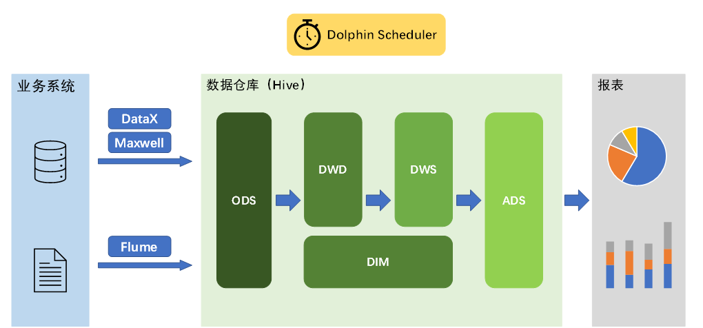

# 一、数仓概述

> 数据仓库是一个为数据分析而设计的企业级数据管理系统

## 核心架构

## 数仓建模的意义

> **将数据有序的组织和存储起来——为了得到三高一低**

[^数据模型]: 数据组织和存储方法         ==强调从业务、数据存取和使用角度合理存储数据==

| 三高一低 |                                                    |
| :------: | :------------------------------------------------: |
|  高性能  |               快速查询所需要的数据。               |
|  高质量  |   能改善数据统计口径的混乱，减少计算错误的可能性   |
|  高效率  | 极大的改善用户使用数据的体验，提高使用数据的效率。 |
|  低成本  |  减少重复计算，实现计算结果的复用，降低计算成本。  |

## 数仓建模方法论

### ER模型

------

> 数据仓库之父Bill Inmon提出的建模方法是从全企业的高度，用==实体关系（Entity Relationship，ER）模型==来描述企业业务，并用==规范化的方式==表示出来，在范式理论上==符合3NF==

**实体关系模型**

- 将复杂的数据抽象为两个概念——实体和关系

- [^例子]: 学生、班级，关系是指两个实体之间的关系，学生和班级之间的从属关系

**数据库==规范化==**

- 数据库规范化是使用一系列范式设计数据库（通常是关系型数据库）的过程，其目的是==减少数据冗余，增强数据的一致性==
- 关系型数据库的六种范式：第一范式（1NF）、第二范式（2NF）、第三范式（3NF）、巴斯-科德范式（BCNF）、第四范式(4NF）和第五范式（5NF）
- **遵循的范式级别越高，数据冗余性就越低**

#### ==三范式==

[^前置知识]:为了更好的理解三范式需要了解函数依赖

​																							样例表	

| ==学号== | 姓名 | 系名   | 系主任 | ==课名== | 分数 |
| -------- | ---- | ------ | ------ | -------- | ---- |
| 111      | 小明 | 经济系 | 小军   | 高数     | 92   |
| 111      | 小明 | 经济系 | 小军   | 大英     | 91   |
| 111      | 小明 | 经济系 | 小军   | 化学     | 95   |
| 112      | 小丽 | 经济系 | 小军   | 高数     | 89   |
| 112      | 小丽 | 经济系 | 小军   | 大英     | 90   |
| 112      | 小丽 | 经济系 | 小军   | 计算机   | 92   |
| 113      | 小芳 | 法律系 | 小李   | 高数     | 98   |
| 113      | 小芳 | 法律系 | 小李   | 法律     | 99   |

**完全函数依赖**

- 通过，(学号，课程) 推出分数 ，但是单独用学号推断不出来分数，那么就可以说：分数 完全依赖于(学号，课程) 

- [^一句话]: 函数  f（x ，z）= y   只有知道X 和 Z才能算出 Y  单独X  或 Z 无法得出  这就叫   完全函数依赖

**部分函数依赖**

- (学号，课程) 推出姓名，因为其实直接可以通过   学号推出姓名，所以：姓名 部分依赖于 (学号，课程)

- [^一句话]: 通过AB能得出C，通过A也能得出C，或者通过B也能得出C，那么说C部分依赖于AB

**传递函数依赖**

- 学号 推出 系名 ， 系名 推出 系主任， 但是，系主任推不出学号，系主任主要依赖于系名。这种情况可以说：系主任 传递依赖于 学号
- 通过A得到B，通过B得到C，但是**C得不到A**，那么说**C传递依赖于A**

##### 第一范式 

