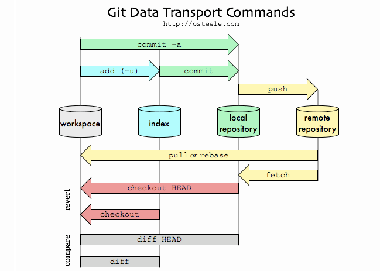
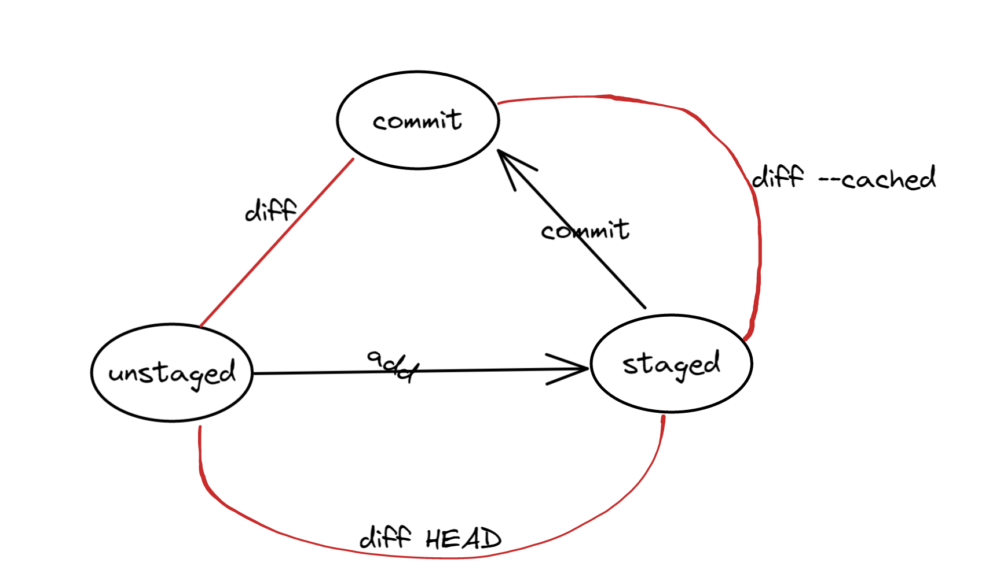
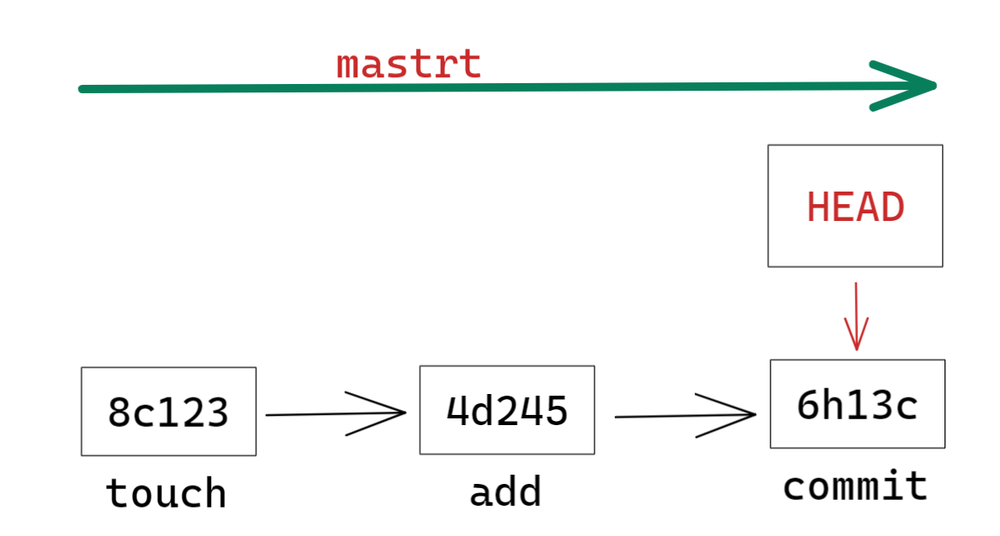
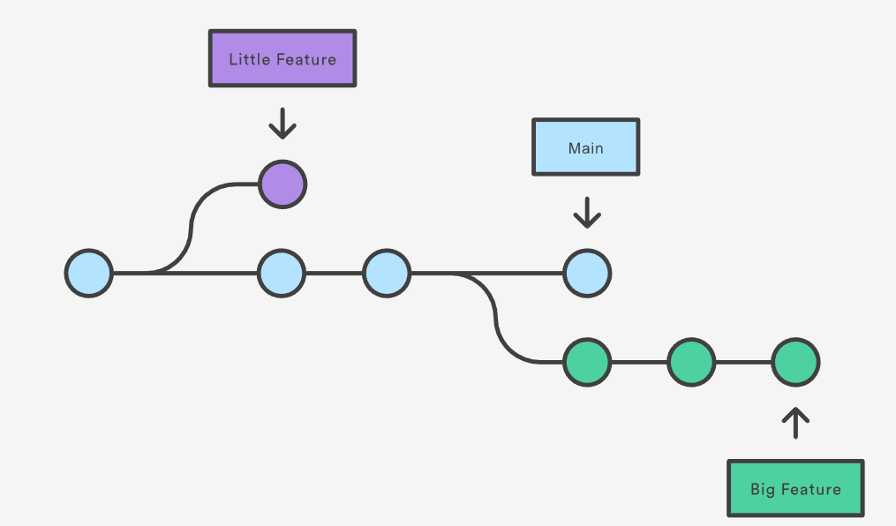
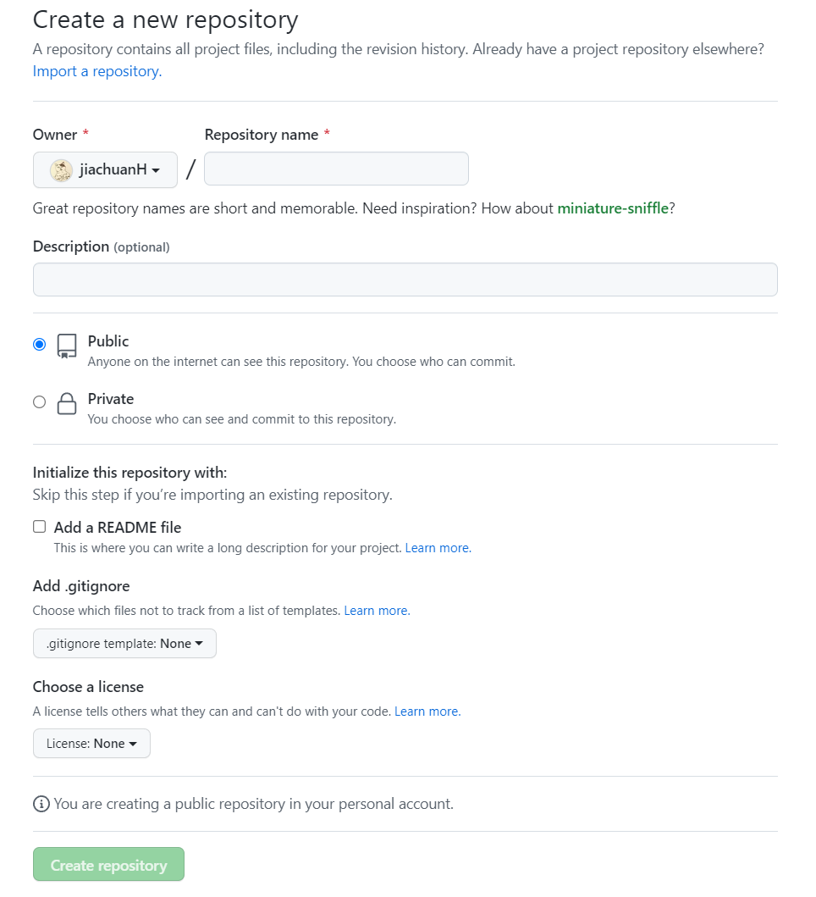
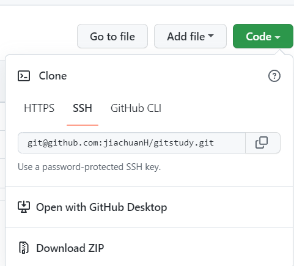
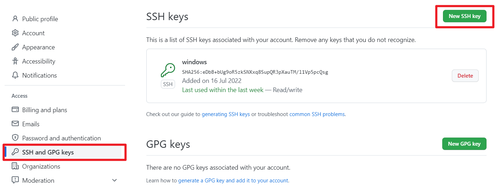
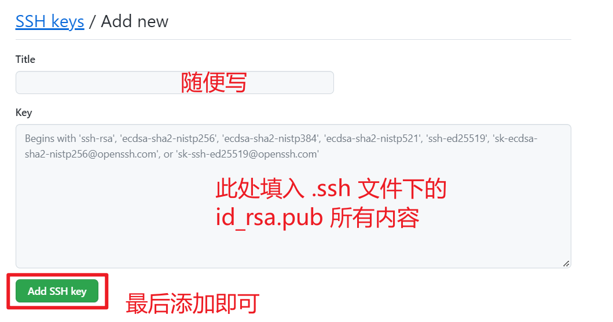
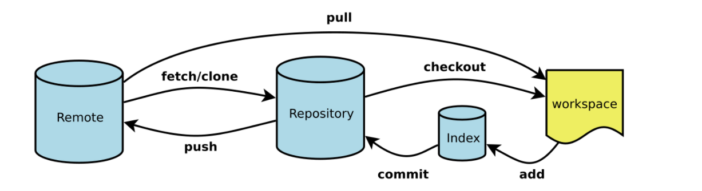

#  一、简介

> Git 是一个分布式版本控制系统. 它的灵活性, 优越性使得它从2005年发布以来. 获得了越来越多的使用和支持.

[Git 官网](https://git-scm.com/)

## Questions

**什么时候需要用 Git?**

- 当你已经成为码农, 或者已经在成为码农的路上;
- 当你觉得代码太多;
- 当你已经开始用日期或版本号命名的代码文件的时候.

 **什么文件可以被 Git 管理?**

- 文本文件 (.txt) 等;
- 脚本文件 (.py) 等;
- 各种基于文本信息的文件.

**什么文件不能被 Git 管理?**

- 图片文件 (.jpg) 等;
- MS word (.doc) 等.


## 安装

### Linux 系统

------


```sh
# 如果你的 Linux 是 Ubuntu:
$ sudo apt-get install git-all

# 如果你的 Linux 是 Fedora:
$ sudo yum install git-all
```

Linux 的更多 distribution 的安装, 请看[这里](https://git-scm.com/download/linux)


### MacOS 系统

------

Git 已经为 Mac 用户做好了一个安装包, 

我们可以在这里[下载并安装](https://git-scm.com/download/mac)


### Windows 系统

------

> Git 也为 Windows 系统提供了简易的 `.exe` 安装包, 直接从这里下载并安装就可以了: [点我](https://git-scm.com/download/win)
>
> 推荐使用默认安装参数, 然后一路下一步到底. 


安装好之后, 在你的所有程序中,

 将会出现 git 的文件夹,

 里面会有一个程序叫做 **git bash**

[^git bash]:git 在 Windows 上为了方便使用所设置的一个 Unix 的环境


# 二、创建/修改库

## 创建

- **创建windows文件夹**

- **鼠标右键打开git bash 进入该文件夹**

  或直接在该文件夹下面打开git bash

  ```sh
  $cd  文件夹路径
  ```

- **配置用户名和邮箱**

  ==注意：此处最好与GitHub或gitee对应==

  ```sh
  $ git config --global user.name "Morvan Zhou"
  
  $ git config --global user.email "mz@email.com"
  ```

- **初始化仓库**

  ```sh
  $ git init
  # Initialized empty Git repository in /Users/MorvanZhou/Desktop/gitTUT/.git/
  ```

  

## 查看文件状态

> 用 **status**来查看版本库的状态:

- **查看隐藏文件**

  ```sh
  $ ls -a
  # . ..  .git
  ```

- **创建文件**

  ```sh
  $touch ryan.py
  ```

- **用 status来查看状态**

  ```sh
  $ git status
  
  On branch main						👇main 分支
  Your branch is up to date with 'origin/main'.
  									
  Untracked files:
    (use "git add <file>..." to include in what will be committed)
          1.py
  		👆终端显示红色 表示未staged
  ```

- **精简模式**

  ```sh
  $git status -s
  ```

  


## 添加至暂存区

> 使用  **add**   命令将  **未staged**[^unstaged]  的文件添加至暂存区


- **使用 add 把它添加进版本库** [^(staged)]

```sh
$ git add 1.py

# 再次查看状态 status
$ git status

On branch main
Your branch is up to date with 'origin/main'.

Changes to be committed:
  (use "git restore --staged <file>..." to unstage)
        new file:   1.py
```


- **一次性添加**[^所有未被添加的文件]

```sh
$ git add .
```


## 提交改变 [^commit]

> 将暂存区的文件添加至 本地仓库[^local repository]
>

- **添加 -m  参数自定义这次改变的信息**


```sh
$ git commit -m "create 1.py"

# 输出
[master (root-commit) 6bd231e] create 1.py
 1 file changed, 0 insertions(+), 0 deletions(-)
 create mode 100644 1.py
```

- **添加所有文件至暂存区并commit**

  ```sh
  $git commit -am "change1"
  ```

  


​																					**流程图👇**



[^Workspace]: 工作区，就是你平时存放项目代码的地方
[^Index/Stage]:暂存区，用于临时存放你的改动，事实上它只是一个文件，保存即将提交到文件列 表信息
[^Repository]:仓库区（或本地仓库），就是安全存放数据的位置，这里面有你提交到所有版本的数 据。其中HEAD指向最新放入仓库的版本
[^Remote]:远程仓库，托管代码的服务器，可以简单的认为是你项目组中的一台电脑用于远程数据 交换


## Git管理文件的三种状态

- **已修改（modified）**
- **已暂存（staged）**
- **已提交   (committed)**


# 三、日志和状态区分

## 查看修改日志

- **查看日志**

  ```sh
  $ git log
  
  # 输出
  commit 13be9a7bf70c040544c6242a494206f240aac03c
  Author: Morvan Zhou <mz@email.com>
  Date:   Tue Nov 29 00:06:47 2016 +1100
  
      create 1.py # 这是我们记录的修改信息
  ```

  

- **每次修改只显示一行**

  ```sh
  $git log --oneline
  
  c02df44 (HEAD -> main, origin/main, origin/HEAD) change1
  6c456cc ddd
  4f528f1 test one
  a8f6b60 Initial commit
  
  ```

  


## 查看不同

​																			**流程环👇**



- **查看unstaged和commit区别**

  [^注意]: 此处的commit为上一次的commit

  ```sh
  $git diff
  ```

- **查看unstaged和staged的区别**

  ```sh
  $git diff HEAD
  ```

- **查看staged和commit区别**

  ```sh
  $git diff --cached
  ```


|   区别   |                            |
| :------: | :------------------------: |
| unstaged | 修改但未添加[^add]至暂存区 |
|  staged  | add之后在 暂存区的文件状态 |


# 三、回到之前

> 背景：以经commit  但是忘记附上一个文件

- **将文件添加至暂存区**

  ```sh
  $ git add 2.py
  ```

- **使用命令**

  ```sh
  $git commit --amend --no-edit
  ```

  [^命令介绍]: "--no-edit": 不编辑, 直接合并到上一个 commit

- **查看日志**

  ```sh
  $ git log --oneline
  ```

  


## Reset

### 返回Unstaged状态

> 背景一： 已经add 了  但是还行补充些内容


- **执行如下命令**

  ```sh
  $ git reset 1.py
  ```

- **添加补充内容重新add**


### 返回上一次操作

> 背景二： 返回之前的commit或上一次操作


​																==git中每一次操作都有一个编号==



- **add已经修改的文件**

  ```sh
  $git add 1.py
  ```

- **返回add前**

  ```sh
  $git reset --hard HEAD
  ```


### 返回之前的commit

- 方式一 ：返回上次commit

  ```sh
  $git reset --hard HEAD^
  ```

- 方式二

  ```sh
  #返回前1个commit
  $git reset --hard HEAD~
  
  #返回前100个commit
  $git reset --hard HEAD~100
  ```


### 返回之后  后悔    想回到未来

- **通过命令查看所有编号**

  ```sh
  $git reflog
  
  # 输出
  c6762a1 HEAD@{0}: reset: moving to c6762a1
  904e1ba HEAD@{1}: commit (amend): change 2
  0107760 HEAD@{2}: commit: change 2
  c6762a1 HEAD@{3}: commit: change 1
  13be9a7 HEAD@{4}: commit (initial): create 1.py
  ```

- **reset到未来**

  ```sh
  $ git reset --hard 904e1ba
  ```


## checkout

> 该命令主要针对单个文件

**checkout的两个用途**

- 单个文件回到过去
- 管理分支

==本章主要介绍单文件回到过去==


**将已经commit的文件1.py返回到commit之前**

- **查看之前的commit编号**

  ```sh
  $ git log --oneline
  
  # 输出
  904e1ba change 2
  c6762a1 change 1
  13be9a7 create 1.py
  ---------------------
  ```

- **使用命令**

  ​										👇编号	       👇文件名

  ```sh
  $ git checkout c6762a1 -- 1.py
  ```

  ​													 👆注意空格

- **修改之后重新add并commit**


**🎉回去了过去, 并改写了未来.🎉**


# 四、分支管理

> 背景介绍：分支诞生的原因
>
> 一个项目的主分支为 稳定版 供使用不能随便修改   
>
> 而dev分支为开发分支负责项目的更新迭代



## 常用操作

- **查看分支**

  ```sh
  $ git log --oneline --graph
  
  $ git branch 
  ```

- **创建分支**

  - **branch**

    ```sh
    $ git branch dev    # 建立 dev 分支
    $ git branch        # 查看当前分支
    
    # 输出
      dev       
    * master    # * 代表了当前的 HEAD 所在的分支
    ```

  - **cheakout**

    ```sh
    #👇直接创建和切换到新建的分支
    $ git checkout -b  dev
    
    # 输出
    Switched to a new branch 'dev'
    --------------------------
    $ git branch
    
    # 输出
    * dev       # 这时 HEAD 已经被切换至 dev 分支
      master
    ```
  
- **切换分支**

  ```sh
  $ git checkout dev
  
  # 输出
  Switched to branch 'dev'
  --------------------------
  $ git branch
  
  # 输出
  * dev       # 这时 HEAD 已经被切换至 dev 分支
    master
  ```

- **在dev分支修改**

  ```sh
  $ git commit -am "change 3 in dev"  # "-am": add 所有改变 并直接 commit
  ```

- **将dev修改推送到main**

  ```sh
  $ git checkout master   # 切换至 master 才能把其他分支合并过来
  
  $ git merge dev         # 将 dev merge 到 master 中
  $ git log --oneline --graph
  
  # 输出
  * f9584f8 change 3 in dev
  * 47f167e back to change 1 and add comment for 1.py
  * 904e1ba change 2
  * c6762a1 change 1
  * 13be9a7 create 1.py
  ```

  

==注意：==直接merge的话不会有commit信息  使用如下命令保留信息

```sh
$ git merge --no-ff -m "keep merge info" dev         # 保留 merge 信息
$ git log --oneline --graph

# 输出
*   c60668f keep merge info
|\  
| * f9584f8 change 3 in dev         # 这里就能看出, 我们建立过一个分支
|/  
* 47f167e back to change 1 and add comment for 1.py
* 904e1ba change 2
* c6762a1 change 1
* 13be9a7 create 1.py
```


## 分支冲突

### merge

------

> 背景介绍：两个分支同时修改项目文件  在merge时  git不知道怎么处理不同的修改


**举个栗子🌰**

- **main分支中    1.py   加上 #I am main**
- **dev分支中的   1.py   加上#I  am  dev**


**直接merge   dev  到    main  **

- ```sh
  $ git branch
    dev
  * master
  -------------------------
  $ git merge dev
  
  # 输出
  Auto-merging 1.py
  CONFLICT (content): Merge conflict in 1.py
  Automatic merge failed; fix conflicts and then commit the result.
  ```

   git 直接提示冲突


**解决流程**

- 打开冲突文件  修改冲突内容

- commit

  ```sh
  $ git commit -am "solve conflict"
  ```

- 冲突解决


### rebase

------

> 背景介绍：主分支有紧急BUG更新  而我在dev分支想试试和我的是否兼容
>

==只能在你自己的分支中使用 rebase, 和别人共享的部分[^main主分支]是不能用==

**主要流程**

- **查看两条分支的 log**

  ```sh
  # 这是 master 的 log
  * 3d7796e change 4 in master # 这一条 commit 和 dev 的不一样
  * 47f167e back to change 1 and add comment for 1.py    👈注意
  * 904e1ba change 2
  * c6762a1 change 1
  * 13be9a7 create 1.py
  -----------------------------
  # 这是 dev 的 log
  * f7d2e3a change 3 in dev   # 这一条 commit 和 master 的不一样
  * 47f167e back to change 1 and add comment for 1.py	   👈注意
  * 904e1ba change 2
  * c6762a1 change 1
  * 13be9a7 create 1.py
  ```

- **rebase合并dev到master**

  ```sh
  $ git branch
  
  # 输出
    dev
  * master
  -------------------------
  $ git rebase dev 
  
  # 输出
  First, rewinding head to replay your work on top of it...
  Applying: change 3 in dev
  Using index info to reconstruct a base tree...
  M   1.py
  Falling back to patching base and 3-way merge...
  Auto-merging 1.py
  CONFLICT (content): Merge conflict in 1.py  	👈#提示冲突
  error: Failed to merge in the changes.
  Patch failed at 0001 change 3 in dev
  The copy of the patch that failed is found in: .git/rebase-apply/patch
  
  When you have resolved this problem, run "git rebase --continue".
  If you prefer to skip this patch, run "git rebase --skip" instead.
  To check out the original branch and stop rebasing, run "git rebase --abort".
  ```

- **打开冲突文件手动解决冲突**

- **查看分支**

  ```sh
  $ git branch
  * (no branch, rebasing master) # HEAD 在这
    dev
    master
  ```

  ​	此时解决冲突后的文件在一个新的空间  不在任何一个分支上

- **将解决后的文件add**

  ```sh
  $git add 1.py
  ```

- **继续rebase**

  ```sh
  #继续
  git rebase --continue
  #跳过
  git rebase --skip
  #抛弃
  git rebase --abort
  ```

- **查看主分支的log**

  ```sh
  $ git log --oneline --graph
  
  # 输出
  * c844cb1 change 4 in master    # 这条 commit 原本的id=3d7796e, 所以 master 的历史被修改
  * f7d2e3a change 3 in dev       # 🚩rebase 过来的 dev commit
  * 47f167e back to change 1 and add comment for 1.py
  * 904e1ba change 2
  * c6762a1 change 1
  * 13be9a7 create 1.py
  ```

  


## 临时修改

> 背景介绍：在dev上开发  忽然发现需要修改之前的一个程序
>
> 强迫症：不想把要改的程序和自己改进代码的部分一起

- **使用如下命令将dev暂存至一边**

  ```sh
  $ git stash
  # 输出
  Saved working directory and index state WIP on dev: f7d2e3a change 3 in dev
  HEAD is now at f7d2e3a change 3 in dev
  ```

- **修改之前的程序**

  - **新建分支**

    ```sh
    $ git checkout -b boss
    
    # 输出
    Switched to a new branch 'boss' # 创建并切换到 boss
    ```

  - **去做老板的任务commit并合并**

    ```sh
    $ git commit -am "job from boss"
    $ git checkout master
    $ git merge --no-ff -m "merged boss job" boss
    ```

  - **有冲突的话像之前那样解决**

    ```sh
    $ git commit -am "solve conflict"
    ```

- **恢复暂存**

  ```sh
  $ git checkout dev
  $ git stash list    # 查看在 stash 中的缓存
  
  # 输出
  stash@{0}: WIP on dev: f7d2e3a change 3 in dev
  ```

- **通过pop提取这个并继续工作了**

  ```sh
  $ git stash pop
  
  # 输出
  On branch dev
  Changes not staged for commit:
    (use "git add <file>..." to update what will be committed)
    (use "git checkout -- <file>..." to discard changes in working directory)
  
      modified:   1.py
  
  no changes added to commit (use "git add" and/or "git commit -a")
  Dropped refs/stash@{0} (23332b7edc105a579b09b127336240a45756a91c)
  ----------------------
  $ git status -s
  # 输出
   M 1.py     # 和最开始一样
  ```


# 五、Github

## 建立github仓库

- 创建GitHub账号

- 创建仓库

  


## 连接至本地仓库

> GitHub已修改主分支名称为main  在推送时不要用master


==注意：Github从2021年8月13号开始不支持密码身份验证==

[^解释]: 就是在配置连接github仓库时  不要用  https  连接   要使用SSH



## 配置国内镜像

```sh
git config --global url."https://hub.fastgit.xyz/".insteadOf "https://github.com/"
git config protocol.https.allow always
```


### SSH连接配置

------

- **生成私钥**

  ```sh
  ssh-keygen -t rsa -C "xx.xx@qq.com"
  						👆此处最好为GitHub或gitee邮箱
  ```

  [^私钥位置]: 一般在C:\Users\\.ssh下面

- **配置私钥**

  进入settings下

  

  


### 连接本地版本库

------


- **配置SSH链接**

  ```sh
  $ git remote add origin git@github.com:jiachuanH/gitstudy.git
  ```

- **推送本地 main 去 origin**

  ```sh
  $ git push -u origin main
  ```

-  **推送本地 dev  去 origin**

  ```sh
  $ git push -u origin dev
  ```

  

## 推送修改

> 在本地再进行修改, 比如在 1.py 文件中加上 # happy github  然后    commit并推上去


```sh
$ git commit -am "change 5"
$ git push -u origin master
```


# 六、常用命令




